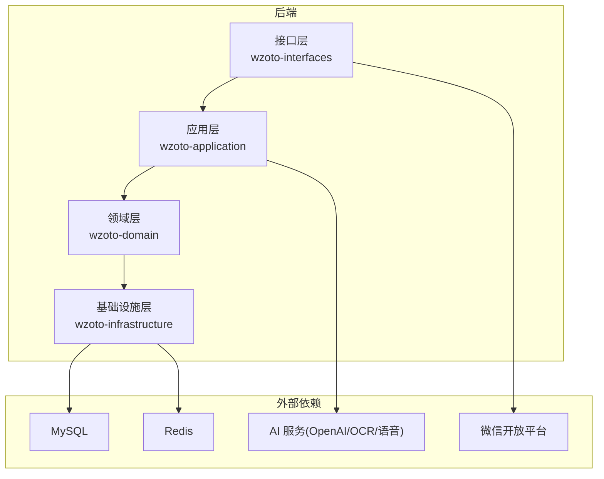
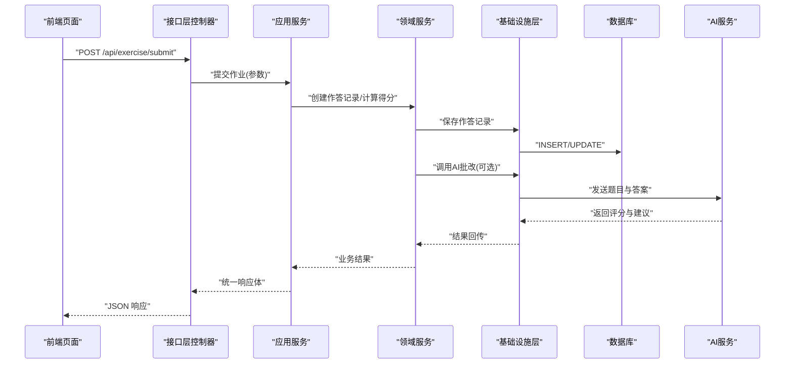
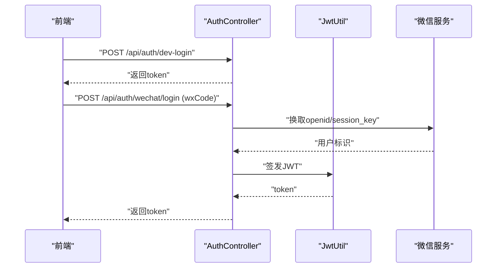
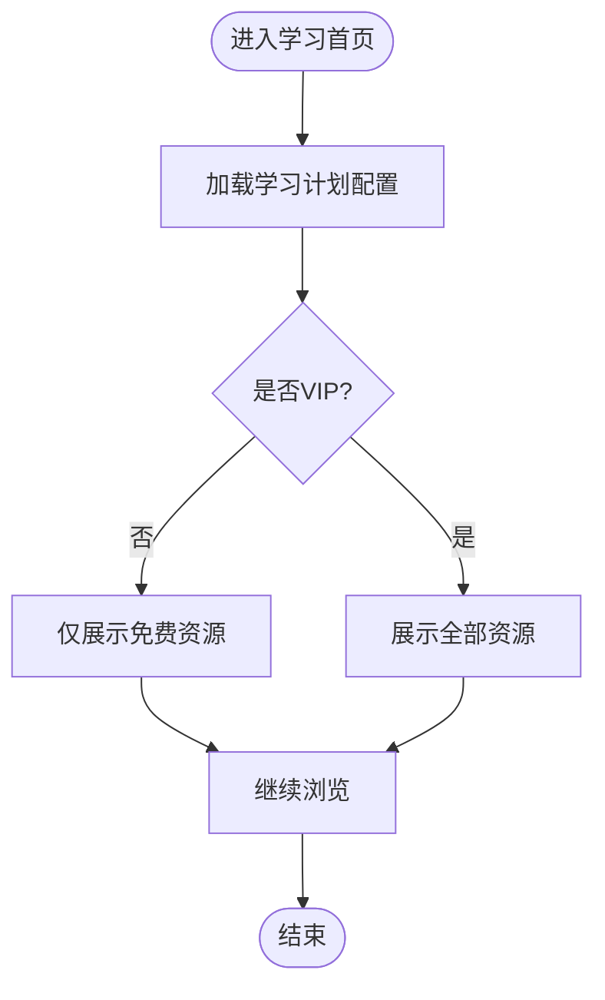
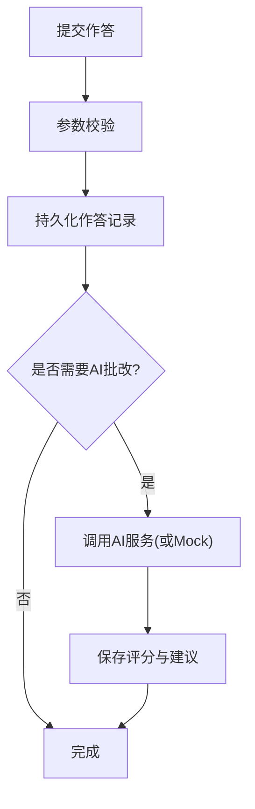
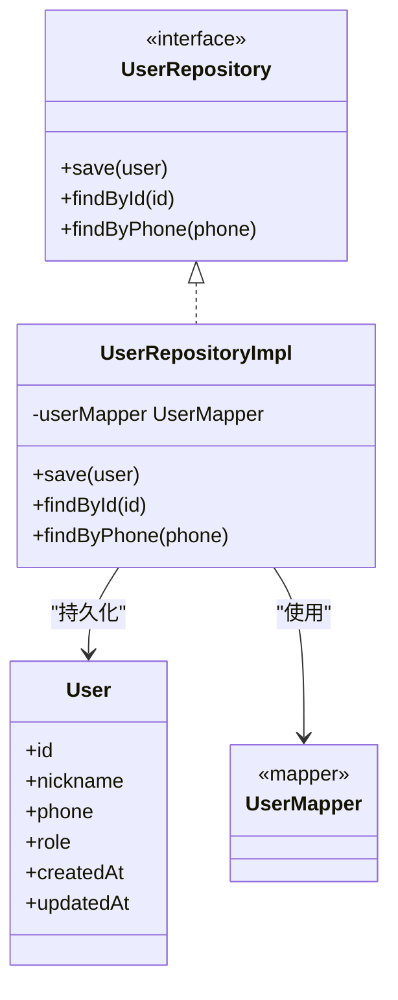
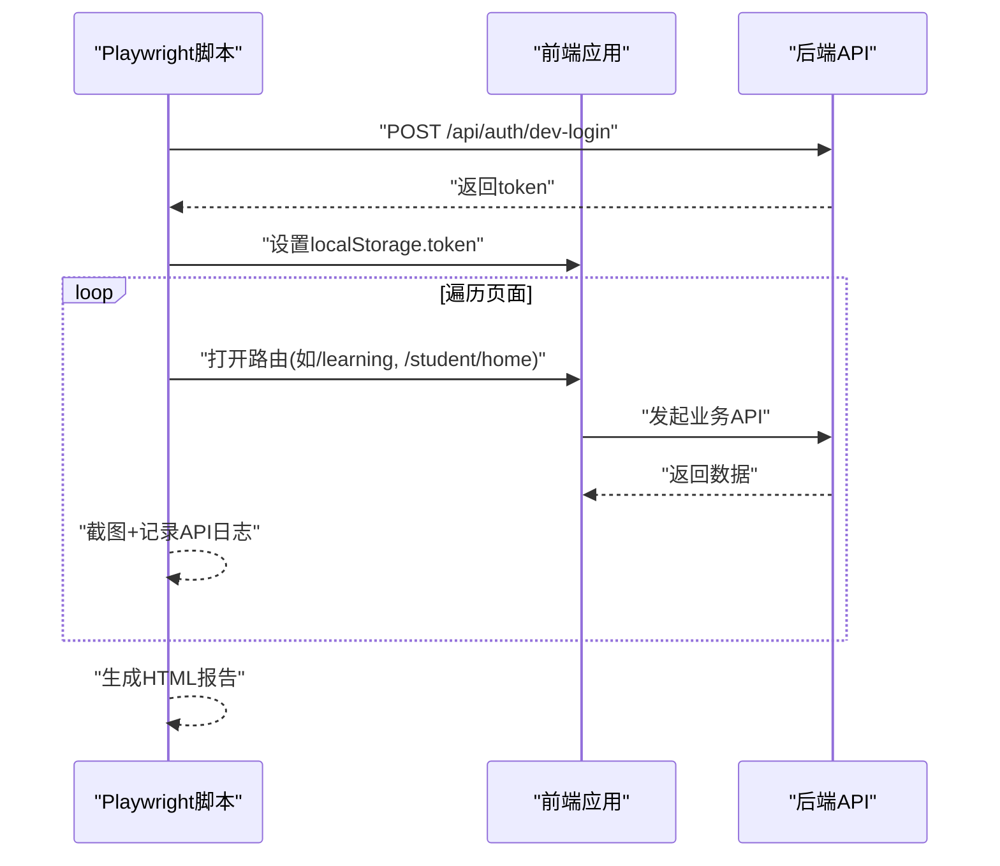
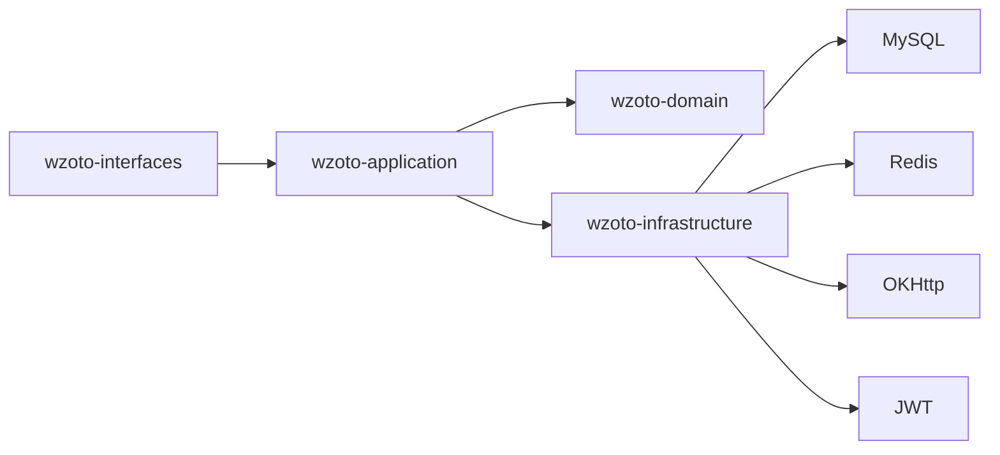

# 集成测试

<cite>
**本文引用的文件**
- [wzoto-backend/pom.xml](file://wzoto-backend/pom.xml)
- [wzoto-backend/wzoto-interfaces/pom.xml](file://wzoto-backend/wzoto-interfaces/pom.xml)
- [wzoto-backend/wzoto-application/pom.xml](file://wzoto-backend/wzoto-application/pom.xml)
- [wzoto-backend/wzoto-infrastructure/pom.xml](file://wzoto-backend/wzoto-infrastructure/pom.xml)
- [wzoto-backend/sql/init_test_data.sql](file://wzoto-backend/sql/init_test_data.sql)
- [wzoto-backend/sql/init_all_learning_tables.sql](file://wzoto-backend/sql/init_all_learning_tables.sql)
- [wzoto-backend/wzoto-interfaces/src/main/java/com/wzoto/interfaces/controller/AuthController.java](file://wzoto-backend/wzoto-interfaces/src/main/java/com/wzoto/interfaces/controller/AuthController.java)
- [wzoto-backend/wzoto-interfaces/src/main/java/com/wzoto/interfaces/controller/LearningResourceController.java](file://wzoto-backend/wzoto-interfaces/src/main/java/com/wzoto/interfaces/controller/LearningResourceController.java)
- [wzoto-backend/wzoto-interfaces/src/main/java/com/wzoto/interfaces/controller/LearningTaskController.java](file://wzoto-backend/wzoto-interfaces/src/main/java/com/wzoto/interfaces/controller/LearningTaskController.java)
- [wzoto-backend/wzoto-interfaces/src/main/java/com/wzoto/interfaces/controller/ExerciseController.java](file://wzoto-backend/wzoto-interfaces/src/main/java/com/wzoto/interfaces/controller/ExerciseController.java)
- [wzoto-backend/wzoto-interfaces/src/main/java/com/wzoto/interfaces/dto/Dtos/AiQaAskDTO.java](file://wzoto-backend/wzoto-interfaces/src/main/java/com/wzoto/interfaces/dto/AiQaAskDTO.java)
- [wzoto-backend/wzoto-interfaces/src/main/java/com/wzoto/interfaces/dto/Dtos/WxLoginDTO.java](file://wzoto-backend/wzoto-interfaces/src/main/java/com/wzoto/interfaces/dto/Dtos/WxLoginDTO.java)
- [wzoto-backend/wzoto-infrastructure/src/main/java/com/wzoto/infrastructure/ai/MockAiGenerator.java](file://wzoto-backend/wzoto-infrastructure/src/main/java/com/wzoto/infrastructure/ai/MockAiGenerator.java)
- [wzoto-backend/wzoto-infrastructure/src/main/java/com/wzoto/infrastructure/config/WechatProperties.java](file://wzoto-backend/wzoto-infrastructure/src/main/java/com/wzoto/infrastructure/config/WechatProperties.java)
- [wzoto-backend/wzoto-infrastructure/src/main/java/com/wzoto/infrastructure/util/JwtUtil.java](file://wzoto-backend/wzoto-infrastructure/src/main/java/com/wzoto/infrastructure/util/JwtUtil.java)
- [wzoto-backend/wzoto-infrastructure/src/main/java/com/wzoto/infrastructure/mapper/UserMapper.java](file://wzoto-backend/wzoto-infrastructure/src/main/java/com/wzoto/infrastructure/mapper/UserMapper.java)
- [wzoto-backend/wzoto-infrastructure/src/main/java/com/wzoto/infrastructure/repository/UserRepositoryImpl.java](file://wzoto-backend/wzoto-infrastructure/src/main/java/com/wzoto/infrastructure/repository/UserRepositoryImpl.java)
- [wzoto-backend/wzoto-domain/src/main/java/com/wzoto/domain/entity/User.java](file://wzoto-backend/wzoto-domain/src/main/java/com/wzoto/domain/entity/User.java)
- [wzoto-backend/wzoto-domain/src/main/java/com/wzoto/domain/repository/UserRepository.java](file://wzoto-backend/wzoto-domain/src/main/java/com/wzoto/domain/repository/UserRepository.java)
- [wzoto-backend/wzoto-application/src/main/java/com/wzoto/application/service/AuthApplicationService.java](file://wzoto-backend/wzoto-application/src/main/java/com/wzoto/application/service/AuthApplicationService.java)
- [wzoto-backend/wzoto-interfaces/src/main/resources/application.yml](file://wzoto-backend/wzoto-interfaces/src/main/resources/application.yml)
- [wzoto-frontend/tests/auto-test.mjs](file://wzoto-frontend/tests/auto-test.mjs)
</cite>

## 目录
1. [简介](#简介)
2. [项目结构](#项目结构)
3. [核心组件](#核心组件)
4. [架构总览](#架构总览)
5. [详细组件分析](#详细组件分析)
6. [依赖分析](#依赖分析)
7. [性能考虑](#性能考虑)
8. [故障排查指南](#故障排查指南)
9. [结论](#结论)
10. [附录](#附录)

## 简介
本文件为 wzoto 项目的集成测试详细文档，覆盖以下目标：
- API 接口集成测试：基于 Spring Boot Test 与 Testcontainers 的数据库集成测试，验证 REST API 完整业务流程。
- 前后端集成测试：使用 Playwright（前端自动化脚本）与 Postman/脚本进行端到端测试，覆盖请求响应、数据持久化与事务处理。
- 第三方服务集成测试：微信登录、AI 服务调用的模拟与测试策略。
- 测试环境配置：测试数据库初始化、测试数据准备、环境变量管理。
- 具体用例示例：用户注册登录、课程学习、作业提交等完整业务流程的测试实现路径与断言要点。

## 项目结构
后端采用 DDD 分层架构，包含领域层、应用层、基础设施层与接口层；前端提供 Playwright 自动化脚本用于端到端测试。SQL 脚本提供测试库结构与初始数据。

**图示来源**
- [wzoto-backend/pom.xml:21-26](file://wzoto-backend/pom.xml#L21-L26)
- [wzoto-backend/wzoto-interfaces/pom.xml:16-41](file://wzoto-backend/wzoto-interfaces/pom.xml#L16-L41)
- [wzoto-backend/wzoto-infrastructure/pom.xml:16-71](file://wzoto-backend/wzoto-infrastructure/pom.xml#L16-L71)

**章节来源**
- [wzoto-backend/pom.xml:1-126](file://wzoto-backend/pom.xml#L1-L126)
- [wzoto-backend/wzoto-interfaces/pom.xml:1-60](file://wzoto-backend/wzoto-interfaces/pom.xml#L1-L60)
- [wzoto-backend/wzoto-application/pom.xml:1-43](file://wzoto-backend/wzoto-application/pom.xml#L1-L43)
- [wzoto-backend/wzoto-infrastructure/pom.xml:1-73](file://wzoto-backend/wzoto-infrastructure/pom.xml#L1-L73)

## 核心组件
- 认证与授权：AuthController 暴露登录、开发模式快捷登录等接口；JwtUtil 负责令牌签发与校验；WechatProperties 管理微信相关配置。
- 学习与任务：LearningResourceController、LearningTaskController 提供资源与任务查询/操作；ExerciseController 提供练习与作答相关能力。
- 数据访问：UserMapper/UserRepositoryImpl 实现用户数据持久化；领域实体 User 定义业务模型。
- 第三方服务：MockAiGenerator 提供 AI 能力模拟；OcrService/SpeechService/OpenAiHttpGenerator 封装外部调用。
- 测试数据：init_all_learning_tables.sql 构建测试库结构；init_test_data.sql 注入基础数据。

**章节来源**
- [wzoto-backend/wzoto-interfaces/src/main/java/com/wzoto/interfaces/controller/AuthController.java](file://wzoto-backend/wzoto-interfaces/src/main/java/com/wzoto/interfaces/controller/AuthController.java)
- [wzoto-backend/wzoto-infrastructure/src/main/java/com/wzoto/infrastructure/util/JwtUtil.java](file://wzoto-backend/wzoto-infrastructure/src/main/java/com/wzoto/infrastructure/util/JwtUtil.java)
- [wzoto-backend/wzoto-infrastructure/src/main/java/com/wzoto/infrastructure/config/WechatProperties.java](file://wzoto-backend/wzoto-infrastructure/src/main/java/com/wzoto/infrastructure/config/WechatProperties.java)
- [wzoto-backend/wzoto-interfaces/src/main/java/com/wzoto/interfaces/controller/LearningResourceController.java](file://wzoto-backend/wzoto-interfaces/src/main/java/com/wzoto/interfaces/controller/LearningResourceController.java)
- [wzoto-backend/wzoto-interfaces/src/main/java/com/wzoto/interfaces/controller/LearningTaskController.java](file://wzoto-backend/wzoto-interfaces/src/main/java/com/wzoto/interfaces/controller/LearningTaskController.java)
- [wzoto-backend/wzoto-interfaces/src/main/java/com/wzoto/interfaces/controller/ExerciseController.java](file://wzoto-backend/wzoto-interfaces/src/main/java/com/wzoto/interfaces/controller/ExerciseController.java)
- [wzoto-backend/wzoto-infrastructure/src/main/java/com/wzoto/infrastructure/mapper/UserMapper.java](file://wzoto-backend/wzoto-infrastructure/src/main/java/com/wzoto/infrastructure/mapper/UserMapper.java)
- [wzoto-backend/wzoto-infrastructure/src/main/java/com/wzoto/infrastructure/repository/UserRepositoryImpl.java](file://wzoto-backend/wzoto-infrastructure/src/main/java/com/wzoto/infrastructure/repository/UserRepositoryImpl.java)
- [wzoto-backend/wzoto-domain/src/main/java/com/wzoto/domain/entity/User.java](file://wzoto-backend/wzoto-domain/src/main/java/com/wzoto/domain/entity/User.java)
- [wzoto-backend/wzoto-infrastructure/src/main/java/com/wzoto/infrastructure/ai/MockAiGenerator.java](file://wzoto-backend/wzoto-infrastructure/src/main/java/com/wzoto/infrastructure/ai/MockAiGenerator.java)
- [wzoto-backend/sql/init_all_learning_tables.sql](file://wzoto-backend/sql/init_all_learning_tables.sql)
- [wzoto-backend/sql/init_test_data.sql](file://wzoto-backend/sql/init_test_data.sql)

## 架构总览
下图展示一次“学生提交作业”的端到端调用链：前端通过浏览器触发请求，后端 Controller 编排应用服务，领域服务执行业务规则，基础设施层完成数据持久化与第三方调用（如 AI 批改）。

**图示来源**
- [wzoto-backend/wzoto-interfaces/src/main/java/com/wzoto/interfaces/controller/ExerciseController.java](file://wzoto-backend/wzoto-interfaces/src/main/java/com/wzoto/interfaces/controller/ExerciseController.java)
- [wzoto-backend/wzoto-application/src/main/java/com/wzoto/application/service/AuthApplicationService.java](file://wzoto-backend/wzoto-application/src/main/java/com/wzoto/application/service/AuthApplicationService.java)
- [wzoto-backend/wzoto-infrastructure/src/main/java/com/wzoto/infrastructure/ai/MockAiGenerator.java](file://wzoto-backend/wzoto-infrastructure/src/main/java/com/wzoto/infrastructure/ai/MockAiGenerator.java)
- [wzoto-backend/wzoto-infrastructure/src/main/java/com/wzoto/infrastructure/repository/UserRepositoryImpl.java](file://wzoto-backend/wzoto-infrastructure/src/main/java/com/wzoto/infrastructure/repository/UserRepositoryImpl.java)

## 详细组件分析

### 认证与登录流程（含微信登录与开发模式）
- 开发模式快捷登录：前端脚本直接调用后端开发接口获取 token，便于自动化流程快速进入系统。
- 微信登录：通过 WechatProperties 读取配置，结合 JwtUtil 生成令牌；在测试中可切换 Mock 或真实回调。
- JWT 校验：拦截器或过滤器在后续请求中校验令牌有效性。

**图示来源**
- [wzoto-backend/wzoto-interfaces/src/main/java/com/wzoto/interfaces/controller/AuthController.java](file://wzoto-backend/wzoto-interfaces/src/main/java/com/wzoto/interfaces/controller/AuthController.java)
- [wzoto-backend/wzoto-infrastructure/src/main/java/com/wzoto/infrastructure/config/WechatProperties.java](file://wzoto-backend/wzoto-infrastructure/src/main/java/com/wzoto/infrastructure/config/WechatProperties.java)
- [wzoto-backend/wzoto-infrastructure/src/main/java/com/wzoto/infrastructure/util/JwtUtil.java](file://wzoto-backend/wzoto-infrastructure/src/main/java/com/wzoto/infrastructure/util/JwtUtil.java)

**章节来源**
- [wzoto-frontend/tests/auto-test.mjs:67-80](file://wzoto-frontend/tests/auto-test.mjs#L67-L80)
- [wzoto-backend/wzoto-interfaces/src/main/java/com/wzoto/interfaces/controller/AuthController.java](file://wzoto-backend/wzoto-interfaces/src/main/java/com/wzoto/interfaces/controller/AuthController.java)
- [wzoto-backend/wzoto-infrastructure/src/main/java/com/wzoto/infrastructure/config/WechatProperties.java](file://wzoto-backend/wzoto-infrastructure/src/main/java/com/wzoto/infrastructure/config/WechatProperties.java)
- [wzoto-backend/wzoto-infrastructure/src/main/java/com/wzoto/infrastructure/util/JwtUtil.java](file://wzoto-backend/wzoto-infrastructure/src/main/java/com/wzoto/infrastructure/util/JwtUtil.java)

### 学习资源与学习计划
- 资源浏览：LearningResourceController 提供资源列表、详情、权限控制（免费/VIP）。
- 计划下发：LearningPlanConfig 与 LearningTask 关联，支持按学科权重与每日时长下发任务。
- 测试要点：验证过滤条件、权限拦截、任务状态流转。

**图示来源**
- [wzoto-backend/wzoto-interfaces/src/main/java/com/wzoto/interfaces/controller/LearningResourceController.java](file://wzoto-backend/wzoto-interfaces/src/main/java/com/wzoto/interfaces/controller/LearningResourceController.java)
- [wzoto-backend/wzoto-interfaces/src/main/java/com/wzoto/interfaces/controller/LearningTaskController.java](file://wzoto-backend/wzoto-interfaces/src/main/java/com/wzoto/interfaces/controller/LearningTaskController.java)

**章节来源**
- [wzoto-backend/wzoto-interfaces/src/main/java/com/wzoto/interfaces/controller/LearningResourceController.java](file://wzoto-backend/wzoto-interfaces/src/main/java/com/wzoto/interfaces/controller/LearningResourceController.java)
- [wzoto-backend/wzoto-interfaces/src/main/java/com/wzoto/interfaces/controller/LearningTaskController.java](file://wzoto-backend/wzoto-interfaces/src/main/java/com/wzoto/interfaces/controller/LearningTaskController.java)

### 作业提交与 AI 批改
- 提交作业：ExerciseController 接收作答数据，应用服务编排领域逻辑，持久化作答记录。
- AI 批改：基础设施层调用 OpenAiHttpGenerator/OcrService/SpeechService，或在测试中使用 MockAiGenerator 返回固定结果。
- 断言要点：作答记录入库、分数/评语正确、重试/超时容错。

**图示来源**
- [wzoto-backend/wzoto-interfaces/src/main/java/com/wzoto/interfaces/controller/ExerciseController.java](file://wzoto-backend/wzoto-interfaces/src/main/java/com/wzoto/interfaces/controller/ExerciseController.java)
- [wzoto-backend/wzoto-infrastructure/src/main/java/com/wzoto/infrastructure/ai/MockAiGenerator.java](file://wzoto-backend/wzoto-infrastructure/src/main/java/com/wzoto/infrastructure/ai/MockAiGenerator.java)

**章节来源**
- [wzoto-backend/wzoto-interfaces/src/main/java/com/wzoto/interfaces/controller/ExerciseController.java](file://wzoto-backend/wzoto-interfaces/src/main/java/com/wzoto/interfaces/controller/ExerciseController.java)
- [wzoto-backend/wzoto-infrastructure/src/main/java/com/wzoto/infrastructure/ai/MockAiGenerator.java](file://wzoto-backend/wzoto-infrastructure/src/main/java/com/wzoto/infrastructure/ai/MockAiGenerator.java)

### 用户与数据访问
- 领域模型：User 定义用户核心属性与行为。
- 数据映射：UserMapper 与 UserRepositoryImpl 实现 MyBatis-Plus 的数据访问。
- 测试关注点：CRUD 一致性、事务边界、并发安全。

**图示来源**
- [wzoto-backend/wzoto-domain/src/main/java/com/wzoto/domain/entity/User.java](file://wzoto-backend/wzoto-domain/src/main/java/com/wzoto/domain/entity/User.java)
- [wzoto-backend/wzoto-domain/src/main/java/com/wzoto/domain/repository/UserRepository.java](file://wzoto-backend/wzoto-domain/src/main/java/com/wzoto/domain/repository/UserRepository.java)
- [wzoto-backend/wzoto-infrastructure/src/main/java/com/wzoto/infrastructure/repository/UserRepositoryImpl.java](file://wzoto-backend/wzoto-infrastructure/src/main/java/com/wzoto/infrastructure/repository/UserRepositoryImpl.java)
- [wzoto-backend/wzoto-infrastructure/src/main/java/com/wzoto/infrastructure/mapper/UserMapper.java](file://wzoto-backend/wzoto-infrastructure/src/main/java/com/wzoto/infrastructure/mapper/UserMapper.java)

**章节来源**
- [wzoto-backend/wzoto-domain/src/main/java/com/wzoto/domain/entity/User.java](file://wzoto-backend/wzoto-domain/src/main/java/com/wzoto/domain/entity/User.java)
- [wzoto-backend/wzoto-domain/src/main/java/com/wzoto/domain/repository/UserRepository.java](file://wzoto-backend/wzoto/domain/repository/UserRepository.java)
- [wzoto-backend/wzoto-infrastructure/src/main/java/com/wzoto/infrastructure/repository/UserRepositoryImpl.java](file://wzoto-backend/wzoto-infrastructure/src/main/java/com/wzoto/infrastructure/repository/UserRepositoryImpl.java)
- [wzoto-backend/wzoto-infrastructure/src/main/java/com/wzoto/infrastructure/mapper/UserMapper.java](file://wzoto-backend/wzoto-infrastructure/src/main/java/com/wzoto/infrastructure/mapper/UserMapper.java)

### 前后端集成测试（Playwright 自动化）
- 登录流程：前端脚本调用开发模式登录接口，将 token 写入本地存储，随后导航至各页面。
- 页面遍历：依次访问家长端与学生端关键页面，截图并记录 API 响应。
- 报告生成：汇总截图与 API 日志，输出 HTML 报告。

**图示来源**
- [wzoto-frontend/tests/auto-test.mjs:67-80](file://wzoto-frontend/tests/auto-test.mjs#L67-L80)
- [wzoto-frontend/tests/auto-test.mjs:82-248](file://wzoto-frontend/tests/auto-test.mjs#L82-L248)
- [wzoto-frontend/tests/auto-test.mjs:251-360](file://wzoto-frontend/tests/auto-test.mjs#L251-L360)

**章节来源**
- [wzoto-frontend/tests/auto-test.mjs:1-366](file://wzoto-frontend/tests/auto-test.mjs#L1-L366)

## 依赖分析
- 模块依赖：接口层依赖应用层与基础设施层；应用层依赖领域层与基础设施层；基础设施层依赖数据库与缓存。
- 第三方依赖：MyBatis-Plus、Spring Data Redis、OKHttp、JWT、Hutool。
- 测试依赖：Testcontainers（建议引入）、SpringBootTest（建议引入）、JUnit 5（建议引入）。

**图示来源**
- [wzoto-backend/pom.xml:21-26](file://wzoto-backend/pom.xml#L21-L26)
- [wzoto-backend/wzoto-interfaces/pom.xml:16-41](file://wzoto-backend/wzoto-interfaces/pom.xml#L16-L41)
- [wzoto-backend/wzoto-infrastructure/pom.xml:16-71](file://wzoto-backend/wzoto-infrastructure/pom.xml#L16-L71)

**章节来源**
- [wzoto-backend/pom.xml:1-126](file://wzoto-backend/pom.xml#L1-L126)
- [wzoto-backend/wzoto-interfaces/pom.xml:1-60](file://wzoto-backend/wzoto-interfaces/pom.xml#L1-L60)
- [wzoto-backend/wzoto-infrastructure/pom.xml:1-73](file://wzoto-backend/wzoto-infrastructure/pom.xml#L1-L73)

## 性能考虑
- 数据库连接池与索引：确保高频查询字段建立索引，合理配置连接池大小。
- 缓存策略：热点数据（如资源目录、任务模板）可缓存至 Redis，降低数据库压力。
- 异步与重试：AI 服务调用建议使用异步与重试机制，避免阻塞主流程。
- 测试隔离：使用 Testcontainers 启动独立 MySQL/Redis，保证测试并行执行不互相干扰。

[本节为通用指导，无需特定文件引用]

## 故障排查指南
- 登录失败：检查 WechatProperties 配置是否正确；确认 JwtUtil 密钥与过期时间；查看后端日志中的异常堆栈。
- 数据不一致：核对事务边界与回滚策略；检查 Mapper/Repository 实现是否正确提交事务。
- AI 服务异常：优先使用 MockAiGenerator 进行回归；若走真实服务，检查网络连通性与限流策略。
- 前端自动化不稳定：增加等待策略（如等待元素可见），捕获页面错误日志；必要时调整视口与设备缩放。

**章节来源**
- [wzoto-backend/wzoto-infrastructure/src/main/java/com/wzoto/infrastructure/config/WechatProperties.java](file://wzoto-backend/wzoto-infrastructure/src/main/java/com/wzoto/infrastructure/config/WechatProperties.java)
- [wzoto-backend/wzoto-infrastructure/src/main/java/com/wzoto/infrastructure/util/JwtUtil.java](file://wzoto-backend/wzoto-infrastructure/src/main/java/com/wzoto/infrastructure/util/JwtUtil.java)
- [wzoto-backend/wzoto-infrastructure/src/main/java/com/wzoto/infrastructure/ai/MockAiGenerator.java](file://wzoto-backend/wzoto-infrastructure/src/main/java/com/wzoto/infrastructure/ai/MockAiGenerator.java)
- [wzoto-frontend/tests/auto-test.mjs:27-37](file://wzoto-frontend/tests/auto-test.mjs#L27-L37)

## 结论
通过分层架构与完善的测试策略，wzoto 项目可实现高可靠性的集成测试：以 Testcontainers 保障数据库隔离，以 Playwright 覆盖端到端场景，以 Mock 策略屏蔽第三方不确定性。建议在 CI 中固化这些测试，持续反馈质量风险。

[本节为总结性内容，无需特定文件引用]

## 附录

### 测试环境配置
- 数据库初始化：使用 init_all_learning_tables.sql 建表，init_test_data.sql 注入基础数据。
- 环境变量：application.yml 中配置数据库、Redis、微信、AI 服务地址与密钥；测试环境可通过 profile 切换。
- 容器化：推荐引入 Testcontainers 启动 MySQL/Redis 实例，确保每次测试干净环境。

**章节来源**
- [wzoto-backend/sql/init_all_learning_tables.sql](file://wzoto-backend/sql/init_all_learning_tables.sql)
- [wzoto-backend/sql/init_test_data.sql](file://wzoto-backend/sql/init_test_data.sql)
- [wzoto-backend/wzoto-interfaces/src/main/resources/application.yml](file://wzoto-backend/wzoto-interfaces/src/main/resources/application.yml)

### 典型集成测试用例示例（路径与断言要点）
- 用户注册登录
  - 入口：调用开发模式登录接口获取 token，或使用微信登录流程。
  - 断言：返回码为成功、token 有效、后续受保护接口可访问。
  - 参考路径：[wzoto-frontend/tests/auto-test.mjs:67-80](file://wzoto-frontend/tests/auto-test.mjs#L67-L80)、[wzoto-backend/wzoto-interfaces/src/main/java/com/wzoto/interfaces/controller/AuthController.java](file://wzoto-backend/wzoto-interfaces/src/main/java/com/wzoto/interfaces/controller/AuthController.java)
- 课程学习
  - 入口：进入学习首页与资源页，筛选年级/学科，查看 VIP 标记。
  - 断言：资源列表符合权限、播放/解锁弹窗出现、学习进度记录更新。
  - 参考路径：[wzoto-backend/wzoto-interfaces/src/main/java/com/wzoto/interfaces/controller/LearningResourceController.java](file://wzoto-backend/wzoto-interfaces/src/main/java/com/wzoto/interfaces/controller/LearningResourceController.java)
- 作业提交
  - 入口：提交作答数据，触发 AI 批改（或 Mock）。
  - 断言：作答记录入库、评分与建议返回、重试/超时处理正确。
  - 参考路径：[wzoto-backend/wzoto-interfaces/src/main/java/com/wzoto/interfaces/controller/ExerciseController.java](file://wzoto-backend/wzoto-interfaces/src/main/java/com/wzoto/interfaces/controller/ExerciseController.java)、[wzoto-backend/wzoto-infrastructure/src/main/java/com/wzoto/infrastructure/ai/MockAiGenerator.java](file://wzoto-backend/wzoto-infrastructure/src/main/java/com/wzoto/infrastructure/ai/MockAiGenerator.java)

[本节为示例指引，未直接分析具体代码片段]