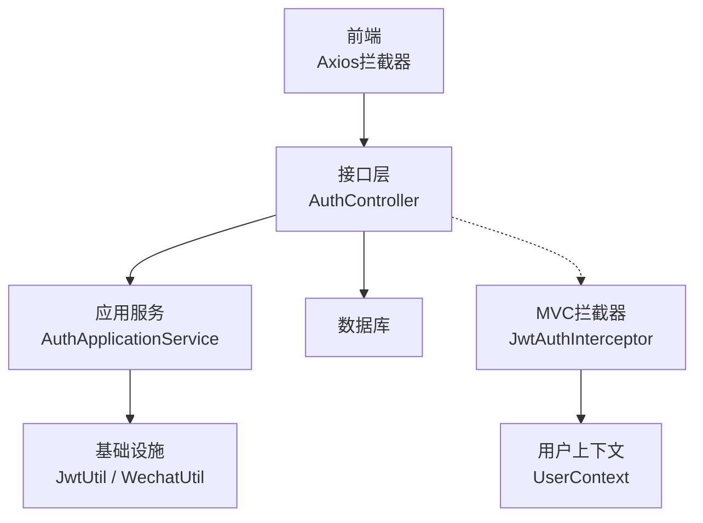
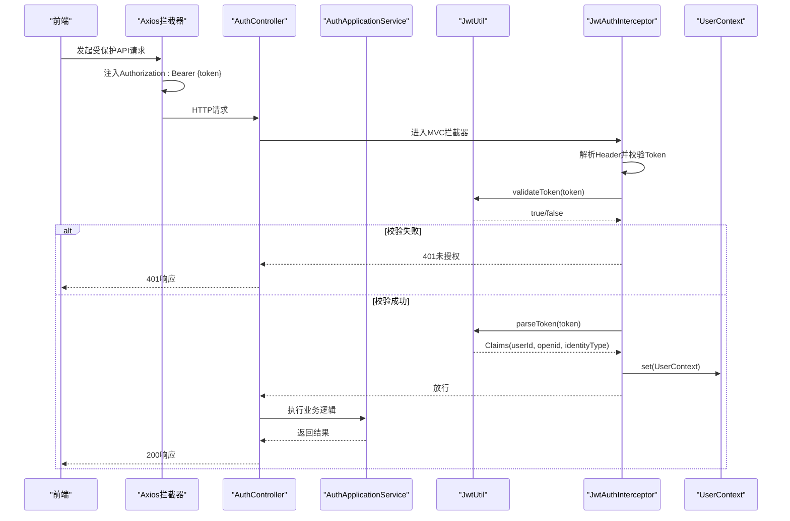
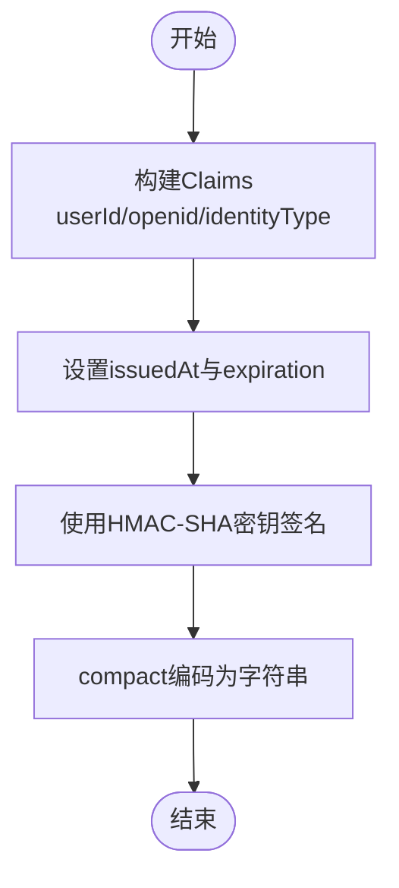
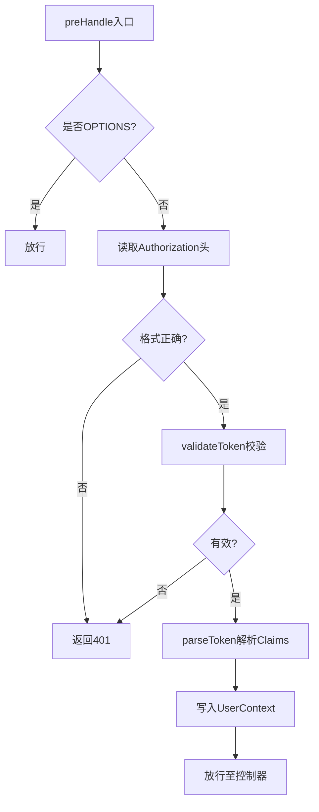
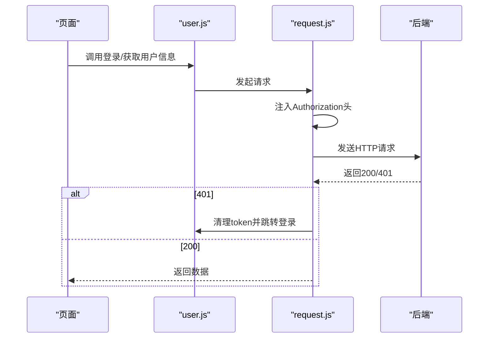
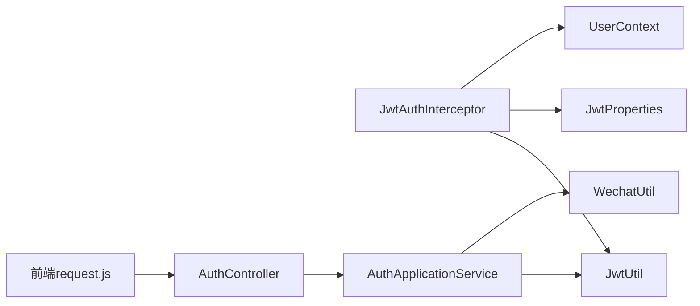

# JWT令牌管理

<cite>
**本文引用的文件**
- [JwtUtil.java](file://wzoto-backend/wzoto-infrastructure/src/main/java/com/wzoto/infrastructure/util/JwtUtil.java)
- [JwtProperties.java](file://wzoto-backend/wzoto-infrastructure/src/main/java/com/wzoto/infrastructure/config/JwtProperties.java)
- [JwtAuthInterceptor.java](file://wzoto-backend/wzoto-infrastructure/src/main/java/com/wzoto/infrastructure/interceptor/JwtAuthInterceptor.java)
- [WebMvcConfig.java](file://wzoto-backend/wzoto-infrastructure/src/main/java/com/wzoto/infrastructure/config/WebMvcConfig.java)
- [AuthController.java](file://wzoto-backend/wzoto-interfaces/src/main/java/com/wzoto/interfaces/controller/AuthController.java)
- [AuthApplicationService.java](file://wzoto-backend/wzoto-application/src/main/java/com/wzoto/application/service/AuthApplicationService.java)
- [UserContext.java](file://wzoto-backend/wzoto-domain/src/main/java/com/wzoto/domain/context/UserContext.java)
- [R.java](file://wzoto-backend/wzoto-interfaces/src/main/java/com/wzoto/interfaces/common/R.java)
- [application.yml](file://wzoto-backend/wzoto-interfaces/src/main/resources/application.yml)
- [request.js](file://wzoto-frontend/src/utils/request.js)
- [user.js](file://wzoto-frontend/src/stores/user.js)
</cite>

## 目录
1. [简介](#简介)
2. [项目结构](#项目结构)
3. [核心组件](#核心组件)
4. [架构总览](#架构总览)
5. [详细组件分析](#详细组件分析)
6. [依赖关系分析](#依赖关系分析)
7. [性能与安全考量](#性能与安全考量)
8. [故障排查指南](#故障排查指南)
9. [结论](#结论)
10. [附录：配置与前端集成](#附录配置与前端集成)

## 简介
本文件围绕JWT令牌管理系统，系统性说明令牌的生成、验证、拦截、上下文注入、前端携带与异常处理，以及安全策略与最佳实践。系统采用Spring MVC拦截器进行请求鉴权，使用HMAC-SHA算法对JWT签名，通过配置项集中管理密钥与过期时间；前端在请求头中自动携带Bearer Token，并在401时统一跳转登录。

## 项目结构
后端采用分层架构：
- 接口层（interfaces）：控制器与统一返回体
- 应用服务层（application）：编排业务流程（微信登录、身份选择、绑定手机、签发JWT）
- 领域层（domain）：用户上下文、实体与领域服务
- 基础设施层（infrastructure）：JWT工具、配置、拦截器、外部调用封装

前端基于Vue + Pinia + Axios，封装请求拦截器实现Token自动注入与401统一处理。

图表来源
- [WebMvcConfig.java:21-31](file://wzoto-backend/wzoto-infrastructure/src/main/java/com/wzoto/infrastructure/config/WebMvcConfig.java#L21-L31)
- [JwtAuthInterceptor.java:27-59](file://wzoto-backend/wzoto-infrastructure/src/main/java/com/wzoto/infrastructure/interceptor/JwtAuthInterceptor.java#L27-L59)
- [AuthController.java:69-127](file://wzoto-backend/wzoto-interfaces/src/main/java/com/wzoto/interfaces/controller/AuthController.java#L69-L127)
- [AuthApplicationService.java:30-79](file://wzoto-backend/wzoto-application/src/main/java/com/wzoto/application/service/AuthApplicationService.java#L30-L79)
- [JwtUtil.java:27-80](file://wzoto-backend/wzoto-infrastructure/src/main/java/com/wzoto/infrastructure/util/JwtUtil.java#L27-L80)

章节来源
- [WebMvcConfig.java:21-31](file://wzoto-backend/wzoto-infrastructure/src/main/java/com/wzoto/infrastructure/config/WebMvcConfig.java#L21-L31)
- [application.yml:32-36](file://wzoto-backend/wzoto-interfaces/src/main/resources/application.yml#L32-L36)

## 核心组件
- JwtUtil：负责JWT的生成、解析、校验，使用HMAC-SHA签名，从配置读取密钥与过期时间。
- JwtAuthInterceptor：全局拦截所有/api/**请求（排除登录相关路径），从Authorization头提取并校验Token，将用户信息注入UserContext。
- AuthController：提供微信登录、身份选择、绑定手机号等接口，成功后返回包含token的响应。
- AuthApplicationService：编排微信code2Session、用户登录/注册、身份选择、绑定手机，并在需要时签发新Token。
- WebMvcConfig：注册JWT拦截器与全局CORS。
- UserContext：ThreadLocal存储当前请求的用户上下文（userId、openid、identityType）。
- 前端request.js：Axios请求拦截器自动注入Authorization头；响应拦截器统一处理401并跳转登录。
- user.js：Pinia状态管理，持久化token到localStorage，并提供登录、退出等方法。

章节来源
- [JwtUtil.java:27-80](file://wzoto-backend/wzoto-infrastructure/src/main/java/com/wzoto/infrastructure/util/JwtUtil.java#L27-L80)
- [JwtAuthInterceptor.java:27-59](file://wzoto-backend/wzoto-infrastructure/src/main/java/com/wzoto/infrastructure/interceptor/JwtAuthInterceptor.java#L27-L59)
- [AuthController.java:69-127](file://wzoto-backend/wzoto-interfaces/src/main/java/com/wzoto/interfaces/controller/AuthController.java#L69-L127)
- [AuthApplicationService.java:30-79](file://wzoto-backend/wzoto-application/src/main/java/com/wzoto/application/service/AuthApplicationService.java#L30-L79)
- [WebMvcConfig.java:21-31](file://wzoto-backend/wzoto-infrastructure/src/main/java/com/wzoto/infrastructure/config/WebMvcConfig.java#L21-L31)
- [UserContext.java:14-56](file://wzoto-backend/wzoto-domain/src/main/java/com/wzoto/domain/context/UserContext.java#L14-L56)
- [request.js:13-55](file://wzoto-frontend/src/utils/request.js#L13-L55)
- [user.js:6-117](file://wzoto-frontend/src/stores/user.js#L6-L117)

## 架构总览
下图展示了从前端发起请求到后端鉴权的完整链路，包括Token注入、拦截器校验、上下文注入及业务处理。

图表来源
- [request.js:13-23](file://wzoto-frontend/src/utils/request.js#L13-L23)
- [WebMvcConfig.java:21-31](file://wzoto-backend/wzoto-infrastructure/src/main/java/com/wzoto/infrastructure/config/WebMvcConfig.java#L21-L31)
- [JwtAuthInterceptor.java:27-59](file://wzoto-backend/wzoto-infrastructure/src/main/java/com/wzoto/infrastructure/interceptor/JwtAuthInterceptor.java#L27-L59)
- [JwtUtil.java:52-80](file://wzoto-backend/wzoto-infrastructure/src/main/java/com/wzoto/infrastructure/util/JwtUtil.java#L52-L80)
- [UserContext.java:27-47](file://wzoto-backend/wzoto-domain/src/main/java/com/wzoto/domain/context/UserContext.java#L27-L47)

## 详细组件分析

### JWT生成机制
- 载荷内容：包含userId、openid、identityType三个字段，用于标识用户及其角色/身份类型。
- 签名算法：HMAC-SHA，密钥来源于配置项wzoto.jwt.secret。
- 有效期：由wzoto.jwt.expiration-hours决定，单位为小时。
- 生成入口：
  - 微信登录后：AuthApplicationService.login()调用JwtUtil.generateToken()。
  - 开发环境直登：AuthController.devLogin()直接生成Token。
  - 身份变更后：AuthApplicationService.selectIdentity()重新签发含新身份的Token。

图表来源
- [JwtUtil.java:27-47](file://wzoto-backend/wzoto-infrastructure/src/main/java/com/wzoto/infrastructure/util/JwtUtil.java#L27-L47)
- [AuthApplicationService.java:30-57](file://wzoto-backend/wzoto-application/src/main/java/com/wzoto/application/service/AuthApplicationService.java#L30-L57)
- [AuthController.java:106-127](file://wzoto-backend/wzoto-interfaces/src/main/java/com/wzoto/interfaces/controller/AuthController.java#L106-L127)

章节来源
- [JwtUtil.java:27-47](file://wzoto-backend/wzoto-infrastructure/src/main/java/com/wzoto/infrastructure/util/JwtUtil.java#L27-L47)
- [AuthApplicationService.java:30-79](file://wzoto-backend/wzoto-application/src/main/java/com/wzoto/application/service/AuthApplicationService.java#L30-L79)
- [AuthController.java:69-127](file://wzoto-backend/wzoto-interfaces/src/main/java/com/wzoto/interfaces/controller/AuthController.java#L69-L127)

### 令牌验证流程与权限校验
- 拦截器工作流：
  - 跳过OPTIONS预检请求。
  - 从Authorization头提取Bearer Token。
  - 调用JwtUtil.validateToken进行签名与过期校验。
  - 解析出userId、openid、identityType并注入UserContext。
  - 若校验失败，返回401。
- 权限校验：
  - 当前实现基于身份类型（identityType）区分家长与学生，可通过UserContext.isParent()/isStudent()进行后续业务判断。
  - 如需细粒度权限控制，可在业务层结合identityType或扩展claims实现。

图表来源
- [JwtAuthInterceptor.java:27-59](file://wzoto-backend/wzoto-infrastructure/src/main/java/com/wzoto/infrastructure/interceptor/JwtAuthInterceptor.java#L27-L59)
- [JwtUtil.java:52-80](file://wzoto-backend/wzoto-infrastructure/src/main/java/com/wzoto/infrastructure/util/JwtUtil.java#L52-L80)
- [UserContext.java:27-47](file://wzoto-backend/wzoto-domain/src/main/java/com/wzoto/domain/context/UserContext.java#L27-L47)

章节来源
- [JwtAuthInterceptor.java:27-59](file://wzoto-backend/wzoto-infrastructure/src/main/java/com/wzoto/infrastructure/interceptor/JwtAuthInterceptor.java#L27-L59)
- [WebMvcConfig.java:21-31](file://wzoto-backend/wzoto-infrastructure/src/main/java/com/wzoto/infrastructure/config/WebMvcConfig.java#L21-L31)

### 令牌刷新机制
- 当前实现：无服务端主动刷新机制。Token过期后，客户端需重新登录获取新Token。
- 建议策略：
  - 前端在本地记录token签发时间与过期时间，接近过期前触发静默刷新（如调用后端刷新接口或使用refresh token）。
  - 后端可引入refresh token机制，支持短期access token与长期refresh token分离，提升安全性与用户体验。
  - 注意：当前代码未实现刷新接口，需在现有基础上扩展。

章节来源
- [AuthApplicationService.java:30-79](file://wzoto-backend/wzoto-application/src/main/java/com/wzoto/application/service/AuthApplicationService.java#L30-L79)
- [JwtUtil.java:27-47](file://wzoto-backend/wzoto-infrastructure/src/main/java/com/wzoto/infrastructure/util/JwtUtil.java#L27-L47)

### JWT配置选项说明
- 密钥管理：wzoto.jwt.secret，生产环境必须替换为强随机密钥。
- 过期时间：wzoto.jwt.expiration-hours，单位小时，默认72。
- 算法选择：HMAC-SHA（固定实现），如需RS256等非对称算法需改造JwtUtil。
- Header名称与前缀：wzoto.jwt.headerName（默认Authorization）、wzoto.jwt.tokenPrefix（默认Bearer ）。

章节来源
- [JwtProperties.java:10-26](file://wzoto-backend/wzoto-infrastructure/src/main/java/com/wzoto/infrastructure/config/JwtProperties.java#L10-L26)
- [application.yml:32-36](file://wzoto-backend/wzoto-interfaces/src/main/resources/application.yml#L32-L36)

### 前端集成示例
- 自动携带Token：
  - Axios请求拦截器在headers中注入Authorization: Bearer {token}。
- 401未授权处理：
  - 响应拦截器捕获401状态码或业务码401，清除本地状态并跳转登录页。
- 状态持久化：
  - token存储在localStorage，Pinia store维护运行时状态。

图表来源
- [request.js:13-55](file://wzoto-frontend/src/utils/request.js#L13-L55)
- [user.js:6-117](file://wzoto-frontend/src/stores/user.js#L6-L117)

章节来源
- [request.js:13-55](file://wzoto-frontend/src/utils/request.js#L13-L55)
- [user.js:6-117](file://wzoto-frontend/src/stores/user.js#L6-L117)

### 安全最佳实践
- 防止重放攻击：
  - 对敏感操作增加一次性nonce或时间戳校验，服务端拒绝重复请求。
- 跨域安全：
  - 当前CORS允许所有来源与凭据，生产环境应限制allowedOriginPatterns为可信域名。
- 敏感信息保护：
  - JWT载荷仅包含必要字段（userId、openid、identityType），避免存放敏感信息。
  - 传输全程HTTPS，确保中间人无法窃听。
- 密钥管理：
  - 使用环境变量注入密钥，禁止硬编码；定期轮换密钥。
- 最小权限原则：
  - 根据identityType进行细粒度访问控制，必要时扩展claims与权限模型。

章节来源
- [WebMvcConfig.java:33-41](file://wzoto-backend/wzoto-infrastructure/src/main/java/com/wzoto/infrastructure/config/WebMvcConfig.java#L33-L41)
- [JwtUtil.java:27-47](file://wzoto-backend/wzoto-infrastructure/src/main/java/com/wzoto/infrastructure/util/JwtUtil.java#L27-L47)
- [application.yml:32-36](file://wzoto-backend/wzoto-interfaces/src/main/resources/application.yml#L32-L36)

## 依赖关系分析
- 组件耦合：
  - JwtAuthInterceptor依赖JwtUtil与JwtProperties，低耦合、职责清晰。
  - AuthApplicationService依赖WechatUtil、UserDomainService与JwtUtil，编排登录流程。
  - 前端request.js依赖Pinia store，解耦业务与网络层。
- 外部依赖：
  - 微信登录依赖WechatUtil（code2Session）。
  - 数据库访问通过MyBatis Plus（未在本文展开）。

图表来源
- [JwtAuthInterceptor.java:27-59](file://wzoto-backend/wzoto-infrastructure/src/main/java/com/wzoto/infrastructure/interceptor/JwtAuthInterceptor.java#L27-L59)
- [AuthController.java:69-127](file://wzoto-backend/wzoto-interfaces/src/main/java/com/wzoto/interfaces/controller/AuthController.java#L69-L127)
- [AuthApplicationService.java:30-79](file://wzoto-backend/wzoto-application/src/main/java/com/wzoto/application/service/AuthApplicationService.java#L30-L79)
- [request.js:13-55](file://wzoto-frontend/src/utils/request.js#L13-L55)

章节来源
- [JwtAuthInterceptor.java:27-59](file://wzoto-backend/wzoto-infrastructure/src/main/java/com/wzoto/infrastructure/interceptor/JwtAuthInterceptor.java#L27-L59)
- [AuthApplicationService.java:30-79](file://wzoto-backend/wzoto-application/src/main/java/com/wzoto/application/service/AuthApplicationService.java#L30-L79)
- [request.js:13-55](file://wzoto-frontend/src/utils/request.js#L13-L55)

## 性能与安全考量
- 性能：
  - JWT解析与校验为轻量CPU操作，适合高并发场景。
  - 避免在Token中存放大对象，减少序列化开销。
- 安全：
  - HMAC密钥强度直接影响安全性，建议使用至少32字符的随机密钥。
  - 生产环境关闭开发登录接口（dev-login），避免绕过认证。
  - CORS严格限制来源，避免任意站点携带凭据访问。

[本节为通用指导，不直接分析具体文件]

## 故障排查指南
- 常见问题：
  - 401未授权：检查Authorization头是否存在且格式正确；确认Token未过期；确认拦截器排除路径是否正确。
  - 跨域错误：检查CORS配置与浏览器控制台报错；确认前端域名在白名单内。
  - 登录失败：检查微信code2Session返回值；确认WechatUtil配置正确。
- 调试方法：
  - 开启日志级别debug，观察拦截器与JWT校验日志。
  - 使用浏览器开发者工具查看请求头与响应体。
  - 临时放开dev-login接口进行快速验证（仅限开发环境）。

章节来源
- [JwtAuthInterceptor.java:27-59](file://wzoto-backend/wzoto-infrastructure/src/main/java/com/wzoto/infrastructure/interceptor/JwtAuthInterceptor.java#L27-L59)
- [R.java:35-37](file://wzoto-backend/wzoto-interfaces/src/main/java/com/wzoto/interfaces/common/R.java#L35-L37)
- [application.yml:48-51](file://wzoto-backend/wzoto-interfaces/src/main/resources/application.yml#L48-L51)

## 结论
该系统实现了基于JWT的无状态认证方案，具备清晰的生成、验证与上下文注入流程；前端通过Axios拦截器统一管理Token携带与401处理。当前未实现服务端Token刷新机制，建议在生产环境中引入refresh token与更严格的CORS策略，以提升安全性与用户体验。

[本节为总结性内容，不直接分析具体文件]

## 附录：配置与前端集成
- 后端配置（application.yml）：
  - wzoto.jwt.secret：JWT签名密钥（环境变量注入）
  - wzoto.jwt.expiration-hours：Token有效期（小时）
  - wzoto.jwt.headerName：请求头名称（默认Authorization）
  - wzoto.jwt.tokenPrefix：Token前缀（默认Bearer ）
- 前端集成要点：
  - 在请求拦截器中注入Authorization: Bearer {token}
  - 在响应拦截器中处理401，清理本地状态并跳转登录
  - 使用localStorage持久化token，Pinia store管理运行时状态

章节来源
- [application.yml:32-36](file://wzoto-backend/wzoto-interfaces/src/main/resources/application.yml#L32-L36)
- [request.js:13-55](file://wzoto-frontend/src/utils/request.js#L13-L55)
- [user.js:6-117](file://wzoto-frontend/src/stores/user.js#L6-L117)