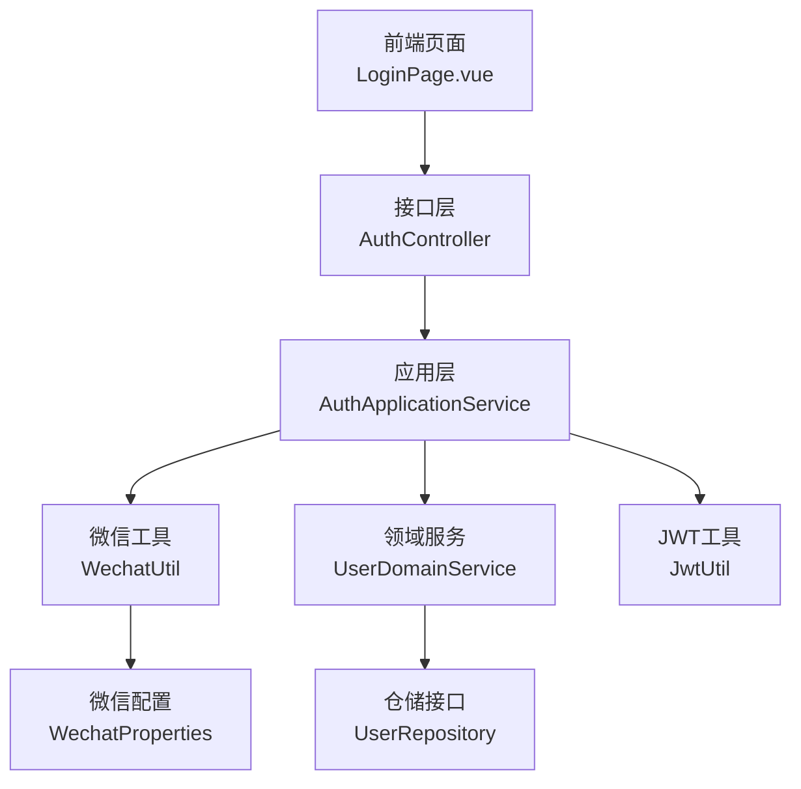
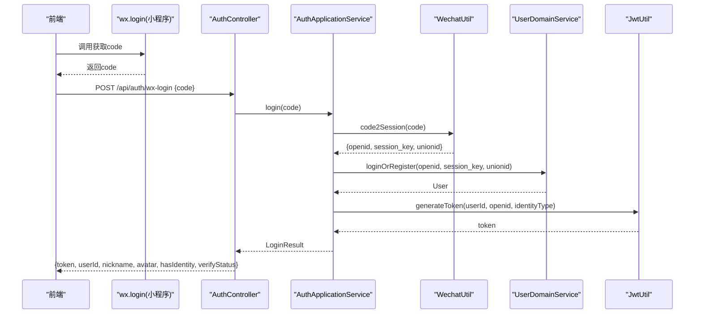
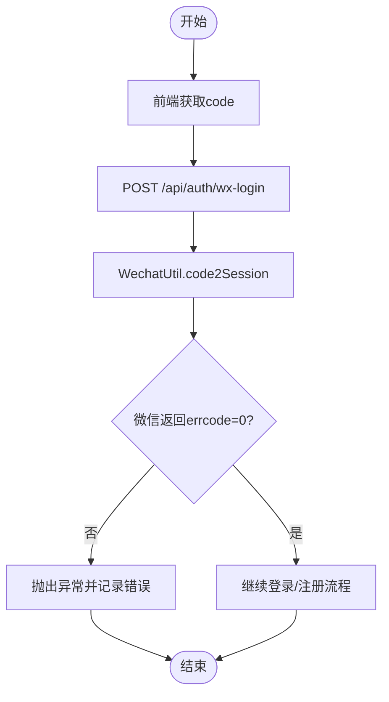
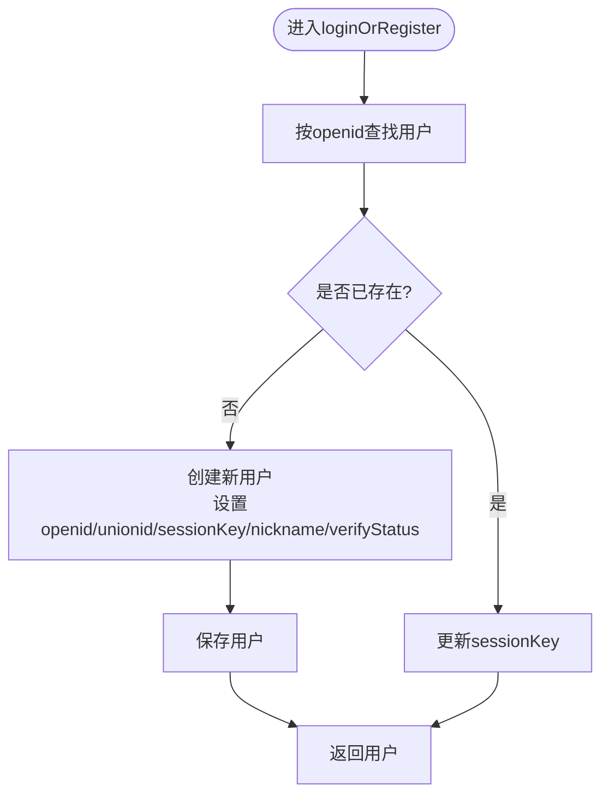
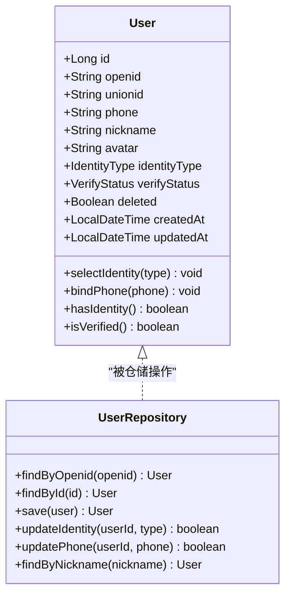
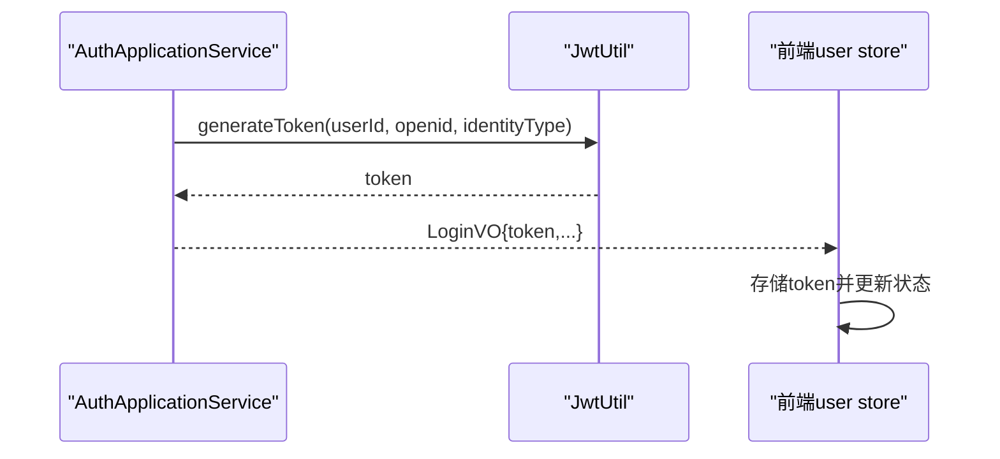
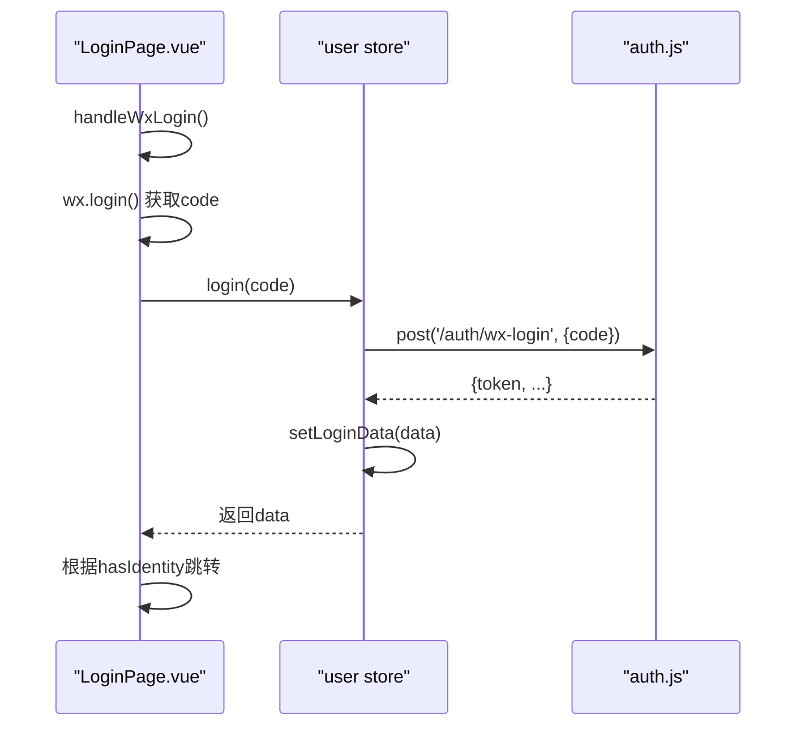
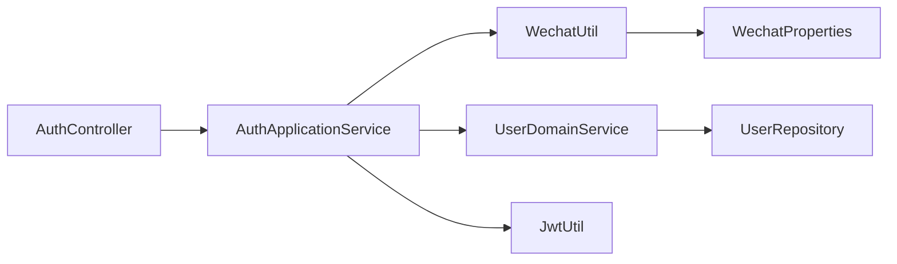

# 微信OAuth登录

<cite>
**本文引用的文件**
- [AuthController.java](file://wzoto-backend/wzoto-interfaces/src/main/java/com/wzoto/interfaces/controller/AuthController.java)
- [AuthApplicationService.java](file://wzoto-backend/wzoto-application/src/main/java/com/wzoto/application/service/AuthApplicationService.java)
- [WechatUtil.java](file://wzoto-backend/wzoto-infrastructure/src/main/java/com/wzoto/infrastructure/util/WechatUtil.java)
- [WechatProperties.java](file://wzoto-backend/wzoto-infrastructure/src/main/java/com/wzoto/infrastructure/config/WechatProperties.java)
- [WxLoginDTO.java](file://wzoto-backend/wzoto-interfaces/src/main/java/com/wzoto/interfaces/dto/WxLoginDTO.java)
- [LoginVO.java](file://wzoto-backend/wzoto-interfaces/src/main/java/com/wzoto/interfaces/vo/LoginVO.java)
- [UserDomainService.java](file://wzoto-backend/wzoto-domain/src/main/java/com/wzoto/domain/service/UserDomainService.java)
- [User.java](file://wzoto-backend/wzoto-domain/src/main/java/com/wzoto/domain/entity/User.java)
- [UserRepository.java](file://wzoto-backend/wzoto-domain/src/main/java/com/wzoto/domain/repository/UserRepository.java)
- [JwtUtil.java](file://wzoto-backend/wzoto-infrastructure/src/main/java/com/wzoto/infrastructure/util/JwtUtil.java)
- [application.yml](file://wzoto-backend/wzoto-interfaces/src/main/resources/application.yml)
- [auth.js](file://wzoto-frontend/src/api/auth.js)
- [LoginPage.vue](file://wzoto-frontend/src/pages/auth/LoginPage.vue)
- [user.js](file://wzoto-frontend/src/stores/user.js)
</cite>

## 目录
1. [简介](#简介)
2. [项目结构](#项目结构)
3. [核心组件](#核心组件)
4. [架构总览](#架构总览)
5. [详细组件分析](#详细组件分析)
6. [依赖关系分析](#依赖关系分析)
7. [性能考虑](#性能考虑)
8. [故障排查指南](#故障排查指南)
9. [结论](#结论)
10. [附录](#附录)

## 简介
本文件面向“微信OAuth登录”功能，覆盖从前端获取授权码到后端换取用户身份、首次登录自动注册、JWT签发与返回、以及前后端联调的完整流程。文档同时提供API接口说明、数据模型映射、错误处理策略、开发测试方法与常见问题解决方案，帮助读者快速理解并集成该能力。

## 项目结构
本项目采用分层架构：
- 接口层（interfaces）：对外暴露REST API，如 /api/auth/wx-login
- 应用层（application）：编排业务流程，协调第三方服务与领域服务
- 领域层（domain）：封装业务规则与实体，如用户登录/注册、身份选择等
- 基础设施层（infrastructure）：提供通用工具与配置，如微信调用、JWT生成、配置读取

图表来源
- [AuthController.java:21-75](file://wzoto-backend/wzoto-interfaces/src/main/java/com/wzoto/interfaces/controller/AuthController.java#L21-L75)
- [AuthApplicationService.java:26-57](file://wzoto-backend/wzoto-application/src/main/java/com/wzoto/application/service/AuthApplicationService.java#L26-L57)
- [WechatUtil.java:21-45](file://wzoto-backend/wzoto-infrastructure/src/main/java/com/wzoto/infrastructure/util/WechatUtil.java#L21-L45)
- [UserDomainService.java:20-46](file://wzoto-backend/wzoto-domain/src/main/java/com/wzoto/domain/service/UserDomainService.java#L20-L46)
- [JwtUtil.java:27-47](file://wzoto-backend/wzoto-infrastructure/src/main/java/com/wzoto/infrastructure/util/JwtUtil.java#L27-L47)
- [WechatProperties.java:10-23](file://wzoto-backend/wzoto-infrastructure/src/main/java/com/wzoto/infrastructure/config/WechatProperties.java#L10-L23)

章节来源
- [AuthController.java:21-75](file://wzoto-backend/wzoto-interfaces/src/main/java/com/wzoto/interfaces/controller/AuthController.java#L21-L75)
- [application.yml:31-39](file://wzoto-backend/wzoto-interfaces/src/main/resources/application.yml#L31-L39)

## 核心组件
- 控制器 AuthController：暴露 /api/auth/wx-login 接口，接收 WxLoginDTO，调用应用服务并返回 LoginVO
- 应用服务 AuthApplicationService：编排 code2Session、登录或注册、JWT签发
- 微信工具 WechatUtil：调用微信 jscode2session 接口，校验错误码并返回 openid/session_key/unionid
- 领域服务 UserDomainService：根据openid查找或创建用户，更新session_key，实现“登录即注册”
- 用户实体 User：承载openid、unionid、昵称、头像、身份类型、认证状态等
- JWT工具 JwtUtil：生成包含userId、openid、identityType的Token
- 配置 WechatProperties：读取小程序appId、appSecret、登录URL
- 请求/响应 DTO/VO：WxLoginDTO、LoginVO

章节来源
- [AuthController.java:65-75](file://wzoto-backend/wzoto-interfaces/src/main/java/com/wzoto/interfaces/controller/AuthController.java#L65-L75)
- [AuthApplicationService.java:26-57](file://wzoto-backend/wzoto-application/src/main/java/com/wzoto/application/service/AuthApplicationService.java#L26-L57)
- [WechatUtil.java:21-45](file://wzoto-backend/wzoto-infrastructure/src/main/java/com/wzoto/infrastructure/util/WechatUtil.java#L21-L45)
- [UserDomainService.java:20-46](file://wzoto-backend/wzoto-domain/src/main/java/com/wzoto/domain/service/UserDomainService.java#L20-L46)
- [User.java:20-93](file://wzoto-backend/wzoto-domain/src/main/java/com/wzoto/domain/entity/User.java#L20-L93)
- [JwtUtil.java:27-47](file://wzoto-backend/wzoto-infrastructure/src/main/java/com/wzoto/infrastructure/util/JwtUtil.java#L27-L47)
- [WechatProperties.java:10-23](file://wzoto-backend/wzoto-infrastructure/src/main/java/com/wzoto/infrastructure/config/WechatProperties.java#L10-L23)
- [WxLoginDTO.java:6-15](file://wzoto-backend/wzoto-interfaces/src/main/java/com/wzoto/interfaces/dto/WxLoginDTO.java#L6-L15)
- [LoginVO.java:8-40](file://wzoto-backend/wzoto-interfaces/src/main/java/com/wzoto/interfaces/vo/LoginVO.java#L8-L40)

## 架构总览
下图展示了微信OAuth登录的端到端时序：前端在小程序环境调用 wx.login 获取code，随后将code发送至后端；后端通过WechatUtil调用微信接口换取openid/session_key/unionid；领域服务根据openid进行登录或注册；最后由JWT工具签发Token并返回给前端。

图表来源
- [LoginPage.vue:89-112](file://wzoto-frontend/src/pages/auth/LoginPage.vue#L89-L112)
- [AuthController.java:65-75](file://wzoto-backend/wzoto-interfaces/src/main/java/com/wzoto/interfaces/controller/AuthController.java#L65-L75)
- [AuthApplicationService.java:26-57](file://wzoto-backend/wzoto-application/src/main/java/com/wzoto/application/service/AuthApplicationService.java#L26-L57)
- [WechatUtil.java:21-45](file://wzoto-backend/wzoto-infrastructure/src/main/java/com/wzoto/infrastructure/util/WechatUtil.java#L21-L45)
- [UserDomainService.java:20-46](file://wzoto-backend/wzoto-domain/src/main/java/com/wzoto/domain/service/UserDomainService.java#L20-L46)
- [JwtUtil.java:27-47](file://wzoto-backend/wzoto-infrastructure/src/main/java/com/wzoto/infrastructure/util/JwtUtil.java#L27-L47)

## 详细组件分析

### 微信授权码获取与交换流程
- 前端在小程序环境调用 wx.login 获取临时登录凭证code，并在H5环境下使用模拟code进行开发调试
- 将code提交至后端 /api/auth/wx-login
- 后端通过 WechatUtil.code2Session 调用微信 jscode2session，得到openid、session_key、unionid
- 若微信返回errcode非0，抛出异常并记录错误日志

图表来源
- [LoginPage.vue:89-112](file://wzoto-frontend/src/pages/auth/LoginPage.vue#L89-L112)
- [WechatUtil.java:21-45](file://wzoto-backend/wzoto-infrastructure/src/main/java/com/wzoto/infrastructure/util/WechatUtil.java#L21-L45)

章节来源
- [LoginPage.vue:89-112](file://wzoto-frontend/src/pages/auth/LoginPage.vue#L89-L112)
- [WechatUtil.java:21-45](file://wzoto-backend/wzoto-infrastructure/src/main/java/com/wzoto/infrastructure/util/WechatUtil.java#L21-L45)

### 用户首次登录与账号创建逻辑
- 领域服务根据openid查询用户，不存在则自动创建新用户
- 新用户默认昵称为“微信用户”，认证状态为未认证，deleted=false
- 每次登录都会更新session_key，便于后续解密敏感数据（如手机号）
- 若存在用户，仅更新session_key并返回用户信息

图表来源
- [UserDomainService.java:20-46](file://wzoto-backend/wzoto-domain/src/main/java/com/wzoto/domain/service/UserDomainService.java#L20-L46)

章节来源
- [UserDomainService.java:20-46](file://wzoto-backend/wzoto-domain/src/main/java/com/wzoto/domain/service/UserDomainService.java#L20-L46)
- [User.java:20-93](file://wzoto-backend/wzoto-domain/src/main/java/com/wzoto/domain/entity/User.java#L20-L93)

### 微信用户与系统用户的关联机制
- 以openid作为微信用户在系统中的唯一标识，确保一对一绑定
- 同时持久化unionid用于多端统一识别（当需要时）
- 用户实体包含openid、unionid、nickname、avatar、identityType、verifyStatus等字段
- 登录成功后，JWT中携带userId、openid、identityType，用于后续鉴权与上下文识别

图表来源
- [User.java:20-93](file://wzoto-backend/wzoto-domain/src/main/java/com/wzoto/domain/entity/User.java#L20-L93)
- [UserRepository.java:8-39](file://wzoto-backend/wzoto-domain/src/main/java/com/wzoto/domain/repository/UserRepository.java#L8-L39)

章节来源
- [User.java:20-93](file://wzoto-backend/wzoto-domain/src/main/java/com/wzoto/domain/entity/User.java#L20-L93)
- [UserRepository.java:8-39](file://wzoto-backend/wzoto-domain/src/main/java/com/wzoto/domain/repository/UserRepository.java#L8-L39)

### 登录结果与JWT签发
- 应用服务在登录/注册完成后，调用JWT工具生成Token，载荷包含userId、openid、identityType
- 返回给前端的LoginVO包含token、userId、nickname、avatar、identityType、hasIdentity、verifyStatus
- 前端在user store中持久化token并维护登录态

图表来源
- [AuthApplicationService.java:26-57](file://wzoto-backend/wzoto-application/src/main/java/com/wzoto/application/service/AuthApplicationService.java#L26-L57)
- [JwtUtil.java:27-47](file://wzoto-backend/wzoto-infrastructure/src/main/java/com/wzoto/infrastructure/util/JwtUtil.java#L27-L47)
- [user.js:33-41](file://wzoto-frontend/src/stores/user.js#L33-L41)
- [user.js:106-117](file://wzoto-frontend/src/stores/user.js#L106-L117)

章节来源
- [AuthApplicationService.java:26-57](file://wzoto-backend/wzoto-application/src/main/java/com/wzoto/application/service/AuthApplicationService.java#L26-L57)
- [JwtUtil.java:27-47](file://wzoto-backend/wzoto-infrastructure/src/main/java/com/wzoto/infrastructure/util/JwtUtil.java#L27-L47)
- [user.js:33-41](file://wzoto-frontend/src/stores/user.js#L33-L41)
- [user.js:106-117](file://wzoto-frontend/src/stores/user.js#L106-L117)

### API接口说明：/api/auth/wx-login
- 请求方式：POST
- 路径：/api/auth/wx-login
- 请求体（WxLoginDTO）：
  - code：字符串，必填，微信登录凭证
- 响应体（LoginVO）：
  - token：字符串，JWT令牌
  - userId：长整型，用户ID
  - nickname：字符串，昵称
  - avatar：字符串，头像URL
  - identityType：字符串，身份类型（PARENT/STUDENT/空表示未选择）
  - hasIdentity：布尔值，是否已选择身份
  - verifyStatus：字符串，认证状态（NONE/PENDING/APPROVED/REJECTED）
  - phone：字符串，脱敏手机号（可选）
- 错误处理：
  - 参数校验失败：返回统一错误格式（由框架校验）
  - 微信接口异常：抛出运行时异常，上层统一异常处理器捕获并返回错误
  - 网络或配置问题：检查微信小程序配置是否正确

章节来源
- [AuthController.java:65-75](file://wzoto-backend/wzoto-interfaces/src/main/java/com/wzoto/interfaces/controller/AuthController.java#L65-L75)
- [WxLoginDTO.java:6-15](file://wzoto-backend/wzoto-interfaces/src/main/java/com/wzoto/interfaces/dto/WxLoginDTO.java#L6-L15)
- [LoginVO.java:8-40](file://wzoto-backend/wzoto-interfaces/src/main/java/com/wzoto/interfaces/vo/LoginVO.java#L8-L40)
- [WechatUtil.java:21-45](file://wzoto-backend/wzoto-infrastructure/src/main/java/com/wzoto/infrastructure/util/WechatUtil.java#L21-L45)

### 前端集成示例（Vue）
- 在小程序环境中调用 wx.login 获取code，再调用后端登录接口
- 在H5开发环境可使用模拟code进行联调
- 登录成功后，将token存入本地存储，并根据hasIdentity决定跳转页面

图表来源
- [LoginPage.vue:89-172](file://wzoto-frontend/src/pages/auth/LoginPage.vue#L89-L172)
- [user.js:33-41](file://wzoto-frontend/src/stores/user.js#L33-L41)
- [auth.js:3-8](file://wzoto-frontend/src/api/auth.js#L3-L8)

章节来源
- [LoginPage.vue:89-172](file://wzoto-frontend/src/pages/auth/LoginPage.vue#L89-L172)
- [user.js:33-41](file://wzoto-frontend/src/stores/user.js#L33-L41)
- [auth.js:3-8](file://wzoto-frontend/src/api/auth.js#L3-L8)

## 依赖关系分析
- 控制器依赖应用服务、仓储接口、JWT工具
- 应用服务依赖微信工具、领域服务、JWT工具
- 领域服务依赖仓储接口
- 微信工具依赖微信配置
- 前端依赖store与API模块

图表来源
- [AuthController.java:21-75](file://wzoto-backend/wzoto-interfaces/src/main/java/com/wzoto/interfaces/controller/AuthController.java#L21-L75)
- [AuthApplicationService.java:26-57](file://wzoto-backend/wzoto-application/src/main/java/com/wzoto/application/service/AuthApplicationService.java#L26-L57)
- [WechatUtil.java:21-45](file://wzoto-backend/wzoto-infrastructure/src/main/java/com/wzoto/infrastructure/util/WechatUtil.java#L21-L45)
- [UserDomainService.java:20-46](file://wzoto-backend/wzoto-domain/src/main/java/com/wzoto/domain/service/UserDomainService.java#L20-L46)
- [WechatProperties.java:10-23](file://wzoto-backend/wzoto-infrastructure/src/main/java/com/wzoto/infrastructure/config/WechatProperties.java#L10-L23)

章节来源
- [AuthController.java:21-75](file://wzoto-backend/wzoto-interfaces/src/main/java/com/wzoto/interfaces/controller/AuthController.java#L21-L75)
- [AuthApplicationService.java:26-57](file://wzoto-backend/wzoto-application/src/main/java/com/wzoto/application/service/AuthApplicationService.java#L26-L57)
- [WechatUtil.java:21-45](file://wzoto-backend/wzoto-infrastructure/src/main/java/com/wzoto/infrastructure/util/WechatUtil.java#L21-L45)
- [UserDomainService.java:20-46](file://wzoto-backend/wzoto-domain/src/main/java/com/wzoto/domain/service/UserDomainService.java#L20-L46)
- [WechatProperties.java:10-23](file://wzoto-backend/wzoto-infrastructure/src/main/java/com/wzoto/infrastructure/config/WechatProperties.java#L10-L23)

## 性能考虑
- 微信接口调用为外部HTTP请求，建议在生产环境增加重试与超时控制，避免阻塞主线程
- 登录/注册过程涉及数据库读写，应确保索引合理（openid唯一索引），减少锁竞争
- JWT签发成本低，但需关注过期时间配置，避免频繁刷新
- 前端在小程序环境获取code后立即发起请求，减少用户等待时间

[本节为通用指导，不直接分析具体文件]

## 故障排查指南
- 微信接口返回errcode非0：检查小程序appId、appSecret配置是否正确，确认jscode2session地址可用
- 登录失败或无用户：确认openid唯一性，检查数据库是否存在对应用户记录
- 前端无法获取code：确认运行环境是否为小程序；H5环境请使用模拟code进行开发调试
- Token无效或解析失败：检查JWT密钥配置与过期时间，确认前端正确传递token

章节来源
- [WechatUtil.java:21-45](file://wzoto-backend/wzoto-infrastructure/src/main/java/com/wzoto/infrastructure/util/WechatUtil.java#L21-L45)
- [application.yml:31-39](file://wzoto-backend/wzoto-interfaces/src/main/resources/application.yml#L31-L39)
- [JwtUtil.java:27-81](file://wzoto-backend/wzoto-infrastructure/src/main/java/com/wzoto/infrastructure/util/JwtUtil.java#L27-L81)
- [LoginPage.vue:89-172](file://wzoto-frontend/src/pages/auth/LoginPage.vue#L89-L172)

## 结论
本方案通过“前端获取code → 后端code2Session → 登录/注册 → JWT签发”的标准流程，实现了微信OAuth登录能力。系统以openid作为用户唯一标识，支持首次登录自动注册与后续登录无缝衔接，并提供清晰的API与前后端集成方式。配合完善的错误处理与配置管理，可在生产环境中稳定运行。

[本节为总结性内容，不直接分析具体文件]

## 附录
- 配置项说明（application.yml）：
  - wzoto.wechat.app-id：小程序AppID
  - wzoto.wechat.app-secret：小程序AppSecret
  - wzoto.jwt.secret：JWT签名密钥
  - wzoto.jwt.expiration-hours：Token过期小时数

章节来源
- [application.yml:31-39](file://wzoto-backend/wzoto-interfaces/src/main/resources/application.yml#L31-L39)