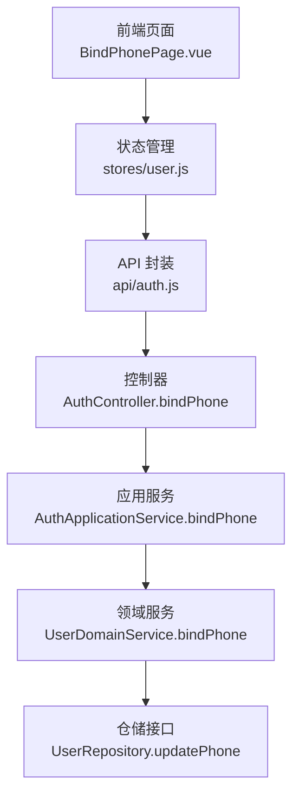
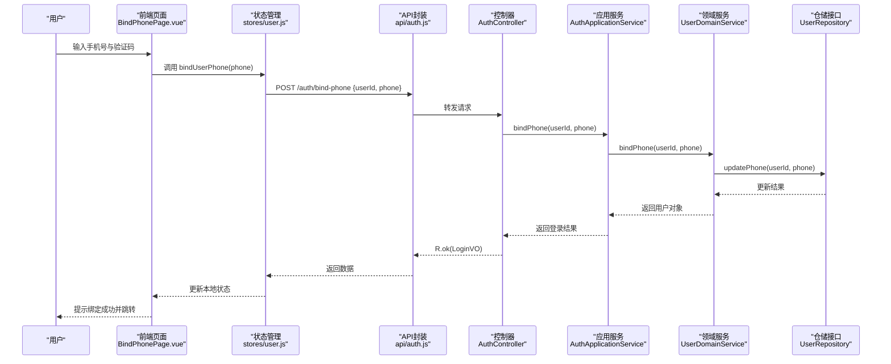
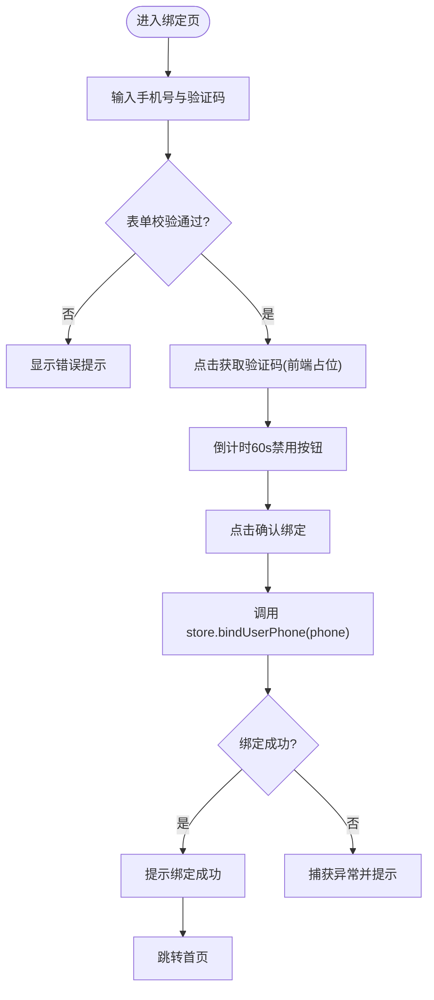
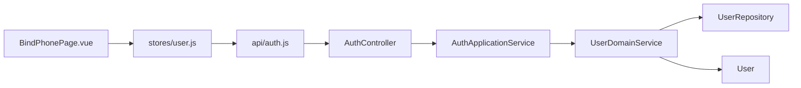

# 手机号绑定

<cite>
**本文引用的文件**
- [AuthController.java](file://wzoto-backend/wzoto-interfaces/src/main/java/com/wzoto/interfaces/controller/AuthController.java)
- [BindPhoneDTO.java](file://wzoto-backend/wzoto-interfaces/src/main/java/com/wzoto/interfaces/dto/BindPhoneDTO.java)
- [R.java](file://wzoto-backend/wzoto-interfaces/src/main/java/com/wzoto/interfaces/common/R.java)
- [GlobalExceptionHandler.java](file://wzoto-backend/wzoto-interfaces/src/main/java/com/wzoto/interfaces/common/GlobalExceptionHandler.java)
- [AuthApplicationService.java](file://wzoto-backend/wzoto-application/src/main/java/com/wzoto/application/service/AuthApplicationService.java)
- [UserDomainService.java](file://wzoto-backend/wzoto-domain/src/main/java/com/wzoto/domain/service/UserDomainService.java)
- [UserRepository.java](file://wzoto-backend/wzoto-domain/src/main/java/com/wzoto/domain/repository/UserRepository.java)
- [User.java](file://wzoto-backend/wzoto-domain/src/main/java/com/wzoto/domain/entity/User.java)
- [auth.js](file://wzoto-frontend/src/api/auth.js)
- [user.js](file://wzoto-frontend/src/stores/user.js)
- [BindPhonePage.vue](file://wzoto-frontend/src/pages/auth/BindPhonePage.vue)
</cite>

## 目录
1. [简介](#简介)
2. [项目结构](#项目结构)
3. [核心组件](#核心组件)
4. [架构总览](#架构总览)
5. [详细组件分析](#详细组件分析)
6. [依赖关系分析](#依赖关系分析)
7. [性能与扩展性](#性能与扩展性)
8. [故障排查指南](#故障排查指南)
9. [结论](#结论)
10. [附录：API 接口文档](#附录api-接口文档)

## 简介
本文件围绕“手机号绑定”能力，梳理从前端到后端的完整流程，覆盖用户发起绑定、验证码发送（预留）、绑定确认、数据更新与返回。同时给出手机号校验规则、错误码说明、前后端集成要点以及后续可扩展的短信验证码服务方案。

## 项目结构
手机号绑定涉及前后端多个模块：
- 前端页面：提供手机号输入、验证码获取（占位）、绑定确认交互
- 前端状态管理：封装绑定调用与用户信息同步
- 后端接口层：暴露 /api/auth/bind-phone
- 应用服务层：编排业务事务
- 领域服务层：实现绑定核心规则与持久化
- 仓储接口：定义用户数据的增改操作

图表来源
- [BindPhonePage.vue:1-155](file://wzoto-frontend/src/pages/auth/BindPhonePage.vue#L1-L155)
- [user.js:53-62](file://wzoto-frontend/src/stores/user.js#L53-L62)
- [auth.js:17-22](file://wzoto-frontend/src/api/auth.js#L17-L22)
- [AuthController.java:89-100](file://wzoto-backend/wzoto-interfaces/src/main/java/com/wzoto/interfaces/controller/AuthController.java#L89-L100)
- [AuthApplicationService.java:81-100](file://wzoto-backend/wzoto-application/src/main/java/com/wzoto/application/service/AuthApplicationService.java#L81-L100)
- [UserDomainService.java:63-75](file://wzoto-backend/wzoto-domain/src/main/java/com/wzoto/domain/service/UserDomainService.java#L63-L75)
- [UserRepository.java:30-33](file://wzoto-backend/wzoto-domain/src/main/java/com/wzoto/domain/repository/UserRepository.java#L30-L33)

章节来源
- [BindPhonePage.vue:1-155](file://wzoto-frontend/src/pages/auth/BindPhonePage.vue#L1-L155)
- [user.js:53-62](file://wzoto-frontend/src/stores/user.js#L53-L62)
- [auth.js:17-22](file://wzoto-frontend/src/api/auth.js#L17-L22)
- [AuthController.java:89-100](file://wzoto-backend/wzoto-interfaces/src/main/java/com/wzoto/interfaces/controller/AuthController.java#L89-L100)
- [AuthApplicationService.java:81-100](file://wzoto-backend/wzoto-application/src/main/java/com/wzoto/application/service/AuthApplicationService.java#L81-L100)
- [UserDomainService.java:63-75](file://wzoto-backend/wzoto-domain/src/main/java/com/wzoto/domain/service/UserDomainService.java#L63-L75)
- [UserRepository.java:30-33](file://wzoto-backend/wzoto-domain/src/main/java/com/wzoto/domain/repository/UserRepository.java#L30-L33)

## 核心组件
- 请求 DTO：BindPhoneDTO，包含 userId 与 phone，使用注解进行非空校验
- 控制器：AuthController.bindPhone，接收请求并委托应用服务
- 应用服务：AuthApplicationService.bindPhone，开启事务并调用领域服务
- 领域服务：UserDomainService.bindPhone，校验用户存在、执行业务更新
- 仓储接口：UserRepository.updatePhone，定义手机号更新方法
- 实体：User，提供 bindPhone 行为方法
- 统一响应：R，封装 code/msg/data
- 全局异常：GlobalExceptionHandler，统一处理参数校验与业务异常

章节来源
- [BindPhoneDTO.java:1-20](file://wzoto-backend/wzoto-interfaces/src/main/java/com/wzoto/interfaces/dto/BindPhoneDTO.java#L1-L20)
- [AuthController.java:89-100](file://wzoto-backend/wzoto-interfaces/src/main/java/com/wzoto/interfaces/controller/AuthController.java#L89-L100)
- [AuthApplicationService.java:81-100](file://wzoto-backend/wzoto-application/src/main/java/com/wzoto/application/service/AuthApplicationService.java#L81-L100)
- [UserDomainService.java:63-75](file://wzoto-backend/wzoto-domain/src/main/java/com/wzoto/domain/service/UserDomainService.java#L63-L75)
- [UserRepository.java:30-33](file://wzoto-backend/wzoto-domain/src/main/java/com/wzoto/domain/repository/UserRepository.java#L30-L33)
- [User.java:73-78](file://wzoto-backend/wzoto-domain/src/main/java/com/wzoto/domain/entity/User.java#L73-L78)
- [R.java:1-43](file://wzoto-backend/wzoto-interfaces/src/main/java/com/wzoto/interfaces/common/R.java#L1-L43)
- [GlobalExceptionHandler.java:18-66](file://wzoto-backend/wzoto-interfaces/src/main/java/com/wzoto/interfaces/common/GlobalExceptionHandler.java#L18-L66)

## 架构总览
下图展示一次手机号绑定的端到端调用链：前端表单提交 → 状态管理封装 → 后端控制器 → 应用服务 → 领域服务 → 仓储更新 → 统一响应。

图表来源
- [AuthController.java:89-100](file://wzoto-backend/wzoto-interfaces/src/main/java/com/wzoto/interfaces/controller/AuthController.java#L89-L100)
- [AuthApplicationService.java:81-100](file://wzoto-backend/wzoto-application/src/main/java/com/wzoto/application/service/AuthApplicationService.java#L81-L100)
- [UserDomainService.java:63-75](file://wzoto-backend/wzoto-domain/src/main/java/com/wzoto/domain/service/UserDomainService.java#L63-L75)
- [UserRepository.java:30-33](file://wzoto-backend/wzoto-domain/src/main/java/com/wzoto/domain/repository/UserRepository.java#L30-L33)
- [auth.js:17-22](file://wzoto-frontend/src/api/auth.js#L17-L22)
- [user.js:53-62](file://wzoto-frontend/src/stores/user.js#L53-L62)
- [BindPhonePage.vue:108-123](file://wzoto-frontend/src/pages/auth/BindPhonePage.vue#L108-L123)

## 详细组件分析

### 前端 BindPhonePage 组件
- 表单字段：手机号（+86前缀，最大11位）、验证码（最大6位）
- 校验规则：手机号正则校验；验证码必填
- 验证码按钮：倒计时60秒防重复点击（当前为前端占位，未调用后端）
- 绑定动作：触发 formRef.validate() 通过后调用 userStore.bindUserPhone，成功后提示并跳转首页

图表来源
- [BindPhonePage.vue:82-123](file://wzoto-frontend/src/pages/auth/BindPhonePage.vue#L82-L123)

章节来源
- [BindPhonePage.vue:1-155](file://wzoto-frontend/src/pages/auth/BindPhonePage.vue#L1-L155)

### 前端状态管理 stores/user.js
- 提供 bindUserPhone(phoneNumber) 方法，调用 api/auth.js 中的 bindPhone 接口
- 将返回的用户信息写入本地状态，并更新 phone 字段

章节来源
- [user.js:53-62](file://wzoto-frontend/src/stores/user.js#L53-L62)
- [auth.js:17-22](file://wzoto-frontend/src/api/auth.js#L17-L22)

### 后端控制器 AuthController
- 暴露 POST /api/auth/bind-phone
- 接收 BindPhoneDTO，校验通过后调用应用服务
- 将应用服务返回的 LoginVO 补充 phone 字段后返回

章节来源
- [AuthController.java:89-100](file://wzoto-backend/wzoto-interfaces/src/main/java/com/wzoto/interfaces/controller/AuthController.java#L89-L100)
- [BindPhoneDTO.java:1-20](file://wzoto-backend/wzoto-interfaces/src/main/java/com/wzoto/interfaces/dto/BindPhoneDTO.java#L1-L20)

### 应用服务 AuthApplicationService
- bindPhone 方法开启事务，调用领域服务完成绑定
- 返回 LoginResult，不包含 token（绑定不重新签发令牌）

章节来源
- [AuthApplicationService.java:81-100](file://wzoto-backend/wzoto-application/src/main/java/com/wzoto/application/service/AuthApplicationService.java#L81-L100)

### 领域服务 UserDomainService
- bindPhone 流程：
  - 根据 userId 查询用户，不存在则抛出非法参数异常
  - 调用 User.bindPhone 设置手机号
  - 调用 UserRepository.updatePhone 持久化
- 日志记录绑定操作

章节来源
- [UserDomainService.java:63-75](file://wzoto-backend/wzoto-domain/src/main/java/com/wzoto/domain/service/UserDomainService.java#L63-L75)
- [User.java:73-78](file://wzoto-backend/wzoto-domain/src/main/java/com/wzoto/domain/entity/User.java#L73-L78)
- [UserRepository.java:30-33](file://wzoto-backend/wzoto-domain/src/main/java/com/wzoto/domain/repository/UserRepository.java#L30-L33)

### 统一响应与异常处理
- R 提供 ok/fail/unauthorized/badRequest 等便捷方法
- GlobalExceptionHandler 统一处理：
  - 参数校验失败（MethodArgumentNotValidException、BindException）
  - 业务规则违反（IllegalStateException）
  - 运行时异常与系统异常

章节来源
- [R.java:1-43](file://wzoto-backend/wzoto-interfaces/src/main/java/com/wzoto/interfaces/common/R.java#L1-L43)
- [GlobalExceptionHandler.java:18-66](file://wzoto-backend/wzoto-interfaces/src/main/java/com/wzoto/interfaces/common/GlobalExceptionHandler.java#L18-L66)

## 依赖关系分析
- 前端依赖：
  - BindPhonePage.vue 依赖 stores/user.js 提供的绑定方法
  - stores/user.js 依赖 api/auth.js 的 HTTP 封装
- 后端依赖：
  - AuthController 依赖 AuthApplicationService
  - AuthApplicationService 依赖 UserDomainService
  - UserDomainService 依赖 UserRepository
  - User 实体提供领域行为 bindPhone

图表来源
- [BindPhonePage.vue:108-123](file://wzoto-frontend/src/pages/auth/BindPhonePage.vue#L108-L123)
- [user.js:53-62](file://wzoto-frontend/src/stores/user.js#L53-L62)
- [auth.js:17-22](file://wzoto-frontend/src/api/auth.js#L17-L22)
- [AuthController.java:89-100](file://wzoto-backend/wzoto-interfaces/src/main/java/com/wzoto/interfaces/controller/AuthController.java#L89-L100)
- [AuthApplicationService.java:81-100](file://wzoto-backend/wzoto-application/src/main/java/com/wzoto/application/service/AuthApplicationService.java#L81-L100)
- [UserDomainService.java:63-75](file://wzoto-backend/wzoto-domain/src/main/java/com/wzoto/domain/service/UserDomainService.java#L63-L75)
- [UserRepository.java:30-33](file://wzoto-backend/wzoto-domain/src/main/java/com/wzoto/domain/repository/UserRepository.java#L30-L33)
- [User.java:73-78](file://wzoto-backend/wzoto-domain/src/main/java/com/wzoto/domain/entity/User.java#L73-L78)

## 性能与扩展性
- 事务边界：绑定操作在应用服务层以事务包裹，保证一致性
- 幂等性：当前实现未对重复绑定做额外幂等控制，建议在仓储层或领域层增加“同一用户仅允许绑定一次相同手机号”的判断
- 验证码服务：当前前端验证码为占位逻辑，建议在后端新增独立接口用于生成与发送验证码，并接入短信通道
- 限流与防刷：建议在验证码接口增加基于手机号的频率限制与验证码有效期管理
- 可观测性：已记录关键日志，建议增加埋点统计绑定成功率与失败原因

[本节为通用指导，不直接分析具体文件]

## 故障排查指南
- 参数校验失败：检查 BindPhoneDTO 的 userId 与 phone 是否满足非空约束；前端需确保传入正确类型与格式
- 业务规则违反：若用户不存在会抛出非法参数异常，请确认 userId 有效且已登录
- 系统异常：查看全局异常处理器返回的统一错误结构，定位具体异常堆栈
- 前端问题：确认表单校验规则、倒计时逻辑、store 调用是否正确；网络请求是否携带必要参数

章节来源
- [GlobalExceptionHandler.java:18-66](file://wzoto-backend/wzoto-interfaces/src/main/java/com/wzoto/interfaces/common/GlobalExceptionHandler.java#L18-L66)
- [BindPhoneDTO.java:1-20](file://wzoto-backend/wzoto-interfaces/src/main/java/com/wzoto/interfaces/dto/BindPhoneDTO.java#L1-L20)
- [BindPhonePage.vue:82-123](file://wzoto-frontend/src/pages/auth/BindPhonePage.vue#L82-L123)

## 结论
本项目实现了手机号绑定的基础闭环：前端表单收集信息，后端控制器接收并委托应用服务与领域服务完成数据更新，最终通过统一响应返回结果。当前验证码发送为前端占位，建议后续在后端完善验证码生成、发送渠道、有效期与防刷机制，并在领域层增强重复绑定与运营商识别等校验能力。

[本节为总结性内容，不直接分析具体文件]

## 附录：API 接口文档

### 绑定手机号
- 接口路径：POST /api/auth/bind-phone
- 请求体：BindPhoneDTO
  - userId：Long，必填
  - phone：String，必填
- 响应体：R<LoginVO>
  - code：int，统一状态码
  - msg：String，消息
  - data：LoginVO
    - token：String，绑定不返回新令牌
    - userId：Long
    - openid：String
    - nickname：String
    - avatar：String
    - identityType：String
    - hasIdentity：Boolean
    - verifyStatus：String
    - phone：String（由控制器补充）

章节来源
- [AuthController.java:89-100](file://wzoto-backend/wzoto-interfaces/src/main/java/com/wzoto/interfaces/controller/AuthController.java#L89-L100)
- [BindPhoneDTO.java:1-20](file://wzoto-backend/wzoto-interfaces/src/main/java/com/wzoto/interfaces/dto/BindPhoneDTO.java#L1-L20)
- [R.java:1-43](file://wzoto-backend/wzoto-interfaces/src/main/java/com/wzoto/interfaces/common/R.java#L1-L43)

### 错误码说明
- 200：success
- 400：参数校验失败或业务规则违反
- 401：未授权
- 500：系统异常

章节来源
- [R.java:19-41](file://wzoto-backend/wzoto-interfaces/src/main/java/com/wzoto/interfaces/common/R.java#L19-L41)
- [GlobalExceptionHandler.java:18-66](file://wzoto-backend/wzoto-interfaces/src/main/java/com/wzoto/interfaces/common/GlobalExceptionHandler.java#L18-L66)

### 前端集成示例（Vue）
- 页面：BindPhonePage.vue
  - 表单：手机号（+86前缀，最大11位）、验证码（最大6位）
  - 校验：手机号正则校验；验证码必填
  - 验证码按钮：倒计时60秒（当前为前端占位）
  - 绑定：调用 userStore.bindUserPhone，成功后提示并跳转首页
- 状态管理：stores/user.js
  - bindUserPhone 调用 api/auth.js 的 bindPhone 接口
- API 封装：api/auth.js
  - bindPhone(userId, phone) 发送 POST /auth/bind-phone

章节来源
- [BindPhonePage.vue:1-155](file://wzoto-frontend/src/pages/auth/BindPhonePage.vue#L1-L155)
- [user.js:53-62](file://wzoto-frontend/src/stores/user.js#L53-L62)
- [auth.js:17-22](file://wzoto-frontend/src/api/auth.js#L17-L22)

### 手机号验证机制
- 格式校验：前端使用正则 /^1[3-9]\d{9}$/ 校验中国大陆手机号
- 重复检查：当前未在后端显式实现重复绑定判断，建议在领域服务或仓储层增加“同一用户仅允许绑定一次相同手机号”的规则
- 运营商识别：当前未实现，可在绑定前调用第三方号码归属地/运营商识别接口，用于风控与营销

章节来源
- [BindPhonePage.vue:82-85](file://wzoto-frontend/src/pages/auth/BindPhonePage.vue#L82-L85)
- [UserDomainService.java:63-75](file://wzoto-backend/wzoto-domain/src/main/java/com/wzoto/domain/service/UserDomainService.java#L63-L75)

### 短信验证码服务集成（建议）
- 验证码生成：在后端新增独立接口，生成随机验证码并缓存（如 Redis），设置有效期（例如5分钟）
- 发送渠道：对接短信服务商（如阿里云、腾讯云），支持模板与签名
- 有效期管理：验证码存储时附带过期时间，校验时比对当前时间
- 防刷机制：基于手机号维度限制单位时间内发送次数；结合设备/IP 维度做二次限流
- 安全策略：验证码仅用于绑定确认，不直接作为登录凭证；绑定成功后清理缓存

[本节为通用设计建议，不直接分析具体文件]

### 解绑与更换流程（建议）
- 解绑：
  - 安全验证：需先进行身份验证（如短信验证码或密码）
  - 数据更新：清空用户手机号字段
  - 通知机制：发送站内信或短信通知
- 更换：
  - 安全验证：同上
  - 数据更新：替换为新手机号
  - 通知机制：向新旧手机号分别发送变更通知
- 审计与风控：记录操作日志，异常频繁更换触发风控

[本节为通用设计建议，不直接分析具体文件]

### 短信服务配置方法与常见问题排查
- 配置项：建议通过配置文件注入短信服务商的密钥、模板ID、签名等
- 常见问题：
  - 发送失败：检查签名与模板审核状态、手机号格式、余额不足
  - 验证码无效：检查缓存是否过期、是否被提前消费
  - 限流拦截：检查是否达到发送频率上限
- 排查步骤：
  - 查看接口日志与短信平台回调
  - 核对配置项与模板ID
  - 复现最小用例并逐步缩小范围

[本节为通用指导，不直接分析具体文件]