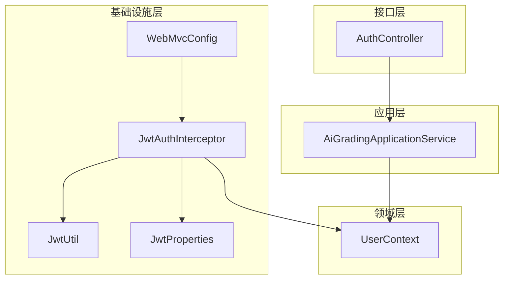
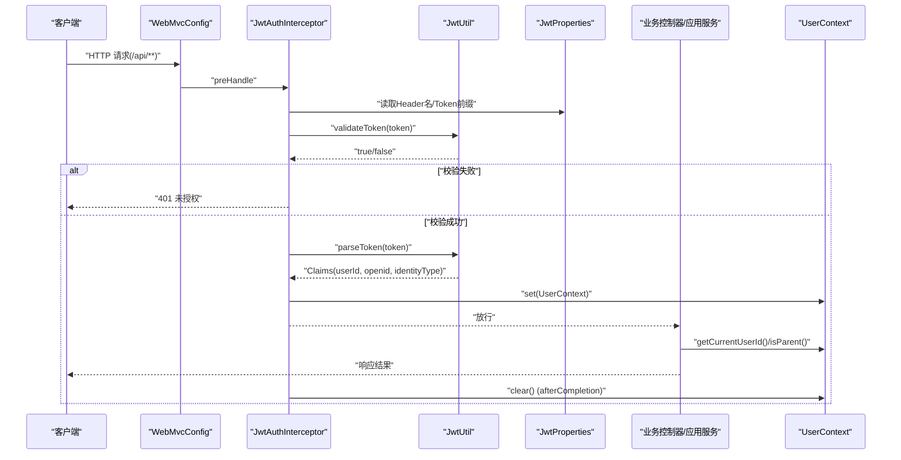
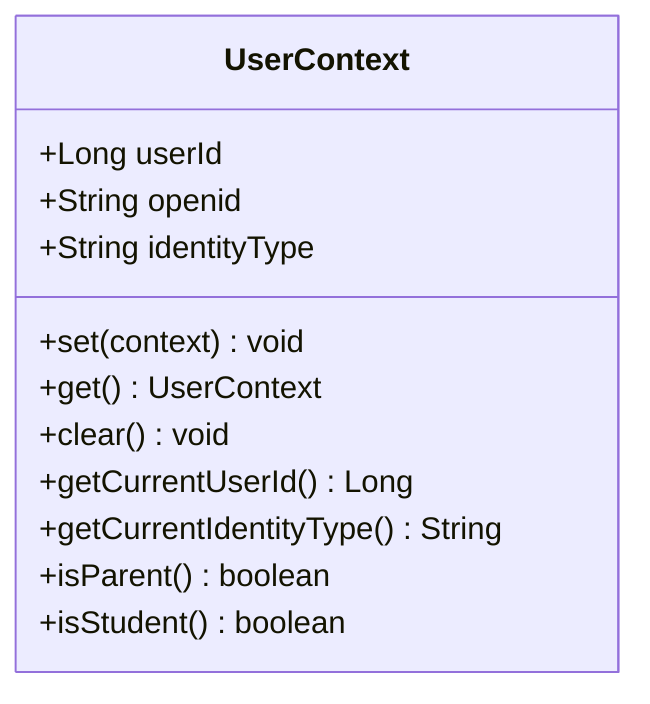
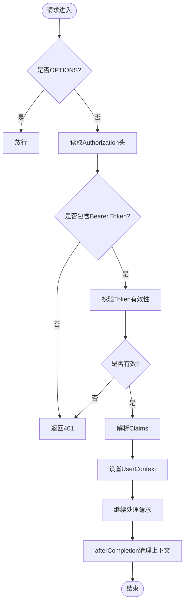
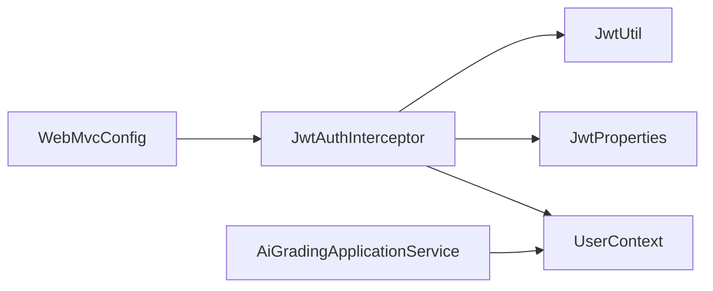

# 用户上下文管理

<cite>
**本文引用的文件**
- [UserContext.java](file://wzoto-backend/wzoto-domain/src/main/java/com/wzoto/domain/context/UserContext.java)
- [JwtAuthInterceptor.java](file://wzoto-backend/wzoto-infrastructure/src/main/java/com/wzoto/infrastructure/interceptor/JwtAuthInterceptor.java)
- [WebMvcConfig.java](file://wzoto-backend/wzoto-infrastructure/src/main/java/com/wzoto/infrastructure/config/WebMvcConfig.java)
- [JwtUtil.java](file://wzoto-backend/wzoto-infrastructure/src/main/java/com/wzoto/infrastructure/util/JwtUtil.java)
- [JwtProperties.java](file://wzoto-backend/wzoto-infrastructure/src/main/java/com/wzoto/infrastructure/config/JwtProperties.java)
- [GlobalExceptionHandler.java](file://wzoto-backend/wzoto-interfaces/src/main/java/com/wzoto/interfaces/common/GlobalExceptionHandler.java)
- [AiGradingApplicationService.java](file://wzoto-backend/wzoto-application/src/main/java/com/wzoto/application/service/AiGradingApplicationService.java)
- [AuthController.java](file://wzoto-backend/wzoto-interfaces/src/main/java/com/wzoto/interfaces/controller/AuthController.java)
</cite>

## 目录
1. [简介](#简介)
2. [项目结构](#项目结构)
3. [核心组件](#核心组件)
4. [架构总览](#架构总览)
5. [详细组件分析](#详细组件分析)
6. [依赖关系分析](#依赖关系分析)
7. [性能与并发考虑](#性能与并发考虑)
8. [故障排查指南](#故障排查指南)
9. [结论](#结论)
10. [附录：使用示例与最佳实践](#附录使用示例与最佳实践)

## 简介
本文件围绕“用户上下文管理系统”进行系统化说明，重点覆盖以下方面：
- UserContext 的设计原理：基于 ThreadLocal 的线程安全用户信息存储、生命周期管理。
- 拦截器工作机制：请求进入时从 Header 提取并校验 JWT，解析后注入上下文；请求结束时清理上下文。
- 上下文的获取与使用：在业务层（Application/Domain）如何获取当前用户、访问属性与权限判断。
- 最佳实践：避免内存泄漏、异常处理、性能优化。
- 多线程与异步场景下的上下文传递机制与注意事项。
- 调试与监控方法：日志、异常统一处理、常见问题定位。

## 项目结构
用户上下文相关代码分布在 domain、infrastructure、interfaces 三层：
- domain 层提供 UserContext 作为跨层共享的上下文载体。
- infrastructure 层实现 JWT 认证拦截器与 Web MVC 配置，负责将 Token 解析为上下文并注册拦截器。
- interfaces 层通过 Controller 暴露接口，并在需要时读取当前用户信息。

图表来源
- [WebMvcConfig.java:21-31](file://wzoto-backend/wzoto-infrastructure/src/main/java/com/wzoto/infrastructure/config/WebMvcConfig.java#L21-L31)
- [JwtAuthInterceptor.java:27-64](file://wzoto-backend/wzoto-infrastructure/src/main/java/com/wzoto/infrastructure/interceptor/JwtAuthInterceptor.java#L27-L64)
- [JwtUtil.java:30-81](file://wzoto-backend/wzoto-infrastructure/src/main/java/com/wzoto/infrastructure/util/JwtUtil.java#L30-L81)
- [JwtProperties.java:10-26](file://wzoto-backend/wzoto-infrastructure/src/main/java/com/wzoto/infrastructure/config/JwtProperties.java#L10-L26)
- [UserContext.java:14-56](file://wzoto-backend/wzoto-domain/src/main/java/com/wzoto/domain/context/UserContext.java#L14-L56)
- [AiGradingApplicationService.java:20-38](file://wzoto-backend/wzoto-application/src/main/java/com/wzoto/application/service/AiGradingApplicationService.java#L20-L38)

章节来源
- [WebMvcConfig.java:1-42](file://wzoto-backend/wzoto-infrastructure/src/main/java/com/wzoto/infrastructure/config/WebMvcConfig.java#L1-L42)
- [JwtAuthInterceptor.java:1-65](file://wzoto-backend/wzoto-infrastructure/src/main/java/com/wzoto/infrastructure/interceptor/JwtAuthInterceptor.java#L1-L65)
- [UserContext.java:1-56](file://wzoto-backend/wzoto-domain/src/main/java/com/wzoto/domain/context/UserContext.java#L1-L56)

## 核心组件
- UserContext：封装当前线程的用户信息（userId、openid、identityType），提供 set/get/clear 以及便捷查询方法（getCurrentUserId、getCurrentIdentityType、isParent、isStudent）。
- JwtAuthInterceptor：在 preHandle 中解析 Authorization 头中的 Token，校验通过后构造 UserContext 并设置到当前线程；在 afterCompletion 中清理上下文。
- WebMvcConfig：注册拦截器，限定对 /api/** 生效，排除登录等公开路径；同时配置全局 CORS。
- JwtUtil/JwtProperties：Token 生成、解析、验证及配置项（密钥、过期时间、Header 名称、前缀）。
- GlobalExceptionHandler：统一异常处理，便于定位上下文相关问题（如未携带 Token、Token 无效等）。
- 应用服务（示例 AiGradingApplicationService）：在业务方法中直接通过 UserContext 获取当前用户 ID，完成数据隔离与权限控制。

章节来源
- [UserContext.java:14-56](file://wzoto-backend/wzoto-domain/src/main/java/com/wzoto/domain/context/UserContext.java#L14-L56)
- [JwtAuthInterceptor.java:27-64](file://wzoto-backend/wzoto-infrastructure/src/main/java/com/wzoto/infrastructure/interceptor/JwtAuthInterceptor.java#L27-L64)
- [WebMvcConfig.java:21-31](file://wzoto-backend/wzoto-infrastructure/src/main/java/com/wzoto/infrastructure/config/WebMvcConfig.java#L21-L31)
- [JwtUtil.java:30-81](file://wzoto-backend/wzoto-infrastructure/src/main/java/com/wzoto/infrastructure/util/JwtUtil.java#L30-L81)
- [JwtProperties.java:10-26](file://wzoto-backend/wzoto-infrastructure/src/main/java/com/wzoto/infrastructure/config/JwtProperties.java#L10-L26)
- [GlobalExceptionHandler.java:18-66](file://wzoto-backend/wzoto-interfaces/src/main/java/com/wzoto/interfaces/common/GlobalExceptionHandler.java#L18-L66)
- [AiGradingApplicationService.java:20-38](file://wzoto-backend/wzoto-application/src/main/java/com/wzoto/application/service/AiGradingApplicationService.java#L20-L38)

## 架构总览
下图展示一次受保护 API 请求的生命周期：客户端携带 Authorization 头发起请求，拦截器校验 Token 并注入上下文，业务层读取上下文完成操作，最后清理上下文。

图表来源
- [WebMvcConfig.java:21-31](file://wzoto-backend/wzoto-infrastructure/src/main/java/com/wzoto/infrastructure/config/WebMvcConfig.java#L21-L31)
- [JwtAuthInterceptor.java:27-64](file://wzoto-backend/wzoto-infrastructure/src/main/java/com/wzoto/infrastructure/interceptor/JwtAuthInterceptor.java#L27-L64)
- [JwtUtil.java:52-81](file://wzoto-backend/wzoto-infrastructure/src/main/java/com/wzoto/infrastructure/util/JwtUtil.java#L52-L81)
- [JwtProperties.java:15-26](file://wzoto-backend/wzoto-infrastructure/src/main/java/com/wzoto/infrastructure/config/JwtProperties.java#L15-L26)
- [UserContext.java:27-56](file://wzoto-backend/wzoto-domain/src/main/java/com/wzoto/domain/context/UserContext.java#L27-L56)

## 详细组件分析

### UserContext：线程安全的用户上下文
- 设计要点
  - 使用 ThreadLocal 存储当前线程的用户上下文，确保线程隔离与线程安全。
  - 提供 set/get/clear 基础能力，以及 getCurrentUserId、getCurrentIdentityType、isParent、isStudent 等便捷方法。
- 生命周期
  - 由拦截器在请求开始时 set，在请求结束时 clear，避免上下文泄露。
- 复杂度
  - set/get/remove 均为 O(1)。
- 风险与注意
  - 必须保证每次请求结束后调用 clear，否则可能导致内存泄漏或上下文污染。
  - 不要在业务逻辑中持有对 UserContext 的长引用，避免对象滞留。

图表来源
- [UserContext.java:14-56](file://wzoto-backend/wzoto-domain/src/main/java/com/wzoto/domain/context/UserContext.java#L14-L56)

章节来源
- [UserContext.java:14-56](file://wzoto-backend/wzoto-domain/src/main/java/com/wzoto/domain/context/UserContext.java#L14-L56)

### JwtAuthInterceptor：JWT 认证与上下文注入
- 工作流程
  - 跳过 OPTIONS 预检请求。
  - 从配置的 Header 中读取 Token，校验格式与有效性。
  - 解析 Claims，构造 UserContext 并注入当前线程。
  - 在 afterCompletion 中清理上下文。
- 错误处理
  - 未携带有效 Token 或校验失败时返回 401。
- 与配置耦合
  - 通过 JwtProperties 读取 HeaderName、TokenPrefix、Secret、ExpirationHours。

图表来源
- [JwtAuthInterceptor.java:27-64](file://wzoto-backend/wzoto-infrastructure/src/main/java/com/wzoto/infrastructure/interceptor/JwtAuthInterceptor.java#L27-L64)
- [JwtProperties.java:15-26](file://wzoto-backend/wzoto-infrastructure/src/main/java/com/wzoto/infrastructure/config/JwtProperties.java#L15-L26)

章节来源
- [JwtAuthInterceptor.java:27-64](file://wzoto-backend/wzoto-infrastructure/src/main/java/com/wzoto/infrastructure/interceptor/JwtAuthInterceptor.java#L27-L64)
- [JwtProperties.java:15-26](file://wzoto-backend/wzoto-infrastructure/src/main/java/com/wzoto/infrastructure/config/JwtProperties.java#L15-L26)

### WebMvcConfig：拦截器注册与CORS
- 拦截器范围
  - 对所有 /api/** 生效，排除登录相关路径（wx-login、select-identity、bind-phone、dev-login）。
- CORS 配置
  - 允许所有来源与方法，支持凭据，设置最大缓存时间。

章节来源
- [WebMvcConfig.java:21-41](file://wzoto-backend/wzoto-infrastructure/src/main/java/com/wzoto/infrastructure/config/WebMvcConfig.java#L21-L41)

### JwtUtil/JwtProperties：令牌工具与配置
- JwtUtil
  - generateToken：根据 userId、openid、identityType 生成带过期时间的 Token。
  - parseToken/validateToken：解析与校验 Token。
- JwtProperties
  - 配置项：secret、expirationHours、tokenPrefix、headerName。

章节来源
- [JwtUtil.java:30-81](file://wzoto-backend/wzoto-infrastructure/src/main/java/com/wzoto/infrastructure/util/JwtUtil.java#L30-L81)
- [JwtProperties.java:10-26](file://wzoto-backend/wzoto-infrastructure/src/main/java/com/wzoto/infrastructure/config/JwtProperties.java#L10-L26)

### 全局异常处理器：统一错误响应
- 针对参数校验、绑定异常、运行时异常等进行统一捕获与响应。
- 便于集中记录与排查上下文相关问题（如未携带 Token、Token 无效等）。

章节来源
- [GlobalExceptionHandler.java:18-66](file://wzoto-backend/wzoto-interfaces/src/main/java/com/wzoto/interfaces/common/GlobalExceptionHandler.java#L18-L66)

### 应用层使用示例：在 Service 中获取当前用户
- 典型用法：在应用服务方法中通过 UserContext.getCurrentUserId() 获取当前用户 ID，用于数据隔离与权限控制。
- 示例类：AiGradingApplicationService 中多处调用 getCurrentUserId()。

章节来源
- [AiGradingApplicationService.java:20-38](file://wzoto-backend/wzoto-application/src/main/java/com/wzoto/application/service/AiGradingApplicationService.java#L20-L38)

## 依赖关系分析
- 组件耦合
  - JwtAuthInterceptor 依赖 JwtUtil 与 JwtProperties，负责解析与校验 Token，并将结果注入 UserContext。
  - WebMvcConfig 依赖 JwtAuthInterceptor，定义拦截器作用域与排除路径。
  - 应用层（如 AiGradingApplicationService）依赖 UserContext 获取当前用户。
- 外部依赖
  - JWT 库（io.jsonwebtoken）用于 Token 的构建与解析。
- 潜在循环依赖
  - 当前结构无循环依赖；UserContext 位于 domain 层，被上层复用，符合分层原则。

图表来源
- [WebMvcConfig.java:21-31](file://wzoto-backend/wzoto-infrastructure/src/main/java/com/wzoto/infrastructure/config/WebMvcConfig.java#L21-L31)
- [JwtAuthInterceptor.java:27-64](file://wzoto-backend/wzoto-infrastructure/src/main/java/com/wzoto/infrastructure/interceptor/JwtAuthInterceptor.java#L27-L64)
- [JwtUtil.java:30-81](file://wzoto-backend/wzoto-infrastructure/src/main/java/com/wzoto/infrastructure/util/JwtUtil.java#L30-L81)
- [JwtProperties.java:10-26](file://wzoto-backend/wzoto-infrastructure/src/main/java/com/wzoto/infrastructure/config/JwtProperties.java#L10-L26)
- [AiGradingApplicationService.java:20-38](file://wzoto-backend/wzoto-application/src/main/java/com/wzoto/application/service/AiGradingApplicationService.java#L20-L38)

章节来源
- [WebMvcConfig.java:21-31](file://wzoto-backend/wzoto-infrastructure/src/main/java/com/wzoto/infrastructure/config/WebMvcConfig.java#L21-L31)
- [JwtAuthInterceptor.java:27-64](file://wzoto-backend/wzoto-infrastructure/src/main/java/com/wzoto/infrastructure/interceptor/JwtAuthInterceptor.java#L27-L64)
- [JwtUtil.java:30-81](file://wzoto-backend/wzoto-infrastructure/src/main/java/com/wzoto/infrastructure/util/JwtUtil.java#L30-L81)
- [JwtProperties.java:10-26](file://wzoto-backend/wzoto-infrastructure/src/main/java/com/wzoto/infrastructure/config/JwtProperties.java#L10-L26)
- [AiGradingApplicationService.java:20-38](file://wzoto-backend/wzoto-application/src/main/java/com/wzoto/application/service/AiGradingApplicationService.java#L20-L38)

## 性能与并发考虑
- 线程安全
  - UserContext 基于 ThreadLocal，天然线程隔离，适合单线程请求模型。
- 性能开销
  - set/get/remove 为 O(1)，开销极低。
- 内存管理
  - 必须在请求结束时清理上下文，避免线程池复用导致的数据污染与内存泄漏。
- 并发建议
  - 避免在业务中长时间持有 UserContext 引用。
  - 谨慎使用线程池与异步任务，见下文“多线程与异步场景”。

[本节为通用指导，不直接分析具体文件]

## 故障排查指南
- 常见现象
  - 401 未授权：未携带 Authorization 头或 Token 无效。
  - 业务层获取不到当前用户：可能未在拦截器中正确设置上下文，或在异步线程中丢失上下文。
- 定位步骤
  - 检查 WebMvcConfig 是否正确注册拦截器且未误排除目标路径。
  - 检查 JwtProperties 配置（Header 名称、Token 前缀、密钥、过期时间）。
  - 查看拦截器日志（warn/debug）确认 Token 解析与注入过程。
  - 使用 GlobalExceptionHandler 统一捕获异常并记录堆栈。
- 日志关键字
  - “未携带有效的JWT Token”、“JWT Token验证失败”、“JWT认证通过”。

章节来源
- [JwtAuthInterceptor.java:27-64](file://wzoto-backend/wzoto-infrastructure/src/main/java/com/wzoto/infrastructure/interceptor/JwtAuthInterceptor.java#L27-L64)
- [GlobalExceptionHandler.java:18-66](file://wzoto-backend/wzoto-interfaces/src/main/java/com/wzoto/interfaces/common/GlobalExceptionHandler.java#L18-L66)

## 结论
该用户上下文管理系统以 UserContext 为核心，结合 JWT 拦截器实现了请求级用户信息的自动注入与清理。其设计简洁清晰、职责分离明确，适用于典型的 Spring MVC 请求模型。为确保系统稳定运行，需严格遵循上下文生命周期管理、异常处理与性能优化实践，并在多线程/异步场景中谨慎处理上下文传递。

[本节为总结性内容，不直接分析具体文件]

## 附录：使用示例与最佳实践

### 在 Controller 层获取当前用户
- 示例：AuthController 的 /api/auth/me 接口通过 UserContext.getCurrentUserId() 获取当前用户 ID，再查询用户信息并返回。
- 关键点
  - 仅受保护接口可访问当前用户。
  - 若用户不存在，应返回未授权提示。

章节来源
- [AuthController.java:38-63](file://wzoto-backend/wzoto-interfaces/src/main/java/com/wzoto/interfaces/controller/AuthController.java#L38-L63)

### 在 Service 层获取当前用户
- 示例：AiGradingApplicationService 中多处通过 UserContext.getCurrentUserId() 获取父用户 ID，用于数据隔离与权限控制。
- 关键点
  - 在业务方法入口处获取当前用户 ID，避免重复调用。
  - 结合身份类型（isParent/isStudent）进行权限判断。

章节来源
- [AiGradingApplicationService.java:20-38](file://wzoto-backend/wzoto-application/src/main/java/com/wzoto/application/service/AiGradingApplicationService.java#L20-L38)

### 上下文管理的最佳实践
- 避免内存泄漏
  - 确保每次请求结束后清理上下文（拦截器已处理）。
  - 不在业务中保存 UserContext 引用。
- 异常处理
  - 未携带 Token 或 Token 无效时返回 401。
  - 使用全局异常处理器统一捕获并记录异常。
- 性能优化
  - 减少不必要的上下文读取与转换。
  - 合理设置 Token 过期时间，降低频繁刷新成本。

[本节为通用指导，不直接分析具体文件]

### 多线程与异步场景下的上下文传递
- 现状
  - UserContext 基于 ThreadLocal，仅在创建它的线程可见。
- 异步任务
  - 若使用线程池或 @Async，需在提交任务前显式复制当前线程的上下文到子线程，并在任务完成后清理。
- 推荐做法
  - 在任务入口处从父线程获取 UserContext 并设置到子线程。
  - 在任务出口处清理子线程上下文，防止线程池复用污染。

[本节为通用指导，不直接分析具体文件]

### 调试与监控建议
- 启用 debug 日志
  - 在拦截器中输出 userId、identityType 等信息，便于追踪上下文注入过程。
- 统一异常日志
  - 借助 GlobalExceptionHandler 记录参数校验、绑定异常与运行时异常。
- 指标与告警
  - 统计 401 比例，监控 Token 失效频率。
  - 监控上下文清理失败导致的内存增长（可通过内存快照与线程本地变量分析）。

[本节为通用指导，不直接分析具体文件]