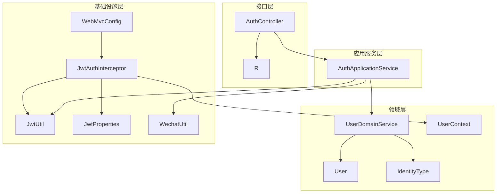
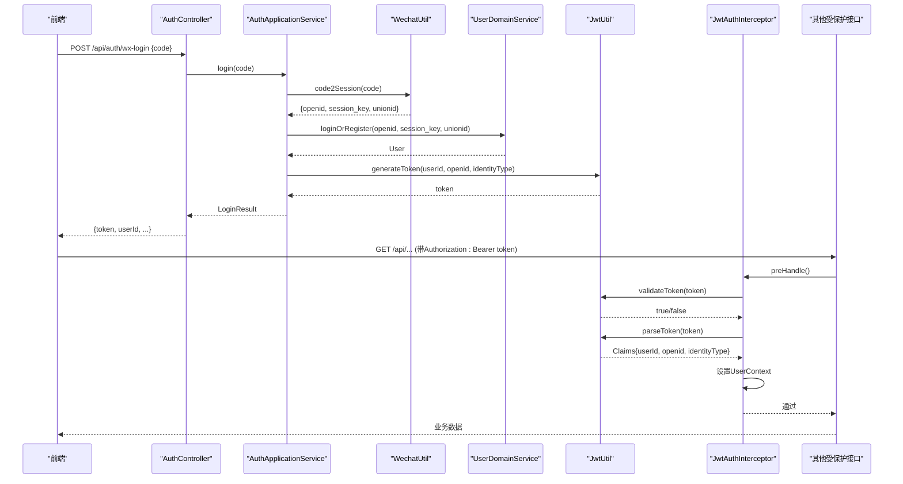
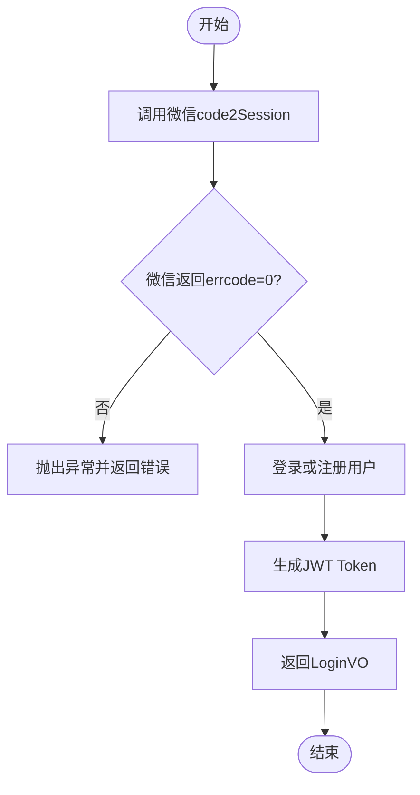
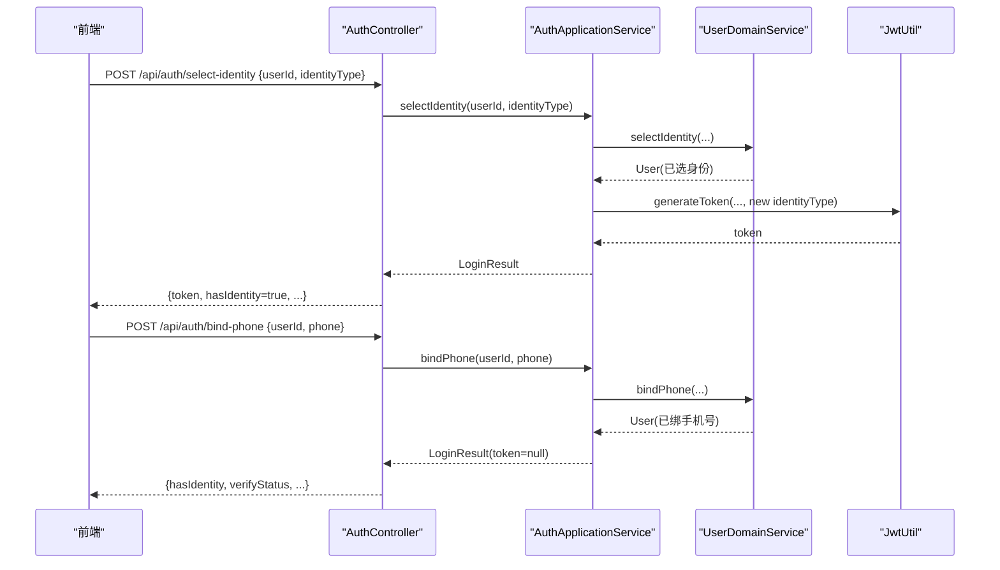
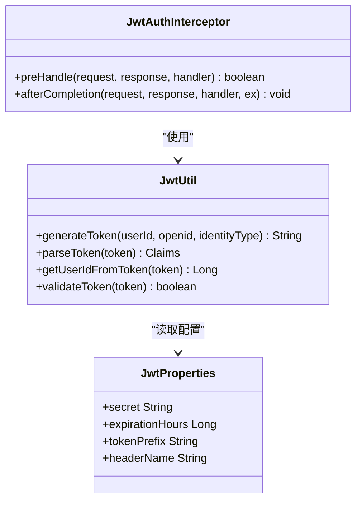
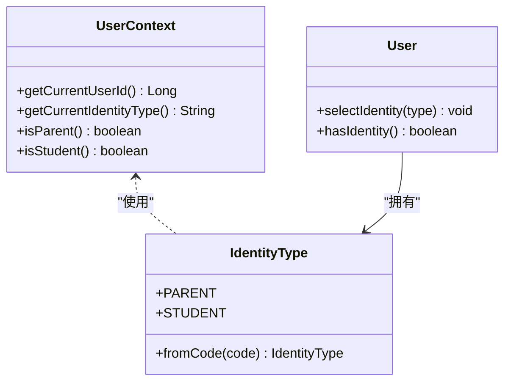
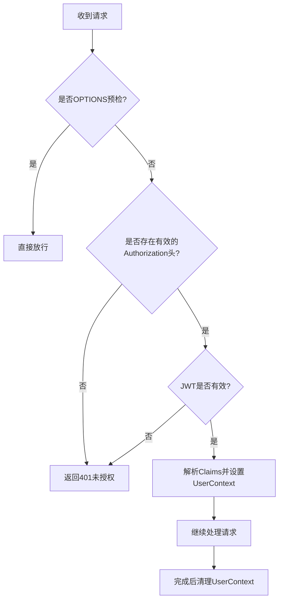
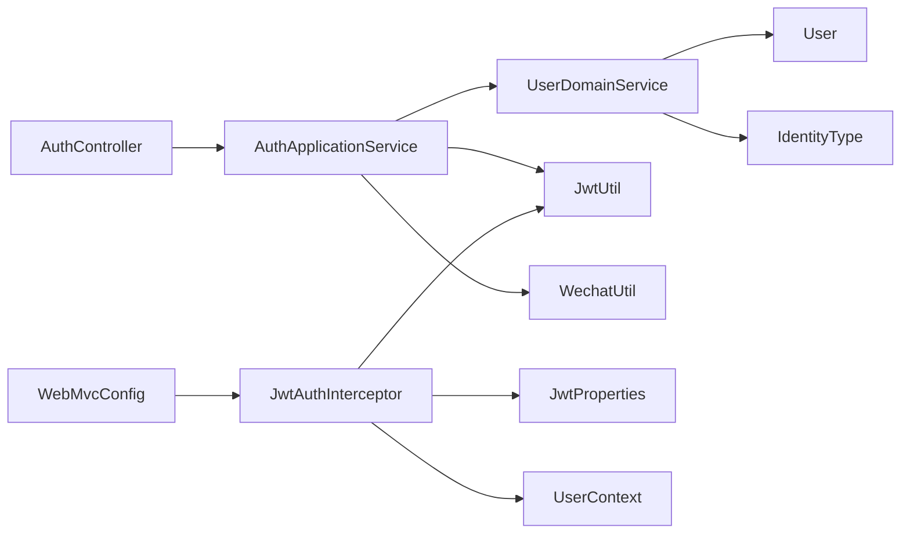

# 用户认证系统

<cite>
**本文引用的文件**
- [AuthController.java](file://wzoto-backend/wzoto-interfaces/src/main/java/com/wzoto/interfaces/controller/AuthController.java)
- [AuthApplicationService.java](file://wzoto-backend/wzoto-application/src/main/java/com/wzoto/application/service/AuthApplicationService.java)
- [JwtUtil.java](file://wzoto-backend/wzoto-infrastructure/src/main/java/com/wzoto/infrastructure/util/JwtUtil.java)
- [JwtProperties.java](file://wzoto-backend/wzoto-infrastructure/src/main/java/com/wzoto/infrastructure/config/JwtProperties.java)
- [JwtAuthInterceptor.java](file://wzoto-backend/wzoto-infrastructure/src/main/java/com/wzoto/infrastructure/interceptor/JwtAuthInterceptor.java)
- [WebMvcConfig.java](file://wzoto-backend/wzoto-infrastructure/src/main/java/com/wzoto/infrastructure/config/WebMvcConfig.java)
- [UserDomainService.java](file://wzoto-backend/wzoto-domain/src/main/java/com/wzoto/domain/service/UserDomainService.java)
- [User.java](file://wzoto-backend/wzoto-domain/src/main/java/com/wzoto/domain/entity/User.java)
- [IdentityType.java](file://wzoto-backend/wzoto-domain/src/main/java/com/wzoto/domain/valobj/IdentityType.java)
- [WechatUtil.java](file://wzoto-backend/wzoto-infrastructure/src/main/java/com/wzoto/infrastructure/util/WechatUtil.java)
- [WxLoginDTO.java](file://wzoto-backend/wzoto-interfaces/src/main/java/com/wzoto/interfaces/dto/WxLoginDTO.java)
- [R.java](file://wzoto-backend/wzoto-interfaces/src/main/java/com/wzoto/interfaces/common/R.java)
- [LoginVO.java](file://wzoto-backend/wzoto-interfaces/src/main/java/com/wzoto/interfaces/vo/LoginVO.java)
- [UserInfoVO.java](file://wzoto-backend/wzoto-interfaces/src/main/java/com/wzoto/interfaces/vo/UserInfoVO.java)
</cite>

## 目录
1. [简介](#简介)
2. [项目结构](#项目结构)
3. [核心组件](#核心组件)
4. [架构总览](#架构总览)
5. [详细组件分析](#详细组件分析)
6. [依赖关系分析](#依赖关系分析)
7. [性能考虑](#性能考虑)
8. [故障排查指南](#故障排查指南)
9. [结论](#结论)
10. [附录：API接口文档与前端集成](#附录api接口文档与前端集成)

## 简介
本文件为 wzoto 用户认证系统的权威技术文档，聚焦以下目标：
- 微信OAuth登录流程：授权码获取、用户信息获取、账号绑定等步骤。
- JWT令牌管理：生成、验证、刷新、过期处理策略。
- 基于角色的权限控制：家长、学生两种身份（代码中定义）的定义与权限分配方式。
- 拦截器实现原理：请求拦截、用户上下文管理、权限校验逻辑。
- 安全最佳实践：密码加密、会话管理、防攻击措施。
- 完整API接口文档：请求参数、响应格式、错误码定义。
- 前端集成示例与常见问题解决方案。

## 项目结构
后端采用分层架构：
- 接口层（interfaces）：对外暴露REST API，统一返回体R<T>，包含认证控制器AuthController。
- 应用服务层（application）：编排业务流程，如AuthApplicationService负责微信登录、选择身份、绑定手机号。
- 领域层（domain）：实体User、值对象IdentityType、领域服务UserDomainService、上下文UserContext。
- 基础设施层（infrastructure）：JWT工具JwtUtil、配置JwtProperties、拦截器JwtAuthInterceptor、微信工具WechatUtil、MVC配置WebMvcConfig。

图表来源
- [AuthController.java:1-149](file://wzoto-backend/wzoto-interfaces/src/main/java/com/wzoto/interfaces/controller/AuthController.java#L1-L149)
- [AuthApplicationService.java:1-119](file://wzoto-backend/wzoto-application/src/main/java/com/wzoto/application/service/AuthApplicationService.java#L1-L119)
- [UserDomainService.java:1-76](file://wzoto-backend/wzoto-domain/src/main/java/com/wzoto/domain/service/UserDomainService.java#L1-L76)
- [User.java:1-93](file://wzoto-backend/wzoto-domain/src/main/java/com/wzoto/domain/entity/User.java#L1-L93)
- [IdentityType.java:1-31](file://wzoto-backend/wzoto-domain/src/main/java/com/wzoto/domain/valobj/IdentityType.java#L1-L31)
- [JwtUtil.java:1-81](file://wzoto-backend/wzoto-infrastructure/src/main/java/com/wzoto/infrastructure/util/JwtUtil.java#L1-L81)
- [JwtProperties.java:1-26](file://wzoto-backend/wzoto-infrastructure/src/main/java/com/wzoto/infrastructure/config/JwtProperties.java#L1-L26)
- [JwtAuthInterceptor.java:1-65](file://wzoto-backend/wzoto-infrastructure/src/main/java/com/wzoto/infrastructure/interceptor/JwtAuthInterceptor.java#L1-L65)
- [WebMvcConfig.java:1-42](file://wzoto-backend/wzoto-infrastructure/src/main/java/com/wzoto/infrastructure/config/WebMvcConfig.java#L1-L42)
- [WechatUtil.java:1-57](file://wzoto-backend/wzoto-infrastructure/src/main/java/com/wzoto/infrastructure/util/WechatUtil.java#L1-L57)

章节来源
- [AuthController.java:1-149](file://wzoto-backend/wzoto-interfaces/src/main/java/com/wzoto/interfaces/controller/AuthController.java#L1-L149)
- [WebMvcConfig.java:1-42](file://wzoto-backend/wzoto-infrastructure/src/main/java/com/wzoto/infrastructure/config/WebMvcConfig.java#L1-L42)

## 核心组件
- 认证控制器（AuthController）：提供微信登录、选择身份、绑定手机号、获取当前用户信息等接口。
- 应用服务（AuthApplicationService）：编排微信code2Session、用户登录/注册、JWT生成、身份选择与手机号绑定。
- 领域服务（UserDomainService）：封装用户登录/注册、身份选择、绑定手机号的业务规则。
- JWT工具（JwtUtil）：生成、解析、验证JWT；从Token提取用户ID。
- 拦截器（JwtAuthInterceptor）：从请求头提取并校验JWT，注入UserContext，支持OPTIONS放行。
- MVC配置（WebMvcConfig）：注册拦截器，排除登录相关路径，配置全局CORS。
- 微信工具（WechatUtil）：调用微信code2Session接口，处理错误码。
- 值对象（IdentityType）：定义身份类型（家长、学生），提供fromCode转换。
- 实体（User）：用户模型，包含身份选择不可切换等域行为。
- 统一返回（R）：统一响应结构，含成功、失败、未授权、请求错误等。
- VO/DTO：登录结果VO、当前用户信息VO、微信登录DTO。

章节来源
- [AuthController.java:1-149](file://wzoto-backend/wzoto-interfaces/src/main/java/com/wzoto/interfaces/controller/AuthController.java#L1-L149)
- [AuthApplicationService.java:1-119](file://wzoto-backend/wzoto-application/src/main/java/com/wzoto/application/service/AuthApplicationService.java#L1-L119)
- [UserDomainService.java:1-76](file://wzoto-backend/wzoto-domain/src/main/java/com/wzoto/domain/service/UserDomainService.java#L1-L76)
- [JwtUtil.java:1-81](file://wzoto-backend/wzoto-infrastructure/src/main/java/com/wzoto/infrastructure/util/JwtUtil.java#L1-L81)
- [JwtAuthInterceptor.java:1-65](file://wzoto-backend/wzoto-infrastructure/src/main/java/com/wzoto/infrastructure/interceptor/JwtAuthInterceptor.java#L1-L65)
- [WebMvcConfig.java:1-42](file://wzoto-backend/wzoto-infrastructure/src/main/java/com/wzoto/infrastructure/config/WebMvcConfig.java#L1-L42)
- [WechatUtil.java:1-57](file://wzoto-backend/wzoto-infrastructure/src/main/java/com/wzoto/infrastructure/util/WechatUtil.java#L1-L57)
- [IdentityType.java:1-31](file://wzoto-backend/wzoto-domain/src/main/java/com/wzoto/domain/valobj/IdentityType.java#L1-L31)
- [User.java:1-93](file://wzoto-backend/wzoto-domain/src/main/java/com/wzoto/domain/entity/User.java#L1-L93)
- [R.java:1-43](file://wzoto-backend/wzoto-interfaces/src/main/java/com/wzoto/interfaces/common/R.java#L1-L43)

## 架构总览
下图展示了微信登录到受保护资源访问的端到端流程，包括拦截器校验、JWT解析、用户上下文注入以及业务服务编排。

图表来源
- [AuthController.java:65-100](file://wzoto-backend/wzoto-interfaces/src/main/java/com/wzoto/interfaces/controller/AuthController.java#L65-L100)
- [AuthApplicationService.java:26-57](file://wzoto-backend/wzoto-application/src/main/java/com/wzoto/application/service/AuthApplicationService.java#L26-L57)
- [WechatUtil.java:21-45](file://wzoto-backend/wzoto-infrastructure/src/main/java/com/wzoto/infrastructure/util/WechatUtil.java#L21-L45)
- [UserDomainService.java:20-46](file://wzoto-backend/wzoto-domain/src/main/java/com/wzoto/domain/service/UserDomainService.java#L20-L46)
- [JwtUtil.java:27-59](file://wzoto-backend/wzoto-infrastructure/src/main/java/com/wzoto/infrastructure/util/JwtUtil.java#L27-L59)
- [JwtAuthInterceptor.java:27-58](file://wzoto-backend/wzoto-infrastructure/src/main/java/com/wzoto/infrastructure/interceptor/JwtAuthInterceptor.java#L27-L58)

## 详细组件分析

### 微信OAuth登录流程
- 前端调用POST /api/auth/wx-login，携带微信登录凭证code。
- AuthController委托AuthApplicationService.login(code)。
- WechatUtil.code2Session(code)换取openid、session_key、unionid。
- UserDomainService.loginOrRegister根据openid查找或自动注册用户，更新session_key。
- JwtUtil.generateToken生成JWT，包含userId、openid、identityType。
- 返回LoginVO给前端，前端保存token用于后续请求。

图表来源
- [AuthController.java:65-75](file://wzoto-backend/wzoto-interfaces/src/main/java/com/wzoto/interfaces/controller/AuthController.java#L65-L75)
- [AuthApplicationService.java:26-57](file://wzoto-backend/wzoto-application/src/main/java/com/wzoto/application/service/AuthApplicationService.java#L26-L57)
- [WechatUtil.java:21-45](file://wzoto-backend/wzoto-infrastructure/src/main/java/com/wzoto/infrastructure/util/WechatUtil.java#L21-L45)
- [UserDomainService.java:20-46](file://wzoto-backend/wzoto-domain/src/main/java/com/wzoto/domain/service/UserDomainService.java#L20-L46)
- [JwtUtil.java:27-47](file://wzoto-backend/wzoto-infrastructure/src/main/java/com/wzoto/infrastructure/util/JwtUtil.java#L27-L47)

章节来源
- [AuthController.java:65-100](file://wzoto-backend/wzoto-interfaces/src/main/java/com/wzoto/interfaces/controller/AuthController.java#L65-L100)
- [AuthApplicationService.java:26-57](file://wzoto-backend/wzoto-application/src/main/java/com/wzoto/application/service/AuthApplicationService.java#L26-L57)
- [WechatUtil.java:21-45](file://wzoto-backend/wzoto-infrastructure/src/main/java/com/wzoto/infrastructure/util/WechatUtil.java#L21-L45)
- [UserDomainService.java:20-46](file://wzoto-backend/wzoto-domain/src/main/java/com/wzoto/domain/service/UserDomainService.java#L20-L46)
- [JwtUtil.java:27-47](file://wzoto-backend/wzoto-infrastructure/src/main/java/com/wzoto/infrastructure/util/JwtUtil.java#L27-L47)

### 身份选择与账号绑定
- 选择身份：POST /api/auth/select-identity，传入userId与identityType。
- AuthApplicationService.selectIdentity调用UserDomainService.selectIdentity，执行“一经选择不可随意切换”的业务规则。
- 重新生成JWT以反映新身份。
- 绑定手机号：POST /api/auth/bind-phone，传入userId与phone。
- AuthApplicationService.bindPhone调用UserDomainService.bindPhone更新手机号，不重新生成token。

图表来源
- [AuthController.java:77-100](file://wzoto-backend/wzoto-interfaces/src/main/java/com/wzoto/interfaces/controller/AuthController.java#L77-L100)
- [AuthApplicationService.java:59-100](file://wzoto-backend/wzoto-application/src/main/java/com/wzoto/application/service/AuthApplicationService.java#L59-L100)
- [UserDomainService.java:48-76](file://wzoto-backend/wzoto-domain/src/main/java/com/wzoto/domain/service/UserDomainService.java#L48-L76)
- [JwtUtil.java:27-47](file://wzoto-backend/wzoto-infrastructure/src/main/java/com/wzoto/infrastructure/util/JwtUtil.java#L27-L47)

章节来源
- [AuthController.java:77-100](file://wzoto-backend/wzoto-interfaces/src/main/java/com/wzoto/interfaces/controller/AuthController.java#L77-L100)
- [AuthApplicationService.java:59-100](file://wzoto-backend/wzoto-application/src/main/java/com/wzoto/application/service/AuthApplicationService.java#L59-L100)
- [UserDomainService.java:48-76](file://wzoto-backend/wzoto-domain/src/main/java/com/wzoto/domain/service/UserDomainService.java#L48-L76)

### JWT令牌管理机制
- 生成：JwtUtil.generateToken使用HMAC-SHA密钥签发，载荷包含userId、openid、identityType，过期时间由JwtProperties.expirationHours决定。
- 验证：JwtUtil.validateToken尝试解析并捕获异常；JwtAuthInterceptor在preHandle中校验。
- 解析：JwtAuthInterceptor解析出userId、openid、identityType并注入UserContext。
- 刷新：当前实现未提供显式刷新接口；可在业务层增加“续期”接口，基于旧token生成新token并延长有效期。
- 过期处理：拦截器对无效或过期token返回401；前端应引导重新登录。

图表来源
- [JwtUtil.java:27-81](file://wzoto-backend/wzoto-infrastructure/src/main/java/com/wzoto/infrastructure/util/JwtUtil.java#L27-L81)
- [JwtProperties.java:10-26](file://wzoto-backend/wzoto-infrastructure/src/main/java/com/wzoto/infrastructure/config/JwtProperties.java#L10-L26)
- [JwtAuthInterceptor.java:27-65](file://wzoto-backend/wzoto-infrastructure/src/main/java/com/wzoto/infrastructure/interceptor/JwtAuthInterceptor.java#L27-L65)

章节来源
- [JwtUtil.java:27-81](file://wzoto-backend/wzoto-infrastructure/src/main/java/com/wzoto/infrastructure/util/JwtUtil.java#L27-L81)
- [JwtProperties.java:10-26](file://wzoto-backend/wzoto-infrastructure/src/main/java/com/wzoto/infrastructure/config/JwtProperties.java#L10-L26)
- [JwtAuthInterceptor.java:27-65](file://wzoto-backend/wzoto-infrastructure/src/main/java/com/wzoto/infrastructure/interceptor/JwtAuthInterceptor.java#L27-L65)

### 基于角色的权限控制体系
- 身份类型：IdentityType定义PARENT（家长）、STUDENT（大学生）。注意：代码中未定义“教员”角色。
- 用户上下文：UserContext提供isParent/isStudent判断方法，供业务层进行权限判定。
- 权限分配建议：
  - 家长：可管理子女、查看学习报告、配置家长控制等。
  - 学生：可访问课程、练习、错题本等学习功能。
  - 教员：如需扩展，可增加新的IdentityType并在UserContext中提供相应判断方法。
- 实施要点：在受保护接口中通过UserContext.getCurrentIdentityType()进行细粒度鉴权。

图表来源
- [IdentityType.java:10-31](file://wzoto-backend/wzoto-domain/src/main/java/com/wzoto/domain/valobj/IdentityType.java#L10-L31)
- [UserContext.java:14-56](file://wzoto-backend/wzoto-domain/src/main/java/com/wzoto/domain/context/UserContext.java#L14-L56)
- [User.java:63-85](file://wzoto-backend/wzoto-domain/src/main/java/com/wzoto/domain/entity/User.java#L63-L85)

章节来源
- [IdentityType.java:10-31](file://wzoto-backend/wzoto-domain/src/main/java/com/wzoto/domain/valobj/IdentityType.java#L10-L31)
- [UserContext.java:14-56](file://wzoto-backend/wzoto-domain/src/main/java/com/wzoto/domain/context/UserContext.java#L14-L56)
- [User.java:63-85](file://wzoto-backend/wzoto-domain/src/main/java/com/wzoto/domain/entity/User.java#L63-L85)

### 拦截器实现原理
- 请求拦截：JwtAuthInterceptor.preHandle从Authorization头提取Bearer token，校验有效性。
- 用户上下文：解析成功后将userId、openid、identityType写入UserContext（ThreadLocal）。
- 权限校验：结合UserContext.isParent/isStudent进行后续业务鉴权。
- 清理：afterCompletion中清理ThreadLocal，避免内存泄漏。
- 白名单：WebMvcConfig排除登录相关路径，允许未认证访问。

图表来源
- [JwtAuthInterceptor.java:27-65](file://wzoto-backend/wzoto-infrastructure/src/main/java/com/wzoto/infrastructure/interceptor/JwtAuthInterceptor.java#L27-L65)
- [WebMvcConfig.java:21-31](file://wzoto-backend/wzoto-infrastructure/src/main/java/com/wzoto/infrastructure/config/WebMvcConfig.java#L21-L31)

章节来源
- [JwtAuthInterceptor.java:27-65](file://wzoto-backend/wzoto-infrastructure/src/main/java/com/wzoto/infrastructure/interceptor/JwtAuthInterceptor.java#L27-L65)
- [WebMvcConfig.java:21-31](file://wzoto-backend/wzoto-infrastructure/src/main/java/com/wzoto/infrastructure/config/WebMvcConfig.java#L21-L31)

### 安全最佳实践
- 密码加密：当前系统基于微信OAuth登录，不涉及本地密码存储；若需用户名密码登录，请使用强哈希算法（如BCrypt）加盐存储。
- 会话管理：使用JWT无状态会话，服务端不保存会话；可通过黑名单或短期有效期+刷新机制增强安全性。
- 防攻击措施：
  - 限制登录频率与IP，防止暴力破解。
  - 校验并拒绝非法或过期的JWT。
  - 敏感操作二次确认（如绑定手机号、修改身份）。
  - 使用HTTPS传输，防止中间人攻击。
  - 严格最小化JWT载荷，避免泄露敏感信息。
- 微信解密：WechatUtil.decryptPhone待接入官方SDK，确保手机号解密符合微信规范。

[本节为通用安全指导，不直接分析具体文件]

## 依赖关系分析
- 控制器依赖应用服务，应用服务依赖领域服务与基础设施工具。
- 拦截器依赖JWT工具与配置，并通过UserContext跨层传递用户信息。
- 微信工具依赖配置项（appId、appSecret、loginUrl）。
- 领域实体与值对象被领域服务与上下文使用。

图表来源
- [AuthController.java:1-149](file://wzoto-backend/wzoto-interfaces/src/main/java/com/wzoto/interfaces/controller/AuthController.java#L1-L149)
- [AuthApplicationService.java:1-119](file://wzoto-backend/wzoto-application/src/main/java/com/wzoto/application/service/AuthApplicationService.java#L1-L119)
- [UserDomainService.java:1-76](file://wzoto-backend/wzoto-domain/src/main/java/com/wzoto/domain/service/UserDomainService.java#L1-L76)
- [JwtUtil.java:1-81](file://wzoto-backend/wzoto-infrastructure/src/main/java/com/wzoto/infrastructure/util/JwtUtil.java#L1-L81)
- [JwtProperties.java:1-26](file://wzoto-backend/wzoto-infrastructure/src/main/java/com/wzoto/infrastructure/config/JwtProperties.java#L1-L26)
- [JwtAuthInterceptor.java:1-65](file://wzoto-backend/wzoto-infrastructure/src/main/java/com/wzoto/infrastructure/interceptor/JwtAuthInterceptor.java#L1-L65)
- [WebMvcConfig.java:1-42](file://wzoto-backend/wzoto-infrastructure/src/main/java/com/wzoto/infrastructure/config/WebMvcConfig.java#L1-L42)
- [User.java:1-93](file://wzoto-backend/wzoto-domain/src/main/java/com/wzoto/domain/entity/User.java#L1-L93)
- [IdentityType.java:1-31](file://wzoto-backend/wzoto-domain/src/main/java/com/wzoto/domain/valobj/IdentityType.java#L1-L31)

章节来源
- [AuthController.java:1-149](file://wzoto-backend/wzoto-interfaces/src/main/java/com/wzoto/interfaces/controller/AuthController.java#L1-L149)
- [AuthApplicationService.java:1-119](file://wzoto-backend/wzoto-application/src/main/java/com/wzoto/application/service/AuthApplicationService.java#L1-L119)
- [UserDomainService.java:1-76](file://wzoto-backend/wzoto-domain/src/main/java/com/wzoto/domain/service/UserDomainService.java#L1-L76)
- [JwtUtil.java:1-81](file://wzoto-backend/wzoto-infrastructure/src/main/java/com/wzoto/infrastructure/util/JwtUtil.java#L1-L81)
- [JwtProperties.java:1-26](file://wzoto-backend/wzoto-infrastructure/src/main/java/com/wzoto/infrastructure/config/JwtProperties.java#L1-L26)
- [JwtAuthInterceptor.java:1-65](file://wzoto-backend/wzoto-infrastructure/src/main/java/com/wzoto/infrastructure/interceptor/JwtAuthInterceptor.java#L1-L65)
- [WebMvcConfig.java:1-42](file://wzoto-backend/wzoto-infrastructure/src/main/java/com/wzoto/infrastructure/config/WebMvcConfig.java#L1-L42)
- [User.java:1-93](file://wzoto-backend/wzoto-domain/src/main/java/com/wzoto/domain/entity/User.java#L1-L93)
- [IdentityType.java:1-31](file://wzoto-backend/wzoto-domain/src/main/java/com/wzoto/domain/valobj/IdentityType.java#L1-L31)

## 性能考虑
- 微信API调用：code2Session为外部HTTP调用，建议添加超时与重试策略，缓存session_key（谨慎评估安全性）。
- JWT解析：每次请求解析JWT有CPU开销，可考虑网关层验签后透传用户信息。
- 数据库访问：登录/注册涉及一次查询与可能的插入，建议索引openid、unionid提升查询性能。
- 线程上下文：UserContext使用ThreadLocal，务必在请求结束后清理，避免内存泄漏。
- CORS配置：开发环境宽松配置，生产环境应限制允许的源与方法。

[本节为通用性能指导，不直接分析具体文件]

## 故障排查指南
- 微信登录失败：检查WechatUtil.code2Session返回的errcode与errmsg，确认appId、appSecret、js_code正确。
- 未携带或无效Token：JwtAuthInterceptor会返回401，检查Authorization头格式是否为“Bearer <token>”。
- 身份选择失败：确认identityType为PARENT或STUDENT，且用户尚未选择身份。
- 绑定手机号失败：确认手机号格式与唯一性约束，检查UserDomainService.bindPhone逻辑。
- 统一返回码：R.ok/R.fail/R.unauthorized/R.badRequest对应不同业务状态，前端据此提示。

章节来源
- [WechatUtil.java:21-45](file://wzoto-backend/wzoto-infrastructure/src/main/java/com/wzoto/infrastructure/util/WechatUtil.java#L21-L45)
- [JwtAuthInterceptor.java:27-58](file://wzoto-backend/wzoto-infrastructure/src/main/java/com/wzoto/infrastructure/interceptor/JwtAuthInterceptor.java#L27-L58)
- [UserDomainService.java:48-76](file://wzoto-backend/wzoto-domain/src/main/java/com/wzoto/domain/service/UserDomainService.java#L48-L76)
- [R.java:19-41](file://wzoto-backend/wzoto-interfaces/src/main/java/com/wzoto/interfaces/common/R.java#L19-L41)

## 结论
本认证系统以微信OAuth为核心，结合JWT无状态鉴权与分层架构，实现了安全的登录、身份选择与手机号绑定流程。通过拦截器与用户上下文，为后续权限控制提供了基础。建议在现有基础上完善令牌刷新机制、扩展教员角色、加强安全策略与性能优化。

[本节为总结性内容，不直接分析具体文件]

## 附录：API接口文档与前端集成

### 接口清单与说明
- 获取当前用户信息
  - 方法：GET
  - 路径：/api/auth/me
  - 认证：需要
  - 响应：UserInfoVO（包含userId、openid、phone、nickname、avatar、identityType、identityTypeDesc、hasIdentity、verifyStatus、verifyStatusDesc、realName）
  - 错误：未授权时返回401

- 微信登录
  - 方法：POST
  - 路径：/api/auth/wx-login
  - 请求体：WxLoginDTO（code）
  - 响应：LoginVO（token、userId、nickname、avatar、identityType、hasIdentity、verifyStatus、phone）
  - 错误：微信登录失败时抛出异常，统一返回错误

- 选择身份
  - 方法：POST
  - 路径：/api/auth/select-identity
  - 请求体：SelectIdentityDTO（userId、identityType）
  - 响应：LoginVO（重新生成token）
  - 错误：用户不存在或身份无效

- 绑定手机号
  - 方法：POST
  - 路径：/api/auth/bind-phone
  - 请求体：BindPhoneDTO（userId、phone）
  - 响应：LoginVO（不重新生成token）
  - 错误：用户不存在或手机号无效

- 开发环境登录（仅开发环境）
  - 方法：POST
  - 路径：/api/auth/dev-login
  - 请求体：DevLoginDTO（nickname）
  - 响应：LoginVO
  - 错误：用户不存在

章节来源
- [AuthController.java:34-127](file://wzoto-backend/wzoto-interfaces/src/main/java/com/wzoto/interfaces/controller/AuthController.java#L34-L127)
- [WxLoginDTO.java:1-15](file://wzoto-backend/wzoto-interfaces/src/main/java/com/wzoto/interfaces/dto/WxLoginDTO.java#L1-L15)
- [LoginVO.java:1-40](file://wzoto-backend/wzoto-interfaces/src/main/java/com/wzoto/interfaces/vo/LoginVO.java#L1-L40)
- [UserInfoVO.java:1-45](file://wzoto-backend/wzoto-interfaces/src/main/java/com/wzoto/interfaces/vo/UserInfoVO.java#L1-L45)

### 统一返回体与错误码
- 成功：R.ok(data) -> {code:200, msg:"success", data}
- 失败：R.fail(msg) -> {code:500, msg, data:null}
- 未授权：R.unauthorized(msg) -> {code:401, msg, data:null}
- 请求错误：R.badRequest(msg) -> {code:400, msg, data:null}

章节来源
- [R.java:19-41](file://wzoto-backend/wzoto-interfaces/src/main/java/com/wzoto/interfaces/common/R.java#L19-L41)

### 前端集成示例
- 登录流程：
  - 调用/api/auth/wx-login获取token，保存到本地存储。
  - 后续请求在Header中携带Authorization: Bearer <token>。
- 身份选择：
  - 登录后若hasIdentity=false，引导用户选择身份，调用/api/auth/select-identity。
- 绑定手机号：
  - 调用/api/auth/bind-phone完成绑定。
- 获取当前用户：
  - 调用/api/auth/me获取用户信息与认证状态。

[本节为概念性指导，不直接分析具体文件]

### 常见问题解决方案
- 401未授权：检查Authorization头格式与token有效性，必要时重新登录。
- 微信登录失败：核对微信配置与code有效性，查看日志中的errcode与errmsg。
- 身份无法切换：遵循“一经选择不可随意切换”的规则，如需变更请联系管理员重置。
- 手机号绑定失败：检查手机号格式与唯一性，确认用户存在。

章节来源
- [JwtAuthInterceptor.java:27-58](file://wzoto-backend/wzoto-infrastructure/src/main/java/com/wzoto/infrastructure/interceptor/JwtAuthInterceptor.java#L27-L58)
- [WechatUtil.java:21-45](file://wzoto-backend/wzoto-infrastructure/src/main/java/com/wzoto/infrastructure/util/WechatUtil.java#L21-L45)
- [User.java:63-71](file://wzoto-backend/wzoto-domain/src/main/java/com/wzoto/domain/entity/User.java#L63-L71)