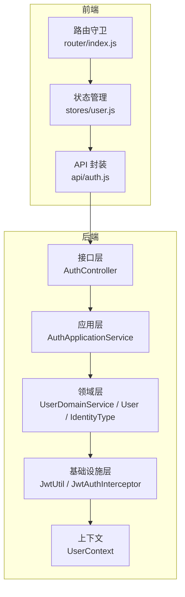
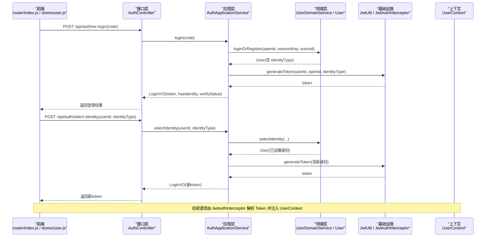
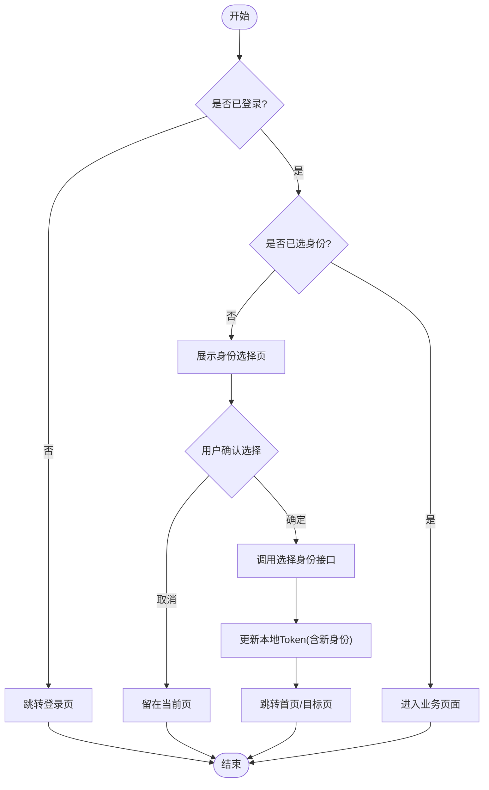
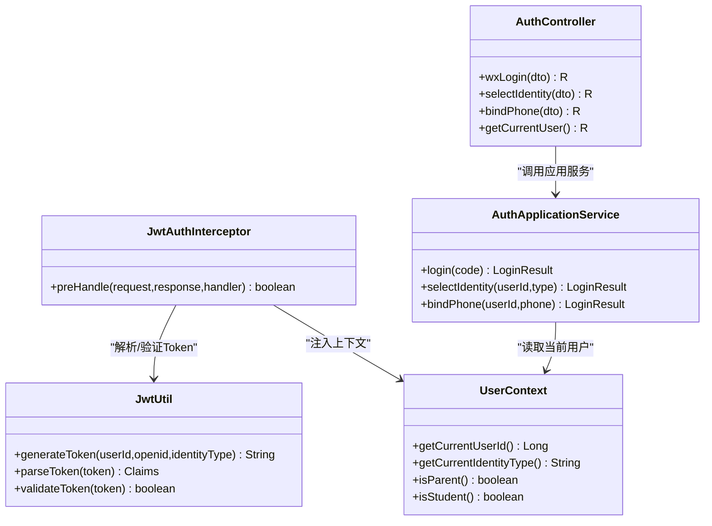
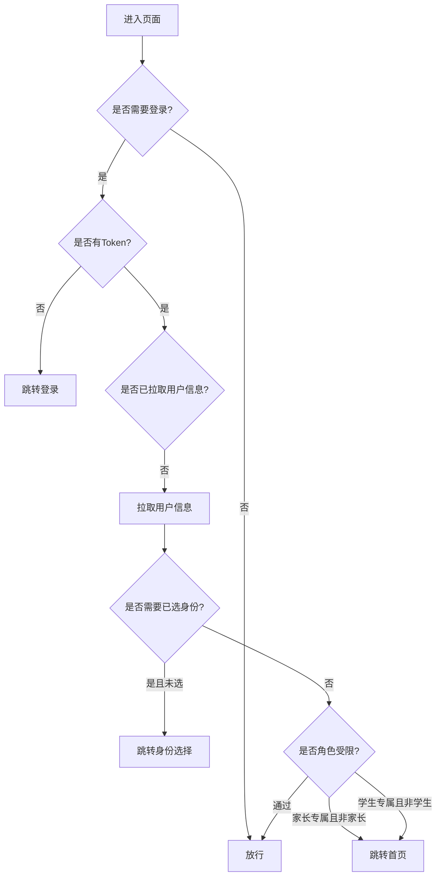
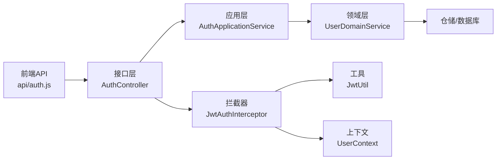

# 角色权限控制

<cite>
**本文引用的文件**
- [IdentityType.java](file://wzoto-backend/wzoto-domain/src/main/java/com/wzoto/domain/valobj/IdentityType.java)
- [User.java](file://wzoto-backend/wzoto-domain/src/main/java/com/wzoto/domain/entity/User.java)
- [UserDomainService.java](file://wzoto-backend/wzoto-domain/src/main/java/com/wzoto/domain/service/UserDomainService.java)
- [AuthController.java](file://wzoto-backend/wzoto-interfaces/src/main/java/com/wzoto/interfaces/controller/AuthController.java)
- [AuthApplicationService.java](file://wzoto-backend/wzoto-application/src/main/java/com/wzoto/application/service/AuthApplicationService.java)
- [JwtAuthInterceptor.java](file://wzoto-backend/wzoto-infrastructure/src/main/java/com/wzoto/infrastructure/interceptor/JwtAuthInterceptor.java)
- [JwtUtil.java](file://wzoto-backend/wzoto-infrastructure/src/main/java/com/wzoto/infrastructure/util/JwtUtil.java)
- [UserContext.java](file://wzoto-backend/wzoto-domain/src/main/java/com/wzoto/domain/context/UserContext.java)
- [index.js](file://wzoto-frontend/src/router/index.js)
- [user.js](file://wzoto-frontend/src/stores/user.js)
- [auth.js](file://wzoto-frontend/src/api/auth.js)
- [SelectIdentityPage.vue](file://wzoto-frontend/src/pages/auth/SelectIdentityPage.vue)
</cite>

## 目录
1. [简介](#简介)
2. [项目结构](#项目结构)
3. [核心组件](#核心组件)
4. [架构总览](#架构总览)
5. [详细组件分析](#详细组件分析)
6. [依赖关系分析](#依赖关系分析)
7. [性能考虑](#性能考虑)
8. [故障排查指南](#故障排查指南)
9. [结论](#结论)
10. [附录](#附录)

## 简介
本文件围绕“角色权限控制系统”进行系统化说明，聚焦三种用户身份（家长、学生、教员）的定义与差异、身份选择流程与限制、基于角色的访问控制（RBAC）在后端与前端的实现方式，以及扩展新身份的方法。文档同时提供权限配置示例、前端菜单/按钮级权限控制思路、测试用例建议与常见问题解决方案，帮助读者快速理解并落地实施。

## 项目结构
本项目采用分层架构：
- 领域层（domain）：定义实体、值对象、领域服务与上下文（如 User、IdentityType、UserContext）。
- 应用层（application）：编排业务流程（如 AuthApplicationService）。
- 接口层（interfaces）：对外暴露 API（如 AuthController）。
- 基础设施层（infrastructure）：通用能力（如 JWT 工具、拦截器）。
- 前端（frontend）：路由守卫、状态管理、页面与 API 调用。

图表来源
- [AuthController.java:21-149](file://wzoto-backend/wzoto-interfaces/src/main/java/com/wzoto/interfaces/controller/AuthController.java#L21-L149)
- [AuthApplicationService.java:13-119](file://wzoto-backend/wzoto-application/src/main/java/com/wzoto/application/service/AuthApplicationService.java#L13-L119)
- [UserDomainService.java:10-76](file://wzoto-backend/wzoto-domain/src/main/java/com/wzoto/domain/service/UserDomainService.java#L10-L76)
- [JwtAuthInterceptor.java:15-65](file://wzoto-backend/wzoto-infrastructure/src/main/java/com/wzoto/infrastructure/interceptor/JwtAuthInterceptor.java#L15-L65)
- [JwtUtil.java:17-81](file://wzoto-backend/wzoto-infrastructure/src/main/java/com/wzoto/infrastructure/util/JwtUtil.java#L17-L81)
- [UserContext.java:7-56](file://wzoto-backend/wzoto-domain/src/main/java/com/wzoto/domain/context/UserContext.java#L7-L56)
- [index.js:192-249](file://wzoto-frontend/src/router/index.js#L192-L249)
- [user.js:5-126](file://wzoto-frontend/src/stores/user.js#L5-L126)
- [auth.js:1-30](file://wzoto-frontend/src/api/auth.js#L1-L30)

章节来源
- [AuthController.java:21-149](file://wzoto-backend/wzoto-interfaces/src/main/java/com/wzoto/interfaces/controller/AuthController.java#L21-L149)
- [AuthApplicationService.java:13-119](file://wzoto-backend/wzoto-application/src/main/java/com/wzoto/application/service/AuthApplicationService.java#L13-L119)
- [UserDomainService.java:10-76](file://wzoto-backend/wzoto-domain/src/main/java/com/wzoto/domain/service/UserDomainService.java#L10-L76)
- [JwtAuthInterceptor.java:15-65](file://wzoto-backend/wzoto-infrastructure/src/main/java/com/wzoto/infrastructure/interceptor/JwtAuthInterceptor.java#L15-L65)
- [JwtUtil.java:17-81](file://wzoto-backend/wzoto-infrastructure/src/main/java/com/wzoto/infrastructure/util/JwtUtil.java#L17-L81)
- [UserContext.java:7-56](file://wzoto-backend/wzoto-domain/src/main/java/com/wzoto/domain/context/UserContext.java#L7-L56)
- [index.js:192-249](file://wzoto-frontend/src/router/index.js#L192-L249)
- [user.js:5-126](file://wzoto-frontend/src/stores/user.js#L5-L126)
- [auth.js:1-30](file://wzoto-frontend/src/api/auth.js#L1-L30)

## 核心组件
- 身份类型枚举（IdentityType）：集中维护身份编码与描述，提供 fromCode 校验，确保身份取值安全可控。
- 用户实体（User）：承载用户基本信息与身份、认证状态；内置“身份一经选择不可随意切换”的业务规则。
- 领域服务（UserDomainService）：封装登录/注册、选择身份、绑定手机号等核心流程，保证业务一致性。
- 应用服务（AuthApplicationService）：编排微信登录、选择身份、绑定手机等跨层流程，负责生成/刷新 Token。
- 认证拦截器（JwtAuthInterceptor）：解析请求头中的 Token，注入当前用户上下文（UserContext），为后续鉴权提供基础。
- JWT 工具（JwtUtil）：生成、解析、验证 Token，并在 claims 中携带 userId、openid、identityType。
- 上下文（UserContext）：线程局部存储当前用户信息，提供 isParent/isStudent 等便捷判断方法。
- 前端路由守卫（router/index.js）：根据 meta 字段控制登录态、身份要求与家长/学生专属页面访问。
- 前端状态（stores/user.js）：维护 token、身份、认证状态等，并提供登录、选择身份、绑定手机等方法。
- 前端 API（api/auth.js）：封装认证相关接口调用。

章节来源
- [IdentityType.java:5-30](file://wzoto-backend/wzoto-domain/src/main/java/com/wzoto/domain/valobj/IdentityType.java#L5-L30)
- [User.java:12-93](file://wzoto-backend/wzoto-domain/src/main/java/com/wzoto/domain/entity/User.java#L12-L93)
- [UserDomainService.java:10-76](file://wzoto-backend/wzoto-domain/src/main/java/com/wzoto/domain/service/UserDomainService.java#L10-L76)
- [AuthApplicationService.java:13-119](file://wzoto-backend/wzoto-application/src/main/java/com/wzoto/application/service/AuthApplicationService.java#L13-L119)
- [JwtAuthInterceptor.java:15-65](file://wzoto-backend/wzoto-infrastructure/src/main/java/com/wzoto/infrastructure/interceptor/JwtAuthInterceptor.java#L15-L65)
- [JwtUtil.java:17-81](file://wzoto-backend/wzoto-infrastructure/src/main/java/com/wzoto/infrastructure/util/JwtUtil.java#L17-L81)
- [UserContext.java:7-56](file://wzoto-backend/wzoto-domain/src/main/java/com/wzoto/domain/context/UserContext.java#L7-L56)
- [index.js:192-249](file://wzoto-frontend/src/router/index.js#L192-L249)
- [user.js:5-126](file://wzoto-frontend/src/stores/user.js#L5-L126)
- [auth.js:1-30](file://wzoto-frontend/src/api/auth.js#L1-L30)

## 架构总览
下图展示了从前端到后端的完整认证与授权链路，包括微信登录、身份选择、JWT 校验与上下文注入。

图表来源
- [AuthController.java:65-87](file://wzoto-backend/wzoto-interfaces/src/main/java/com/wzoto/interfaces/controller/AuthController.java#L65-L87)
- [AuthApplicationService.java:26-79](file://wzoto-backend/wzoto-application/src/main/java/com/wzoto/application/service/AuthApplicationService.java#L26-L79)
- [UserDomainService.java:20-61](file://wzoto-backend/wzoto-domain/src/main/java/com/wzoto/domain/service/UserDomainService.java#L20-L61)
- [JwtUtil.java:27-47](file://wzoto-backend/wzoto-infrastructure/src/main/java/com/wzoto/infrastructure/util/JwtUtil.java#L27-L47)
- [JwtAuthInterceptor.java:27-58](file://wzoto-backend/wzoto-infrastructure/src/main/java/com/wzoto/infrastructure/interceptor/JwtAuthInterceptor.java#L27-L58)
- [UserContext.java:27-56](file://wzoto-backend/wzoto-domain/src/main/java/com/wzoto/domain/context/UserContext.java#L27-L56)

## 详细组件分析

### 身份类型与业务场景
- 家长（PARENT）
  - 业务场景：为孩子寻找优质大学生家教，浏览教员档案、筛选预约、学习管理与报告查看等。
  - 权限范围：家长专属页面（如学习计划、学情报告、课程资源、时长管控等）可通过路由 meta.parentOnly 控制。
- 学生（STUDENT，代码中为“大学生”）
  - 业务场景：利用业余时间做家教，完善教员档案、接收家长预约、自由设置辅导科目与时段。
  - 权限范围：学生专属页面（如 AI 教员助手、增值功能等）通过 meta.studentOnly 控制。
- 教员（Tutor）
  - 现状：当前后端身份枚举仅包含 PARENT 与 STUDENT，未定义独立的 Tutor 身份。若需支持“教员”独立身份，可参考“新增身份扩展方法”。

章节来源
- [IdentityType.java:5-30](file://wzoto-backend/wzoto-domain/src/main/java/com/wzoto/domain/valobj/IdentityType.java#L5-L30)
- [index.js:30-136](file://wzoto-frontend/src/router/index.js#L30-L136)

### 身份选择流程与限制
- 流程要点
  - 微信登录后，若用户尚未选择身份，路由会引导至身份选择页。
  - 用户在身份选择页确认后，调用后端选择身份接口，服务端校验并持久化身份，重新签发包含新身份的 Token。
  - 前端在成功选择身份后跳转首页或相应功能页。
- 限制与历史
  - 业务规则：身份一经选择不可随意切换（User.selectIdentity 抛出异常阻止重复选择）。
  - 变更历史：当前实现未记录身份变更历史，如需审计可在领域层增加历史记录表或服务。

图表来源
- [index.js:198-249](file://wzoto-frontend/src/router/index.js#L198-L249)
- [SelectIdentityPage.vue:75-103](file://wzoto-frontend/src/pages/auth/SelectIdentityPage.vue#L75-L103)
- [AuthController.java:77-87](file://wzoto-backend/wzoto-interfaces/src/main/java/com/wzoto/interfaces/controller/AuthController.java#L77-L87)
- [AuthApplicationService.java:59-79](file://wzoto-backend/wzoto-application/src/main/java/com/wzoto/application/service/AuthApplicationService.java#L59-L79)
- [UserDomainService.java:48-61](file://wzoto-backend/wzoto-domain/src/main/java/com/wzoto/domain/service/UserDomainService.java#L48-L61)
- [User.java:63-71](file://wzoto-backend/wzoto-domain/src/main/java/com/wzoto/domain/entity/User.java#L63-L71)

章节来源
- [User.java:63-71](file://wzoto-backend/wzoto-domain/src/main/java/com/wzoto/domain/entity/User.java#L63-L71)
- [UserDomainService.java:48-61](file://wzoto-backend/wzoto-domain/src/main/java/com/wzoto/domain/service/UserDomainService.java#L48-L61)
- [AuthApplicationService.java:59-79](file://wzoto-backend/wzoto-application/src/main/java/com/wzoto/application/service/AuthApplicationService.java#L59-L79)
- [AuthController.java:77-87](file://wzoto-backend/wzoto-interfaces/src/main/java/com/wzoto/interfaces/controller/AuthController.java#L77-L87)
- [SelectIdentityPage.vue:75-103](file://wzoto-frontend/src/pages/auth/SelectIdentityPage.vue#L75-L103)
- [index.js:198-249](file://wzoto-frontend/src/router/index.js#L198-L249)

### 基于角色的访问控制（RBAC）实现
- 接口级别权限校验
  - 通过 JwtAuthInterceptor 统一校验 Token，解析出 userId、openid、identityType 并注入 UserContext。
  - 控制器与服务层可通过 UserContext.getCurrentUserId()、isParent()、isStudent() 进行权限判断。
- 数据级别权限过滤
  - 当前实现中，部分服务（如家长管控）使用 UserContext 获取 parentId 进行数据隔离（例如按 childId 查询时限定 parentId）。
  - 建议在涉及敏感数据的查询中，始终基于 UserContext 的 userId/identityType 附加过滤条件，避免越权。
- 注解式权限（建议）
  - 当前代码未使用注解式鉴权。可引入自定义注解（如 @RequireRole("PARENT")）配合 AOP 切面，在方法执行前校验 UserContext.identityType，提升可读性与复用性。

图表来源
- [JwtAuthInterceptor.java:27-58](file://wzoto-backend/wzoto-infrastructure/src/main/java/com/wzoto/infrastructure/interceptor/JwtAuthInterceptor.java#L27-L58)
- [JwtUtil.java:27-81](file://wzoto-backend/wzoto-infrastructure/src/main/java/com/wzoto/infrastructure/util/JwtUtil.java#L27-L81)
- [UserContext.java:27-56](file://wzoto-backend/wzoto-domain/src/main/java/com/wzoto/domain/context/UserContext.java#L27-L56)
- [AuthController.java:34-100](file://wzoto-backend/wzoto-interfaces/src/main/java/com/wzoto/interfaces/controller/AuthController.java#L34-L100)
- [AuthApplicationService.java:26-100](file://wzoto-backend/wzoto-application/src/main/java/com/wzoto/application/service/AuthApplicationService.java#L26-L100)

章节来源
- [JwtAuthInterceptor.java:27-58](file://wzoto-backend/wzoto-infrastructure/src/main/java/com/wzoto/infrastructure/interceptor/JwtAuthInterceptor.java#L27-L58)
- [UserContext.java:27-56](file://wzoto-backend/wzoto-domain/src/main/java/com/wzoto/domain/context/UserContext.java#L27-L56)
- [AuthController.java:34-100](file://wzoto-backend/wzoto-interfaces/src/main/java/com/wzoto/interfaces/controller/AuthController.java#L34-L100)
- [AuthApplicationService.java:26-100](file://wzoto-backend/wzoto-application/src/main/java/com/wzoto/application/service/AuthApplicationService.java#L26-L100)

### 身份类型枚举与扩展方法
- 现有枚举
  - PARENT：家长
  - STUDENT：大学生（当前代码中的“学生”实际指大学生）
- 新增身份步骤（以新增“教员”为例）
  - 在 IdentityType 中添加新枚举项（如 TUTOR），并补充 code/desc。
  - 在 User 实体中保持 identityType 字段不变（仍为 IdentityType）。
  - 在路由 meta 中新增 tutorOnly 标记，并在路由守卫中增加对应判断逻辑。
  - 在前端 user store 中增加 isTutor 计算属性，便于 UI 控制。
  - 在需要教员权限的服务中，使用 UserContext.isTutor() 或 identityType 判断进行数据隔离。

章节来源
- [IdentityType.java:5-30](file://wzoto-backend/wzoto-domain/src/main/java/com/wzoto/domain/valobj/IdentityType.java#L5-L30)
- [User.java:43-44](file://wzoto-backend/wzoto-domain/src/main/java/com/wzoto/domain/entity/User.java#L43-L44)
- [index.js:236-244](file://wzoto-frontend/src/router/index.js#L236-L244)
- [user.js:19-25](file://wzoto-frontend/src/stores/user.js#L19-L25)

### 权限配置示例（角色与功能映射）
- 家长（PARENT）
  - 可访问：找教员、AI学情诊断、学习计划、学习任务、学情报告、课程资源、视频播放、时长管控、错题本、成长激励等（通过 parentOnly 控制）。
- 学生（STUDENT，大学生）
  - 可访问：AI教员助手、增值功能等（通过 studentOnly 控制）。
- 教员（TUTOR，待扩展）
  - 建议：教员专属功能（如教员档案编辑、预约管理等）通过 tutorOnly 控制。

章节来源
- [index.js:30-136](file://wzoto-frontend/src/router/index.js#L30-L136)

### 前端权限控制实现
- 菜单显示控制
  - 依据 userStore.isParent/isStudent 动态渲染菜单项，隐藏无权限菜单。
- 按钮级权限
  - 在组件内通过 computed 或指令结合 userStore 判断是否显示操作按钮（如“预约”、“删除”等）。
- 页面跳转守卫
  - 使用 router.beforeEach 检查 noAuth、needIdentity、parentOnly、studentOnly 等元信息，未满足条件则重定向。

图表来源
- [index.js:198-249](file://wzoto-frontend/src/router/index.js#L198-L249)
- [user.js:67-85](file://wzoto-frontend/src/stores/user.js#L67-L85)

章节来源
- [index.js:198-249](file://wzoto-frontend/src/router/index.js#L198-L249)
- [user.js:67-85](file://wzoto-frontend/src/stores/user.js#L67-L85)

## 依赖关系分析
- 耦合与内聚
  - AuthController 仅负责参数校验与响应转换，业务编排下沉至 AuthApplicationService，职责清晰。
  - UserDomainService 封装核心规则（如身份不可切换），提高内聚性。
  - JwtAuthInterceptor 与 JwtUtil 解耦于业务，提供通用鉴权能力。
- 直接/间接依赖
  - 前端通过 api/auth.js 调用后端接口；路由守卫依赖 user store 的状态。
  - 后端各层通过 UserContext 共享当前用户上下文，降低显式传参耦合。
- 外部依赖
  - 微信登录依赖 WechatUtil（code2Session）。
  - Token 依赖 JwtUtil（JJWT）。

图表来源
- [auth.js:1-30](file://wzoto-frontend/src/api/auth.js#L1-L30)
- [AuthController.java:21-149](file://wzoto-backend/wzoto-interfaces/src/main/java/com/wzoto/interfaces/controller/AuthController.java#L21-L149)
- [AuthApplicationService.java:13-119](file://wzoto-backend/wzoto-application/src/main/java/com/wzoto/application/service/AuthApplicationService.java#L13-L119)
- [UserDomainService.java:10-76](file://wzoto-backend/wzoto-domain/src/main/java/com/wzoto/domain/service/UserDomainService.java#L10-L76)
- [JwtAuthInterceptor.java:15-65](file://wzoto-backend/wzoto-infrastructure/src/main/java/com/wzoto/infrastructure/interceptor/JwtAuthInterceptor.java#L15-L65)
- [JwtUtil.java:17-81](file://wzoto-backend/wzoto-infrastructure/src/main/java/com/wzoto/infrastructure/util/JwtUtil.java#L17-L81)
- [UserContext.java:7-56](file://wzoto-backend/wzoto-domain/src/main/java/com/wzoto/domain/context/UserContext.java#L7-L56)

章节来源
- [auth.js:1-30](file://wzoto-frontend/src/api/auth.js#L1-L30)
- [AuthController.java:21-149](file://wzoto-backend/wzoto-interfaces/src/main/java/com/wzoto/interfaces/controller/AuthController.java#L21-L149)
- [AuthApplicationService.java:13-119](file://wzoto-backend/wzoto-application/src/main/java/com/wzoto/application/service/AuthApplicationService.java#L13-L119)
- [UserDomainService.java:10-76](file://wzoto-backend/wzoto-domain/src/main/java/com/wzoto/domain/service/UserDomainService.java#L10-L76)
- [JwtAuthInterceptor.java:15-65](file://wzoto-backend/wzoto-infrastructure/src/main/java/com/wzoto/infrastructure/interceptor/JwtAuthInterceptor.java#L15-L65)
- [JwtUtil.java:17-81](file://wzoto-backend/wzoto-infrastructure/src/main/java/com/wzoto/infrastructure/util/JwtUtil.java#L17-L81)
- [UserContext.java:7-56](file://wzoto-backend/wzoto-domain/src/main/java/com/wzoto/domain/context/UserContext.java#L7-L56)

## 性能考虑
- Token 解析与校验
  - JwtAuthInterceptor 在每个请求中解析 Token，建议合理设置过期时间，减少频繁刷新。
- 用户信息缓存
  - 前端在首次进入受保护页面时拉取用户信息，建议对 UserInfo 做短期缓存，避免重复请求。
- 数据查询优化
  - 在服务层基于 UserContext 的 userId/identityType 添加必要索引与过滤条件，减少全表扫描。

[本节为通用指导，不直接分析具体文件]

## 故障排查指南
- 常见错误
  - 未携带有效 Token：拦截器返回 401，检查请求头是否正确携带 Authorization。
  - Token 无效或过期：检查签名与过期时间，必要时重新登录。
  - 身份选择失败：检查 IdentityType.fromCode 是否匹配，确认传入的身份编码合法。
  - 路由被重定向：检查路由 meta 配置与 userStore 状态是否一致（如 needIdentity、parentOnly、studentOnly）。
- 定位方法
  - 后端日志：关注拦截器与控制器日志，确认 userId、identityType 是否正确注入。
  - 前端调试：打开控制台查看网络请求与 user store 状态变化。

章节来源
- [JwtAuthInterceptor.java:27-58](file://wzoto-backend/wzoto-infrastructure/src/main/java/com/wzoto/infrastructure/interceptor/JwtAuthInterceptor.java#L27-L58)
- [AuthController.java:34-100](file://wzoto-backend/wzoto-interfaces/src/main/java/com/wzoto/interfaces/controller/AuthController.java#L34-L100)
- [IdentityType.java:22-29](file://wzoto-backend/wzoto-domain/src/main/java/com/wzoto/domain/valobj/IdentityType.java#L22-L29)
- [index.js:198-249](file://wzoto-frontend/src/router/index.js#L198-L249)

## 结论
本系统通过“身份枚举 + 领域规则 + 应用编排 + 拦截器鉴权 + 前端路由守卫”的组合，实现了清晰的家长/学生身份区分与访问控制。当前未定义独立“教员”身份，但提供了可扩展的枚举与前后端机制。建议后续引入注解式鉴权与数据级权限过滤，增强可维护性与安全性。

[本节为总结，不直接分析具体文件]

## 附录
- 权限测试用例建议
  - 登录态测试：未登录访问受保护页面应跳转登录；登录后正常进入。
  - 身份选择测试：未选身份访问需身份页面应跳转身份选择；选择成功后刷新 Token 并进入目标页。
  - 角色权限测试：家长访问家长专属页面应放行；学生访问家长专属页面应重定向。
  - Token 失效测试：伪造/过期 Token 应返回 401 并提示重新登录。
  - 边界情况：非法身份编码、重复选择身份、并发请求下的上下文清理。
- 常见问题解决方案
  - 无法进入受保护页面：检查路由 meta 与 user store 状态；确认已拉取用户信息。
  - 接口报 401：检查 Authorization 头格式与 Token 有效性。
  - 身份选择后仍提示未选身份：确认后端返回的 hasIdentity 与前端 user store 同步。

[本节为通用指导，不直接分析具体文件]