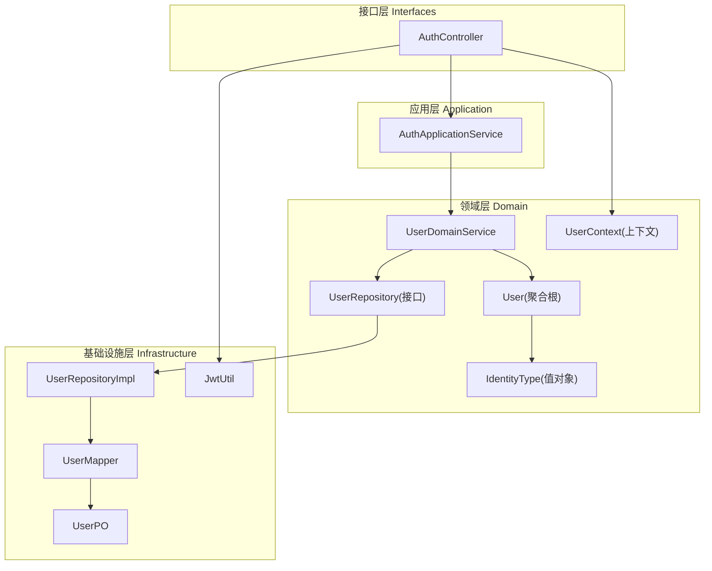
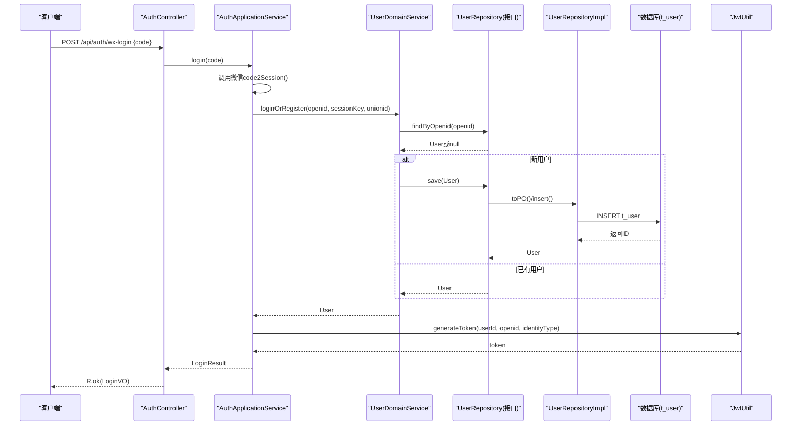
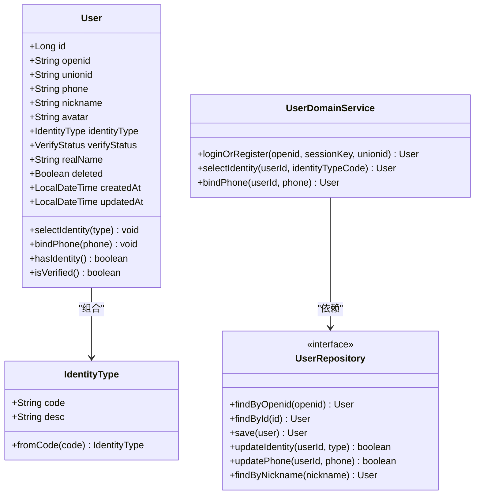
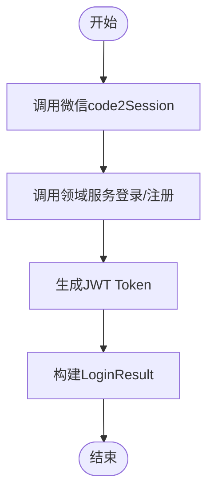
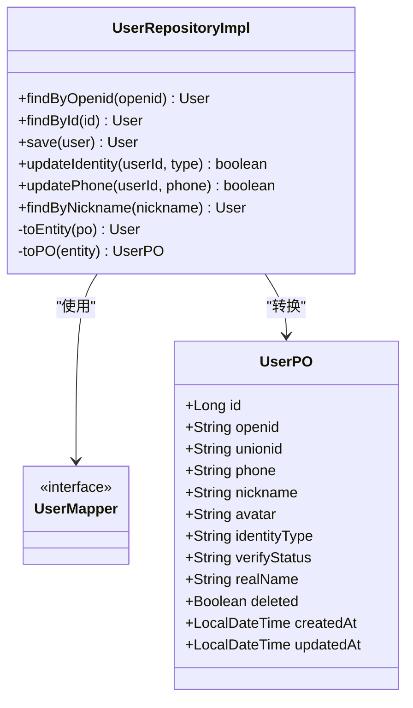
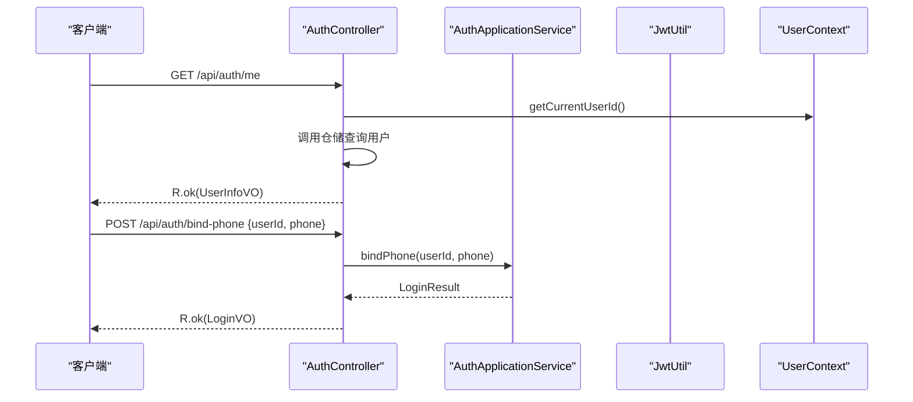
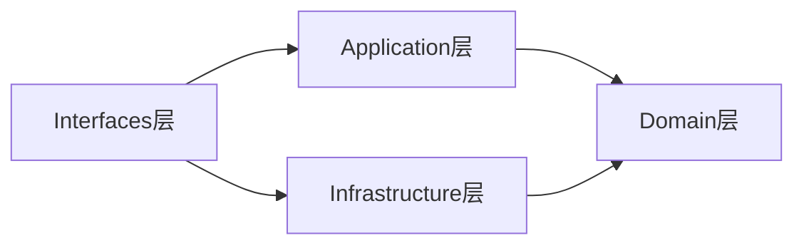

# DDD分层架构设计

<cite>
**本文引用的文件**
- [User.java](file://wzoto-backend/wzoto-domain/src/main/java/com/wzoto/domain/entity/User.java)
- [IdentityType.java](file://wzoto-backend/wzoto-domain/src/main/java/com/wzoto/domain/valobj/IdentityType.java)
- [UserDomainService.java](file://wzoto-backend/wzoto-domain/src/main/java/com/wzoto/domain/service/UserDomainService.java)
- [UserRepository.java](file://wzoto-backend/wzoto-domain/src/main/java/com/wzoto/domain/repository/UserRepository.java)
- [AuthApplicationService.java](file://wzoto-backend/wzoto-application/src/main/java/com/wzoto/application/service/AuthApplicationService.java)
- [UserRepositoryImpl.java](file://wzoto-backend/wzoto-infrastructure/src/main/java/com/wzoto/infrastructure/repository/UserRepositoryImpl.java)
- [UserMapper.java](file://wzoto-backend/wzoto-infrastructure/src/main/java/com/wzoto/infrastructure/mapper/UserMapper.java)
- [UserPO.java](file://wzoto-backend/wzoto-infrastructure/src/main/java/com/wzoto/infrastructure/pojo/UserPO.java)
- [JwtUtil.java](file://wzoto-backend/wzoto-infrastructure/src/main/java/com/wzoto/infrastructure/util/JwtUtil.java)
- [AuthController.java](file://wzoto-backend/wzoto-interfaces/src/main/java/com/wzoto/interfaces/controller/AuthController.java)
- [UserContext.java](file://wzoto-backend/wzoto-domain/src/main/java/com/wzoto/domain/context/UserContext.java)
</cite>

## 目录
1. [简介](#简介)
2. [项目结构](#项目结构)
3. [核心组件](#核心组件)
4. [架构总览](#架构总览)
5. [详细组件分析](#详细组件分析)
6. [依赖关系分析](#依赖关系分析)
7. [性能考量](#性能考量)
8. [故障排查指南](#故障排查指南)
9. [结论](#结论)
10. [附录](#附录)

## 简介
本文件围绕wzoto后端系统，基于领域驱动设计（DDD）思想，系统化阐述四层架构：Domain层、Application层、Infrastructure层、Interfaces层。重点解释各层职责边界、依赖方向与通信方式，并以“微信登录/注册、身份选择、手机号绑定”等典型用例为主线，展示从接口到领域再到持久化的完整调用链。同时结合聚合根、值对象、领域服务、仓储模式等DDD概念，给出可视化架构图与流程图，帮助读者快速理解并落地实践。

## 项目结构
wzoto后端采用多模块Maven工程，按DDD分层组织代码：
- wzoto-domain：领域模型与业务规则（实体、值对象、领域服务、仓储接口）
- wzoto-application：用例编排与应用服务（跨领域协作、事务边界、外部工具协调）
- wzoto-infrastructure：技术实现（数据库访问、第三方集成、JWT工具等）
- wzoto-interfaces：对外API（控制器、DTO/VO、统一响应封装）

图表来源
- [AuthController.java:1-149](file://wzoto-backend/wzoto-interfaces/src/main/java/com/wzoto/interfaces/controller/AuthController.java#L1-L149)
- [AuthApplicationService.java:1-119](file://wzoto-backend/wzoto-application/src/main/java/com/wzoto/application/service/AuthApplicationService.java#L1-L119)
- [UserDomainService.java:1-76](file://wzoto-backend/wzoto-domain/src/main/java/com/wzoto/domain/service/UserDomainService.java#L1-L76)
- [UserRepository.java:1-39](file://wzoto-backend/wzoto-domain/src/main/java/com/wzoto/domain/repository/UserRepository.java#L1-L39)
- [UserRepositoryImpl.java:1-123](file://wzoto-backend/wzoto-infrastructure/src/main/java/com/wzoto/infrastructure/repository/UserRepositoryImpl.java#L1-L123)
- [UserMapper.java:1-12](file://wzoto-backend/wzoto-infrastructure/src/main/java/com/wzoto/infrastructure/mapper/UserMapper.java#L1-L12)
- [UserPO.java:1-49](file://wzoto-backend/wzoto-infrastructure/src/main/java/com/wzoto/infrastructure/pojo/UserPO.java#L1-L49)
- [JwtUtil.java:1-81](file://wzoto-backend/wzoto-infrastructure/src/main/java/com/wzoto/infrastructure/util/JwtUtil.java#L1-L81)
- [UserContext.java:1-56](file://wzoto-backend/wzoto-domain/src/main/java/com/wzoto/domain/context/UserContext.java#L1-L56)

章节来源
- [AuthController.java:1-149](file://wzoto-backend/wzoto-interfaces/src/main/java/com/wzoto/interfaces/controller/AuthController.java#L1-L149)
- [AuthApplicationService.java:1-119](file://wzoto-backend/wzoto-application/src/main/java/com/wzoto/application/service/AuthApplicationService.java#L1-L119)
- [UserDomainService.java:1-76](file://wzoto-backend/wzoto-domain/src/main/java/com/wzoto/domain/service/UserDomainService.java#L1-L76)
- [UserRepository.java:1-39](file://wzoto-backend/wzoto-domain/src/main/java/com/wzoto/domain/repository/UserRepository.java#L1-L39)
- [UserRepositoryImpl.java:1-123](file://wzoto-backend/wzoto-infrastructure/src/main/java/com/wzoto/infrastructure/repository/UserRepositoryImpl.java#L1-L123)
- [UserMapper.java:1-12](file://wzoto-backend/wzoto-infrastructure/src/main/java/com/wzoto/infrastructure/mapper/UserMapper.java#L1-L12)
- [UserPO.java:1-49](file://wzoto-backend/wzoto-infrastructure/src/main/java/com/wzoto/infrastructure/pojo/UserPO.java#L1-L49)
- [JwtUtil.java:1-81](file://wzoto-backend/wzoto-infrastructure/src/main/java/com/wzoto/infrastructure/util/JwtUtil.java#L1-L81)
- [UserContext.java:1-56](file://wzoto-backend/wzoto-domain/src/main/java/com/wzoto/domain/context/UserContext.java#L1-L56)

## 核心组件
- 领域层
  - 聚合根：User，承载用户核心状态与行为（如选择身份、绑定手机、是否已认证等）
  - 值对象：IdentityType，表达不可变且具业务语义的身份类型
  - 领域服务：UserDomainService，封装跨实体的复杂业务规则与流程（登录/注册、选择身份、绑定手机）
  - 仓储接口：UserRepository，定义对用户的存取契约，屏蔽底层存储细节
  - 上下文：UserContext，线程级当前登录用户信息，供多层共享
- 应用层
  - 应用服务：AuthApplicationService，编排用例：调用微信接口、领域服务、生成JWT，管理事务边界
- 基础设施层
  - 仓储实现：UserRepositoryImpl，负责User与UserPO的转换及持久化操作
  - 数据访问：UserMapper（MyBatis-Plus），直接映射t_user表
  - 工具：JwtUtil，负责Token生成与校验；WechatUtil用于微信code2Session（由应用层注入）
- 接口层
  - 控制器：AuthController，暴露REST API，进行参数校验、结果包装、上下文设置

章节来源
- [User.java:1-93](file://wzoto-backend/wzoto-domain/src/main/java/com/wzoto/domain/entity/User.java#L1-L93)
- [IdentityType.java:1-31](file://wzoto-backend/wzoto-domain/src/main/java/com/wzoto/domain/valobj/IdentityType.java#L1-L31)
- [UserDomainService.java:1-76](file://wzoto-backend/wzoto-domain/src/main/java/com/wzoto/domain/service/UserDomainService.java#L1-L76)
- [UserRepository.java:1-39](file://wzoto-backend/wzoto-domain/src/main/java/com/wzoto/domain/repository/UserRepository.java#L1-L39)
- [UserContext.java:1-56](file://wzoto-backend/wzoto-domain/src/main/java/com/wzoto/domain/context/UserContext.java#L1-L56)
- [AuthApplicationService.java:1-119](file://wzoto-backend/wzoto-application/src/main/java/com/wzoto/application/service/AuthApplicationService.java#L1-L119)
- [UserRepositoryImpl.java:1-123](file://wzoto-backend/wzoto-infrastructure/src/main/java/com/wzoto/infrastructure/repository/UserRepositoryImpl.java#L1-L123)
- [UserMapper.java:1-12](file://wzoto-backend/wzoto-infrastructure/src/main/java/com/wzoto/infrastructure/mapper/UserMapper.java#L1-L12)
- [UserPO.java:1-49](file://wzoto-backend/wzoto-infrastructure/src/main/java/com/wzoto/infrastructure/pojo/UserPO.java#L1-L49)
- [JwtUtil.java:1-81](file://wzoto-backend/wzoto-infrastructure/src/main/java/com/wzoto/infrastructure/util/JwtUtil.java#L1-L81)
- [AuthController.java:1-149](file://wzoto-backend/wzoto-interfaces/src/main/java/com/wzoto/interfaces/controller/AuthController.java#L1-L149)

## 架构总览
下图展示了请求从接口层进入，经应用层编排，调用领域服务执行业务规则，再通过仓储接口落到基础设施层的持久化过程，以及JWT在接口层的应用。

图表来源
- [AuthController.java:65-75](file://wzoto-backend/wzoto-interfaces/src/main/java/com/wzoto/interfaces/controller/AuthController.java#L65-L75)
- [AuthApplicationService.java:26-57](file://wzoto-backend/wzoto-application/src/main/java/com/wzoto/application/service/AuthApplicationService.java#L26-L57)
- [UserDomainService.java:20-46](file://wzoto-backend/wzoto-domain/src/main/java/com/wzoto/domain/service/UserDomainService.java#L20-L46)
- [UserRepository.java:10-23](file://wzoto-backend/wzoto-domain/src/main/java/com/wzoto/domain/repository/UserRepository.java#L10-L23)
- [UserRepositoryImpl.java:27-55](file://wzoto-backend/wzoto-infrastructure/src/main/java/com/wzoto/infrastructure/repository/UserRepositoryImpl.java#L27-L55)
- [JwtUtil.java:27-47](file://wzoto-backend/wzoto-infrastructure/src/main/java/com/wzoto/infrastructure/util/JwtUtil.java#L27-L47)

## 详细组件分析

### 领域层：聚合根User与值对象IdentityType
- 聚合根User
  - 包含标识、社交账号、联系方式、头像、身份类型、认证状态、软删除标记、时间戳等
  - 领域行为：selectIdentity（受保护的业务规则：一经选择不可切换）、bindPhone、hasIdentity、isVerified
  - 通过值对象IdentityType与VerifyStatus表达强约束
- 值对象IdentityType
  - 枚举型值对象，提供fromCode静态方法，保证类型安全与非法输入拦截
- 领域服务UserDomainService
  - 登录/注册：根据openid查找或新建用户，更新sessionKey
  - 选择身份：校验用户存在，解析值对象，调用User.selectIdentity后持久化
  - 绑定手机：校验用户存在，调用User.bindPhone后持久化
- 仓储接口UserRepository
  - 定义findByOpenid、findById、save、updateIdentity、updatePhone、findByNickname等契约
- 上下文UserContext
  - 使用ThreadLocal保存当前用户信息，提供getCurrentUserId、isParent/isStudent等便捷方法

图表来源
- [User.java:1-93](file://wzoto-backend/wzoto-domain/src/main/java/com/wzoto/domain/entity/User.java#L1-L93)
- [IdentityType.java:1-31](file://wzoto-backend/wzoto-domain/src/main/java/com/wzoto/domain/valobj/IdentityType.java#L1-L31)
- [UserDomainService.java:1-76](file://wzoto-backend/wzoto-domain/src/main/java/com/wzoto/domain/service/UserDomainService.java#L1-L76)
- [UserRepository.java:1-39](file://wzoto-backend/wzoto-domain/src/main/java/com/wzoto/domain/repository/UserRepository.java#L1-L39)

章节来源
- [User.java:1-93](file://wzoto-backend/wzoto-domain/src/main/java/com/wzoto/domain/entity/User.java#L1-L93)
- [IdentityType.java:1-31](file://wzoto-backend/wzoto-domain/src/main/java/com/wzoto/domain/valobj/IdentityType.java#L1-L31)
- [UserDomainService.java:1-76](file://wzoto-backend/wzoto-domain/src/main/java/com/wzoto/domain/service/UserDomainService.java#L1-L76)
- [UserRepository.java:1-39](file://wzoto-backend/wzoto-domain/src/main/java/com/wzoto/domain/repository/UserRepository.java#L1-L39)

### 应用层：用例编排AuthApplicationService
- 职责
  - 编排微信登录流程：调用WechatUtil获取openid/session_key/unionid
  - 委托UserDomainService完成登录/注册、选择身份、绑定手机
  - 调用JwtUtil生成Token，组装LoginResult返回
- 事务边界
  - 关键方法加@Transactional，确保跨仓储操作的原子性
- 输出
  - 将领域对象状态转换为应用层结果对象，便于接口层进一步封装为VO

图表来源
- [AuthApplicationService.java:26-57](file://wzoto-backend/wzoto-application/src/main/java/com/wzoto/application/service/AuthApplicationService.java#L26-L57)
- [JwtUtil.java:27-47](file://wzoto-backend/wzoto-infrastructure/src/main/java/com/wzoto/infrastructure/util/JwtUtil.java#L27-L47)

章节来源
- [AuthApplicationService.java:1-119](file://wzoto-backend/wzoto-application/src/main/java/com/wzoto/application/service/AuthApplicationService.java#L1-L119)

### 基础设施层：仓储实现与外部集成
- 仓储实现UserRepositoryImpl
  - 负责User与UserPO之间的双向转换
  - 使用MyBatis-Plus的LambdaQueryWrapper进行查询，BaseMapper进行CRUD
  - 处理创建/更新时间戳，保证一致性
- 数据访问UserMapper
  - 继承BaseMapper<UserPO>，无额外SQL时可直接使用内置方法
- 持久化对象UserPO
  - 与数据库表t_user一一对应，包含所有字段映射
- 外部集成
  - JwtUtil：基于配置生成和验证JWT
  - WechatUtil：由应用层注入，负责微信code2Session（具体实现不在本节文件内）

图表来源
- [UserRepositoryImpl.java:1-123](file://wzoto-backend/wzoto-infrastructure/src/main/java/com/wzoto/infrastructure/repository/UserRepositoryImpl.java#L1-L123)
- [UserMapper.java:1-12](file://wzoto-backend/wzoto-infrastructure/src/main/java/com/wzoto/infrastructure/mapper/UserMapper.java#L1-L12)
- [UserPO.java:1-49](file://wzoto-backend/wzoto-infrastructure/src/main/java/com/wzoto/infrastructure/pojo/UserPO.java#L1-L49)

章节来源
- [UserRepositoryImpl.java:1-123](file://wzoto-backend/wzoto-infrastructure/src/main/java/com/wzoto/infrastructure/repository/UserRepositoryImpl.java#L1-L123)
- [UserMapper.java:1-12](file://wzoto-backend/wzoto-infrastructure/src/main/java/com/wzoto/infrastructure/mapper/UserMapper.java#L1-L12)
- [UserPO.java:1-49](file://wzoto-backend/wzoto-infrastructure/src/main/java/com/wzoto/infrastructure/pojo/UserPO.java#L1-L49)
- [JwtUtil.java:1-81](file://wzoto-backend/wzoto-infrastructure/src/main/java/com/wzoto/infrastructure/util/JwtUtil.java#L1-L81)

### 接口层：API控制器AuthController
- 职责
  - 暴露REST API：微信登录、选择身份、绑定手机、获取当前用户、开发环境登录
  - 参数校验、日志记录、统一响应封装R
  - 调用应用服务完成用例编排，必要时直接使用仓储与JWT工具
- 上下文使用
  - 通过UserContext.getCurrentUserId()获取当前用户ID，配合仓储查询用户信息
- 转换
  - 将应用层LoginResult转换为接口层VO（LoginVO）

图表来源
- [AuthController.java:34-63](file://wzoto-backend/wzoto-interfaces/src/main/java/com/wzoto/interfaces/controller/AuthController.java#L34-L63)
- [AuthController.java:89-100](file://wzoto-backend/wzoto-interfaces/src/main/java/com/wzoto/interfaces/controller/AuthController.java#L89-L100)
- [UserContext.java:39-47](file://wzoto-backend/wzoto-domain/src/main/java/com/wzoto/domain/context/UserContext.java#L39-L47)

章节来源
- [AuthController.java:1-149](file://wzoto-backend/wzoto-interfaces/src/main/java/com/wzoto/interfaces/controller/AuthController.java#L1-L149)
- [UserContext.java:1-56](file://wzoto-backend/wzoto-domain/src/main/java/com/wzoto/domain/context/UserContext.java#L1-L56)

## 依赖关系分析
- 依赖方向
  - Interfaces -> Application -> Domain <- Infrastructure
  - Domain不依赖其他三层，保持纯净业务内核
  - Infrastructure实现Domain定义的仓储接口，解耦存储细节
- 耦合点
  - AuthController直接依赖JwtUtil与UserRepository（用于开发环境登录与当前用户查询）
  - AuthApplicationService依赖WechatUtil（外部集成）与UserDomainService
  - UserDomainService仅依赖UserRepository接口，符合依赖倒置原则
- 潜在风险
  - 若接口层过度侵入领域逻辑，会破坏分层边界
  - 若仓储实现泄露领域模型细节，需加强PO与Entity的隔离

图表来源
- [AuthController.java:1-149](file://wzoto-backend/wzoto-interfaces/src/main/java/com/wzoto/interfaces/controller/AuthController.java#L1-L149)
- [AuthApplicationService.java:1-119](file://wzoto-backend/wzoto-application/src/main/java/com/wzoto/application/service/AuthApplicationService.java#L1-L119)
- [UserDomainService.java:1-76](file://wzoto-backend/wzoto-domain/src/main/java/com/wzoto/domain/service/UserDomainService.java#L1-L76)
- [UserRepositoryImpl.java:1-123](file://wzoto-backend/wzoto-infrastructure/src/main/java/com/wzoto/infrastructure/repository/UserRepositoryImpl.java#L1-L123)

章节来源
- [AuthController.java:1-149](file://wzoto-backend/wzoto-interfaces/src/main/java/com/wzoto/interfaces/controller/AuthController.java#L1-L149)
- [AuthApplicationService.java:1-119](file://wzoto-backend/wzoto-application/src/main/java/com/wzoto/application/service/AuthApplicationService.java#L1-L119)
- [UserDomainService.java:1-76](file://wzoto-backend/wzoto-domain/src/main/java/com/wzoto/domain/service/UserDomainService.java#L1-L76)
- [UserRepositoryImpl.java:1-123](file://wzoto-backend/wzoto-infrastructure/src/main/java/com/wzoto/infrastructure/repository/UserRepositoryImpl.java#L1-L123)

## 性能考量
- 查询优化
  - 使用LambdaQueryWrapper精确过滤，避免全表扫描
  - 按需加载字段，减少数据传输开销
- 事务粒度
  - 应用层方法加事务注解，控制最小必要范围，降低锁竞争
- 缓存策略
  - 可考虑对频繁读取的用户信息做本地缓存（注意一致性）
- I/O分离
  - 微信API调用与领域逻辑分离，避免阻塞主流程
- 连接池与索引
  - 合理配置数据库连接池，为openid、nickname等高频查询字段建立索引

[本节为通用指导，无需特定文件引用]

## 故障排查指南
- 微信登录失败
  - 检查WechatUtil.code2Session返回值是否包含openid/unionid
  - 确认数据库是否存在对应用户，或是否成功新建
- 身份选择异常
  - 若用户已选择身份，再次选择将抛出异常，需前端提示
  - 检查IdentityType.fromCode是否能正确解析传入值
- 手机号绑定失败
  - 校验userId有效性，确认用户存在
  - 检查updatePhone是否成功，关注受影响行数
- JWT相关
  - 确认JwtProperties配置正确（密钥、过期时间）
  - 解析失败时查看日志定位原因（签名错误、过期等）

章节来源
- [AuthApplicationService.java:26-57](file://wzoto-backend/wzoto-application/src/main/java/com/wzoto/application/service/AuthApplicationService.java#L26-L57)
- [UserDomainService.java:48-75](file://wzoto-backend/wzoto-domain/src/main/java/com/wzoto/domain/service/UserDomainService.java#L48-L75)
- [JwtUtil.java:49-81](file://wzoto-backend/wzoto-infrastructure/src/main/java/com/wzoto/infrastructure/util/JwtUtil.java#L49-L81)

## 结论
wzoto后端以DDD思想清晰划分四层职责：
- Domain层聚焦业务本质，通过聚合根、值对象、领域服务表达核心规则
- Application层负责用例编排与事务边界，屏蔽外部集成细节
- Infrastructure层实现数据存储与第三方集成，遵循领域接口契约
- Interfaces层专注HTTP协议与数据交换格式，保持薄而稳定
通过仓储模式与依赖倒置，系统具备良好的可测试性与可扩展性。建议后续逐步引入领域事件、更丰富的值对象与聚合边界，进一步提升领域模型的表达能力与一致性保障。

[本节为总结性内容，无需特定文件引用]

## 附录
- 关键调用路径参考
  - 微信登录：接口层AuthController -> 应用层AuthApplicationService -> 领域层UserDomainService -> 仓储接口UserRepository -> 仓储实现UserRepositoryImpl -> 数据库
  - 选择身份：同上链路，最终调用User.selectIdentity并持久化
  - 绑定手机：同上链路，最终调用User.bindPhone并持久化
- 扩展建议
  - 引入领域事件：如“用户首次选择身份”、“手机号绑定成功”，用于异步通知与审计
  - 完善值对象：如手机号、昵称等增加校验与不变性约束
  - 增强上下文：在拦截器中统一设置UserContext，减少控制器重复逻辑

[本节为补充说明，无需特定文件引用]