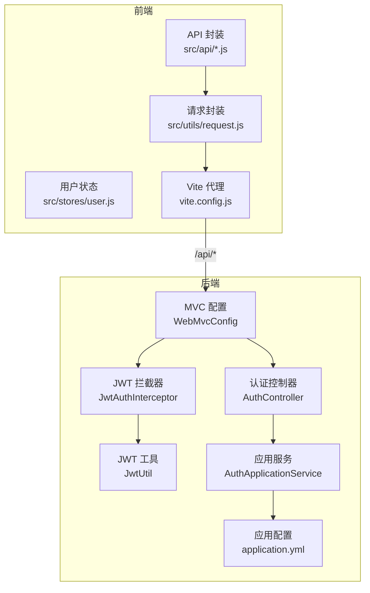
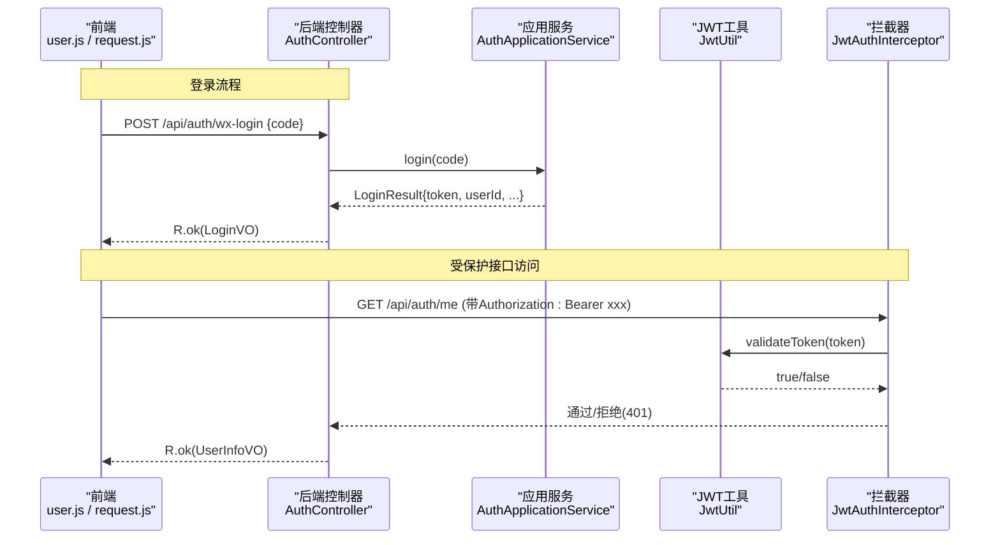
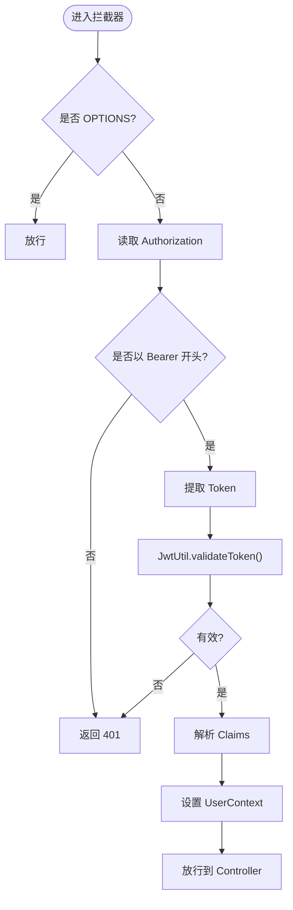
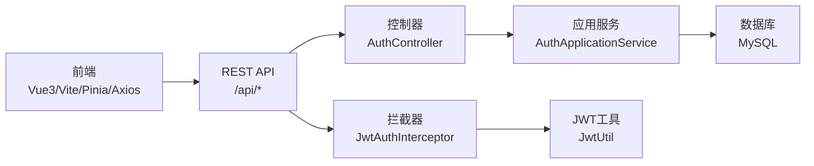

# 前后端分离架构

<cite>
**本文引用的文件**
- [AuthController.java](file://wzoto-backend/wzoto-interfaces/src/main/java/com/wzoto/interfaces/controller/AuthController.java)
- [WebMvcConfig.java](file://wzoto-backend/wzoto-infrastructure/src/main/java/com/wzoto/infrastructure/config/WebMvcConfig.java)
- [JwtAuthInterceptor.java](file://wzoto-backend/wzoto-infrastructure/src/main/java/com/wzoto/infrastructure/interceptor/JwtAuthInterceptor.java)
- [JwtUtil.java](file://wzoto-backend/wzoto-infrastructure/src/main/java/com/wzoto/infrastructure/util/JwtUtil.java)
- [application.yml](file://wzoto-backend/wzoto-interfaces/src/main/resources/application.yml)
- [R.java](file://wzoto-backend/wzoto-interfaces/src/main/java/com/wzoto/interfaces/common/R.java)
- [GlobalExceptionHandler.java](file://wzoto-backend/wzoto-interfaces/src/main/java/com/wzoto/interfaces/common/GlobalExceptionHandler.java)
- [request.js](file://wzoto-frontend/src/utils/request.js)
- [auth.js](file://wzoto-frontend/src/api/auth.js)
- [user.js](file://wzoto-frontend/src/stores/user.js)
- [vite.config.js](file://wzoto-frontend/vite.config.js)
</cite>

## 目录
1. [简介](#简介)
2. [项目结构](#项目结构)
3. [核心组件](#核心组件)
4. [架构总览](#架构总览)
5. [详细组件分析](#详细组件分析)
6. [依赖关系分析](#依赖关系分析)
7. [性能考虑](#性能考虑)
8. [故障排查指南](#故障排查指南)
9. [结论](#结论)
10. [附录](#附录)

## 简介
本文件面向 wzoto 项目的“前后端分离”架构，聚焦于以下目标：
- 设计原则与优势：前端（Vue3 + Vite）与后端（Spring Boot）解耦，职责清晰、可独立演进。
- RESTful API 规范：URL 命名约定、HTTP 方法使用、统一状态码与错误体。
- JWT 认证流程：从前端登录到后端校验的完整链路。
- 跨域与安全策略：CORS 配置与鉴权拦截。
- 数据交换格式与错误处理：JSON 结构与异常统一封装。
- 开发环境与生产环境差异：代理、配置项与环境变量。
- 具体调用示例与错误处理代码路径指引。

## 项目结构
- 前端（wzoto-frontend）
  - 基于 Vue3 + Vite，采用 Pinia 管理用户态，Axios 发起请求并统一拦截。
  - 通过 vite.config.js 的 dev server proxy 将 /api 转发至后端服务，解决开发期跨域问题。
- 后端（wzoto-backend）
  - 分层模块：interfaces（控制器/DTO/VO）、application（应用服务编排）、domain（领域模型/仓储接口）、infrastructure（基础设施：JWT、拦截器、配置、持久化）。
  - 全局 CORS 与 JWT 拦截器在 WebMvcConfig 中注册；统一返回体 R 与全局异常处理器 GlobalExceptionHandler。

图表来源
- [vite.config.js:12-19](file://wzoto-frontend/vite.config.js#L12-L19)
- [WebMvcConfig.java:21-41](file://wzoto-backend/wzoto-infrastructure/src/main/java/com/wzoto/infrastructure/config/WebMvcConfig.java#L21-L41)
- [JwtAuthInterceptor.java:27-59](file://wzoto-backend/wzoto-infrastructure/src/main/java/com/wzoto/infrastructure/interceptor/JwtAuthInterceptor.java#L27-L59)
- [JwtUtil.java:30-81](file://wzoto-backend/wzoto-infrastructure/src/main/java/com/wzoto/infrastructure/util/JwtUtil.java#L30-L81)
- [AuthController.java:24-149](file://wzoto-backend/wzoto-interfaces/src/main/java/com/wzoto/interfaces/controller/AuthController.java#L24-L149)
- [application.yml:31-46](file://wzoto-backend/wzoto-interfaces/src/main/resources/application.yml#L31-L46)

章节来源
- [vite.config.js:12-19](file://wzoto-frontend/vite.config.js#L12-L19)
- [WebMvcConfig.java:21-41](file://wzoto-backend/wzoto-infrastructure/src/main/java/com/wzoto/infrastructure/config/WebMvcConfig.java#L21-L41)

## 核心组件
- 统一响应体 R<T>
  - 提供 code/msg/data 三字段，包含 ok/fail/unauthorized/badRequest 等便捷构造方法。
- 全局异常处理器 GlobalExceptionHandler
  - 将参数校验、业务异常、运行时异常统一映射为 R 响应。
- 认证控制器 AuthController
  - 提供微信登录、选择身份、绑定手机号、获取当前用户等接口。
- JWT 相关
  - JwtProperties：密钥、过期时间、Header 名称、Token 前缀。
  - JwtUtil：生成、解析、验证 Token。
  - JwtAuthInterceptor：从 Authorization Header 提取并校验 Token，注入 UserContext。
- 前端请求封装 request.js
  - 自动注入 Bearer Token，统一处理 401 跳转登录与错误提示。
- 用户状态 user.js
  - 封装登录、选择身份、绑定手机、拉取用户信息、退出登录等操作。

章节来源
- [R.java:1-43](file://wzoto-backend/wzoto-interfaces/src/main/java/com/wzoto/interfaces/common/R.java#L1-L43)
- [GlobalExceptionHandler.java:14-67](file://wzoto-backend/wzoto-interfaces/src/main/java/com/wzoto/interfaces/common/GlobalExceptionHandler.java#L14-L67)
- [AuthController.java:24-149](file://wzoto-backend/wzoto-interfaces/src/main/java/com/wzoto/interfaces/controller/AuthController.java#L24-L149)
- [JwtProperties.java:1-26](file://wzoto-backend/wzoto-infrastructure/src/main/java/com/wzoto/infrastructure/config/JwtProperties.java#L1-L26)
- [JwtUtil.java:30-81](file://wzoto-backend/wzoto-infrastructure/src/main/java/com/wzoto/infrastructure/util/JwtUtil.java#L30-L81)
- [JwtAuthInterceptor.java:27-59](file://wzoto-backend/wzoto-infrastructure/src/main/java/com/wzoto/infrastructure/interceptor/JwtAuthInterceptor.java#L27-L59)
- [request.js:13-55](file://wzoto-frontend/src/utils/request.js#L13-L55)
- [user.js:31-117](file://wzoto-frontend/src/stores/user.js#L31-L117)

## 架构总览
前后端通过 RESTful API 通信，遵循“无状态 + JSON 数据交换 + JWT 鉴权”的原则。前端通过 Axios 封装请求并在拦截器中注入 Authorization 头；后端通过 Spring MVC 拦截器校验 Token，并将用户上下文注入后续处理链。

图表来源
- [AuthController.java:69-75](file://wzoto-backend/wzoto-interfaces/src/main/java/com/wzoto/interfaces/controller/AuthController.java#L69-L75)
- [AuthController.java:38-63](file://wzoto-backend/wzoto-interfaces/src/main/java/com/wzoto/interfaces/controller/AuthController.java#L38-L63)
- [AuthApplicationService.java:30-57](file://wzoto-backend/wzoto-application/src/main/java/com/wzoto/application/service/AuthApplicationService.java#L30-L57)
- [JwtUtil.java:72-81](file://wzoto-backend/wzoto-infrastructure/src/main/java/com/wzoto/infrastructure/util/JwtUtil.java#L72-L81)
- [JwtAuthInterceptor.java:27-59](file://wzoto-backend/wzoto-infrastructure/src/main/java/com/wzoto/infrastructure/interceptor/JwtAuthInterceptor.java#L27-L59)

## 详细组件分析

### 认证与授权（JWT）
- 登录流程
  - 前端调用 wxLogin 接口，后端应用服务完成微信 code2Session、登录/注册、生成 JWT，返回 token 与用户信息。
  - 前端将 token 存入本地存储，并在后续请求中通过 Authorization: Bearer <token> 发送。
- 鉴权流程
  - 所有 /api/** 请求经 JwtAuthInterceptor 拦截，OPTIONS 预检放行。
  - 若未携带或无效 Token，直接返回 401；否则解析 Claims 并注入 UserContext。
- 配置项
  - JWT 密钥、过期时间、Header 名称、Token 前缀由 application.yml 的 wzoto.jwt.* 控制。

图表来源
- [WebMvcConfig.java:21-31](file://wzoto-backend/wzoto-infrastructure/src/main/java/com/wzoto/infrastructure/config/WebMvcConfig.java#L21-L31)
- [JwtAuthInterceptor.java:27-59](file://wzoto-backend/wzoto-infrastructure/src/main/java/com/wzoto/infrastructure/interceptor/JwtAuthInterceptor.java#L27-L59)
- [JwtUtil.java:72-81](file://wzoto-backend/wzoto-infrastructure/src/main/java/com/wzoto/infrastructure/util/JwtUtil.java#L72-L81)

章节来源
- [AuthController.java:69-127](file://wzoto-backend/wzoto-interfaces/src/main/java/com/wzoto/interfaces/controller/AuthController.java#L69-L127)
- [AuthApplicationService.java:30-100](file://wzoto-backend/wzoto-application/src/main/java/com/wzoto/application/service/AuthApplicationService.java#L30-L100)
- [JwtAuthInterceptor.java:27-59](file://wzoto-backend/wzoto-infrastructure/src/main/java/com/wzoto/infrastructure/interceptor/JwtAuthInterceptor.java#L27-L59)
- [JwtUtil.java:30-81](file://wzoto-backend/wzoto-infrastructure/src/main/java/com/wzoto/infrastructure/util/JwtUtil.java#L30-L81)
- [application.yml:31-35](file://wzoto-backend/wzoto-interfaces/src/main/resources/application.yml#L31-L35)

### RESTful API 设计规范
- URL 命名约定
  - 资源名词复数形式，如 /api/auth、/api/learning、/api/booking。
  - 子资源使用层级表达，如 /api/child/{id}。
- HTTP 方法使用
  - GET 查询、POST 创建、PUT 更新、DELETE 删除。
  - 认证相关：POST /api/auth/wx-login、POST /api/auth/select-identity、POST /api/auth/bind-phone、GET /api/auth/me。
- 状态码定义
  - 200 成功，400 参数错误，401 未认证，500 系统错误。
  - 统一通过 R 的 code 字段表达业务状态码。
- 请求/响应格式
  - 请求：application/json。
  - 响应：{code, msg, data}，data 为具体业务对象。

章节来源
- [AuthController.java:24-149](file://wzoto-backend/wzoto-interfaces/src/main/java/com/wzoto/interfaces/controller/AuthController.java#L24-L149)
- [R.java:13-42](file://wzoto-backend/wzoto-interfaces/src/main/java/com/wzoto/interfaces/common/R.java#L13-L42)
- [GlobalExceptionHandler.java:18-66](file://wzoto-backend/wzoto-interfaces/src/main/java/com/wzoto/interfaces/common/GlobalExceptionHandler.java#L18-L66)

### 跨域配置（CORS）与安全策略
- 后端 CORS
  - 允许所有来源、常用方法与头部，支持凭证，最大缓存 3600 秒。
- 前端代理
  - 开发环境通过 Vite 将 /api 代理到 http://localhost:8080，避免跨域。
- 安全要点
  - 仅对 /api/** 启用 JWT 拦截，排除登录相关路径。
  - 生产环境需限制 allowedOriginPatterns 为可信域名，并关闭 dev-login 等调试接口。

章节来源
- [WebMvcConfig.java:33-41](file://wzoto-backend/wzoto-infrastructure/src/main/java/com/wzoto/infrastructure/config/WebMvcConfig.java#L33-L41)
- [vite.config.js:12-19](file://wzoto-frontend/vite.config.js#L12-L19)
- [WebMvcConfig.java:21-31](file://wzoto-backend/wzoto-infrastructure/src/main/java/com/wzoto/infrastructure/config/WebMvcConfig.java#L21-L31)

### 数据交换格式（JSON Schema）与错误处理
- 统一响应体 R<T>
  - code：数字状态码（200/400/401/500）。
  - msg：人类可读消息。
  - data：业务数据对象。
- 全局异常处理
  - 参数校验失败、非法参数、业务规则违反、运行时异常均被捕获并转为 R。
- 前端错误处理
  - 响应拦截器根据 code 与 HTTP 状态码进行提示与路由跳转（如 401 跳转登录）。

章节来源
- [R.java:13-42](file://wzoto-backend/wzoto-interfaces/src/main/java/com/wzoto/interfaces/common/R.java#L13-L42)
- [GlobalExceptionHandler.java:18-66](file://wzoto-backend/wzoto-interfaces/src/main/java/com/wzoto/interfaces/common/GlobalExceptionHandler.java#L18-L66)
- [request.js:25-55](file://wzoto-frontend/src/utils/request.js#L25-L55)

### 具体 API 调用示例与错误处理
- 登录
  - 前端：调用 auth.js 中的 wxLogin(code)，成功后 user.js 保存 token 并设置用户信息。
  - 后端：AuthController.wxLogin -> AuthApplicationService.login -> 生成 JWT。
- 获取当前用户
  - 前端：getUserInfo()，携带 Authorization 头。
  - 后端：AuthController.getCurrentUser -> 返回 UserInfoVO。
- 错误处理
  - 前端：request.js 统一处理网络错误与业务错误，401 时清除状态并跳转登录。
  - 后端：GlobalExceptionHandler 将异常转换为 R.fail/R.badRequest/R.unauthorized。

章节来源
- [auth.js:6-29](file://wzoto-frontend/src/api/auth.js#L6-L29)
- [user.js:31-85](file://wzoto-frontend/src/stores/user.js#L31-L85)
- [AuthController.java:69-75](file://wzoto-backend/wzoto-interfaces/src/main/java/com/wzoto/interfaces/controller/AuthController.java#L69-L75)
- [AuthController.java:38-63](file://wzoto-backend/wzoto-interfaces/src/main/java/com/wzoto/interfaces/controller/AuthController.java#L38-L63)
- [request.js:25-55](file://wzoto-frontend/src/utils/request.js#L25-L55)
- [GlobalExceptionHandler.java:18-66](file://wzoto-backend/wzoto-interfaces/src/main/java/com/wzoto/interfaces/common/GlobalExceptionHandler.java#L18-L66)

### 开发环境与生产环境差异
- 开发环境
  - 前端使用 Vite 代理 /api 到 localhost:8080，简化跨域。
  - 后端开启 debug 日志，数据库/Redis 使用默认或环境变量覆盖。
- 生产环境
  - 建议关闭 dev-login 等调试接口，严格限制 CORS 白名单。
  - 通过环境变量注入敏感配置（JWT_SECRET、WECHAT_*、AI_*），确保密钥长度与强度。
  - 部署时前端静态资源由 Nginx/CDN 托管，后端服务暴露 HTTPS 端口。

章节来源
- [vite.config.js:12-19](file://wzoto-frontend/vite.config.js#L12-L19)
- [application.yml:6-17](file://wzoto-backend/wzoto-interfaces/src/main/resources/application.yml#L6-L17)
- [application.yml:31-46](file://wzoto-backend/wzoto-interfaces/src/main/resources/application.yml#L31-L46)

## 依赖关系分析
- 前端依赖
  - axios 用于 HTTP 请求；pinia 管理用户状态；router 负责页面路由。
- 后端依赖
  - Spring MVC 提供拦截器与 CORS；MyBatis-Plus 操作数据库；JWT 库生成与校验令牌；Hutool 辅助 JSON 处理。

图表来源
- [AuthController.java:24-149](file://wzoto-backend/wzoto-interfaces/src/main/java/com/wzoto/interfaces/controller/AuthController.java#L24-L149)
- [AuthApplicationService.java:30-100](file://wzoto-backend/wzoto-application/src/main/java/com/wzoto/application/service/AuthApplicationService.java#L30-L100)
- [JwtAuthInterceptor.java:27-59](file://wzoto-backend/wzoto-infrastructure/src/main/java/com/wzoto/infrastructure/interceptor/JwtAuthInterceptor.java#L27-L59)
- [JwtUtil.java:30-81](file://wzoto-backend/wzoto-infrastructure/src/main/java/com/wzoto/infrastructure/util/JwtUtil.java#L30-L81)

章节来源
- [application.yml:6-17](file://wzoto-backend/wzoto-interfaces/src/main/resources/application.yml#L6-L17)

## 性能考虑
- 减少不必要的 Token 刷新：仅在身份变更时重新签发。
- 合理设置 JWT 过期时间：兼顾安全性与用户体验。
- 数据库连接池与 SQL 优化：关注慢查询与索引。
- 前端缓存与懒加载：合理使用 localStorage 与路由级组件懒加载。
- 日志级别：生产环境降低日志量，避免 I/O 瓶颈。

[本节为通用指导，不直接分析具体文件]

## 故障排查指南
- 401 未认证
  - 检查前端是否在请求头携带 Authorization: Bearer <token>。
  - 检查后端拦截器是否放行登录路径，以及 Token 是否有效。
- 跨域错误
  - 开发环境确认 Vite 代理配置；生产环境确认 CORS 白名单。
- 参数校验失败
  - 查看 GlobalExceptionHandler 输出的字段错误信息，修正前端传参。
- 登录失败
  - 检查微信 code2Session 配置与应用 ID/Secret；查看应用日志。

章节来源
- [JwtAuthInterceptor.java:27-59](file://wzoto-backend/wzoto-infrastructure/src/main/java/com/wzoto/infrastructure/interceptor/JwtAuthInterceptor.java#L27-L59)
- [WebMvcConfig.java:21-41](file://wzoto-backend/wzoto-infrastructure/src/main/java/com/wzoto/infrastructure/config/WebMvcConfig.java#L21-L41)
- [GlobalExceptionHandler.java:18-66](file://wzoto-backend/wzoto-interfaces/src/main/java/com/wzoto/interfaces/common/GlobalExceptionHandler.java#L18-L66)
- [request.js:25-55](file://wzoto-frontend/src/utils/request.js#L25-L55)

## 结论
本项目采用前后端分离架构，通过 RESTful API 与 JWT 实现无状态认证，结合全局异常与统一响应体提升可维护性与一致性。前端通过请求拦截器与状态管理简化了鉴权与错误处理逻辑；后端通过拦截器与配置集中管理安全策略。建议在生产环境中强化 CORS 白名单、收紧调试接口、完善监控与告警。

[本节为总结性内容，不直接分析具体文件]

## 附录
- 关键配置位置
  - 后端应用配置：application.yml
  - 前端代理配置：vite.config.js
  - 认证接口：AuthController
  - 统一响应与异常：R、GlobalExceptionHandler
  - 前端请求与状态：request.js、user.js

[本节为索引性内容，不直接分析具体文件]