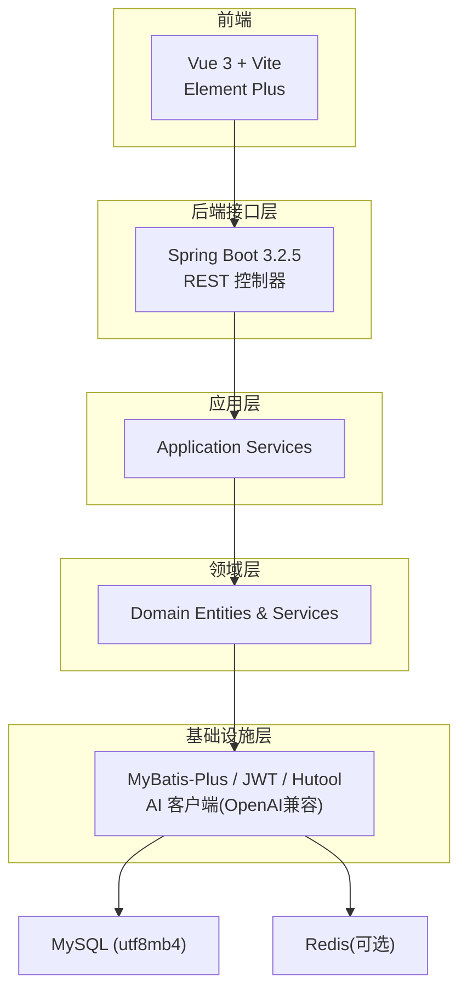
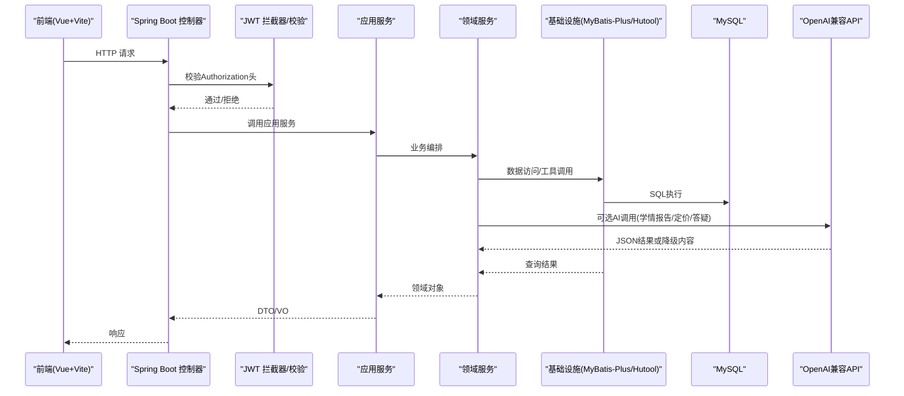
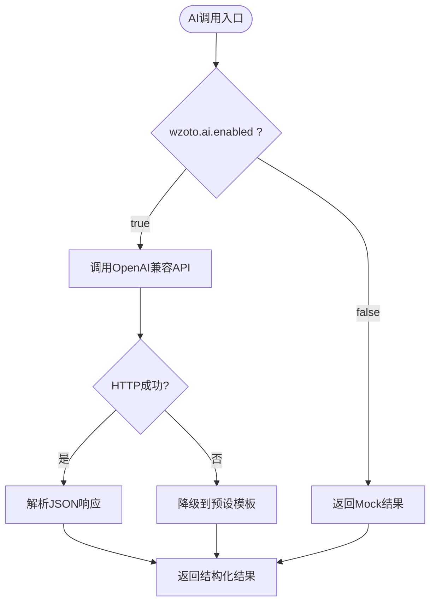
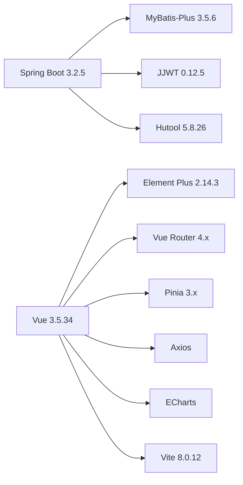

# 技术选型说明

<cite>
**本文引用的文件**
- [pom.xml](file://wzoto-backend/pom.xml)
- [application.yml](file://wzoto-backend/wzoto-interfaces/src/main/resources/application.yml)
- [JwtProperties.java](file://wzoto-backend/wzoto-infrastructure/src/main/java/com/wzoto/infrastructure/config/JwtProperties.java)
- [OpenAiHttpGenerator.java](file://wzoto-backend/wzoto-infrastructure/src/main/java/com/wzoto/infrastructure/ai/OpenAiHttpGenerator.java)
- [AiServiceHelper.java](file://wzoto-backend/wzoto-infrastructure/src/main/java/com/wzoto/infrastructure/ai/AiServiceHelper.java)
- [package.json](file://wzoto-frontend/package.json)
- [vite.config.js](file://wzoto-frontend/vite.config.js)
- [t_subject.sql](file://wzoto-backend/sql/t_subject.sql)
- [t_user.sql](file://wzoto-backend/sql/t_user.sql)
</cite>

## 目录
1. [引言](#引言)
2. [项目结构](#项目结构)
3. [核心组件](#核心组件)
4. [架构总览](#架构总览)
5. [详细组件分析](#详细组件分析)
6. [依赖关系分析](#依赖关系分析)
7. [性能考量](#性能考量)
8. [故障排查指南](#故障排查指南)
9. [结论](#结论)
10. [附录：版本与配置清单](#附录版本与配置清单)

## 引言
本技术选型说明围绕wzoto项目的后端与前端技术栈展开，重点解释Spring Boot 3.2.5、MyBatis-Plus 3.5.6、JWT、Hutool以及Vue 3.5.34、Vite 8.0.12、Element Plus 2.14.3的选型原因与落地方式；同时阐述MySQL数据库的优势与兼容性，并给出AI服务（OpenAI兼容API、OCR、语音识别等）的集成方案与扩展建议。文档包含各技术的版本要求、依赖关系与关键配置路径，便于团队统一认知与后续维护。

## 项目结构
wzoto采用前后端分离的多模块后端架构：
- 后端多模块：domain（领域模型）、application（应用服务）、infrastructure（基础设施实现）、interfaces（接口层控制器）
- 前端：基于Vue 3 + Vite构建，使用Element Plus作为UI组件库，Pinia做状态管理，ECharts用于图表展示

**图示来源**
- [pom.xml:7-26](file://wzoto-backend/pom.xml#L7-L26)
- [application.yml:6-17](file://wzoto-backend/wzoto-interfaces/src/main/resources/application.yml#L6-L17)

**章节来源**
- [pom.xml:7-26](file://wzoto-backend/pom.xml#L7-L26)
- [application.yml:6-17](file://wzoto-backend/wzoto-interfaces/src/main/resources/application.yml#L6-L17)

## 核心组件
- 后端框架：Spring Boot 3.2.5（微服务生态、自动配置、与Spring AI设计兼容）
- ORM：MyBatis-Plus 3.5.6（代码生成、分页、逻辑删除、条件构造器）
- 认证：JWT（无状态鉴权，支持过期时间与环境变量注入）
- 工具库：Hutool（通用工具集，简化日期、加密、HTTP等）
- 前端框架：Vue 3.5.34（组合式API、响应式优化）
- 构建工具：Vite 8.0.12（快速冷启动、热更新）
- UI组件库：Element Plus 2.14.3（企业级组件、主题定制）
- 数据库：MySQL（InnoDB引擎、utf8mb4字符集、索引优化）

**章节来源**
- [pom.xml:28-90](file://wzoto-backend/pom.xml#L28-L90)
- [package.json:11-25](file://wzoto-frontend/package.json#L11-L25)
- [application.yml:6-30](file://wzoto-backend/wzoto-interfaces/src/main/resources/application.yml#L6-L30)

## 架构总览
系统以Spring Boot为容器，通过MyBatis-Plus访问MySQL，使用JWT进行无状态鉴权，借助Hutool提供常用能力；AI能力通过OpenAI兼容API接入，具备降级与重试机制；前端通过Vite构建，使用Element Plus提供一致的交互体验。

**图示来源**
- [OpenAiHttpGenerator.java:75-118](file://wzoto-backend/wzoto-infrastructure/src/main/java/com/wzoto/infrastructure/ai/OpenAiHttpGenerator.java#L75-L118)
- [application.yml:31-46](file://wzoto-backend/wzoto-interfaces/src/main/resources/application.yml#L31-L46)
- [JwtProperties.java:10-26](file://wzoto-backend/wzoto-infrastructure/src/main/java/com/wzoto/infrastructure/config/JwtProperties.java#L10-L26)

## 详细组件分析

### 后端框架：Spring Boot 3.2.5
- 选择理由
  - 成熟的微服务生态，易于与Spring Cloud、Spring Security、Spring Data等集成
  - 自动配置减少样板代码，提升开发效率
  - 与Spring AI设计规范兼容，便于未来接入更丰富的AI能力
- 关键配置
  - 数据源与Redis连接在application.yml中集中管理
  - MyBatis-Plus全局配置开启驼峰映射、逻辑删除字段
  - 日志级别可调整，便于问题定位

**章节来源**
- [application.yml:6-30](file://wzoto-backend/wzoto-interfaces/src/main/resources/application.yml#L6-L30)

### ORM：MyBatis-Plus 3.5.6
- 选择理由
  - 强大的CRUD封装、分页、条件构造器，显著提升开发效率
  - 支持代码生成，降低重复劳动
  - 逻辑删除、自动填充等特性完善
- 使用要点
  - mapper-locations指向XML映射文件
  - 启用map-underscore-to-camel-case
  - 配置逻辑删除字段deleted及默认值

**章节来源**
- [application.yml:19-29](file://wzoto-backend/wzoto-interfaces/src/main/resources/application.yml#L19-L29)
- [pom.xml:58-63](file://wzoto-backend/pom.xml#L58-L63)

### 认证：JWT
- 选择理由
  - 无状态、跨域友好，适合前后端分离与移动端
  - 轻量、易扩展，结合环境变量管理密钥与过期时间
- 配置要点
  - 密钥、过期时间、Token前缀、Header名称通过配置类集中管理
  - 可通过环境变量覆盖生产环境敏感信息

**章节来源**
- [JwtProperties.java:10-26](file://wzoto-backend/wzoto-infrastructure/src/main/java/com/wzoto/infrastructure/config/JwtProperties.java#L10-L26)
- [application.yml:31-35](file://wzoto-backend/wzoto-interfaces/src/main/resources/application.yml#L31-L35)
- [pom.xml:72-89](file://wzoto-backend/pom.xml#L72-L89)

### 工具库：Hutool
- 选择理由
  - 提供丰富且稳定的工具方法，涵盖日期、加密、HTTP、集合等
  - 减少自研工具成本，提高一致性
- 使用建议
  - 在基础设施层统一封装对外暴露的工具方法
  - 避免在业务层直接散落调用，保持边界清晰

**章节来源**
- [pom.xml:65-70](file://wzoto-backend/pom.xml#L65-L70)

### 数据库：MySQL
- 选择理由
  - 成熟稳定、社区生态完善、性能优异
  - InnoDB引擎支持事务与行级锁，适合复杂业务
  - utf8mb4字符集支持完整Unicode，满足国际化与表情符号
- 版本与兼容性
  - 驱动使用com.mysql.cj.jdbc.Driver
  - 连接参数包含时区、SSL、公钥获取等选项，适配不同部署环境
- 表结构设计示例
  - 学科表、用户表均使用utf8mb4与合理索引，兼顾查询性能与维护性

**章节来源**
- [application.yml:7-11](file://wzoto-backend/wzoto-interfaces/src/main/resources/application.yml#L7-L11)
- [t_subject.sql:4-15](file://wzoto-backend/sql/t_subject.sql#L4-L15)
- [t_user.sql:4-26](file://wzoto-backend/sql/t_user.sql#L4-L26)

### AI服务集成：OpenAI兼容API、OCR、语音识别
- OpenAI兼容API
  - 通过OkHttpClient发起HTTP请求，遵循Spring AI设计规范
  - 支持任意OpenAI兼容接口（如DeepSeek、本地Ollama），通过base-url与api-key灵活切换
  - 内置重试与降级策略，保障可用性
  - 典型场景：学情报告、简历优化、定价分析、分步解题、错题分析、学习计划、作文批改、口语评测
- OCR与语音识别
  - 当前仓库未包含具体OCR/语音识别实现；可在基础设施层新增对应Service，复用AiServiceHelper的重试与限流能力
  - 建议统一抽象“第三方服务客户端”，通过配置开关控制启用/禁用与超时、重试策略
- 配置与开关
  - wzoto.ai.enabled控制是否启用真实AI调用，默认关闭使用Mock模式
  - base-url、api-key、model、temperature均可通过环境变量注入

**图示来源**
- [OpenAiHttpGenerator.java:23-26](file://wzoto-backend/wzoto-infrastructure/src/main/java/com/wzoto/infrastructure/ai/OpenAiHttpGenerator.java#L23-L26)
- [OpenAiHttpGenerator.java:75-118](file://wzoto-backend/wzoto-infrastructure/src/main/java/com/wzoto/infrastructure/ai/OpenAiHttpGenerator.java#L75-L118)
- [application.yml:39-46](file://wzoto-backend/wzoto-interfaces/src/main/resources/application.yml#L39-L46)

**章节来源**
- [OpenAiHttpGenerator.java:18-39](file://wzoto-backend/wzoto-infrastructure/src/main/java/com/wzoto/infrastructure/ai/OpenAiHttpGenerator.java#L18-L39)
- [OpenAiHttpGenerator.java:75-118](file://wzoto-backend/wzoto-infrastructure/src/main/java/com/wzoto/infrastructure/ai/OpenAiHttpGenerator.java#L75-L118)
- [AiServiceHelper.java:14-43](file://wzoto-backend/wzoto-infrastructure/src/main/java/com/wzoto/infrastructure/ai/AiServiceHelper.java#L14-L43)
- [application.yml:39-46](file://wzoto-backend/wzoto-interfaces/src/main/resources/application.yml#L39-L46)

### 前端技术栈：Vue 3.5.34、Vite 8.0.12、Element Plus 2.14.3
- Vue 3.5.34
  - 组合式API带来更好的逻辑复用与类型推断
  - 响应式性能优化，适合复杂学习平台交互
- Vite 8.0.12
  - 极速冷启动与热更新，提升开发体验
  - 插件生态完善，易于集成TypeScript、SCSS、代理等
- Element Plus 2.14.3
  - 企业级组件库，主题定制能力强，提升界面一致性与开发效率
- 开发代理
  - 通过Vite代理将/api转发至后端8080端口，解决开发期跨域问题

**章节来源**
- [package.json:11-25](file://wzoto-frontend/package.json#L11-L25)
- [vite.config.js:12-19](file://wzoto-frontend/vite.config.js#L12-L19)

## 依赖关系分析
- 后端依赖
  - Spring Boot 3.2.5作为父POM，统一管理依赖版本
  - MyBatis-Plus 3.5.6提供ORM能力
  - Hutool 5.8.26提供通用工具
  - JJWT 0.12.5实现JWT编解码
- 前端依赖
  - Vue 3.5.34、Vue Router 4.x、Pinia 3.x
  - Element Plus 2.14.3与图标库
  - Axios用于HTTP请求，ECharts用于可视化
  - Vite 8.0.12作为构建工具

**图示来源**
- [pom.xml:28-90](file://wzoto-backend/pom.xml#L28-L90)
- [package.json:11-25](file://wzoto-frontend/package.json#L11-L25)

**章节来源**
- [pom.xml:28-90](file://wzoto-backend/pom.xml#L28-L90)
- [package.json:11-25](file://wzoto-frontend/package.json#L11-L25)

## 性能考量
- 数据库
  - 使用InnoDB引擎与utf8mb4字符集，合理索引提升查询性能
  - 通过MyBatis-Plus分页与条件构造器减少无效数据传输
- 网络与缓存
  - Redis已预留配置，可用于热点数据缓存、会话存储、限流计数
  - AI调用设置超时与重试，避免阻塞主流程
- 前端
  - Vite构建优化资源加载，按需引入组件减少包体积
  - ECharts按需加载图表实例，避免全量引入

[本节为通用性能建议，不直接分析具体文件]

## 故障排查指南
- 数据库连接失败
  - 检查application.yml中的数据源URL、用户名、密码与环境变量替换
  - 确认MySQL服务运行与端口可达
- JWT鉴权失败
  - 核对wzoto.jwt.secret与前端传递的Authorization头格式
  - 检查token过期时间与服务器时间同步
- AI调用异常
  - 确认wzoto.ai.enabled与base-url、api-key配置正确
  - 查看OpenAiHttpGenerator日志，必要时切换到Mock模式验证业务流程
- 前端代理问题
  - 检查vite.config.js中的代理目标地址与后端端口是否一致

**章节来源**
- [application.yml:7-11](file://wzoto-backend/wzoto-interfaces/src/main/resources/application.yml#L7-L11)
- [JwtProperties.java:10-26](file://wzoto-backend/wzoto-infrastructure/src/main/java/com/wzoto/infrastructure/config/JwtProperties.java#L10-L26)
- [OpenAiHttpGenerator.java:104-117](file://wzoto-backend/wzoto-infrastructure/src/main/java/com/wzoto/infrastructure/ai/OpenAiHttpGenerator.java#L104-L117)
- [vite.config.js:12-19](file://wzoto-frontend/vite.config.js#L12-L19)

## 结论
本项目基于Spring Boot 3.2.5构建了可扩展的后端架构，配合MyBatis-Plus 3.5.6与JWT实现高效的数据访问与安全认证；Hutool提升了通用能力复用度。前端采用Vue 3.5.34与Vite 8.0.12保证开发与构建体验，Element Plus 2.14.3提供一致的UI能力。MySQL作为稳定可靠的数据库，满足业务需求与扩展性。AI服务通过OpenAI兼容API接入，具备降级与重试机制，便于后续扩展OCR与语音识别等第三方能力。整体技术选型在性能、可维护性与扩展性之间取得平衡，适合持续演进。

[本节为总结性内容，不直接分析具体文件]

## 附录：版本与配置清单
- 后端
  - Spring Boot: 3.2.5
  - MyBatis-Plus: 3.5.6
  - Hutool: 5.8.26
  - JJWT: 0.12.5
  - MySQL驱动: com.mysql.cj.jdbc.Driver
  - 数据源: jdbc:mysql://localhost:3306/wzoto?useUnicode=true&characterEncoding=utf-8&useSSL=false&serverTimezone=Asia/Shanghai&allowPublicKeyRetrieval=true
  - Redis: host/port/password/database（可选）
  - JWT: secret/expiration-hours/token-prefix/header-name
  - AI: enabled/base-url/api-key/model/temperature
- 前端
  - Vue: 3.5.34
  - Vite: 8.0.12
  - Element Plus: 2.14.3
  - Vue Router: 4.x
  - Pinia: 3.x
  - Axios: 1.x
  - ECharts: 6.x

**章节来源**
- [pom.xml:28-90](file://wzoto-backend/pom.xml#L28-L90)
- [application.yml:6-46](file://wzoto-backend/wzoto-interfaces/src/main/resources/application.yml#L6-L46)
- [package.json:11-25](file://wzoto-frontend/package.json#L11-L25)