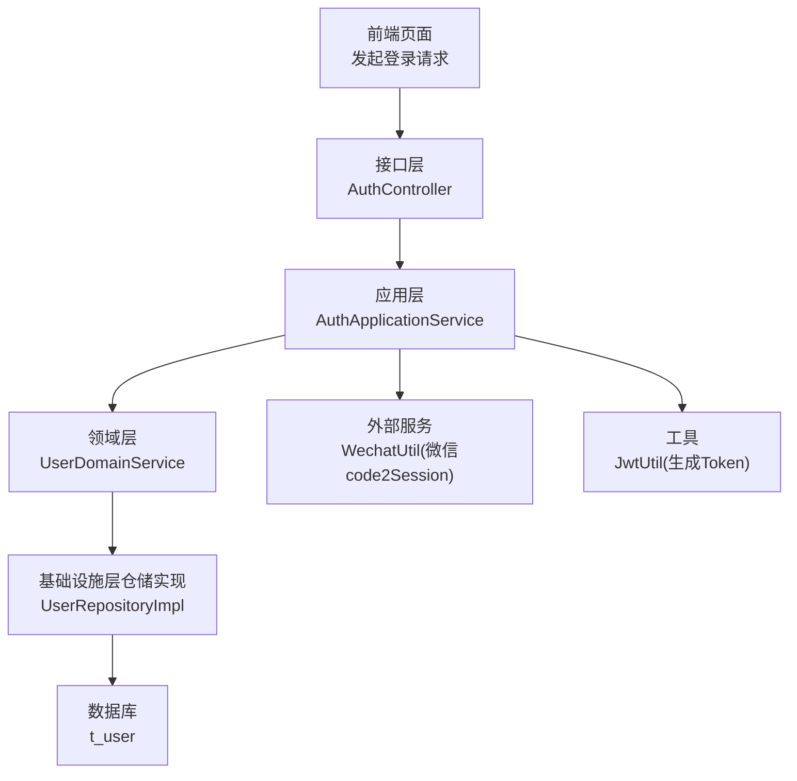
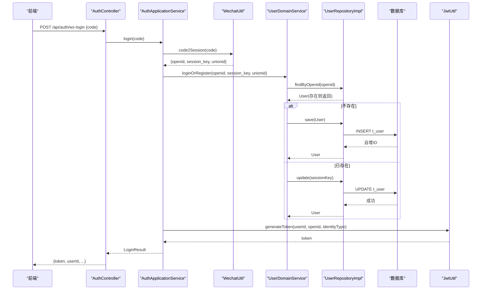
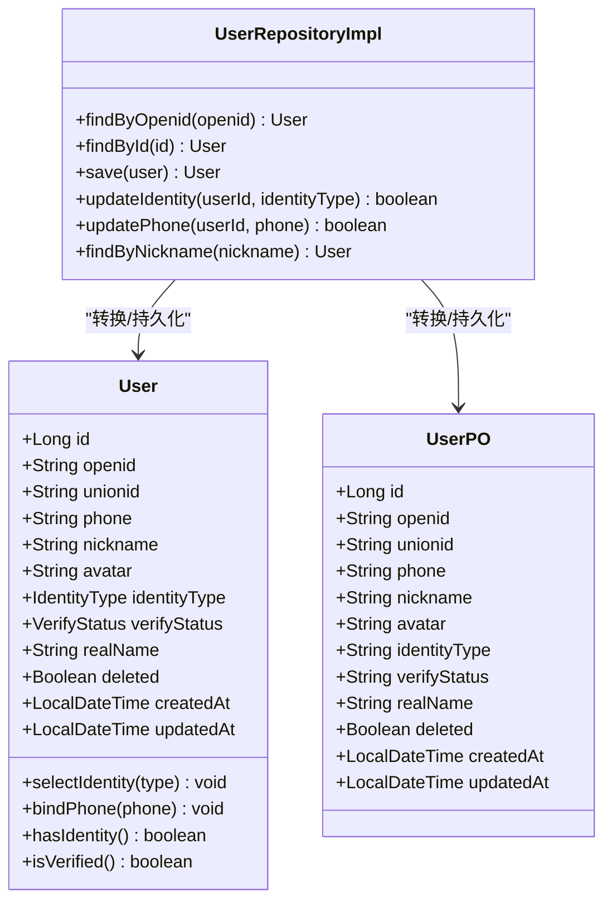
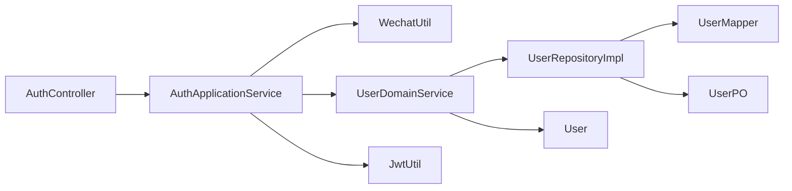

# 数据流设计

<cite>
**本文引用的文件**
- [AuthController.java](file://wzoto-backend/wzoto-interfaces/src/main/java/com/wzoto/interfaces/controller/AuthController.java)
- [AuthApplicationService.java](file://wzoto-backend/wzoto-application/src/main/java/com/wzoto/application/service/AuthApplicationService.java)
- [UserDomainService.java](file://wzoto-backend/wzoto-domain/src/main/java/com/wzoto/domain/service/UserDomainService.java)
- [UserRepositoryImpl.java](file://wzoto-backend/wzoto-infrastructure/src/main/java/com/wzoto/infrastructure/repository/UserRepositoryImpl.java)
- [User.java](file://wzoto-backend/wzoto-domain/src/main/java/com/wzoto/domain/entity/User.java)
- [UserPO.java](file://wzoto-backend/wzoto-infrastructure/src/main/java/com/wzoto/infrastructure/pojo/UserPO.java)
- [WxLoginDTO.java](file://wzoto-backend/wzoto-interfaces/src/main/java/com/wzoto/interfaces/dto/WxLoginDTO.java)
- [LoginVO.java](file://wzoto-backend/wzoto-interfaces/src/main/java/com/wzoto/interfaces/vo/LoginVO.java)
- [JwtUtil.java](file://wzoto-backend/wzoto-infrastructure/src/main/java/com/wzoto/infrastructure/util/JwtUtil.java)
- [WechatUtil.java](file://wzoto-backend/wzoto-infrastructure/src/main/java/com/wzoto/infrastructure/util/WechatUtil.java)
- [application.yml](file://wzoto-backend/wzoto-interfaces/src/main/resources/application.yml)
</cite>

## 目录
1. [简介](#简介)
2. [项目结构](#项目结构)
3. [核心组件](#核心组件)
4. [架构总览](#架构总览)
5. [详细组件分析](#详细组件分析)
6. [依赖关系分析](#依赖关系分析)
7. [性能与一致性](#性能与一致性)
8. [故障排查指南](#故障排查指南)
9. [结论](#结论)
10. [附录：关键数据模型与转换规则](#附录：关键数据模型与转换规则)

## 简介
本文件面向 wzoto 项目的数据流设计，聚焦从前端用户操作到后端数据存储的完整流转过程。以“微信登录”为例，说明请求在 Controller → Application Service → Domain Service → Repository → Database 各层的传递、转换与校验；阐述 DTO、VO、PO 的职责边界与转换规则；说明事务管理、缓存策略与数据一致性保障；并给出数据流向图与关键节点代码路径。同时补充异步处理与消息队列的使用建议，以及数据安全与隐私保护措施。

## 项目结构
后端采用分层架构（接口层、应用层、领域层、基础设施层），前后端分离。登录流程的关键文件分布如下：
- 接口层：接收请求、参数校验、返回统一响应 VO
- 应用层：编排外部服务调用、领域服务、生成 Token
- 领域层：封装业务规则（如身份不可随意切换）
- 基础设施层：持久化、JWT、微信 API 调用等

图表来源
- [AuthController.java:69-75](file://wzoto-backend/wzoto-interfaces/src/main/java/com/wzoto/interfaces/controller/AuthController.java#L69-L75)
- [AuthApplicationService.java:30-57](file://wzoto-backend/wzoto-application/src/main/java/com/wzoto/application/service/AuthApplicationService.java#L30-L57)
- [UserDomainService.java:26-46](file://wzoto-backend/wzoto-domain/src/main/java/com/wzoto/domain/service/UserDomainService.java#L26-L46)
- [UserRepositoryImpl.java:27-55](file://wzoto-backend/wzoto-infrastructure/src/main/java/com/wzoto/infrastructure/repository/UserRepositoryImpl.java#L27-L55)
- [WechatUtil.java:26-45](file://wzoto-backend/wzoto-infrastructure/src/main/java/com/wzoto/infrastructure/util/WechatUtil.java#L26-L45)
- [JwtUtil.java:30-47](file://wzoto-backend/wzoto-infrastructure/src/main/java/com/wzoto/infrastructure/util/JwtUtil.java#L30-L47)

章节来源
- [application.yml:1-51](file://wzoto-backend/wzoto-interfaces/src/main/resources/application.yml#L1-L51)

## 核心组件
- 接口层控制器：负责路由、参数校验、结果包装为统一响应和 VO
- 应用服务：编排微信登录流程、调用领域服务、生成 Token
- 领域服务：封装用户登录/注册、身份选择、绑定手机等业务规则
- 仓储实现：负责领域实体与持久化对象之间的转换及数据库访问
- 工具类：JWT 生成/解析、微信 code2Session 调用
- 配置：数据库、Redis、JWT、微信等配置项

章节来源
- [AuthController.java:21-149](file://wzoto-backend/wzoto-interfaces/src/main/java/com/wzoto/interfaces/controller/AuthController.java#L21-L149)
- [AuthApplicationService.java:13-119](file://wzoto-backend/wzoto-application/src/main/java/com/wzoto/application/service/AuthApplicationService.java#L13-L119)
- [UserDomainService.java:10-76](file://wzoto-backend/wzoto-domain/src/main/java/com/wzoto/domain/service/UserDomainService.java#L10-L76)
- [UserRepositoryImpl.java:16-123](file://wzoto-backend/wzoto-infrastructure/src/main/java/com/wzoto/infrastructure/repository/UserRepositoryImpl.java#L16-L123)
- [JwtUtil.java:17-81](file://wzoto-backend/wzoto-infrastructure/src/main/java/com/wzoto/infrastructure/util/JwtUtil.java#L17-L81)
- [WechatUtil.java:11-57](file://wzoto-backend/wzoto-infrastructure/src/main/java/com/wzoto/infrastructure/util/WechatUtil.java#L11-L57)
- [application.yml:6-51](file://wzoto-backend/wzoto-interfaces/src/main/resources/application.yml#L6-L51)

## 架构总览
下图展示“微信登录”端到端的数据流：前端提交 code，后端依次经过接口层、应用层、领域层、仓储层，最终落库并返回 Token。

图表来源
- [AuthController.java:69-75](file://wzoto-backend/wzoto-interfaces/src/main/java/com/wzoto/interfaces/controller/AuthController.java#L69-L75)
- [AuthApplicationService.java:30-57](file://wzoto-backend/wzoto-application/src/main/java/com/wzoto/application/service/AuthApplicationService.java#L30-L57)
- [UserDomainService.java:26-46](file://wzoto-backend/wzoto-domain/src/main/java/com/wzoto/domain/service/UserDomainService.java#L26-L46)
- [UserRepositoryImpl.java:27-55](file://wzoto-backend/wzoto-infrastructure/src/main/java/com/wzoto/infrastructure/repository/UserRepositoryImpl.java#L27-L55)
- [WechatUtil.java:26-45](file://wzoto-backend/wzoto-infrastructure/src/main/java/com/wzoto/infrastructure/util/WechatUtil.java#L26-L45)
- [JwtUtil.java:30-47](file://wzoto-backend/wzoto-infrastructure/src/main/java/com/wzoto/infrastructure/util/JwtUtil.java#L30-L47)

## 详细组件分析

### 接口层：认证控制器（AuthController）
- 职责：接收微信登录请求，参数校验，调用应用服务，将应用层结果转换为 VO 返回
- 关键点：
  - 使用统一响应包装 R
  - 将应用层 LoginResult 映射为 LoginVO
  - 提供开发环境 dev-login 便捷入口（仅开发环境）

章节来源
- [AuthController.java:69-75](file://wzoto-backend/wzoto-interfaces/src/main/java/com/wzoto/interfaces/controller/AuthController.java#L69-L75)
- [AuthController.java:138-148](file://wzoto-backend/wzoto-interfaces/src/main/java/com/wzoto/interfaces/controller/AuthController.java#L138-L148)

### 应用层：授权应用服务（AuthApplicationService）
- 职责：编排微信登录流程（code2Session → 登录/注册 → 生成 Token）
- 事务：方法标注事务注解，确保微信调用、领域操作、Token 生成的原子性
- 关键点：
  - 调用 WechatUtil 获取 openid/session_key/unionid
  - 调用 UserDomainService 完成登录或注册
  - 调用 JwtUtil 生成 Token，并组装 LoginResult

章节来源
- [AuthApplicationService.java:30-57](file://wzoto-backend/wzoto-application/src/main/java/com/wzoto/application/service/AuthApplicationService.java#L30-L57)
- [AuthApplicationService.java:62-79](file://wzoto-backend/wzoto-application/src/main/java/com/wzoto/application/service/AuthApplicationService.java#L62-L79)
- [AuthApplicationService.java:84-100](file://wzoto-backend/wzoto-application/src/main/java/com/wzoto/application/service/AuthApplicationService.java#L84-L100)

### 领域层：用户领域服务（UserDomainService）
- 职责：封装用户登录/注册、身份选择、绑定手机的业务规则
- 规则示例：
  - 根据 openid 查找用户，不存在则自动注册
  - 更新 session_key
  - 身份一经选择不可随意切换（由领域实体约束）
- 关键点：
  - 通过 UserRepository 进行查询与保存
  - 对异常场景抛出明确异常（如用户不存在）

章节来源
- [UserDomainService.java:26-46](file://wzoto-backend/wzoto-domain/src/main/java/com/wzoto/domain/service/UserDomainService.java#L26-L46)
- [UserDomainService.java:51-60](file://wzoto-backend/wzoto-domain/src/main/java/com/wzoto/domain/service/UserDomainService.java#L51-L60)
- [UserDomainService.java:66-74](file://wzoto-backend/wzoto-domain/src/main/java/com/wzoto/domain/service/UserDomainService.java#L66-L74)

### 基础设施层：仓储实现（UserRepositoryImpl）
- 职责：领域实体 User 与持久化对象 UserPO 的转换与数据库访问
- 关键点：
  - findByOpenid 使用逻辑删除过滤
  - save 区分新增与更新，维护创建/更新时间
  - toEntity/toPO 负责枚举/状态码与领域值对象的转换

章节来源
- [UserRepositoryImpl.java:27-55](file://wzoto-backend/wzoto-infrastructure/src/main/java/com/wzoto/infrastructure/repository/UserRepositoryImpl.java#L27-L55)
- [UserRepositoryImpl.java:87-122](file://wzoto-backend/wzoto-infrastructure/src/main/java/com/wzoto/infrastructure/repository/UserRepositoryImpl.java#L87-L122)

### 领域实体与持久化对象
- 领域实体 User：包含业务行为（selectIdentity、bindPhone、hasIdentity、isVerified）
- 持久化对象 UserPO：与数据库表一一对应，字段类型与存储格式一致

图表来源
- [User.java:20-93](file://wzoto-backend/wzoto-domain/src/main/java/com/wzoto/domain/entity/User.java#L20-L93)
- [UserPO.java:13-49](file://wzoto-backend/wzoto-infrastructure/src/main/java/com/wzoto/infrastructure/pojo/UserPO.java#L13-L49)
- [UserRepositoryImpl.java:27-122](file://wzoto-backend/wzoto-infrastructure/src/main/java/com/wzoto/infrastructure/repository/UserRepositoryImpl.java#L27-L122)

### 数据传输对象（DTO）、视图对象（VO）与持久化对象（PO）
- DTO（入参）：用于接口层接收前端输入，携带校验信息
  - 示例：WxLoginDTO（包含微信登录凭证 code）
- VO（出参）：用于接口层返回给前端的结构化数据
  - 示例：LoginVO（包含 token、userId、nickname、avatar、identityType、hasIdentity、verifyStatus、phone）
- PO（持久化）：与数据库表结构对应，承载存储细节
  - 示例：UserPO（与 t_user 表字段一致）

转换规则与场景
- 接口层：DTO → 应用层入参；应用层结果 → VO
- 领域层：领域实体 User（含业务规则）
- 基础设施层：User ↔ UserPO 双向转换，处理枚举/状态码映射与时间字段

章节来源
- [WxLoginDTO.java:1-15](file://wzoto-backend/wzoto-interfaces/src/main/java/com/wzoto/interfaces/dto/WxLoginDTO.java#L1-L15)
- [LoginVO.java:1-40](file://wzoto-backend/wzoto-interfaces/src/main/java/com/wzoto/interfaces/vo/LoginVO.java#L1-L40)
- [UserRepositoryImpl.java:87-122](file://wzoto-backend/wzoto-infrastructure/src/main/java/com/wzoto/infrastructure/repository/UserRepositoryImpl.java#L87-L122)

### 事务管理与数据一致性
- 事务边界：应用层方法使用事务注解，覆盖微信调用、领域操作、Token 生成
- 一致性保证：
  - 登录/注册与 Token 生成在同一事务内，失败回滚
  - 仓储层更新 session_key 与插入/更新记录遵循 MyBatis-Plus 默认事务语义
- 注意：若后续引入分布式事务或跨服务调用，需评估补偿机制

章节来源
- [AuthApplicationService.java:30-57](file://wzoto-backend/wzoto-application/src/main/java/com/wzoto/application/service/AuthApplicationService.java#L30-L57)
- [UserRepositoryImpl.java:43-55](file://wzoto-backend/wzoto-infrastructure/src/main/java/com/wzoto/infrastructure/repository/UserRepositoryImpl.java#L43-L55)

### 缓存策略
- 当前登录流程未显式使用缓存
- 建议：
  - 热点用户信息可考虑 Redis 缓存（带过期与失效策略）
  - 微信 code2Session 结果可短期缓存以避免重复调用
  - 注意缓存与数据库的一致性（写扩散/读扩散策略）

章节来源
- [application.yml:12-17](file://wzoto-backend/wzoto-interfaces/src/main/resources/application.yml#L12-L17)

### 异步数据处理与消息队列
- 当前登录流程同步执行
- 建议场景：
  - 登录成功后发送欢迎消息、初始化学习数据等耗时任务
  - 使用消息队列（如 RabbitMQ/Kafka）解耦，提升响应速度
  - 结合重试与死信队列保证可靠性

[本节为通用建议，不直接分析具体文件]

### 数据安全与隐私保护
- 传输安全：生产环境建议使用 HTTPS
- 鉴权与会话：
  - 使用 JWT 存储必要身份信息（userId、openid、identityType）
  - 合理设置过期时间（配置项控制）
- 敏感信息：
  - session_key 仅在运行时使用，避免持久化泄露
  - 手机号等敏感字段脱敏返回
- 外部调用：
  - 微信 API 调用失败时记录日志并抛出明确异常
  - 解密手机号需使用官方 SDK 或标准算法

章节来源
- [JwtUtil.java:30-47](file://wzoto-backend/wzoto-infrastructure/src/main/java/com/wzoto/infrastructure/util/JwtUtil.java#L30-L47)
- [JwtProperties.java:10-26](file://wzoto-backend/wzoto-infrastructure/src/main/java/com/wzoto/infrastructure/config/JwtProperties.java#L10-L26)
- [WechatUtil.java:26-57](file://wzoto-backend/wzoto-infrastructure/src/main/java/com/wzoto/infrastructure/util/WechatUtil.java#L26-L57)
- [LoginVO.java:17-40](file://wzoto-backend/wzoto-interfaces/src/main/java/com/wzoto/interfaces/vo/LoginVO.java#L17-L40)

## 依赖关系分析

图表来源
- [AuthController.java:1-149](file://wzoto-backend/wzoto-interfaces/src/main/java/com/wzoto/interfaces/controller/AuthController.java#L1-L149)
- [AuthApplicationService.java:1-119](file://wzoto-backend/wzoto-application/src/main/java/com/wzoto/application/service/AuthApplicationService.java#L1-L119)
- [UserDomainService.java:1-76](file://wzoto-backend/wzoto-domain/src/main/java/com/wzoto/domain/service/UserDomainService.java#L1-L76)
- [UserRepositoryImpl.java:1-123](file://wzoto-backend/wzoto-infrastructure/src/main/java/com/wzoto/infrastructure/repository/UserRepositoryImpl.java#L1-L123)

章节来源
- [AuthController.java:1-149](file://wzoto-backend/wzoto-interfaces/src/main/java/com/wzoto/interfaces/controller/AuthController.java#L1-L149)
- [AuthApplicationService.java:1-119](file://wzoto-backend/wzoto-application/src/main/java/com/wzoto/application/service/AuthApplicationService.java#L1-L119)
- [UserDomainService.java:1-76](file://wzoto-backend/wzoto-domain/src/main/java/com/wzoto/domain/service/UserDomainService.java#L1-L76)
- [UserRepositoryImpl.java:1-123](file://wzoto-backend/wzoto-infrastructure/src/main/java/com/wzoto/infrastructure/repository/UserRepositoryImpl.java#L1-L123)

## 性能与一致性
- 性能优化建议：
  - 减少不必要的数据库往返（批量查询/写入）
  - 合理使用索引（如 openid、unionid）
  - 对高频读取的用户信息进行缓存
- 一致性保障：
  - 应用层事务包裹关键步骤
  - 对外部依赖（微信 API）增加超时与重试策略
  - 幂等设计（如基于 openid 的去重）

[本节为通用指导，不直接分析具体文件]

## 故障排查指南
- 微信登录失败：
  - 检查 WechatUtil 返回的 errcode 与 errmsg
  - 核对 appId、appSecret 配置
- Token 相关问题：
  - 检查 JwtUtil 签名密钥与过期时间配置
  - 确认客户端是否正确携带 Authorization 头
- 用户不存在：
  - 检查 domain 层抛出的异常与日志
  - 确认是否已完成新用户注册流程

章节来源
- [WechatUtil.java:26-45](file://wzoto-backend/wzoto-infrastructure/src/main/java/com/wzoto/infrastructure/util/WechatUtil.java#L26-L45)
- [JwtUtil.java:52-81](file://wzoto-backend/wzoto-infrastructure/src/main/java/com/wzoto/infrastructure/util/JwtUtil.java#L52-L81)
- [UserDomainService.java:51-60](file://wzoto-backend/wzoto-domain/src/main/java/com/wzoto/domain/service/UserDomainService.java#L51-L60)

## 结论
wzoto 后端采用清晰的分层架构，登录流程从前端到数据库的链路明确，职责划分合理。通过 DTO/VO/PO 的严格边界与转换，保证了数据在不同层的表达与安全性。应用层事务保障了关键操作的原子性。建议在后续迭代中引入缓存与消息队列以提升性能与可扩展性，并完善安全与监控措施。

## 附录：关键数据模型与转换规则
- 登录请求 DTO：WxLoginDTO（包含 code）
- 登录响应 VO：LoginVO（包含 token、用户基本信息、身份与认证状态）
- 领域实体：User（包含业务方法与状态）
- 持久化对象：UserPO（与 t_user 表字段一致）
- 转换要点：
  - 领域值对象与字符串编码的互转（如 IdentityType、VerifyStatus）
  - 时间字段的统一处理（创建/更新时间）
  - 敏感字段脱敏（如手机号）

章节来源
- [WxLoginDTO.java:1-15](file://wzoto-backend/wzoto-interfaces/src/main/java/com/wzoto/interfaces/dto/WxLoginDTO.java#L1-L15)
- [LoginVO.java:1-40](file://wzoto-backend/wzoto-interfaces/src/main/java/com/wzoto/interfaces/vo/LoginVO.java#L1-L40)
- [User.java:20-93](file://wzoto-backend/wzoto-domain/src/main/java/com/wzoto/domain/entity/User.java#L20-L93)
- [UserPO.java:13-49](file://wzoto-backend/wzoto-infrastructure/src/main/java/com/wzoto/infrastructure/pojo/UserPO.java#L13-L49)
- [UserRepositoryImpl.java:87-122](file://wzoto-backend/wzoto-infrastructure/src/main/java/com/wzoto/infrastructure/repository/UserRepositoryImpl.java#L87-L122)