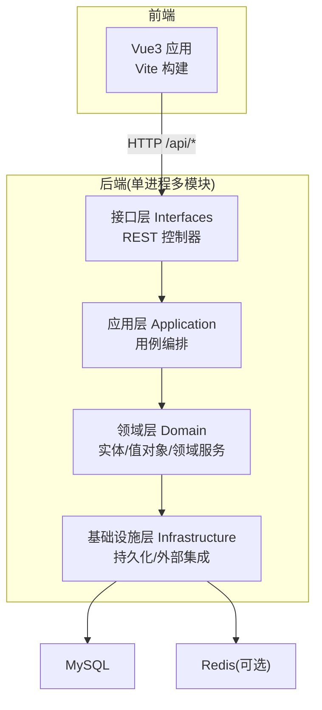
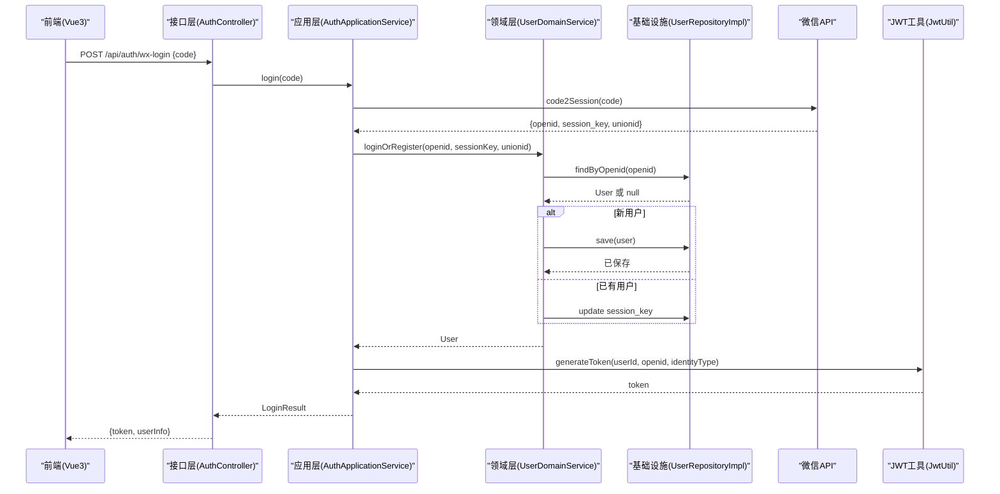
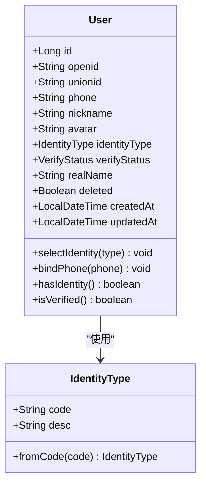
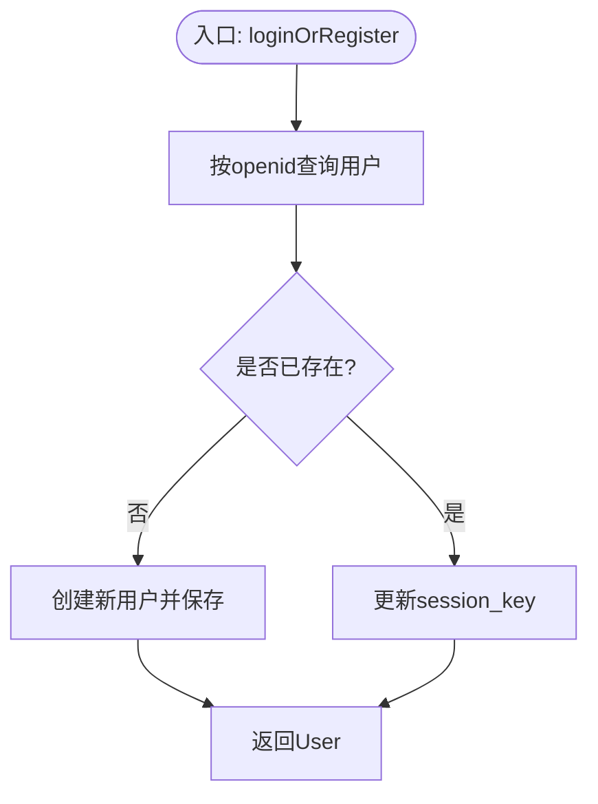
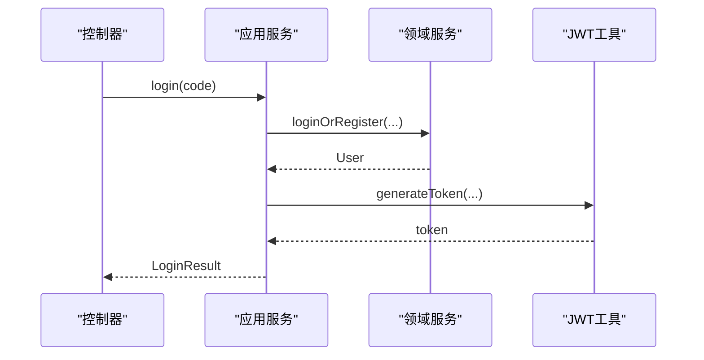
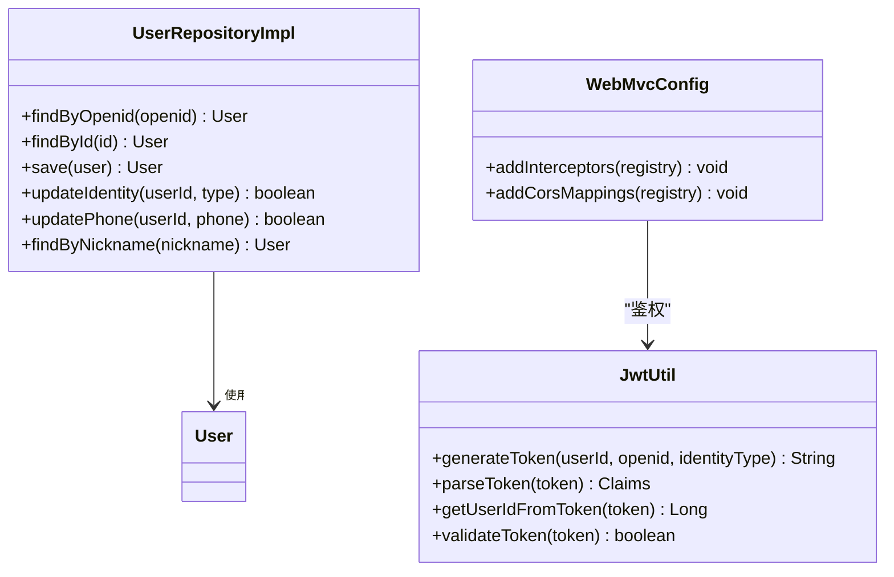
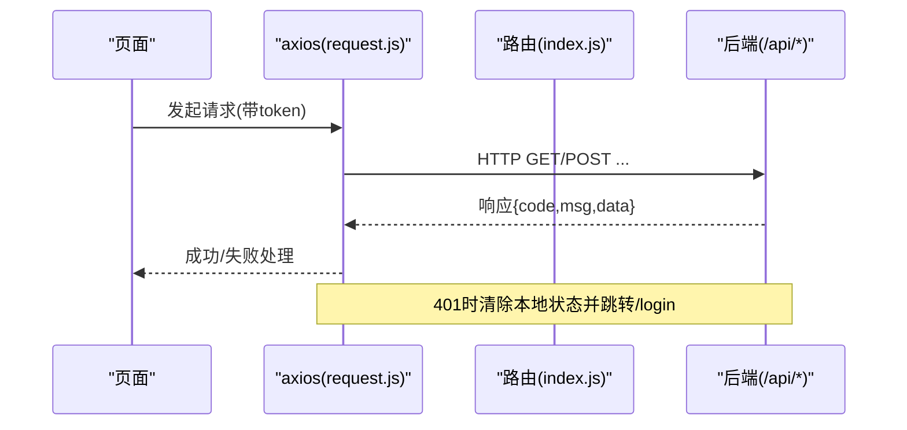
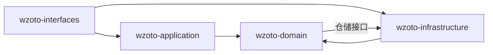

# 系统架构设计

<cite>
**本文引用的文件**
- [pom.xml](file://wzoto-backend/pom.xml)
- [application.yml](file://wzoto-backend/wzoto-interfaces/src/main/resources/application.yml)
- [WzotoApplication.java](file://wzoto-backend/wzoto-interfaces/src/main/java/com/wzoto/WzotoApplication.java)
- [WebMvcConfig.java](file://wzoto-backend/wzoto-infrastructure/src/main/java/com/wzoto/infrastructure/config/WebMvcConfig.java)
- [JwtUtil.java](file://wzoto-backend/wzoto-infrastructure/src/main/java/com/wzoto/infrastructure/util/JwtUtil.java)
- [AuthController.java](file://wzoto-backend/wzoto-interfaces/src/main/java/com/wzoto/interfaces/controller/AuthController.java)
- [AuthApplicationService.java](file://wzoto-backend/wzoto-application/src/main/java/com/wzoto/application/service/AuthApplicationService.java)
- [UserDomainService.java](file://wzoto-backend/wzoto-domain/src/main/java/com/wzoto/domain/service/UserDomainService.java)
- [UserRepositoryImpl.java](file://wzoto-backend/wzoto-infrastructure/src/main/java/com/wzoto/infrastructure/repository/UserRepositoryImpl.java)
- [User.java](file://wzoto-backend/wzoto-domain/src/main/java/com/wzoto/domain/entity/User.java)
- [IdentityType.java](file://wzoto-backend/wzoto-domain/src/main/java/com/wzoto/domain/valobj/IdentityType.java)
- [package.json](file://wzoto-frontend/package.json)
- [vite.config.js](file://wzoto-frontend/vite.config.js)
- [request.js](file://wzoto-frontend/src/utils/request.js)
- [index.js](file://wzoto-frontend/src/router/index.js)
</cite>

## 目录
1. [简介](#简介)
2. [项目结构](#项目结构)
3. [核心组件](#核心组件)
4. [架构总览](#架构总览)
5. [详细组件分析](#详细组件分析)
6. [依赖关系分析](#依赖关系分析)
7. [性能考虑](#性能考虑)
8. [故障排查指南](#故障排查指南)
9. [结论](#结论)
10. [附录](#附录)

## 简介
本文件为 wzoto（学霸到家）项目的系统架构设计文档，围绕领域驱动设计（DDD）分层架构展开，覆盖 Domain、Application、Infrastructure、Interfaces 四层职责与边界；阐述前后端分离的 RESTful API 设计、JWT 认证与跨域配置；给出微服务化演进思路、模块间通信与数据流转；并提供架构图表、技术选型说明、扩展性与性能优化策略。

## 项目结构
后端采用 Maven 多模块工程，按 DDD 分层组织：
- wzoto-domain：领域模型（实体、值对象）、领域服务、仓储接口
- wzoto-application：应用服务，编排用例流程
- wzoto-infrastructure：基础设施实现（MyBatis-Plus 持久化、JWT、微信集成、拦截器与CORS）
- wzoto-interfaces：对外接口层（Spring MVC 控制器、DTO/VO、全局异常处理）

前端基于 Vue3 + Vite + Element Plus + Pinia，通过 axios 调用后端 /api 前缀的 RESTful 接口，开发期使用 Vite 代理转发到后端 8080 端口。

图表来源
- [pom.xml:21-26](file://wzoto-backend/pom.xml#L21-L26)
- [application.yml:6-29](file://wzoto-backend/wzoto-interfaces/src/main/resources/application.yml#L6-L29)

章节来源
- [pom.xml:1-126](file://wzoto-backend/pom.xml#L1-L126)
- [application.yml:1-51](file://wzoto-backend/wzoto-interfaces/src/main/resources/application.yml#L1-L51)

## 核心组件
- 领域层
  - 实体：如 User，封装身份选择、绑定手机号等核心行为与不变式
  - 值对象：如 IdentityType、VerifyStatus，统一枚举语义与校验
  - 领域服务：如 UserDomainService，封装跨实体的业务规则与事务边界
  - 仓储接口：定义领域视角的数据访问契约
- 应用层
  - 应用服务：如 AuthApplicationService，编排微信登录、领域服务调用、JWT 生成等用例
- 基础设施层
  - 持久化：MyBatis-Plus Mapper + PO 对象，仓储实现负责领域实体与 PO 转换
  - 安全：JwtUtil 生成/解析 Token；WebMvcConfig 注册 JWT 拦截器与全局 CORS
  - 外部集成：WechatUtil（微信 code2Session）、AI 客户端（OpenAI 兼容）
- 接口层
  - 控制器：AuthController 暴露 /api/auth/* 接口，进行参数校验、结果包装
  - DTO/VO：请求/响应契约，屏蔽内部模型细节
  - 全局异常：统一错误码与消息

章节来源
- [User.java:1-93](file://wzoto-backend/wzoto-domain/src/main/java/com/wzoto/domain/entity/User.java#L1-L93)
- [IdentityType.java:1-31](file://wzoto-backend/wzoto-domain/src/main/java/com/wzoto/domain/valobj/IdentityType.java#L1-L31)
- [UserDomainService.java:1-76](file://wzoto-backend/wzoto-domain/src/main/java/com/wzoto/domain/service/UserDomainService.java#L1-L76)
- [AuthApplicationService.java:1-119](file://wzoto-backend/wzoto-application/src/main/java/com/wzoto/application/service/AuthApplicationService.java#L1-L119)
- [UserRepositoryImpl.java:1-123](file://wzoto-backend/wzoto-infrastructure/src/main/java/com/wzoto/infrastructure/repository/UserRepositoryImpl.java#L1-L123)
- [WebMvcConfig.java:1-42](file://wzoto-backend/wzoto-infrastructure/src/main/java/com/wzoto/infrastructure/config/WebMvcConfig.java#L1-L42)
- [JwtUtil.java:1-81](file://wzoto-backend/wzoto-infrastructure/src/main/java/com/wzoto/infrastructure/util/JwtUtil.java#L1-L81)
- [AuthController.java:1-149](file://wzoto-backend/wzoto-interfaces/src/main/java/com/wzoto/interfaces/controller/AuthController.java#L1-L149)

## 架构总览
下图展示一次“微信登录”的端到端调用链：前端发起登录请求，经网关/路由进入接口层，应用层编排微信会话获取、领域登录/注册、JWT 签发，最终返回令牌与用户信息。

图表来源
- [AuthController.java:65-75](file://wzoto-backend/wzoto-interfaces/src/main/java/com/wzoto/interfaces/controller/AuthController.java#L65-L75)
- [AuthApplicationService.java:26-57](file://wzoto-backend/wzoto-application/src/main/java/com/wzoto/application/service/AuthApplicationService.java#L26-L57)
- [UserDomainService.java:20-46](file://wzoto-backend/wzoto-domain/src/main/java/com/wzoto/domain/service/UserDomainService.java#L20-L46)
- [UserRepositoryImpl.java:27-55](file://wzoto-backend/wzoto-infrastructure/src/main/java/com/wzoto/infrastructure/repository/UserRepositoryImpl.java#L27-L55)
- [JwtUtil.java:27-47](file://wzoto-backend/wzoto-infrastructure/src/main/java/com/wzoto/infrastructure/util/JwtUtil.java#L27-L47)

## 详细组件分析

### 领域层：实体与值对象
- 实体 User
  - 字段包含标识、社交账号、联系方式、头像、身份类型、认证状态、软删除标记及审计时间
  - 领域行为：selectIdentity（身份一经选择不可切换）、bindPhone、hasIdentity、isVerified
- 值对象 IdentityType
  - 家长/大学生两种身份，提供 fromCode 校验，避免非法状态

图表来源
- [User.java:1-93](file://wzoto-backend/wzoto-domain/src/main/java/com/wzoto/domain/entity/User.java#L1-L93)
- [IdentityType.java:1-31](file://wzoto-backend/wzoto-domain/src/main/java/com/wzoto/domain/valobj/IdentityType.java#L1-L31)

章节来源
- [User.java:1-93](file://wzoto-backend/wzoto-domain/src/main/java/com/wzoto/domain/entity/User.java#L1-L93)
- [IdentityType.java:1-31](file://wzoto-backend/wzoto-domain/src/main/java/com/wzoto/domain/valobj/IdentityType.java#L1-L31)

### 领域服务：UserDomainService
- 登录/注册：根据 openid 查找用户，不存在则自动注册并设置默认值；存在则更新 session_key
- 选择身份：校验用户存在，将字符串身份码转为值对象，调用实体方法并持久化
- 绑定手机号：校验用户存在，调用实体方法并持久化

图表来源
- [UserDomainService.java:20-46](file://wzoto-backend/wzoto-domain/src/main/java/com/wzoto/domain/service/UserDomainService.java#L20-L46)

章节来源
- [UserDomainService.java:1-76](file://wzoto-backend/wzoto-domain/src/main/java/com/wzoto/domain/service/UserDomainService.java#L1-L76)

### 应用服务：AuthApplicationService
- 微信登录：调用微信 code2Session，委托领域服务完成登录/注册，生成 JWT 并组装返回结果
- 选择身份：委托领域服务更新身份后重新签发 Token
- 绑定手机号：委托领域服务绑定手机，不重签 Token

图表来源
- [AuthApplicationService.java:26-57](file://wzoto-backend/wzoto-application/src/main/java/com/wzoto/application/service/AuthApplicationService.java#L26-L57)
- [JwtUtil.java:27-47](file://wzoto-backend/wzoto-infrastructure/src/main/java/com/wzoto/infrastructure/util/JwtUtil.java#L27-L47)

章节来源
- [AuthApplicationService.java:1-119](file://wzoto-backend/wzoto-application/src/main/java/com/wzoto/application/service/AuthApplicationService.java#L1-L119)

### 基础设施层：持久化与安全
- 持久化
  - UserRepositoryImpl 实现领域仓储接口，负责 User 与 UserPO 的双向转换，使用 MyBatis-Plus 进行 CRUD
- 安全
  - WebMvcConfig 注册 JWT 拦截器，对 /api/** 生效，排除登录相关路径；配置全局 CORS 允许跨域
  - JwtUtil 基于 HMAC-SHA 签名生成/解析 Token，支持过期时间与载荷字段

图表来源
- [UserRepositoryImpl.java:1-123](file://wzoto-backend/wzoto-infrastructure/src/main/java/com/wzoto/infrastructure/repository/UserRepositoryImpl.java#L1-L123)
- [JwtUtil.java:1-81](file://wzoto-backend/wzoto-infrastructure/src/main/java/com/wzoto/infrastructure/util/JwtUtil.java#L1-L81)
- [WebMvcConfig.java:1-42](file://wzoto-backend/wzoto-infrastructure/src/main/java/com/wzoto/infrastructure/config/WebMvcConfig.java#L1-L42)

章节来源
- [UserRepositoryImpl.java:1-123](file://wzoto-backend/wzoto-infrastructure/src/main/java/com/wzoto/infrastructure/repository/UserRepositoryImpl.java#L1-L123)
- [WebMvcConfig.java:1-42](file://wzoto-backend/wzoto-infrastructure/src/main/java/com/wzoto/infrastructure/config/WebMvcConfig.java#L1-L42)
- [JwtUtil.java:1-81](file://wzoto-backend/wzoto-infrastructure/src/main/java/com/wzoto/infrastructure/util/JwtUtil.java#L1-L81)

### 接口层：AuthController
- 暴露 /api/auth/me、/api/auth/wx-login、/api/auth/select-identity、/api/auth/bind-phone、/api/auth/dev-login
- 参数校验、调用应用服务、统一返回 R<T> 响应体

章节来源
- [AuthController.java:1-149](file://wzoto-backend/wzoto-interfaces/src/main/java/com/wzoto/interfaces/controller/AuthController.java#L1-L149)

### 前端：前后端分离与认证
- 技术栈：Vue3、Vite、Element Plus、Pinia、Axios
- 开发代理：vite.config.js 将 /api 代理至 http://localhost:8080
- 请求封装：request.js 注入 Authorization: Bearer <token>，统一处理 401 跳转登录
- 路由守卫：router/index.js 控制登录态、身份选择、角色权限（家长/学生）

图表来源
- [vite.config.js:12-19](file://wzoto-frontend/vite.config.js#L12-L19)
- [request.js:13-55](file://wzoto-frontend/src/utils/request.js#L13-L55)
- [index.js:197-247](file://wzoto-frontend/src/router/index.js#L197-L247)

章节来源
- [package.json:1-27](file://wzoto-frontend/package.json#L1-L27)
- [vite.config.js:1-21](file://wzoto-frontend/vite.config.js#L1-L21)
- [request.js:1-59](file://wzoto-frontend/src/utils/request.js#L1-L59)
- [index.js:1-250](file://wzoto-frontend/src/router/index.js#L1-L250)

## 依赖关系分析
- 模块依赖方向：Interfaces -> Application -> Domain <- Infrastructure
  - 接口层依赖应用服务
  - 应用层依赖领域服务与基础设施工具（JWT、微信）
  - 领域层仅依赖自身实体、值对象与仓储接口
  - 基础设施层实现仓储接口，依赖数据库与第三方服务
- 运行时依赖
  - Spring Boot 3.2.5、MyBatis-Plus 3.5.6、Hutool、JWT (jjwt)
  - MySQL、Redis（配置项已预留）

图表来源
- [pom.xml:21-26](file://wzoto-backend/pom.xml#L21-L26)
- [pom.xml:58-90](file://wzoto-backend/pom.xml#L58-L90)

章节来源
- [pom.xml:1-126](file://wzoto-backend/pom.xml#L1-L126)

## 性能考虑
- 数据库
  - 合理索引：openid、unionid、phone、nickname 等高频查询字段建议加索引
  - 逻辑删除：已启用 deleted 字段，注意查询条件始终携带
  - 批量操作：在需要时采用批量插入/更新减少往返
- 缓存
  - Redis 已配置，可用于热点数据（如用户信息、字典、验证码）缓存
  - 短生命周期 Token 可结合 Redis 做黑名单或刷新机制
- 并发与重试
  - 启动类已开启 @EnableRetry，可在外部调用（如微信、AI）处增加重试与退避
- 日志与监控
  - MyBatis-Plus 输出 SQL 便于定位慢查询；生产环境建议接入 APM
- 前端
  - 请求超时与错误提示已内置；可按需增加请求去抖/节流与分页加载

[本节为通用指导，不直接分析具体文件]

## 故障排查指南
- 登录失败
  - 检查微信 code 有效性、网络连通性
  - 查看 application.yml 中微信 app-id/app-secret 配置
- 鉴权失败（401）
  - 确认前端 request.js 是否正确注入 Authorization
  - 检查后端 WebMvcConfig 排除路径是否覆盖当前接口
  - 验证 JwtUtil 密钥与过期时间配置
- 跨域问题
  - 确认 WebMvcConfig 的 allowedOriginPatterns 与 allowCredentials 设置
  - 开发期确认 vite.config.js 代理目标地址正确
- 数据不一致
  - 检查领域服务事务注解与仓储更新逻辑
  - 核对实体字段与 PO 映射转换

章节来源
- [WebMvcConfig.java:21-41](file://wzoto-backend/wzoto-infrastructure/src/main/java/com/wzoto/infrastructure/config/WebMvcConfig.java#L21-L41)
- [JwtUtil.java:49-81](file://wzoto-backend/wzoto-infrastructure/src/main/java/com/wzoto/infrastructure/util/JwtUtil.java#L49-L81)
- [application.yml:6-17](file://wzoto-backend/wzoto-interfaces/src/main/resources/application.yml#L6-L17)
- [request.js:13-55](file://wzoto-frontend/src/utils/request.js#L13-L55)

## 结论
wzoto 后端采用清晰的 DDD 分层架构，领域层聚焦业务不变式与核心行为，应用层编排用例，基础设施层屏蔽技术细节，接口层提供稳定契约。前后端通过 RESTful API 解耦，JWT 保障无状态鉴权，CORS 支持跨域。整体具备良好扩展性，可平滑演进为微服务架构。

[本节为总结性内容，不直接分析具体文件]

## 附录

### 技术选型与优势
- Spring Boot 3.x：快速搭建、生态完善、云原生友好
- MyBatis-Plus：简化 CRUD、分页、逻辑删除、代码生成
- Hutool：常用工具集，提升开发效率
- JWT（jjwt）：轻量、无状态、易于横向扩展
- Vue3 + Vite：现代前端工程化，开发体验与构建性能优异
- Element Plus：丰富的 UI 组件库，降低界面开发成本

章节来源
- [pom.xml:28-90](file://wzoto-backend/pom.xml#L28-L90)
- [package.json:11-25](file://wzoto-frontend/package.json#L11-L25)

### 微服务化设计考虑
- 拆分原则
  - 按业务能力划分服务：用户与认证、学习资源、预约与订单、AI 能力等
  - 每个服务独立数据库与部署单元，通过 API 网关聚合
- 模块间通信
  - 同步：REST/gRPC；异步：消息队列（如 RabbitMQ/Kafka）
  - 事件驱动：用户注册、支付完成等事件广播
- 数据流转
  - 明确读写模型，避免跨服务强耦合；必要时引入 CQRS
- 治理
  - 服务发现、配置中心、链路追踪、熔断限流

[本节为概念性内容，不直接分析具体文件]

### 关键配置速查
- 后端服务端口与上下文：application.yml server.port/server.servlet.context-path
- 数据源与 Redis：spring.datasource.*、spring.data.redis.*
- MyBatis-Plus 全局配置：mybatis-plus.*
- JWT 密钥与过期：wzoto.jwt.secret/wzoto.jwt.expiration-hours
- 微信与 AI：wzoto.wechat.*、wzoto.ai.*
- 前端代理：vite.config.js server.proxy

章节来源
- [application.yml:1-51](file://wzoto-backend/wzoto-interfaces/src/main/resources/application.yml#L1-L51)
- [vite.config.js:12-19](file://wzoto-frontend/vite.config.js#L12-L19)