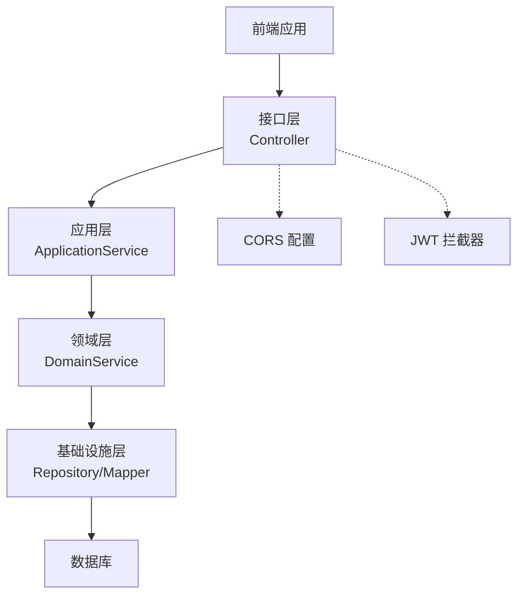
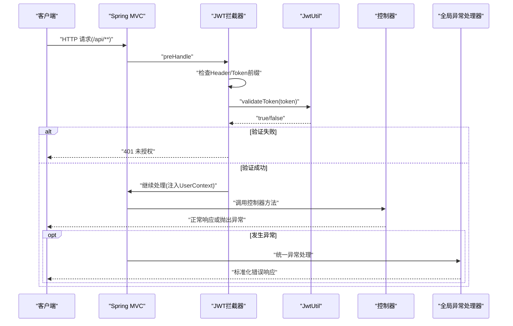
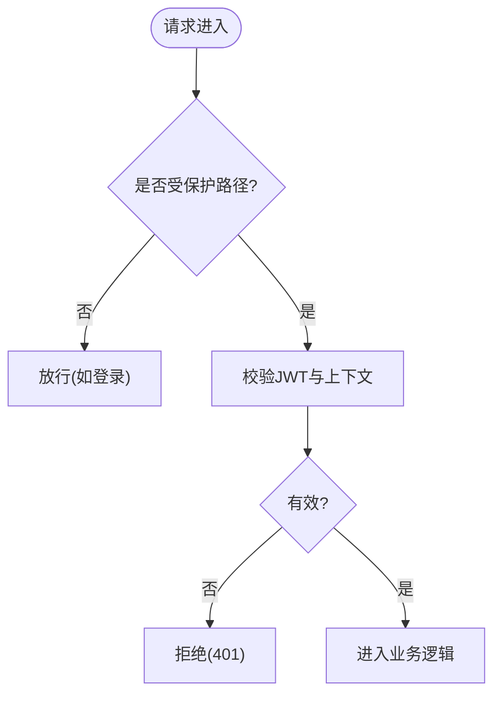
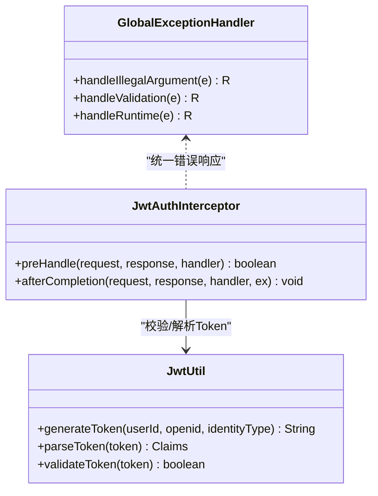
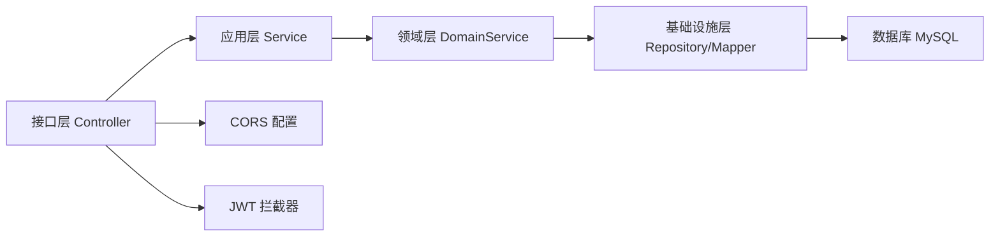

# 安全加固

<cite>
**本文引用的文件**
- [application.yml](file://wzoto-backend/wzoto-interfaces/src/main/resources/application.yml)
- [WebMvcConfig.java](file://wzoto-backend/wzoto-infrastructure/src/main/java/com/wzoto/infrastructure/config/WebMvcConfig.java)
- [JwtAuthInterceptor.java](file://wzoto-backend/wzoto-infrastructure/src/main/java/com/wzoto/infrastructure/interceptor/JwtAuthInterceptor.java)
- [JwtProperties.java](file://wzoto-backend/wzoto-infrastructure/src/main/java/com/wzoto/infrastructure/config/JwtProperties.java)
- [JwtUtil.java](file://wzoto-backend/wzoto-infrastructure/src/main/java/com/wzoto/infrastructure/util/JwtUtil.java)
- [GlobalExceptionHandler.java](file://wzoto-backend/wzoto-interfaces/src/main/java/com/wzoto/interfaces/common/GlobalExceptionHandler.java)
- [R.java](file://wzoto-backend/wzoto-interfaces/src/main/java/com/wzoto/interfaces/common/R.java)
- [LoginVO.java](file://wzoto-backend/wzoto-interfaces/src/main/java/com/wzoto/interfaces/vo/LoginVO.java)
- [t_user.sql](file://wzoto-backend/sql/t_user.sql)
- [t_verify_record.sql](file://wzoto-backend/sql/t_verify_record.sql)
- [v2_learning_resource_extend.sql](file://wzoto-backend/sql/v2_learning_resource_extend.sql)
- [PlayProgressApplicationService.java](file://wzoto-backend/wzoto-application/src/main/java/com/wzoto/application/service/PlayProgressApplicationService.java)
</cite>

## 目录
1. [简介](#简介)
2. [项目结构](#项目结构)
3. [核心组件](#核心组件)
4. [架构总览](#架构总览)
5. [详细组件分析](#详细组件分析)
6. [依赖关系分析](#依赖关系分析)
7. [性能与安全权衡](#性能与安全权衡)
8. [故障排查指南](#故障排查指南)
9. [结论](#结论)
10. [附录：安全加固清单与落地步骤](#附录安全加固清单与落地步骤)

## 简介
本指南面向 wzoto 项目的生产级安全加固，覆盖网络安全、应用安全、访问控制、数据保护、监控审计与应急响应。内容基于仓库中现有实现（JWT 鉴权、全局异常处理、CORS 配置、数据库表结构与日志记录）进行系统化梳理，并给出可落地的加固建议与最佳实践。

## 项目结构
后端采用分层架构：接口层（控制器）、应用层（用例编排）、领域层（业务规则）、基础设施层（配置、拦截器、工具类、持久化）。前端为独立工程，通过 HTTP API 与后端交互。

图表来源
- [WebMvcConfig.java:21-41](file://wzoto-backend/wzoto-infrastructure/src/main/java/com/wzoto/infrastructure/config/WebMvcConfig.java#L21-L41)
- [JwtAuthInterceptor.java:27-58](file://wzoto-backend/wzoto-infrastructure/src/main/java/com/wzoto/infrastructure/interceptor/JwtAuthInterceptor.java#L27-L58)

章节来源
- [WebMvcConfig.java:1-42](file://wzoto-backend/wzoto-infrastructure/src/main/java/com/wzoto/infrastructure/config/WebMvcConfig.java#L1-L42)
- [application.yml:1-51](file://wzoto-backend/wzoto-interfaces/src/main/resources/application.yml#L1-L51)

## 核心组件
- 认证与授权：基于 JWT 的无状态鉴权，拦截器在请求进入前校验 Token，解析用户上下文。
- 输入校验与异常处理：统一参数绑定与校验异常捕获，返回标准化错误响应。
- 跨域与路由：全局 CORS 策略；对 /api/** 启用鉴权，排除登录等公开路径。
- 数据与日志：敏感字段脱敏输出；播放行为与进度写入明细日志表，便于审计。

章节来源
- [JwtAuthInterceptor.java:27-58](file://wzoto-backend/wzoto-infrastructure/src/main/java/com/wzoto/infrastructure/interceptor/JwtAuthInterceptor.java#L27-L58)
- [JwtUtil.java:30-80](file://wzoto-backend/wzoto-infrastructure/src/main/java/com/wzoto/infrastructure/util/JwtUtil.java#L30-L80)
- [GlobalExceptionHandler.java:18-66](file://wzoto-backend/wzoto-interfaces/src/main/java/com/wzoto/interfaces/common/GlobalExceptionHandler.java#L18-L66)
- [WebMvcConfig.java:21-41](file://wzoto-backend/wzoto-infrastructure/src/main/java/com/wzoto/infrastructure/config/WebMvcConfig.java#L21-L41)
- [LoginVO.java:17-40](file://wzoto-backend/wzoto-interfaces/src/main/java/com/wzoto/interfaces/vo/LoginVO.java#L17-L40)
- [v2_learning_resource_extend.sql:76-96](file://wzoto-backend/sql/v2_learning_resource_extend.sql#L76-L96)

## 架构总览
下图展示一次受保护的 API 调用从前端到后端的完整流程，包括 CORS、JWT 校验、上下文注入与异常处理。

图表来源
- [WebMvcConfig.java:21-31](file://wzoto-backend/wzoto-infrastructure/src/main/java/com/wzoto/infrastructure/config/WebMvcConfig.java#L21-L31)
- [JwtAuthInterceptor.java:27-58](file://wzoto-backend/wzoto-infrastructure/src/main/java/com/wzoto/infrastructure/interceptor/JwtAuthInterceptor.java#L27-L58)
- [JwtUtil.java:72-80](file://wzoto-backend/wzoto-infrastructure/src/main/java/com/wzoto/infrastructure/util/JwtUtil.java#L72-L80)
- [GlobalExceptionHandler.java:18-66](file://wzoto-backend/wzoto-interfaces/src/main/java/com/wzoto/interfaces/common/GlobalExceptionHandler.java#L18-L66)

## 详细组件分析

### 网络安全配置
- SSL/TLS 证书与 HTTPS 强制跳转
  - 当前应用默认监听 8080 端口，未内嵌 TLS 终止。建议在反向代理（Nginx/云负载均衡）处配置 SSL 证书并强制 HTTPS 跳转。
  - 若需容器内直接启用 HTTPS，可在 Spring Boot 中配置 server.ssl.* 属性（证书路径、密码、协议版本等），并在网关层限制仅允许 TLS 1.2+。
- 防火墙与网络边界
  - 仅开放必要端口（如 443/80），数据库与缓存仅对应用网段开放。
  - 使用安全组/ACL 限制管理面访问来源 IP。
- CORS 策略
  - 当前允许所有来源并允许凭据，生产环境应收敛为精确的域名白名单，并最小化允许的 Header 与方法。

章节来源
- [application.yml:1-17](file://wzoto-backend/wzoto-interfaces/src/main/resources/application.yml#L1-L17)
- [WebMvcConfig.java:33-41](file://wzoto-backend/wzoto-infrastructure/src/main/java/com/wzoto/infrastructure/config/WebMvcConfig.java#L33-L41)

### 应用安全加固
- JWT 令牌安全
  - 密钥与过期时间通过配置项注入，生产环境必须使用强随机密钥并合理设置过期时间。
  - 拦截器严格校验 Authorization 头前缀与 Token 有效性，失败返回 401。
  - 建议：增加 Token 黑名单/刷新机制、防重放（结合 nonce/jti）、最小化 claims 范围。
- 输入验证与 SQL 注入防护
  - 使用框架参数绑定与校验异常统一处理，避免原始拼接 SQL。
  - 仓储层使用 MyBatis-Plus Lambda 查询，天然规避拼接风险。
- XSS 攻击防护
  - 对外输出的 VO 已对手机号等敏感字段做脱敏处理；前端渲染时避免将不可信数据直接作为 HTML 插入。
  - 建议：启用 CSP、对富文本输入进行服务端白名单过滤与转义。

章节来源
- [JwtProperties.java:12-26](file://wzoto-backend/wzoto-infrastructure/src/main/java/com/wzoto/infrastructure/config/JwtProperties.java#L12-L26)
- [JwtUtil.java:30-80](file://wzoto-backend/wzoto-infrastructure/src/main/java/com/wzoto/infrastructure/util/JwtUtil.java#L30-L80)
- [JwtAuthInterceptor.java:27-58](file://wzoto-backend/wzoto-infrastructure/src/main/java/com/wzoto/infrastructure/interceptor/JwtAuthInterceptor.java#L27-L58)
- [GlobalExceptionHandler.java:32-52](file://wzoto-backend/wzoto-interfaces/src/main/java/com/wzoto/interfaces/common/GlobalExceptionHandler.java#L32-L52)
- [LoginVO.java:38-40](file://wzoto-backend/wzoto-interfaces/src/main/java/com/wzoto/interfaces/vo/LoginVO.java#L38-L40)

### 访问控制机制
- 角色权限管理
  - 当前以身份类型（PARENT/STUDENT）区分用户角色，后续可扩展 RBAC 模型（角色-资源-操作）。
- API 访问控制
  - 通过拦截器对 /api/** 启用鉴权，排除登录相关路径。
- IP 白名单
  - 可在网关或拦截器层增加来源 IP 校验，仅放行可信管理端点。

图表来源
- [WebMvcConfig.java:21-31](file://wzoto-backend/wzoto-infrastructure/src/main/java/com/wzoto/infrastructure/config/WebMvcConfig.java#L21-L31)
- [JwtAuthInterceptor.java:27-58](file://wzoto-backend/wzoto-infrastructure/src/main/java/com/wzoto/infrastructure/interceptor/JwtAuthInterceptor.java#L27-L58)

章节来源
- [WebMvcConfig.java:21-31](file://wzoto-backend/wzoto-infrastructure/src/main/java/com/wzoto/infrastructure/config/WebMvcConfig.java#L21-L31)
- [JwtAuthInterceptor.java:27-58](file://wzoto-backend/wzoto-infrastructure/src/main/java/com/wzoto/infrastructure/interceptor/JwtAuthInterceptor.java#L27-L58)

### 数据安全保护
- 敏感数据加密与脱敏
  - 用户表包含手机号、真实姓名等敏感字段；认证记录表含身份证号（注释标注“脱敏存储”）。
  - 登录结果 VO 对手机号进行脱敏后再返回前端。
- 数据传输加密
  - 建议全站 HTTPS；数据库连接字符串已显式关闭 useSSL=false，生产环境应改为 true 并启用高版本 TLS。
- 数据最小化
  - 仅在必要场景返回必要字段；对日志中的敏感信息做掩码处理。

章节来源
- [t_user.sql:8-26](file://wzoto-backend/sql/t_user.sql#L8-L26)
- [t_verify_record.sql:1-18](file://wzoto-backend/sql/t_verify_record.sql#L1-L18)
- [LoginVO.java:38-40](file://wzoto-backend/wzoto-interfaces/src/main/java/com/wzoto/interfaces/vo/LoginVO.java#L38-L40)
- [application.yml:7-11](file://wzoto-backend/wzoto-interfaces/src/main/resources/application.yml#L7-L11)

### 安全监控与审计
- 登录审计
  - 登录成功后下发 JWT，拦截器记录 userId 与 identityType，可用于审计追踪。
- 操作日志
  - 播放行为与进度写入明细日志表，支持事件类型（PLAY/PAUSE/SEEK/HEARTBEAT/FINISH）与断点续播。
- 异常行为检测
  - 全局异常处理器集中记录参数校验失败、业务规则违反与系统异常，便于告警与溯源。

图表来源
- [JwtAuthInterceptor.java:27-64](file://wzoto-backend/wzoto-infrastructure/src/main/java/com/wzoto/infrastructure/interceptor/JwtAuthInterceptor.java#L27-L64)
- [JwtUtil.java:30-80](file://wzoto-backend/wzoto-infrastructure/src/main/java/com/wzoto/infrastructure/util/JwtUtil.java#L30-L80)
- [GlobalExceptionHandler.java:18-66](file://wzoto-backend/wzoto-interfaces/src/main/java/com/wzoto/interfaces/common/GlobalExceptionHandler.java#L18-L66)

章节来源
- [JwtAuthInterceptor.java:27-64](file://wzoto-backend/wzoto-infrastructure/src/main/java/com/wzoto/infrastructure/interceptor/JwtAuthInterceptor.java#L27-L64)
- [PlayProgressApplicationService.java:52-66](file://wzoto-backend/wzoto-application/src/main/java/com/wzoto/application/service/PlayProgressApplicationService.java#L52-L66)
- [v2_learning_resource_extend.sql:76-96](file://wzoto-backend/sql/v2_learning_resource_extend.sql#L76-L96)
- [GlobalExceptionHandler.java:18-66](file://wzoto-backend/wzoto-interfaces/src/main/java/com/wzoto/interfaces/common/GlobalExceptionHandler.java#L18-L66)

## 依赖关系分析
- 外部依赖
  - JWT 库用于签名与验签；MyBatis-Plus 提供安全的查询构建；MySQL 驱动用于数据持久化。
- 模块耦合
  - 接口层依赖基础设施层的拦截器与配置；应用层依赖领域服务；领域层依赖仓储接口；基础设施层实现具体持久化。

图表来源
- [WebMvcConfig.java:21-41](file://wzoto-backend/wzoto-infrastructure/src/main/java/com/wzoto/infrastructure/config/WebMvcConfig.java#L21-L41)
- [JwtAuthInterceptor.java:27-58](file://wzoto-backend/wzoto-infrastructure/src/main/java/com/wzoto/infrastructure/interceptor/JwtAuthInterceptor.java#L27-L58)

章节来源
- [application.yml:7-11](file://wzoto-backend/wzoto-interfaces/src/main/resources/application.yml#L7-L11)
- [WebMvcConfig.java:21-41](file://wzoto-backend/wzoto-infrastructure/src/main/java/com/wzoto/infrastructure/config/WebMvcConfig.java#L21-L41)

## 性能与安全权衡
- CORS 宽松策略提升开发效率但带来安全风险，生产应收紧来源与方法。
- JWT 无状态鉴权减少会话开销，但需配合合理的过期策略与最小化 claims。
- 细粒度日志增强可观测性，需注意日志量与敏感信息脱敏，避免影响吞吐。

[本节为通用指导，不直接分析具体文件]

## 故障排查指南
- 401 未授权
  - 检查 Authorization 头是否携带正确前缀与有效 Token；确认拦截器排除路径是否正确。
- 参数校验失败
  - 查看全局异常处理器返回的错误消息，定位字段与校验规则。
- 数据库连接问题
  - 核对 application.yml 中的数据源配置与账号密码环境变量。

章节来源
- [JwtAuthInterceptor.java:27-58](file://wzoto-backend/wzoto-infrastructure/src/main/java/com/wzoto/infrastructure/interceptor/JwtAuthInterceptor.java#L27-L58)
- [GlobalExceptionHandler.java:32-52](file://wzoto-backend/wzoto-interfaces/src/main/java/com/wzoto/interfaces/common/GlobalExceptionHandler.java#L32-L52)
- [application.yml:7-11](file://wzoto-backend/wzoto-interfaces/src/main/resources/application.yml#L7-L11)

## 结论
wzoto 已在认证鉴权、异常处理、跨域与日志方面具备良好基础。生产上线前建议完成以下关键加固：全站 HTTPS、收紧 CORS、强化 JWT 密钥与过期策略、完善输入校验与输出脱敏、建立访问审计与告警体系，并制定安全事件应急响应流程。

[本节为总结性内容，不直接分析具体文件]

## 附录：安全加固清单与落地步骤
- 网络安全
  - 在反向代理配置 SSL 证书，强制 HTTPS 跳转；限制 TLS 版本与套件。
  - 收敛 CORS 白名单至可信域名，限制方法与头部。
- 应用安全
  - 使用强随机 JWT 密钥，缩短过期时间；实现 Token 刷新与黑名单。
  - 全面启用参数校验；对所有用户输入进行白名单过滤与转义。
  - 对富文本与导出内容进行 XSS 防护。
- 访问控制
  - 扩展 RBAC 模型，细化资源与操作维度；对管理端点实施 IP 白名单。
- 数据安全
  - 全站传输加密；数据库连接启用 TLS；敏感字段加密存储与脱敏输出。
- 监控审计
  - 统一日志规范，记录登录、关键操作与异常；接入告警与审计平台。
- 扫描与演练
  - 定期漏洞扫描、代码审计与渗透测试；制定应急预案并演练。

[本节为通用指导，不直接分析具体文件]