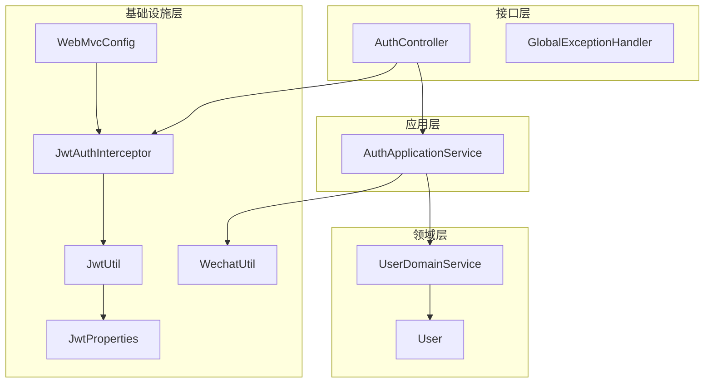
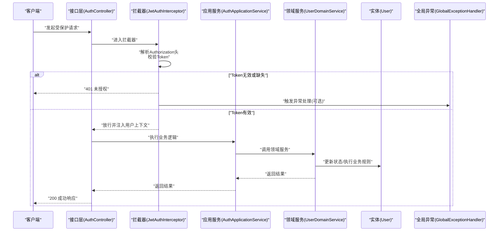
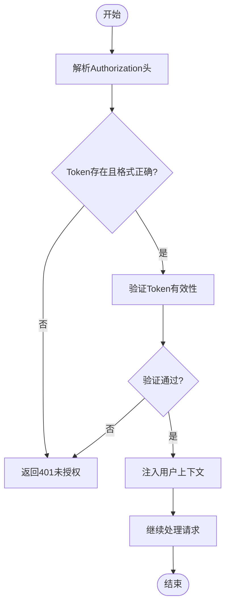
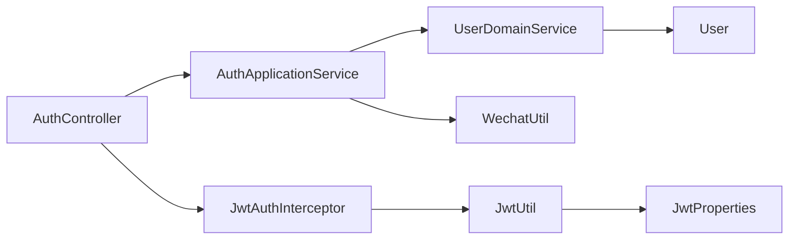

# 安全监控

<cite>
**本文引用的文件**
- [AuthController.java](file://wzoto-backend/wzoto-interfaces/src/main/java/com/wzoto/interfaces/controller/AuthController.java)
- [WebMvcConfig.java](file://wzoto-backend/wzoto-infrastructure/src/main/java/com/wzoto/infrastructure/config/WebMvcConfig.java)
- [JwtAuthInterceptor.java](file://wzoto-backend/wzoto-infrastructure/src/main/java/com/wzoto/infrastructure/interceptor/JwtAuthInterceptor.java)
- [GlobalExceptionHandler.java](file://wzoto-backend/wzoto-interfaces/src/main/java/com/wzoto/interfaces/common/GlobalExceptionHandler.java)
- [JwtUtil.java](file://wzoto-backend/wzoto-infrastructure/src/main/java/com/wzoto/infrastructure/util/JwtUtil.java)
- [JwtProperties.java](file://wzoto-backend/wzoto-infrastructure/src/main/java/com/wzoto/infrastructure/config/JwtProperties.java)
- [application.yml](file://wzoto-backend/wzoto-interfaces/src/main/resources/application.yml)
- [AuthApplicationService.java](file://wzoto-backend/wzoto-application/src/main/java/com/wzoto/application/service/AuthApplicationService.java)
- [UserDomainService.java](file://wzoto-backend/wzoto-domain/src/main/java/com/wzoto/domain/service/UserDomainService.java)
- [User.java](file://wzoto-backend/wzoto-domain/src/main/java/com/wzoto/domain/entity/User.java)
- [WechatUtil.java](file://wzoto-backend/wzoto-infrastructure/src/main/java/com/wzoto/infrastructure/util/WechatUtil.java)
</cite>

## 目录
1. [简介](#简介)
2. [项目结构](#项目结构)
3. [核心组件](#核心组件)
4. [架构总览](#架构总览)
5. [详细组件分析](#详细组件分析)
6. [依赖关系分析](#依赖关系分析)
7. [性能考虑](#性能考虑)
8. [故障排查指南](#故障排查指南)
9. [结论](#结论)
10. [附录](#附录)

## 简介
本方案围绕“安全监控与审计”目标，结合当前后端代码中的认证、拦截、异常处理与配置能力，给出可落地的实施方案。内容覆盖：
- 安全事件监控：登录异常、API调用、系统资源
- 日志审计：安全日志收集、操作日志分析、异常行为检测
- 威胁检测机制：暴力破解、SQL注入、XSS
- 安全告警系统：实时通知、邮件短信、告警级别管理
- 安全态势感知：指标统计、趋势分析、报告生成
- 平台部署与维护指南

## 项目结构
本项目采用分层架构（接口层、应用层、领域层、基础设施层），安全相关能力主要分布在以下位置：
- 接口层：控制器、全局异常处理、统一响应
- 应用层：编排登录流程、调用微信服务、生成JWT
- 领域层：用户实体与业务规则（身份选择不可切换）
- 基础设施层：JWT工具、MVC拦截器、CORS配置、外部工具类

图表来源
- [AuthController.java:24-149](file://wzoto-backend/wzoto-interfaces/src/main/java/com/wzoto/interfaces/controller/AuthController.java#L24-L149)
- [WebMvcConfig.java:15-42](file://wzoto-backend/wzoto-infrastructure/src/main/java/com/wzoto/infrastructure/config/WebMvcConfig.java#L15-L42)
- [JwtAuthInterceptor.java:19-65](file://wzoto-backend/wzoto-infrastructure/src/main/java/com/wzoto/infrastructure/interceptor/JwtAuthInterceptor.java#L19-L65)
- [JwtUtil.java:20-81](file://wzoto-backend/wzoto-infrastructure/src/main/java/com/wzoto/infrastructure/util/JwtUtil.java#L20-L81)
- [JwtProperties.java:10-26](file://wzoto-backend/wzoto-infrastructure/src/main/java/com/wzoto/infrastructure/config/JwtProperties.java#L10-L26)
- [AuthApplicationService.java:17-119](file://wzoto-backend/wzoto-application/src/main/java/com/wzoto/application/service/AuthApplicationService.java#L17-L119)
- [UserDomainService.java:13-76](file://wzoto-backend/wzoto-domain/src/main/java/com/wzoto/domain/service/UserDomainService.java#L13-L76)
- [User.java:16-93](file://wzoto-backend/wzoto-domain/src/main/java/com/wzoto/domain/entity/User.java#L16-L93)
- [WechatUtil.java:14-57](file://wzoto-backend/wzoto-infrastructure/src/main/java/com/wzoto/infrastructure/util/WechatUtil.java#L14-L57)

章节来源
- [AuthController.java:24-149](file://wzoto-backend/wzoto-interfaces/src/main/java/com/wzoto/interfaces/controller/AuthController.java#L24-L149)
- [WebMvcConfig.java:15-42](file://wzoto-backend/wzoto-infrastructure/src/main/java/com/wzoto/infrastructure/config/WebMvcConfig.java#L15-L42)
- [JwtAuthInterceptor.java:19-65](file://wzoto-backend/wzoto-infrastructure/src/main/java/com/wzoto/infrastructure/interceptor/JwtAuthInterceptor.java#L19-L65)
- [GlobalExceptionHandler.java:14-67](file://wzoto-backend/wzoto-interfaces/src/main/java/com/wzoto/interfaces/common/GlobalExceptionHandler.java#L14-L67)
- [JwtUtil.java:20-81](file://wzoto-backend/wzoto-infrastructure/src/main/java/com/wzoto/infrastructure/util/JwtUtil.java#L20-L81)
- [JwtProperties.java:10-26](file://wzoto-backend/wzoto-infrastructure/src/main/java/com/wzoto/infrastructure/config/JwtProperties.java#L10-L26)
- [application.yml:1-51](file://wzoto-backend/wzoto-interfaces/src/main/resources/application.yml#L1-L51)
- [AuthApplicationService.java:17-119](file://wzoto-backend/wzoto-application/src/main/java/com/wzoto/application/service/AuthApplicationService.java#L17-L119)
- [UserDomainService.java:13-76](file://wzoto-backend/wzoto-domain/src/main/java/com/wzoto/domain/service/UserDomainService.java#L13-L76)
- [User.java:16-93](file://wzoto-backend/wzoto-domain/src/main/java/com/wzoto/domain/entity/User.java#L16-L93)
- [WechatUtil.java:14-57](file://wzoto-backend/wzoto-infrastructure/src/main/java/com/wzoto/infrastructure/util/WechatUtil.java#L14-L57)

## 核心组件
- 认证入口与流程
  - 控制器提供微信登录、身份选择、绑定手机号等接口，并记录关键请求信息用于审计。
  - 应用服务编排微信code2Session、用户登录/注册、JWT生成。
  - 领域服务实现用户登录/注册、身份选择、绑定手机等业务规则。
- 访问控制与上下文
  - MVC配置注册JWT拦截器，对/api/**进行鉴权，排除登录相关路径。
  - 拦截器从请求头解析Token，校验有效性后注入用户上下文。
- 异常与错误处理
  - 全局异常处理器统一捕获参数校验、业务异常、运行时异常并返回标准响应，同时输出告警级日志。
- 配置与安全参数
  - JWT密钥、过期时间、Header名称、前缀通过配置中心或环境变量注入。
  - 数据库、Redis、微信、AI等外部依赖通过配置文件管理。

章节来源
- [AuthController.java:65-127](file://wzoto-backend/wzoto-interfaces/src/main/java/com/wzoto/interfaces/controller/AuthController.java#L65-L127)
- [AuthApplicationService.java:26-100](file://wzoto-backend/wzoto-application/src/main/java/com/wzoto/application/service/AuthApplicationService.java#L26-L100)
- [UserDomainService.java:20-76](file://wzoto-backend/wzoto-domain/src/main/java/com/wzoto/domain/service/UserDomainService.java#L20-L76)
- [WebMvcConfig.java:21-41](file://wzoto-backend/wzoto-infrastructure/src/main/java/com/wzoto/infrastructure/config/WebMvcConfig.java#L21-L41)
- [JwtAuthInterceptor.java:27-59](file://wzoto-backend/wzoto-infrastructure/src/main/java/com/wzoto/infrastructure/interceptor/JwtAuthInterceptor.java#L27-L59)
- [GlobalExceptionHandler.java:18-66](file://wzoto-backend/wzoto-interfaces/src/main/java/com/wzoto/interfaces/common/GlobalExceptionHandler.java#L18-L66)
- [JwtProperties.java:15-26](file://wzoto-backend/wzoto-infrastructure/src/main/java/com/wzoto/infrastructure/config/JwtProperties.java#L15-L26)
- [application.yml:6-51](file://wzoto-backend/wzoto-interfaces/src/main/resources/application.yml#L6-L51)

## 架构总览
下图展示一次受保护API的完整调用链，包含拦截器鉴权、应用服务编排、领域服务执行与异常处理。

图表来源
- [AuthController.java:65-127](file://wzoto-backend/wzoto-interfaces/src/main/java/com/wzoto/interfaces/controller/AuthController.java#L65-L127)
- [JwtAuthInterceptor.java:27-59](file://wzoto-backend/wzoto-infrastructure/src/main/java/com/wzoto/infrastructure/interceptor/JwtAuthInterceptor.java#L27-L59)
- [AuthApplicationService.java:26-100](file://wzoto-backend/wzoto-application/src/main/java/com/wzoto/application/service/AuthApplicationService.java#L26-L100)
- [UserDomainService.java:20-76](file://wzoto-backend/wzoto-domain/src/main/java/com/wzoto/domain/service/UserDomainService.java#L20-L76)
- [User.java:63-93](file://wzoto-backend/wzoto-domain/src/main/java/com/wzoto/domain/entity/User.java#L63-L93)
- [GlobalExceptionHandler.java:18-66](file://wzoto-backend/wzoto-interfaces/src/main/java/com/wzoto/interfaces/common/GlobalExceptionHandler.java#L18-L66)

## 详细组件分析

### 登录与认证链路
- 登录入口
  - 控制器接收微信登录凭证，调用应用服务完成登录流程。
  - 应用服务调用微信接口获取openid/session_key，再调用领域服务登录/注册，最后生成JWT。
- 访问控制
  - 所有/api/**请求经JWT拦截器校验，非法请求直接拒绝。
  - 登录相关路径在MVC配置中排除鉴权。
- 上下文传递
  - 拦截器解析Token后将userId、openid、identityType注入到线程上下文，供后续业务使用。

图表来源
- [JwtAuthInterceptor.java:27-59](file://wzoto-backend/wzoto-infrastructure/src/main/java/com/wzoto/infrastructure/interceptor/JwtAuthInterceptor.java#L27-L59)
- [WebMvcConfig.java:21-31](file://wzoto-backend/wzoto-infrastructure/src/main/java/com/wzoto/infrastructure/config/WebMvcConfig.java#L21-L31)
- [JwtUtil.java:52-81](file://wzoto-backend/wzoto-infrastructure/src/main/java/com/wzoto/infrastructure/util/JwtUtil.java#L52-L81)
- [JwtProperties.java:15-26](file://wzoto-backend/wzoto-infrastructure/src/main/java/com/wzoto/infrastructure/config/JwtProperties.java#L15-L26)

章节来源
- [AuthController.java:65-127](file://wzoto-backend/wzoto-interfaces/src/main/java/com/wzoto/interfaces/controller/AuthController.java#L65-L127)
- [AuthApplicationService.java:26-100](file://wzoto-backend/wzoto-application/src/main/java/com/wzoto/application/service/AuthApplicationService.java#L26-L100)
- [JwtAuthInterceptor.java:27-59](file://wzoto-backend/wzoto-infrastructure/src/main/java/com/wzoto/infrastructure/interceptor/JwtAuthInterceptor.java#L27-L59)
- [WebMvcConfig.java:21-31](file://wzoto-backend/wzoto-infrastructure/src/main/java/com/wzoto/infrastructure/config/WebMvcConfig.java#L21-L31)
- [JwtUtil.java:52-81](file://wzoto-backend/wzoto-infrastructure/src/main/java/com/wzoto/infrastructure/util/JwtUtil.java#L52-L81)
- [JwtProperties.java:15-26](file://wzoto-backend/wzoto-infrastructure/src/main/java/com/wzoto/infrastructure/config/JwtProperties.java#L15-L26)

### 异常与错误处理
- 统一异常捕获
  - 参数校验失败、业务规则违反、运行时异常均被捕获并返回标准响应。
  - 日志输出包含警告或错误级别，便于审计与告警。
- 建议扩展
  - 将敏感字段脱敏后再输出日志。
  - 为不同异常类型定义告警级别，便于接入告警系统。

章节来源
- [GlobalExceptionHandler.java:18-66](file://wzoto-backend/wzoto-interfaces/src/main/java/com/wzoto/interfaces/common/GlobalExceptionHandler.java#L18-L66)

### 配置与环境安全
- JWT配置
  - 密钥、过期时间、Header名称与前缀通过配置项注入，生产环境需替换默认值。
- 外部依赖
  - 数据库、Redis、微信、AI等通过环境变量或配置文件管理，避免硬编码。
- 日志级别
  - 当前日志级别设置为debug，生产环境建议调整为info或warn以减少噪音。

章节来源
- [JwtProperties.java:15-26](file://wzoto-backend/wzoto-infrastructure/src/main/java/com/wzoto/infrastructure/config/JwtProperties.java#L15-L26)
- [application.yml:6-51](file://wzoto-backend/wzoto-interfaces/src/main/resources/application.yml#L6-L51)

## 依赖关系分析
- 组件耦合
  - 控制器依赖应用服务；应用服务依赖领域服务与外部工具；领域服务依赖仓储接口与实体。
  - 拦截器依赖JWT工具与配置；全局异常处理器独立于业务逻辑。
- 外部依赖
  - 微信小程序接口用于登录；数据库与Redis用于持久化与缓存；AI功能可开关。
- 潜在风险
  - 若JWT密钥泄露或配置不当，可能导致鉴权失效。
  - 若日志未脱敏，可能泄露敏感信息。

图表来源
- [AuthController.java:24-149](file://wzoto-backend/wzoto-interfaces/src/main/java/com/wzoto/interfaces/controller/AuthController.java#L24-L149)
- [AuthApplicationService.java:17-119](file://wzoto-backend/wzoto-application/src/main/java/com/wzoto/application/service/AuthApplicationService.java#L17-L119)
- [UserDomainService.java:13-76](file://wzoto-backend/wzoto-domain/src/main/java/com/wzoto/domain/service/UserDomainService.java#L13-L76)
- [User.java:16-93](file://wzoto-backend/wzoto-domain/src/main/java/com/wzoto/domain/entity/User.java#L16-L93)
- [JwtAuthInterceptor.java:19-65](file://wzoto-backend/wzoto-infrastructure/src/main/java/com/wzoto/infrastructure/interceptor/JwtAuthInterceptor.java#L19-L65)
- [JwtUtil.java:20-81](file://wzoto-backend/wzoto-infrastructure/src/main/java/com/wzoto/infrastructure/util/JwtUtil.java#L20-L81)
- [JwtProperties.java:10-26](file://wzoto-backend/wzoto-infrastructure/src/main/java/com/wzoto/infrastructure/config/JwtProperties.java#L10-L26)
- [WechatUtil.java:14-57](file://wzoto-backend/wzoto-infrastructure/src/main/java/com/wzoto/infrastructure/util/WechatUtil.java#L14-L57)

章节来源
- [AuthController.java:24-149](file://wzoto-backend/wzoto-interfaces/src/main/java/com/wzoto/interfaces/controller/AuthController.java#L24-L149)
- [AuthApplicationService.java:17-119](file://wzoto-backend/wzoto-application/src/main/java/com/wzoto/application/service/AuthApplicationService.java#L17-L119)
- [UserDomainService.java:13-76](file://wzoto-backend/wzoto-domain/src/main/java/com/wzoto/domain/service/UserDomainService.java#L13-L76)
- [User.java:16-93](file://wzoto-backend/wzoto-domain/src/main/java/com/wzoto/domain/entity/User.java#L16-L93)
- [JwtAuthInterceptor.java:19-65](file://wzoto-backend/wzoto-infrastructure/src/main/java/com/wzoto/infrastructure/interceptor/JwtAuthInterceptor.java#L19-L65)
- [JwtUtil.java:20-81](file://wzoto-backend/wzoto-infrastructure/src/main/java/com/wzoto/infrastructure/util/JwtUtil.java#L20-L81)
- [JwtProperties.java:10-26](file://wzoto-backend/wzoto-infrastructure/src/main/java/com/wzoto/infrastructure/config/JwtProperties.java#L10-L26)
- [WechatUtil.java:14-57](file://wzoto-backend/wzoto-infrastructure/src/main/java/com/wzoto/infrastructure/util/WechatUtil.java#L14-L57)

## 性能考虑
- 鉴权开销
  - JWT解析与签名验证为轻量操作，建议在高频接口启用缓存策略（如黑名单或白名单）。
- 日志量控制
  - 调试级别日志在生产环境应关闭或降级，避免I/O瓶颈。
- 外部调用
  - 微信接口调用需设置超时与重试策略，避免阻塞主线程。

[本节为通用指导，不直接分析具体文件]

## 故障排查指南
- 登录失败
  - 检查微信接口返回码与消息，确认AppId与AppSecret配置正确。
  - 查看应用服务日志，定位code2Session失败原因。
- 鉴权失败
  - 检查请求头是否携带正确的Authorization前缀与Token。
  - 确认JWT密钥与过期时间配置一致。
- 参数校验失败
  - 根据全局异常处理器返回的错误信息，修正前端传参。
- 系统异常
  - 查看全局异常处理器输出的错误日志，定位堆栈信息。

章节来源
- [WechatUtil.java:26-45](file://wzoto-backend/wzoto-infrastructure/src/main/java/com/wzoto/infrastructure/util/WechatUtil.java#L26-L45)
- [JwtAuthInterceptor.java:27-59](file://wzoto-backend/wzoto-infrastructure/src/main/java/com/wzoto/infrastructure/interceptor/JwtAuthInterceptor.java#L27-L59)
- [GlobalExceptionHandler.java:18-66](file://wzoto-backend/wzoto-interfaces/src/main/java/com/wzoto/interfaces/common/GlobalExceptionHandler.java#L18-L66)

## 结论
当前代码已具备基础的认证与异常处理能力，可作为安全监控与审计的起点。建议在此基础上补充：
- 统一的访问审计日志（含用户、IP、URI、方法、耗时、结果）
- 基于规则的威胁检测（暴力破解、SQL注入、XSS）
- 告警与通知（邮件、短信、即时通讯）
- 安全指标与报表（登录失败率、异常率、攻击次数）
- 安全基线与合规检查（密钥轮换、最小权限、数据脱敏）

[本节为总结性内容，不直接分析具体文件]

## 附录

### 安全事件监控实施方案
- 登录异常监控
  - 采集点：登录接口、拦截器、全局异常处理器
  - 指标：登录失败次数、异常类型分布、来源IP分布
  - 阈值：单位时间内失败次数超过阈值触发告警
- API调用监控
  - 采集点：MVC拦截器、控制器入口
  - 指标：QPS、延迟、错误率、参数大小
  - 阈值：错误率或延迟超过阈值触发告警
- 系统资源监控
  - 采集点：JVM、数据库连接池、Redis连接
  - 指标：CPU、内存、GC、连接数、慢查询
  - 阈值：资源使用率超过阈值触发告警

[本节为概念性内容，不直接分析具体文件]

### 日志审计实施方案
- 安全日志收集
  - 来源：登录接口、拦截器、异常处理器
  - 内容：用户ID、IP、URI、方法、时间、结果、错误信息（脱敏）
  - 存储：集中式日志系统（如ELK）
- 操作日志分析
  - 维度：按用户、接口、时间范围聚合
  - 用途：识别异常操作、回溯问题
- 异常行为检测
  - 规则：频繁失败、非常规时段、异常参数
  - 动作：标记、限流、封禁、告警

[本节为概念性内容，不直接分析具体文件]

### 威胁检测机制
- 暴力破解检测
  - 规则：同一用户/IP在短时间内多次登录失败
  - 措施：临时封禁、验证码、告警
- SQL注入检测
  - 规则：请求参数包含常见注入特征
  - 措施：拦截、记录、告警
- XSS攻击检测
  - 规则：请求体或URL包含脚本标签
  - 措施：过滤、转义、告警

[本节为概念性内容，不直接分析具体文件]

### 安全告警系统
- 实时告警通知
  - 渠道：邮件、短信、即时通讯
  - 触发：阈值达成、规则命中
- 告警级别管理
  - 级别：提示、警告、严重、致命
  - 策略：不同级别对应不同通知方式与响应时效

[本节为概念性内容，不直接分析具体文件]

### 安全态势感知
- 安全指标统计
  - 指标：登录成功率、异常率、攻击次数、封禁次数
- 风险趋势分析
  - 趋势：按日/周/月观察变化
- 安全报告生成
  - 内容：指标汇总、趋势图、Top风险、处置建议

[本节为概念性内容，不直接分析具体文件]

### 部署与维护指南
- 部署要点
  - 配置：JWT密钥、数据库、Redis、微信、AI开关
  - 日志：调整日志级别，启用集中式日志
  - 网络：限制跨域来源，仅允许必要域名
- 维护要点
  - 密钥轮换：定期更换JWT密钥
  - 依赖升级：关注第三方库安全公告
  - 备份与恢复：数据库与配置备份策略

章节来源
- [application.yml:6-51](file://wzoto-backend/wzoto-interfaces/src/main/resources/application.yml#L6-L51)
- [JwtProperties.java:15-26](file://wzoto-backend/wzoto-infrastructure/src/main/java/com/wzoto/infrastructure/config/JwtProperties.java#L15-L26)