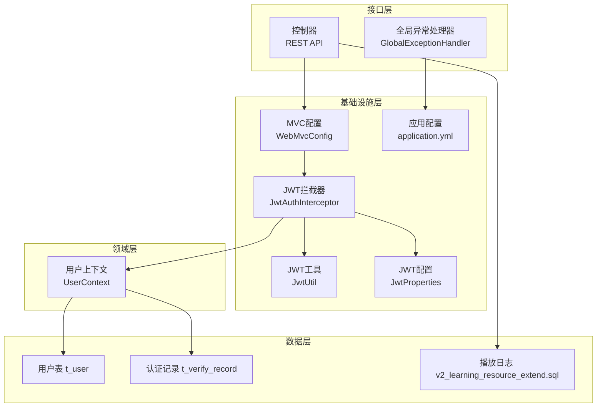
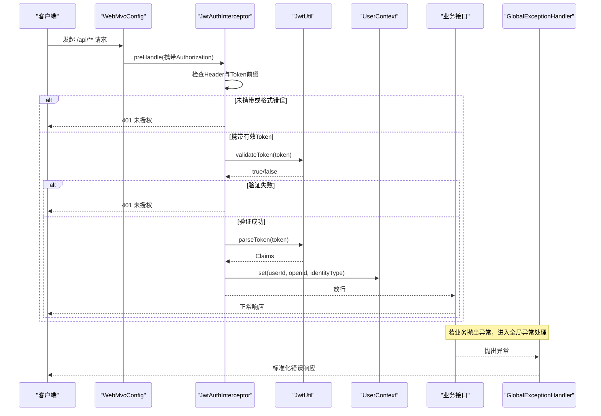
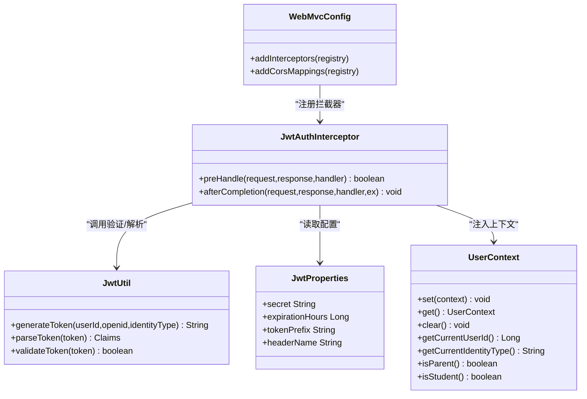
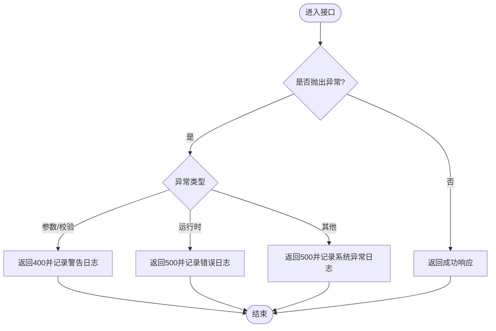
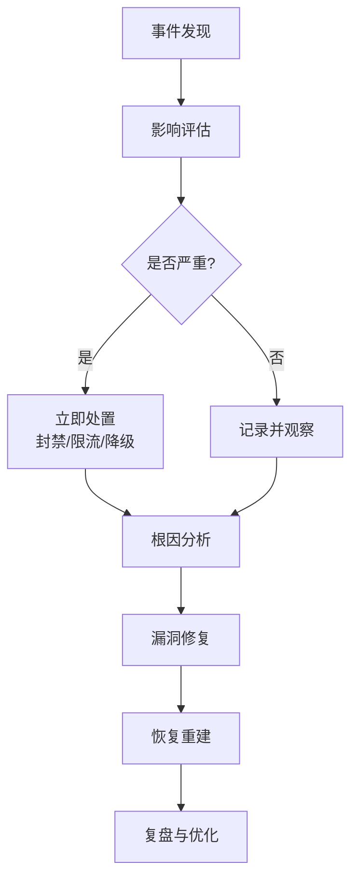

# 应急响应

<cite>
**本文引用的文件**
- [GlobalExceptionHandler.java](file://wzoto-backend/wzoto-interfaces/src/main/java/com/wzoto/interfaces/common/GlobalExceptionHandler.java)
- [JwtAuthInterceptor.java](file://wzoto-backend/wzoto-infrastructure/src/main/java/com/wzoto/infrastructure/interceptor/JwtAuthInterceptor.java)
- [JwtUtil.java](file://wzoto-backend/wzoto-infrastructure/src/main/java/com/wzoto/infrastructure/util/JwtUtil.java)
- [JwtProperties.java](file://wzoto-backend/wzoto-infrastructure/src/main/java/com/wzoto/infrastructure/config/JwtProperties.java)
- [WebMvcConfig.java](file://wzoto-backend/wzoto-infrastructure/src/main/java/com/wzoto/infrastructure/config/WebMvcConfig.java)
- [application.yml](file://wzoto-backend/wzoto-interfaces/src/main/resources/application.yml)
- [UserContext.java](file://wzoto-backend/wzoto-domain/src/main/java/com/wzoto/domain/context/UserContext.java)
- [t_user.sql](file://wzoto-backend/sql/t_user.sql)
- [t_verify_record.sql](file://wzoto-backend/sql/t_verify_record.sql)
- [v2_learning_resource_extend.sql](file://wzoto-backend/sql/v2_learning_resource_extend.sql)
</cite>

## 目录
1. [简介](#简介)
2. [项目结构](#项目结构)
3. [核心组件](#核心组件)
4. [架构总览](#架构总览)
5. [详细组件分析](#详细组件分析)
6. [依赖关系分析](#依赖关系分析)
7. [性能考虑](#性能考虑)
8. [故障排查指南](#故障排查指南)
9. [结论](#结论)
10. [附录](#附录)

## 简介
本文件面向Wzoto项目的安全事件应急响应，覆盖事件分类、响应流程、应急预案制定、工具与资源、事后总结改进以及团队培训与能力建设。文档结合代码库中的认证拦截、全局异常处理、日志配置、数据库表结构等实际实现，给出可落地的应急操作指引与可视化流程图。

## 项目结构
本项目采用分层架构：接口层（控制器与统一异常处理）、应用层（业务编排）、领域层（实体、值对象、领域服务、上下文）、基础设施层（配置、拦截器、工具类、持久化）。安全相关能力集中在基础设施层的JWT认证与配置，以及接口层的全局异常处理；用户身份与审计数据通过数据库表进行记录与留存。

图表来源
- [WebMvcConfig.java:21-31](file://wzoto-backend/wzoto-infrastructure/src/main/java/com/wzoto/infrastructure/config/WebMvcConfig.java#L21-L31)
- [JwtAuthInterceptor.java:27-59](file://wzoto-backend/wzoto-infrastructure/src/main/java/com/wzoto/infrastructure/interceptor/JwtAuthInterceptor.java#L27-L59)
- [JwtUtil.java:30-80](file://wzoto-backend/wzoto-infrastructure/src/main/java/com/wzoto/infrastructure/util/JwtUtil.java#L30-L80)
- [JwtProperties.java:12-25](file://wzoto-backend/wzoto-infrastructure/src/main/java/com/wzoto/infrastructure/config/JwtProperties.java#L12-L25)
- [application.yml:31-46](file://wzoto-backend/wzoto-interfaces/src/main/resources/application.yml#L31-L46)
- [UserContext.java:14-55](file://wzoto-backend/wzoto-domain/src/main/java/com/wzoto/domain/context/UserContext.java#L14-L55)
- [t_user.sql:8-25](file://wzoto-backend/sql/t_user.sql#L8-L25)
- [t_verify_record.sql:2-17](file://wzoto-backend/sql/t_verify_record.sql#L2-L17)
- [v2_learning_resource_extend.sql:77-96](file://wzoto-backend/sql/v2_learning_resource_extend.sql#L77-L96)

章节来源
- [WebMvcConfig.java:21-31](file://wzoto-backend/wzoto-infrastructure/src/main/java/com/wzoto/infrastructure/config/WebMvcConfig.java#L21-L31)
- [JwtAuthInterceptor.java:27-59](file://wzoto-backend/wzoto-infrastructure/src/main/java/com/wzoto/infrastructure/interceptor/JwtAuthInterceptor.java#L27-L59)
- [JwtUtil.java:30-80](file://wzoto-backend/wzoto-infrastructure/src/main/java/com/wzoto/infrastructure/util/JwtUtil.java#L30-L80)
- [JwtProperties.java:12-25](file://wzoto-backend/wzoto-infrastructure/src/main/java/com/wzoto/infrastructure/config/JwtProperties.java#L12-L25)
- [application.yml:31-46](file://wzoto-backend/wzoto-interfaces/src/main/resources/application.yml#L31-L46)
- [UserContext.java:14-55](file://wzoto-backend/wzoto-domain/src/main/java/com/wzoto/domain/context/UserContext.java#L14-L55)
- [t_user.sql:8-25](file://wzoto-backend/sql/t_user.sql#L8-L25)
- [t_verify_record.sql:2-17](file://wzoto-backend/sql/t_verify_record.sql#L2-L17)
- [v2_learning_resource_extend.sql:77-96](file://wzoto-backend/sql/v2_learning_resource_extend.sql#L77-L96)

## 核心组件
- 认证与鉴权
  - JWT拦截器负责从请求头提取Token并校验，解析后注入用户上下文，供后续业务使用。
  - JWT工具提供生成、解析、验证能力；密钥与过期时间由配置管理。
  - MVC配置注册拦截器并排除登录相关路径，同时开启跨域支持。
- 全局异常处理
  - 统一捕获参数校验、绑定、运行时及系统异常，输出标准化响应并记录告警日志。
- 审计与追踪
  - 用户上下文承载当前用户标识与身份类型，便于审计与权限控制。
  - 数据库包含用户表、认证记录表与播放日志表，可用于取证与回溯。

章节来源
- [JwtAuthInterceptor.java:27-59](file://wzoto-backend/wzoto-infrastructure/src/main/java/com/wzoto/infrastructure/interceptor/JwtAuthInterceptor.java#L27-L59)
- [JwtUtil.java:30-80](file://wzoto-backend/wzoto-infrastructure/src/main/java/com/wzoto/infrastructure/util/JwtUtil.java#L30-L80)
- [WebMvcConfig.java:21-41](file://wzoto-backend/wzoto-infrastructure/src/main/java/com/wzoto/infrastructure/config/WebMvcConfig.java#L21-L41)
- [GlobalExceptionHandler.java:18-66](file://wzoto-backend/wzoto-interfaces/src/main/java/com/wzoto/interfaces/common/GlobalExceptionHandler.java#L18-L66)
- [UserContext.java:14-55](file://wzoto-backend/wzoto-domain/src/main/java/com/wzoto/domain/context/UserContext.java#L14-L55)
- [t_user.sql:8-25](file://wzoto-backend/sql/t_user.sql#L8-L25)
- [t_verify_record.sql:2-17](file://wzoto-backend/sql/t_verify_record.sql#L2-L17)
- [v2_learning_resource_extend.sql:77-96](file://wzoto-backend/sql/v2_learning_resource_extend.sql#L77-L96)

## 架构总览
下图展示一次受保护API请求的认证与异常处理流程，体现安全事件在拦截阶段与异常阶段的发现点。

图表来源
- [WebMvcConfig.java:21-31](file://wzoto-backend/wzoto-infrastructure/src/main/java/com/wzoto/infrastructure/config/WebMvcConfig.java#L21-L31)
- [JwtAuthInterceptor.java:27-59](file://wzoto-backend/wzoto-infrastructure/src/main/java/com/wzoto/infrastructure/interceptor/JwtAuthInterceptor.java#L27-L59)
- [JwtUtil.java:30-80](file://wzoto-backend/wzoto-infrastructure/src/main/java/com/wzoto/infrastructure/util/JwtUtil.java#L30-L80)
- [GlobalExceptionHandler.java:18-66](file://wzoto-backend/wzoto-interfaces/src/main/java/com/wzoto/interfaces/common/GlobalExceptionHandler.java#L18-L66)

## 详细组件分析

### 认证与鉴权组件
- 职责
  - 从请求头提取并校验JWT，解析用户信息并注入线程上下文。
  - 对OPTIONS预检请求放行，避免跨域预检被误拦截。
- 关键行为
  - 未携带或非法Token返回401。
  - 解析成功后设置UserContext，并在请求完成后清理。
- 配置项
  - 密钥、过期时间、Token前缀、Header名称由配置类集中管理。
- 风险点
  - 默认密钥需在生产环境替换为高强度随机密钥。
  - 过期时间需根据业务安全策略调整。

图表来源
- [WebMvcConfig.java:21-41](file://wzoto-backend/wzoto-infrastructure/src/main/java/com/wzoto/infrastructure/config/WebMvcConfig.java#L21-L41)
- [JwtAuthInterceptor.java:27-64](file://wzoto-backend/wzoto-infrastructure/src/main/java/com/wzoto/infrastructure/interceptor/JwtAuthInterceptor.java#L27-L64)
- [JwtUtil.java:30-80](file://wzoto-backend/wzoto-infrastructure/src/main/java/com/wzoto/infrastructure/util/JwtUtil.java#L30-L80)
- [JwtProperties.java:12-25](file://wzoto-backend/wzoto-infrastructure/src/main/java/com/wzoto/infrastructure/config/JwtProperties.java#L12-L25)
- [UserContext.java:14-55](file://wzoto-backend/wzoto-domain/src/main/java/com/wzoto/domain/context/UserContext.java#L14-L55)

章节来源
- [JwtAuthInterceptor.java:27-64](file://wzoto-backend/wzoto-infrastructure/src/main/java/com/wzoto/infrastructure/interceptor/JwtAuthInterceptor.java#L27-L64)
- [JwtUtil.java:30-80](file://wzoto-backend/wzoto-infrastructure/src/main/java/com/wzoto/infrastructure/util/JwtUtil.java#L30-L80)
- [JwtProperties.java:12-25](file://wzoto-backend/wzoto-infrastructure/src/main/java/com/wzoto/infrastructure/config/JwtProperties.java#L12-L25)
- [WebMvcConfig.java:21-41](file://wzoto-backend/wzoto-infrastructure/src/main/java/com/wzoto/infrastructure/config/WebMvcConfig.java#L21-L41)
- [UserContext.java:14-55](file://wzoto-backend/wzoto-domain/src/main/java/com/wzoto/domain/context/UserContext.java#L14-L55)

### 全局异常处理组件
- 职责
  - 统一捕获参数校验、绑定、运行时与系统异常，输出标准错误响应并记录日志。
- 关键行为
  - 参数异常与校验失败返回400并附带错误信息。
  - 运行时与系统异常返回500并记录错误堆栈。
- 应急价值
  - 作为“事件发现”的关键信号源，便于监控告警与快速定位问题。

图表来源
- [GlobalExceptionHandler.java:18-66](file://wzoto-backend/wzoto-interfaces/src/main/java/com/wzoto/interfaces/common/GlobalExceptionHandler.java#L18-L66)

章节来源
- [GlobalExceptionHandler.java:18-66](file://wzoto-backend/wzoto-interfaces/src/main/java/com/wzoto/interfaces/common/GlobalExceptionHandler.java#L18-L66)

### 审计与取证数据
- 用户表与认证记录表用于身份核验与审计追溯。
- 播放日志表记录用户行为明细，可作为事件回溯依据。
- 建议将敏感字段（如身份证号）脱敏存储，降低泄露风险。

章节来源
- [t_user.sql:8-25](file://wzoto-backend/sql/t_user.sql#L8-L25)
- [t_verify_record.sql:2-17](file://wzoto-backend/sql/t_verify_record.sql#L2-L17)
- [v2_learning_resource_extend.sql:77-96](file://wzoto-backend/sql/v2_learning_resource_extend.sql#L77-L96)

## 依赖关系分析
- 低耦合高内聚
  - 认证逻辑集中在基础设施层，通过配置与工具类解耦。
  - 全局异常处理独立于业务，保证一致的错误处理策略。
- 外部依赖
  - JWT库用于令牌签发与校验。
  - 数据库驱动与MyBatis-Plus用于数据访问。
- 潜在风险
  - 默认密钥需强制替换。
  - CORS允许所有来源可能带来安全风险，生产环境应收紧白名单。

章节来源
- [JwtUtil.java:30-80](file://wzoto-backend/wzoto-infrastructure/src/main/java/com/wzoto/infrastructure/util/JwtUtil.java#L30-L80)
- [JwtProperties.java:12-25](file://wzoto-backend/wzoto-infrastructure/src/main/java/com/wzoto/infrastructure/config/JwtProperties.java#L12-L25)
- [WebMvcConfig.java:33-41](file://wzoto-backend/wzoto-infrastructure/src/main/java/com/wzoto/infrastructure/config/WebMvcConfig.java#L33-L41)
- [application.yml:6-17](file://wzoto-backend/wzoto-interfaces/src/main/resources/application.yml#L6-L17)

## 性能考虑
- 认证开销
  - JWT校验为轻量级计算，建议在高频接口启用缓存以减少重复解析。
- 日志级别
  - 开发环境使用DEBUG便于排查，生产环境建议调整为INFO/WARN以降低I/O压力。
- 数据库索引
  - 用户表与认证记录表已建立常用索引，有助于查询与审计效率。

[本节为通用指导，不直接分析具体文件]

## 故障排查指南
- 常见现象
  - 401未授权：检查Authorization头是否存在且以Bearer开头；确认Token是否过期或签名无效。
  - 400参数错误：查看全局异常处理器输出的字段校验错误信息。
  - 500服务器错误：查看系统异常日志与堆栈，定位业务异常根因。
- 快速定位
  - 通过日志关键字“JWT Token验证失败”“参数校验失败”“系统异常”快速筛选。
  - 结合UserContext获取当前用户ID与身份类型，缩小影响范围。
- 取证步骤
  - 从数据库检索用户表与认证记录表，核对用户状态与认证历史。
  - 从播放日志表拉取会话与事件序列，还原用户行为轨迹。

章节来源
- [JwtAuthInterceptor.java:34-46](file://wzoto-backend/wzoto-infrastructure/src/main/java/com/wzoto/infrastructure/interceptor/JwtAuthInterceptor.java#L34-L46)
- [GlobalExceptionHandler.java:32-66](file://wzoto-backend/wzoto-interfaces/src/main/java/com/wzoto/interfaces/common/GlobalExceptionHandler.java#L32-L66)
- [UserContext.java:39-55](file://wzoto-backend/wzoto-domain/src/main/java/com/wzoto/domain/context/UserContext.java#L39-L55)
- [t_user.sql:8-25](file://wzoto-backend/sql/t_user.sql#L8-L25)
- [t_verify_record.sql:2-17](file://wzoto-backend/sql/t_verify_record.sql#L2-L17)
- [v2_learning_resource_extend.sql:77-96](file://wzoto-backend/sql/v2_learning_resource_extend.sql#L77-L96)

## 结论
本项目在认证鉴权与异常处理方面具备良好基础，可通过完善配置、强化日志与审计、规范CORS策略，构建完整的安全事件应急响应体系。结合本文档的流程、预案、工具与培训方案，可在入侵、数据泄露、服务中断与恶意攻击等场景下快速发现、评估、处置与恢复，并持续优化。

[本节为总结性内容，不直接分析具体文件]

## 附录

### 安全事件分类与响应流程
- 事件分类
  - 入侵事件：未授权访问、越权操作、异常登录。
  - 数据泄露：敏感数据外泄、日志泄露、备份泄露。
  - 服务中断：拒绝服务、资源耗尽、依赖不可用。
  - 恶意攻击：注入、XSS、CSRF、暴力破解。
- 响应流程
  - 事件发现：基于全局异常日志、认证失败日志、监控告警。
  - 影响评估：结合UserContext与数据库审计表，评估受影响用户与数据范围。
  - 应急处置：临时封禁、限流、降级、回滚、隔离。
  - 恢复重建：修复漏洞、更新配置、重启服务、验证回归。
- 可视化流程

[本节为概念性流程，不直接映射到具体文件]

### 应急预案制定
- 预案文档编写
  - 明确事件分级、触发条件、责任人、沟通机制、处置步骤、恢复标准。
- 演练计划制定
  - 定期开展桌面推演与实战演练，覆盖四类事件场景。
- 资源准备清单
  - 工具：日志分析、取证、修复脚本。
  - 环境：隔离环境、备份恢复通道、回滚包。
  - 人员：安全、研发、运维、法务、公关。

[本节为通用指导，不直接分析具体文件]

### 事件处理工具
- 日志分析工具
  - 利用应用日志与数据库日志，按时间窗口与用户维度聚合分析。
- 取证工具
  - 导出用户表、认证记录表、播放日志表，形成证据链。
- 修复工具包
  - 配置修正脚本（密钥轮换、过期策略）、CORS白名单更新、依赖升级补丁。

[本节为通用指导，不直接分析具体文件]

### 事后总结改进
- 根因分析
  - 基于异常日志与审计数据，定位技术与管理原因。
- 漏洞修复
  - 修复认证绕过、参数校验缺失、敏感信息泄露等问题。
- 流程优化
  - 完善拦截规则、收紧CORS、增强日志与监控、提升自动化处置能力。

[本节为通用指导，不直接分析具体文件]

### 应急响应团队培训与能力建设
- 培训内容
  - 认证与鉴权原理、JWT安全实践、异常处理与日志分析、取证与合规。
- 能力建设
  - 建立知识库与案例库，沉淀处置SOP与检查清单。
  - 定期考核与演练，提升协同与响应速度。

[本节为通用指导，不直接分析具体文件]