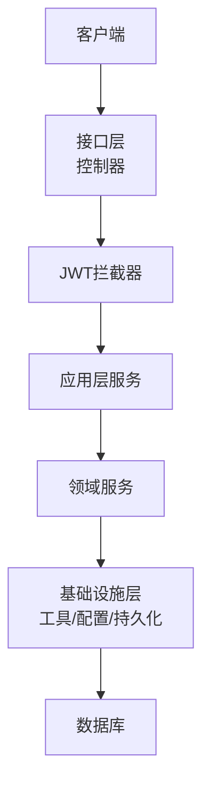
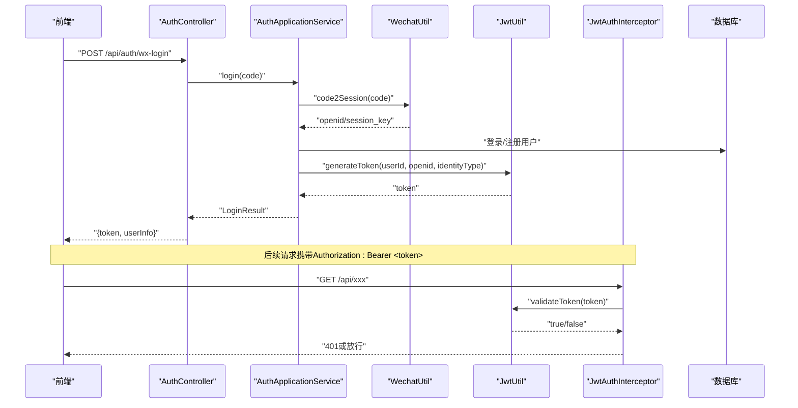
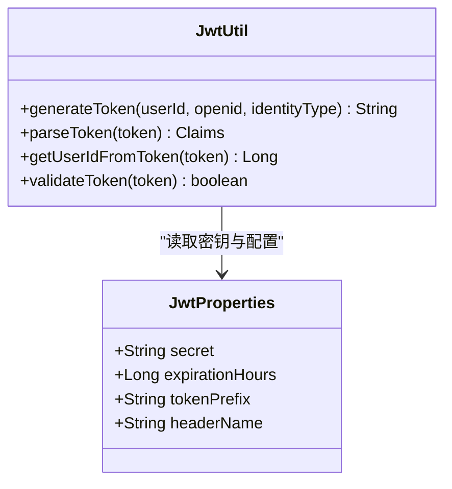
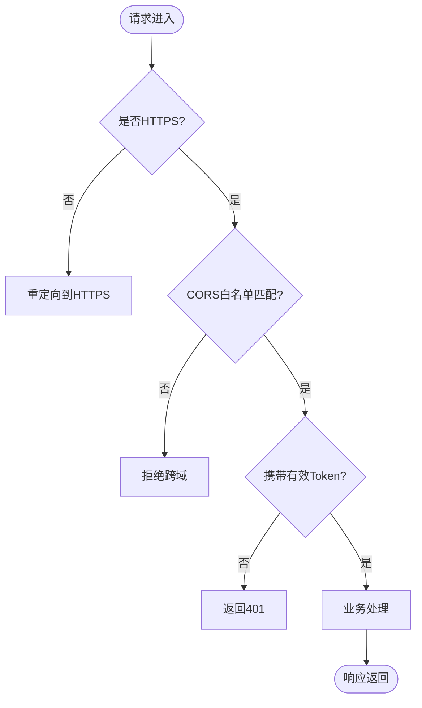
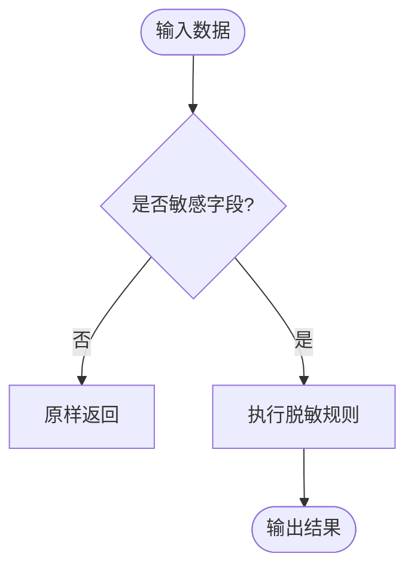
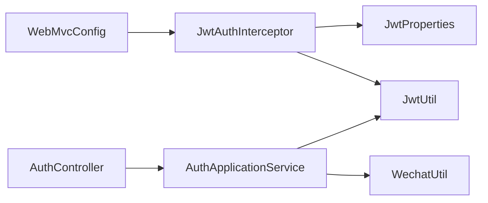

# 数据安全

<cite>
**本文引用的文件**
- [JwtProperties.java](file://wzoto-backend/wzoto-infrastructure/src/main/java/com/wzoto/infrastructure/config/JwtProperties.java)
- [JwtUtil.java](file://wzoto-backend/wzoto-infrastructure/src/main/java/com/wzoto/infrastructure/util/JwtUtil.java)
- [JwtAuthInterceptor.java](file://wzoto-backend/wzoto-infrastructure/src/main/java/com/wzoto/infrastructure/interceptor/JwtAuthInterceptor.java)
- [WebMvcConfig.java](file://wzoto-backend/wzoto-infrastructure/src/main/java/com/wzoto/infrastructure/config/WebMvcConfig.java)
- [application.yml](file://wzoto-backend/wzoto-interfaces/src/main/resources/application.yml)
- [WechatUtil.java](file://wzoto-backend/wzoto-infrastructure/src/main/java/com/wzoto/infrastructure/util/WechatUtil.java)
- [AuthController.java](file://wzoto-backend/wzoto-interfaces/src/main/java/com/wzoto/interfaces/controller/AuthController.java)
- [AuthApplicationService.java](file://wzoto-backend/wzoto-application/src/main/java/com/wzoto/application/service/AuthApplicationService.java)
- [VerifyController.java](file://wzoto-backend/wzoto-interfaces/src/main/java/com/wzoto/interfaces/controller/VerifyController.java)
- [GlobalExceptionHandler.java](file://wzoto-backend/wzoto-interfaces/src/main/java/com/wzoto/interfaces/common/GlobalExceptionHandler.java)
- [t_user.sql](file://wzoto-backend/sql/t_user.sql)
- [v2_learning_resource_extend.sql](file://wzoto-backend/sql/v2_learning_resource_extend.sql)
</cite>

## 目录
1. [引言](#引言)
2. [项目结构](#项目结构)
3. [核心组件](#核心组件)
4. [架构总览](#架构总览)
5. [详细组件分析](#详细组件分析)
6. [依赖关系分析](#依赖关系分析)
7. [性能与安全考量](#性能与安全考量)
8. [故障排查指南](#故障排查指南)
9. [结论](#结论)
10. [附录](#附录)

## 引言
本方案围绕“敏感数据加密、数据传输加密、数据脱敏、备份与恢复、访问控制、合规与风险评估”六大主题，结合当前代码库中的JWT认证、拦截器、配置项、日志与异常处理等实现，给出可落地的数据安全实施方案。目标是在不改变现有业务逻辑的前提下，补齐安全短板、降低风险暴露面，并提供可审计、可回滚的运维保障。

## 项目结构
后端采用分层架构：接口层（控制器）、应用层（编排服务）、领域层（业务规则）、基础设施层（配置、工具、持久化）。安全相关能力主要分布在基础设施层的配置与工具类、接口层的控制器与全局异常处理器，以及SQL脚本中定义的表结构。

图表来源
- [WebMvcConfig.java:21-31](file://wzoto-backend/wzoto-infrastructure/src/main/java/com/wzoto/infrastructure/config/WebMvcConfig.java#L21-L31)
- [JwtAuthInterceptor.java:27-59](file://wzoto-backend/wzoto-infrastructure/src/main/java/com/wzoto/infrastructure/interceptor/JwtAuthInterceptor.java#L27-L59)
- [AuthController.java:67-127](file://wzoto-backend/wzoto-interfaces/src/main/java/com/wzoto/interfaces/controller/AuthController.java#L67-L127)

章节来源
- [WebMvcConfig.java:21-31](file://wzoto-backend/wzoto-infrastructure/src/main/java/com/wzoto/infrastructure/config/WebMvcConfig.java#L21-L31)
- [application.yml:6-17](file://wzoto-backend/wzoto-interfaces/src/main/resources/application.yml#L6-L17)

## 核心组件
- JWT密钥与Token管理：通过配置类集中管理密钥、过期时间、Header名称；工具类负责生成、解析与校验Token。
- 登录态拦截：统一在MVC层对/api/**进行鉴权拦截，排除公开登录路径。
- 敏感配置注入：数据库密码、Redis密码、微信AppSecret、AI密钥等通过环境变量注入，避免硬编码。
- 数据脱敏：在返回VO前对姓名、身份证号等敏感字段进行掩码处理。
- 日志与异常：统一异常处理，记录警告/错误日志，避免泄露敏感信息。

章节来源
- [JwtProperties.java:10-26](file://wzoto-backend/wzoto-infrastructure/src/main/java/com/wzoto/infrastructure/config/JwtProperties.java#L10-L26)
- [JwtUtil.java:27-81](file://wzoto-backend/wzoto-infrastructure/src/main/java/com/wzoto/infrastructure/util/JwtUtil.java#L27-L81)
- [JwtAuthInterceptor.java:27-59](file://wzoto-backend/wzoto-infrastructure/src/main/java/com/wzoto/infrastructure/interceptor/JwtAuthInterceptor.java#L27-L59)
- [application.yml:31-46](file://wzoto-backend/wzoto-interfaces/src/main/resources/application.yml#L31-L46)
- [VerifyController.java:77-87](file://wzoto-backend/wzoto-interfaces/src/main/java/com/wzoto/interfaces/controller/VerifyController.java#L77-L87)
- [GlobalExceptionHandler.java:18-66](file://wzoto-backend/wzoto-interfaces/src/main/java/com/wzoto/interfaces/common/GlobalExceptionHandler.java#L18-L66)

## 架构总览
下图展示从前端到后端的请求链路及安全控制点：登录流程生成Token，后续请求经拦截器校验Token并注入用户上下文；敏感配置由环境变量注入；敏感数据在输出前脱敏。

图表来源
- [AuthController.java:67-127](file://wzoto-backend/wzoto-interfaces/src/main/java/com/wzoto/interfaces/controller/AuthController.java#L67-L127)
- [AuthApplicationService.java:26-40](file://wzoto-backend/wzoto-application/src/main/java/com/wzoto/application/service/AuthApplicationService.java#L26-L40)
- [WechatUtil.java:40-57](file://wzoto-backend/wzoto-infrastructure/src/main/java/com/wzoto/infrastructure/util/WechatUtil.java#L40-L57)
- [JwtUtil.java:27-81](file://wzoto-backend/wzoto-infrastructure/src/main/java/com/wzoto/infrastructure/util/JwtUtil.java#L27-L81)
- [JwtAuthInterceptor.java:27-59](file://wzoto-backend/wzoto-infrastructure/src/main/java/com/wzoto/infrastructure/interceptor/JwtAuthInterceptor.java#L27-L59)

## 详细组件分析

### 组件A：敏感数据加密与密钥管理
- 用户密码加密存储
  - 现状：用户表未包含密码字段，采用微信OpenID作为身份标识，规避了本地密码明文存储风险。
  - 建议：若未来引入手机号+验证码或密码登录，应在领域或服务层使用强哈希算法（如BCrypt）存储，禁止明文落库。
- JWT密钥管理
  - 现状：密钥通过配置类读取，支持环境变量覆盖；默认值存在但生产应强制替换。
  - 建议：使用密钥管理服务（如KMS/云厂商密钥中心）动态下发，定期轮换；启用最小权限原则，限制密钥访问范围。
- 数据库连接密码加密
  - 现状：数据库密码通过环境变量注入，避免硬编码。
  - 建议：结合容器/编排平台的安全变量机制，限制运行环境可见性；必要时对配置文件本身进行加密存储与解密加载。

图表来源
- [JwtProperties.java:10-26](file://wzoto-backend/wzoto-infrastructure/src/main/java/com/wzoto/infrastructure/config/JwtProperties.java#L10-L26)
- [JwtUtil.java:27-81](file://wzoto-backend/wzoto-infrastructure/src/main/java/com/wzoto/infrastructure/util/JwtUtil.java#L27-L81)

章节来源
- [t_user.sql:7-26](file://wzoto-backend/sql/t_user.sql#L7-L26)
- [JwtProperties.java:10-26](file://wzoto-backend/wzoto-infrastructure/src/main/java/com/wzoto/infrastructure/config/JwtProperties.java#L10-L26)
- [application.yml:31-46](file://wzoto-backend/wzoto-interfaces/src/main/resources/application.yml#L31-L46)

### 组件B：数据传输加密（HTTPS、API通信、文件传输）
- HTTPS配置
  - 现状：未在当前仓库发现Nginx/Tomcat SSL配置；端口为8080且JDBC显式关闭SSL。
  - 建议：在反向代理（Nginx/网关）启用TLS1.2+，强制HTTPS；禁用弱加密套件；开启HSTS；将useSSL=true用于内部可信网络场景。
- API通信加密
  - 现状：JWT Token通过Authorization头传递；CORS允许所有来源并允许凭据。
  - 建议：严格限定允许的Origin；对敏感接口增加签名或二次校验；对Cookie/Token设置HttpOnly、Secure、SameSite。
- 文件传输安全
  - 现状：未发现文件上传/下载专用模块。
  - 建议：对大文件启用分片上传与断点续传；服务端校验MIME类型与大小；对敏感文件加密存储并限制访问路径；对外提供带签名的临时访问URL。

图表来源
- [WebMvcConfig.java:33-41](file://wzoto-backend/wzoto-infrastructure/src/main/java/com/wzoto/infrastructure/config/WebMvcConfig.java#L33-L41)
- [JwtAuthInterceptor.java:27-59](file://wzoto-backend/wzoto-infrastructure/src/main/java/com/wzoto/infrastructure/interceptor/JwtAuthInterceptor.java#L27-L59)

章节来源
- [application.yml:6-17](file://wzoto-backend/wzoto-interfaces/src/main/resources/application.yml#L6-L17)
- [WebMvcConfig.java:33-41](file://wzoto-backend/wzoto-infrastructure/src/main/java/com/wzoto/infrastructure/config/WebMvcConfig.java#L33-L41)

### 组件C：数据脱敏处理
- 个人信息脱敏
  - 现状：在验证记录查询时，对姓名和身份证号进行掩码处理。
  - 建议：统一封装脱敏工具类，按角色/场景控制脱敏粒度；对导出报表增加水印与访问审计。
- 日志数据脱敏
  - 现状：全局异常处理器记录警告/错误日志，但未对入参做脱敏。
  - 建议：在日志切面中对敏感字段（手机号、身份证、银行卡等）进行脱敏；禁止打印完整Token与密钥。
- 测试数据生成
  - 现状：存在大量种子数据脚本用于初始化学习资源与练习题库。
  - 建议：测试数据与生产数据隔离；生成脚本仅写入测试库；对涉及真实用户的场景使用假名与随机数据。

图表来源
- [VerifyController.java:77-87](file://wzoto-backend/wzoto-interfaces/src/main/java/com/wzoto/interfaces/controller/VerifyController.java#L77-L87)
- [GlobalExceptionHandler.java:18-66](file://wzoto-backend/wzoto-interfaces/src/main/java/com/wzoto/interfaces/common/GlobalExceptionHandler.java#L18-L66)

章节来源
- [VerifyController.java:77-87](file://wzoto-backend/wzoto-interfaces/src/main/java/com/wzoto/interfaces/controller/VerifyController.java#L77-L87)
- [GlobalExceptionHandler.java:18-66](file://wzoto-backend/wzoto-interfaces/src/main/java/com/wzoto/interfaces/common/GlobalExceptionHandler.java#L18-L66)

### 组件D：数据备份与恢复
- 定期备份策略
  - 建议：每日全量+每小时增量备份；保留多周期副本（如7日/30日/90日）；异地容灾存储。
- 灾难恢复方案
  - 建议：制定RTO/RPO目标；演练恢复流程；准备一键恢复脚本与回滚预案。
- 数据完整性验证
  - 建议：备份文件计算校验和（SHA-256）；恢复后进行一致性校验；关键表抽样比对。

[本节为通用指导，不直接分析具体文件]

### 组件E：数据访问控制
- 数据库权限管理
  - 建议：最小权限原则，读写分离；敏感表列级权限控制；禁用账号共享。
- API访问审计
  - 现状：登录与部分操作有日志记录。
  - 建议：统一审计日志（谁、何时、何接口、何数据），不可篡改，留存至少180天。
- 数据操作日志
  - 建议：对增删改操作记录变更前后快照；对批量操作记录摘要；异常与越权访问单独告警。

章节来源
- [AuthController.java:67-127](file://wzoto-backend/wzoto-interfaces/src/main/java/com/wzoto/interfaces/controller/AuthController.java#L67-L127)
- [GlobalExceptionHandler.java:18-66](file://wzoto-backend/wzoto-interfaces/src/main/java/com/wzoto/interfaces/common/GlobalExceptionHandler.java#L18-L66)

### 组件F：合规性检查与风险评估
- 合规性检查清单
  - 密钥管理：是否使用环境变量/KMS；是否定期轮换；是否最小化暴露。
  - 传输安全：是否强制HTTPS；是否禁用不安全协议；CORS是否收敛。
  - 数据脱敏：是否在输出与日志中脱敏；是否区分角色/场景。
  - 访问控制：是否统一鉴权；是否记录审计日志；是否限制敏感接口。
- 风险评估方法
  - 威胁建模：识别资产、攻击面、潜在威胁与控制措施。
  - 渗透测试：定期开展黑盒/灰盒测试，关注鉴权绕过、注入、越权。
  - 漏洞扫描：依赖库与镜像扫描；CI集成安全门禁。

[本节为通用指导，不直接分析具体文件]

## 依赖关系分析
- 组件耦合
  - JwtAuthInterceptor依赖JwtUtil与JwtProperties完成鉴权；WebMvcConfig注册拦截器并配置CORS。
  - AuthController调用AuthApplicationService，后者协调WechatUtil与UserDomainService，并通过JwtUtil签发Token。
- 外部依赖
  - 使用JSON Web Token库进行签名与校验；MySQL连接器用于数据库访问；OKHTTP用于外部AI调用。

图表来源
- [WebMvcConfig.java:21-31](file://wzoto-backend/wzoto-infrastructure/src/main/java/com/wzoto/infrastructure/config/WebMvcConfig.java#L21-L31)
- [JwtAuthInterceptor.java:27-59](file://wzoto-backend/wzoto-infrastructure/src/main/java/com/wzoto/infrastructure/interceptor/JwtAuthInterceptor.java#L27-L59)
- [AuthController.java:67-127](file://wzoto-backend/wzoto-interfaces/src/main/java/com/wzoto/interfaces/controller/AuthController.java#L67-L127)
- [AuthApplicationService.java:26-40](file://wzoto-backend/wzoto-application/src/main/java/com/wzoto/application/service/AuthApplicationService.java#L26-L40)

章节来源
- [JwtUtil.java:27-81](file://wzoto-backend/wzoto-infrastructure/src/main/java/com/wzoto/infrastructure/util/JwtUtil.java#L27-L81)
- [application.yml:6-17](file://wzoto-backend/wzoto-interfaces/src/main/resources/application.yml#L6-L17)

## 性能与安全考量
- 性能
  - JWT校验在拦截器中进行，开销低；注意避免在高频路径上重复解析Token。
  - 日志级别在生产环境调至info/error，减少I/O压力。
- 安全
  - 严禁在生产环境使用默认密钥；CORS需收敛到可信域名；对敏感接口增加限流与风控。
  - 对第三方调用（如微信、AI）增加超时与重试上限，防止雪崩。

[本节为通用指导，不直接分析具体文件]

## 故障排查指南
- 常见问题
  - 401未授权：检查Authorization头格式与Token有效性；确认拦截器排除路径是否正确。
  - 参数校验失败：查看全局异常处理器返回的错误信息，定位入参问题。
  - 登录失败：核对微信AppId/AppSecret与网络连通性；检查code2Session返回值。
- 日志与审计
  - 关注warn/error日志；对鉴权失败与参数异常进行专项统计与告警。

章节来源
- [JwtAuthInterceptor.java:27-59](file://wzoto-backend/wzoto-infrastructure/src/main/java/com/wzoto/infrastructure/interceptor/JwtAuthInterceptor.java#L27-L59)
- [GlobalExceptionHandler.java:18-66](file://wzoto-backend/wzoto-interfaces/src/main/java/com/wzoto/interfaces/common/GlobalExceptionHandler.java#L18-L66)
- [WechatUtil.java:40-57](file://wzoto-backend/wzoto-infrastructure/src/main/java/com/wzoto/infrastructure/util/WechatUtil.java#L40-L57)

## 结论
当前项目在JWT鉴权、敏感配置注入、基础脱敏方面已有良好基础。下一步重点在于：全面启用HTTPS、收敛CORS、完善日志脱敏与审计、建立密钥管理与轮换机制、落实备份与恢复演练，并通过合规检查与风险评估持续改进。

## 附录
- 关键表结构参考
  - 用户表：包含openid、unionid、phone、identity_type、verify_status等字段，便于身份与认证状态管理。
  - 播放明细日志表：记录用户观看行为，可用于学习分析与风控。

章节来源
- [t_user.sql:7-26](file://wzoto-backend/sql/t_user.sql#L7-L26)
- [v2_learning_resource_extend.sql:75-99](file://wzoto-backend/sql/v2_learning_resource_extend.sql#L75-L99)