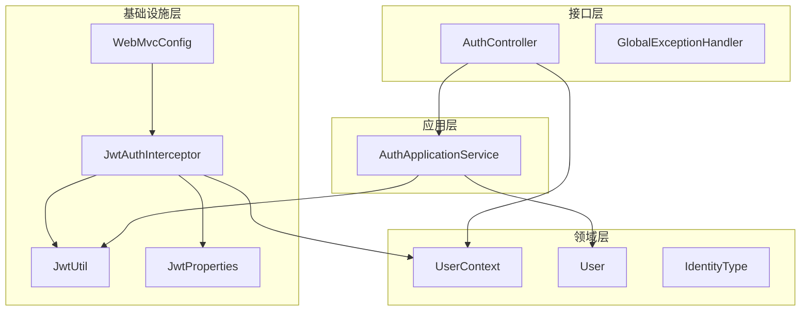
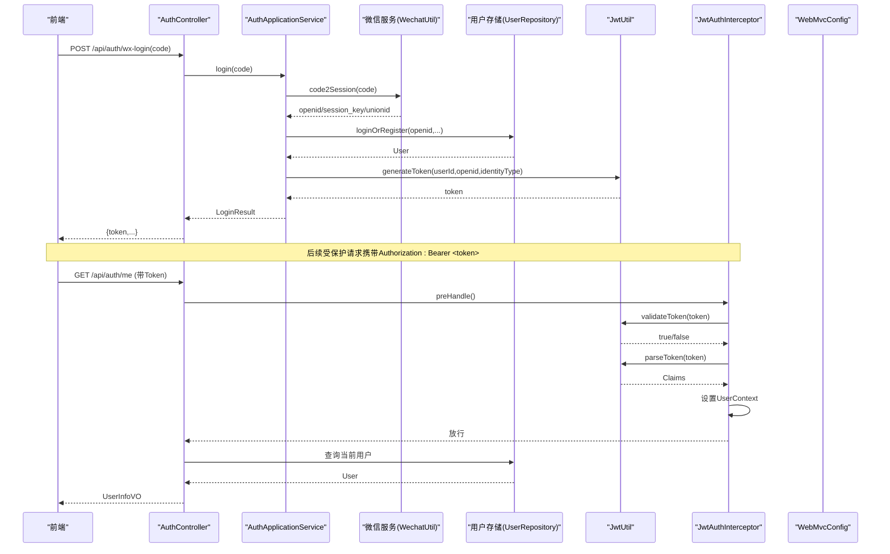
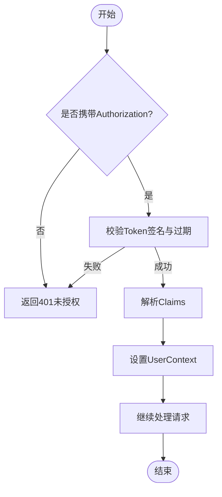
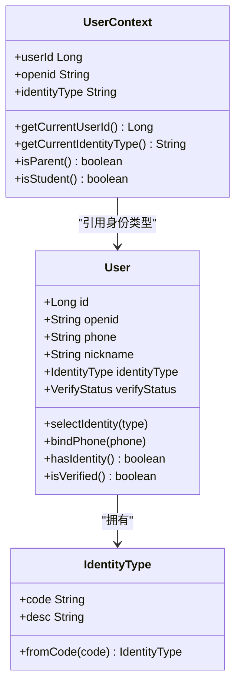
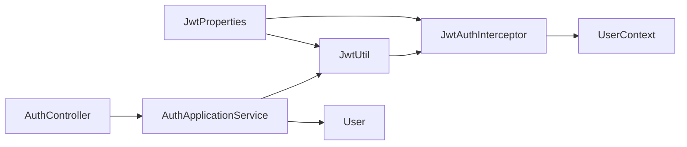

# 访问控制

<cite>
**本文引用的文件**
- [JwtProperties.java](file://wzoto-backend/wzoto-infrastructure/src/main/java/com/wzoto/infrastructure/config/JwtProperties.java)
- [JwtAuthInterceptor.java](file://wzoto-backend/wzoto-infrastructure/src/main/java/com/wzoto/infrastructure/interceptor/JwtAuthInterceptor.java)
- [JwtUtil.java](file://wzoto-backend/wzoto-infrastructure/src/main/java/com/wzoto/infrastructure/util/JwtUtil.java)
- [WebMvcConfig.java](file://wzoto-backend/wzoto-infrastructure/src/main/java/com/wzoto/infrastructure/config/WebMvcConfig.java)
- [AuthApplicationService.java](file://wzoto-backend/wzoto-application/src/main/java/com/wzoto/application/service/AuthApplicationService.java)
- [AuthController.java](file://wzoto-backend/wzoto-interfaces/src/main/java/com/wzoto/interfaces/controller/AuthController.java)
- [UserContext.java](file://wzoto-backend/wzoto-domain/src/main/java/com/wzoto/domain/context/UserContext.java)
- [User.java](file://wzoto-backend/wzoto-domain/src/main/java/com/wzoto/domain/entity/User.java)
- [IdentityType.java](file://wzoto-backend/wzoto-domain/src/main/java/com/wzoto/domain/valobj/IdentityType.java)
- [GlobalExceptionHandler.java](file://wzoto-backend/wzoto-interfaces/src/main/java/com/wzoto/interfaces/common/GlobalExceptionHandler.java)
- [t_user.sql](file://wzoto-backend/sql/t_user.sql)
</cite>

## 目录
1. [简介](#简介)
2. [项目结构](#项目结构)
3. [核心组件](#核心组件)
4. [架构总览](#架构总览)
5. [详细组件分析](#详细组件分析)
6. [依赖关系分析](#依赖关系分析)
7. [性能考虑](#性能考虑)
8. [故障排查指南](#故障排查指南)
9. [结论](#结论)
10. [附录](#附录)

## 简介
本指南围绕当前代码库中的访问控制机制，系统化说明身份认证流程（JWT令牌验证、会话管理、多端登录控制）、权限管理（角色/身份模型、接口级与数据级权限控制）、访问控制策略（IP白名单、用户行为分析、异常访问检测）、访问审计（登录记录、操作日志、权限变更审计），以及最佳实践与监控告警建议。内容基于仓库中现有实现进行梳理，并给出可落地的扩展方案。

## 项目结构
后端采用分层架构：
- 接口层（interfaces）：控制器、统一响应、全局异常处理
- 应用层（application）：编排业务用例（如微信登录、选择身份、绑定手机号）
- 领域层（domain）：实体、值对象、上下文、领域服务
- 基础设施层（infrastructure）：配置、拦截器、工具类、持久化映射

**图表来源**
- [AuthController.java:1-149](file://wzoto-backend/wzoto-interfaces/src/main/java/com/wzoto/interfaces/controller/AuthController.java#L1-L149)
- [AuthApplicationService.java:1-119](file://wzoto-backend/wzoto-application/src/main/java/com/wzoto/application/service/AuthApplicationService.java#L1-L119)
- [UserContext.java:1-56](file://wzoto-backend/wzoto-domain/src/main/java/com/wzoto/domain/context/UserContext.java#L1-L56)
- [User.java:1-93](file://wzoto-backend/wzoto-domain/src/main/java/com/wzoto/domain/entity/User.java#L1-L93)
- [IdentityType.java:1-31](file://wzoto-backend/wzoto-domain/src/main/java/com/wzoto/domain/valobj/IdentityType.java#L1-L31)
- [WebMvcConfig.java:1-42](file://wzoto-backend/wzoto-infrastructure/src/main/java/com/wzoto/infrastructure/config/WebMvcConfig.java#L1-L42)
- [JwtAuthInterceptor.java:1-65](file://wzoto-backend/wzoto-infrastructure/src/main/java/com/wzoto/infrastructure/interceptor/JwtAuthInterceptor.java#L1-L65)
- [JwtUtil.java:1-81](file://wzoto-backend/wzoto-infrastructure/src/main/java/com/wzoto/infrastructure/util/JwtUtil.java#L1-L81)
- [JwtProperties.java:1-26](file://wzoto-backend/wzoto-infrastructure/src/main/java/com/wzoto/infrastructure/config/JwtProperties.java#L1-L26)

**章节来源**
- [WebMvcConfig.java:1-42](file://wzoto-backend/wzoto-infrastructure/src/main/java/com/wzoto/infrastructure/config/WebMvcConfig.java#L1-L42)
- [JwtAuthInterceptor.java:1-65](file://wzoto-backend/wzoto-infrastructure/src/main/java/com/wzoto/infrastructure/interceptor/JwtAuthInterceptor.java#L1-L65)
- [JwtUtil.java:1-81](file://wzoto-backend/wzoto-infrastructure/src/main/java/com/wzoto/infrastructure/util/JwtUtil.java#L1-L81)
- [AuthController.java:1-149](file://wzoto-backend/wzoto-interfaces/src/main/java/com/wzoto/interfaces/controller/AuthController.java#L1-L149)
- [AuthApplicationService.java:1-119](file://wzoto-backend/wzoto-application/src/main/java/com/wzoto/application/service/AuthApplicationService.java#L1-L119)

## 核心组件
- JWT配置与工具：提供密钥、过期时间、Header前缀等配置；负责生成、解析、校验Token。
- Web MVC配置：注册JWT拦截器，排除公开路径，开启CORS。
- JWT拦截器：从请求头提取Token，校验有效性，将用户信息注入ThreadLocal上下文。
- 认证应用服务：编排微信登录、选择身份、绑定手机号，并生成/刷新Token。
- 认证控制器：暴露登录、获取当前用户、选择身份、绑定手机号等接口。
- 用户上下文：线程内保存当前用户ID、openid、身份类型，供后续鉴权使用。
- 用户实体与身份值对象：承载用户基本信息与身份类型枚举，包含身份不可随意切换的业务规则。

**章节来源**
- [JwtProperties.java:1-26](file://wzoto-backend/wzoto-infrastructure/src/main/java/com/wzoto/infrastructure/config/JwtProperties.java#L1-L26)
- [JwtUtil.java:1-81](file://wzoto-backend/wzoto-infrastructure/src/main/java/com/wzoto/infrastructure/util/JwtUtil.java#L1-L81)
- [WebMvcConfig.java:1-42](file://wzoto-backend/wzoto-infrastructure/src/main/java/com/wzoto/infrastructure/config/WebMvcConfig.java#L1-L42)
- [JwtAuthInterceptor.java:1-65](file://wzoto-backend/wzoto-infrastructure/src/main/java/com/wzoto/infrastructure/interceptor/JwtAuthInterceptor.java#L1-L65)
- [AuthApplicationService.java:1-119](file://wzoto-backend/wzoto-application/src/main/java/com/wzoto/application/service/AuthApplicationService.java#L1-L119)
- [AuthController.java:1-149](file://wzoto-backend/wzoto-interfaces/src/main/java/com/wzoto/interfaces/controller/AuthController.java#L1-L149)
- [UserContext.java:1-56](file://wzoto-backend/wzoto-domain/src/main/java/com/wzoto/domain/context/UserContext.java#L1-L56)
- [User.java:1-93](file://wzoto-backend/wzoto-domain/src/main/java/com/wzoto/domain/entity/User.java#L1-L93)
- [IdentityType.java:1-31](file://wzoto-backend/wzoto-domain/src/main/java/com/wzoto/domain/valobj/IdentityType.java#L1-L31)

## 架构总览
下图展示了从前端发起请求到后端完成认证与鉴权的完整链路，包括登录、拦截器校验、上下文注入与返回结果。

**图表来源**
- [AuthController.java:65-100](file://wzoto-backend/wzoto-interfaces/src/main/java/com/wzoto/interfaces/controller/AuthController.java#L65-L100)
- [AuthApplicationService.java:26-79](file://wzoto-backend/wzoto-application/src/main/java/com/wzoto/application/service/AuthApplicationService.java#L26-L79)
- [JwtAuthInterceptor.java:27-59](file://wzoto-backend/wzoto-infrastructure/src/main/java/com/wzoto/infrastructure/interceptor/JwtAuthInterceptor.java#L27-L59)
- [JwtUtil.java:27-81](file://wzoto-backend/wzoto-infrastructure/src/main/java/com/wzoto/infrastructure/util/JwtUtil.java#L27-L81)
- [WebMvcConfig.java:21-31](file://wzoto-backend/wzoto-infrastructure/src/main/java/com/wzoto/infrastructure/config/WebMvcConfig.java#L21-L31)

## 详细组件分析

### 身份认证流程（JWT与会话）
- 登录流程：
  - 前端调用微信登录接口，后端通过WechatUtil换取openid等信息，调用领域服务完成登录或注册，随后生成JWT并返回。
  - 选择身份后重新生成Token，确保身份变更生效。
- 令牌验证：
  - 所有/api/**请求由拦截器校验Authorization头，缺失或无效直接返回401。
  - 解析成功后将userId、openid、identityType注入UserContext，供后续业务使用。
- 会话管理：
  - 无状态会话：服务端不维护在线会话，仅依赖JWT有效期控制。
  - 多端登录控制：当前未实现设备/会话隔离，同一账号可在多端同时持有有效Token。可通过黑名单/撤销机制扩展。

**图表来源**
- [JwtAuthInterceptor.java:27-59](file://wzoto-backend/wzoto-infrastructure/src/main/java/com/wzoto/infrastructure/interceptor/JwtAuthInterceptor.java#L27-L59)
- [JwtUtil.java:72-81](file://wzoto-backend/wzoto-infrastructure/src/main/java/com/wzoto/infrastructure/util/JwtUtil.java#L72-L81)

**章节来源**
- [AuthController.java:65-100](file://wzoto-backend/wzoto-interfaces/src/main/java/com/wzoto/interfaces/controller/AuthController.java#L65-L100)
- [AuthApplicationService.java:26-79](file://wzoto-backend/wzoto-application/src/main/java/com/wzoto/application/service/AuthApplicationService.java#L26-L79)
- [JwtAuthInterceptor.java:27-59](file://wzoto-backend/wzoto-infrastructure/src/main/java/com/wzoto/infrastructure/interceptor/JwtAuthInterceptor.java#L27-L59)
- [JwtUtil.java:27-81](file://wzoto-backend/wzoto-infrastructure/src/main/java/com/wzoto/infrastructure/util/JwtUtil.java#L27-L81)

### 权限管理（角色/身份、接口级、数据级）
- 角色/身份模型：
  - 使用IdentityType枚举表示身份（家长/学生），用户实体包含身份字段，且具备“一经选择不可随意切换”的领域规则。
- 接口级权限控制：
  - 当前通过拦截器实现“是否已登录”的粗粒度控制；尚未实现按身份/角色的细粒度方法级鉴权。
  - 可扩展点：在控制器或服务层增加基于UserContext.identityType的注解式鉴权（如@RequireParent/@RequireStudent）。
- 数据级权限控制：
  - 当前未实现数据范围过滤。建议在查询时依据UserContext.userId或identityType附加条件，或在仓储层封装安全查询方法。

**图表来源**
- [User.java:1-93](file://wzoto-backend/wzoto-domain/src/main/java/com/wzoto/domain/entity/User.java#L1-L93)
- [IdentityType.java:1-31](file://wzoto-backend/wzoto-domain/src/main/java/com/wzoto/domain/valobj/IdentityType.java#L1-L31)
- [UserContext.java:1-56](file://wzoto-backend/wzoto-domain/src/main/java/com/wzoto/domain/context/UserContext.java#L1-L56)

**章节来源**
- [User.java:63-85](file://wzoto-backend/wzoto-domain/src/main/java/com/wzoto/domain/entity/User.java#L63-L85)
- [IdentityType.java:10-29](file://wzoto-backend/wzoto-domain/src/main/java/com/wzoto/domain/valobj/IdentityType.java#L10-L29)
- [UserContext.java:39-55](file://wzoto-backend/wzoto-domain/src/main/java/com/wzoto/domain/context/UserContext.java#L39-L55)

### 访问控制策略（IP白名单、行为分析、异常检测）
- IP白名单：
  - 当前未实现。可在WebMvcConfig中新增拦截器，对指定路径进行来源IP校验，拒绝非白名单访问。
- 用户行为分析：
  - 当前未实现。可在登录、敏感操作处埋点，统计频次、地域、设备等维度，用于风控。
- 异常访问检测：
  - 结合全局异常处理器记录异常信息与堆栈，配合阈值策略触发告警（如短时间内大量401/403）。

**章节来源**
- [WebMvcConfig.java:21-31](file://wzoto-backend/wzoto-infrastructure/src/main/java/com/wzoto/infrastructure/config/WebMvcConfig.java#L21-L31)
- [GlobalExceptionHandler.java:18-66](file://wzoto-backend/wzoto-interfaces/src/main/java/com/wzoto/interfaces/common/GlobalExceptionHandler.java#L18-L66)

### 访问审计（登录记录、操作日志、权限变更）
- 登录记录审计：
  - 当前未持久化登录日志。建议在登录成功/失败时写入审计表（用户ID、时间、IP、设备、结果）。
- 操作日志追踪：
  - 可在关键写操作前后记录操作人、资源、动作、结果，便于追溯。
- 权限变更审计：
  - 当用户身份或认证状态变更时，记录变更前后的值与操作者，满足合规要求。

[本节为扩展建议，不直接分析具体文件]

### 最佳实践
- 最小权限原则：
  - 默认拒绝，按需授予；接口与服务层按身份/角色做最小可用权限控制。
- 权限分离：
  - 认证（你是谁）与授权（你能做什么）解耦；鉴权逻辑集中在拦截器/注解处理器中。
- 定期权限审查：
  - 定期导出用户身份与权限清单，清理冗余与过期权限。

[本节为通用指导，不直接分析具体文件]

### 监控与告警
- 指标采集：
  - 登录成功率、Token校验失败率、401/403占比、异常率。
- 告警规则：
  - 单位时间内401激增、异常错误率突增、登录失败集中来自同一IP等。
- 可视化：
  - 将指标接入监控系统，绘制趋势图与看板，辅助快速定位问题。

[本节为通用指导，不直接分析具体文件]

## 依赖关系分析
- 配置依赖：JwtProperties提供密钥与过期时间，被JwtUtil与拦截器使用。
- 拦截器依赖：JwtAuthInterceptor依赖JwtUtil与JwtProperties，并将用户信息注入UserContext。
- 控制器依赖：AuthController依赖应用服务与用户仓储，对外暴露认证相关接口。
- 应用服务依赖：AuthApplicationService编排微信服务、领域服务与JWT工具。
- 领域依赖：User与IdentityType定义身份与规则；UserContext提供线程级上下文。

**图表来源**
- [JwtProperties.java:1-26](file://wzoto-backend/wzoto-infrastructure/src/main/java/com/wzoto/infrastructure/config/JwtProperties.java#L1-L26)
- [JwtUtil.java:1-81](file://wzoto-backend/wzoto-infrastructure/src/main/java/com/wzoto/infrastructure/util/JwtUtil.java#L1-L81)
- [JwtAuthInterceptor.java:1-65](file://wzoto-backend/wzoto-infrastructure/src/main/java/com/wzoto/infrastructure/interceptor/JwtAuthInterceptor.java#L1-L65)
- [AuthController.java:1-149](file://wzoto-backend/wzoto-interfaces/src/main/java/com/wzoto/interfaces/controller/AuthController.java#L1-L149)
- [AuthApplicationService.java:1-119](file://wzoto-backend/wzoto-application/src/main/java/com/wzoto/application/service/AuthApplicationService.java#L1-L119)
- [User.java:1-93](file://wzoto-backend/wzoto-domain/src/main/java/com/wzoto/domain/entity/User.java#L1-L93)
- [UserContext.java:1-56](file://wzoto-backend/wzoto-domain/src/main/java/com/wzoto/domain/context/UserContext.java#L1-L56)

**章节来源**
- [WebMvcConfig.java:21-31](file://wzoto-backend/wzoto-infrastructure/src/main/java/com/wzoto/infrastructure/config/WebMvcConfig.java#L21-L31)
- [JwtAuthInterceptor.java:27-59](file://wzoto-backend/wzoto-infrastructure/src/main/java/com/wzoto/infrastructure/interceptor/JwtAuthInterceptor.java#L27-L59)
- [AuthApplicationService.java:26-79](file://wzoto-backend/wzoto-application/src/main/java/com/wzoto/application/service/AuthApplicationService.java#L26-L79)

## 性能考虑
- Token解析开销：每次请求均解析JWT，建议合理设置过期时间与缓存策略（如短期本地缓存用户信息）。
- 数据库查询：登录流程涉及微信接口与用户查询，需关注超时与重试策略。
- 拦截器链：避免在拦截器中进行重IO操作，保持轻量校验。

[本节为通用指导，不直接分析具体文件]

## 故障排查指南
- 401未授权：
  - 检查Authorization头格式是否正确（Bearer前缀）、Token是否过期或签名无效。
- 参数校验失败：
  - 查看全局异常处理器返回的错误信息，定位具体字段。
- 业务规则违反：
  - 例如身份不可随意切换，会抛出非法状态异常，需检查用户当前身份状态。

**章节来源**
- [JwtAuthInterceptor.java:34-46](file://wzoto-backend/wzoto-infrastructure/src/main/java/com/wzoto/infrastructure/interceptor/JwtAuthInterceptor.java#L34-L46)
- [GlobalExceptionHandler.java:18-66](file://wzoto-backend/wzoto-interfaces/src/main/java/com/wzoto/interfaces/common/GlobalExceptionHandler.java#L18-L66)
- [User.java:63-71](file://wzoto-backend/wzoto-domain/src/main/java/com/wzoto/domain/entity/User.java#L63-L71)

## 结论
当前系统实现了基于JWT的无状态认证与基础拦截器鉴权，具备清晰的登录流程与上下文传递能力。权限控制尚处于粗粒度阶段，建议逐步引入接口级与数据级细粒度鉴权，并完善IP白名单、行为分析与异常检测等访问控制策略。同时补充登录与操作审计、权限变更审计，建立完善的监控与告警体系，以满足生产环境的安全与合规需求。

## 附录
- 用户表结构要点：
  - 包含openid、unionid、phone、nickname、avatar、identity_type、verify_status、real_name等字段，支持按身份与认证状态索引。

**章节来源**
- [t_user.sql:7-26](file://wzoto-backend/sql/t_user.sql#L7-L26)