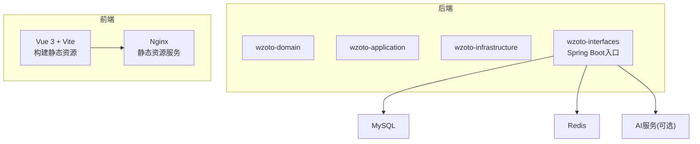
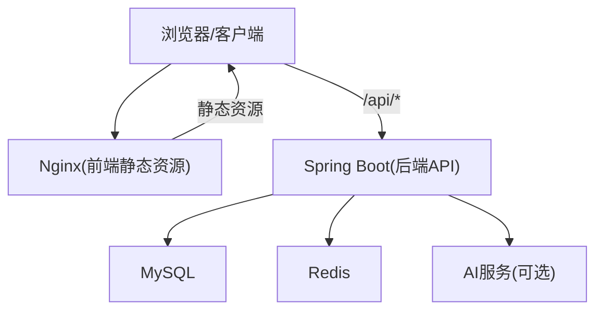
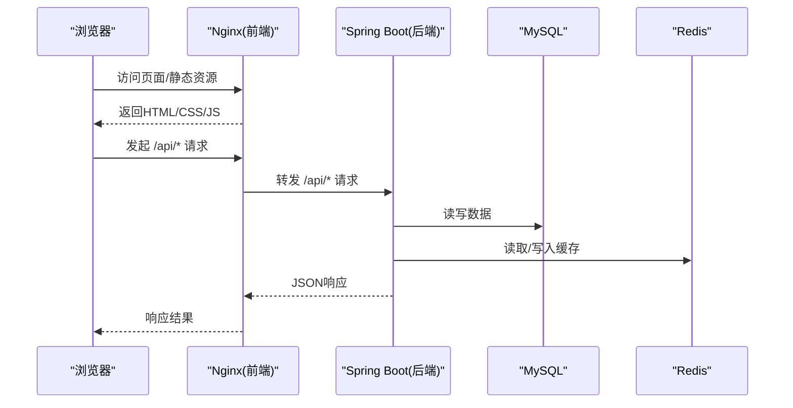
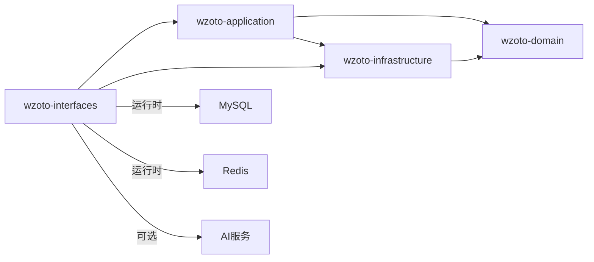

# Docker容器化

<cite>
**本文引用的文件**
- [wzoto-backend/pom.xml](file://wzoto-backend/pom.xml)
- [wzoto-backend/wzoto-interfaces/pom.xml](file://wzoto-backend/wzoto-interfaces/pom.xml)
- [wzoto-backend/wzoto-interfaces/src/main/resources/application.yml](file://wzoto-backend/wzoto-interfaces/src/main/resources/application.yml)
- [wzoto-frontend/package.json](file://wzoto-frontend/package.json)
- [wzoto-frontend/vite.config.js](file://wzoto-frontend/vite.config.js)
</cite>

## 目录
1. [简介](#简介)
2. [项目结构](#项目结构)
3. [核心组件](#核心组件)
4. [架构总览](#架构总览)
5. [详细组件分析](#详细组件分析)
6. [依赖关系分析](#依赖关系分析)
7. [性能考虑](#性能考虑)
8. [故障排查指南](#故障排查指南)
9. [结论](#结论)
10. [附录](#附录)

## 简介
本文件面向“学霸到家”前后端工程，提供完整的Docker容器化实施方案。内容涵盖：
- 后端Java应用（Spring Boot）的Dockerfile编写要点：JDK版本选择、Maven构建优化、多阶段构建实现。
- 前端应用（Vue + Vite）的镜像构建方案：Node.js环境配置、Vite构建优化、Nginx静态资源服务。
- Docker Compose编排：服务依赖、网络、卷挂载、环境变量注入。
- 容器启动脚本与常用运维命令。
- 性能优化技巧：镜像层缓存、构建并行化、资源限制等。

## 项目结构
本项目采用前后端分离架构：
- 后端为Spring Boot多模块工程，包含domain、application、infrastructure、interfaces四个子模块，打包产物由interfaces模块生成可执行JAR。
- 前端基于Vue 3 + Vite，通过vite build产出静态资源，最终由Nginx提供服务。

**图表来源**
- [wzoto-backend/pom.xml:21-26](file://wzoto-backend/pom.xml#L21-L26)
- [wzoto-backend/wzoto-interfaces/pom.xml:16-41](file://wzoto-backend/wzoto-interfaces/pom.xml#L16-L41)
- [wzoto-frontend/package.json:1-27](file://wzoto-frontend/package.json#L1-L27)
- [wzoto-frontend/vite.config.js:1-21](file://wzoto-frontend/vite.config.js#L1-L21)

**章节来源**
- [wzoto-backend/pom.xml:1-126](file://wzoto-backend/pom.xml#L1-L126)
- [wzoto-backend/wzoto-interfaces/pom.xml:1-60](file://wzoto-backend/wzoto-interfaces/pom.xml#L1-L60)
- [wzoto-frontend/package.json:1-27](file://wzoto-frontend/package.json#L1-L27)
- [wzoto-frontend/vite.config.js:1-21](file://wzoto-frontend/vite.config.js#L1-L21)

## 核心组件
- 后端运行环境：JDK 21（由父POM属性指定），Spring Boot 3.2.5，MyBatis-Plus、Hutool、JWT等依赖。
- 前端构建环境：Node.js（建议18/20 LTS），Vite 8.x，Vue 3生态。
- 运行时依赖：MySQL、Redis、可选AI服务（OpenAI兼容API）。

**章节来源**
- [wzoto-backend/pom.xml:28-37](file://wzoto-backend/pom.xml#L28-L37)
- [wzoto-backend/wzoto-interfaces/pom.xml:26-41](file://wzoto-backend/wzoto-interfaces/pom.xml#L26-L41)
- [wzoto-frontend/package.json:11-25](file://wzoto-frontend/package.json#L11-L25)

## 架构总览
下图展示了容器化后的服务拓扑与数据流向：

**图表来源**
- [wzoto-backend/wzoto-interfaces/src/main/resources/application.yml:6-17](file://wzoto-backend/wzoto-interfaces/src/main/resources/application.yml#L6-L17)
- [wzoto-frontend/vite.config.js:12-19](file://wzoto-frontend/vite.config.js#L12-L19)

## 详细组件分析

### 后端Java应用：Dockerfile编写与多阶段构建
- JDK版本选择
  - 使用JDK 21作为基础镜像，与项目源码编译目标一致，避免运行时不兼容。
- Maven构建优化
  - 利用多阶段构建：第一阶段安装Maven并下载依赖，第二阶段仅拷贝已编译的JAR运行，显著减小镜像体积。
  - 在构建阶段启用Maven本地仓库缓存（/root/.m2/repository），提升重复构建速度。
  - 使用spring-boot-maven-plugin打包可执行JAR，排除lombok等仅编译期依赖。
- 运行阶段
  - 以非root用户运行，提高安全性。
  - 通过环境变量注入数据库、Redis、AI等配置，便于不同环境切换。
  - 暴露端口8080，配合反向代理或Compose网络对外暴露。

参考路径（用于定位具体配置与插件）：
- 后端POM与打包插件：[wzoto-backend/pom.xml:106-124](file://wzoto-backend/pom.xml#L106-L124)、[wzoto-backend/wzoto-interfaces/pom.xml:43-58](file://wzoto-backend/wzoto-interfaces/pom.xml#L43-L58)
- 运行时配置与环境变量：[wzoto-backend/wzoto-interfaces/src/main/resources/application.yml:6-17](file://wzoto-backend/wzoto-interfaces/src/main/resources/application.yml#L6-L17)

**章节来源**
- [wzoto-backend/pom.xml:28-37](file://wzoto-backend/pom.xml#L28-L37)
- [wzoto-backend/wzoto-interfaces/pom.xml:43-58](file://wzoto-backend/wzoto-interfaces/pom.xml#L43-L58)
- [wzoto-backend/wzoto-interfaces/src/main/resources/application.yml:6-17](file://wzoto-backend/wzoto-interfaces/src/main/resources/application.yml#L6-L17)

### 前端应用：Node.js环境、Vite构建与Nginx服务
- Node.js环境配置
  - 建议使用Node.js LTS（如18或20），与Vite 8.x兼容性好。
  - 使用pnpm或npm进行依赖安装，结合缓存目录加速构建。
- Vite构建优化
  - 使用生产模式构建，输出到dist目录。
  - 通过别名与按需引入减少包体积；合理拆分chunk，利于浏览器缓存。
  - 开发时可通过vite.config.js中的proxy将/api请求转发至后端，便于联调。
- Nginx静态资源服务
  - 将dist目录映射到Nginx的静态根目录，设置合适的缓存头与Gzip/Brotli压缩。
  - 将/api请求反向代理到后端服务，统一入口。

参考路径：
- 前端脚本与依赖：[wzoto-frontend/package.json:6-25](file://wzoto-frontend/package.json#L6-L25)
- Vite配置与代理：[wzoto-frontend/vite.config.js:1-21](file://wzoto-frontend/vite.config.js#L1-L21)

**章节来源**
- [wzoto-frontend/package.json:6-25](file://wzoto-frontend/package.json#L6-L25)
- [wzoto-frontend/vite.config.js:12-19](file://wzoto-frontend/vite.config.js#L12-L19)

### Docker Compose编排：服务依赖、网络、卷、环境变量
- 服务定义
  - backend：基于Spring Boot JAR，依赖MySQL与Redis，暴露8080端口。
  - frontend：基于Nginx，提供静态资源并将/api反向代理到backend。
  - mysql、redis：持久化数据卷，确保数据不丢失。
- 网络配置
  - 使用默认bridge网络，服务间通过服务名通信。
- 卷挂载
  - MySQL数据目录、Redis数据目录挂载到宿主机，便于备份与迁移。
- 环境变量注入
  - 通过.env文件或compose中直接注入数据库、Redis、AI等配置项，支持多环境差异化。

**图表来源**
- [wzoto-backend/wzoto-interfaces/src/main/resources/application.yml:6-17](file://wzoto-backend/wzoto-interfaces/src/main/resources/application.yml#L6-L17)
- [wzoto-frontend/vite.config.js:12-19](file://wzoto-frontend/vite.config.js#L12-L19)

**章节来源**
- [wzoto-backend/wzoto-interfaces/src/main/resources/application.yml:6-17](file://wzoto-backend/wzoto-interfaces/src/main/resources/application.yml#L6-L17)

### 容器启动脚本与运维命令
- 常用命令
  - 构建并启动所有服务：docker compose up --build
  - 后台启动：docker compose up -d
  - 查看日志：docker compose logs -f backend/frontend/mysql/redis
  - 停止服务：docker compose down
  - 重启服务：docker compose restart backend
  - 清理未使用的镜像与卷：docker system prune -a, docker volume prune
- 健康检查与自启动
  - 为关键服务添加healthcheck，确保依赖就绪后再启动依赖方。
  - 设置restart策略，保证服务异常后自动恢复。

**章节来源**
- [wzoto-backend/wzoto-interfaces/src/main/resources/application.yml:6-17](file://wzoto-backend/wzoto-interfaces/src/main/resources/application.yml#L6-L17)

## 依赖关系分析
- 后端模块依赖
  - interfaces依赖application与infrastructure，application依赖domain与infrastructure，形成分层解耦。
- 运行时外部依赖
  - MySQL：数据库连接信息通过环境变量注入。
  - Redis：缓存与会话存储，连接信息通过环境变量注入。
  - AI服务：可选，通过环境变量开关与参数控制。

**图表来源**
- [wzoto-backend/pom.xml:21-26](file://wzoto-backend/pom.xml#L21-L26)
- [wzoto-backend/wzoto-interfaces/pom.xml:16-41](file://wzoto-backend/wzoto-interfaces/pom.xml#L16-L41)
- [wzoto-backend/wzoto-interfaces/src/main/resources/application.yml:6-17](file://wzoto-backend/wzoto-interfaces/src/main/resources/application.yml#L6-L17)

**章节来源**
- [wzoto-backend/pom.xml:21-26](file://wzoto-backend/pom.xml#L21-L26)
- [wzoto-backend/wzoto-interfaces/pom.xml:16-41](file://wzoto-backend/wzoto-interfaces/pom.xml#L16-L41)
- [wzoto-backend/wzoto-interfaces/src/main/resources/application.yml:6-17](file://wzoto-backend/wzoto-interfaces/src/main/resources/application.yml#L6-L17)

## 性能考虑
- 镜像层缓存
  - 后端：先复制pom.xml并执行依赖下载，再复制源码，最大化利用Docker层缓存。
  - 前端：先复制package.json并安装依赖，再复制源码构建，减少重复安装。
- 构建并行化
  - 后端：使用Maven多模块并行构建（-T选项）与离线模式（-o）减少网络开销。
  - 前端：使用并发构建与合理的分包策略，缩短构建时间。
- 资源限制
  - 为容器设置CPU与内存上限，防止单服务占用过多资源影响整体稳定性。
- 运行时优化
  - 后端：开启JIT预热、合理设置堆大小与GC参数。
  - 前端：启用Gzip/Brotli压缩，设置静态资源长期缓存头。

[本节为通用指导，不直接分析具体文件]

## 故障排查指南
- 数据库连接失败
  - 检查环境变量MYSQL_PASSWORD、REDIS_HOST、REDIS_PORT是否正确注入。
  - 确认MySQL与Redis服务已启动且网络可达。
- 端口冲突
  - 修改后端端口或Nginx端口，避免与宿主机或其他容器冲突。
- 构建失败
  - 检查Node.js与Maven版本是否与依赖兼容。
  - 清理缓存后重试：删除node_modules与~/.m2/repository后重新构建。
- 日志定位
  - 使用docker compose logs -f 查看各服务日志，重点关注错误堆栈与连接超时信息。

**章节来源**
- [wzoto-backend/wzoto-interfaces/src/main/resources/application.yml:6-17](file://wzoto-backend/wzoto-interfaces/src/main/resources/application.yml#L6-L17)

## 结论
通过多阶段构建、合理的镜像分层与环境变量管理，本方案实现了前后端应用的标准化容器化部署。结合Docker Compose，能够一键拉起完整的服务拓扑，满足开发与生产环境的快速交付需求。在生产环境中，建议进一步引入CI/CD流水线、镜像扫描与健康检查，以提升交付质量与系统稳定性。

[本节为总结性内容，不直接分析具体文件]

## 附录
- 环境变量清单（示例）
  - MYSQL_PASSWORD：数据库密码
  - REDIS_HOST/REDIS_PORT/REDIS_PASSWORD：Redis连接信息
  - JWT_SECRET、WECHAT_APP_ID/SECRET、AI相关参数：业务与安全配置
- 参考路径
  - 后端配置与环境变量：[wzoto-backend/wzoto-interfaces/src/main/resources/application.yml:6-17](file://wzoto-backend/wzoto-interfaces/src/main/resources/application.yml#L6-L17)
  - 前端代理配置：[wzoto-frontend/vite.config.js:12-19](file://wzoto-frontend/vite.config.js#L12-L19)

**章节来源**
- [wzoto-backend/wzoto-interfaces/src/main/resources/application.yml:6-17](file://wzoto-backend/wzoto-interfaces/src/main/resources/application.yml#L6-L17)
- [wzoto-frontend/vite.config.js:12-19](file://wzoto-frontend/vite.config.js#L12-L19)