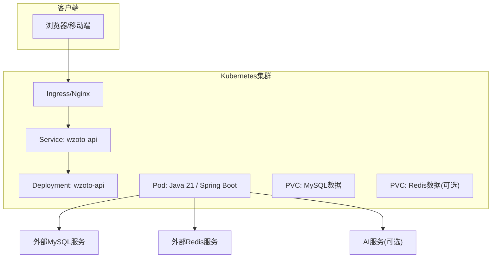
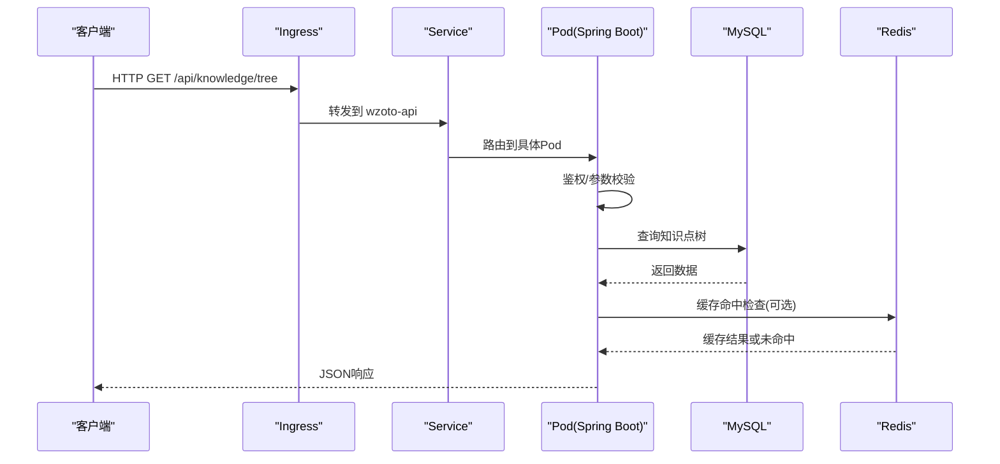
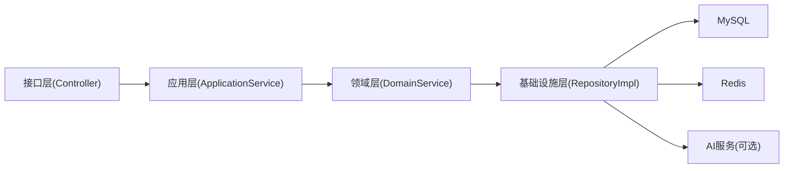

# Kubernetes编排

<cite>
**本文引用的文件**
- [application.yml](file://wzoto-backend/wzoto-interfaces/src/main/resources/application.yml)
- [pom.xml（后端聚合）](file://wzoto-backend/pom.xml)
- [KnowledgePointController.java](file://wzoto-backend/wzoto-interfaces/src/main/java/com/wzoto/interfaces/controller/KnowledgePointController.java)
- [KnowledgePointApplicationService.java](file://wzoto-backend/wzoto-application/src/main/java/com/wzoto/application/service/KnowledgePointApplicationService.java)
- [KnowledgePointRepositoryImpl.java](file://wzoto-backend/wzoto-infrastructure/src/main/java/com/wzoto/infrastructure/repository/KnowledgePointRepositoryImpl.java)
- [package.json（前端）](file://wzoto-frontend/package.json)
</cite>

## 目录
1. [简介](#简介)
2. [项目结构](#项目结构)
3. [核心组件](#核心组件)
4. [架构总览](#架构总览)
5. [详细组件分析](#详细组件分析)
6. [依赖关系分析](#依赖关系分析)
7. [性能与可伸缩性](#性能与可伸缩性)
8. [故障排查指南](#故障排查指南)
9. [结论](#结论)
10. [附录：Kubernetes部署清单模板](#附录kubernetes部署清单模板)

## 简介
本指南面向在Kubernetes上编排部署“学霸到家”前后端应用，覆盖资源清单设计（Deployment、Service、ConfigMap、Secret、Ingress）、滚动更新与回滚策略、负载均衡与服务暴露、Helm Chart封装、监控集成（Prometheus + Grafana）、存储卷与数据持久化方案，以及常见故障排查方法。文档结合仓库中的后端配置与接口定义，给出可直接落地的实践建议与模板路径引用。

## 项目结构
- 后端采用Spring Boot多模块工程，包含领域层、应用层、基础设施层与接口层；通过Maven聚合构建。
- 前端为Vue/Vite工程，提供静态资源构建产物用于Nginx或对象存储托管。
- 运行时依赖包括MySQL、Redis，可选AI服务（OpenAI兼容API）。

**图表来源**
- [application.yml:1-51](file://wzoto-backend/wzoto-interfaces/src/main/resources/application.yml#L1-L51)
- [pom.xml（后端聚合）:1-126](file://wzoto-backend/pom.xml#L1-L126)

**章节来源**
- [application.yml:1-51](file://wzoto-backend/wzoto-interfaces/src/main/resources/application.yml#L1-L51)
- [pom.xml（后端聚合）:1-126](file://wzoto-backend/pom.xml#L1-L126)

## 核心组件
- 后端接口层：REST控制器对外暴露API，如知识点树查询等。
- 应用层：编排业务用例，协调领域服务。
- 基础设施层：数据访问实现（MyBatis-Plus），对接MySQL；HTTP调用AI服务。
- 配置中心：application.yml集中管理数据库、Redis、JWT、微信、AI等配置项，敏感信息通过环境变量注入。

**章节来源**
- [KnowledgePointController.java:1-37](file://wzoto-backend/wzoto-interfaces/src/main/java/com/wzoto/interfaces/controller/KnowledgePointController.java#L1-L37)
- [KnowledgePointApplicationService.java:1-32](file://wzoto-backend/wzoto-application/src/main/java/com/wzoto/application/service/KnowledgePointApplicationService.java#L1-L32)
- [KnowledgePointRepositoryImpl.java:1-31](file://wzoto-backend/wzoto-infrastructure/src/main/java/com/wzoto/infrastructure/repository/KnowledgePointRepositoryImpl.java#L1-L31)
- [application.yml:1-51](file://wzoto-backend/wzoto-interfaces/src/main/resources/application.yml#L1-L51)

## 架构总览
从请求到响应的关键链路：
- Ingress将域名流量转发至Service。
- Service以ClusterIP形式将请求路由到后端Deployment的Pod。
- Pod内Spring Boot应用读取application.yml与环境变量，连接MySQL与Redis，必要时调用AI服务。
- 前端静态资源由Nginx或对象存储直接提供服务，并通过反向代理指向后端API。

**图表来源**
- [KnowledgePointController.java:21-26](file://wzoto-backend/wzoto-interfaces/src/main/java/com/wzoto/interfaces/controller/KnowledgePointController.java#L21-L26)
- [KnowledgePointApplicationService.java:20-23](file://wzoto-backend/wzoto-application/src/main/java/com/wzoto/application/service/KnowledgePointApplicationService.java#L20-L23)
- [KnowledgePointRepositoryImpl.java:23-31](file://wzoto-backend/wzoto-infrastructure/src/main/java/com/wzoto/infrastructure/repository/KnowledgePointRepositoryImpl.java#L23-L31)
- [application.yml:6-17](file://wzoto-backend/wzoto-interfaces/src/main/resources/application.yml#L6-L17)

## 详细组件分析

### 后端服务编排要点
- 容器镜像：基于Java 21运行Spring Boot应用，端口默认8080。
- 健康检查：建议配置liveness/readiness探针，确保滚动更新安全。
- 资源限制：设置requests/limits避免资源争用。
- 配置注入：数据库、Redis、JWT、微信、AI等通过ConfigMap/Secret挂载或环境变量注入。

**章节来源**
- [application.yml:1-51](file://wzoto-backend/wzoto-interfaces/src/main/resources/application.yml#L1-L51)

### 前端静态资源编排要点
- 构建产物：Vite构建生成dist目录，使用Nginx镜像托管。
- 反向代理：Ingress将/api/*转发至后端，其余路径返回静态资源。
- 环境变量：可通过ConfigMap注入前端API地址等配置。

**章节来源**
- [package.json（前端）:1-27](file://wzoto-frontend/package.json#L1-L27)

### 滚动更新与回滚机制
- 滚动更新：Deployment默认使用RollingUpdate策略，逐步替换旧Pod，保证服务不中断。
- 回滚：当新版本异常时，使用回滚命令快速恢复到上一稳定版本。
- 最佳实践：
  - 设置合理的maxUnavailable/maxSurge，控制并发更新数量。
  - 启用就绪探针，确保新Pod完全就绪后再切换流量。
  - 发布前执行冒烟测试，失败自动中止。

[本节为通用实践说明，不直接分析具体代码文件]

### 负载均衡与服务暴露
- Service类型：
  - ClusterIP：仅集群内部访问，适合后端服务。
  - NodePort：便于本地调试，不建议生产直接使用。
  - LoadBalancer：云厂商LB，适合对外暴露。
- Ingress：统一入口，支持TLS终止、域名路由、路径重写。
- 水平扩展：根据CPU/内存或自定义指标HPA自动扩缩容。

[本节为通用实践说明，不直接分析具体代码文件]

### Helm Chart封装
- 模板化：将Deployment、Service、ConfigMap、Secret、Ingress等抽象为Chart模板，通过values.yaml区分环境。
- 版本管理：Chart版本与镜像标签配合Git Tag进行版本控制。
- 依赖管理：使用Chart.yaml声明子Chart（如MySQL、Redis、Nginx Ingress Controller）。
- 发布流程：CI/CD流水线中构建镜像、打包Chart并推送至仓库，再安装/升级至目标集群。

[本节为通用实践说明，不直接分析具体代码文件]

### 监控集成（Prometheus + Grafana）
- 指标采集：
  - JVM指标：Micrometer + Prometheus暴露端点。
  - 应用指标：自定义业务指标上报。
  - 节点/容器指标：kube-state-metrics + cAdvisor。
- 可视化：Grafana导入JVM与应用仪表盘。
- 告警：Alertmanager配置阈值与通知渠道。

[本节为通用实践说明，不直接分析具体代码文件]

### 存储卷与数据持久化
- MySQL：使用StatefulSet或外部托管数据库，通过PVC持久化数据目录。
- Redis：可使用StatefulSet+PVC或托管服务；注意数据备份策略。
- 日志：应用日志输出到stdout/stderr，由日志收集器（如Fluent Bit）采集。
- 配置与密钥：ConfigMap存放非敏感配置，Secret存放敏感信息。

[本节为通用实践说明，不直接分析具体代码文件]

## 依赖关系分析
- 后端模块依赖：
  - 接口层依赖应用层与领域层。
  - 应用层依赖领域层。
  - 基础设施层实现数据访问与外部调用。
- 运行时依赖：
  - MySQL：数据库连接由application.yml配置。
  - Redis：缓存与会话存储。
  - AI服务：可选，通过环境变量开关与基址配置。

**图表来源**
- [KnowledgePointController.java:1-37](file://wzoto-backend/wzoto-interfaces/src/main/java/com/wzoto/interfaces/controller/KnowledgePointController.java#L1-L37)
- [KnowledgePointApplicationService.java:1-32](file://wzoto-backend/wzoto-application/src/main/java/com/wzoto/application/service/KnowledgePointApplicationService.java#L1-L32)
- [KnowledgePointRepositoryImpl.java:1-31](file://wzoto-backend/wzoto-infrastructure/src/main/java/com/wzoto/infrastructure/repository/KnowledgePointRepositoryImpl.java#L1-L31)
- [application.yml:6-17](file://wzoto-backend/wzoto-interfaces/src/main/resources/application.yml#L6-L17)

**章节来源**
- [pom.xml（后端聚合）:1-126](file://wzoto-backend/pom.xml#L1-L126)
- [application.yml:1-51](file://wzoto-backend/wzoto-interfaces/src/main/resources/application.yml#L1-L51)

## 性能与可伸缩性
- 水平扩展：根据QPS/CPU/内存设置HPA，结合Service负载均衡。
- 连接池：合理配置数据库与Redis连接池大小，避免连接耗尽。
- 缓存策略：热点数据优先走Redis，降低DB压力。
- 资源配额：为Pod设置requests/limits，保障调度与稳定性。
- 带宽与超时：Ingress与Service层调整超时与限流策略。

[本节为通用实践说明，不直接分析具体代码文件]

## 故障排查指南
- 启动失败：
  - 检查环境变量是否注入完整（数据库、Redis、JWT、微信、AI）。
  - 查看Pod事件与日志定位初始化错误。
- 无法连接数据库/Redis：
  - 验证网络策略、Endpoint可达性与凭据正确性。
  - 检查防火墙与安全组。
- API无响应：
  - 确认Ingress/Service路由规则与域名解析。
  - 检查后端健康检查与就绪探针状态。
- 性能问题：
  - 观察CPU/内存使用率与GC情况。
  - 分析慢查询与缓存命中率。
- 日志与指标：
  - 通过kubectl logs获取应用日志。
  - 通过Prometheus/Grafana查看指标与告警。

[本节为通用实践说明，不直接分析具体代码文件]

## 结论
通过对后端配置与接口结构的理解，可以设计出高可用、易维护的Kubernetes编排方案：以Deployment承载无状态后端，Service提供稳定访问入口，Ingress统一暴露；利用ConfigMap/Secret管理配置与密钥；借助滚动更新与回滚保障发布质量；通过Prometheus与Grafana实现可观测性；结合PVC与外部数据库/缓存实现数据持久化。按本文模板与实践建议落地，可显著提升交付效率与系统稳定性。

[本节为总结性内容，不直接分析具体代码文件]

## 附录：Kubernetes部署清单模板
以下为各资源的字段要点与示例路径，便于直接套用与二次定制：

- Deployment（后端）
  - replicas：初始副本数，结合HPA动态调整。
  - strategy：rollingUpdate，设置maxUnavailable/maxSurge。
  - containers：镜像、端口、环境变量、探针、资源限制。
  - volumes：挂载ConfigMap/Secret/PVC。
  - 参考：后端端口与上下文路径来自配置文件。
  
  **章节来源**
  - [application.yml:1-51](file://wzoto-backend/wzoto-interfaces/src/main/resources/application.yml#L1-L51)

- Service（后端）
  - type：ClusterIP（推荐）或LoadBalancer。
  - selector：匹配Deployment的Pod标签。
  - ports：映射容器端口。

- ConfigMap
  - 存放非敏感配置（如AI开关、模型名、温度等）。
  - 通过环境变量或文件卷挂载到Pod。

- Secret
  - 存放敏感信息（数据库密码、Redis密码、JWT密钥、微信AppID/Secret等）。
  - 通过环境变量或文件卷挂载到Pod。

- Ingress
  - 域名与路径规则：/api/*转发至后端Service，其余返回前端静态资源。
  - TLS：配置证书以实现HTTPS。
  - 注解：根据所用Ingress Controller设置超时、限流、重定向等。

- 前端静态资源
  - Nginx镜像托管dist目录。
  - 通过Ingress将根路径指向Nginx服务。

- 存储卷与持久化
  - MySQL：使用PVC挂载数据目录或使用托管数据库。
  - Redis：使用PVC或托管服务，开启定期快照与备份。

- 监控与日志
  - 接入Prometheus抓取JVM与应用指标。
  - 接入Grafana展示仪表盘。
  - 日志采集：stdout/stderr + 日志收集器。

[本节为模板指引，不直接分析具体代码文件]