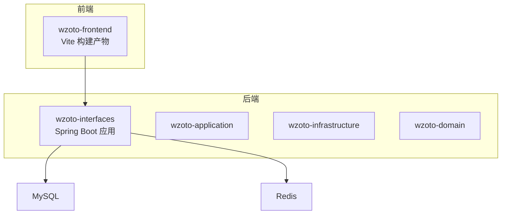
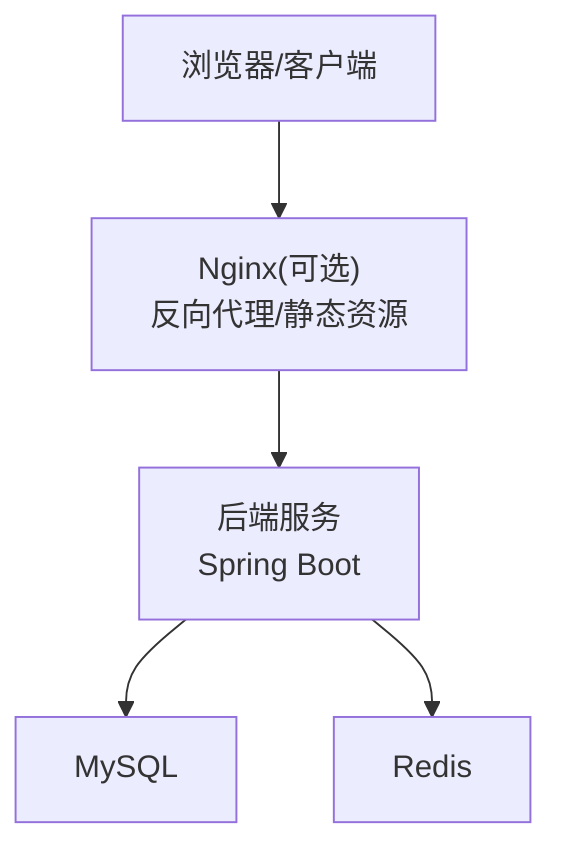
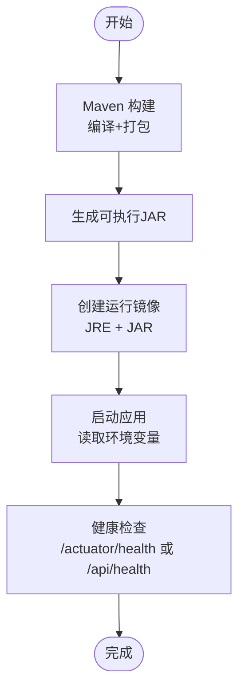
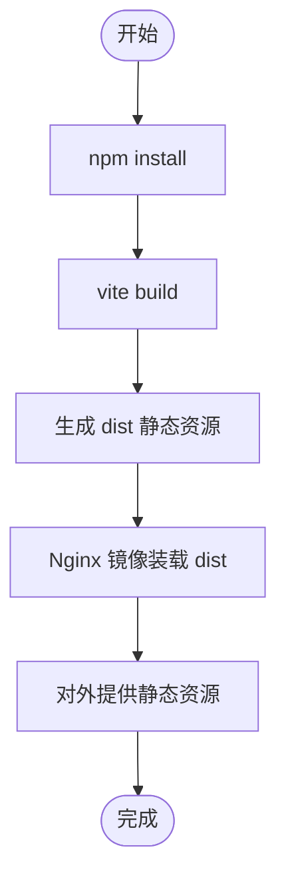
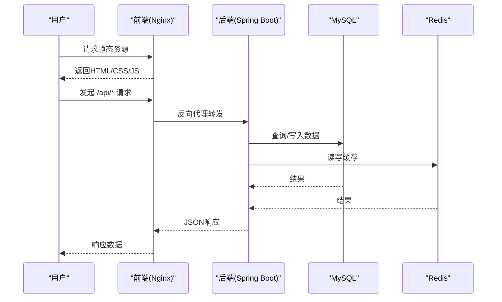
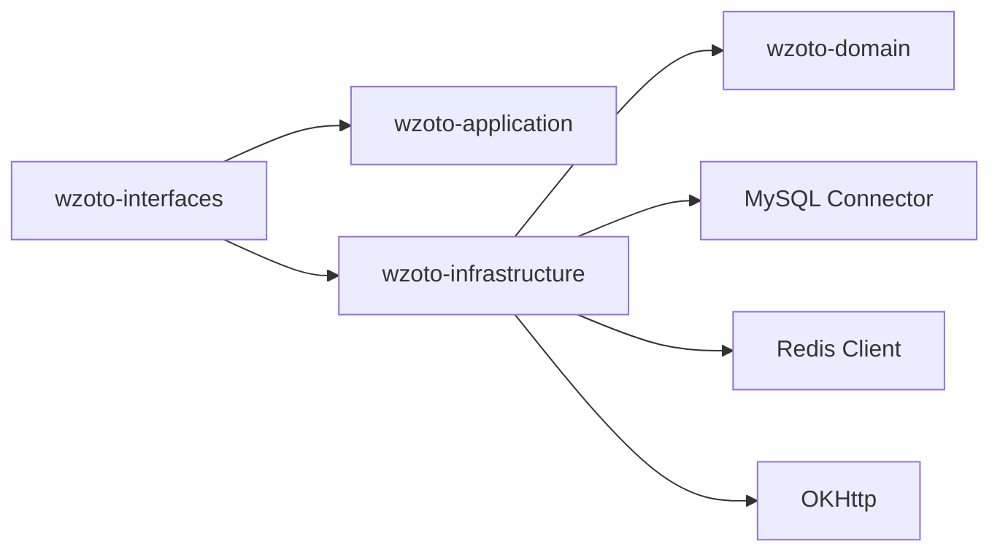

# 容器化部署

<cite>
**本文引用的文件**
- [wzoto-backend/pom.xml](file://wzoto-backend/pom.xml)
- [wzoto-backend/wzoto-interfaces/pom.xml](file://wzoto-backend/wzoto-interfaces/pom.xml)
- [wzoto-backend/wzoto-infrastructure/pom.xml](file://wzoto-backend/wzoto-infrastructure/pom.xml)
- [wzoto-backend/wzoto-interfaces/src/main/resources/application.yml](file://wzoto-backend/wzoto-interfaces/src/main/resources/application.yml)
- [wzoto-backend/wzoto-interfaces/src/main/java/com/wzoto/WzotoApplication.java](file://wzoto-backend/wzoto-interfaces/src/main/java/com/wzoto/WzotoApplication.java)
- [wzoto-frontend/package.json](file://wzoto-frontend/package.json)
- [wzoto-frontend/vite.config.js](file://wzoto-frontend/vite.config.js)
</cite>

## 目录
1. [简介](#简介)
2. [项目结构](#项目结构)
3. [核心组件](#核心组件)
4. [架构总览](#架构总览)
5. [详细组件分析](#详细组件分析)
6. [依赖关系分析](#依赖关系分析)
7. [性能考虑](#性能考虑)
8. [故障排查指南](#故障排查指南)
9. [结论](#结论)
10. [附录](#附录)

## 简介
本指南面向wzoto项目的容器化与编排部署，覆盖以下目标：
- Docker镜像构建：后端Java应用打包、前端静态资源构建、多阶段构建优化。
- Docker Compose编排：MySQL、Redis、后端服务、前端服务的容器编排配置。
- 容器网络与服务发现：容器间通信、环境变量注入、健康检查。
- 生产环境部署脚本：健康检查、日志收集、数据持久化配置。
- 容器安全最佳实践：非root用户运行、镜像扫描、最小化镜像大小。
- Kubernetes部署清单：Deployment、Service、Ingress资源配置。

## 项目结构
wzoto采用前后端分离与DDD分层架构：
- 后端（Spring Boot + MyBatis-Plus）：位于wzoto-backend，包含domain、application、infrastructure、interfaces四个模块，入口为WzotoApplication。
- 前端（Vue3 + Vite）：位于wzoto-frontend，通过Vite构建静态资源。
- 数据库与缓存：MySQL与Redis作为外部依赖，通过环境变量配置连接信息。

**图表来源**
- [wzoto-backend/wzoto-interfaces/src/main/java/com/wzoto/WzotoApplication.java:1-19](file://wzoto-backend/wzoto-interfaces/src/main/java/com/wzoto/WzotoApplication.java#L1-L19)
- [wzoto-backend/wzoto-interfaces/src/main/resources/application.yml:1-51](file://wzoto-backend/wzoto-interfaces/src/main/resources/application.yml#L1-L51)
- [wzoto-frontend/package.json:1-27](file://wzoto-frontend/package.json#L1-L27)
- [wzoto-frontend/vite.config.js:1-21](file://wzoto-frontend/vite.config.js#L1-L21)

**章节来源**
- [wzoto-backend/pom.xml:1-126](file://wzoto-backend/pom.xml#L1-L126)
- [wzoto-backend/wzoto-interfaces/pom.xml:1-59](file://wzoto-backend/wzoto-interfaces/pom.xml#L1-L59)
- [wzoto-backend/wzoto-infrastructure/pom.xml:33-72](file://wzoto-backend/wzoto-infrastructure/pom.xml#L33-L72)
- [wzoto-backend/wzoto-interfaces/src/main/resources/application.yml:1-51](file://wzoto-backend/wzoto-interfaces/src/main/resources/application.yml#L1-L51)
- [wzoto-frontend/package.json:1-27](file://wzoto-frontend/package.json#L1-L27)
- [wzoto-frontend/vite.config.js:1-21](file://wzoto-frontend/vite.config.js#L1-L21)

## 核心组件
- 后端启动类：WzotoApplication，启用Spring Boot、MapperScan与重试机制。
- 配置中心：application.yml定义服务器端口、上下文路径、数据源、Redis、MyBatis-Plus及自定义JWT/微信/AI配置。
- 前端构建：package.json提供dev/build/preview脚本；vite.config.js配置别名与开发代理。

**章节来源**
- [wzoto-backend/wzoto-interfaces/src/main/java/com/wzoto/WzotoApplication.java:1-19](file://wzoto-backend/wzoto-interfaces/src/main/java/com/wzoto/WzotoApplication.java#L1-L19)
- [wzoto-backend/wzoto-interfaces/src/main/resources/application.yml:1-51](file://wzoto-backend/wzoto-interfaces/src/main/resources/application.yml#L1-L51)
- [wzoto-frontend/package.json:1-27](file://wzoto-frontend/package.json#L1-L27)
- [wzoto-frontend/vite.config.js:1-21](file://wzoto-frontend/vite.config.js#L1-L21)

## 架构总览
整体部署架构由前端静态资源、后端API服务、MySQL与Redis组成。容器间通过Docker网络互联，环境变量注入敏感配置，持久化卷挂载数据库数据与日志。

[此图为概念性架构图，不直接映射具体源码文件]

## 详细组件分析

### 后端镜像构建（多阶段构建）
- 构建阶段：使用Maven编译并打包Spring Boot可执行JAR。
- 运行阶段：基于精简JRE镜像运行应用，仅包含运行时依赖。
- 关键要点：
  - 使用spring-boot-maven-plugin生成可执行包。
  - 通过环境变量注入数据库、Redis、JWT等配置。
  - 暴露端口8080，设置健康检查探针。

**图表来源**
- [wzoto-backend/wzoto-interfaces/pom.xml:43-59](file://wzoto-backend/wzoto-interfaces/pom.xml#L43-L59)
- [wzoto-backend/wzoto-interfaces/src/main/resources/application.yml:1-51](file://wzoto-backend/wzoto-interfaces/src/main/resources/application.yml#L1-L51)

**章节来源**
- [wzoto-backend/wzoto-interfaces/pom.xml:43-59](file://wzoto-backend/wzoto-interfaces/pom.xml#L43-L59)
- [wzoto-backend/wzoto-interfaces/src/main/resources/application.yml:1-51](file://wzoto-backend/wzoto-interfaces/src/main/resources/application.yml#L1-L51)

### 前端镜像构建（静态资源）
- 构建阶段：Node镜像安装依赖并执行Vite构建，输出dist静态资源。
- 运行阶段：Nginx镜像托管静态资源，支持Gzip压缩与缓存策略。
- 关键要点：
  - package.json提供build脚本。
  - vite.config.js配置开发代理与别名，生产环境通过Nginx反向代理到后端。

**图表来源**
- [wzoto-frontend/package.json:1-27](file://wzoto-frontend/package.json#L1-L27)
- [wzoto-frontend/vite.config.js:1-21](file://wzoto-frontend/vite.config.js#L1-L21)

**章节来源**
- [wzoto-frontend/package.json:1-27](file://wzoto-frontend/package.json#L1-L27)
- [wzoto-frontend/vite.config.js:1-21](file://wzoto-frontend/vite.config.js#L1-L21)

### Docker Compose编排
- 服务定义：
  - mysql：数据持久化卷挂载，初始化SQL脚本可通过entrypoint或volume加载。
  - redis：内存缓存，可选持久化。
  - backend：Spring Boot应用，依赖mysql与redis，注入环境变量。
  - frontend：Nginx托管静态资源，反向代理/api到backend。
- 网络：默认bridge网络，服务间通过服务名解析。
- 健康检查：为各服务配置healthcheck，确保依赖就绪后再启动依赖方。

**图表来源**
- [wzoto-backend/wzoto-interfaces/src/main/resources/application.yml:1-51](file://wzoto-backend/wzoto-interfaces/src/main/resources/application.yml#L1-L51)
- [wzoto-frontend/vite.config.js:12-18](file://wzoto-frontend/vite.config.js#L12-L18)

**章节来源**
- [wzoto-backend/wzoto-interfaces/src/main/resources/application.yml:1-51](file://wzoto-backend/wzoto-interfaces/src/main/resources/application.yml#L1-L51)
- [wzoto-frontend/vite.config.js:12-18](file://wzoto-frontend/vite.config.js#L12-L18)

### 容器网络与服务发现
- 网络模型：Docker Compose默认bridge网络，服务通过服务名进行DNS解析。
- 环境变量：通过.env或compose文件注入敏感配置（如MYSQL_PASSWORD、REDIS_HOST等）。
- 服务发现：容器内通过服务名访问其他服务（如backend连接mysql、redis）。

**章节来源**
- [wzoto-backend/wzoto-interfaces/src/main/resources/application.yml:7-17](file://wzoto-backend/wzoto-interfaces/src/main/resources/application.yml#L7-L17)

### 生产环境部署脚本
- 健康检查：
  - 后端：建议启用Spring Boot Actuator或自定义/health接口，用于Kubernetes或编排器探测。
  - 前端：Nginx默认健康检查可用。
- 日志收集：
  - 后端：STDOUT/STDERR日志，结合容器日志系统收集。
  - 前端：Nginx访问日志与错误日志。
- 数据持久化：
  - MySQL：挂载数据目录至宿主机或云盘，避免数据丢失。
  - Redis：可选RDB/AOF持久化。

**章节来源**
- [wzoto-backend/wzoto-interfaces/src/main/resources/application.yml:48-51](file://wzoto-backend/wzoto-interfaces/src/main/resources/application.yml#L48-L51)

### 容器安全最佳实践
- 非root用户运行：在镜像中创建专用用户并切换UID/GID运行应用。
- 镜像扫描：集成Trivy/Clair等工具扫描漏洞。
- 最小化镜像：
  - 后端：使用JRE精简镜像，仅包含运行时依赖。
  - 前端：Nginx镜像仅包含静态资源与必要配置。
- 密钥管理：通过环境变量或Secrets管理敏感信息，避免硬编码。

[本节为通用安全实践说明，不直接引用具体源码文件]

### Kubernetes部署清单
- Deployment：
  - 后端：副本数、资源限制、环境变量、健康检查探针。
  - 前端：Nginx副本与静态资源挂载。
- Service：
  - 后端：ClusterIP暴露内部API。
  - 前端：NodePort/LoadBalancer暴露静态资源。
- Ingress：
  - 统一入口，按路径路由到前端与后端。
- ConfigMap/Secret：
  - 将application.yml中的敏感配置抽离为Secret，非敏感配置放入ConfigMap。

[本节为概念性部署清单说明，不直接引用具体源码文件]

## 依赖关系分析
后端模块依赖关系清晰，interfaces依赖application与infrastructure，infrastructure依赖domain与第三方库（MySQL、Redis、OKHttp等）。

**图表来源**
- [wzoto-backend/pom.xml:21-26](file://wzoto-backend/pom.xml#L21-L26)
- [wzoto-backend/wzoto-infrastructure/pom.xml:33-72](file://wzoto-backend/wzoto-infrastructure/pom.xml#L33-L72)

**章节来源**
- [wzoto-backend/pom.xml:21-26](file://wzoto-backend/pom.xml#L21-L26)
- [wzoto-backend/wzoto-infrastructure/pom.xml:33-72](file://wzoto-backend/wzoto-infrastructure/pom.xml#L33-L72)

## 性能考虑
- 构建优化：
  - 后端：Maven多阶段构建，缓存依赖层。
  - 前端：并行安装依赖，启用Vite构建缓存。
- 运行优化：
  - 后端：合理设置JVM参数（堆大小、GC策略），启用连接池与缓存。
  - 前端：启用Gzip/Brotli压缩，合理设置缓存头。
- 资源限制：
  - 容器CPU/内存限制，防止资源争用。
- 监控与指标：
  - 后端接入Prometheus/Micrometer，前端接入APM。

[本节为通用性能优化建议，不直接引用具体源码文件]

## 故障排查指南
- 启动失败：
  - 检查环境变量是否正确注入（数据库、Redis、JWT等）。
  - 查看容器日志定位异常堆栈。
- 连接问题：
  - 确认MySQL/Redis服务是否就绪，网络连通性是否正常。
  - 检查防火墙与安全组规则。
- 健康检查失败：
  - 验证健康检查端点是否可达，权限与认证是否配置正确。
- 日志分析：
  - 后端日志级别调整，关注ERROR与WARN级别。
  - 前端Nginx访问日志与错误日志分析。

**章节来源**
- [wzoto-backend/wzoto-interfaces/src/main/resources/application.yml:48-51](file://wzoto-backend/wzoto-interfaces/src/main/resources/application.yml#L48-L51)

## 结论
通过多阶段构建、Compose编排与Kubernetes部署，wzoto项目可实现高可用、可扩展的容器化部署。遵循安全最佳实践与性能优化策略，能够保障生产环境的稳定运行与高效交付。

[本节为总结性内容，不直接引用具体源码文件]

## 附录

### 环境变量参考（来自application.yml）
- 数据库：
  - MYSQL_PASSWORD：数据库密码
  - 连接URL：jdbc:mysql://host:port/db?params
- Redis：
  - REDIS_HOST：Redis主机
  - REDIS_PORT：Redis端口
  - REDIS_PASSWORD：Redis密码
- JWT：
  - JWT_SECRET：JWT密钥
  - JWT_EXPIRATION_HOURS：过期时间
- 微信：
  - WECHAT_APP_ID：应用ID
  - WECHAT_APP_SECRET：应用密钥
- AI：
  - AI_ENABLED：是否启用AI
  - AI_BASE_URL：API地址
  - AI_API_KEY：API密钥
  - AI_MODEL：模型名称
  - AI_TEMPERATURE：温度参数

**章节来源**
- [wzoto-backend/wzoto-interfaces/src/main/resources/application.yml:7-46](file://wzoto-backend/wzoto-interfaces/src/main/resources/application.yml#L7-L46)