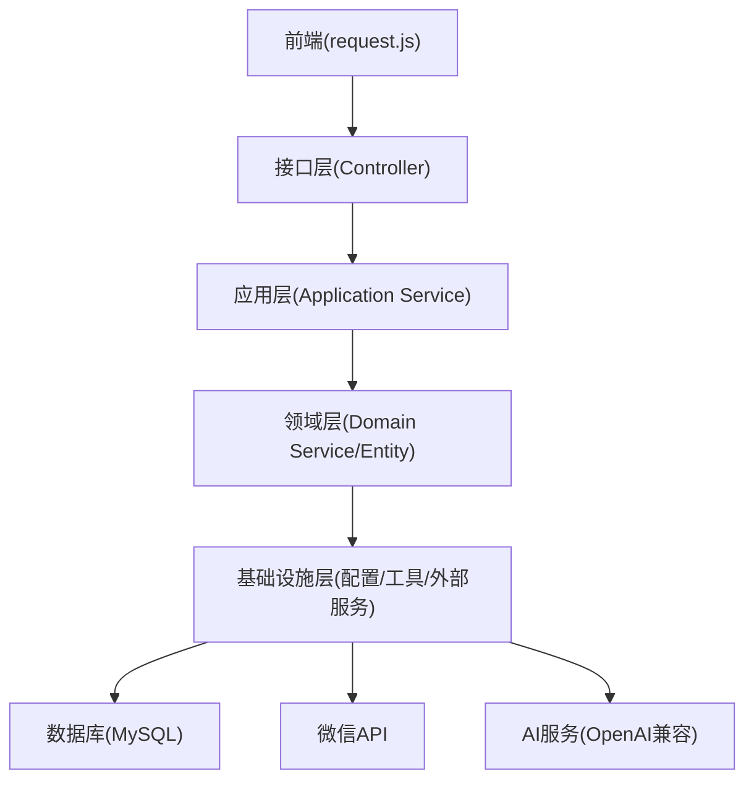
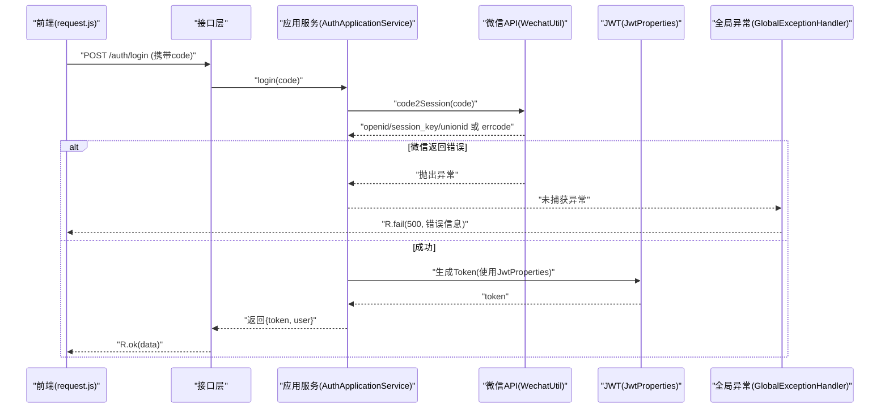
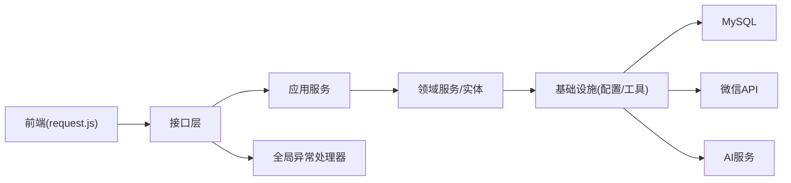

# 常见问题诊断

<cite>
**本文引用的文件**
- [application.yml](file://wzoto-backend/wzoto-interfaces/src/main/resources/application.yml)
- [GlobalExceptionHandler.java](file://wzoto-backend/wzoto-interfaces/src/main/java/com/wzoto/interfaces/common/GlobalExceptionHandler.java)
- [R.java](file://wzoto-backend/wzoto-interfaces/src/main/java/com/wzoto/interfaces/common/R.java)
- [JwtProperties.java](file://wzoto-backend/wzoto-infrastructure/src/main/java/com/wzoto/infrastructure/config/JwtProperties.java)
- [WechatProperties.java](file://wzoto-backend/wzoto-infrastructure/src/main/java/com/wzoto/infrastructure/config/WechatProperties.java)
- [WechatUtil.java](file://wzoto-backend/wzoto-infrastructure/src/main/java/com/wzoto/infrastructure/util/WechatUtil.java)
- [AuthApplicationService.java](file://wzoto-backend/wzoto-application/src/main/java/com/wzoto/application/service/AuthApplicationService.java)
- [AiServiceHelper.java](file://wzoto-backend/wzoto-infrastructure/src/main/java/com/wzoto/infrastructure/ai/AiServiceHelper.java)
- [OpenAiHttpGenerator.java](file://wzoto-backend/wzoto-infrastructure/src/main/java/com/wzoto/infrastructure/ai/OpenAiHttpGenerator.java)
- [request.js](file://wzoto-frontend/src/utils/request.js)
</cite>

## 目录
1. [简介](#简介)
2. [项目结构](#项目结构)
3. [核心组件](#核心组件)
4. [架构总览](#架构总览)
5. [详细组件分析](#详细组件分析)
6. [依赖关系分析](#依赖关系分析)
7. [性能注意事项](#性能注意事项)
8. [故障排查指南](#故障排查指南)
9. [结论](#结论)
10. [附录](#附录)

## 简介
本指南面向运维与研发人员，聚焦服务启动、数据库连接、API接口、性能问题以及第三方服务（微信、AI）等常见问题的定位与修复。文档基于仓库中的配置、异常处理、HTTP客户端调用与前端请求拦截器进行系统化梳理，提供可操作的复现步骤与排障清单。

## 项目结构
后端采用分层架构：接口层（Controller）、应用层（Application Service）、领域层（Domain Service/Entity/Repository）、基础设施层（配置、工具类、外部服务集成）。前端通过统一的 axios 实例发起请求并统一处理错误。

图表来源
- [application.yml:1-51](file://wzoto-backend/wzoto-interfaces/src/main/resources/application.yml#L1-L51)
- [request.js:1-58](file://wzoto-frontend/src/utils/request.js#L1-L58)

章节来源
- [application.yml:1-51](file://wzoto-backend/wzoto-interfaces/src/main/resources/application.yml#L1-L51)
- [request.js:1-58](file://wzoto-frontend/src/utils/request.js#L1-L58)

## 核心组件
- 全局异常处理：集中捕获参数校验、业务规则、运行时及系统异常，统一返回码与消息。
- 统一响应体：标准化 code/msg/data 结构，便于前端统一处理。
- 认证与授权：JWT 配置与属性注入；微信小程序登录流程编排。
- 第三方服务：微信登录 code2Session；AI 调用封装（重试、限流、超时）。
- 前端请求：自动注入 Authorization 头、统一错误提示与 401 跳转。

章节来源
- [GlobalExceptionHandler.java:1-67](file://wzoto-backend/wzoto-interfaces/src/main/java/com/wzoto/interfaces/common/GlobalExceptionHandler.java#L1-L67)
- [R.java:1-43](file://wzoto-backend/wzoto-interfaces/src/main/java/com/wzoto/interfaces/common/R.java#L1-L43)
- [JwtProperties.java:1-26](file://wzoto-backend/wzoto-infrastructure/src/main/java/com/wzoto/infrastructure/config/JwtProperties.java#L1-L26)
- [WechatProperties.java:1-23](file://wzoto-backend/wzoto-infrastructure/src/main/java/com/wzoto/infrastructure/config/WechatProperties.java#L1-L23)
- [WechatUtil.java:1-57](file://wzoto-backend/wzoto-infrastructure/src/main/java/com/wzoto/infrastructure/util/WechatUtil.java#L1-L57)
- [AuthApplicationService.java:1-40](file://wzoto-backend/wzoto-application/src/main/java/com/wzoto/application/service/AuthApplicationService.java#L1-L40)
- [AiServiceHelper.java:1-66](file://wzoto-backend/wzoto-infrastructure/src/main/java/com/wzoto/infrastructure/ai/AiServiceHelper.java#L1-L66)
- [OpenAiHttpGenerator.java:1-295](file://wzoto-backend/wzoto-infrastructure/src/main/java/com/wzoto/infrastructure/ai/OpenAiHttpGenerator.java#L1-L295)
- [request.js:1-58](file://wzoto-frontend/src/utils/request.js#L1-L58)

## 架构总览
下图展示一次“微信登录”的端到端调用链，涵盖前端鉴权注入、后端异常处理、第三方微信调用与应用编排。

图表来源
- [AuthApplicationService.java:26-40](file://wzoto-backend/wzoto-application/src/main/java/com/wzoto/application/service/AuthApplicationService.java#L26-L40)
- [WechatUtil.java:26-45](file://wzoto-backend/wzoto-infrastructure/src/main/java/com/wzoto/infrastructure/util/WechatUtil.java#L26-L45)
- [JwtProperties.java:10-26](file://wzoto-backend/wzoto-infrastructure/src/main/java/com/wzoto/infrastructure/config/JwtProperties.java#L10-L26)
- [GlobalExceptionHandler.java:18-66](file://wzoto-backend/wzoto-interfaces/src/main/java/com/wzoto/interfaces/common/GlobalExceptionHandler.java#L18-L66)

## 详细组件分析

### 服务启动问题诊断
- 端口冲突
  - 现象：启动失败或无法访问。
  - 检查点：server.port 配置；进程占用端口。
  - 建议：修改 application.yml 中 server.port 为空闲端口；或使用环境变量覆盖。
  - 参考路径
    - [application.yml:1-4](file://wzoto-backend/wzoto-interfaces/src/main/resources/application.yml#L1-L4)

- 依赖服务不可用
  - 现象：启动时报数据库/Redis 连接失败。
  - 检查点：spring.datasource.url/username/password；spring.data.redis.host/port/password。
  - 建议：确认 MySQL/Redis 可达；网络与防火墙策略；密码通过环境变量注入。
  - 参考路径
    - [application.yml:6-17](file://wzoto-backend/wzoto-interfaces/src/main/resources/application.yml#L6-L17)

- 配置文件错误
  - 现象：启动报错或行为异常。
  - 检查点：wzoto.jwt.*、wzoto.wechat.*、wzoto.ai.* 是否完整且格式正确。
  - 建议：按 JwtProperties/WechatProperties 前缀核对；生产环境务必通过环境变量注入敏感项。
  - 参考路径
    - [application.yml:31-46](file://wzoto-backend/wzoto-interfaces/src/main/resources/application.yml#L31-L46)
    - [JwtProperties.java:10-26](file://wzoto-backend/wzoto-infrastructure/src/main/java/com/wzoto/infrastructure/config/JwtProperties.java#L10-L26)
    - [WechatProperties.java:10-23](file://wzoto-backend/wzoto-infrastructure/src/main/java/com/wzoto/infrastructure/config/WechatProperties.java#L10-L23)

- 权限问题
  - 现象：无法读取配置文件、日志或写入数据。
  - 检查点：运行用户权限；MySQL/Redis 账号权限；文件系统读写权限。
  - 建议：最小权限原则；检查容器/宿主权限；避免以 root 运行。

章节来源
- [application.yml:1-51](file://wzoto-backend/wzoto-interfaces/src/main/resources/application.yml#L1-L51)
- [JwtProperties.java:10-26](file://wzoto-backend/wzoto-infrastructure/src/main/java/com/wzoto/infrastructure/config/JwtProperties.java#L10-L26)
- [WechatProperties.java:10-23](file://wzoto-backend/wzoto-infrastructure/src/main/java/com/wzoto/infrastructure/config/WechatProperties.java#L10-L23)

### 数据库连接问题诊断
- 连接池耗尽
  - 现象：高并发下大量请求等待或超时。
  - 检查点：连接池大小、最大活跃连接、慢查询堆积。
  - 建议：监控连接池使用率；优化慢查询；必要时扩容或调优连接池参数。
  - 参考路径
    - [application.yml:6-17](file://wzoto-backend/wzoto-interfaces/src/main/resources/application.yml#L6-L17)

- 连接超时
  - 现象：数据库连接建立耗时过长或失败。
  - 检查点：网络连通性、数据库负载、超时配置。
  - 建议：调整超时时间；检查数据库资源；增加重试与熔断。
  - 参考路径
    - [application.yml:6-17](file://wzoto-backend/wzoto-interfaces/src/main/resources/application.yml#L6-L17)

- 死锁检测
  - 现象：事务长时间阻塞。
  - 检查点：InnoDB 死锁日志；长事务；索引缺失导致锁升级。
  - 建议：优化 SQL 与索引；缩短事务范围；避免大事务。
  - 参考路径
    - [application.yml:6-17](file://wzoto-backend/wzoto-interfaces/src/main/resources/application.yml#L6-L17)

- 慢查询定位
  - 现象：接口响应缓慢。
  - 检查点：MyBatis 日志输出；慢查询日志；执行计划。
  - 建议：开启 MyBatis 日志；结合数据库慢查询日志定位热点 SQL。
  - 参考路径
    - [application.yml:19-29](file://wzoto-backend/wzoto-interfaces/src/main/resources/application.yml#L19-L29)

章节来源
- [application.yml:6-29](file://wzoto-backend/wzoto-interfaces/src/main/resources/application.yml#L6-L29)

### API接口问题诊断
- 404 错误
  - 可能原因：路由未注册、上下文路径配置不一致、前后端地址不匹配。
  - 检查点：server.context-path；前端 baseURL；控制器映射。
  - 建议：统一网关/代理路径；核对前端 baseURL 与后端 context-path。
  - 参考路径
    - [application.yml:1-4](file://wzoto-backend/wzoto-interfaces/src/main/resources/application.yml#L1-L4)
    - [request.js:5-11](file://wzoto-frontend/src/utils/request.js#L5-L11)

- 500 异常
  - 可能原因：空指针、参数非法、第三方调用失败、数据库异常。
  - 检查点：GlobalExceptionHandler 捕获的异常类型与日志；R.fail 返回。
  - 建议：完善入参校验；对外部调用加重试与降级；记录堆栈。
  - 参考路径
    - [GlobalExceptionHandler.java:18-66](file://wzoto-backend/wzoto-interfaces/src/main/java/com/wzoto/interfaces/common/GlobalExceptionHandler.java#L18-L66)
    - [R.java:27-40](file://wzoto-backend/wzoto-interfaces/src/main/java/com/wzoto/interfaces/common/R.java#L27-L40)

- 超时问题
  - 可能原因：下游服务慢、数据库慢、网络抖动。
  - 检查点：前端 request.timeout；后端 HTTP 客户端超时；数据库/Redis 超时。
  - 建议：合理设置超时；对慢接口做异步化或分页；增加重试与熔断。
  - 参考路径
    - [request.js:5-11](file://wzoto-frontend/src/utils/request.js#L5-L11)
    - [OpenAiHttpGenerator.java:1-295](file://wzoto-backend/wzoto-infrastructure/src/main/java/com/wzoto/infrastructure/ai/OpenAiHttpGenerator.java#L1-L295)

- 并发问题
  - 可能原因：锁竞争、连接池不足、第三方限流。
  - 检查点：线程池、连接池、限流策略；AI 每日调用限制。
  - 建议：引入限流与队列；优化热点路径；关注 AiServiceHelper 的 DAILY_LIMIT。
  - 参考路径
    - [AiServiceHelper.java:14-26](file://wzoto-backend/wzoto-infrastructure/src/main/java/com/wzoto/infrastructure/ai/AiServiceHelper.java#L14-L26)

章节来源
- [GlobalExceptionHandler.java:18-66](file://wzoto-backend/wzoto-interfaces/src/main/java/com/wzoto/interfaces/common/GlobalExceptionHandler.java#L18-L66)
- [R.java:27-40](file://wzoto-backend/wzoto-interfaces/src/main/java/com/wzoto/interfaces/common/R.java#L27-L40)
- [request.js:5-11](file://wzoto-frontend/src/utils/request.js#L5-L11)
- [AiServiceHelper.java:14-26](file://wzoto-backend/wzoto-infrastructure/src/main/java/com/wzoto/infrastructure/ai/AiServiceHelper.java#L14-L26)

### 性能问题诊断
- CPU 飙高
  - 检查点：热点方法、GC 频繁、正则/序列化开销。
  - 建议：采样分析；减少同步阻塞；缓存热点数据。
- 内存溢出
  - 检查点：大对象、集合增长、未关闭流。
  - 建议：限制批量大小；及时释放资源；监控堆内存。
- 磁盘 IO 瓶颈
  - 检查点：日志量过大、临时文件、数据库写放大。
  - 建议：日志分级与滚动；异步落盘；优化写入路径。
- 网络带宽不足
  - 检查点：大文件传输、重复请求、跨域回源。
  - 建议：压缩响应；CDN 加速；合并请求。

[本节为通用指导，不直接分析具体文件]

### 第三方服务问题诊断
- 微信API调用失败
  - 现象：登录失败、获取 openid/session_key 失败。
  - 检查点：WechatProperties.appId/appSecret；网络可达；errcode 非 0。
  - 建议：核对凭证；查看 WechatUtil 日志；重试与告警。
  - 参考路径
    - [WechatProperties.java:10-23](file://wzoto-backend/wzoto-infrastructure/src/main/java/com/wzoto/infrastructure/config/WechatProperties.java#L10-L23)
    - [WechatUtil.java:26-45](file://wzoto-backend/wzoto-infrastructure/src/main/java/com/wzoto/infrastructure/util/WechatUtil.java#L26-L45)
    - [AuthApplicationService.java:26-40](file://wzoto-backend/wzoto-application/src/main/java/com/wzoto/application/service/AuthApplicationService.java#L26-L40)

- AI服务异常
  - 现象：生成内容失败、超时、限流。
  - 检查点：wzoto.ai.enabled/base-url/api-key/model；OkHttpClient 超时；AiServiceHelper 重试与日限额。
  - 建议：启用开关控制；合理设置温度与模型；增加重试与降级；监控调用次数。
  - 参考路径
    - [application.yml:39-46](file://wzoto-backend/wzoto-interfaces/src/main/resources/application.yml#L39-L46)
    - [OpenAiHttpGenerator.java:23-38](file://wzoto-backend/wzoto-infrastructure/src/main/java/com/wzoto/infrastructure/ai/OpenAiHttpGenerator.java#L23-L38)
    - [AiServiceHelper.java:14-43](file://wzoto-backend/wzoto-infrastructure/src/main/java/com/wzoto/infrastructure/ai/AiServiceHelper.java#L14-L43)

- 短信发送失败
  - 说明：当前仓库未见短信相关实现。若后续接入，建议复用 WechatUtil 模式：独立工具类、配置化、重试与限流、统一异常与日志。

章节来源
- [WechatProperties.java:10-23](file://wzoto-backend/wzoto-infrastructure/src/main/java/com/wzoto/infrastructure/config/WechatProperties.java#L10-L23)
- [WechatUtil.java:26-45](file://wzoto-backend/wzoto-infrastructure/src/main/java/com/wzoto/infrastructure/util/WechatUtil.java#L26-L45)
- [AuthApplicationService.java:26-40](file://wzoto-backend/wzoto-application/src/main/java/com/wzoto/application/service/AuthApplicationService.java#L26-L40)
- [application.yml:39-46](file://wzoto-backend/wzoto-interfaces/src/main/resources/application.yml#L39-L46)
- [OpenAiHttpGenerator.java:23-38](file://wzoto-backend/wzoto-infrastructure/src/main/java/com/wzoto/infrastructure/ai/OpenAiHttpGenerator.java#L23-L38)
- [AiServiceHelper.java:14-43](file://wzoto-backend/wzoto-infrastructure/src/main/java/com/wzoto/infrastructure/ai/AiServiceHelper.java#L14-L43)

## 依赖关系分析
- 前端依赖后端接口，统一通过 request.js 发起请求并处理 401/网络错误。
- 后端接口层依赖应用层编排，应用层依赖领域服务与基础设施。
- 基础设施层依赖数据库、Redis、微信与 AI 服务。
- 全局异常处理器统一收敛异常，保证前端一致的错误体验。

图表来源
- [request.js:13-55](file://wzoto-frontend/src/utils/request.js#L13-L55)
- [GlobalExceptionHandler.java:14-66](file://wzoto-backend/wzoto-interfaces/src/main/java/com/wzoto/interfaces/common/GlobalExceptionHandler.java#L14-L66)

章节来源
- [request.js:13-55](file://wzoto-frontend/src/utils/request.js#L13-L55)
- [GlobalExceptionHandler.java:14-66](file://wzoto-backend/wzoto-interfaces/src/main/java/com/wzoto/interfaces/common/GlobalExceptionHandler.java#L14-L66)

## 性能注意事项
- 合理设置前端超时与后端 HTTP 客户端超时，避免雪崩。
- 对第三方调用（微信、AI）实施重试、限流与熔断。
- 数据库侧优化慢查询与索引，避免全表扫描与锁竞争。
- 日志级别按需调整，生产环境避免过多 DEBUG 日志影响性能。
- 监控关键指标：QPS、RT、错误率、连接池使用率、CPU/内存/IO。

[本节为通用指导，不直接分析具体文件]

## 故障排查指南

### 服务启动问题
- 端口冲突
  - 复现：修改 application.yml 的 server.port 后重启。
  - 排查：netstat/lsof 查看端口占用；切换端口验证。
  - 参考路径
    - [application.yml:1-4](file://wzoto-backend/wzoto-interfaces/src/main/resources/application.yml#L1-L4)

- 依赖服务不可用
  - 复现：断开 MySQL/Redis 后启动。
  - 排查：观察启动日志；检查 spring.datasource 与 redis 配置。
  - 参考路径
    - [application.yml:6-17](file://wzoto-backend/wzoto-interfaces/src/main/resources/application.yml#L6-L17)

- 配置文件错误
  - 复现：删除或篡改 wzoto.jwt/wechat/ai 配置。
  - 排查：对照 JwtProperties/WechatProperties 前缀逐项核对。
  - 参考路径
    - [JwtProperties.java:10-26](file://wzoto-backend/wzoto-infrastructure/src/main/java/com/wzoto/infrastructure/config/JwtProperties.java#L10-L26)
    - [WechatProperties.java:10-23](file://wzoto-backend/wzoto-infrastructure/src/main/java/com/wzoto/infrastructure/config/WechatProperties.java#L10-L23)

- 权限问题
  - 复现：以受限用户运行服务。
  - 排查：检查配置文件、日志、数据目录权限。

章节来源
- [application.yml:1-51](file://wzoto-backend/wzoto-interfaces/src/main/resources/application.yml#L1-L51)
- [JwtProperties.java:10-26](file://wzoto-backend/wzoto-infrastructure/src/main/java/com/wzoto/infrastructure/config/JwtProperties.java#L10-L26)
- [WechatProperties.java:10-23](file://wzoto-backend/wzoto-infrastructure/src/main/java/com/wzoto/infrastructure/config/WechatProperties.java#L10-L23)

### 数据库连接问题
- 连接池耗尽
  - 复现：压测高并发读/写。
  - 排查：监控连接池；定位慢查询；优化事务粒度。
  - 参考路径
    - [application.yml:6-17](file://wzoto-backend/wzoto-interfaces/src/main/resources/application.yml#L6-L17)

- 连接超时
  - 复现：模拟网络抖动或数据库拥塞。
  - 排查：检查超时配置与网络链路。
  - 参考路径
    - [application.yml:6-17](file://wzoto-backend/wzoto-interfaces/src/main/resources/application.yml#L6-L17)

- 死锁检测
  - 复现：构造并发更新同一行。
  - 排查：查看 InnoDB 死锁日志；优化索引与事务。
  - 参考路径
    - [application.yml:6-17](file://wzoto-backend/wzoto-interfaces/src/main/resources/application.yml#L6-L17)

- 慢查询定位
  - 复现：执行复杂查询。
  - 排查：开启 MyBatis 日志；结合数据库慢查询日志。
  - 参考路径
    - [application.yml:19-29](file://wzoto-backend/wzoto-interfaces/src/main/resources/application.yml#L19-L29)

章节来源
- [application.yml:6-29](file://wzoto-backend/wzoto-interfaces/src/main/resources/application.yml#L6-L29)

### API接口问题
- 404 错误
  - 复现：访问未注册路由或错误路径。
  - 排查：核对 context-path 与前端 baseURL。
  - 参考路径
    - [application.yml:1-4](file://wzoto-backend/wzoto-interfaces/src/main/resources/application.yml#L1-L4)
    - [request.js:5-11](file://wzoto-frontend/src/utils/request.js#L5-L11)

- 500 异常
  - 复现：触发非法参数或空指针。
  - 排查：查看 GlobalExceptionHandler 日志与 R.fail 返回。
  - 参考路径
    - [GlobalExceptionHandler.java:18-66](file://wzoto-backend/wzoto-interfaces/src/main/java/com/wzoto/interfaces/common/GlobalExceptionHandler.java#L18-L66)
    - [R.java:27-40](file://wzoto-backend/wzoto-interfaces/src/main/java/com/wzoto/interfaces/common/R.java#L27-L40)

- 超时问题
  - 复现：调用慢接口或下游服务。
  - 排查：前端 request.timeout；后端 HTTP 客户端超时。
  - 参考路径
    - [request.js:5-11](file://wzoto-frontend/src/utils/request.js#L5-L11)
    - [OpenAiHttpGenerator.java:23-38](file://wzoto-backend/wzoto-infrastructure/src/main/java/com/wzoto/infrastructure/ai/OpenAiHttpGenerator.java#L23-L38)

- 并发问题
  - 复现：并发调用受限于第三方或数据库。
  - 排查：关注 AiServiceHelper 的日限额与重试策略。
  - 参考路径
    - [AiServiceHelper.java:14-43](file://wzoto-backend/wzoto-infrastructure/src/main/java/com/wzoto/infrastructure/ai/AiServiceHelper.java#L14-L43)

章节来源
- [GlobalExceptionHandler.java:18-66](file://wzoto-backend/wzoto-interfaces/src/main/java/com/wzoto/interfaces/common/GlobalExceptionHandler.java#L18-L66)
- [R.java:27-40](file://wzoto-backend/wzoto-interfaces/src/main/java/com/wzoto/interfaces/common/R.java#L27-L40)
- [request.js:5-11](file://wzoto-frontend/src/utils/request.js#L5-L11)
- [OpenAiHttpGenerator.java:23-38](file://wzoto-backend/wzoto-infrastructure/src/main/java/com/wzoto/infrastructure/ai/OpenAiHttpGenerator.java#L23-L38)
- [AiServiceHelper.java:14-43](file://wzoto-backend/wzoto-infrastructure/src/main/java/com/wzoto/infrastructure/ai/AiServiceHelper.java#L14-L43)

### 第三方服务问题
- 微信API调用失败
  - 复现：传入无效 code 或缺少 appId/secret。
  - 排查：WechatUtil 日志与 errcode；核对 WechatProperties。
  - 参考路径
    - [WechatProperties.java:10-23](file://wzoto-backend/wzoto-infrastructure/src/main/java/com/wzoto/infrastructure/config/WechatProperties.java#L10-L23)
    - [WechatUtil.java:26-45](file://wzoto-backend/wzoto-infrastructure/src/main/java/com/wzoto/infrastructure/util/WechatUtil.java#L26-L45)
    - [AuthApplicationService.java:26-40](file://wzoto-backend/wzoto-application/src/main/java/com/wzoto/application/service/AuthApplicationService.java#L26-L40)

- AI服务异常
  - 复现：关闭 wzoto.ai.enabled 或配置错误的 base-url/api-key。
  - 排查：OpenAiHttpGenerator 请求与响应；AiServiceHelper 重试与限额。
  - 参考路径
    - [application.yml:39-46](file://wzoto-backend/wzoto-interfaces/src/main/resources/application.yml#L39-L46)
    - [OpenAiHttpGenerator.java:23-38](file://wzoto-backend/wzoto-infrastructure/src/main/java/com/wzoto/infrastructure/ai/OpenAiHttpGenerator.java#L23-L38)
    - [AiServiceHelper.java:14-43](file://wzoto-backend/wzoto-infrastructure/src/main/java/com/wzoto/infrastructure/ai/AiServiceHelper.java#L14-L43)

- 短信发送失败
  - 说明：当前仓库未见短信实现。若后续接入，建议参照 WechatUtil 模式实现工具类与配置化。

章节来源
- [WechatProperties.java:10-23](file://wzoto-backend/wzoto-infrastructure/src/main/java/com/wzoto/infrastructure/config/WechatProperties.java#L10-L23)
- [WechatUtil.java:26-45](file://wzoto-backend/wzoto-infrastructure/src/main/java/com/wzoto/infrastructure/util/WechatUtil.java#L26-L45)
- [AuthApplicationService.java:26-40](file://wzoto-backend/wzoto-application/src/main/java/com/wzoto/application/service/AuthApplicationService.java#L26-L40)
- [application.yml:39-46](file://wzoto-backend/wzoto-interfaces/src/main/resources/application.yml#L39-L46)
- [OpenAiHttpGenerator.java:23-38](file://wzoto-backend/wzoto-infrastructure/src/main/java/com/wzoto/infrastructure/ai/OpenAiHttpGenerator.java#L23-L38)
- [AiServiceHelper.java:14-43](file://wzoto-backend/wzoto-infrastructure/src/main/java/com/wzoto/infrastructure/ai/AiServiceHelper.java#L14-L43)

### 问题复现方法与调试技巧
- 本地复现
  - 使用 Postman/curl 模拟请求，观察 GlobalExceptionHandler 返回的 R 结构。
  - 通过浏览器开发者工具查看 request.js 的拦截与错误提示。
  - 参考路径
    - [GlobalExceptionHandler.java:18-66](file://wzoto-backend/wzoto-interfaces/src/main/java/com/wzoto/interfaces/common/GlobalExceptionHandler.java#L18-L66)
    - [R.java:19-40](file://wzoto-backend/wzoto-interfaces/src/main/java/com/wzoto/interfaces/common/R.java#L19-L40)
    - [request.js:13-55](file://wzoto-frontend/src/utils/request.js#L13-L55)

- 日志与追踪
  - 调整 logging.level 至 debug 以获取更多细节。
  - 关注 WechatUtil 与 OpenAiHttpGenerator 的日志输出。
  - 参考路径
    - [application.yml:48-51](file://wzoto-backend/wzoto-interfaces/src/main/resources/application.yml#L48-L51)
    - [WechatUtil.java:26-45](file://wzoto-backend/wzoto-infrastructure/src/main/java/com/wzoto/infrastructure/util/WechatUtil.java#L26-L45)
    - [OpenAiHttpGenerator.java:23-38](file://wzoto-backend/wzoto-infrastructure/src/main/java/com/wzoto/infrastructure/ai/OpenAiHttpGenerator.java#L23-L38)

- 断点与单元测试
  - 在 AuthApplicationService.login 与 WechatUtil.code2Session 处断点，逐步验证流程。
  - 针对 AiServiceHelper.callWithRetry 编写用例，验证重试与限流逻辑。
  - 参考路径
    - [AuthApplicationService.java:26-40](file://wzoto-backend/wzoto-application/src/main/java/com/wzoto/application/service/AuthApplicationService.java#L26-L40)
    - [WechatUtil.java:26-45](file://wzoto-backend/wzoto-infrastructure/src/main/java/com/wzoto/infrastructure/util/WechatUtil.java#L26-L45)
    - [AiServiceHelper.java:28-43](file://wzoto-backend/wzoto-infrastructure/src/main/java/com/wzoto/infrastructure/ai/AiServiceHelper.java#L28-L43)

章节来源
- [application.yml:48-51](file://wzoto-backend/wzoto-interfaces/src/main/resources/application.yml#L48-L51)
- [GlobalExceptionHandler.java:18-66](file://wzoto-backend/wzoto-interfaces/src/main/java/com/wzoto/interfaces/common/GlobalExceptionHandler.java#L18-L66)
- [R.java:19-40](file://wzoto-backend/wzoto-interfaces/src/main/java/com/wzoto/interfaces/common/R.java#L19-L40)
- [request.js:13-55](file://wzoto-frontend/src/utils/request.js#L13-L55)
- [AuthApplicationService.java:26-40](file://wzoto-backend/wzoto-application/src/main/java/com/wzoto/application/service/AuthApplicationService.java#L26-L40)
- [WechatUtil.java:26-45](file://wzoto-backend/wzoto-infrastructure/src/main/java/com/wzoto/infrastructure/util/WechatUtil.java#L26-L45)
- [AiServiceHelper.java:28-43](file://wzoto-backend/wzoto-infrastructure/src/main/java/com/wzoto/infrastructure/ai/AiServiceHelper.java#L28-L43)

## 结论
通过对配置、异常处理、HTTP 客户端与前端拦截器的系统性分析，本文提供了从服务启动到第三方集成的完整排障路径。建议在生产环境中强化配置管理、日志与监控，并对第三方调用实施重试、限流与熔断，以提升稳定性与可观测性。

## 附录
- 快速检查清单
  - 端口与上下文路径是否正确
  - 数据库/Redis 是否可达且凭据正确
  - JWT/微信/AI 配置是否齐全且安全
  - 全局异常是否捕获并返回标准 R 结构
  - 前端是否注入 Authorization 并处理 401
  - 第三方调用是否具备重试与限流

[本节为通用指导，不直接分析具体文件]