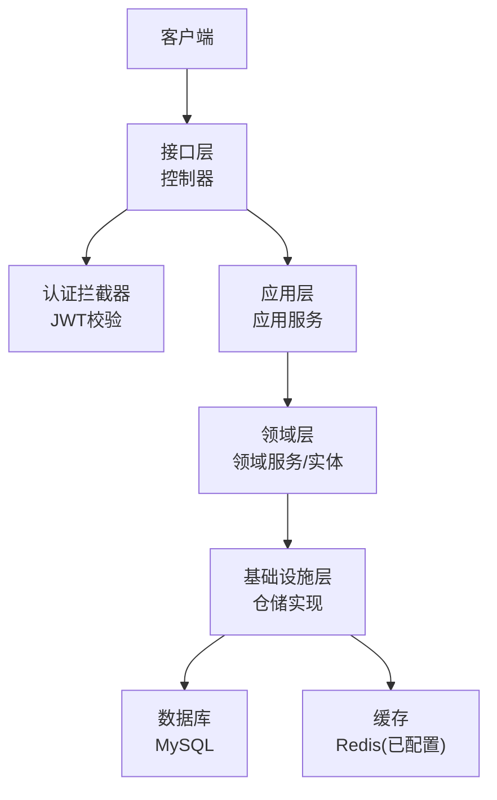
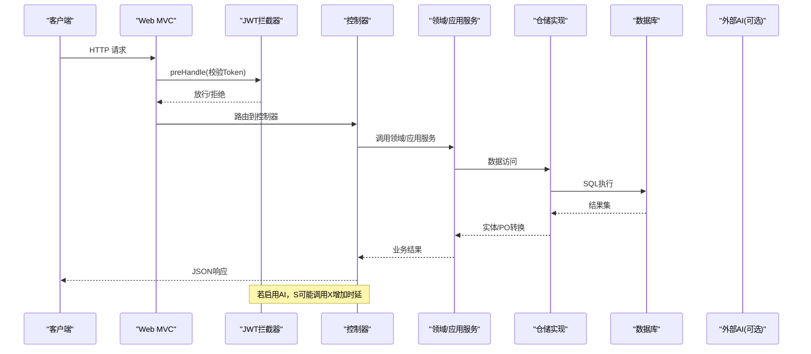
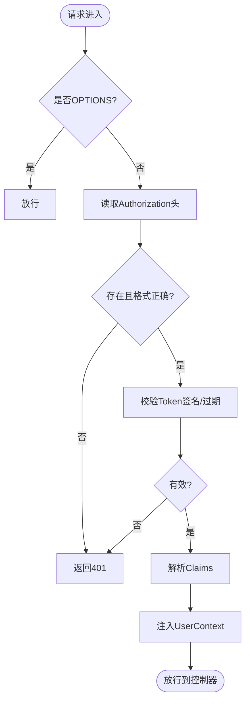
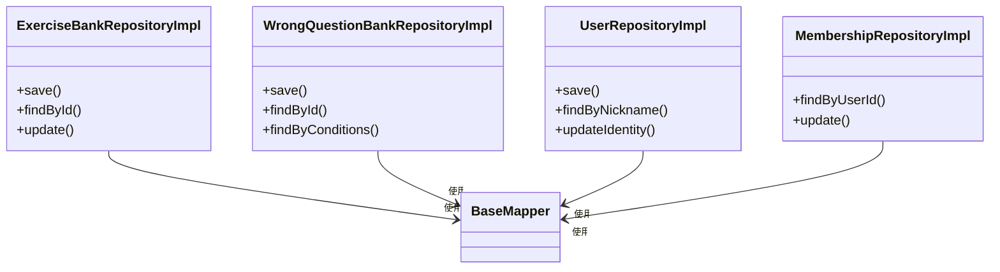
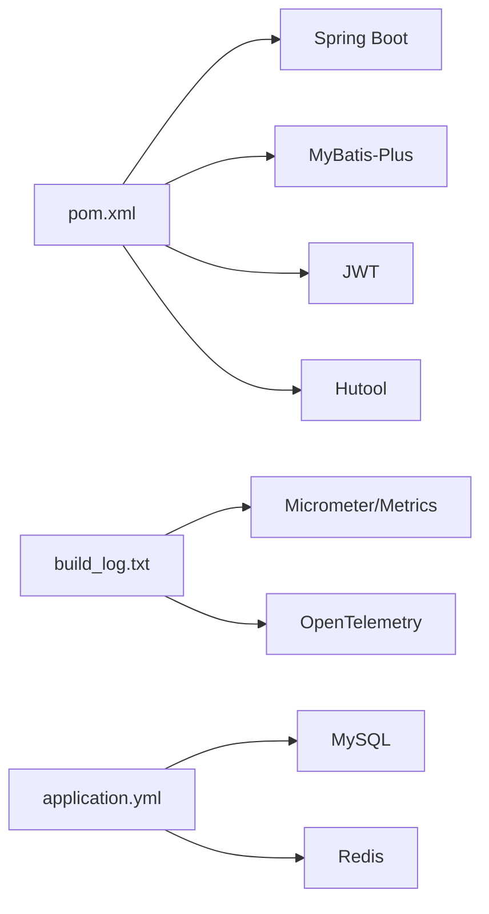
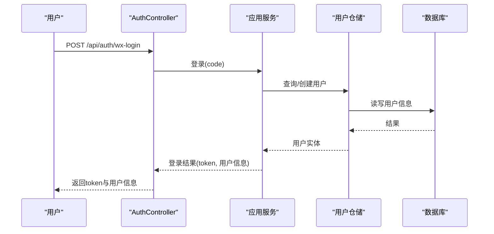

# 性能分析

<cite>
**本文引用的文件**
- [pom.xml](file://wzoto-backend/pom.xml)
- [application.yml](file://wzoto-backend/wzoto-interfaces/src/main/resources/application.yml)
- [AuthController.java](file://wzoto-backend/wzoto-interfaces/src/main/java/com/wzoto/interfaces/controller/AuthController.java)
- [WebMvcConfig.java](file://wzoto-backend/wzoto-infrastructure/src/main/java/com/wzoto/infrastructure/config/WebMvcConfig.java)
- [JwtAuthInterceptor.java](file://wzoto-backend/wzoto-infrastructure/src/main/java/com/wzoto/infrastructure/interceptor/JwtAuthInterceptor.java)
- [GlobalExceptionHandler.java](file://wzoto-backend/wzoto-interfaces/src/main/java/com/wzoto/interfaces/common/GlobalExceptionHandler.java)
- [KnowledgePointDomainService.java](file://wzoto-backend/wzoto-domain/src/main/java/com/wzoto/domain/service/KnowledgePointDomainService.java)
- [LearningReportDomainService.java](file://wzoto-backend/wzoto-domain/src/main/java/com/wzoto/domain/service/LearningReportDomainService.java)
- [ExerciseBankRepositoryImpl.java](file://wzoto-backend/wzoto-infrastructure/src/main/java/com/wzoto/infrastructure/repository/ExerciseBankRepositoryImpl.java)
- [WrongQuestionBankRepositoryImpl.java](file://wzoto-backend/wzoto-infrastructure/src/main/java/com/wzoto/infrastructure/repository/WrongQuestionBankRepositoryImpl.java)
- [UserRepositoryImpl.java](file://wzoto-backend/wzoto-infrastructure/src/main/java/com/wzoto/infrastructure/repository/UserRepositoryImpl.java)
- [MembershipRepositoryImpl.java](file://wzoto-backend/wzoto-infrastructure/src/main/java/com/wzoto/infrastructure/repository/MembershipRepositoryImpl.java)
- [t_exercise_bank.sql](file://wzoto-backend/sql/t_exercise_bank.sql)
- [build_log.txt](file://build_log.txt)
</cite>

## 目录
1. [引言](#引言)
2. [项目结构](#项目结构)
3. [核心组件](#核心组件)
4. [架构总览](#架构总览)
5. [详细组件分析](#详细组件分析)
6. [依赖分析](#依赖分析)
7. [性能考虑](#性能考虑)
8. [故障排查指南](#故障排查指南)
9. [结论](#结论)
10. [附录](#附录)

## 引言
本文件面向WZOTO后端系统，提供一套可落地的性能分析方法论。围绕响应时间、吞吐量、错误率、资源利用率四大指标，结合现有代码与配置，给出热点定位、数据库与缓存优化策略、压测方案以及持续监控与回归检测建议。内容既适合快速上手，也便于深入工程化落地。

## 项目结构
后端采用分层架构：接口层（控制器）、应用层（应用服务）、领域层（领域服务/实体/仓储接口）、基础设施层（持久化、拦截器、配置）。关键入口为控制器与MVC拦截器；数据访问通过MyBatis-Plus的Mapper与Repository实现；数据库为MySQL，缓存为Redis（已配置但未在仓库中直接编码使用）；日志级别默认开启到debug，便于性能观测。

图表来源
- [application.yml:1-51](file://wzoto-backend/wzoto-interfaces/src/main/resources/application.yml#L1-L51)
- [AuthController.java:1-149](file://wzoto-backend/wzoto-interfaces/src/main/java/com/wzoto/interfaces/controller/AuthController.java#L1-L149)
- [WebMvcConfig.java:1-42](file://wzoto-backend/wzoto-infrastructure/src/main/java/com/wzoto/infrastructure/config/WebMvcConfig.java#L1-L42)
- [JwtAuthInterceptor.java:1-65](file://wzoto-backend/wzoto-infrastructure/src/main/java/com/wzoto/infrastructure/interceptor/JwtAuthInterceptor.java#L1-L65)

章节来源
- [pom.xml:1-126](file://wzoto-backend/pom.xml#L1-L126)
- [application.yml:1-51](file://wzoto-backend/wzoto-interfaces/src/main/resources/application.yml#L1-L51)

## 核心组件
- 认证与鉴权：基于JWT的拦截器在请求进入前完成令牌校验并注入用户上下文，影响整体请求时延与安全性。
- 全局异常处理：统一捕获参数校验、业务异常与运行时异常，影响错误率统计与用户体验。
- 数据访问：仓储实现封装了CRUD与查询条件构造，是热点SQL与索引优化的主要位置。
- 领域服务：聚合计算与报表生成逻辑集中于此，易出现CPU或内存瓶颈。

章节来源
- [JwtAuthInterceptor.java:1-65](file://wzoto-backend/wzoto-infrastructure/src/main/java/com/wzoto/infrastructure/interceptor/JwtAuthInterceptor.java#L1-L65)
- [GlobalExceptionHandler.java:1-67](file://wzoto-backend/wzoto-interfaces/src/main/java/com/wzoto/interfaces/common/GlobalExceptionHandler.java#L1-L67)
- [ExerciseBankRepositoryImpl.java:1-40](file://wzoto-backend/wzoto-infrastructure/src/main/java/com/wzoto/infrastructure/repository/ExerciseBankRepositoryImpl.java#L1-L40)
- [LearningReportDomainService.java:62-81](file://wzoto-backend/wzoto-domain/src/main/java/com/wzoto/domain/service/LearningReportDomainService.java#L62-L81)

## 架构总览
下图展示一次典型API请求从进入服务器到返回响应的完整链路，标注了可能引入延迟的关键点（拦截器、序列化、数据库、外部AI调用等），便于后续进行指标采集与瓶颈定位。

图表来源
- [WebMvcConfig.java:1-42](file://wzoto-backend/wzoto-infrastructure/src/main/java/com/wzoto/infrastructure/config/WebMvcConfig.java#L1-L42)
- [JwtAuthInterceptor.java:1-65](file://wzoto-backend/wzoto-infrastructure/src/main/java/com/wzoto/infrastructure/interceptor/JwtAuthInterceptor.java#L1-L65)
- [AuthController.java:1-149](file://wzoto-backend/wzoto-interfaces/src/main/java/com/wzoto/interfaces/controller/AuthController.java#L1-L149)

## 详细组件分析

### 认证与鉴权链路（JWT拦截器）
- 拦截时机：所有/api/**路径在进入控制器前被拦截，OPTIONS预检请求直接放行。
- 校验流程：从Header提取Token → 校验签名与有效期 → 解析Claims → 注入UserContext → 放行。
- 性能关注点：
  - Header读取与字符串操作开销较小，但高并发下需关注GC与线程池。
  - Token解析失败会直接返回401，影响错误率指标。
  - 建议在拦截器前后埋点记录耗时，用于端到端RT分析。

图表来源
- [JwtAuthInterceptor.java:1-65](file://wzoto-backend/wzoto-infrastructure/src/main/java/com/wzoto/infrastructure/interceptor/JwtAuthInterceptor.java#L1-L65)

章节来源
- [JwtAuthInterceptor.java:1-65](file://wzoto-backend/wzoto-infrastructure/src/main/java/com/wzoto/infrastructure/interceptor/JwtAuthInterceptor.java#L1-L65)
- [WebMvcConfig.java:1-42](file://wzoto-backend/wzoto-infrastructure/src/main/java/com/wzoto/infrastructure/config/WebMvcConfig.java#L1-L42)

### 数据访问与热点SQL
- 仓储实现普遍采用LambdaQueryWrapper构建查询，注意避免全表扫描与N+1问题。
- 示例：错题库、习题库、会员、用户等仓储均涉及按条件筛选与排序，应结合索引评估查询计划。
- 建议：
  - 对高频过滤字段建立复合索引（如年级、科目、难度、来源类型等）。
  - 分页查询限制返回字段，减少网络与序列化开销。
  - 复杂报表类查询考虑物化视图或离线聚合。

图表来源
- [ExerciseBankRepositoryImpl.java:1-40](file://wzoto-backend/wzoto-infrastructure/src/main/java/com/wzoto/infrastructure/repository/ExerciseBankRepositoryImpl.java#L1-L40)
- [WrongQuestionBankRepositoryImpl.java:1-40](file://wzoto-backend/wzoto-infrastructure/src/main/java/com/wzoto/infrastructure/repository/WrongQuestionBankRepositoryImpl.java#L1-L40)
- [UserRepositoryImpl.java:39-81](file://wzoto-backend/wzoto-infrastructure/src/main/java/com/wzoto/infrastructure/repository/UserRepositoryImpl.java#L39-L81)
- [MembershipRepositoryImpl.java:38-70](file://wzoto-backend/wzoto-infrastructure/src/main/java/com/wzoto/infrastructure/repository/MembershipRepositoryImpl.java#L38-L70)

章节来源
- [t_exercise_bank.sql:20-30](file://wzoto-backend/sql/t_exercise_bank.sql#L20-L30)
- [ExerciseBankRepositoryImpl.java:1-40](file://wzoto-backend/wzoto-infrastructure/src/main/java/com/wzoto/infrastructure/repository/ExerciseBankRepositoryImpl.java#L1-L40)
- [WrongQuestionBankRepositoryImpl.java:1-40](file://wzoto-backend/wzoto-infrastructure/src/main/java/com/wzoto/infrastructure/repository/WrongQuestionBankRepositoryImpl.java#L1-L40)
- [UserRepositoryImpl.java:39-81](file://wzoto-backend/wzoto-infrastructure/src/main/java/com/wzoto/infrastructure/repository/UserRepositoryImpl.java#L39-L81)
- [MembershipRepositoryImpl.java:38-70](file://wzoto-backend/wzoto-infrastructure/src/main/java/com/wzoto/infrastructure/repository/MembershipRepositoryImpl.java#L38-L70)

### 领域服务与报表计算
- 学习报告服务聚合答题与观看记录，进行准确率、时长、完成率等统计，属于CPU密集场景。
- 建议：
  - 对大列表流式处理，避免一次性加载过多对象。
  - 将重复计算结果缓存（如按日/周粒度聚合）。
  - 对跨表聚合查询进行SQL优化或引入只读副本。

章节来源
- [LearningReportDomainService.java:62-81](file://wzoto-backend/wzoto-domain/src/main/java/com/wzoto/domain/service/LearningReportDomainService.java#L62-L81)

## 依赖分析
- 技术栈：Spring Boot 3.2.5、MyBatis-Plus 3.5.6、Hutool、JWT、SLF4J。
- 构建日志显示项目中引入了Micrometer、Metrics、OpenTelemetry等BOM，表明具备接入APM与指标体系的基础能力。
- 运行时依赖：MySQL（主库）、Redis（缓存，已配置）。

图表来源
- [pom.xml:1-126](file://wzoto-backend/pom.xml#L1-L126)
- [build_log.txt:1-45](file://build_log.txt#L1-L45)
- [application.yml:1-51](file://wzoto-backend/wzoto-interfaces/src/main/resources/application.yml#L1-L51)

章节来源
- [pom.xml:1-126](file://wzoto-backend/pom.xml#L1-L126)
- [build_log.txt:1-45](file://build_log.txt#L1-L45)
- [application.yml:1-51](file://wzoto-backend/wzoto-interfaces/src/main/resources/application.yml#L1-L51)

## 性能考虑

### 监控指标定义
- 响应时间（RT）：P50/P90/P99，区分接口维度与下游依赖维度（DB、Redis、AI）。
- 吞吐量（TPS/QPS）：峰值与稳态吞吐，关注队列堆积与线程池饱和。
- 错误率：4xx/5xx比例，细分至参数校验、鉴权失败、超时、下游异常。
- 资源利用率：CPU、内存、GC、连接池、磁盘IO、网络带宽。

### 工具与方法
- JProfiler：用于CPU火焰图、方法耗时、锁竞争、内存分配热点分析。建议在压测期间采样，定位热点方法与阻塞点。
- Arthas：线上诊断利器，支持热更新、方法级耗时追踪、线程dump、SQL慢查询定位。适用于生产环境无侵入排查。
- VisualVM：本地JVM监控，观察堆、线程、GC、类加载，适合开发阶段性能调优。
- 指标采集：结合Micrometer暴露Prometheus指标，配合Grafana可视化；利用OpenTelemetry做分布式链路追踪。

### 热点代码分析
- 以拦截器、控制器、领域服务、仓储为切面，分别埋点或借助APM采集各阶段耗时。
- 重点关注：
  - 认证拦截器中的Token解析与校验。
  - 报表聚合中的集合遍历与分组。
  - 仓储层的批量查询与N+1问题。

### 数据库性能分析
- 检查慢查询日志与执行计划，确保高频过滤字段有合适索引（参考习题库表索引设计）。
- 优化点：
  - 分页查询限制返回列，避免SELECT *。
  - 复杂查询拆分或引入物化视图/汇总表。
  - 连接池大小与最大等待时间合理配置。

### 缓存命中率分析
- 当前已配置Redis但未在代码中使用，建议对以下数据加缓存：
  - 用户信息、教员资料、知识点树、字典配置。
- 指标：命中率、过期策略、热点Key保护、缓存穿透/雪崩防护。

### 异步处理
- 对非实时任务（如报告生成、消息通知、AI结果后处理）采用异步队列，降低同步链路的RT。
- 注意：幂等、重试、死信队列与监控告警。

### 压测方案设计
- 负载模型：
  - 混合场景：登录/浏览/答题/报表占比模拟真实流量。
  - 阶梯加压：逐步提升并发，寻找拐点。
- 工具：JMeter、k6、wrk等，输出RT分位、TPS、错误率、资源占用。
- 基线：稳定期P95 RT、TPS、错误率阈值，作为回归基准。

### 性能回归检测与持续监控
- CI集成：每次合并触发轻量压测，对比基线阈值，超限即阻断。
- 生产监控：指标上报Prometheus/Grafana，设置告警规则（RT突增、错误率上升、CPU/内存飙升）。
- 变更回滚：当新发布导致性能退化，自动回滚或灰度降级。

## 故障排查指南
- 常见异常分类与处理：
  - 参数校验失败：400，提示具体字段错误。
  - 业务规则违反：400，记录业务上下文。
  - 运行时异常：500，记录堆栈，便于定位。
- 排查步骤：
  - 查看全局异常处理器日志，确认错误类型与堆栈。
  - 使用Arthas跟踪方法耗时与入参出参。
  - 检查数据库慢查询与连接池状态。
  - 核对缓存命中与外部依赖可用性。

章节来源
- [GlobalExceptionHandler.java:1-67](file://wzoto-backend/wzoto-interfaces/src/main/java/com/wzoto/interfaces/common/GlobalExceptionHandler.java#L1-L67)

## 结论
本项目具备清晰的层次结构与完善的依赖基础，可通过拦截器与仓储层切入性能优化。建议优先完善指标采集与APM接入，结合压测建立基线，针对热点SQL与报表计算进行专项优化，并在生产侧建立持续监控与回归机制，保障稳定性与性能演进。

## 附录

### 关键配置要点
- 服务器端口与上下文路径、数据库连接、Redis连接、MyBatis-Plus日志输出、JWT与微信/AI相关配置。
- 日志级别默认debug，便于调试，生产建议调整为info或warn以降低开销。

章节来源
- [application.yml:1-51](file://wzoto-backend/wzoto-interfaces/src/main/resources/application.yml#L1-L51)

### 典型API时序（以认证为例）

图表来源
- [AuthController.java:1-149](file://wzoto-backend/wzoto-interfaces/src/main/java/com/wzoto/interfaces/controller/AuthController.java#L1-L149)