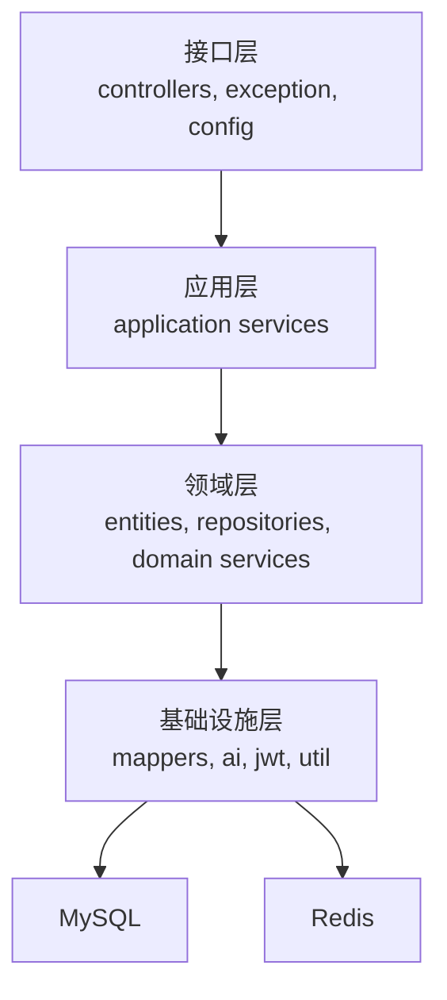
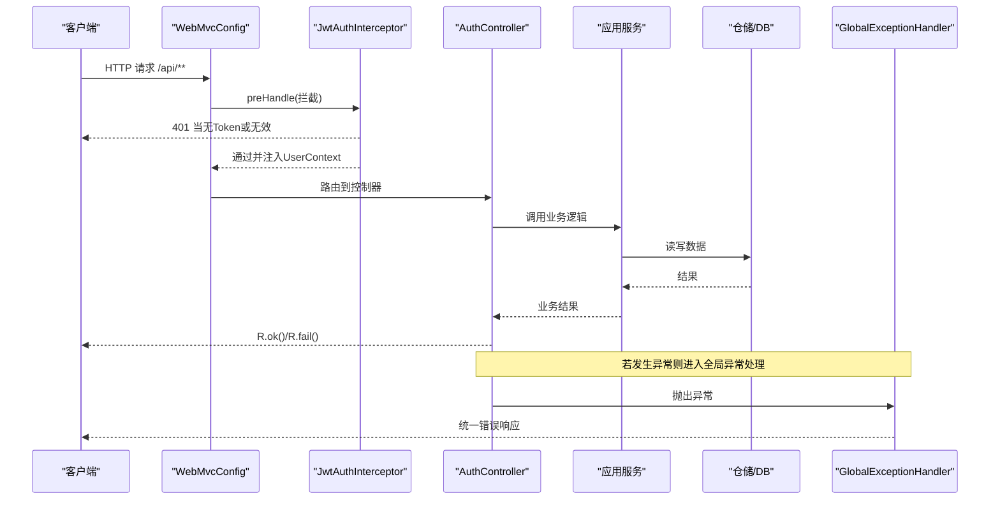
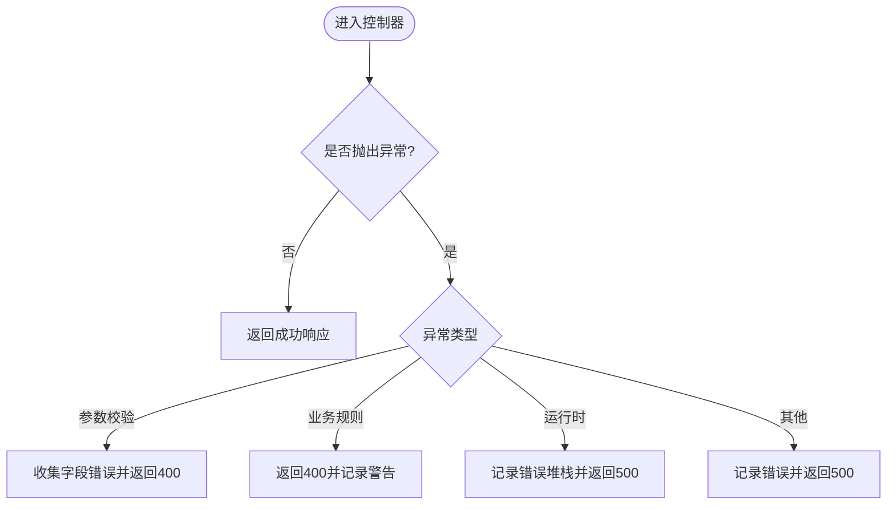
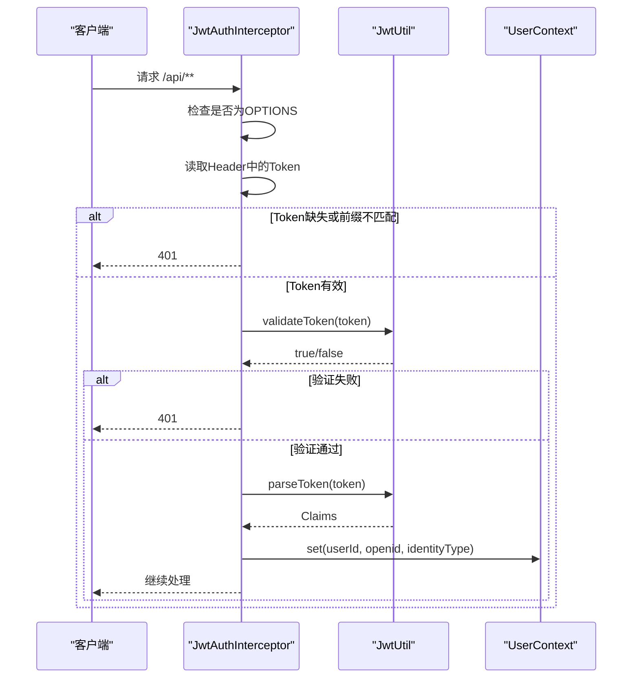
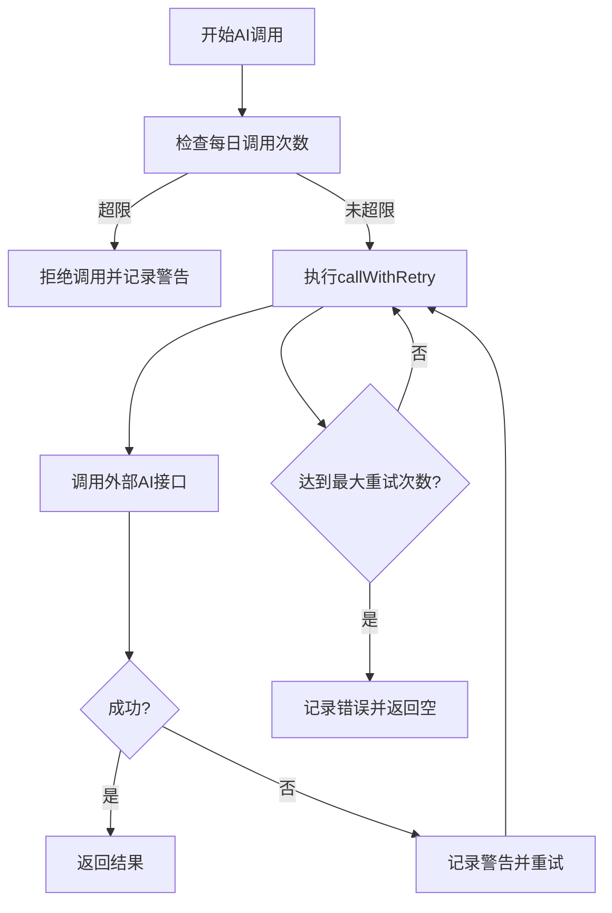
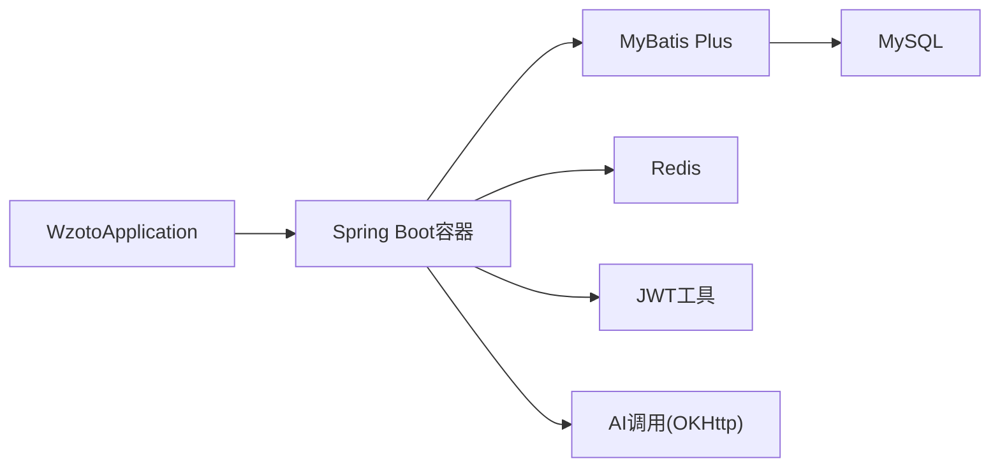

# 故障排查指南

<cite>
**本文引用的文件**
- [WzotoApplication.java](file://wzoto-backend/wzoto-interfaces/src/main/java/com/wzoto/WzotoApplication.java)
- [application.yml](file://wzoto-backend/wzoto-interfaces/src/main/resources/application.yml)
- [GlobalExceptionHandler.java](file://wzoto-backend/wzoto-interfaces/src/main/java/com/wzoto/interfaces/common/GlobalExceptionHandler.java)
- [R.java](file://wzoto-backend/wzoto-interfaces/src/main/java/com/wzoto/interfaces/common/R.java)
- [WebMvcConfig.java](file://wzoto-backend/wzoto-infrastructure/src/main/java/com/wzoto/infrastructure/config/WebMvcConfig.java)
- [JwtAuthInterceptor.java](file://wzoto-backend/wzoto-infrastructure/src/main/java/com/wzoto/infrastructure/interceptor/JwtAuthInterceptor.java)
- [AuthController.java](file://wzoto-backend/wzoto-interfaces/src/main/java/com/wzoto/interfaces/controller/AuthController.java)
- [AiServiceHelper.java](file://wzoto-backend/wzoto-infrastructure/src/main/java/com/wzoto/infrastructure/ai/AiServiceHelper.java)
- [build_log.txt](file://build_log.txt)
</cite>

## 目录
1. [简介](#简介)
2. [项目结构](#项目结构)
3. [核心组件](#核心组件)
4. [架构总览](#架构总览)
5. [详细组件分析](#详细组件分析)
6. [依赖关系分析](#依赖关系分析)
7. [性能注意事项](#性能注意事项)
8. [故障排查与处理流程](#故障排查与处理流程)
9. [监控与告警配置建议](#监控与告警配置建议)
10. [结论](#结论)
11. [附录：常见故障案例库](#附录：常见故障案例库)

## 简介
本指南面向wzoto项目的运维、研发与测试人员，聚焦于生产环境中的故障定位与恢复。内容覆盖服务启动失败、数据库连接异常、API接口错误、性能问题定位；提供日志分析方法（错误日志、性能日志、分布式追踪）；介绍调试工具使用（远程调试、内存分析、线程dump）；给出性能瓶颈定位方法（CPU占用过高、内存泄漏、数据库慢查询、网络延迟）；并提供监控告警配置建议与标准化故障处理流程（上报、应急响应、根因分析、预防措施），以及常见故障案例与解决方案库。

## 项目结构
wzoto后端采用分层架构：
- 接口层（interfaces）：控制器、统一返回体、全局异常处理、MVC配置等
- 应用层（application）：业务编排与服务装配
- 领域层（domain）：实体、值对象、仓储接口、领域服务
- 基础设施层（infrastructure）：数据访问实现、AI调用、JWT工具、拦截器、配置

**图表来源**
- [WzotoApplication.java:1-19](file://wzoto-backend/wzoto-interfaces/src/main/java/com/wzoto/WzotoApplication.java#L1-L19)
- [application.yml:1-51](file://wzoto-backend/wzoto-interfaces/src/main/resources/application.yml#L1-L51)

**章节来源**
- [WzotoApplication.java:1-19](file://wzoto-backend/wzoto-interfaces/src/main/java/com/wzoto/WzotoApplication.java#L1-L19)
- [application.yml:1-51](file://wzoto-backend/wzoto-interfaces/src/main/resources/application.yml#L1-L51)

## 核心组件
- 启动类：启用Spring Boot、MyBatis Mapper扫描、重试注解
- 全局异常处理器：统一捕获参数校验、业务异常、运行时异常并返回标准格式
- Web MVC配置：注册JWT拦截器、CORS跨域
- JWT认证拦截器：从请求头解析Token、注入用户上下文、未携带或无效时返回401
- 统一返回体：封装code/msg/data，便于前端统一处理
- AI服务辅助：限流、重试、超时、JSON字段提取

**章节来源**
- [WzotoApplication.java:1-19](file://wzoto-backend/wzoto-interfaces/src/main/java/com/wzoto/WzotoApplication.java#L1-L19)
- [GlobalExceptionHandler.java:1-67](file://wzoto-backend/wzoto-interfaces/src/main/java/com/wzoto/interfaces/common/GlobalExceptionHandler.java#L1-L67)
- [WebMvcConfig.java:1-42](file://wzoto-backend/wzoto-infrastructure/src/main/java/com/wzoto/infrastructure/config/WebMvcConfig.java#L1-L42)
- [JwtAuthInterceptor.java:1-65](file://wzoto-backend/wzoto-infrastructure/src/main/java/com/wzoto/infrastructure/interceptor/JwtAuthInterceptor.java#L1-L65)
- [R.java:1-42](file://wzoto-backend/wzoto-interfaces/src/main/java/com/wzoto/interfaces/common/R.java#L1-L42)
- [AiServiceHelper.java:1-66](file://wzoto-backend/wzoto-infrastructure/src/main/java/com/wzoto/infrastructure/ai/AiServiceHelper.java#L1-L66)

## 架构总览
下图展示了典型API请求在wzoto后端的流转路径，包括鉴权、业务处理、异常处理与返回。

**图表来源**
- [WebMvcConfig.java:21-31](file://wzoto-backend/wzoto-infrastructure/src/main/java/com/wzoto/infrastructure/config/WebMvcConfig.java#L21-L31)
- [JwtAuthInterceptor.java:27-58](file://wzoto-backend/wzoto-infrastructure/src/main/java/com/wzoto/infrastructure/interceptor/JwtAuthInterceptor.java#L27-L58)
- [AuthController.java:69-75](file://wzoto-backend/wzoto-interfaces/src/main/java/com/wzoto/interfaces/controller/AuthController.java#L69-L75)
- [GlobalExceptionHandler.java:18-66](file://wzoto-backend/wzoto-interfaces/src/main/java/com/wzoto/interfaces/common/GlobalExceptionHandler.java#L18-L66)

## 详细组件分析

### 全局异常处理与统一返回
- 作用：集中捕获参数校验、业务规则违反、运行时异常与系统异常，输出结构化错误信息
- 关键点：
  - 参数校验失败：收集字段错误并拼接为提示消息
  - 业务规则违反：返回400并记录警告日志
  - 运行时异常：记录错误堆栈并返回500
  - 系统异常兜底：返回通用错误消息
- 统一返回体：包含code、msg、data，便于前端统一处理

**图表来源**
- [GlobalExceptionHandler.java:18-66](file://wzoto-backend/wzoto-interfaces/src/main/java/com/wzoto/interfaces/common/GlobalExceptionHandler.java#L18-L66)
- [R.java:19-41](file://wzoto-backend/wzoto-interfaces/src/main/java/com/wzoto/interfaces/common/R.java#L19-L41)

**章节来源**
- [GlobalExceptionHandler.java:1-67](file://wzoto-backend/wzoto-interfaces/src/main/java/com/wzoto/interfaces/common/GlobalExceptionHandler.java#L1-L67)
- [R.java:1-42](file://wzoto-backend/wzoto-interfaces/src/main/java/com/wzoto/interfaces/common/R.java#L1-L42)

### JWT认证拦截流程
- 作用：对/api/**进行鉴权，排除登录相关路径
- 关键点：
  - 预检请求直接放行
  - 从Header读取Token，校验前缀与有效性
  - 解析Claims并注入UserContext
  - 失败时返回401并记录警告日志

**图表来源**
- [WebMvcConfig.java:21-31](file://wzoto-backend/wzoto-infrastructure/src/main/java/com/wzoto/infrastructure/config/WebMvcConfig.java#L21-L31)
- [JwtAuthInterceptor.java:27-58](file://wzoto-backend/wzoto-infrastructure/src/main/java/com/wzoto/infrastructure/interceptor/JwtAuthInterceptor.java#L27-L58)

**章节来源**
- [WebMvcConfig.java:1-42](file://wzoto-backend/wzoto-infrastructure/src/main/java/com/wzoto/infrastructure/config/WebMvcConfig.java#L1-L42)
- [JwtAuthInterceptor.java:1-65](file://wzoto-backend/wzoto-infrastructure/src/main/java/com/wzoto/infrastructure/interceptor/JwtAuthInterceptor.java#L1-L65)

### AI服务调用与容错
- 作用：统一AI请求处理，包含限流、重试、超时、JSON字段提取
- 关键点：
  - 每日调用次数限制
  - 带重试的调用封装
  - JSON字段提取工具方法

**图表来源**
- [AiServiceHelper.java:14-43](file://wzoto-backend/wzoto-infrastructure/src/main/java/com/wzoto/infrastructure/ai/AiServiceHelper.java#L14-L43)

**章节来源**
- [AiServiceHelper.java:1-66](file://wzoto-backend/wzoto-infrastructure/src/main/java/com/wzoto/infrastructure/ai/AiServiceHelper.java#L1-L66)

### 认证控制器示例
- 作用：微信登录、身份选择、手机号绑定、开发环境登录
- 关键点：
  - 参数校验与日志记录
  - 调用应用服务获取登录结果
  - 构造统一返回体

**章节来源**
- [AuthController.java:69-127](file://wzoto-backend/wzoto-interfaces/src/main/java/com/wzoto/interfaces/controller/AuthController.java#L69-L127)

## 依赖关系分析
- 启动依赖：Spring Boot、MyBatis Plus、MySQL驱动、Redis、JWT、OKHttp、JSON库
- 构建日志显示下载了Micrometer、Zipkin、OpenTelemetry等可观测性依赖，但当前应用未显式启用对应配置
- 配置项集中在application.yml中，包括服务器端口、数据源、Redis、MyBatis Plus、自定义wzoto配置（JWT、微信、AI）、日志级别

**图表来源**
- [application.yml:6-17](file://wzoto-backend/wzoto-interfaces/src/main/resources/application.yml#L6-L17)
- [build_log.txt:1-45](file://build_log.txt#L1-L45)

**章节来源**
- [application.yml:1-51](file://wzoto-backend/wzoto-interfaces/src/main/resources/application.yml#L1-L51)
- [build_log.txt:1-45](file://build_log.txt#L1-L45)

## 性能注意事项
- 日志级别：当前设置为debug，生产环境建议调整为info或warn以减少I/O开销
- MyBatis SQL日志：已启用stdout输出，生产环境建议关闭或改为文件输出并控制级别
- 重试机制：AI调用内置重试，需关注外部API限流与超时策略
- 缓存：Redis已配置但未在代码中广泛使用，建议在热点读场景引入缓存以降低数据库压力
- 连接池：数据源未显式配置连接池参数，建议使用HikariCP并设置合理的连接数、超时时间

[本节为通用指导，无需特定文件引用]

## 故障排查与处理流程

### 常见问题诊断

#### 服务启动失败
- 可能原因：
  - 端口占用或上下文路径冲突
  - 数据库连接失败（地址、用户名、密码、时区、SSL）
  - Redis连接失败（地址、端口、密码）
  - 环境变量缺失（如JWT_SECRET、WECHAT_APP_ID、AI_API_KEY）
- 排查步骤：
  - 查看启动日志中的异常堆栈
  - 检查application.yml中的server、spring.datasource、spring.data.redis配置
  - 确认环境变量是否正确注入
  - 本地先连通MySQL与Redis，再启动服务

**章节来源**
- [application.yml:1-17](file://wzoto-backend/wzoto-interfaces/src/main/resources/application.yml#L1-L17)

#### 数据库连接异常
- 可能原因：
  - 数据库不可达或权限不足
  - URL参数不正确（时区、字符集、SSL）
  - 连接池耗尽或超时
- 排查步骤：
  - 使用命令行或客户端工具直连数据库验证连通性
  - 检查日志中的SQL执行与异常信息
  - 调整连接池参数与超时时间
  - 观察慢查询与锁等待

**章节来源**
- [application.yml:6-17](file://wzoto-backend/wzoto-interfaces/src/main/resources/application.yml#L6-L17)

#### API接口错误
- 可能原因：
  - 参数校验失败
  - 业务规则违反
  - 运行时异常（空指针、越界等）
  - 系统异常（依赖服务不可用）
- 排查步骤：
  - 查看全局异常处理器输出的日志
  - 检查请求参数与Header（特别是JWT Token）
  - 复现请求并抓取完整响应体
  - 根据错误码定位具体模块

**章节来源**
- [GlobalExceptionHandler.java:18-66](file://wzoto-backend/wzoto-interfaces/src/main/java/com/wzoto/interfaces/common/GlobalExceptionHandler.java#L18-L66)
- [R.java:19-41](file://wzoto-backend/wzoto-interfaces/src/main/java/com/wzoto/interfaces/common/R.java#L19-L41)

#### 性能问题定位
- CPU占用过高：
  - 使用top/htop定位进程，jstack生成线程dump，分析阻塞与死循环
  - 结合APM或火焰图定位热点方法
- 内存泄漏：
  - 使用jmap导出堆快照，MAT分析大对象与GC情况
  - 关注集合增长、静态变量持有、监听器未注销
- 数据库慢查询：
  - 开启慢查询日志，分析执行计划与索引
  - 优化SQL与分页策略
- 网络延迟：
  - 使用tcpdump/wireshark抓包，检查DNS、TCP握手、TLS握手耗时
  - 检查外部API超时与重试策略

[本节为通用指导，无需特定文件引用]

### 日志分析方法
- 错误日志分析：
  - 关注WARN与ERROR级别日志
  - 结合堆栈信息与请求上下文（userId、uri）
- 性能日志分析：
  - 统计接口耗时、数据库执行时间、外部API调用耗时
  - 关注重试与限流日志
- 分布式追踪分析：
  - 基于构建日志可见Micrometer、Zipkin、OpenTelemetry依赖
  - 建议启用链路追踪以串联多服务调用

**章节来源**
- [build_log.txt:1-45](file://build_log.txt#L1-L45)

### 调试工具使用
- 远程调试：
  - JVM启动参数添加-agentlib:jdwp
  - IDE配置远程调试并连接目标进程
- 内存分析：
  - jmap导出堆快照，使用MAT或JProfiler分析
- 线程dump分析：
  - jstack生成线程状态，分析阻塞、死锁、频繁GC

[本节为通用指导，无需特定文件引用]

### 监控与告警配置建议
- 关键指标监控：
  - JVM：堆内存、GC次数与耗时、线程数
  - 应用：QPS、RT、错误率、慢请求比例
  - 数据库：连接数、慢查询数、锁等待
  - 外部API：成功率、延迟、限流触发次数
- 异常告警规则：
  - 错误率突增、RT飙升、OOM风险、数据库连接池耗尽
- 告警通知配置：
  - 接入企业微信/钉钉/邮件/短信通道
  - 分级告警（P0/P1/P2）与升级策略

[本节为通用指导，无需特定文件引用]

### 故障处理流程
- 问题上报：
  - 明确现象、影响范围、发生时间、相关请求ID
- 应急响应：
  - 快速止血（降级、熔断、回滚、扩容）
- 根因分析：
  - 日志、链路、指标、变更历史综合分析
- 预防措施：
  - 完善监控与告警、增加压测与演练、优化代码与配置

[本节为通用指导，无需特定文件引用]

## 监控与告警配置建议
- 建议启用Micrometer与Prometheus/Grafana采集指标
- 接入Zipkin或OpenTelemetry进行链路追踪
- 配置关键阈值告警（错误率、RT、内存、数据库连接）
- 建立值班与升级机制，确保及时响应

[本节为通用指导，无需特定文件引用]

## 结论
wzoto后端具备清晰的层次结构与完善的异常处理机制。通过合理配置日志、监控与告警，结合标准化的故障处理流程，可有效提升问题定位效率与系统稳定性。建议在生产环境逐步完善可观测性与弹性能力，降低故障影响面。

[本节为总结，无需特定文件引用]

## 附录：常见故障案例库

### 案例一：服务启动失败（数据库连接异常）
- 现象：启动时报数据库连接失败
- 可能原因：URL参数、用户名/密码、时区、SSL配置错误
- 处理步骤：
  - 核对application.yml中的数据源配置
  - 本地直连数据库验证连通性
  - 修正配置后重启服务

**章节来源**
- [application.yml:6-17](file://wzoto-backend/wzoto-interfaces/src/main/resources/application.yml#L6-L17)

### 案例二：API返回401未授权
- 现象：调用受保护接口返回401
- 可能原因：未携带JWT Token或Token无效
- 处理步骤：
  - 检查请求Header中的Authorization字段
  - 确认登录流程正确获取并传递Token
  - 查看JwtAuthInterceptor日志定位失败原因

**章节来源**
- [JwtAuthInterceptor.java:27-58](file://wzoto-backend/wzoto-infrastructure/src/main/java/com/wzoto/infrastructure/interceptor/JwtAuthInterceptor.java#L27-L58)

### 案例三：AI调用失败或受限
- 现象：AI功能不可用或频繁失败
- 可能原因：每日调用次数超限、外部API超时、网络异常
- 处理步骤：
  - 检查AiServiceHelper的限流与重试日志
  - 确认AI配置（base-url、api-key、model）
  - 必要时调整重试次数与超时策略

**章节来源**
- [AiServiceHelper.java:14-43](file://wzoto-backend/wzoto-infrastructure/src/main/java/com/wzoto/infrastructure/ai/AiServiceHelper.java#L14-L43)

### 案例四：参数校验失败
- 现象：接口返回400并提示字段错误
- 可能原因：请求体缺少必填字段或格式不正确
- 处理步骤：
  - 查看GlobalExceptionHandler收集的字段错误
  - 修正前端传参并重新提交

**章节来源**
- [GlobalExceptionHandler.java:32-41](file://wzoto-backend/wzoto-interfaces/src/main/java/com/wzoto/interfaces/common/GlobalExceptionHandler.java#L32-L41)