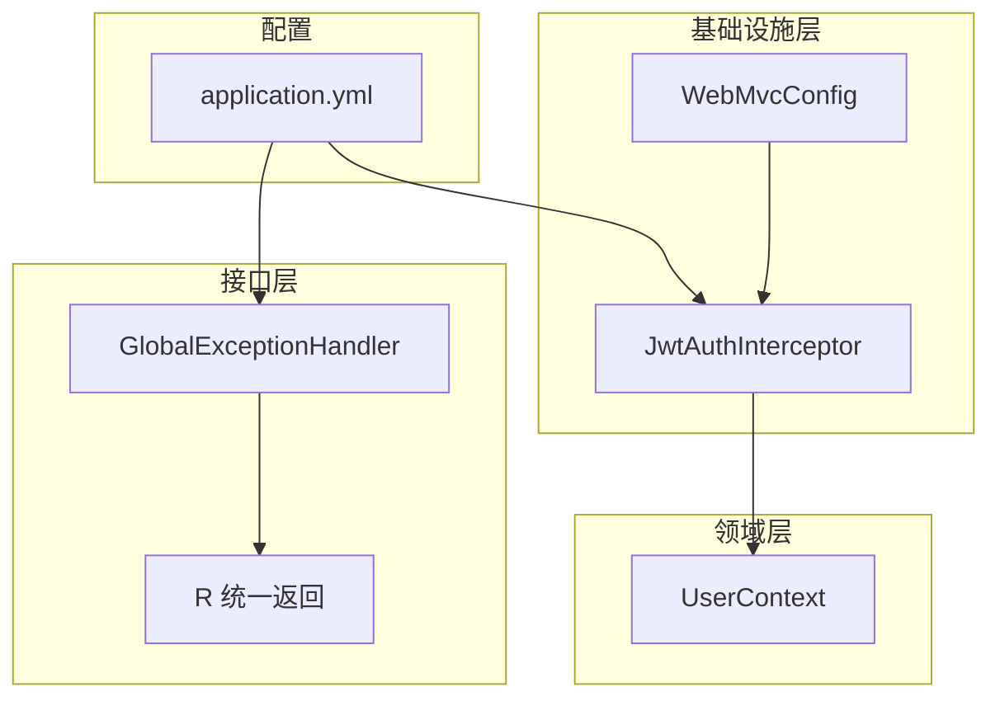
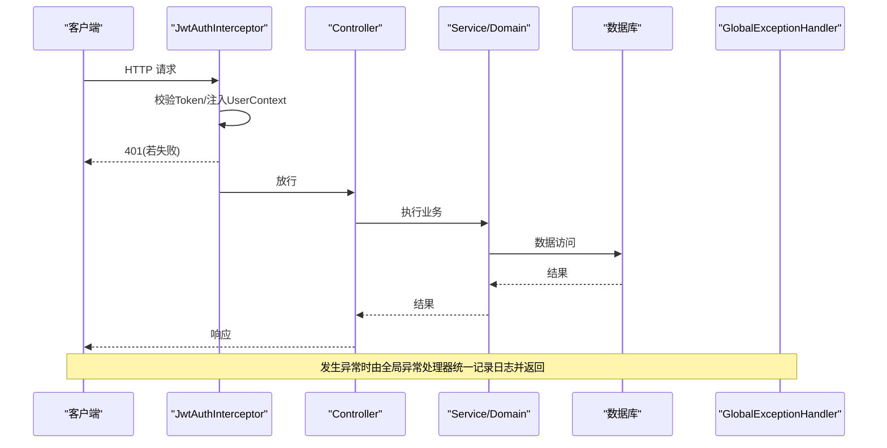
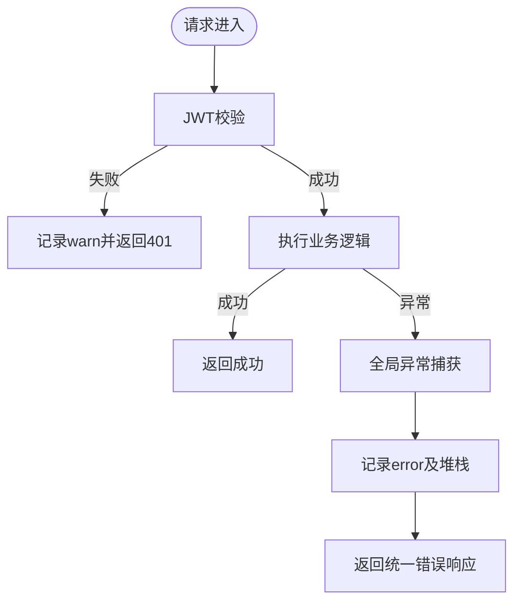
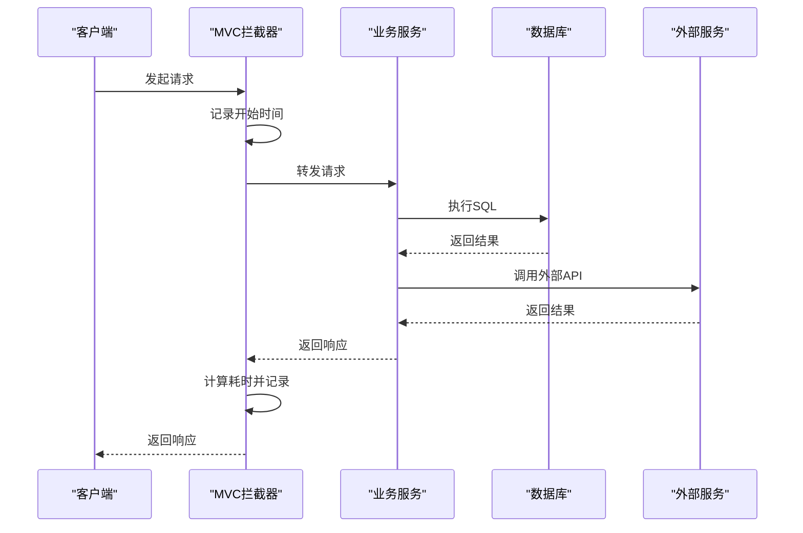
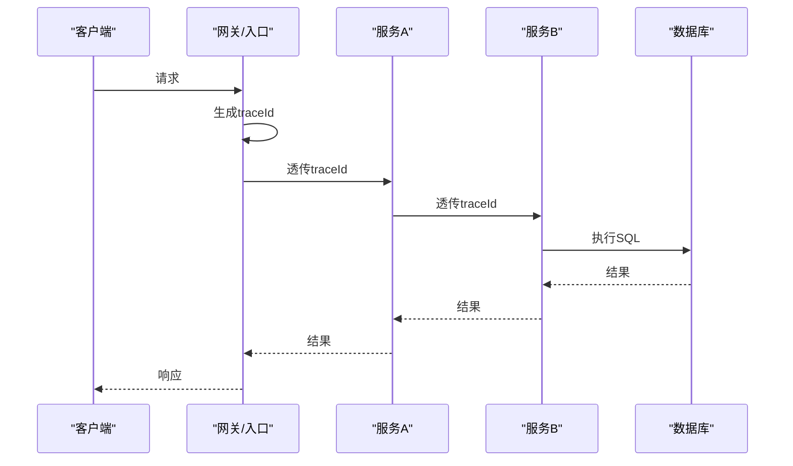
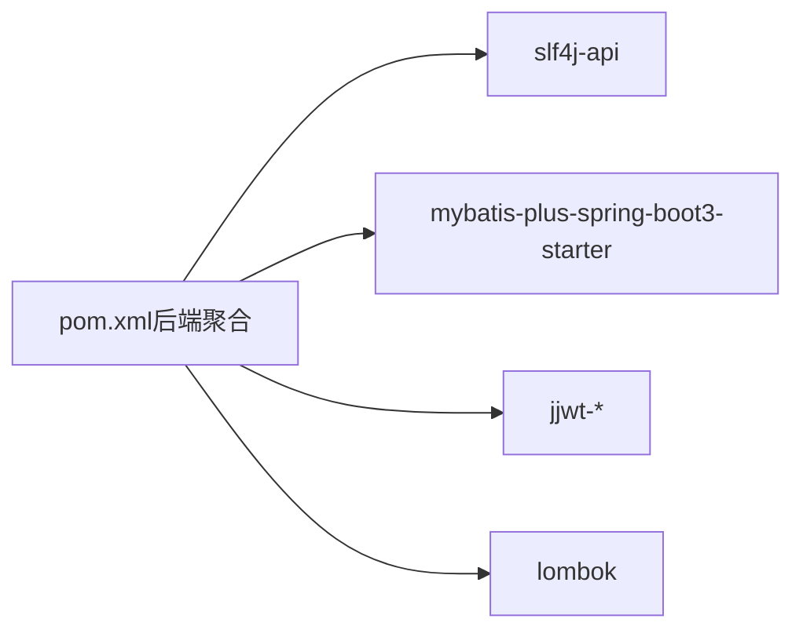

# 日志分析

<cite>
**本文引用的文件**
- [application.yml](file://wzoto-backend/wzoto-interfaces/src/main/resources/application.yml)
- [GlobalExceptionHandler.java](file://wzoto-backend/wzoto-interfaces/src/main/java/com/wzoto/interfaces/common/GlobalExceptionHandler.java)
- [R.java](file://wzoto-backend/wzoto-interfaces/src/main/java/com/wzoto/interfaces/common/R.java)
- [JwtAuthInterceptor.java](file://wzoto-backend/wzoto-infrastructure/src/main/java/com/wzoto/infrastructure/interceptor/JwtAuthInterceptor.java)
- [WebMvcConfig.java](file://wzoto-backend/wzoto-infrastructure/src/main/java/com/wzoto/infrastructure/config/WebMvcConfig.java)
- [UserContext.java](file://wzoto-backend/wzoto-domain/src/main/java/com/wzoto/domain/context/UserContext.java)
- [pom.xml（后端聚合）](file://wzoto-backend/pom.xml)
- [track.js](file://wzoto-frontend/src/utils/track.js)
</cite>

## 目录
1. [简介](#简介)
2. [项目结构](#项目结构)
3. [核心组件](#核心组件)
4. [架构总览](#架构总览)
5. [详细组件分析](#详细组件分析)
6. [依赖关系分析](#依赖关系分析)
7. [性能考量](#性能考量)
8. [故障排查指南](#故障排查指南)
9. [结论](#结论)
10. [附录](#附录)

## 简介
本指南面向“学霸到家”教育平台，提供一套完整的日志分析与治理方案。内容覆盖：
- 日志配置方法：日志级别、日志格式、日志文件轮转
- 错误日志分析：异常堆栈、业务错误追踪、用户行为分析
- 性能日志分析：请求耗时统计、数据库执行时间、外部调用延迟
- 分布式追踪：链路ID生成、跨服务追踪、上下文传递
- 日志收集与分析工具：ELK栈配置、日志聚合、实时告警
- 最佳实践与排障技巧

## 项目结构
后端采用分层架构：接口层（interfaces）、应用层（application）、领域层（domain）、基础设施层（infrastructure）。当前仓库已具备基础的日志能力（SLF4J + Logback），并可通过配置文件快速调整日志级别；同时提供了全局异常处理、JWT拦截器与用户上下文等关键扩展点，便于统一接入性能与追踪日志。

图表来源
- [application.yml:1-51](file://wzoto-backend/wzoto-interfaces/src/main/resources/application.yml#L1-L51)
- [GlobalExceptionHandler.java:1-67](file://wzoto-backend/wzoto-interfaces/src/main/java/com/wzoto/interfaces/common/GlobalExceptionHandler.java#L1-L67)
- [JwtAuthInterceptor.java:1-65](file://wzoto-backend/wzoto-infrastructure/src/main/java/com/wzoto/infrastructure/interceptor/JwtAuthInterceptor.java#L1-L65)
- [WebMvcConfig.java:1-42](file://wzoto-backend/wzoto-infrastructure/src/main/java/com/wzoto/infrastructure/config/WebMvcConfig.java#L1-L42)
- [UserContext.java:1-56](file://wzoto-backend/wzoto-domain/src/main/java/com/wzoto/domain/context/UserContext.java#L1-L56)

章节来源
- [application.yml:1-51](file://wzoto-backend/wzoto-interfaces/src/main/resources/application.yml#L1-L51)
- [pom.xml（后端聚合）:1-126](file://wzoto-backend/pom.xml#L1-L126)

## 核心组件
- 日志框架与级别
  - 使用 SLF4J 作为门面，Spring Boot 默认集成 Logback 输出。
  - 通过 application.yml 的 logging.level 控制包级日志级别，当前对 com.wzoto 与 MyBatis-Plus 开启 debug。
- 全局异常处理器
  - 统一捕获参数校验、业务规则违反、运行时异常等，记录 warn/error 日志并返回统一结果对象 R。
- JWT 认证拦截器
  - 在请求进入控制器前解析 Token，注入 UserContext，并对未携带或无效 Token 记录 warn 日志。
- Web MVC 配置
  - 注册 JWT 拦截器到 /api/**，排除登录相关路径，支持 CORS。
- 用户上下文
  - 基于 ThreadLocal 保存当前用户信息，供各层复用，便于在日志中附加 userId、identityType 等上下文字段。
- 前端埋点
  - 提供 track.js，用于页面浏览与事件埋点（当前仅控制台输出，可替换为上报接口）。

章节来源
- [application.yml:48-51](file://wzoto-backend/wzoto-interfaces/src/main/resources/application.yml#L48-L51)
- [GlobalExceptionHandler.java:1-67](file://wzoto-backend/wzoto-interfaces/src/main/java/com/wzoto/interfaces/common/GlobalExceptionHandler.java#L1-L67)
- [JwtAuthInterceptor.java:1-65](file://wzoto-backend/wzoto-infrastructure/src/main/java/com/wzoto/infrastructure/interceptor/JwtAuthInterceptor.java#L1-L65)
- [WebMvcConfig.java:1-42](file://wzoto-backend/wzoto-infrastructure/src/main/java/com/wzoto/infrastructure/config/WebMvcConfig.java#L1-L42)
- [UserContext.java:1-56](file://wzoto-backend/wzoto-domain/src/main/java/com/wzoto/domain/context/UserContext.java#L1-L56)
- [track.js:1-14](file://wzoto-frontend/src/utils/track.js#L1-L14)

## 架构总览
下图展示了从请求进入、认证、业务处理到异常处理的完整链路，以及日志落点位置。

图表来源
- [JwtAuthInterceptor.java:27-58](file://wzoto-backend/wzoto-infrastructure/src/main/java/com/wzoto/infrastructure/interceptor/JwtAuthInterceptor.java#L27-L58)
- [GlobalExceptionHandler.java:18-66](file://wzoto-backend/wzoto-interfaces/src/main/java/com/wzoto/interfaces/common/GlobalExceptionHandler.java#L18-L66)

## 详细组件分析

### 日志配置方法
- 日志级别设置
  - 通过 application.yml 的 logging.level 指定包级别日志级别。当前对 com.wzoto 与 MyBatis-Plus 设置为 debug，便于开发调试。
  - 建议：生产环境将业务包调整为 info 或 warn，仅在需要时临时提升为 debug。
- 日志格式定制
  - Spring Boot 默认使用 Logback 输出结构化控制台日志。可在 resources 下添加 logback-spring.xml 自定义 pattern（如包含 traceId、userId、耗时等）。
- 日志文件轮转
  - 建议在 logback 中按天滚动（rolling policy）与大小限制，避免磁盘占满；可按模块拆分文件，便于检索。
- 数据库 SQL 日志
  - 当前通过 mybatis-plus.configuration.log-impl 启用 SQL 输出至 stdout，适合本地调试。生产建议关闭或改为异步输出。

章节来源
- [application.yml:19-23](file://wzoto-backend/wzoto-interfaces/src/main/resources/application.yml#L19-L23)
- [application.yml:48-51](file://wzoto-backend/wzoto-interfaces/src/main/resources/application.yml#L48-L51)

### 错误日志分析
- 异常堆栈分析
  - GlobalExceptionHandler 对多种异常进行捕获并记录 warn/error，包含堆栈信息，便于定位问题根因。
  - 建议：在 error 日志中附带 traceId、userId、请求 URI、入参摘要等上下文。
- 业务错误追踪
  - 对于业务规则违反（如状态不合法、权限不足），使用 warn 级别并返回明确错误码与消息，便于前端提示与审计。
- 用户行为分析
  - 结合 UserContext 中的 userId、identityType，在关键操作处记录行为日志（如登录、下单、学习进度更新）。
  - 前端 track.js 提供基础埋点入口，后续可对接上报接口形成用户行为日志。

图表来源
- [JwtAuthInterceptor.java:27-58](file://wzoto-backend/wzoto-infrastructure/src/main/java/com/wzoto/infrastructure/interceptor/JwtAuthInterceptor.java#L27-L58)
- [GlobalExceptionHandler.java:18-66](file://wzoto-backend/wzoto-interfaces/src/main/java/com/wzoto/interfaces/common/GlobalExceptionHandler.java#L18-L66)
- [R.java:1-43](file://wzoto-backend/wzoto-interfaces/src/main/java/com/wzoto/interfaces/common/R.java#L1-L43)

章节来源
- [GlobalExceptionHandler.java:1-67](file://wzoto-backend/wzoto-interfaces/src/main/java/com/wzoto/interfaces/common/GlobalExceptionHandler.java#L1-L67)
- [R.java:1-43](file://wzoto-backend/wzoto-interfaces/src/main/java/com/wzoto/interfaces/common/R.java#L1-L43)
- [UserContext.java:1-56](file://wzoto-backend/wzoto-domain/src/main/java/com/wzoto/domain/context/UserContext.java#L1-L56)
- [track.js:1-14](file://wzoto-frontend/src/utils/track.js#L1-L14)

### 性能日志分析
- 请求耗时统计
  - 建议在 WebMvcConfig 中增加通用拦截器，在 preHandle 记录开始时间，afterCompletion 计算耗时并输出 info/warn（超过阈值告警）。
  - 可将 traceId、userId、URI、耗时、状态码写入同一行日志，便于 ELK 聚合分析。
- 数据库执行时间
  - 当前 MyBatis-Plus 已开启 SQL 输出（stdout），便于本地调试。生产建议关闭或异步化，并通过 AOP 在 Repository 层记录慢查询。
- 外部调用延迟
  - 对 AI 调用、微信接口等外部依赖，建议在调用前后记录耗时与结果，失败时记录重试次数与错误码。

[此图为概念流程示意，无需源码映射]

### 分布式追踪方法
- 链路ID生成
  - 建议在网关或首个服务生成唯一 traceId，并放入请求头（如 X-Trace-Id），后续所有日志均携带该 ID。
- 跨服务追踪
  - 服务间调用需透传 traceId 与用户上下文（userId、openid、identityType），可使用 Feign/HTTP 客户端拦截器自动注入。
- 上下文传递
  - 当前 UserContext 基于 ThreadLocal，适用于单线程请求链路。多线程场景建议使用 MDC 或 Tracing Context（如 Micrometer Tracing/OpenTelemetry）确保上下文正确传播。

[此图为概念流程示意，无需源码映射]

### 日志收集和分析工具
- ELK 栈配置
  - 服务端：将日志输出为 JSON 格式（logback 配置），便于 Elasticsearch 索引与 Kibana 可视化。
  - 采集端：Filebeat/Fluent Bit 采集容器或主机日志，转发至 Logstash/Elasticsearch。
- 日志聚合
  - 按服务名、环境、traceId、userId 等维度建立索引策略，保留合理生命周期。
- 实时告警
  - 基于 Kibana 或 Prometheus+Alertmanager，对错误率、慢请求、特定异常关键字设置阈值告警。

[本节为通用实践说明，不直接引用具体代码文件]

## 依赖关系分析
后端聚合 POM 引入了 SLF4J API，Spring Boot 默认引入 Logback 实现；MyBatis-Plus 提供 SQL 日志输出；JWT 用于鉴权与上下文注入。这些依赖共同构成了当前日志与追踪的基础。

图表来源
- [pom.xml（后端聚合）:94-104](file://wzoto-backend/pom.xml#L94-L104)
- [pom.xml（后端聚合）:58-90](file://wzoto-backend/pom.xml#L58-L90)

章节来源
- [pom.xml（后端聚合）:1-126](file://wzoto-backend/pom.xml#L1-L126)

## 性能考量
- 日志级别与吞吐
  - 生产环境避免全量 debug，减少 IO 压力；对高频路径使用采样或条件日志。
- 异步与缓冲
  - 使用异步 Appender 与缓冲队列降低主线程阻塞风险。
- 敏感信息脱敏
  - 对密码、手机号、身份证号等敏感字段进行脱敏后再输出。
- 数据库日志
  - 生产关闭 SQL 输出或改为异步；慢查询单独采集。
- 外部调用
  - 对超时、重试、熔断等场景记录必要指标，避免重复日志风暴。

[本节为通用指导，不直接引用具体代码文件]

## 故障排查指南
- 常见问题定位
  - 认证失败：检查 JwtAuthInterceptor 的 warn 日志，确认 Header 是否携带正确的 Token。
  - 参数校验失败：查看 GlobalExceptionHandler 的 warn 日志，定位字段与错误原因。
  - 运行时异常：通过 error 日志与堆栈快速定位问题代码。
- 快速命令
  - 过滤错误：grep -i "error" 应用日志
  - 关联追踪：按 traceId 筛选一次请求的全链路日志
  - 慢请求：按耗时阈值筛选并分析热点接口
- 建议改进
  - 统一日志格式（JSON），便于机器解析
  - 增加 traceId、userId、URI、耗时、状态码等关键字段
  - 对关键业务流程增加结构化日志埋点

章节来源
- [JwtAuthInterceptor.java:27-58](file://wzoto-backend/wzoto-infrastructure/src/main/java/com/wzoto/infrastructure/interceptor/JwtAuthInterceptor.java#L27-L58)
- [GlobalExceptionHandler.java:18-66](file://wzoto-backend/wzoto-interfaces/src/main/java/com/wzoto/interfaces/common/GlobalExceptionHandler.java#L18-L66)

## 结论
本项目已具备基础的日志能力与异常处理机制，配合 application.yml 的日志级别控制与全局异常处理器，能够快速定位常见错误。建议在此基础上完善：
- 统一的 traceId 与上下文传递
- 请求耗时与慢查询统计
- 结构化日志与 ELK 采集
- 生产环境的日志级别与轮转策略
通过这些改进，可显著提升可观测性与排障效率。

## 附录
- 前端埋点
  - 当前 track.js 仅输出控制台日志，后续可替换为上报接口，形成用户行为日志。
- 配置参考
  - 在 application.yml 中按需调整 logging.level
  - 在 logback-spring.xml 中定义日志格式与轮转策略

章节来源
- [track.js:1-14](file://wzoto-frontend/src/utils/track.js#L1-L14)
- [application.yml:48-51](file://wzoto-backend/wzoto-interfaces/src/main/resources/application.yml#L48-L51)