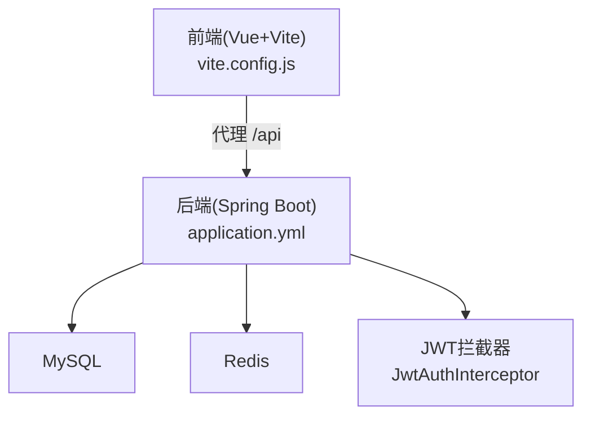
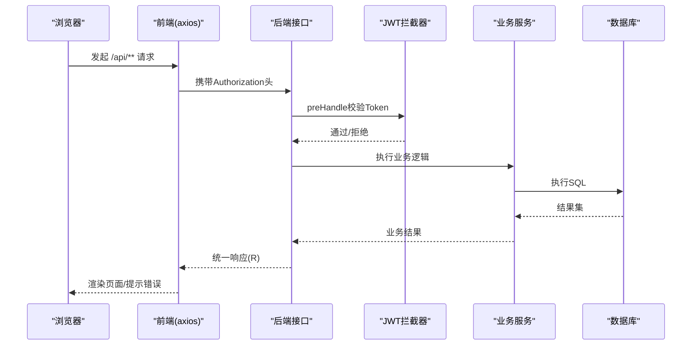
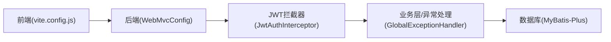

# 调试工具

<cite>
**本文引用的文件**
- [application.yml](file://wzoto-backend/wzoto-interfaces/src/main/resources/application.yml)
- [pom.xml](file://wzoto-backend/pom.xml)
- [vite.config.js](file://wzoto-frontend/vite.config.js)
- [package.json](file://wzoto-frontend/package.json)
- [WebMvcConfig.java](file://wzoto-backend/wzoto-infrastructure/src/main/java/com/wzoto/infrastructure/config/WebMvcConfig.java)
- [JwtAuthInterceptor.java](file://wzoto-backend/wzoto-infrastructure/src/main/java/com/wzoto/infrastructure/interceptor/JwtAuthInterceptor.java)
- [GlobalExceptionHandler.java](file://wzoto-backend/wzoto-interfaces/src/main/java/com/wzoto/interfaces/common/GlobalExceptionHandler.java)
- [request.js](file://wzoto-frontend/src/utils/request.js)
- [track.js](file://wzoto-frontend/src/utils/track.js)
</cite>

## 目录
1. [简介](#简介)
2. [项目结构](#项目结构)
3. [核心组件](#核心组件)
4. [架构总览](#架构总览)
5. [详细组件分析](#详细组件分析)
6. [依赖关系分析](#依赖关系分析)
7. [性能注意事项](#性能注意事项)
8. [故障排查指南](#故障排查指南)
9. [结论](#结论)
10. [附录](#附录)

## 简介
本指南面向Wzoto项目的开发与运维人员，提供从IDE本地调试到生产环境问题定位的全链路调试方法。内容覆盖：
- IDE调试配置：远程调试、断点技巧、变量观察
- 生产环境调试：热部署、线上问题定位、内存dump分析
- 性能分析：线程dump、CPU剖析、内存泄漏检测
- 数据库调试：SQL执行计划、索引优化、慢查询定位
- 网络调试：HTTP抓包、API测试、WebSocket调试
- 前端调试：Vue DevTools、网络请求分析、组件状态检查

## 项目结构
本项目采用前后端分离与分层架构：
- 后端：Spring Boot 3 + MyBatis-Plus，模块包含domain、infrastructure、application、interfaces
- 前端：Vue 3 + Vite，使用Element Plus、Pinia、Axios等
- 配置：通过application.yml管理服务端口、数据源、日志级别；Vite代理将/api转发至后端

图表来源
- [vite.config.js:12-18](file://wzoto-frontend/vite.config.js#L12-L18)
- [application.yml:1-17](file://wzoto-backend/wzoto-interfaces/src/main/resources/application.yml#L1-L17)
- [JwtAuthInterceptor.java:27-58](file://wzoto-backend/wzoto-infrastructure/src/main/java/com/wzoto/infrastructure/interceptor/JwtAuthInterceptor.java#L27-L58)

章节来源
- [vite.config.js:12-18](file://wzoto-frontend/vite.config.js#L12-L18)
- [application.yml:1-17](file://wzoto-backend/wzoto-interfaces/src/main/resources/application.yml#L1-L17)

## 核心组件
- Web MVC与拦截器：注册JWT认证拦截器，统一CORS跨域策略
- 全局异常处理：统一错误码与日志输出，便于线上问题追踪
- 前端请求封装：Axios拦截器自动注入Token、统一错误提示与跳转
- 日志与SQL：MyBatis-Plus输出SQL到控制台，便于开发期排查

章节来源
- [WebMvcConfig.java:21-41](file://wzoto-backend/wzoto-infrastructure/src/main/java/com/wzoto/infrastructure/config/WebMvcConfig.java#L21-L41)
- [JwtAuthInterceptor.java:27-58](file://wzoto-backend/wzoto-infrastructure/src/main/java/com/wzoto/infrastructure/interceptor/JwtAuthInterceptor.java#L27-L58)
- [GlobalExceptionHandler.java:18-66](file://wzoto-backend/wzoto-interfaces/src/main/java/com/wzoto/interfaces/common/GlobalExceptionHandler.java#L18-L66)
- [request.js:13-55](file://wzoto-frontend/src/utils/request.js#L13-L55)
- [application.yml:19-23](file://wzoto-backend/wzoto-interfaces/src/main/resources/application.yml#L19-L23)

## 架构总览
下图展示了典型请求在前后端的流转路径，包括鉴权、业务处理、异常处理与响应返回。

图表来源
- [request.js:13-55](file://wzoto-frontend/src/utils/request.js#L13-L55)
- [WebMvcConfig.java:21-30](file://wzoto-backend/wzoto-infrastructure/src/main/java/com/wzoto/infrastructure/config/WebMvcConfig.java#L21-L30)
- [JwtAuthInterceptor.java:27-58](file://wzoto-backend/wzoto-infrastructure/src/main/java/com/wzoto/infrastructure/interceptor/JwtAuthInterceptor.java#L27-L58)
- [GlobalExceptionHandler.java:18-66](file://wzoto-backend/wzoto-interfaces/src/main/java/com/wzoto/interfaces/common/GlobalExceptionHandler.java#L18-L66)

## 详细组件分析

### 后端调试（IDE与远程）
- 本地调试
  - 启动参数：确保JDK版本与项目一致（Java 21），端口默认8080
  - 日志级别：application.yml中com.wzoto与mybatis-plus已设置为debug，便于查看SQL与业务日志
  - SQL输出：MyBatis-Plus启用StdOutImpl，控制台可直接看到SQL语句
- 远程调试
  - 以调试模式启动应用，开启JDWP监听端口（如5005），IDE配置Remote JVM Debug并连接该端口
  - 在生产或预发环境建议仅对受控入口开放调试端口，或使用跳板机访问
- 断点与变量
  - 在Controller/Service关键分支设置条件断点，结合UserContext中的userId/identityType缩小范围
  - 利用日志上下文（URI、用户标识）快速关联堆栈与请求

章节来源
- [application.yml:48-51](file://wzoto-backend/wzoto-interfaces/src/main/resources/application.yml#L48-L51)
- [application.yml:19-23](file://wzoto-backend/wzoto-interfaces/src/main/resources/application.yml#L19-L23)
- [JwtAuthInterceptor.java:48-58](file://wzoto-backend/wzoto-infrastructure/src/main/java/com/wzoto/infrastructure/interceptor/JwtAuthInterceptor.java#L48-L58)

### 生产环境调试
- 热部署
  - 开发阶段可使用Spring Boot DevTools提升迭代效率；生产环境不建议开启热部署
- 线上问题定位
  - 通过全局异常处理器记录错误堆栈与请求信息，配合日志系统集中收集
  - 针对鉴权失败、参数校验失败等高频问题，优先检查Header、Token与入参
- 内存dump分析
  - 触发方式：OOM时自动生成、jmap -dump或Arthas heapdump
  - 分析要点：对象保留树、大对象、GC根节点、频繁分配热点类
  - 建议：结合线程dump与CPU profiling交叉验证

章节来源
- [GlobalExceptionHandler.java:18-66](file://wzoto-backend/wzoto-interfaces/src/main/java/com/wzoto/interfaces/common/GlobalExceptionHandler.java#L18-L66)

### 性能分析工具
- 线程dump
  - 使用jstack或Arthas thread命令导出线程快照，关注阻塞、死锁、长时间等待的线程
- CPU剖析
  - 使用async-profiler或Arthas profiler采集CPU热点，定位热点方法与调用链
- 内存泄漏检测
  - 结合heapdump与MAT/VisualVM分析对象引用链，定位未释放资源或缓存膨胀

[本节为通用指导，不直接分析具体文件]

### 数据库调试
- SQL执行计划
  - 使用EXPLAIN/EXPLAIN ANALYZE分析慢查询的执行计划，关注全表扫描、临时表、文件排序
- 索引优化建议
  - 根据WHERE/JOIN/ORDER BY字段评估复合索引，避免过度索引导致写入退化
- 慢查询定位
  - 开启慢查询日志，结合MyBatis-Plus控制台SQL输出，定位慢SQL与参数
  - 注意分页与过滤条件是否命中索引

章节来源
- [application.yml:19-23](file://wzoto-backend/wzoto-interfaces/src/main/resources/application.yml#L19-L23)

### 网络调试
- HTTP请求抓包
  - 使用浏览器开发者工具Network面板或Charles/Fiddler抓包，核对请求头、Cookie、跨域响应头
- API接口测试
  - 使用Postman/Apifox构造请求，模拟不同身份与Token场景，验证鉴权与权限控制
- WebSocket调试
  - 若存在WS通道，可在浏览器Network的WS标签页查看消息收发与重连逻辑

章节来源
- [WebMvcConfig.java:33-41](file://wzoto-backend/wzoto-infrastructure/src/main/java/com/wzoto/infrastructure/config/WebMvcConfig.java#L33-L41)
- [request.js:13-55](file://wzoto-frontend/src/utils/request.js#L13-L55)

### 前端调试技巧
- Vue DevTools
  - 安装Vue DevTools扩展，查看组件树、状态、事件与路由
- 网络请求分析
  - 使用浏览器Network面板查看请求耗时、错误码与响应体；结合前端拦截器日志定位问题
- 组件状态检查
  - 通过Pinia Store观察用户态与全局状态变化，结合埋点日志确认行为路径

章节来源
- [request.js:13-55](file://wzoto-frontend/src/utils/request.js#L13-L55)
- [track.js:6-14](file://wzoto-frontend/src/utils/track.js#L6-L14)

## 依赖关系分析
- 前端依赖
  - Vite作为构建与开发服务器，配置了/api代理到后端8080端口
  - Axios封装统一拦截器，自动注入Authorization并处理401跳转
- 后端依赖
  - Spring Boot 3 + MyBatis-Plus，日志级别debug便于排查
  - JWT拦截器对/api/**进行鉴权，排除登录相关路径
  - 全局异常处理器统一错误响应与日志

图表来源
- [vite.config.js:12-18](file://wzoto-frontend/vite.config.js#L12-L18)
- [WebMvcConfig.java:21-30](file://wzoto-backend/wzoto-infrastructure/src/main/java/com/wzoto/infrastructure/config/WebMvcConfig.java#L21-L30)
- [JwtAuthInterceptor.java:27-58](file://wzoto-backend/wzoto-infrastructure/src/main/java/com/wzoto/infrastructure/interceptor/JwtAuthInterceptor.java#L27-L58)
- [GlobalExceptionHandler.java:18-66](file://wzoto-backend/wzoto-interfaces/src/main/java/com/wzoto/interfaces/common/GlobalExceptionHandler.java#L18-L66)
- [application.yml:19-23](file://wzoto-backend/wzoto-interfaces/src/main/resources/application.yml#L19-L23)

章节来源
- [vite.config.js:12-18](file://wzoto-frontend/vite.config.js#L12-L18)
- [pom.xml:8-11](file://wzoto-backend/pom.xml#L8-L11)
- [application.yml:1-17](file://wzoto-backend/wzoto-interfaces/src/main/resources/application.yml#L1-L17)

## 性能注意事项
- 日志级别
  - 生产环境建议降低日志级别，避免I/O瓶颈；仅在必要时开启debug
- SQL性能
  - 关注慢查询与全表扫描，合理使用索引与分页
- 前端网络
  - 合理设置超时与重试策略，减少无效请求
- 并发与线程
  - 监控线程池与队列长度，避免阻塞型操作占用线程

[本节为通用指导，不直接分析具体文件]

## 故障排查指南
- 鉴权失败（401）
  - 检查前端Authorization头是否正确注入，后端JWT拦截器是否放行预期路径
  - 核对Token有效期与签名密钥配置
- 参数校验失败
  - 查看全局异常处理器输出的字段错误信息，修正前端表单或DTO映射
- 运行时异常
  - 通过全局异常处理器记录的堆栈定位问题，结合日志上下文复现
- 数据库问题
  - 通过控制台SQL输出与慢查询日志定位问题，使用EXPLAIN分析执行计划

章节来源
- [JwtAuthInterceptor.java:34-58](file://wzoto-backend/wzoto-infrastructure/src/main/java/com/wzoto/infrastructure/interceptor/JwtAuthInterceptor.java#L34-L58)
- [GlobalExceptionHandler.java:18-66](file://wzoto-backend/wzoto-interfaces/src/main/java/com/wzoto/interfaces/common/GlobalExceptionHandler.java#L18-L66)
- [application.yml:19-23](file://wzoto-backend/wzoto-interfaces/src/main/resources/application.yml#L19-L23)

## 结论
通过对前后端配置、拦截器、异常处理与日志输出的系统化梳理，可高效完成从本地到生产的调试闭环。建议在日常工作中：
- 开发期充分利用debug日志与SQL输出
- 上线前完善异常与监控，确保问题可追溯
- 定期开展性能分析与容量评估，保障稳定性

[本节为总结性内容，不直接分析具体文件]

## 附录
- 常用命令
  - 线程dump：jstack <pid>
  - 内存dump：jmap -dump:format=b,file=heap.hprof <pid>
  - CPU剖析：async-profiler或Arthas profiler
- 参考配置位置
  - 后端服务与日志：application.yml
  - 前端代理与构建：vite.config.js
  - 请求封装与错误处理：request.js
  - 鉴权与异常：JwtAuthInterceptor.java、GlobalExceptionHandler.java

章节来源
- [application.yml:1-51](file://wzoto-backend/wzoto-interfaces/src/main/resources/application.yml#L1-L51)
- [vite.config.js:12-18](file://wzoto-frontend/vite.config.js#L12-L18)
- [request.js:13-55](file://wzoto-frontend/src/utils/request.js#L13-L55)
- [JwtAuthInterceptor.java:27-58](file://wzoto-backend/wzoto-infrastructure/src/main/java/com/wzoto/infrastructure/interceptor/JwtAuthInterceptor.java#L27-L58)
- [GlobalExceptionHandler.java:18-66](file://wzoto-backend/wzoto-interfaces/src/main/java/com/wzoto/interfaces/common/GlobalExceptionHandler.java#L18-L66)