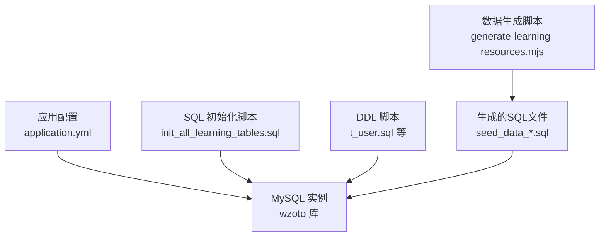
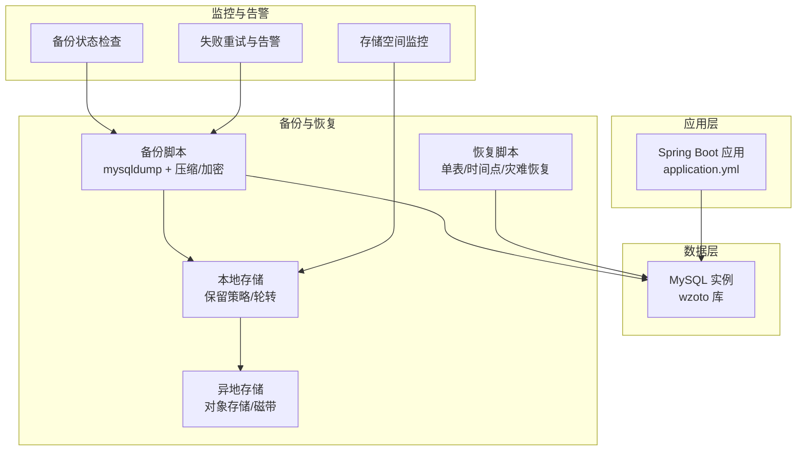
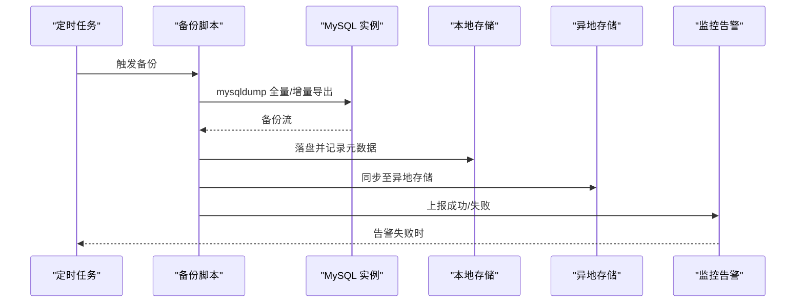
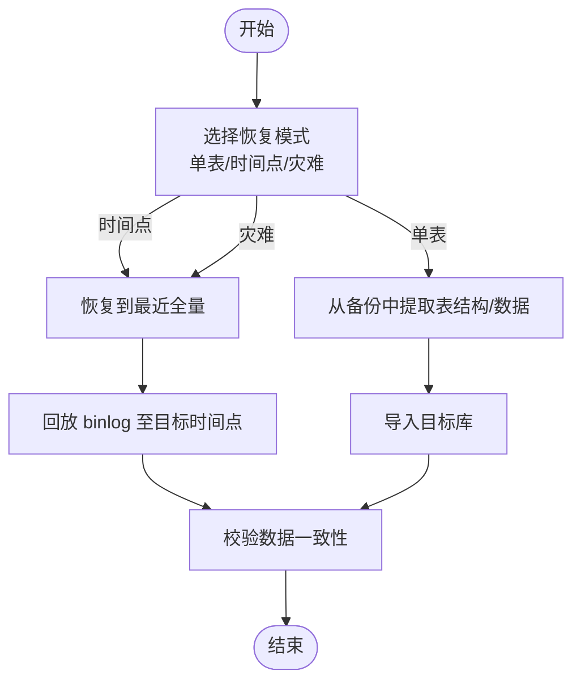
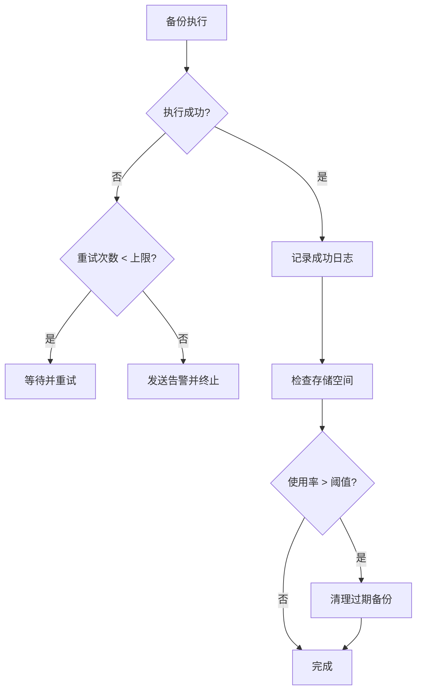
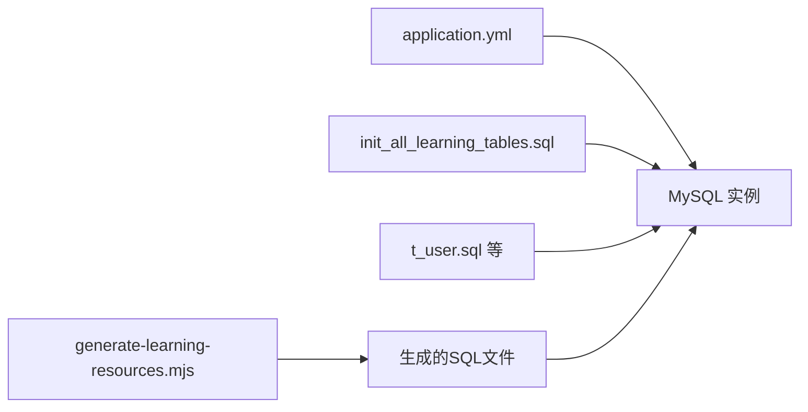

# 备份与恢复

<cite>
**本文引用的文件**
- [application.yml](file://wzoto-backend/wzoto-interfaces/src/main/resources/application.yml)
- [t_user.sql](file://wzoto-backend/sql/t_user.sql)
- [init_all_learning_tables.sql](file://wzoto-backend/sql/init_all_learning_tables.sql)
- [generate-learning-resources.mjs](file://wzoto-backend/scripts/generate-learning-resources.mjs)
</cite>

## 目录
1. [简介](#简介)
2. [项目结构](#项目结构)
3. [核心组件](#核心组件)
4. [架构总览](#架构总览)
5. [详细组件分析](#详细组件分析)
6. [依赖关系分析](#依赖关系分析)
7. [性能考虑](#性能考虑)
8. [故障排查指南](#故障排查指南)
9. [结论](#结论)
10. [附录](#附录)

## 简介
本方案为“学霸到家”后端系统提供一套完整的数据库备份与恢复实施方案，覆盖策略设计、自动化脚本、恢复流程、监控告警、数据一致性保障以及性能与成本优化建议。当前代码库包含MySQL连接配置、表结构定义与数据生成脚本，可作为实施落地依据。

## 项目结构
- 应用配置：Spring Boot 通过 application.yml 声明 MySQL 驱动、URL、用户名/密码（支持环境变量注入）等。
- 数据库结构：SQL 脚本集中存放于 sql 目录，包含建库建表与种子数据初始化脚本。
- 数据生成：scripts 目录包含 Node.js 脚本用于批量生成学习资源相关 SQL 并写入目标文件。

图表来源
- [application.yml:6-17](file://wzoto-backend/wzoto-interfaces/src/main/resources/application.yml#L6-L17)
- [init_all_learning_tables.sql:1-31](file://wzoto-backend/sql/init_all_learning_tables.sql#L1-L31)
- [t_user.sql:1-26](file://wzoto-backend/sql/t_user.sql#L1-L26)
- [generate-learning-resources.mjs:510-543](file://wzoto-backend/scripts/generate-learning-resources.mjs#L510-L543)

章节来源
- [application.yml:6-17](file://wzoto-backend/wzoto-interfaces/src/main/resources/application.yml#L6-L17)
- [init_all_learning_tables.sql:1-31](file://wzoto-backend/sql/init_all_learning_tables.sql#L1-L31)
- [t_user.sql:1-26](file://wzoto-backend/sql/t_user.sql#L1-L26)
- [generate-learning-resources.mjs:510-543](file://wzoto-backend/scripts/generate-learning-resources.mjs#L510-L543)

## 核心组件
- 数据库连接与配置：通过 application.yml 管理 MySQL 连接参数，支持环境变量注入，便于多环境部署。
- 数据库结构与数据：SQL 脚本维护表结构与初始数据；Node 脚本可批量生成大体积数据导入语句。
- 备份与恢复：基于 mysqldump 的自动化脚本（建议实现），配合定时任务与存储管理策略。
- 监控与告警：对备份状态、存储空间、失败重试进行统一监控与通知。
- 一致性保障：事务一致性、外键约束、完整性校验在备份与恢复过程中需严格保证。

章节来源
- [application.yml:6-17](file://wzoto-backend/wzoto-interfaces/src/main/resources/application.yml#L6-L17)
- [init_all_learning_tables.sql:1-31](file://wzoto-backend/sql/init_all_learning_tables.sql#L1-L31)
- [t_user.sql:1-26](file://wzoto-backend/sql/t_user.sql#L1-L26)
- [generate-learning-resources.mjs:510-543](file://wzoto-backend/scripts/generate-learning-resources.mjs#L510-L543)

## 架构总览
下图展示备份与恢复的整体架构：应用层通过配置访问 MySQL；备份由自动化脚本调用 mysqldump 完成全量/增量备份，并上传至异地存储；恢复流程支持单表恢复、时间点恢复与灾难恢复演练；监控模块负责状态检查、空间监控与失败重试。

图表来源
- [application.yml:6-17](file://wzoto-backend/wzoto-interfaces/src/main/resources/application.yml#L6-L17)
- [init_all_learning_tables.sql:1-31](file://wzoto-backend/sql/init_all_learning_tables.sql#L1-L31)

## 详细组件分析

### 备份策略设计
- 全量备份频率
  - 建议每日凌晨低峰期执行一次全量备份，结合 binlog 实现时间点恢复能力。
  - 全量备份应包含所有数据库（wzoto）及必要的系统信息（如字符集、引擎）。
- 增量备份策略
  - 启用 MySQL binlog，按小时或更细粒度归档，作为增量恢复依据。
  - 增量备份仅保存自上次全量以来的变更日志，降低存储占用与传输成本。
- 异地备份方案
  - 将全量与增量备份文件同步至异地对象存储（如 OSS/S3），实现跨机房容灾。
  - 设置生命周期策略自动清理过期副本，控制长期存储成本。

章节来源
- [application.yml:6-17](file://wzoto-backend/wzoto-interfaces/src/main/resources/application.yml#L6-L17)

### 自动化备份脚本（mysqldump）
- 工具使用
  - 使用 mysqldump 导出 wzoto 库，开启一致性与锁策略（如 --single-transaction、--flush-logs 等）。
  - 输出文件命名包含时间戳与类型标识（full/incr），并进行压缩与可选加密。
- 备份文件管理
  - 本地保留策略：保留最近 N 份全量与 M 份增量，定期轮转删除旧文件。
  - 异地同步：使用云厂商 CLI 或 rclone 等工具将备份文件推送至异地存储。
- 备份验证机制
  - 校验文件大小、MD5/SHA 摘要，确保传输完整。
  - 抽样还原到临时库，验证关键表结构与数据行数是否一致。

图表来源
- [application.yml:6-17](file://wzoto-backend/wzoto-interfaces/src/main/resources/application.yml#L6-L17)

章节来源
- [application.yml:6-17](file://wzoto-backend/wzoto-interfaces/src/main/resources/application.yml#L6-L17)

### 恢复流程
- 单表恢复
  - 从全量或增量备份中抽取目标表的 DDL/DML，导入到指定库。
  - 适用于误删/误改场景的快速修复。
- 时间点恢复
  - 先恢复到最近一次全量备份点，再回放 binlog 至目标时间点。
  - 适用于数据损坏或逻辑错误的时间定位恢复。
- 灾难恢复演练
  - 定期在隔离环境执行端到端恢复演练，验证 RTO/RPO 达标。
  - 演练后清理测试环境，避免污染生产数据。

图表来源
- [init_all_learning_tables.sql:1-31](file://wzoto-backend/sql/init_all_learning_tables.sql#L1-L31)

章节来源
- [init_all_learning_tables.sql:1-31](file://wzoto-backend/sql/init_all_learning_tables.sql#L1-L31)

### 监控与告警
- 备份状态检查
  - 每次备份完成后记录状态（成功/失败）、耗时、大小、源/目标路径。
  - 未达标时触发告警（邮件/短信/IM）。
- 存储空间监控
  - 监控本地与异地存储使用率，超过阈值预警。
  - 自动清理过期备份，避免磁盘写满。
- 失败重试机制
  - 对网络抖动、临时不可用等情况进行指数退避重试。
  - 连续失败达到上限后升级告警级别并暂停后续任务。

图表来源
- [application.yml:6-17](file://wzoto-backend/wzoto-interfaces/src/main/resources/application.yml#L6-L17)

章节来源
- [application.yml:6-17](file://wzoto-backend/wzoto-interfaces/src/main/resources/application.yml#L6-L17)

### 数据一致性保证
- 事务一致性
  - 使用 mysqldump 的一致性选项确保导出快照一致。
  - 恢复时按顺序回放，保持事务边界。
- 外键约束
  - 恢复前禁用外键检查，恢复后再启用并校验。
  - 对于大表恢复，优先导入父表再子表，减少约束冲突。
- 数据完整性校验
  - 对比备份前后关键表的数据行数、哈希值。
  - 抽样比对业务关键字段，确保语义一致。

章节来源
- [application.yml:6-17](file://wzoto-backend/wzoto-interfaces/src/main/resources/application.yml#L6-L17)

### 备份性能优化与存储成本优化
- 性能优化
  - 选择低峰时段执行全量备份，减少对在线服务影响。
  - 合理设置并发与缓冲参数，提升导出效率。
  - 使用压缩与并行传输，降低 I/O 与网络开销。
- 存储成本优化
  - 采用分层存储：热数据本地保留短期，冷数据归档至低成本介质。
  - 设置生命周期策略自动清理过期备份。
  - 增量备份为主、全量备份为辅，平衡恢复速度与存储成本。

章节来源
- [application.yml:6-17](file://wzoto-backend/wzoto-interfaces/src/main/resources/application.yml#L6-L17)

## 依赖关系分析
- 应用与数据库：Spring Boot 通过 application.yml 配置 MySQL 连接，读取数据库名、账号、密码等。
- 初始化脚本：init_all_learning_tables.sql 依赖多个 DDL 脚本与种子数据脚本，形成完整的初始化链路。
- 数据生成脚本：generate-learning-resources.mjs 批量生成 INSERT 语句并写入 SQL 文件，供初始化或导入使用。

图表来源
- [application.yml:6-17](file://wzoto-backend/wzoto-interfaces/src/main/resources/application.yml#L6-L17)
- [init_all_learning_tables.sql:1-31](file://wzoto-backend/sql/init_all_learning_tables.sql#L1-L31)
- [t_user.sql:1-26](file://wzoto-backend/sql/t_user.sql#L1-L26)
- [generate-learning-resources.mjs:510-543](file://wzoto-backend/scripts/generate-learning-resources.mjs#L510-L543)

章节来源
- [application.yml:6-17](file://wzoto-backend/wzoto-interfaces/src/main/resources/application.yml#L6-L17)
- [init_all_learning_tables.sql:1-31](file://wzoto-backend/sql/init_all_learning_tables.sql#L1-L31)
- [t_user.sql:1-26](file://wzoto-backend/sql/t_user.sql#L1-L26)
- [generate-learning-resources.mjs:510-543](file://wzoto-backend/scripts/generate-learning-resources.mjs#L510-L543)

## 性能考虑
- 备份窗口规划：结合业务高峰与低谷，选择合适的备份时间。
- 导出参数调优：根据数据规模调整线程数、缓冲区大小。
- 存储与网络：使用高速磁盘与稳定带宽，必要时启用压缩与并行传输。
- 恢复演练：定期演练以评估 RTO/RPO，持续优化流程。

[本节为通用指导，不直接分析具体文件]

## 故障排查指南
- 备份失败常见原因
  - 网络连接异常、权限不足、磁盘空间不足、超时。
  - 处理：检查网络与权限、扩容磁盘、调整超时与重试策略。
- 恢复失败常见原因
  - 版本不兼容、字符集不一致、外键约束冲突。
  - 处理：统一版本与字符集、分阶段导入、禁用/启用外键检查。
- 监控告警
  - 建立统一的指标采集与告警通道，确保问题早发现早处置。

[本节为通用指导，不直接分析具体文件]

## 结论
本方案基于现有代码库中的数据库配置与脚本，提供了从策略设计、自动化脚本、恢复流程到监控告警与一致性保障的完整备份与恢复实施路径。建议尽快落地自动化脚本与异地同步，并定期开展恢复演练，确保业务连续性与数据安全。

[本节为总结性内容，不直接分析具体文件]

## 附录
- 关键配置位置
  - 数据库连接：application.yml
  - 初始化脚本：init_all_learning_tables.sql
  - 表结构：t_user.sql 等
  - 数据生成：generate-learning-resources.mjs

章节来源
- [application.yml:6-17](file://wzoto-backend/wzoto-interfaces/src/main/resources/application.yml#L6-L17)
- [init_all_learning_tables.sql:1-31](file://wzoto-backend/sql/init_all_learning_tables.sql#L1-L31)
- [t_user.sql:1-26](file://wzoto-backend/sql/t_user.sql#L1-L26)
- [generate-learning-resources.mjs:510-543](file://wzoto-backend/scripts/generate-learning-resources.mjs#L510-L543)