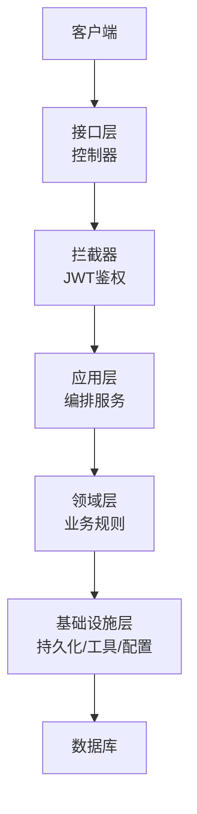
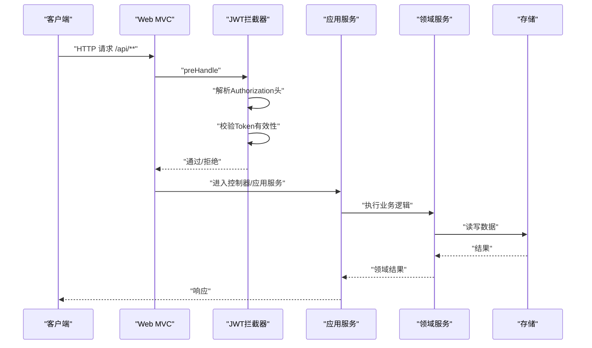
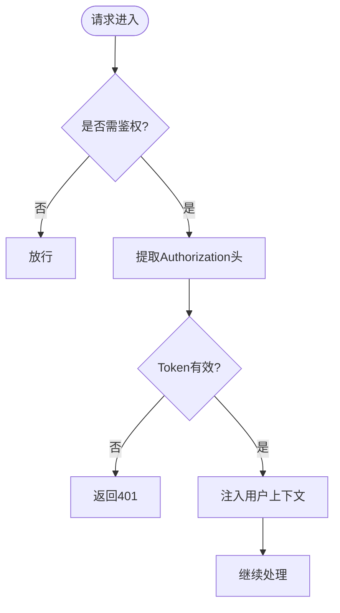
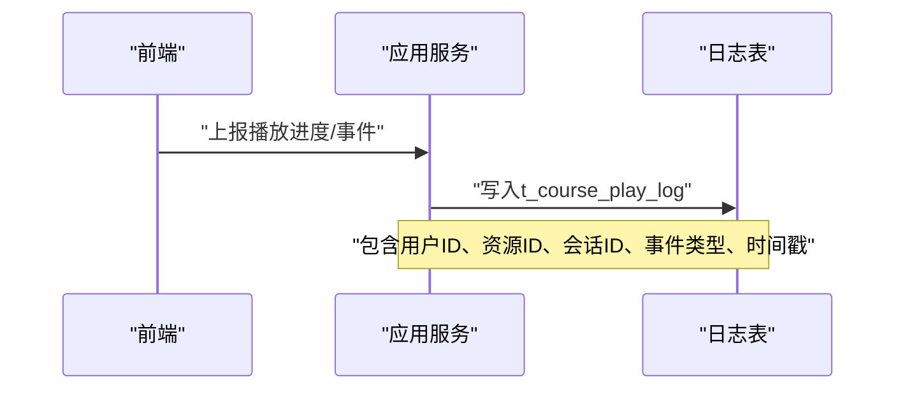
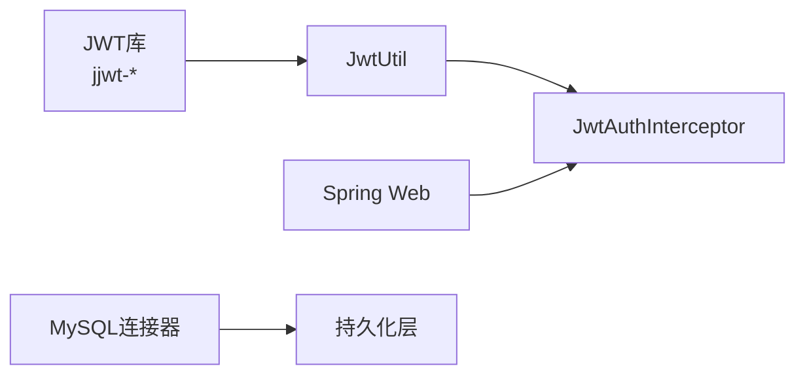

# 安全保护

<cite>
**本文引用的文件**
- [application.yml](file://wzoto-backend/wzoto-interfaces/src/main/resources/application.yml)
- [WebMvcConfig.java](file://wzoto-backend/wzoto-infrastructure/src/main/java/com/wzoto/infrastructure/config/WebMvcConfig.java)
- [JwtAuthInterceptor.java](file://wzoto-backend/wzoto-infrastructure/src/main/java/com/wzoto/infrastructure/interceptor/JwtAuthInterceptor.java)
- [JwtUtil.java](file://wzoto-backend/wzoto-infrastructure/src/main/java/com/wzoto/infrastructure/util/JwtUtil.java)
- [JwtProperties.java](file://wzoto-backend/wzoto-infrastructure/src/main/java/com/wzoto/infrastructure/config/JwtProperties.java)
- [AuthController.java](file://wzoto-backend/wzoto-interfaces/src/main/java/com/wzoto/interfaces/controller/AuthController.java)
- [AuthApplicationService.java](file://wzoto-backend/wzoto-application/src/main/java/com/wzoto/application/service/AuthApplicationService.java)
- [UserDomainService.java](file://wzoto-backend/wzoto-domain/src/main/java/com/wzoto/domain/service/UserDomainService.java)
- [User.java](file://wzoto-backend/wzoto-domain/src/main/java/com/wzoto/domain/entity/User.java)
- [t_user.sql](file://wzoto-backend/sql/t_user.sql)
- [v2_learning_resource_extend.sql](file://wzoto-backend/sql/v2_learning_resource_extend.sql)
- [PlayProgressApplicationService.java](file://wzoto-backend/wzoto-application/src/main/java/com/wzoto/application/service/PlayProgressApplicationService.java)
- [GlobalExceptionHandler.java](file://wzoto-backend/wzoto-interfaces/src/main/java/com/wzoto/interfaces/common/GlobalExceptionHandler.java)
- [pom.xml（基础设施层）](file://wzoto-backend/wzoto-infrastructure/pom.xml)
</cite>

## 目录
1. [简介](#简介)
2. [项目结构](#项目结构)
3. [核心组件](#核心组件)
4. [架构总览](#架构总览)
5. [详细组件分析](#详细组件分析)
6. [依赖关系分析](#依赖关系分析)
7. [性能与安全考量](#性能与安全考量)
8. [故障排查指南](#故障排查指南)
9. [结论](#结论)
10. [附录](#附录)

## 简介
本方案围绕数据库与系统的安全保护，结合当前代码库中的认证、拦截、配置与日志能力，给出可落地的实施方案。覆盖数据加密策略（敏感字段、传输层、静态数据）、访问控制（用户权限、IP白名单、SSL连接）、审计日志（操作日志、安全事件、合规报告）、网络安全防护（防火墙、入侵检测、DDoS防护）、数据脱敏（生产脱敏、测试数据生成、隐私保护），以及漏洞扫描与定期安全评估。

## 项目结构
后端采用分层架构：接口层（控制器）、应用层（编排服务）、领域层（业务规则）、基础设施层（配置、拦截器、工具类、持久化）。安全相关的关键点包括：
- Web MVC 注册 JWT 拦截器并排除登录路径
- JWT 生成与校验
- 登录流程编排（微信登录/开发环境登录）
- 全局异常处理与日志
- 数据库表结构与播放日志表用于审计追踪
- 运行期配置（端口、上下文路径、数据源等）

**图示来源**
- [WebMvcConfig.java:21-31](file://wzoto-backend/wzoto-infrastructure/src/main/java/com/wzoto/infrastructure/config/WebMvcConfig.java#L21-L31)
- [JwtAuthInterceptor.java:27-58](file://wzoto-backend/wzoto-infrastructure/src/main/java/com/wzoto/infrastructure/interceptor/JwtAuthInterceptor.java#L27-L58)
- [AuthController.java:97-131](file://wzoto-backend/wzoto-interfaces/src/main/java/com/wzoto/interfaces/controller/AuthController.java#L97-L131)
- [AuthApplicationService.java:26-40](file://wzoto-backend/wzoto-application/src/main/java/com/wzoto/application/service/AuthApplicationService.java#L26-L40)
- [UserDomainService.java:20-40](file://wzoto-backend/wzoto-domain/src/main/java/com/wzoto/domain/service/UserDomainService.java#L20-L40)

**章节来源**
- [WebMvcConfig.java:1-42](file://wzoto-backend/wzoto-infrastructure/src/main/java/com/wzoto/infrastructure/config/WebMvcConfig.java#L1-L42)
- [application.yml:1-51](file://wzoto-backend/wzoto-interfaces/src/main/resources/application.yml#L1-L51)

## 核心组件
- 认证与授权
  - JWT 配置与工具：密钥、过期时间、Header 名称、Token 前缀
  - 拦截器：从请求头提取 Token，校验后注入用户上下文
  - 登录流程：微信登录或开发环境登录，生成并返回 Token
- 数据与审计
  - 用户表结构：包含身份类型、认证状态、手机号等
  - 播放明细日志表：记录播放事件、进度、会话ID等，用于行为审计
- 配置与异常
  - 应用配置：端口、上下文路径、数据源、日志级别
  - 全局异常处理器：统一错误响应与告警日志

**章节来源**
- [JwtProperties.java:1-26](file://wzoto-backend/wzoto-infrastructure/src/main/java/com/wzoto/infrastructure/config/JwtProperties.java#L1-L26)
- [JwtUtil.java:20-81](file://wzoto-backend/wzoto-infrastructure/src/main/java/com/wzoto/infrastructure/util/JwtUtil.java#L20-L81)
- [JwtAuthInterceptor.java:1-65](file://wzoto-backend/wzoto-infrastructure/src/main/java/com/wzoto/infrastructure/interceptor/JwtAuthInterceptor.java#L1-L65)
- [AuthController.java:97-131](file://wzoto-backend/wzoto-interfaces/src/main/java/com/wzoto/interfaces/controller/AuthController.java#L97-L131)
- [AuthApplicationService.java:26-40](file://wzoto-backend/wzoto-application/src/main/java/com/wzoto/application/service/AuthApplicationService.java#L26-L40)
- [User.java:20-93](file://wzoto-backend/wzoto-domain/src/main/java/com/wzoto/domain/entity/User.java#L20-L93)
- [t_user.sql:1-26](file://wzoto-backend/sql/t_user.sql#L1-L26)
- [v2_learning_resource_extend.sql:75-99](file://wzoto-backend/sql/v2_learning_resource_extend.sql#L75-L99)
- [application.yml:1-51](file://wzoto-backend/wzoto-interfaces/src/main/resources/application.yml#L1-L51)
- [GlobalExceptionHandler.java:1-67](file://wzoto-backend/wzoto-interfaces/src/main/java/com/wzoto/interfaces/common/GlobalExceptionHandler.java#L1-L67)

## 架构总览
下图展示一次受保护的API调用在系统中的流转，包括JWT校验、用户上下文注入与后续业务处理。

**图示来源**
- [WebMvcConfig.java:21-31](file://wzoto-backend/wzoto-infrastructure/src/main/java/com/wzoto/infrastructure/config/WebMvcConfig.java#L21-L31)
- [JwtAuthInterceptor.java:27-58](file://wzoto-backend/wzoto-infrastructure/src/main/java/com/wzoto/infrastructure/interceptor/JwtAuthInterceptor.java#L27-L58)
- [AuthController.java:97-131](file://wzoto-backend/wzoto-interfaces/src/main/java/com/wzoto/interfaces/controller/AuthController.java#L97-L131)
- [AuthApplicationService.java:26-40](file://wzoto-backend/wzoto-application/src/main/java/com/wzoto/application/service/AuthApplicationService.java#L26-L40)

## 详细组件分析

### 认证与访问控制
- 用户权限管理
  - 基于JWT的无状态鉴权：Token中包含用户标识与身份类型，拦截器校验后将用户上下文注入到线程局部变量，供后续服务使用
  - 登录入口：支持微信登录与开发环境直登；后者仅用于开发调试
- IP白名单
  - 当前未实现IP白名单机制；可在拦截器中扩展，按来源IP进行放行或拒绝
- SSL连接配置
  - 当前应用默认HTTP；建议在网关/反向代理层启用HTTPS，并在应用配置中关闭useSSL以适配代理终止TLS的场景

**图示来源**
- [WebMvcConfig.java:21-31](file://wzoto-backend/wzoto-infrastructure/src/main/java/com/wzoto/infrastructure/config/WebMvcConfig.java#L21-L31)
- [JwtAuthInterceptor.java:27-58](file://wzoto-backend/wzoto-infrastructure/src/main/java/com/wzoto/infrastructure/interceptor/JwtAuthInterceptor.java#L27-L58)

**章节来源**
- [JwtAuthInterceptor.java:1-65](file://wzoto-backend/wzoto-infrastructure/src/main/java/com/wzoto/infrastructure/interceptor/JwtAuthInterceptor.java#L1-L65)
- [JwtUtil.java:20-81](file://wzoto-backend/wzoto-infrastructure/src/main/java/com/wzoto/infrastructure/util/JwtUtil.java#L20-L81)
- [JwtProperties.java:1-26](file://wzoto-backend/wzoto-infrastructure/src/main/java/com/wzoto/infrastructure/config/JwtProperties.java#L1-L26)
- [AuthController.java:97-131](file://wzoto-backend/wzoto-interfaces/src/main/java/com/wzoto/interfaces/controller/AuthController.java#L97-L131)
- [AuthApplicationService.java:26-40](file://wzoto-backend/wzoto-application/src/main/java/com/wzoto/application/service/AuthApplicationService.java#L26-L40)

### 数据加密策略
- 敏感字段加密
  - 当前用户实体包含手机号、真实姓名等敏感字段；建议对落库敏感字段进行加密存储（如AES），并在读取时解密；VO层按需脱敏输出
- 传输层加密
  - 当前应用监听HTTP；建议在反向代理/网关层启用HTTPS，确保端到端加密传输
- 静态数据加密
  - 数据库连接串与敏感配置通过环境变量注入；建议对备份数据、日志中的敏感信息进行脱敏或加密

**章节来源**
- [User.java:20-93](file://wzoto-backend/wzoto-domain/src/main/java/com/wzoto/domain/entity/User.java#L20-L93)
- [t_user.sql:1-26](file://wzoto-backend/sql/t_user.sql#L1-L26)
- [application.yml:6-17](file://wzoto-backend/wzoto-interfaces/src/main/resources/application.yml#L6-L17)

### 审计日志记录
- 操作日志采集
  - 播放明细日志表记录用户观看行为（事件类型、进度、会话ID、时间戳），可用于学习行为审计与问题定位
- 安全事件追踪
  - 登录失败、Token无效等场景已在拦截器中记录警告日志；建议统一接入集中式日志平台并按安全事件分类
- 合规性报告
  - 基于播放记录与学习报告服务，可生成学习行为统计；可扩展为合规报表（如未成年人使用时长、内容访问范围）

**图示来源**
- [v2_learning_resource_extend.sql:75-99](file://wzoto-backend/sql/v2_learning_resource_extend.sql#L75-L99)
- [PlayProgressApplicationService.java:36-64](file://wzoto-backend/wzoto-application/src/main/java/com/wzoto/application/service/PlayProgressApplicationService.java#L36-L64)

**章节来源**
- [v2_learning_resource_extend.sql:75-99](file://wzoto-backend/sql/v2_learning_resource_extend.sql#L75-L99)
- [PlayProgressApplicationService.java:36-64](file://wzoto-backend/wzoto-application/src/main/java/com/wzoto/application/service/PlayProgressApplicationService.java#L36-L64)
- [JwtAuthInterceptor.java:27-58](file://wzoto-backend/wzoto-infrastructure/src/main/java/com/wzoto/infrastructure/interceptor/JwtAuthInterceptor.java#L27-L58)

### 网络安全防护
- 防火墙配置
  - 仅开放必要端口（如80/443），限制内网访问数据库端口
- 入侵检测
  - 建议部署WAF/IDS，结合日志告警（登录失败、异常参数）
- DDoS防护
  - 在网关层启用限流与CC防护，结合CDN与云厂商防护能力

[本节为通用指导，不直接分析具体文件]

### 数据脱敏方案
- 生产环境数据脱敏
  - 对外返回的手机号等敏感信息应在VO层进行掩码处理
- 测试数据生成
  - 使用脚本生成非真实数据，避免泄露真实用户信息
- 隐私保护
  - 日志中避免记录明文敏感信息；对必须记录的字段进行哈希或脱敏

**章节来源**
- [LoginVO.java:1-40](file://wzoto-backend/wzoto-interfaces/src/main/java/com/wzoto/interfaces/vo/LoginVO.java#L1-L40)
- [GlobalExceptionHandler.java:1-67](file://wzoto-backend/wzoto-interfaces/src/main/java/com/wzoto/interfaces/common/GlobalExceptionHandler.java#L1-L67)

### 安全漏洞扫描与定期安全评估
- 依赖漏洞扫描
  - 使用Maven/Gradle插件扫描第三方依赖漏洞
- 代码安全扫描
  - 引入静态分析工具（如SonarQube）检查常见安全问题
- 定期评估
  - 每季度进行一次渗透测试与风险评估，更新防护策略

[本节为通用指导，不直接分析具体文件]

## 依赖关系分析
- 认证相关依赖
  - JWT库：jjwt-api、jjwt-impl、jjwt-jackson
- Web与数据库
  - Spring Boot Starter Web
  - MySQL连接器
- 其他
  - OKHttp（AI调用）
  - JSON处理库

**图示来源**
- [pom.xml（基础设施层）:33-72](file://wzoto-backend/wzoto-infrastructure/pom.xml#L33-L72)

**章节来源**
- [pom.xml（基础设施层）:33-72](file://wzoto-backend/wzoto-infrastructure/pom.xml#L33-L72)

## 性能与安全考量
- 认证性能
  - JWT校验轻量高效；注意密钥管理与轮换策略
- 日志性能
  - 播放日志高频写入，建议分表/分区与异步写入
- 传输安全
  - 在生产环境强制HTTPS，禁用不安全协议与弱加密套件
- 配置安全
  - 敏感配置通过环境变量注入，避免硬编码

[本节为通用指导，不直接分析具体文件]

## 故障排查指南
- 登录失败
  - 检查JWT密钥配置、Token有效期、请求头是否正确
- 鉴权失败
  - 确认拦截器排除路径是否合理，Token是否携带正确前缀
- 参数异常
  - 查看全局异常处理器输出的参数校验错误信息
- 日志缺失
  - 检查日志级别与输出配置，确保关键路径有足够日志

**章节来源**
- [JwtProperties.java:1-26](file://wzoto-backend/wzoto-infrastructure/src/main/java/com/wzoto/infrastructure/config/JwtProperties.java#L1-L26)
- [JwtAuthInterceptor.java:27-58](file://wzoto-backend/wzoto-infrastructure/src/main/java/com/wzoto/infrastructure/interceptor/JwtAuthInterceptor.java#L27-L58)
- [GlobalExceptionHandler.java:1-67](file://wzoto-backend/wzoto-interfaces/src/main/java/com/wzoto/interfaces/common/GlobalExceptionHandler.java#L1-L67)
- [application.yml:48-51](file://wzoto-backend/wzoto-interfaces/src/main/resources/application.yml#L48-L51)

## 结论
本项目已具备基础的认证与审计能力：JWT鉴权、登录流程、播放行为日志与全局异常处理。为达到企业级数据安全标准，建议推进以下改进：
- 完善数据加密：敏感字段加密存储、传输层HTTPS、静态数据加密
- 强化访问控制：增加IP白名单、细粒度权限控制
- 增强审计与合规：集中式日志、安全事件分类、合规报表
- 网络安全加固：防火墙、WAF/IDS、DDoS防护
- 数据脱敏与隐私保护：输出脱敏、日志脱敏、测试数据隔离
- 持续安全评估：依赖与代码扫描、定期渗透测试

[本节为总结，不直接分析具体文件]

## 附录
- 关键配置项说明
  - 服务器端口与上下文路径
  - 数据源URL、用户名、密码（通过环境变量注入）
  - Redis主机、端口、密码
  - JWT密钥、过期时间、微信AppId/Secret、AI开关与模型配置
  - 日志级别

**章节来源**
- [application.yml:1-51](file://wzoto-backend/wzoto-interfaces/src/main/resources/application.yml#L1-L51)