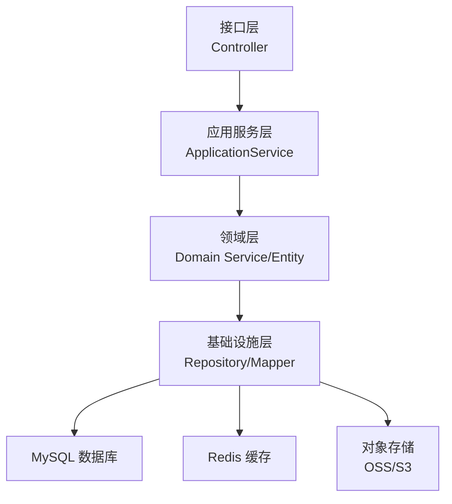
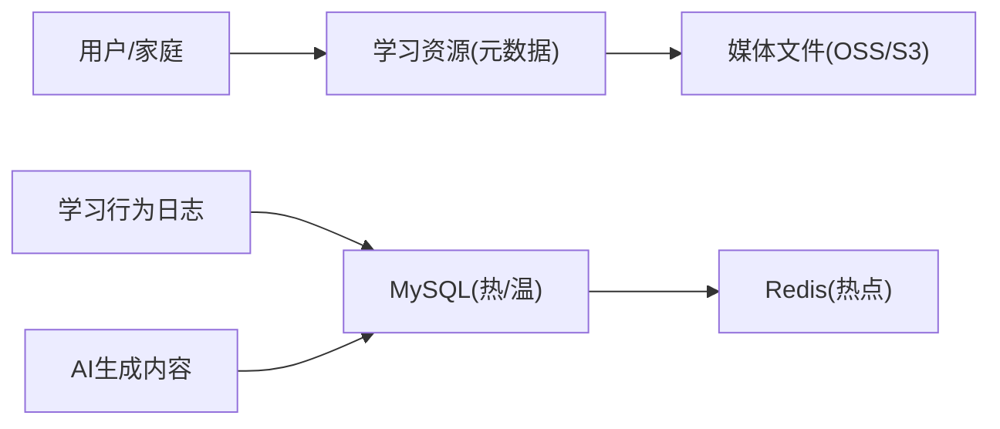
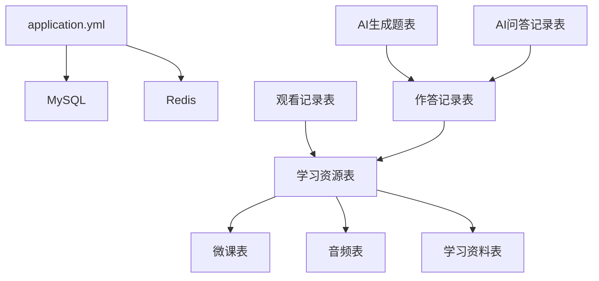

# 容量规划

<cite>
**本文引用的文件**
- [application.yml](file://wzoto-backend/wzoto-interfaces/src/main/resources/application.yml)
- [t_user.sql](file://wzoto-backend/sql/t_user.sql)
- [t_child.sql](file://wzoto-backend/sql/t_child.sql)
- [t_learning_resource.sql](file://wzoto-backend/sql/t_learning_resource.sql)
- [t_audio_material.sql](file://wzoto-backend/sql/t_audio_material.sql)
- [t_micro_course.sql](file://wzoto-backend/sql/t_micro_course.sql)
- [t_study_material.sql](file://wzoto-backend/sql/t_study_material.sql)
- [t_test_paper.sql](file://wzoto-backend/sql/t_test_paper.sql)
- [t_exercise_answer_record.sql](file://wzoto-backend/sql/t_exercise_answer_record.sql)
- [t_course_watch_record.sql](file://wzoto-backend/sql/t_course_watch_record.sql)
- [t_ai_exercise_generated.sql](file://wzoto-backend/sql/t_ai_exercise_generated.sql)
- [t_ai_qa_record.sql](file://wzoto-backend/sql/t_ai_qa_record.sql)
- [t_membership.sql](file://wzoto-backend/sql/t_membership.sql)
- [init_all_learning_tables.sql](file://wzoto-backend/sql/init_all_learning_tables.sql)
</cite>

## 目录
1. [引言](#引言)
2. [项目结构](#项目结构)
3. [核心组件](#核心组件)
4. [架构总览](#架构总览)
5. [详细组件分析](#详细组件分析)
6. [依赖关系分析](#依赖关系分析)
7. [性能与容量考量](#性能与容量考量)
8. [故障排查指南](#故障排查指南)
9. [结论](#结论)
10. [附录](#附录)

## 引言
本方案面向“学霸到家”教育学习平台，围绕数据库容量规划提供可落地的方法与策略。内容覆盖：存储空间估算（用户数据增长、学习资源存储、AI生成内容）、增长趋势分析（历史模式、业务预测、计算模型）、扩容策略（垂直/水平/云存储集成）、容量监控指标（使用率、增长率、预警阈值）、数据生命周期管理（冷热分离、归档、清理）以及优化建议与成本控制。

## 项目结构
系统采用分层架构：接口层、应用服务层、领域层、基础设施层；数据存储以MySQL为主，结合Redis缓存与对象存储承载媒体资源。关键DDL定义于SQL脚本中，便于初始化与版本化演进。

**图表来源**
- [application.yml:6-17](file://wzoto-backend/wzoto-interfaces/src/main/resources/application.yml#L6-L17)
- [init_all_learning_tables.sql:18-27](file://wzoto-backend/sql/init_all_learning_tables.sql#L18-L27)

**章节来源**
- [application.yml:1-51](file://wzoto-backend/wzoto-interfaces/src/main/resources/application.yml#L1-L51)
- [init_all_learning_tables.sql:1-31](file://wzoto-backend/sql/init_all_learning_tables.sql#L1-L31)

## 核心组件
- 用户与家庭关系：用户表、子女档案表，支撑家长与学生身份与关联。
- 学习资源体系：学习资源、微课视频、学习资料、音频素材、试卷等，构成课程与练习内容基座。
- 学习行为记录：观看记录、作答记录，用于进度追踪与学情分析。
- AI能力：AI生成练习题、AI问答记录，带来高增长文本与JSON负载。
- 会员与权限：会员表，控制资源访问与计费。

上述组件通过Repository/Mapper映射到MySQL，部分热点数据通过Redis缓存，媒体资源通过对象存储托管。

**章节来源**
- [t_user.sql:7-26](file://wzoto-backend/sql/t_user.sql#L7-L26)
- [t_child.sql:4-18](file://wzoto-backend/sql/t_child.sql#L4-L18)
- [t_learning_resource.sql:4-35](file://wzoto-backend/sql/t_learning_resource.sql#L4-L35)
- [t_micro_course.sql:4-31](file://wzoto-backend/sql/t_micro_course.sql#L4-L31)
- [t_study_material.sql:4-26](file://wzoto-backend/sql/t_study_material.sql#L4-L26)
- [t_audio_material.sql:4-25](file://wzoto-backend/sql/t_audio_material.sql#L4-L25)
- [t_test_paper.sql:4-27](file://wzoto-backend/sql/t_test_paper.sql#L4-L27)
- [t_course_watch_record.sql:4-21](file://wzoto-backend/sql/t_course_watch_record.sql#L4-L21)
- [t_exercise_answer_record.sql:4-23](file://wzoto-backend/sql/t_exercise_answer_record.sql#L4-L23)
- [t_ai_exercise_generated.sql:4-30](file://wzoto-backend/sql/t_ai_exercise_generated.sql#L4-L30)
- [t_ai_qa_record.sql:4-30](file://wzoto-backend/sql/t_ai_qa_record.sql#L4-L30)
- [t_membership.sql:4-20](file://wzoto-backend/sql/t_membership.sql#L4-L20)

## 架构总览
从容量视角看，系统由三类数据组成：
- 结构化元数据：用户、资源、配置、订单等，适合MySQL。
- 高频行为日志：观看、作答、AI对话，写入量大、增长快，需分区与归档。
- 大对象媒体：视频、音频、图片、PDF，应外置至对象存储，数据库仅存URL与元信息。

**图表来源**
- [application.yml:6-17](file://wzoto-backend/wzoto-interfaces/src/main/resources/application.yml#L6-L17)
- [t_learning_resource.sql:4-35](file://wzoto-backend/sql/t_learning_resource.sql#L4-L35)
- [t_micro_course.sql:4-31](file://wzoto-backend/sql/t_micro_course.sql#L4-L31)
- [t_audio_material.sql:4-25](file://wzoto-backend/sql/t_audio_material.sql#L4-L25)
- [t_study_material.sql:4-26](file://wzoto-backend/sql/t_study_material.sql#L4-L26)
- [t_course_watch_record.sql:4-21](file://wzoto-backend/sql/t_course_watch_record.sql#L4-L21)
- [t_exercise_answer_record.sql:4-23](file://wzoto-backend/sql/t_exercise_answer_record.sql#L4-L23)
- [t_ai_qa_record.sql:4-30](file://wzoto-backend/sql/t_ai_qa_record.sql#L4-L30)

## 详细组件分析

### 存储空间估算模型
- 基础公式
  - 单行大小 ≈ 字段定长 + 变长平均长度 + JSON/TEXT开销 + 索引开销
  - 表容量 ≈ 行数 × 单行大小 + 索引占用 + 页碎片
  - 年度需求 ≈ 日均新增 × 365 × (1 + 膨胀系数)
- 关键表估算要点
  - 用户与家庭：用户表含头像URL、认证状态等；子女表含教材版本、学校等。按活跃家庭数×每家庭子女数估算。
  - 学习资源：微课视频表含分辨率、文件大小MB字段；音频素材表含时长与URL；学习资料含PDF/图片URL。媒体文件走对象存储，DB仅占少量字节。
  - 行为日志：观看记录与作答记录为高频写入，建议按月分区，配合归档策略。
  - AI内容：AI问答记录包含MEDIUMTEXT的回复JSON，单条可能较大；AI生成题包含题目与解析JSON，需评估峰值并发与总量。
- 示例计算流程（以“AI问答记录”为例）
  - 预估日会话数 × 平均每会话轮次 × 平均每条JSON大小 = 日增量
  - 年增量 = 日增量 × 365 × 膨胀系数
  - 考虑索引与页开销后，乘以1.2~1.5的安全系数

**章节来源**
- [t_user.sql:7-26](file://wzoto-backend/sql/t_user.sql#L7-L26)
- [t_child.sql:4-18](file://wzoto-backend/sql/t_child.sql#L4-L18)
- [t_micro_course.sql:4-31](file://wzoto-backend/sql/t_micro_course.sql#L4-L31)
- [t_audio_material.sql:4-25](file://wzoto-backend/sql/t_audio_material.sql#L4-L25)
- [t_study_material.sql:4-26](file://wzoto-backend/sql/t_study_material.sql#L4-L26)
- [t_course_watch_record.sql:4-21](file://wzoto-backend/sql/t_course_watch_record.sql#L4-L21)
- [t_exercise_answer_record.sql:4-23](file://wzoto-backend/sql/t_exercise_answer_record.sql#L4-L23)
- [t_ai_qa_record.sql:4-30](file://wzoto-backend/sql/t_ai_qa_record.sql#L4-L30)
- [t_ai_exercise_generated.sql:4-30](file://wzoto-backend/sql/t_ai_exercise_generated.sql#L4-L30)

### 增长趋势分析
- 历史数据增长模式
  - 新用户注册与绑定子女带来用户/家庭表线性增长。
  - 学习资源随年级/学科/教材版本扩展而稳步增长。
  - 行为日志呈指数增长，受活动、考试季、寒暑假影响显著。
  - AI功能开启后，问答与生成题呈快速增长，尤其在高互动场景。
- 业务增长预测
  - 基于月度活跃家庭数、人均学习时长、AI使用渗透率建立预测曲线。
  - 考虑季节性波动（开学季、期末季）与运营活动带来的脉冲式增长。
- 存储需求计算模型
  - 分表建模：静态资源表（低频增长）、行为日志表（高频增长）、AI内容表（中高频增长）。
  - 时间维度：按季度滚动预测，叠加安全系数与碎片率。
  - 空间维度：区分结构化数据与对象存储，避免将大对象存入数据库。

**章节来源**
- [t_learning_resource.sql:4-35](file://wzoto-backend/sql/t_learning_resource.sql#L4-L35)
- [t_micro_course.sql:4-31](file://wzoto-backend/sql/t_micro_course.sql#L4-L31)
- [t_audio_material.sql:4-25](file://wzoto-backend/sql/t_audio_material.sql#L4-L25)
- [t_study_material.sql:4-26](file://wzoto-backend/sql/t_study_material.sql#L4-L26)
- [t_course_watch_record.sql:4-21](file://wzoto-backend/sql/t_course_watch_record.sql#L4-L21)
- [t_exercise_answer_record.sql:4-23](file://wzoto-backend/sql/t_exercise_answer_record.sql#L4-L23)
- [t_ai_qa_record.sql:4-30](file://wzoto-backend/sql/t_ai_qa_record.sql#L4-L30)
- [t_ai_exercise_generated.sql:4-30](file://wzoto-backend/sql/t_ai_exercise_generated.sql#L4-L30)

### 扩容策略
- 垂直扩容
  - 提升单机CPU/内存、磁盘IOPS与容量，适用于短期压力缓解与中小规模。
  - 调整InnoDB缓冲池、连接数、日志刷盘策略以降低延迟。
- 水平扩展架构
  - 读写分离：主库写、多从库读，降低查询压力。
  - 分库分表：按child_id或subject进行水平拆分，解决单表过大问题。
  - 日志归档：将冷数据迁移至历史库或对象存储，保留必要索引与摘要。
- 云存储集成
  - 视频/音频/图片/PDF统一上云（如S3/OSS），数据库仅保存URL与元数据。
  - 利用CDN加速分发，降低源站带宽压力。
  - 设置生命周期规则自动转储低频访问数据至低成本存储。

**章节来源**
- [application.yml:6-17](file://wzoto-backend/wzoto-interfaces/src/main/resources/application.yml#L6-L17)
- [t_micro_course.sql:4-31](file://wzoto-backend/sql/t_micro_course.sql#L4-L31)
- [t_audio_material.sql:4-25](file://wzoto-backend/sql/t_audio_material.sql#L4-L25)
- [t_study_material.sql:4-26](file://wzoto-backend/sql/t_study_material.sql#L4-L26)

### 容量监控指标
- 存储使用率监控
  - 表级与库级磁盘使用率、InnoDB数据文件与redo日志大小。
  - 索引占比与碎片率，定期重建或优化。
- 增长速率分析
  - 每日新增行数、平均行大小、JSON/TEXT字段占比变化。
  - 行为日志写入QPS与峰值，AI问答请求量与响应体大小分布。
- 预警阈值设置
  - 存储使用率超过80%触发扩容预案。
  - 单表行数超阈值（如千万级）触发分片或归档。
  - 写入延迟与慢查询比例异常升高时触发限流与优化。

**章节来源**
- [t_course_watch_record.sql:4-21](file://wzoto-backend/sql/t_course_watch_record.sql#L4-L21)
- [t_exercise_answer_record.sql:4-23](file://wzoto-backend/sql/t_exercise_answer_record.sql#L4-L23)
- [t_ai_qa_record.sql:4-30](file://wzoto-backend/sql/t_ai_qa_record.sql#L4-L30)
- [t_ai_exercise_generated.sql:4-30](file://wzoto-backend/sql/t_ai_exercise_generated.sql#L4-L30)

### 数据生命周期管理
- 冷热数据分离
  - 热数据：近3个月的行为日志与活跃资源，保留完整索引。
  - 温数据：3~12个月数据，降采样或压缩存储，减少索引数量。
  - 冷数据：1年以上数据，归档至历史库或对象存储，仅保留统计摘要。
- 归档策略
  - 按月分区表，定时将过期分区导出并压缩归档。
  - 对AI问答与生成题，保留关键标签与结果摘要，原始JSON可下沉至对象存储。
- 清理规则
  - 软删除字段已启用，定期物理清理逻辑删除数据。
  - 临时任务与测试数据设置TTL，到期自动回收。

**章节来源**
- [application.yml:19-29](file://wzoto-backend/wzoto-interfaces/src/main/resources/application.yml#L19-L29)
- [t_course_watch_record.sql:4-21](file://wzoto-backend/sql/t_course_watch_record.sql#L4-L21)
- [t_exercise_answer_record.sql:4-23](file://wzoto-backend/sql/t_exercise_answer_record.sql#L4-L23)
- [t_ai_qa_record.sql:4-30](file://wzoto-backend/sql/t_ai_qa_record.sql#L4-L30)
- [t_ai_exercise_generated.sql:4-30](file://wzoto-backend/sql/t_ai_exercise_generated.sql#L4-L30)

### 容量优化建议与成本控制
- 存储优化
  - 大字段JSON/TEXT下沉至对象存储，数据库仅存ID与URL。
  - 合理设计索引，避免冗余索引导致写入放大与空间浪费。
  - 定期OPTIMIZE TABLE与重建索引，降低碎片。
- 查询优化
  - 热点查询引入Redis缓存，降低数据库压力。
  - 分页与过滤条件命中索引，避免全表扫描。
- 成本优化
  - 对象存储采用分层存储（标准/低频/归档），按访问频率选择层级。
  - CDN按需开启，结合缓存命中率优化带宽成本。
  - 数据库实例规格弹性伸缩，非高峰期降级。

**章节来源**
- [application.yml:6-17](file://wzoto-backend/wzoto-interfaces/src/main/resources/application.yml#L6-L17)
- [t_micro_course.sql:4-31](file://wzoto-backend/sql/t_micro_course.sql#L4-L31)
- [t_audio_material.sql:4-25](file://wzoto-backend/sql/t_audio_material.sql#L4-L25)
- [t_study_material.sql:4-26](file://wzoto-backend/sql/t_study_material.sql#L4-L26)

## 依赖关系分析
- 配置依赖
  - 数据源与Redis通过配置文件注入，支持环境变量覆盖。
- 数据依赖
  - 学习资源与微课、音频、资料之间通过年级、学科、教材版本形成多维关联。
  - 行为记录与资源、子女、学科形成强关联，便于学情分析。
  - AI内容与问答记录与子女、学科、知识点形成闭环，驱动个性化学习。

**图表来源**
- [application.yml:6-17](file://wzoto-backend/wzoto-interfaces/src/main/resources/application.yml#L6-L17)
- [t_learning_resource.sql:4-35](file://wzoto-backend/sql/t_learning_resource.sql#L4-L35)
- [t_micro_course.sql:4-31](file://wzoto-backend/sql/t_micro_course.sql#L4-L31)
- [t_audio_material.sql:4-25](file://wzoto-backend/sql/t_audio_material.sql#L4-L25)
- [t_study_material.sql:4-26](file://wzoto-backend/sql/t_study_material.sql#L4-L26)
- [t_course_watch_record.sql:4-21](file://wzoto-backend/sql/t_course_watch_record.sql#L4-L21)
- [t_exercise_answer_record.sql:4-23](file://wzoto-backend/sql/t_exercise_answer_record.sql#L4-L23)
- [t_ai_exercise_generated.sql:4-30](file://wzoto-backend/sql/t_ai_exercise_generated.sql#L4-L30)
- [t_ai_qa_record.sql:4-30](file://wzoto-backend/sql/t_ai_qa_record.sql#L4-L30)

**章节来源**
- [application.yml:6-17](file://wzoto-backend/wzoto-interfaces/src/main/resources/application.yml#L6-L17)
- [init_all_learning_tables.sql:18-27](file://wzoto-backend/sql/init_all_learning_tables.sql#L18-L27)

## 性能与容量考量
- 写入热点
  - 观看记录与作答记录在高峰时段写入压力大，建议批量写入与异步落库。
  - AI问答与生成题在高并发下需限制单次请求体大小与重试次数。
- 读取热点
  - 资源列表与微课播放元数据频繁读取，可通过Redis缓存与CDN加速。
- 索引与分区
  - 行为日志表按created_at分区，结合child_id与subject复合索引提升查询效率。
  - 资源表按grade/subject/textbook_version建立常用查询索引。
- 存储介质
  - 数据库使用高性能SSD，对象存储使用分层策略降低成本。

**章节来源**
- [t_course_watch_record.sql:4-21](file://wzoto-backend/sql/t_course_watch_record.sql#L4-L21)
- [t_exercise_answer_record.sql:4-23](file://wzoto-backend/sql/t_exercise_answer_record.sql#L4-L23)
- [t_ai_qa_record.sql:4-30](file://wzoto-backend/sql/t_ai_qa_record.sql#L4-L30)
- [t_ai_exercise_generated.sql:4-30](file://wzoto-backend/sql/t_ai_exercise_generated.sql#L4-L30)
- [t_learning_resource.sql:4-35](file://wzoto-backend/sql/t_learning_resource.sql#L4-L35)
- [t_micro_course.sql:4-31](file://wzoto-backend/sql/t_micro_course.sql#L4-L31)

## 故障排查指南
- 常见问题定位
  - 存储不足：检查表空间与索引碎片，评估是否需归档或扩容。
  - 写入延迟：观察慢查询与锁等待，优化索引与批处理策略。
  - 缓存穿透：对热点资源增加空值缓存与布隆过滤器。
- 监控与告警
  - 设置存储使用率、写入QPS、慢查询比例、错误率的阈值告警。
  - 对AI服务调用失败与超时进行熔断与降级。
- 恢复策略
  - 定期备份与演练恢复，确保RPO/RTO满足业务要求。
  - 对重要表开启binlog，支持时间点恢复。

**章节来源**
- [application.yml:19-29](file://wzoto-backend/wzoto-interfaces/src/main/resources/application.yml#L19-L29)
- [t_course_watch_record.sql:4-21](file://wzoto-backend/sql/t_course_watch_record.sql#L4-L21)
- [t_exercise_answer_record.sql:4-23](file://wzoto-backend/sql/t_exercise_answer_record.sql#L4-L23)
- [t_ai_qa_record.sql:4-30](file://wzoto-backend/sql/t_ai_qa_record.sql#L4-L30)

## 结论
通过明确的数据分类、合理的存储模型与严格的监控治理，可在保证用户体验的同时有效控制成本。建议优先将大对象外置至对象存储，对行为日志实施分区与归档，结合缓存与CDN提升性能，并以分库分表与读写分离应对长期增长。AI内容的容量规划需重点关注JSON体积与峰值并发，制定严格的限流与降级策略。

## 附录
- 关键表清单与用途
  - 用户与家庭：t_user、t_child
  - 学习资源：t_learning_resource、t_micro_course、t_audio_material、t_study_material、t_test_paper
  - 行为记录：t_course_watch_record、t_exercise_answer_record
  - AI能力：t_ai_exercise_generated、t_ai_qa_record
  - 会员：t_membership
- 初始化脚本
  - 一次性创建学习资源相关表并导入种子数据

**章节来源**
- [t_user.sql:7-26](file://wzoto-backend/sql/t_user.sql#L7-L26)
- [t_child.sql:4-18](file://wzoto-backend/sql/t_child.sql#L4-L18)
- [t_learning_resource.sql:4-35](file://wzoto-backend/sql/t_learning_resource.sql#L4-L35)
- [t_micro_course.sql:4-31](file://wzoto-backend/sql/t_micro_course.sql#L4-L31)
- [t_audio_material.sql:4-25](file://wzoto-backend/sql/t_audio_material.sql#L4-L25)
- [t_study_material.sql:4-26](file://wzoto-backend/sql/t_study_material.sql#L4-L26)
- [t_test_paper.sql:4-27](file://wzoto-backend/sql/t_test_paper.sql#L4-L27)
- [t_course_watch_record.sql:4-21](file://wzoto-backend/sql/t_course_watch_record.sql#L4-L21)
- [t_exercise_answer_record.sql:4-23](file://wzoto-backend/sql/t_exercise_answer_record.sql#L4-L23)
- [t_ai_exercise_generated.sql:4-30](file://wzoto-backend/sql/t_ai_exercise_generated.sql#L4-L30)
- [t_ai_qa_record.sql:4-30](file://wzoto-backend/sql/t_ai_qa_record.sql#L4-L30)
- [t_membership.sql:4-20](file://wzoto-backend/sql/t_membership.sql#L4-L20)
- [init_all_learning_tables.sql:18-31](file://wzoto-backend/sql/init_all_learning_tables.sql#L18-L31)