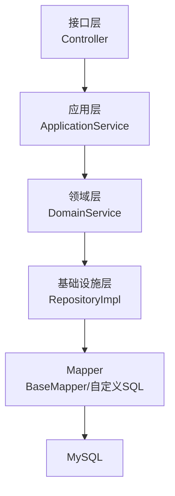
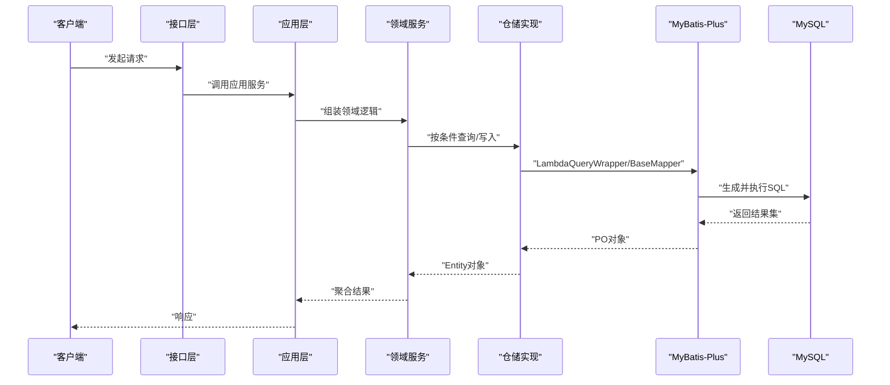
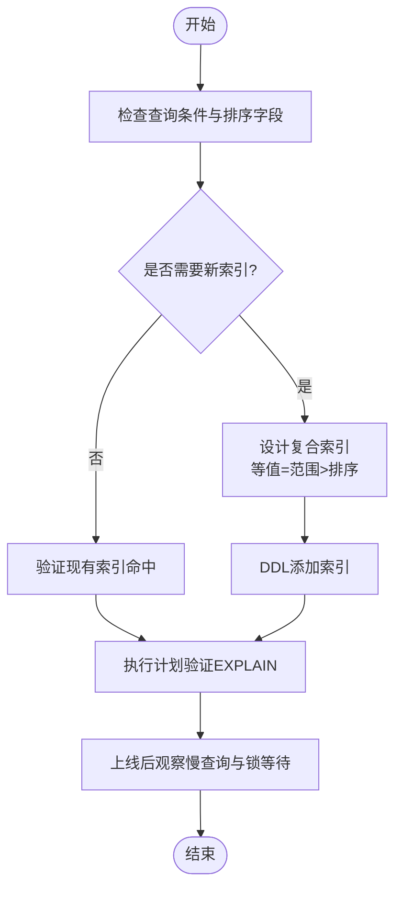
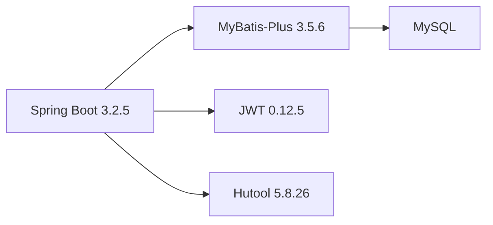

# 性能调优

<cite>
**本文引用的文件**
- [application.yml](file://wzoto-backend/wzoto-interfaces/src/main/resources/application.yml)
- [pom.xml](file://wzoto-backend/pom.xml)
- [t_user.sql](file://wzoto-backend/sql/t_user.sql)
- [t_learning_resource.sql](file://wzoto-backend/sql/t_learning_resource.sql)
- [init_all_learning_tables.sql](file://wzoto-backend/sql/init_all_learning_tables.sql)
- [UserRepositoryImpl.java](file://wzoto-backend/wzoto-infrastructure/src/main/java/com/wzoto/infrastructure/repository/UserRepositoryImpl.java)
- [ParentControlConfigRepositoryImpl.java](file://wzoto-backend/wzoto-infrastructure/src/main/java/com/wzoto/infrastructure/repository/ParentControlConfigRepositoryImpl.java)
- [BookingRepositoryImpl.java](file://wzoto-backend/wzoto-infrastructure/src/main/java/com/wzoto/infrastructure/repository/BookingRepositoryImpl.java)
- [MicroCourseRepositoryImpl.java](file://wzoto-backend/wzoto-infrastructure/src/main/java/com/wzoto/infrastructure/repository/MicroCourseRepositoryImpl.java)
- [MembershipRepositoryImpl.java](file://wzoto-backend/wzoto-infrastructure/src/main/java/com/wzoto/infrastructure/repository/MembershipRepositoryImpl.java)
- [LearningReportDomainService.java](file://wzoto-backend/wzoto-domain/src/main/java/com/wzoto/domain/service/LearningReportDomainService.java)
</cite>

## 目录
1. [简介](#简介)
2. [项目结构](#项目结构)
3. [核心组件](#核心组件)
4. [架构总览](#架构总览)
5. [详细组件分析](#详细组件分析)
6. [依赖关系分析](#依赖关系分析)
7. [性能考虑](#性能考虑)
8. [故障排查指南](#故障排查指南)
9. [结论](#结论)
10. [附录](#附录)

## 简介
本指南面向“学霸到家”后端系统，围绕数据库性能调优提供系统化实践：慢查询分析与优化、索引设计与维护、连接池配置与超时管理、数据库服务器级调优、分库分表策略、以及监控与基准测试方法。内容结合本项目实际代码与SQL定义，给出可落地的步骤与建议。

## 项目结构
- 应用层使用 Spring Boot + MyBatis-Plus，数据访问通过 Repository 封装 Mapper，领域服务聚合多个仓储完成复杂统计。
- 数据库为 MySQL（JDBC URL 指向本地实例），未显式引入第三方连接池实现，默认使用 Spring Boot 内置连接池。
- SQL 脚本集中存放于 sql 目录，包含建表语句与索引定义；初始化脚本通过 source 方式组合多张学习资源相关表。

**图表来源**
- [application.yml:6-29](file://wzoto-backend/wzoto-interfaces/src/main/resources/application.yml#L6-L29)
- [pom.xml:58-63](file://wzoto-backend/pom.xml#L58-L63)

**章节来源**
- [application.yml:6-29](file://wzoto-backend/wzoto-interfaces/src/main/resources/application.yml#L6-L29)
- [pom.xml:58-63](file://wzoto-backend/pom.xml#L58-L63)

## 核心组件
- 数据源与ORM：Spring Boot DataSource + MyBatis-Plus Starter，启用逻辑删除、驼峰映射与SQL日志输出。
- 仓储实现：各业务实体通过 RepositoryImpl 调用 BaseMapper 或 LambdaQueryWrapper 构造查询，部分场景使用 .last("LIMIT 1") 限制结果集。
- 领域服务：聚合多个仓储进行统计计算（如学情报告）。

**章节来源**
- [application.yml:19-29](file://wzoto-backend/wzoto-interfaces/src/main/resources/application.yml#L19-L29)
- [UserRepositoryImpl.java:75-81](file://wzoto-backend/wzoto-infrastructure/src/main/java/com/wzoto/infrastructure/repository/UserRepositoryImpl.java#L75-L81)
- [LearningReportDomainService.java:27-34](file://wzoto-backend/wzoto-domain/src/main/java/com/wzoto/domain/service/LearningReportDomainService.java#L27-L34)

## 架构总览
下图展示从请求到数据库的调用链，突出 MyBatis-Plus 在查询构建与执行中的作用，以及仓储对 Mapper 的调用模式。

**图表来源**
- [UserRepositoryImpl.java:75-81](file://wzoto-backend/wzoto-infrastructure/src/main/java/com/wzoto/infrastructure/repository/UserRepositoryImpl.java#L75-L81)
- [BookingRepositoryImpl.java:35-39](file://wzoto-backend/wzoto-infrastructure/src/main/java/com/wzoto/infrastructure/repository/BookingRepositoryImpl.java#L35-L39)
- [MicroCourseRepositoryImpl.java:46-52](file://wzoto-backend/wzoto-infrastructure/src/main/java/com/wzoto/infrastructure/repository/MicroCourseRepositoryImpl.java#L46-L52)
- [MembershipRepositoryImpl.java:38-43](file://wzoto-backend/wzoto-infrastructure/src/main/java/com/wzoto/infrastructure/repository/MembershipRepositoryImpl.java#L38-L43)

## 详细组件分析

### 慢查询分析与优化
- 启用SQL日志：当前已开启 MyBatis 控制台输出，便于定位慢SQL。建议在生产环境切换为异步日志或采样输出，避免IO开销。
- 识别热点查询：关注以下仓库中的典型查询模式
  - 用户查询：使用 LambdaQueryWrapper 过滤 deleted 字段并 LIMIT 1，确保命中唯一键或合适索引。
  - 预约查询：按 parentId 排序，需确认 (parentId, created_at) 复合索引。
  - 微课查询：按年级/学科/是否VIP等条件组合，需评估复合索引顺序。
  - 会员查询：按 userId 与状态筛选并取最新一条，建议 (userId, status, expire_time) 复合索引。
- 优化手段
  - 将频繁过滤与排序字段纳入复合索引，遵循“等值优先、范围次之、排序最后”的原则。
  - 避免 SELECT *，仅选择必要列，减少网络与内存压力。
  - 合理使用 LIMIT 与分页，避免大结果集回传。
  - 对高并发读路径引入缓存（如 Redis）降低数据库压力。

**章节来源**
- [application.yml:21-23](file://wzoto-backend/wzoto-interfaces/src/main/resources/application.yml#L21-L23)
- [UserRepositoryImpl.java:75-81](file://wzoto-backend/wzoto-infrastructure/src/main/java/com/wzoto/infrastructure/repository/UserRepositoryImpl.java#L75-L81)
- [BookingRepositoryImpl.java:35-39](file://wzoto-backend/wzoto-infrastructure/src/main/java/com/wzoto/infrastructure/repository/BookingRepositoryImpl.java#L35-L39)
- [MicroCourseRepositoryImpl.java:46-52](file://wzoto-backend/wzoto-infrastructure/src/main/java/com/wzoto/infrastructure/repository/MicroCourseRepositoryImpl.java#L46-L52)
- [MembershipRepositoryImpl.java:38-43](file://wzoto-backend/wzoto-infrastructure/src/main/java/com/wzoto/infrastructure/repository/MembershipRepositoryImpl.java#L38-L43)

### 索引设计与优化
- 用户表 t_user
  - 已有唯一索引 uk_openid 与常规索引 idx_phone、idx_identity_type、idx_verify_status。
  - 若存在按 openid 登录的高频查询，可确保走唯一索引；手机号登录走 idx_phone。
- 学习资源表 t_learning_resource
  - 已定义 grade+subject、textbook_version、resource_type、vip_only、knowledge_point 等索引。
  - 针对常见筛选（如年级+学科+资源类型+是否VIP）可考虑建立更贴合的复合索引以提升命中率。
- 初始化脚本
  - init_all_learning_tables.sql 通过 source 组合多张学习资源相关表，便于一次性初始化环境。

**图表来源**
- [t_user.sql:21-25](file://wzoto-backend/sql/t_user.sql#L21-L25)
- [t_learning_resource.sql:30-34](file://wzoto-backend/sql/t_learning_resource.sql#L30-L34)
- [init_all_learning_tables.sql:18-27](file://wzoto-backend/sql/init_all_learning_tables.sql#L18-L27)

**章节来源**
- [t_user.sql:21-25](file://wzoto-backend/sql/t_user.sql#L21-L25)
- [t_learning_resource.sql:30-34](file://wzoto-backend/sql/t_learning_resource.sql#L30-L34)
- [init_all_learning_tables.sql:18-27](file://wzoto-backend/sql/init_all_learning_tables.sql#L18-L27)

### 连接池配置与超时管理
- 现状：application.yml 中仅配置了 JDBC URL、用户名密码与驱动类名，未显式设置连接池参数。
- 建议
  - 明确连接池实现（如 HikariCP）并配置关键参数：最大连接数、最小空闲、连接超时、获取超时、空闲超时等。
  - 根据业务峰值QPS与平均响应时间估算连接数，避免过大导致数据库负载过高或过小造成排队。
  - 合理设置事务超时，防止长事务占用连接。
  - 对读多写少场景，可通过只读副本或读写分离进一步缓解主库压力。

**章节来源**
- [application.yml:6-11](file://wzoto-backend/wzoto-interfaces/src/main/resources/application.yml#L6-L11)

### 数据库服务器调优
- 内存分配
  - InnoDB 缓冲池大小通常设置为物理内存的 50%-70%（视其他进程占用而定）。
  - 调整 key_buffer_size（MyISAM）、sort_buffer_size、read_buffer_size 等会话级缓冲。
- 磁盘I/O
  - 使用SSD或高性能云盘，提升随机读写能力。
  - 合理设置 redo log、binlog 刷盘策略，平衡持久化与吞吐。
- 操作系统参数
  - 调整文件描述符上限、TCP backlog、内核网络栈参数等，提升并发处理能力。
  - 关闭不必要的服务，隔离数据库主机资源。

[本节为通用指导，不直接分析具体文件]

### 分库分表方案
- 水平拆分
  - 按用户ID或租户ID哈希路由，将大表（如学习记录、作答记录）拆分至多库或多实例。
  - 使用中间件（如 ShardingSphere）或自研路由层实现数据分片与聚合。
- 垂直拆分
  - 将高频读与低频写、热数据与冷数据拆分至不同库或不同表族，降低单库压力。
- 数据路由规则
  - 基于业务维度（年级、学科、用户域）设计路由键，保证同域数据局部性。
  - 跨库查询尽量通过应用层聚合或物化视图/宽表规避。

[本节为通用指导，不直接分析具体文件]

### 性能监控工具与基准测试
- 监控
  - 数据库侧：启用慢查询日志、Performance Schema、InnoDB 指标。
  - 应用侧：接入 Micrometer/Prometheus/Grafana，采集QPS、延迟、错误率、连接池使用率。
- 基准测试
  - 使用 JMH 对热点方法做微基准，评估SQL优化前后差异。
  - 使用压测工具（如 wrk、JMeter）模拟真实流量，观察P95/P99延迟与吞吐。
  - 结合 EXPLAIN 与慢查询日志，持续回归验证优化效果。

[本节为通用指导，不直接分析具体文件]

## 依赖关系分析
- 技术栈依赖
  - Spring Boot 3.2.5 作为基础框架。
  - MyBatis-Plus 3.5.6 作为ORM与查询构建器。
  - Hutool、JWT 等辅助库用于工具与鉴权。
- 模块依赖
  - 顶层 POM 统一管理版本，子模块 domain/infrastructure/application/interfaces 分层清晰。

**图表来源**
- [pom.xml:8-11](file://wzoto-backend/pom.xml#L8-L11)
- [pom.xml:58-63](file://wzoto-backend/pom.xml#L58-L63)
- [pom.xml:65-70](file://wzoto-backend/pom.xml#L65-L70)
- [pom.xml:72-89](file://wzoto-backend/pom.xml#L72-L89)

**章节来源**
- [pom.xml:8-11](file://wzoto-backend/pom.xml#L8-L11)
- [pom.xml:58-63](file://wzoto-backend/pom.xml#L58-L63)
- [pom.xml:65-70](file://wzoto-backend/pom.xml#L65-L70)
- [pom.xml:72-89](file://wzoto-backend/pom.xml#L72-L89)

## 性能考虑
- 查询层面
  - 精准条件过滤、避免函数包裹索引列、合理使用 LIMIT。
  - 对聚合与报表类查询，考虑物化宽表或离线计算。
- 索引层面
  - 定期分析索引使用情况，删除冗余索引，合并相似索引。
  - 对高基数列与低选择性列分别评估索引收益。
- 连接与事务
  - 控制事务粒度，避免长事务；合理设置超时，快速失败释放资源。
- 缓存与降级
  - 热点读数据缓存化（Redis），写扩散策略一致性与过期策略。
  - 非核心链路降级，保障核心交易可用性。

[本节为通用指导，不直接分析具体文件]

## 故障排查指南
- 慢查询定位
  - 开启并收集慢查询日志，结合 EXPLAIN 分析执行计划。
  - 关注全表扫描、临时表、文件排序、锁等待等关键字段。
- 常见问题
  - 缺少索引导致全表扫描：补充或调整复合索引。
  - 连接耗尽：检查连接池上限与事务超时，排查长事务与泄漏。
  - 锁冲突：优化更新范围，避免热点行竞争。
- 回归验证
  - 每次变更索引或SQL后，用压测与线上灰度验证效果。

**章节来源**
- [application.yml:21-23](file://wzoto-backend/wzoto-interfaces/src/main/resources/application.yml#L21-L23)

## 结论
通过对慢查询与索引的系统治理、连接池与超时的精细化配置、数据库服务器参数的合理调优，以及分库分表与监控体系的完善，可显著提升系统的吞吐与稳定性。建议在迭代中持续跟踪指标，形成“发现-优化-验证-沉淀”的闭环。

## 附录
- 常用命令与脚本
  - EXPLAIN 分析执行计划
  - SHOW INDEX FROM 表名 查看索引分布
  - 慢查询日志开关与阈值调整
- 参考脚本
  - 初始化学习资源相关表与种子数据

**章节来源**
- [init_all_learning_tables.sql:18-27](file://wzoto-backend/sql/init_all_learning_tables.sql#L18-L27)