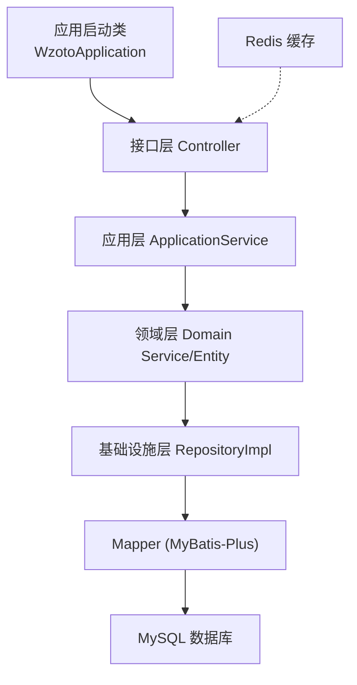
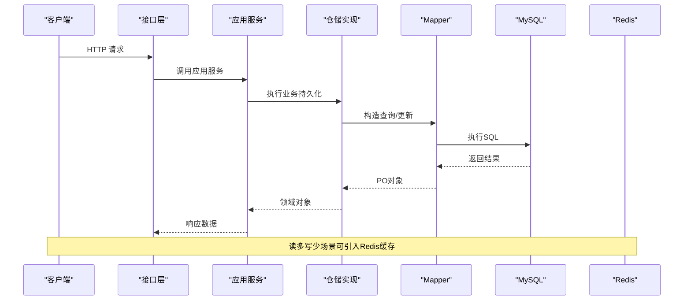
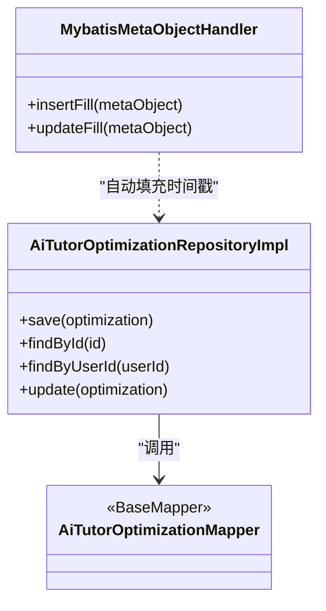
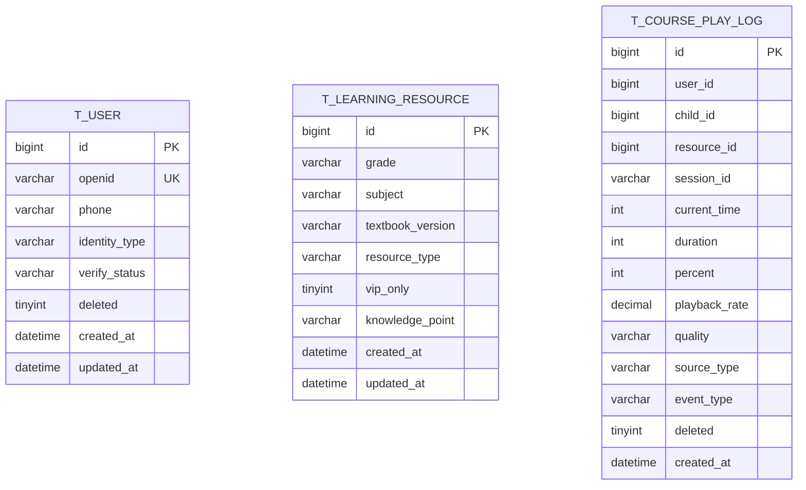
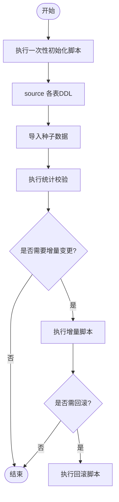
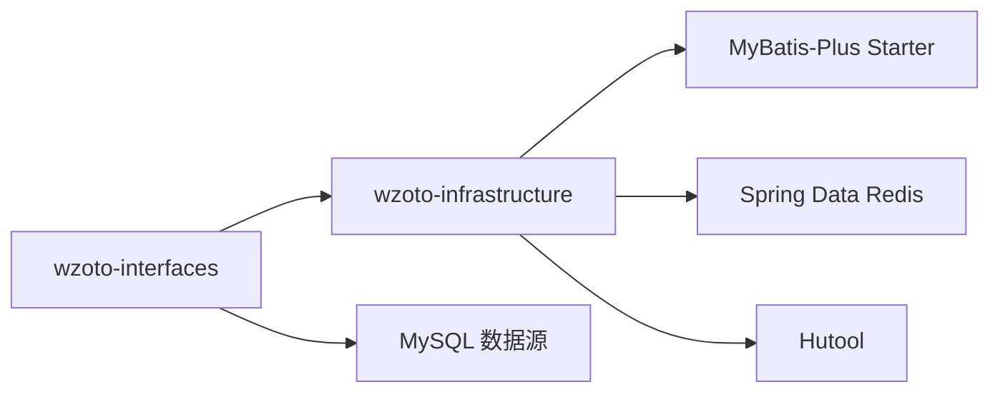

# 数据库运维

<cite>
**本文引用的文件**
- [application.yml](file://wzoto-backend/wzoto-interfaces/src/main/resources/application.yml)
- [pom.xml（后端聚合）](file://wzoto-backend/pom.xml)
- [MybatisMetaObjectHandler.java](file://wzoto-backend/wzoto-infrastructure/src/main/java/com/wzoto/infrastructure/config/MybatisMetaObjectHandler.java)
- [AiTutorOptimizationRepositoryImpl.java](file://wzoto-backend/wzoto-infrastructure/src/main/java/com/wzoto/infrastructure/repository/AiTutorOptimizationRepositoryImpl.java)
- [AiTutorOptimizationMapper.java](file://wzoto-backend/wzoto-infrastructure/src/main/java/com/wzoto/infrastructure/mapper/AiTutorOptimizationMapper.java)
- [t_user.sql](file://wzoto-backend/sql/t_user.sql)
- [t_learning_resource.sql](file://wzoto-backend/sql/t_learning_resource.sql)
- [v2_learning_resource_extend.sql](file://wzoto-backend/sql/v2_learning_resource_extend.sql)
- [init_all_learning_tables.sql](file://wzoto-backend/sql/init_all_learning_tables.sql)
- [fix_reimport_cleanup.sql](file://wzoto-backend/sql/fix_reimport_cleanup.sql)
- [generate-learning-resources.mjs](file://wzoto-backend/scripts/generate-learning-resources.mjs)
</cite>

## 目录
1. [简介](#简介)
2. [项目结构](#项目结构)
3. [核心组件](#核心组件)
4. [架构总览](#架构总览)
5. [详细组件分析](#详细组件分析)
6. [依赖关系分析](#依赖关系分析)
7. [性能调优指南](#性能调优指南)
8. [容量规划与扩容](#容量规划与扩容)
9. [高可用架构](#高可用架构)
10. [数据安全保护](#数据安全保护)
11. [迁移管理](#迁移管理)
12. [备份与恢复策略](#备份与恢复策略)
13. [日常运维操作手册](#日常运维操作手册)
14. [故障处理预案](#故障处理预案)
15. [结论](#结论)

## 简介
本指南面向wzoto项目的数据库运维，结合仓库中的SQL脚本、应用配置与基础设施层代码，给出可落地的备份恢复、性能调优、容量规划、高可用、安全、迁移与日常运维方案。文档既提供高层策略，也给出与代码映射的具体实践建议，便于DBA与研发协同落地。

## 项目结构
wzoto后端采用分层架构：接口层、应用层、领域层、基础设施层；数据库相关能力集中在基础设施层（MyBatis-Plus、Mapper、Repository实现），DDL与数据脚本集中于sql目录，应用配置在application.yml中。

图表来源
- [application.yml:6-17](file://wzoto-backend/wzoto-interfaces/src/main/resources/application.yml#L6-L17)
- [AiTutorOptimizationRepositoryImpl.java:1-41](file://wzoto-backend/wzoto-infrastructure/src/main/java/com/wzoto/infrastructure/repository/AiTutorOptimizationRepositoryImpl.java#L1-L41)
- [AiTutorOptimizationMapper.java:1-9](file://wzoto-backend/wzoto-infrastructure/src/main/java/com/wzoto/infrastructure/mapper/AiTutorOptimizationMapper.java#L1-L9)

章节来源
- [application.yml:6-17](file://wzoto-backend/wzoto-interfaces/src/main/resources/application.yml#L6-L17)
- [pom.xml（后端聚合）:21-26](file://wzoto-backend/pom.xml#L21-L26)

## 核心组件
- 数据源与连接：通过Spring Boot配置数据源URL、驱动、用户名密码等，使用MySQL JDBC驱动。
- ORM与自动填充：MyBatis-Plus作为ORM框架，启用逻辑删除字段；自定义MetaObjectHandler自动填充创建/更新时间。
- 仓储与Mapper：RepositoryImpl封装业务查询与持久化，Mapper继承BaseMapper提供基础CRUD。
- SQL脚本：集中存放表结构定义、增量变更、种子数据与修复脚本，支持一次性初始化与增量升级。

章节来源
- [application.yml:6-29](file://wzoto-backend/wzoto-interfaces/src/main/resources/application.yml#L6-L29)
- [MybatisMetaObjectHandler.java:17-28](file://wzoto-backend/wzoto-infrastructure/src/main/java/com/wzoto/infrastructure/config/MybatisMetaObjectHandler.java#L17-L28)
- [AiTutorOptimizationRepositoryImpl.java:20-47](file://wzoto-backend/wzoto-infrastructure/src/main/java/com/wzoto/infrastructure/repository/AiTutorOptimizationRepositoryImpl.java#L20-L47)
- [AiTutorOptimizationMapper.java:1-9](file://wzoto-backend/wzoto-infrastructure/src/main/java/com/wzoto/infrastructure/mapper/AiTutorOptimizationMapper.java#L1-L9)

## 架构总览
下图展示从请求到数据库的调用链，以及关键配置点（数据源、Redis、日志）。

图表来源
- [application.yml:6-17](file://wzoto-backend/wzoto-interfaces/src/main/resources/application.yml#L6-L17)
- [AiTutorOptimizationRepositoryImpl.java:20-47](file://wzoto-backend/wzoto-infrastructure/src/main/java/com/wzoto/infrastructure/repository/AiTutorOptimizationRepositoryImpl.java#L20-L47)
- [AiTutorOptimizationMapper.java:1-9](file://wzoto-backend/wzoto-infrastructure/src/main/java/com/wzoto/infrastructure/mapper/AiTutorOptimizationMapper.java#L1-L9)

## 详细组件分析

### 数据访问链路（以AI教员优化记录为例）
- RepositoryImpl负责将领域对象转换为PO并调用Mapper进行持久化或查询。
- Mapper继承BaseMapper，提供标准CRUD能力。
- MyBatis-Plus全局配置开启逻辑删除，统一软删除语义。

图表来源
- [AiTutorOptimizationRepositoryImpl.java:1-47](file://wzoto-backend/wzoto-infrastructure/src/main/java/com/wzoto/infrastructure/repository/AiTutorOptimizationRepositoryImpl.java#L1-L47)
- [AiTutorOptimizationMapper.java:1-9](file://wzoto-backend/wzoto-infrastructure/src/main/java/com/wzoto/infrastructure/mapper/AiTutorOptimizationMapper.java#L1-L9)
- [MybatisMetaObjectHandler.java:17-28](file://wzoto-backend/wzoto-infrastructure/src/main/java/com/wzoto/infrastructure/config/MybatisMetaObjectHandler.java#L17-L28)

章节来源
- [AiTutorOptimizationRepositoryImpl.java:20-47](file://wzoto-backend/wzoto-infrastructure/src/main/java/com/wzoto/infrastructure/repository/AiTutorOptimizationRepositoryImpl.java#L20-L47)
- [MybatisMetaObjectHandler.java:17-28](file://wzoto-backend/wzoto-infrastructure/src/main/java/com/wzoto/infrastructure/config/MybatisMetaObjectHandler.java#L17-L28)

### 表结构与索引设计（示例）
- 用户表包含唯一键与常用查询索引，便于按openid登录、按手机号检索、按身份与认证状态筛选。
- 学习资源表针对年级、学科、教材版本、资源类型、VIP可见性等维度建立复合索引，支撑多维检索与过滤。
- 播放明细日志表为高频写入表，建立会话、用户-资源、时间等索引，利于回放统计与问题定位。

图表来源
- [t_user.sql:7-26](file://wzoto-backend/sql/t_user.sql#L7-L26)
- [t_learning_resource.sql:4-35](file://wzoto-backend/sql/t_learning_resource.sql#L4-L35)
- [v2_learning_resource_extend.sql:76-96](file://wzoto-backend/sql/v2_learning_resource_extend.sql#L76-L96)

章节来源
- [t_user.sql:7-26](file://wzoto-backend/sql/t_user.sql#L7-L26)
- [t_learning_resource.sql:4-35](file://wzoto-backend/sql/t_learning_resource.sql#L4-L35)
- [v2_learning_resource_extend.sql:76-96](file://wzoto-backend/sql/v2_learning_resource_extend.sql#L76-L96)

### 数据初始化与增量脚本
- 一次性初始化脚本通过source方式组合多个DDL与种子数据，保证环境快速搭建。
- 增量脚本用于扩展字段、新增表、数据迁移与修复，具备幂等性与回滚友好性。
- 种子数据生成脚本批量插入学习资源，附带统计语句便于验证导入效果。

图表来源
- [init_all_learning_tables.sql:1-31](file://wzoto-backend/sql/init_all_learning_tables.sql#L1-L31)
- [v2_learning_resource_extend.sql:54-99](file://wzoto-backend/sql/v2_learning_resource_extend.sql#L54-L99)
- [generate-learning-resources.mjs:510-531](file://wzoto-backend/scripts/generate-learning-resources.mjs#L510-L531)

章节来源
- [init_all_learning_tables.sql:1-31](file://wzoto-backend/sql/init_all_learning_tables.sql#L1-L31)
- [v2_learning_resource_extend.sql:54-99](file://wzoto-backend/sql/v2_learning_resource_extend.sql#L54-L99)
- [generate-learning-resources.mjs:510-531](file://wzoto-backend/scripts/generate-learning-resources.mjs#L510-L531)

## 依赖关系分析
- 应用通过Spring Boot配置加载数据源与Redis连接信息。
- 基础设施层依赖MyBatis-Plus与Hutool等工具库，简化数据访问与通用功能。
- 模块间通过Maven聚合管理版本与依赖，确保一致性。

图表来源
- [application.yml:6-17](file://wzoto-backend/wzoto-interfaces/src/main/resources/application.yml#L6-L17)
- [pom.xml（后端聚合）:58-70](file://wzoto-backend/pom.xml#L58-L70)

章节来源
- [application.yml:6-17](file://wzoto-backend/wzoto-interfaces/src/main/resources/application.yml#L6-L17)
- [pom.xml（后端聚合）:58-70](file://wzoto-backend/pom.xml#L58-L70)

## 性能调优指南
- 慢查询分析
  - 开启慢查询日志，设定阈值（如1秒），定期导出与分析Top N慢SQL。
  - 结合EXPLAIN与索引命中情况，优先优化热点查询路径。
- 索引优化
  - 基于查询模式建立合适索引，避免过度索引导致写入放大。
  - 对高频过滤字段（如subject、knowledge_point、vip_only）建立单列或复合索引。
  - 对大表追加索引时，建议在低峰期执行并使用在线DDL工具。
- 连接池配置
  - 根据并发量调整最大连接数、空闲超时、获取超时等参数，避免连接耗尽或泄漏。
  - 监控连接池使用率与等待队列，动态调优。
- 分库分表策略
  - 读写分离：主库承担写与强一致读，从库承担读流量，降低主库压力。
  - 水平拆分：对增长快的大表（如播放明细日志）按时间或用户ID分片，归档历史数据。
  - 冷热分离：热数据放SSD，冷数据归档至低成本存储。

[本节为通用指导，不直接分析具体文件]

## 容量规划与扩容
- 存储空间估算
  - 依据日均写入行数、平均行大小、保留周期估算磁盘需求，预留30%以上冗余。
  - 关注JSON字段与文本字段占比，必要时拆分子表或外置存储。
- 增长趋势预测
  - 按月统计表行数与大小，拟合增长曲线，提前规划扩容窗口。
  - 对日志类表实施分区与归档策略。
- 扩容方案
  - 垂直扩容：提升CPU/内存/IO，适用于短期峰值。
  - 水平扩容：增加从库、分库分表、引入缓存与消息队列削峰。
  - 弹性伸缩：容器化部署配合自动扩缩容，结合监控指标触发。

[本节为通用指导，不直接分析具体文件]

## 高可用架构
- 主从复制
  - 配置半同步或组复制，保障数据一致性与故障切换RTO/RPO目标。
  - 定期演练切换流程，验证备库可读与主从延迟。
- 读写分离
  - 应用侧路由读请求至从库，写请求至主库；注意事务内强制走主库。
- 故障自动切换
  - 使用代理或中间件实现自动故障检测与切换，缩短恢复时间。
  - 配置健康检查与告警，确保异常早发现早处置。

[本节为通用指导，不直接分析具体文件]

## 数据安全保护
- 数据加密
  - 传输层TLS加密数据库连接；敏感字段（如手机号、身份证）落库前加密。
  - 密钥管理纳入统一KMS，定期轮换。
- 访问控制
  - 最小权限原则，按角色分配数据库账号与权限；生产禁止直连。
  - 审计账号与高危操作白名单，限制批量删除与DDL执行。
- 审计日志
  - 开启数据库审计，记录登录、DDL、DML与敏感查询。
  - 日志集中收集与留存，满足合规要求。

[本节为通用指导，不直接分析具体文件]

## 迁移管理
- 版本控制
  - 所有DDL与数据变更以脚本形式纳入版本管理，命名规范含版本号与描述。
  - 脚本具备幂等性，支持重复执行与回滚。
- 灰度发布
  - 先在小范围环境验证，再逐步推广；对大表变更采用双写或影子库过渡。
- 回滚策略
  - 每个变更配套回滚脚本；变更前备份受影响表或全库快照。
  - 发布失败立即回滚，减少影响面。

章节来源
- [init_all_learning_tables.sql:1-31](file://wzoto-backend/sql/init_all_learning_tables.sql#L1-L31)
- [v2_learning_resource_extend.sql:54-99](file://wzoto-backend/sql/v2_learning_resource_extend.sql#L54-L99)
- [fix_reimport_cleanup.sql:1-22](file://wzoto-backend/sql/fix_reimport_cleanup.sql#L1-L22)

## 备份与恢复策略
- 全量备份
  - 每日低峰期执行全量物理/逻辑备份，保留多份历史副本，异地存储。
  - 备份后校验完整性，定期演练恢复。
- 增量备份
  - 开启binlog增量备份，按时间点恢复；结合全量与增量制定RPO目标。
- 定时备份任务
  - 使用系统任务调度或数据库内置工具定时执行，记录执行日志与告警。
- 灾难恢复流程
  - 明确RTO/RPO目标，制定分级恢复预案（部分表恢复、整库恢复、跨机房切换）。
  - 恢复后进行数据一致性校验与业务回归测试。

[本节为通用指导，不直接分析具体文件]

## 日常运维操作手册
- 启动与配置
  - 确认数据源、Redis、JWT等环境变量正确注入。
  - 检查日志级别与输出位置，便于问题排查。
- 监控与巡检
  - 监控连接数、慢查询、锁等待、缓冲池命中率、磁盘空间。
  - 定期清理过期日志与临时表，保持系统整洁。
- 变更与发布
  - 严格执行变更评审与灰度发布流程，发布前后对比指标。
  - 变更失败及时回滚，记录复盘报告。

章节来源
- [application.yml:6-29](file://wzoto-backend/wzoto-interfaces/src/main/resources/application.yml#L6-L29)

## 故障处理预案
- 常见故障
  - 连接池耗尽：检查连接泄漏与慢查询，临时扩容连接数。
  - 慢查询突增：定位热点SQL，补充索引或改写查询。
  - 磁盘空间不足：清理历史数据、归档冷数据、扩容磁盘。
- 应急流程
  - 快速止血：限流、降级、切库或回滚。
  - 根因分析：收集日志、慢查询、系统指标，定位问题。
  - 恢复验证：数据一致性校验与业务回归。

[本节为通用指导，不直接分析具体文件]

## 结论
wzoto项目在数据库层面已具备清晰的表结构设计、完善的ORM与自动填充机制、规范的SQL脚本管理与基础设施集成。结合本文提供的备份恢复、性能调优、容量规划、高可用、安全、迁移与运维实践，可在现有基础上构建稳定、高效、安全的数据库体系，支撑业务持续增长与演进。