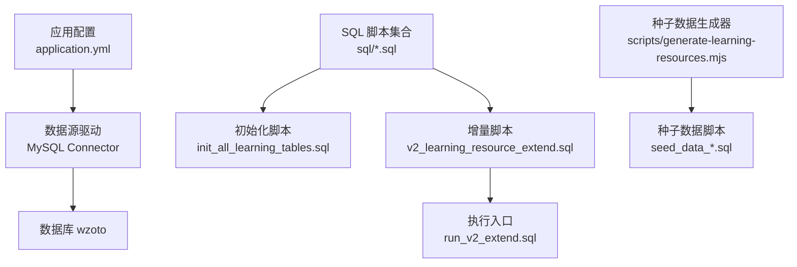
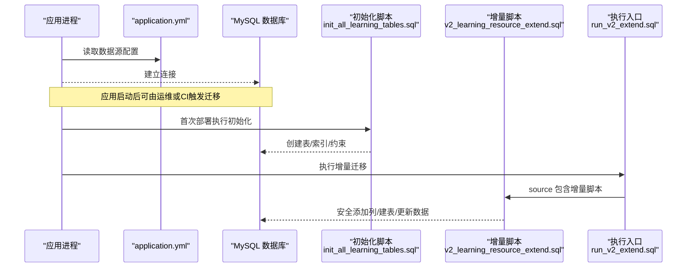
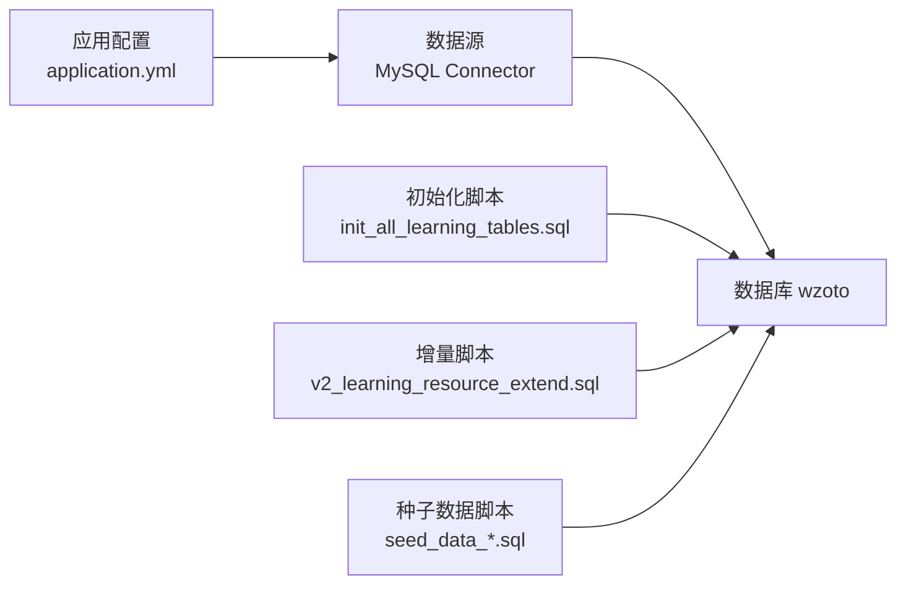

# 迁移管理

<cite>
**本文引用的文件**
- [wzoto-backend/pom.xml](file://wzoto-backend/pom.xml)
- [wzoto-backend/wzoto-infrastructure/pom.xml](file://wzoto-backend/wzoto-infrastructure/pom.xml)
- [application.yml](file://wzoto-backend/wzoto-interfaces/src/main/resources/application.yml)
- [init_all_learning_tables.sql](file://wzoto-backend/sql/init_all_learning_tables.sql)
- [v2_learning_resource_extend.sql](file://wzoto-backend/sql/v2_learning_resource_extend.sql)
- [run_v2_extend.sql](file://wzoto-backend/sql/run_v2_extend.sql)
- [fix_reimport_cleanup.sql](file://wzoto-backend/sql/fix_reimport_cleanup.sql)
- [t_knowledge_point.sql](file://wzoto-backend/sql/t_knowledge_point.sql)
- [t_resource_chapter.sql](file://wzoto-backend/sql/t_resource_chapter.sql)
- [seed_data_subject_knowledge.sql](file://wzoto-backend/sql/seed_data_subject_knowledge.sql)
- [generate-learning-resources.mjs](file://wzoto-backend/scripts/generate-learning-resources.mjs)
</cite>

## 目录
1. [简介](#简介)
2. [项目结构](#项目结构)
3. [核心组件](#核心组件)
4. [架构总览](#架构总览)
5. [详细组件分析](#详细组件分析)
6. [依赖关系分析](#依赖关系分析)
7. [性能考量](#性能考量)
8. [故障排查指南](#故障排查指南)
9. [结论](#结论)
10. [附录](#附录)

## 简介
本文件面向“数据库迁移管理”的完整流程，覆盖版本控制策略（SQL脚本版本管理、变更跟踪、依赖关系管理）、灰度发布（分阶段发布、数据迁移回滚、兼容性测试）、迁移工具使用（Flyway/Liquibase 配置建议、自动化流水线、迁移验证机制）、回滚策略（数据回滚方案、应用回滚流程、数据一致性恢复）、迁移监控（进度跟踪、错误处理、性能影响评估）以及最佳实践与常见问题。内容基于仓库中现有 SQL 脚本、应用配置与构建信息整理而成，并给出可落地的工程化建议。

## 项目结构
后端采用多模块 Maven 工程，数据库连接通过 Spring Boot 配置；数据库变更以 SQL 脚本形式集中管理在 sql 目录下，并通过组合脚本进行初始化与增量扩展。

图表来源
- [application.yml:6-17](file://wzoto-backend/wzoto-interfaces/src/main/resources/application.yml#L6-L17)
- [init_all_learning_tables.sql:1-31](file://wzoto-backend/sql/init_all_learning_tables.sql#L1-L31)
- [v2_learning_resource_extend.sql:1-100](file://wzoto-backend/sql/v2_learning_resource_extend.sql#L1-L100)
- [run_v2_extend.sql:1-3](file://wzoto-backend/sql/run_v2_extend.sql#L1-L3)
- [generate-learning-resources.mjs:286-531](file://wzoto-backend/scripts/generate-learning-resources.mjs#L286-L531)

章节来源
- [wzoto-backend/pom.xml:21-26](file://wzoto-backend/pom.xml#L21-L26)
- [wzoto-backend/wzoto-infrastructure/pom.xml:16-53](file://wzoto-backend/wzoto-infrastructure/pom.xml#L16-L53)
- [application.yml:6-17](file://wzoto-backend/wzoto-interfaces/src/main/resources/application.yml#L6-L17)

## 核心组件
- 数据库连接与配置：Spring Boot DataSource 指向 MySQL，字符集与时区已配置。
- 数据库变更脚本：
  - 初始化：一次性创建学习资源相关表并导入种子数据。
  - 增量：为已有表安全添加字段、创建新表、更新历史数据。
  - 修复：清理乱码数据后重新导入。
- 种子数据生成：Node.js 脚本批量生成知识点树、章节、微课、习题等数据。

章节来源
- [application.yml:6-17](file://wzoto-backend/wzoto-interfaces/src/main/resources/application.yml#L6-L17)
- [init_all_learning_tables.sql:1-31](file://wzoto-backend/sql/init_all_learning_tables.sql#L1-L31)
- [v2_learning_resource_extend.sql:1-100](file://wzoto-backend/sql/v2_learning_resource_extend.sql#L1-L100)
- [fix_reimport_cleanup.sql:1-22](file://wzoto-backend/sql/fix_reimport_cleanup.sql#L1-L22)
- [generate-learning-resources.mjs:286-531](file://wzoto-backend/scripts/generate-learning-resources.mjs#L286-L531)

## 架构总览
下图展示了从应用启动到数据库变更执行的端到端路径，包括配置加载、脚本组织与执行入口。

图表来源
- [application.yml:6-17](file://wzoto-backend/wzoto-interfaces/src/main/resources/application.yml#L6-L17)
- [init_all_learning_tables.sql:1-31](file://wzoto-backend/sql/init_all_learning_tables.sql#L1-L31)
- [run_v2_extend.sql:1-3](file://wzoto-backend/sql/run_v2_extend.sql#L1-L3)
- [v2_learning_resource_extend.sql:1-100](file://wzoto-backend/sql/v2_learning_resource_extend.sql#L1-L100)

## 详细组件分析

### 版本控制策略：SQL 脚本版本管理、变更跟踪、依赖关系管理
- 版本命名与顺序
  - 初始化脚本：init_all_learning_tables.sql，负责一次性创建学习资源相关表并导入种子数据。
  - 增量脚本：v2_learning_resource_extend.sql，提供向后兼容的字段新增、表创建与数据修复逻辑。
  - 执行入口：run_v2_extend.sql，作为增量迁移的统一入口，便于 CI/CD 调用。
- 依赖关系
  - init_all_learning_tables.sql 依赖多个单表 DDL（如 t_knowledge_point.sql、t_resource_chapter.sql），并通过 source 串联。
  - v2_learning_resource_extend.sql 依赖已有表结构，使用存储过程 safe_add_column 实现幂等添加列。
- 变更跟踪建议
  - 当前仓库未集成 Flyway/Liquibase 元数据表，建议在 CI 中引入迁移工具并在数据库中维护 schema_version 表，记录每次执行的脚本哈希与时间戳，确保可审计与可回滚。
- 幂等性与可重复执行
  - 增量脚本通过存储过程检查列是否存在再添加，避免重复执行报错。
  - 初始化脚本对目标表先 DROP 再 CREATE，适合开发/测试环境重建；生产环境应谨慎使用。

章节来源
- [init_all_learning_tables.sql:1-31](file://wzoto-backend/sql/init_all_learning_tables.sql#L1-L31)
- [t_knowledge_point.sql:1-22](file://wzoto-backend/sql/t_knowledge_point.sql#L1-L22)
- [t_resource_chapter.sql:1-20](file://wzoto-backend/sql/t_resource_chapter.sql#L1-L20)
- [v2_learning_resource_extend.sql:1-100](file://wzoto-backend/sql/v2_learning_resource_extend.sql#L1-L100)
- [run_v2_extend.sql:1-3](file://wzoto-backend/sql/run_v2_extend.sql#L1-L3)

### 灰度发布：分阶段发布策略、数据迁移回滚、兼容性测试
- 分阶段发布
  - 阶段一：仅执行初始化脚本，完成基础表结构与种子数据准备。
  - 阶段二：执行增量脚本，逐步引入新字段与新表，配合功能开关（如 AI 开关）控制新功能可见性。
- 数据迁移回滚
  - 针对新增字段：可通过删除列或重置默认值的方式回滚（需评估业务影响）。
  - 针对新增表：可删除表并清理关联数据。
  - 针对数据修复：使用 fix_reimport_cleanup.sql 清理异常数据后重新导入。
- 兼容性测试
  - 在预发环境执行完整迁移流程，校验表结构、索引、数据一致性与接口行为。
  - 结合前端路由与权限控制，验证新旧版本共存期间的兼容性。

章节来源
- [v2_learning_resource_extend.sql:1-100](file://wzoto-backend/sql/v2_learning_resource_extend.sql#L1-L100)
- [fix_reimport_cleanup.sql:1-22](file://wzoto-backend/sql/fix_reimport_cleanup.sql#L1-L22)
- [application.yml:31-46](file://wzoto-backend/wzoto-interfaces/src/main/resources/application.yml#L31-L46)

### 迁移工具使用：Flyway/Liquibase 配置、自动化迁移流水线、迁移验证机制
- Flyway/Liquibase 配置建议
  - 在 application.yml 中启用迁移工具（若集成），设置数据库连接信息与迁移脚本目录。
  - 使用版本号命名脚本（如 V1__init.sql、V2__extend.sql），保证执行顺序与可追溯。
  - 开启校验模式，防止脚本与版本不一致。
- 自动化迁移流水线
  - 在 CI 中增加“迁移执行”步骤：先备份数据库，再执行初始化/增量脚本，最后运行冒烟测试。
  - 失败时自动告警并触发回滚流程。
- 迁移验证机制
  - 执行后校验关键表存在性、字段完整性、索引数量与种子数据量。
  - 通过 API 冒烟测试验证数据可用性。

章节来源
- [application.yml:6-17](file://wzoto-backend/wzoto-interfaces/src/main/resources/application.yml#L6-L17)
- [init_all_learning_tables.sql:1-31](file://wzoto-backend/sql/init_all_learning_tables.sql#L1-L31)
- [v2_learning_resource_extend.sql:1-100](file://wzoto-backend/sql/v2_learning_resource_extend.sql#L1-L100)

### 回滚策略：数据回滚方案、应用回滚流程、数据一致性恢复
- 数据回滚方案
  - 新增字段：DROP COLUMN 或重置为旧默认值。
  - 新增表：DROP TABLE 并清理外键关联。
  - 数据修复：使用 fix_reimport_cleanup.sql 清理异常数据后重新导入。
- 应用回滚流程
  - 优先回滚应用代码至上一稳定版本，保持对新字段的兼容读取。
  - 若新字段为必填且无默认值，需在回滚前确保数据填充或临时放宽校验。
- 数据一致性恢复
  - 通过事务包裹关键迁移步骤，失败时整体回滚。
  - 对大表变更分批执行，减少锁表时间与回滚成本。

章节来源
- [fix_reimport_cleanup.sql:1-22](file://wzoto-backend/sql/fix_reimport_cleanup.sql#L1-L22)
- [v2_learning_resource_extend.sql:1-100](file://wzoto-backend/sql/v2_learning_resource_extend.sql#L1-L100)

### 迁移监控：迁移进度跟踪、错误处理、性能影响评估
- 进度跟踪
  - 记录每个脚本的执行开始/结束时间、影响行数、耗时。
  - 在 CI 日志中输出关键指标，便于问题定位。
- 错误处理
  - 捕获 SQL 执行异常，记录堆栈与上下文，支持重试与人工介入。
  - 对幂等脚本进行二次执行保护，避免重复变更。
- 性能影响评估
  - 大表 DDL 变更建议在低峰期执行，并使用在线 DDL（如 MySQL 8.0+）减少锁表。
  - 对索引重建与数据更新进行批量化，降低 IO 压力。

章节来源
- [v2_learning_resource_extend.sql:1-100](file://wzoto-backend/sql/v2_learning_resource_extend.sql#L1-L100)
- [init_all_learning_tables.sql:1-31](file://wzoto-backend/sql/init_all_learning_tables.sql#L1-L31)

### 种子数据与依赖关系
- 种子数据生成器 generate-learning-resources.mjs 负责批量生成知识点树、章节、微课、习题、试卷、音频、资料等数据，并通过 SQL 插入语句写入数据库。
- 该脚本与 init_all_learning_tables.sql 配合，形成“结构 + 数据”的一体化初始化流程。

章节来源
- [generate-learning-resources.mjs:286-531](file://wzoto-backend/scripts/generate-learning-resources.mjs#L286-L531)
- [init_all_learning_tables.sql:1-31](file://wzoto-backend/sql/init_all_learning_tables.sql#L1-L31)
- [seed_data_subject_knowledge.sql:1-20](file://wzoto-backend/sql/seed_data_subject_knowledge.sql#L1-L20)

## 依赖关系分析
- 应用层依赖
  - Spring Boot 应用通过 application.yml 配置数据源，依赖 MySQL 连接器。
- 基础设施层依赖
  - MyBatis-Plus 与 MySQL 连接器用于数据访问。
- 脚本依赖
  - 初始化脚本依赖多个单表 DDL；增量脚本依赖已有表结构。

图表来源
- [application.yml:6-17](file://wzoto-backend/wzoto-interfaces/src/main/resources/application.yml#L6-L17)
- [init_all_learning_tables.sql:1-31](file://wzoto-backend/sql/init_all_learning_tables.sql#L1-L31)
- [v2_learning_resource_extend.sql:1-100](file://wzoto-backend/sql/v2_learning_resource_extend.sql#L1-L100)
- [seed_data_subject_knowledge.sql:1-20](file://wzoto-backend/sql/seed_data_subject_knowledge.sql#L1-L20)

章节来源
- [wzoto-backend/wzoto-infrastructure/pom.xml:16-53](file://wzoto-backend/wzoto-infrastructure/pom.xml#L16-L53)
- [application.yml:6-17](file://wzoto-backend/wzoto-interfaces/src/main/resources/application.yml#L6-L17)

## 性能考量
- 大表变更建议使用在线 DDL，避免长时间锁表。
- 批量插入与更新应分批次执行，减少事务大小与回滚成本。
- 索引重建应在低峰期进行，并结合统计信息优化查询计划。
- 对高频读写的表，合理设计索引与分区策略，提升查询性能。

[本节为通用指导，不直接分析具体文件]

## 故障排查指南
- 常见错误
  - 字符集乱码：使用 fix_reimport_cleanup.sql 清理并重新导入。
  - 重复执行报错：确认脚本幂等性，必要时加入存在性检查。
  - 连接失败：检查 application.yml 中的数据库地址、用户名、密码与环境变量。
- 排查步骤
  - 查看应用日志与数据库错误日志，定位具体 SQL 与上下文。
  - 在预发环境复现问题，逐步缩小范围。
  - 对关键迁移步骤增加日志与监控，便于快速定位。

章节来源
- [fix_reimport_cleanup.sql:1-22](file://wzoto-backend/sql/fix_reimport_cleanup.sql#L1-L22)
- [application.yml:6-17](file://wzoto-backend/wzoto-interfaces/src/main/resources/application.yml#L6-L17)

## 结论
本项目采用“初始化 + 增量”的 SQL 脚本方式进行数据库迁移，具备基本的幂等性与可重复执行能力。建议在生产环境中引入 Flyway/Liquibase 进行版本管理与变更跟踪，结合 CI/CD 实现自动化迁移与验证，完善回滚策略与监控体系，确保迁移过程安全、可控、可追溯。

[本节为总结性内容，不直接分析具体文件]

## 附录
- 最佳实践
  - 脚本命名规范：按版本号递增，描述清晰。
  - 幂等设计：所有脚本应支持重复执行而不产生副作用。
  - 灰度发布：先小流量验证，再全量推广。
  - 监控告警：对迁移失败与性能异常及时告警。
- 常见问题
  - 字符集问题：统一使用 utf8mb4，避免乱码。
  - 索引缺失：迁移后校验索引完整性。
  - 数据一致性：迁移前后进行数据比对与校验。

[本节为通用指导，不直接分析具体文件]