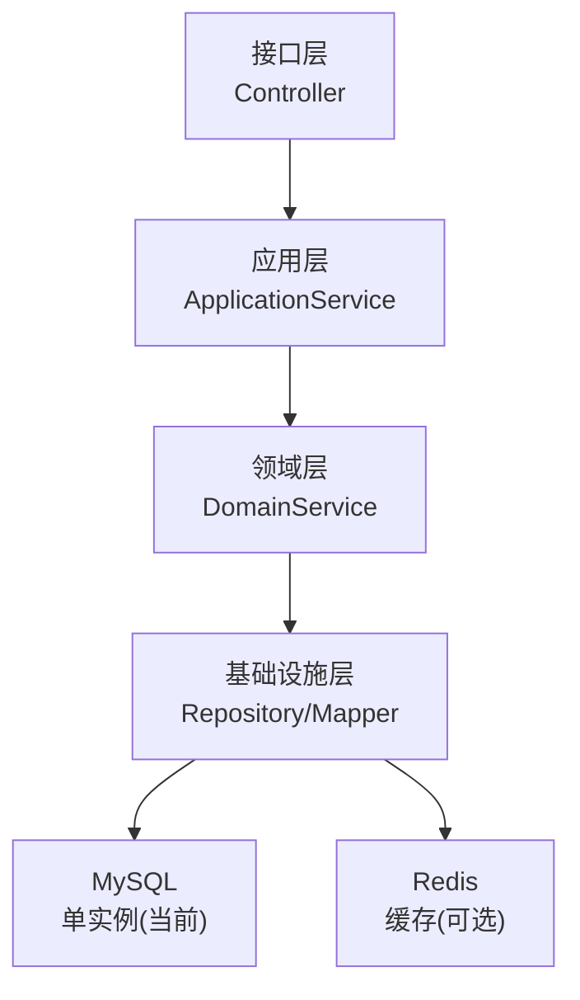
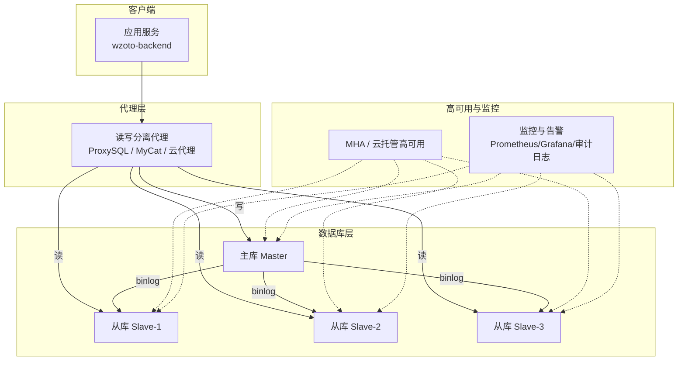
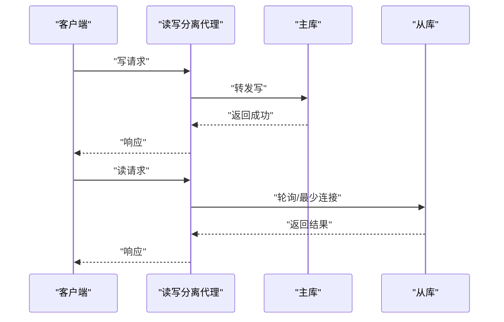
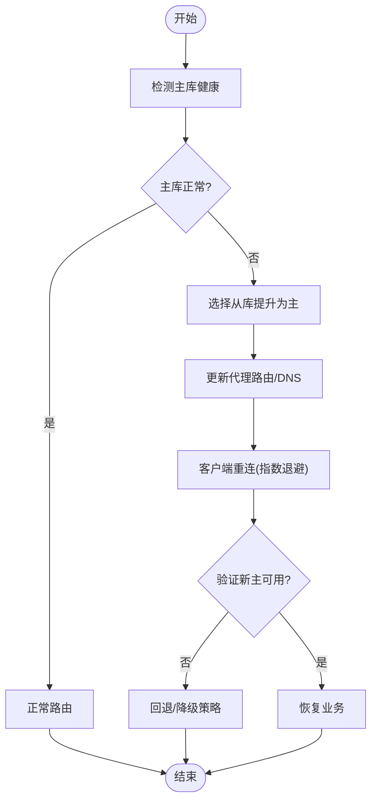
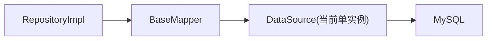

# 高可用架构

<cite>
**本文引用的文件**
- [application.yml](file://wzoto-backend/wzoto-interfaces/src/main/resources/application.yml)
- [pom.xml（根）](file://wzoto-backend/pom.xml)
- [pom.xml（基础设施层）](file://wzoto-backend/wzoto-infrastructure/pom.xml)
- [UserMapper.java](file://wzoto-backend/wzoto-infrastructure/src/main/java/com/wzoto/infrastructure/mapper/UserMapper.java)
- [UserRepositoryImpl.java](file://wzoto-backend/wzoto-infrastructure/src/main/java/com/wzoto/infrastructure/repository/UserRepositoryImpl.java)
- [t_user.sql](file://wzoto-backend/sql/t_user.sql)
- [init_all_learning_tables.sql](file://wzoto-backend/sql/init_all_learning_tables.sql)
</cite>

## 目录
1. [简介](#简介)
2. [项目结构](#项目结构)
3. [核心组件](#核心组件)
4. [架构总览](#架构总览)
5. [详细组件分析](#详细组件分析)
6. [依赖关系分析](#依赖关系分析)
7. [性能考量](#性能考量)
8. [故障处理与恢复预案](#故障处理与恢复预案)
9. [结论](#结论)
10. [附录：配置与部署清单](#附录配置与部署清单)

## 简介
本方案围绕“数据库高可用”为目标，结合当前后端工程现状，给出可落地的 MySQL 主从复制、读写分离、故障自动切换、集群部署与监控告警体系设计。同时提供故障处理预案与恢复流程，确保在业务增长与稳定性要求提升时，数据库层具备弹性与韧性。

## 项目结构
当前后端采用分层架构：接口层、应用层、领域层、基础设施层。数据库访问通过 MyBatis-Plus 的 Mapper 与 Repository 实现，数据源由 Spring Boot 统一配置。该结构为后续引入读写分离与高可用提供了清晰的扩展点。

图表来源
- [application.yml:6-17](file://wzoto-backend/wzoto-interfaces/src/main/resources/application.yml#L6-L17)
- [UserMapper.java:1-12](file://wzoto-backend/wzoto-infrastructure/src/main/java/com/wzoto/infrastructure/mapper/UserMapper.java#L1-L12)
- [UserRepositoryImpl.java:39-81](file://wzoto-backend/wzoto-infrastructure/src/main/java/com/wzoto/infrastructure/repository/UserRepositoryImpl.java#L39-L81)

章节来源
- [application.yml:6-17](file://wzoto-backend/wzoto-interfaces/src/main/resources/application.yml#L6-L17)
- [pom.xml（根）:21-26](file://wzoto-backend/pom.xml#L21-L26)
- [pom.xml（基础设施层）:16-53](file://wzoto-backend/wzoto-infrastructure/pom.xml#L16-L53)

## 核心组件
- 数据源与连接池：Spring Boot DataSource + MyBatis-Plus；当前指向单机 MySQL。
- 仓储与映射：Repository 封装领域对象与持久化 PO 的转换；Mapper 基于 MyBatis-Plus BaseMapper。
- 缓存：Redis 已集成，可用于热点读缓存与分布式锁等。
- 可扩展点：通过抽象 DataSource/路由策略，可在不侵入业务代码的前提下接入读写分离与多数据源。

章节来源
- [application.yml:6-17](file://wzoto-backend/wzoto-interfaces/src/main/resources/application.yml#L6-L17)
- [UserMapper.java:1-12](file://wzoto-backend/wzoto-infrastructure/src/main/java/com/wzoto/infrastructure/mapper/UserMapper.java#L1-L12)
- [UserRepositoryImpl.java:39-81](file://wzoto-backend/wzoto-infrastructure/src/main/java/com/wzoto/infrastructure/repository/UserRepositoryImpl.java#L39-L81)

## 架构总览
目标架构：一主多从 + 读写分离 + 半同步复制 + 自动故障切换 + 监控告警。

图表来源
- [application.yml:6-17](file://wzoto-backend/wzoto-interfaces/src/main/resources/application.yml#L6-L17)
- [pom.xml（基础设施层）:16-53](file://wzoto-backend/wzoto-infrastructure/pom.xml#L16-L53)

## 详细组件分析

### 主从复制与一致性模型
- 异步复制：默认模式，吞吐最高，存在极小概率数据丢失风险。适用于读多写少且对一致性容忍度高的场景。
- 半同步复制：提交需至少一个从库确认，兼顾一致性与可用性，轻微延迟增加。推荐用于强一致要求较高的交易类写入。
- 选择建议：
  - 学习资源、题库、课程播放记录等以读为主的数据：异步复制即可。
  - 用户认证、订单、会员状态等关键写入：启用半同步复制。
- 一致性保障要点：
  - 事务边界内避免跨库读取旧数据；必要时使用强制读主或会话级绑定主库。
  - 对关键业务开启 binlog_row_image=FULL，便于问题回溯与增量修复。

章节来源
- [application.yml:6-17](file://wzoto-backend/wzoto-interfaces/src/main/resources/application.yml#L6-L17)

### 读写分离与负载均衡
- 连接路由策略：
  - 写请求：始终路由到主库。
  - 读请求：按权重轮询或最少连接数策略分发至从库。
  - 特殊读：对强一致读（如刚写入后立即读取）强制走主库或设置短超时重试。
- 负载均衡配置：
  - 代理层（ProxySQL/MyCat/云代理）维护从库健康与权重，支持灰度扩容。
  - 应用侧可通过多数据源+动态路由实现轻量级读写分离（适合中小规模）。
- 数据一致性保证：
  - 会话级主从绑定：同一事务内的多次读均命中主库。
  - 读后写补偿：对最终一致性的读路径，提供幂等校验与重试机制。
  - 缓存与数据库一致性：先更新库再删缓存，或采用延迟双删/订阅 binlog 更新缓存。

图表来源
- [application.yml:6-17](file://wzoto-backend/wzoto-interfaces/src/main/resources/application.yml#L6-L17)

### 故障自动切换
- 主节点故障检测：
  - 代理层心跳探测（TCP/MySQL 握手），连续失败阈值触发切换。
  - MHA 通过 SSH/脚本检测主库存活并协调从库提升。
- 从节点提升机制：
  - 选择最优候选从库（GTID 最新、延迟最小、负载最低）。
  - 提升为新主，更新代理路由表与 DNS/VIP。
- 客户端重连策略：
  - 连接池快速失效与重试（指数退避、抖动）。
  - 应用层捕获 SQL 异常，识别主库不可用错误码，进行本地降级与重试。
  - 对于关键写操作，结合幂等键与去重表防止重复提交。

图表来源
- [application.yml:6-17](file://wzoto-backend/wzoto-interfaces/src/main/resources/application.yml#L6-L17)

### 集群部署方案
- MHA 高可用：
  - 适用自建 MySQL 集群，成本低，灵活度高。
  - 需要运维能力较强，关注脑裂与网络分区处理。
- InnoDB Cluster（MySQL Shell）：
  - 原生组复制，自动选主与一致性保障更强。
  - 运维复杂度较高，适合大型团队与平台化建设。
- 云数据库服务：
  - 托管式高可用、自动备份与监控，开箱即用。
  - 成本可控，适合快速上线与稳定运行。

选型建议：
- 初创/中小规模：优先云数据库高可用版，降低运维成本。
- 中大型/合规要求高：InnoDB Cluster 或 MHA，结合企业级监控与审计。

### 监控告警体系
- 健康检查：
  - 主从延迟（Seconds_Behind_Master）、IO/SQL 线程状态、连接数、QPS、TPS。
  - 代理层健康探针与路由表变更事件。
- 性能监控：
  - 慢查询、锁等待、缓冲池命中率、redo/undo 使用率。
  - 指标采集：Prometheus + Exporter，可视化：Grafana。
- 异常告警：
  - 主从断开、延迟超阈值、慢查询突增、磁盘空间不足、连接池耗尽。
  - 告警通道：邮件、短信、IM 群机器人。
- 审计与追踪：
  - 开启通用日志/审计插件，记录关键 DDL/DML。
  - 结合链路追踪定位慢请求根因。

章节来源
- [application.yml:6-17](file://wzoto-backend/wzoto-interfaces/src/main/resources/application.yml#L6-L17)

## 依赖关系分析
当前工程对数据库的依赖集中在基础设施层，通过 MyBatis-Plus 与 Spring Boot 数据源管理。未来引入读写分离时，建议在基础设施层新增“数据源路由”模块，屏蔽上层调用差异。

图表来源
- [UserMapper.java:1-12](file://wzoto-backend/wzoto-infrastructure/src/main/java/com/wzoto/infrastructure/mapper/UserMapper.java#L1-L12)
- [UserRepositoryImpl.java:39-81](file://wzoto-backend/wzoto-infrastructure/src/main/java/com/wzoto/infrastructure/repository/UserRepositoryImpl.java#L39-L81)
- [application.yml:6-17](file://wzoto-backend/wzoto-interfaces/src/main/resources/application.yml#L6-L17)

章节来源
- [pom.xml（基础设施层）:16-53](file://wzoto-backend/wzoto-infrastructure/pom.xml#L16-L53)
- [application.yml:6-17](file://wzoto-backend/wzoto-interfaces/src/main/resources/application.yml#L6-L17)

## 性能考量
- 连接池调优：合理设置最大连接数、空闲回收、获取超时，避免连接风暴。
- 索引优化：依据慢查询与执行计划优化索引，减少全表扫描。
- 读写分离收益：将大部分读流量分流至从库，显著降低主库压力。
- 缓存策略：热点读数据入 Redis，降低数据库压力；注意缓存穿透/雪崩防护。
- 批量与分页：大查询拆分、限制单次返回量，避免长事务与大事务。

[本节为通用指导，不直接分析具体文件]

## 故障处理与恢复预案
- 主库宕机：
  - 代理层检测到不可用，触发从库提升；应用层捕获异常并重试。
  - 若出现数据不一致，基于 binlog 回放与 GTID 进行定点修复。
- 从库落后：
  - 临时提升读流量至主库或只读从库；必要时暂停非关键写任务。
  - 调整复制参数（并行复制、压缩传输）加速追赶。
- 网络分区/脑裂：
  - 通过仲裁节点与租约机制避免双主；必要时人工介入切流。
- 容量不足：
  - 扩容从库、分库分表规划；冷热数据分离归档。
- 恢复流程：
  - 发现告警 -> 隔离故障节点 -> 切换流量 -> 数据一致性校验 -> 恢复原状 -> 复盘改进。

[本节为通用指导，不直接分析具体文件]

## 结论
通过将当前单实例 MySQL 升级为“主从复制 + 读写分离 + 自动切换 + 监控告警”的高可用架构，可在不侵入业务代码的前提下显著提升系统韧性与扩展性。建议优先采用云数据库高可用方案快速落地，逐步演进至更复杂的自治型集群。

[本节为总结性内容，不直接分析具体文件]

## 附录：配置与部署清单
- 数据源配置位置：
  - 应用配置：application.yml 中的 datasource.url/username/password 及 Redis 配置。
- 数据库初始化：
  - 建库与表结构：t_user.sql、init_all_learning_tables.sql。
- 依赖与版本：
  - Spring Boot 3.2.5、MyBatis-Plus 3.5.6、MySQL Connector/J。

章节来源
- [application.yml:6-17](file://wzoto-backend/wzoto-interfaces/src/main/resources/application.yml#L6-L17)
- [t_user.sql:1-26](file://wzoto-backend/sql/t_user.sql#L1-L26)
- [init_all_learning_tables.sql:1-31](file://wzoto-backend/sql/init_all_learning_tables.sql#L1-L31)
- [pom.xml（根）:7-11](file://wzoto-backend/pom.xml#L7-L11)
- [pom.xml（根）:58-63](file://wzoto-backend/pom.xml#L58-L63)
- [pom.xml（基础设施层）:49-53](file://wzoto-backend/wzoto-infrastructure/pom.xml#L49-L53)