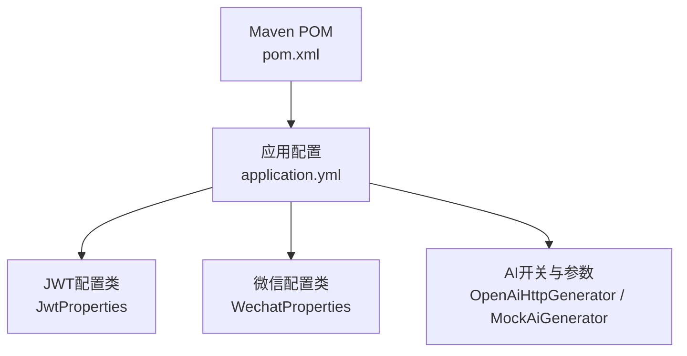
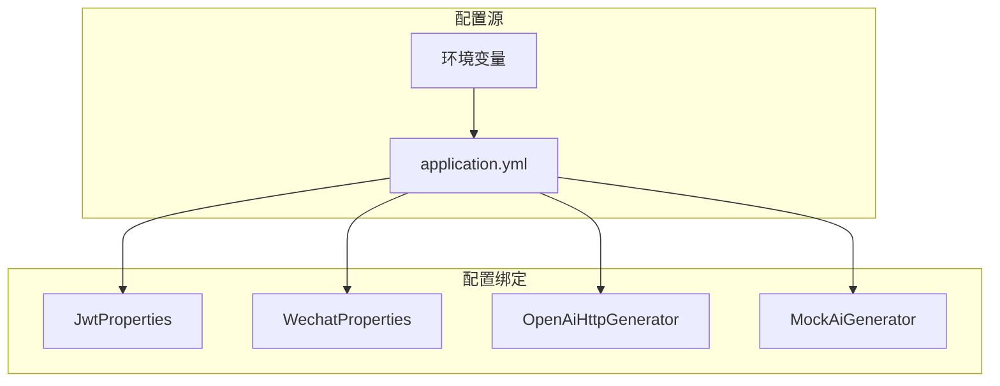
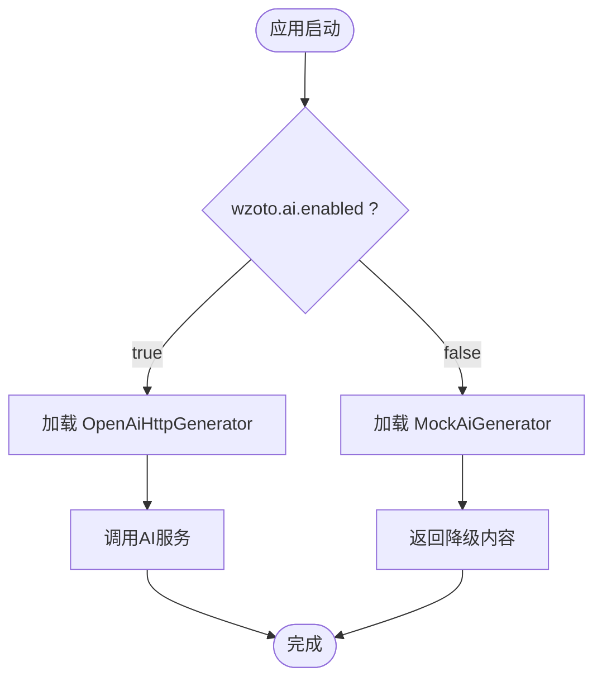
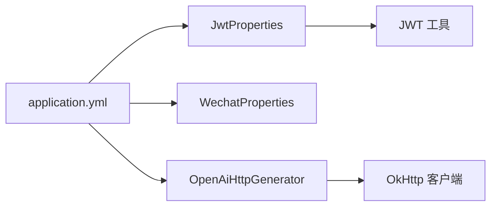

# 环境配置管理

<cite>
**本文引用的文件**
- [application.yml](file://wzoto-backend/wzoto-interfaces/src/main/resources/application.yml)
- [JwtProperties.java](file://wzoto-backend/wzoto-infrastructure/src/main/java/com/wzoto/infrastructure/config/JwtProperties.java)
- [WechatProperties.java](file://wzoto-backend/wzoto-infrastructure/src/main/java/com/wzoto/infrastructure/config/WechatProperties.java)
- [OpenAiHttpGenerator.java](file://wzoto-backend/wzoto-infrastructure/src/main/java/com/wzoto/infrastructure/ai/OpenAiHttpGenerator.java)
- [MockAiGenerator.java](file://wzoto-backend/wzoto-infrastructure/src/main/java/com/wzoto/infrastructure/ai/MockAiGenerator.java)
- [pom.xml](file://wzoto-backend/pom.xml)
</cite>

## 目录
1. [简介](#简介)
2. [项目结构](#项目结构)
3. [核心组件](#核心组件)
4. [架构总览](#架构总览)
5. [详细组件分析](#详细组件分析)
6. [依赖关系分析](#依赖关系分析)
7. [性能考虑](#性能考虑)
8. [故障排查指南](#故障排查指南)
9. [结论](#结论)
10. [附录](#附录)

## 简介
本文件面向wzoto后端的环境配置管理，聚焦多环境策略（开发、测试、生产）、环境变量注入、配置文件优先级与覆盖机制、Spring Boot外部化配置最佳实践，以及Docker与Kubernetes的部署示例。同时给出敏感信息保护、版本管理与热更新方案建议，帮助团队在安全与可维护性之间取得平衡。

## 项目结构
- 应用入口与主配置位于接口层资源目录：application.yml集中声明了服务器端口、数据源、Redis、MyBatis-Plus及业务相关配置前缀wzoto.*。
- 基础设施层提供配置类：JwtProperties、WechatProperties将wzoto.jwt与wzoto.wechat映射为Java对象；AI能力通过OpenAiHttpGenerator与MockAiGenerator按开关切换。
- 构建与依赖由根pom.xml统一管理，确保各模块共享一致的运行时基线。

图表来源
- [application.yml:1-51](file://wzoto-backend/wzoto-interfaces/src/main/resources/application.yml#L1-L51)
- [JwtProperties.java:1-26](file://wzoto-backend/wzoto-infrastructure/src/main/java/com/wzoto/infrastructure/config/JwtProperties.java#L1-L26)
- [WechatProperties.java:1-23](file://wzoto-backend/wzoto-infrastructure/src/main/java/com/wzoto/infrastructure/config/WechatProperties.java#L1-L23)
- [OpenAiHttpGenerator.java:23-38](file://wzoto-backend/wzoto-infrastructure/src/main/java/com/wzoto/infrastructure/ai/OpenAiHttpGenerator.java#L23-L38)
- [MockAiGenerator.java:14-14](file://wzoto-backend/wzoto-infrastructure/src/main/java/com/wzoto/infrastructure/ai/MockAiGenerator.java#L14-L14)
- [pom.xml:1-126](file://wzoto-backend/pom.xml#L1-L126)

章节来源
- [application.yml:1-51](file://wzoto-backend/wzoto-interfaces/src/main/resources/application.yml#L1-L51)
- [pom.xml:1-126](file://wzoto-backend/pom.xml#L1-L126)

## 核心组件
- 数据库连接：通过spring.datasource.*配置，支持使用环境变量注入密码。
- Redis：通过spring.data.redis.*配置，支持主机、端口、密码等外部化。
- JWT：通过wzoto.jwt.*配置，密钥与过期时间可通过环境变量覆盖。
- 微信：通过wzoto.wechat.*配置，AppId与Secret外部化。
- AI服务：通过wzoto.ai.*控制是否启用真实调用或降级到Mock实现，并支持base-url、api-key、model、temperature等参数外部化。

章节来源
- [application.yml:6-47](file://wzoto-backend/wzoto-interfaces/src/main/resources/application.yml#L6-L47)
- [JwtProperties.java:10-26](file://wzoto-backend/wzoto-infrastructure/src/main/java/com/wzoto/infrastructure/config/JwtProperties.java#L10-L26)
- [WechatProperties.java:10-23](file://wzoto-backend/wzoto-infrastructure/src/main/java/com/wzoto/infrastructure/config/WechatProperties.java#L10-L23)
- [OpenAiHttpGenerator.java:23-38](file://wzoto-backend/wzoto-infrastructure/src/main/java/com/wzoto/infrastructure/ai/OpenAiHttpGenerator.java#L23-L38)
- [MockAiGenerator.java:14-14](file://wzoto-backend/wzoto-infrastructure/src/main/java/com/wzoto/infrastructure/ai/MockAiGenerator.java#L14-L14)

## 架构总览
下图展示了配置加载与关键组件的关系：application.yml作为单一事实源，结合环境变量进行覆盖；配置类将wzoto.*映射为Bean；AI能力根据开关选择真实或Mock实现。

图表来源
- [application.yml:6-47](file://wzoto-backend/wzoto-interfaces/src/main/resources/application.yml#L6-L47)
- [JwtProperties.java:10-26](file://wzoto-backend/wzoto-infrastructure/src/main/java/com/wzoto/infrastructure/config/JwtProperties.java#L10-L26)
- [WechatProperties.java:10-23](file://wzoto-backend/wzoto-infrastructure/src/main/java/com/wzoto/infrastructure/config/WechatProperties.java#L10-L23)
- [OpenAiHttpGenerator.java:23-38](file://wzoto-backend/wzoto-infrastructure/src/main/java/com/wzoto/infrastructure/ai/OpenAiHttpGenerator.java#L23-L38)
- [MockAiGenerator.java:14-14](file://wzoto-backend/wzoto-infrastructure/src/main/java/com/wzoto/infrastructure/ai/MockAiGenerator.java#L14-L14)

## 详细组件分析

### 多环境配置策略（开发/测试/生产）
- 推荐做法
  - 以application.yml为基准配置，仅保留默认值与通用项。
  - 通过环境变量覆盖敏感或环境相关参数（数据库、Redis、JWT、微信、AI）。
  - 不同环境通过启动参数或容器编排注入不同的环境变量集合，避免在代码仓库中留存敏感信息。
- 当前已支持的外部化键
  - 数据库：MYSQL_PASSWORD
  - Redis：REDIS_HOST、REDIS_PORT、REDIS_PASSWORD
  - JWT：JWT_SECRET
  - 微信：WECHAT_APP_ID、WECHAT_APP_SECRET
  - AI：AI_ENABLED、AI_BASE_URL、AI_API_KEY、AI_MODEL、AI_TEMPERATURE

章节来源
- [application.yml:7-47](file://wzoto-backend/wzoto-interfaces/src/main/resources/application.yml#L7-L47)

### 环境变量与配置绑定
- 数据库连接
  - 驱动、URL、用户名在application.yml中定义，密码通过环境变量注入。
- Redis
  - 主机、端口、密码均可通过环境变量覆盖，便于在不同环境快速切换。
- JWT
  - 密钥与过期时间通过wzoto.jwt.*暴露，密钥必须通过环境变量设置。
- 微信
  - AppId与Secret通过wzoto.wechat.*暴露，需外部化。
- AI服务
  - 通过wzoto.ai.enabled开关决定使用OpenAiHttpGenerator还是MockAiGenerator；其余参数如base-url、api-key、model、temperature均支持外部化。

章节来源
- [application.yml:7-47](file://wzoto-backend/wzoto-interfaces/src/main/resources/application.yml#L7-L47)
- [JwtProperties.java:10-26](file://wzoto-backend/wzoto-infrastructure/src/main/java/com/wzoto/infrastructure/config/JwtProperties.java#L10-L26)
- [WechatProperties.java:10-23](file://wzoto-backend/wzoto-infrastructure/src/main/java/com/wzoto/infrastructure/config/WechatProperties.java#L10-L23)
- [OpenAiHttpGenerator.java:23-38](file://wzoto-backend/wzoto-infrastructure/src/main/java/com/wzoto/infrastructure/ai/OpenAiHttpGenerator.java#L23-L38)
- [MockAiGenerator.java:14-14](file://wzoto-backend/wzoto-infrastructure/src/main/java/com/wzoto/infrastructure/ai/MockAiGenerator.java#L14-L14)

### 配置文件优先级与覆盖机制
- Spring Boot外部化配置顺序（从高到低）
  - 命令行参数
  - Java系统属性
  - OS环境变量
  - application-{profile}.yml
  - application.yml
- 本项目采用“application.yml + 环境变量”的方式，敏感项一律通过环境变量注入，保证不同环境安全隔离。
- 建议
  - 将非敏感默认值留在application.yml。
  - 将敏感与环境相关项放入环境变量或平台托管的配置中心。

章节来源
- [application.yml:1-51](file://wzoto-backend/wzoto-interfaces/src/main/resources/application.yml#L1-L51)

### Docker环境变量注入示例
- 启动时通过-e传入必要变量，例如：
  - MYSQL_PASSWORD、REDIS_HOST、REDIS_PORT、REDIS_PASSWORD
  - JWT_SECRET、WECHAT_APP_ID、WECHAT_APP_SECRET
  - AI_ENABLED、AI_BASE_URL、AI_API_KEY、AI_MODEL、AI_TEMPERATURE
- 或使用.env文件配合docker-compose，将敏感信息从镜像中剥离。

[本节为通用实践说明，不直接分析具体文件]

### Kubernetes ConfigMap与Secret使用指南
- ConfigMap
  - 存放非敏感配置（如AI模型名、温度、日志级别等），挂载为环境变量或卷。
- Secret
  - 存放敏感信息（数据库密码、Redis密码、JWT密钥、微信密钥、AI API Key），通过环境变量注入。
- 建议
  - 使用命名空间隔离不同环境。
  - 结合滚动更新实现配置变更的平滑发布。

[本节为通用实践说明，不直接分析具体文件]

### AI能力开关与降级流程
- 当wzoto.ai.enabled=true时，启用OpenAiHttpGenerator进行真实AI调用；否则使用MockAiGenerator返回降级结果。
- 该行为通过条件注解控制，确保不同环境按需启用。

图表来源
- [OpenAiHttpGenerator.java:23-38](file://wzoto-backend/wzoto-infrastructure/src/main/java/com/wzoto/infrastructure/ai/OpenAiHttpGenerator.java#L23-L38)
- [MockAiGenerator.java:14-14](file://wzoto-backend/wzoto-infrastructure/src/main/java/com/wzoto/infrastructure/ai/MockAiGenerator.java#L14-L14)

章节来源
- [OpenAiHttpGenerator.java:23-38](file://wzoto-backend/wzoto-infrastructure/src/main/java/com/wzoto/infrastructure/ai/OpenAiHttpGenerator.java#L23-L38)
- [MockAiGenerator.java:14-14](file://wzoto-backend/wzoto-infrastructure/src/main/java/com/wzoto/infrastructure/ai/MockAiGenerator.java#L14-L14)

## 依赖关系分析
- 配置绑定依赖
  - JwtProperties绑定wzoto.jwt.*
  - WechatProperties绑定wzoto.wechat.*
  - OpenAiHttpGenerator读取wzoto.ai.*并通过@Value注入
- 运行期依赖
  - MyBatis-Plus用于数据访问
  - OkHttp用于HTTP调用（AI）
  - JJWT用于JWT处理

图表来源
- [application.yml:6-47](file://wzoto-backend/wzoto-interfaces/src/main/resources/application.yml#L6-L47)
- [JwtProperties.java:10-26](file://wzoto-backend/wzoto-infrastructure/src/main/java/com/wzoto/infrastructure/config/JwtProperties.java#L10-L26)
- [WechatProperties.java:10-23](file://wzoto-backend/wzoto-infrastructure/src/main/java/com/wzoto/infrastructure/config/WechatProperties.java#L10-L23)
- [OpenAiHttpGenerator.java:23-38](file://wzoto-backend/wzoto-infrastructure/src/main/java/com/wzoto/infrastructure/ai/OpenAiHttpGenerator.java#L23-L38)
- [pom.xml:58-90](file://wzoto-backend/pom.xml#L58-L90)

章节来源
- [pom.xml:58-90](file://wzoto-backend/pom.xml#L58-L90)

## 性能考虑
- 合理设置AI请求超时与重试策略，避免阻塞主线程。
- 对高频配置（如AI模型、温度）建议使用缓存或配置中心，减少启动时的解析开销。
- 数据库与Redis连接池大小应根据环境负载调优，避免连接耗尽。

[本节为通用实践说明，不直接分析具体文件]

## 故障排查指南
- 常见问题定位
  - 数据库连接失败：检查MYSQL_PASSWORD是否正确注入，网络连通性与白名单。
  - Redis连接失败：核对REDIS_HOST、REDIS_PORT、REDIS_PASSWORD。
  - JWT校验失败：确认JWT_SECRET长度与复杂度要求，避免使用默认值。
  - 微信登录异常：核对WECHAT_APP_ID、WECHAT_APP_SECRET与小程序配置一致。
  - AI调用失败：检查AI_ENABLED是否为true，AI_BASE_URL、AI_API_KEY是否正确；关注降级逻辑是否生效。
- 日志与调试
  - 调整logging.level提升日志级别，定位配置加载与外部调用问题。
  - 在CI/CD中加入配置校验步骤，提前发现缺失或非法值。

章节来源
- [application.yml:48-51](file://wzoto-backend/wzoto-interfaces/src/main/resources/application.yml#L48-L51)
- [OpenAiHttpGenerator.java:104-117](file://wzoto-backend/wzoto-infrastructure/src/main/java/com/wzoto/infrastructure/ai/OpenAiHttpGenerator.java#L104-L117)

## 结论
本项目采用“application.yml + 环境变量”的外部化配置模式，满足多环境差异化管理与安全隔离需求。通过配置类与条件装配，实现了JWT、微信、AI等关键能力的灵活切换与降级。建议在后续演进中引入配置中心与加密存储，进一步提升安全性与可运维性。

[本节为总结性内容，不直接分析具体文件]

## 附录

### 配置项清单与说明
- 服务器
  - server.port、server.servlet.context-path
- 数据源
  - spring.datasource.driver-class-name、url、username、password（外部化：MYSQL_PASSWORD）
- Redis
  - spring.data.redis.host/port/password/database（外部化：REDIS_HOST、REDIS_PORT、REDIS_PASSWORD）
- MyBatis-Plus
  - mapper-locations、configuration、global-config.db-config.*
- 业务配置（wzoto.*）
  - jwt.secret、jwt.expiration-hours（外部化：JWT_SECRET）
  - wechat.app-id、wechat.app-secret（外部化：WECHAT_APP_ID、WECHAT_APP_SECRET）
  - ai.enabled、ai.base-url、ai.api-key、ai.model、ai.temperature（外部化：AI_ENABLED、AI_BASE_URL、AI_API_KEY、AI_MODEL、AI_TEMPERATURE）

章节来源
- [application.yml:1-47](file://wzoto-backend/wzoto-interfaces/src/main/resources/application.yml#L1-L47)

### 安全最佳实践
- 敏感信息加密
  - 使用平台提供的Secret管理数据库、Redis、JWT、微信、AI密钥。
  - 避免在仓库中提交任何明文密钥。
- 配置版本管理
  - 将application.yml纳入版本控制，环境变量与Secret独立管理。
  - 通过分支或标签区分环境，结合CI/CD流水线注入。
- 配置热更新
  - 结合配置中心（如Nacos/Apollo）实现运行时刷新；或在Kubernetes中使用ConfigMap/Secret并触发滚动更新。
  - 对于无需重启即可生效的配置，可在应用内监听配置变更事件并刷新缓存。

[本节为通用实践说明，不直接分析具体文件]