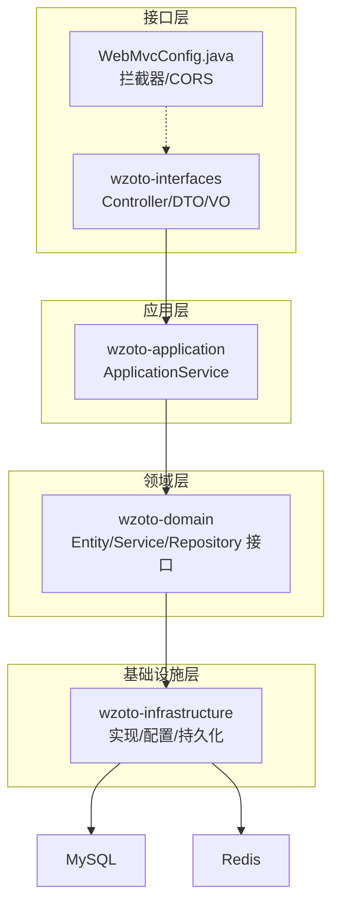
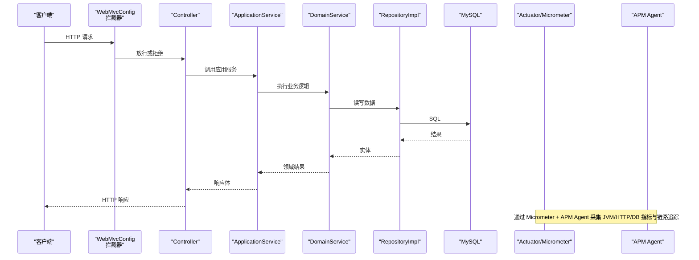
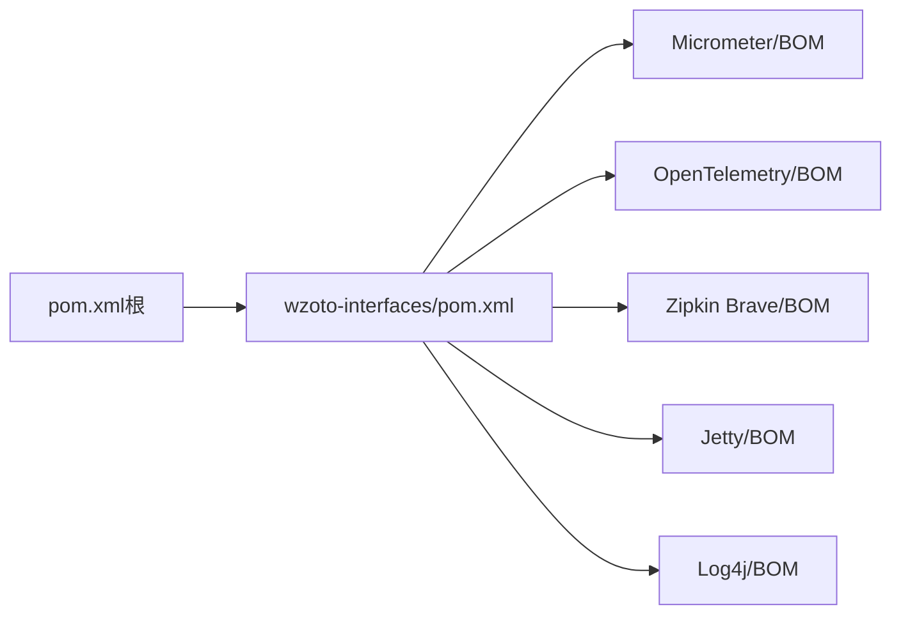

# 应用监控

<cite>
**本文引用的文件**
- [application.yml](file://wzoto-backend/wzoto-interfaces/src/main/resources/application.yml)
- [pom.xml（根）](file://wzoto-backend/pom.xml)
- [wzoto-interfaces/pom.xml](file://wzoto-backend/wzoto-interfaces/pom.xml)
- [WebMvcConfig.java](file://wzoto-backend/wzoto-infrastructure/src/main/java/com/wzoto/infrastructure/config/WebMvcConfig.java)
- [LearningReportDomainService.java](file://wzoto-backend/wzoto-domain/src/main/java/com/wzoto/domain/service/LearningReportDomainService.java)
- [LearningReportVO.java](file://wzoto-backend/wzoto-interfaces/src/main/java/com/wzoto/interfaces/vo/learning/LearningReportVO.java)
- [LearningDashboardVO.java](file://wzoto-backend/wzoto-interfaces/src/main/java/com/wzoto/interfaces/vo/learning/LearningDashboardVO.java)
- [AiReportDomainService.java](file://wzoto-backend/wzoto-domain/src/main/java/com/wzoto/domain/service/AiReportDomainService.java)
- [ParentControlDomainService.java](file://wzoto-backend/wzoto-domain/src/main/java/com/wzoto/domain/service/ParentControlDomainService.java)
- [ParentControlConfig.java](file://wzoto-backend/wzoto-domain/src/main/java/com/wzoto/domain/entity/ParentControlConfig.java)
</cite>

## 目录
1. [简介](#简介)
2. [项目结构](#项目结构)
3. [核心组件](#核心组件)
4. [架构总览](#架构总览)
5. [详细组件分析](#详细组件分析)
6. [依赖分析](#依赖分析)
7. [性能考虑](#性能考虑)
8. [故障排查指南](#故障排查指南)
9. [结论](#结论)
10. [附录](#附录)

## 简介
本文件面向“学霸到家”后端服务，提供一套可落地的应用监控配置与最佳实践方案。内容覆盖：
- Spring Boot Actuator 监控端点启用与安全控制
- 自定义业务指标采集：学习进度统计、用户行为分析、系统性能指标
- APM 工具集成：SkyWalking、Pinpoint、AppDynamics 的配置与使用建议
- 性能监控最佳实践：JVM 参数调优、数据库连接池监控、缓存命中率监控
- 告警规则设计：基于阈值的告警、异常模式识别、智能降噪
- 监控数据分析与容量规划建议

说明：当前仓库未直接包含 Actuator 与 APM 的依赖与配置，本文在现有代码基础上给出最小侵入式改造路径，确保在不破坏现有 DDD 分层的前提下完成监控能力落地。

## 项目结构
后端采用 DDD 分层：domain（领域）、application（应用服务）、infrastructure（基础设施）、interfaces（接口层）。监控相关能力主要落在 interfaces 与 infrastructure 层，通过配置与拦截器扩展，避免侵入领域逻辑。

图表来源
- [WebMvcConfig.java:1-42](file://wzoto-backend/wzoto-infrastructure/src/main/java/com/wzoto/infrastructure/config/WebMvcConfig.java#L1-L42)
- [application.yml:1-51](file://wzoto-backend/wzoto-interfaces/src/main/resources/application.yml#L1-L51)

章节来源
- [application.yml:1-51](file://wzoto-backend/wzoto-interfaces/src/main/resources/application.yml#L1-L51)
- [pom.xml（根）:1-126](file://wzoto-backend/pom.xml#L1-L126)
- [wzoto-interfaces/pom.xml:1-60](file://wzoto-backend/wzoto-interfaces/pom.xml#L1-L60)

## 核心组件
- Web MVC 配置：统一注册 JWT 拦截器与跨域策略，为后续接入 Actuator 安全白名单提供基础。
- 业务指标数据源：学习报告与看板 VO 暴露了学习时长、正确率、学科分布等维度，可作为自定义指标的数据源。
- 家长管控与 AI 报告：体现关键业务状态变更与权限控制，适合作为事件埋点与审计日志的来源。

章节来源
- [WebMvcConfig.java:1-42](file://wzoto-backend/wzoto-infrastructure/src/main/java/com/wzoto/infrastructure/config/WebMvcConfig.java#L1-L42)
- [LearningReportVO.java:1-21](file://wzoto-backend/wzoto-interfaces/src/main/java/com/wzoto/interfaces/vo/learning/LearningReportVO.java#L1-L21)
- [LearningDashboardVO.java:1-22](file://wzoto-backend/wzoto-interfaces/src/main/java/com/wzoto/interfaces/vo/learning/LearningDashboardVO.java#L1-L22)
- [AiReportDomainService.java:95-139](file://wzoto-backend/wzoto-domain/src/main/java/com/wzoto/domain/service/AiReportDomainService.java#L95-L139)
- [ParentControlDomainService.java:1-68](file://wzoto-backend/wzoto-domain/src/main/java/com/wzoto/domain/service/ParentControlDomainService.java#L1-L68)

## 架构总览
下图展示从请求进入、鉴权、到业务处理与监控数据采集的整体流程，并标注 Actuator 与 APM 的接入位置。

图表来源
- [WebMvcConfig.java:1-42](file://wzoto-backend/wzoto-infrastructure/src/main/java/com/wzoto/infrastructure/config/WebMvcConfig.java#L1-L42)
- [application.yml:1-51](file://wzoto-backend/wzoto-interfaces/src/main/resources/application.yml#L1-L51)

## 详细组件分析

### 1) Spring Boot Actuator 监控端点启用与安全配置
目标：暴露健康检查、就绪探针、指标导出等端点，并通过安全策略限制访问范围。

实施要点
- 引入依赖：在 wzoto-interfaces 模块添加 spring-boot-starter-actuator 依赖（建议在父 POM 管理版本）。
- 暴露端点：在 application.yml 中开启 health、info、metrics、prometheus 等端点，并仅暴露必要项。
- 安全策略：结合现有 WebMvcConfig，将 /actuator/** 加入 JWT 拦截器的排除路径；生产环境建议仅内网或网关侧访问。
- 外部化配置：敏感信息（如 actuator 认证凭据）通过环境变量注入。

参考路径
- 配置文件入口：[application.yml:1-51](file://wzoto-backend/wzoto-interfaces/src/main/resources/application.yml#L1-L51)
- 拦截器白名单扩展点：[WebMvcConfig.java:21-31](file://wzoto-backend/wzoto-infrastructure/src/main/java/com/wzoto/infrastructure/config/WebMvcConfig.java#L21-L31)

章节来源
- [application.yml:1-51](file://wzoto-backend/wzoto-interfaces/src/main/resources/application.yml#L1-L51)
- [WebMvcConfig.java:1-42](file://wzoto-backend/wzoto-infrastructure/src/main/java/com/wzoto/infrastructure/config/WebMvcConfig.java#L1-L42)

### 2) 自定义业务指标采集
围绕学习进度、用户行为、系统性能三类指标进行采集。

- 学习进度统计
  - 数据源：学习报告与看板 VO 中的正确率、观看时长、完成视频数、学科正确率等。
  - 采集方式：在生成报告的 Service 处通过 Micrometer Counter/Gauge/Histogram 上报聚合指标。
  - 参考路径：
    - [LearningReportDomainService.java:62-81](file://wzoto-backend/wzoto-domain/src/main/java/com/wzoto/domain/service/LearningReportDomainService.java#L62-L81)
    - [LearningReportVO.java:1-21](file://wzoto-backend/wzoto-interfaces/src/main/java/com/wzoto/interfaces/vo/learning/LearningReportVO.java#L1-L21)
    - [LearningDashboardVO.java:1-22](file://wzoto-backend/wzoto-interfaces/src/main/java/com/wzoto/interfaces/vo/learning/LearningDashboardVO.java#L1-L22)

- 用户行为分析
  - 数据源：登录、绑定手机、选择身份等接口调用次数与耗时。
  - 采集方式：在 Controller 或全局 AOP 切面记录请求维度指标（方法名、状态码、耗时、用户类型）。
  - 参考路径：
    - [WebMvcConfig.java:21-31](file://wzoto-backend/wzoto-infrastructure/src/main/java/com/wzoto/infrastructure/config/WebMvcConfig.java#L21-L31)

- 系统性能指标
  - 数据源：JVM 内存、GC、线程池、HTTP 请求、数据库连接池、缓存命中率。
  - 采集方式：Micrometer 自动装配 + 自定义 Gauge/Timer；对接 Prometheus/Grafana。
  - 参考路径：
    - [application.yml:1-51](file://wzoto-backend/wzoto-interfaces/src/main/resources/application.yml#L1-L51)

章节来源
- [LearningReportDomainService.java:62-81](file://wzoto-backend/wzoto-domain/src/main/java/com/wzoto/domain/service/LearningReportDomainService.java#L62-L81)
- [LearningReportVO.java:1-21](file://wzoto-backend/wzoto-interfaces/src/main/java/com/wzoto/interfaces/vo/learning/LearningReportVO.java#L1-L21)
- [LearningDashboardVO.java:1-22](file://wzoto-backend/wzoto-interfaces/src/main/java/com/wzoto/interfaces/vo/learning/LearningDashboardVO.java#L1-L22)
- [WebMvcConfig.java:1-42](file://wzoto-backend/wzoto-infrastructure/src/main/java/com/wzoto/infrastructure/config/WebMvcConfig.java#L1-L42)
- [application.yml:1-51](file://wzoto-backend/wzoto-interfaces/src/main/resources/application.yml#L1-L51)

### 3) APM 工具集成（SkyWalking / Pinpoint / AppDynamics）
目标：实现全链路追踪、慢请求定位、依赖拓扑可视化。

通用步骤
- 部署 Agent：在启动命令中添加对应 Agent 的 Java 参数（如 SkyWalking Agent），或通过容器编排注入。
- 配置服务端：指向 SkyWalking/Pinpoint/AppDynamics 的后端收集器地址。
- 过滤与采样：对非关键路径降低采样率，减少存储压力。
- 指标关联：将 APM 链路 ID 与业务 TraceId 关联，便于问题定位。

各工具要点
- SkyWalking
  - 优点：开源、生态完善、与 Micrometer/Tracing 兼容性好。
  - 关键点：设置 agent.config 中的 collector 地址；按环境区分命名空间。
- Pinpoint
  - 优点：可视化强、支持热插拔。
  - 关键点：注意字节码增强开销，生产建议低采样率。
- AppDynamics
  - 优点：企业级功能丰富、与云原生集成好。
  - 关键点：成本较高，适合大型团队与企业场景。

章节来源
- [application.yml:1-51](file://wzoto-backend/wzoto-interfaces/src/main/resources/application.yml#L1-L51)

### 4) 性能监控最佳实践
- JVM 参数调优
  - 推荐：G1 垃圾回收器、合理堆大小、开启 GC 日志、设置元空间上限。
  - 观测：通过 Actuator metrics 或 APM 观察 Full GC 频率与停顿时间。
- 数据库连接池监控
  - 关注：活跃连接数、等待获取连接时间、最大连接数使用率。
  - 优化：根据 QPS 与慢查询调整 pool size 与超时时间。
- 缓存命中率监控
  - 关注：命中率、过期率、热点键。
  - 优化：合理 TTL、预加载、分片与扩容。

章节来源
- [application.yml:1-51](file://wzoto-backend/wzoto-interfaces/src/main/resources/application.yml#L1-L51)

### 5) 告警规则设计
- 基于阈值
  - 示例：错误率 > 1%、P99 延迟 > 500ms、JVM 堆使用率 > 85%、DB 连接池耗尽。
- 异常模式识别
  - 示例：特定接口连续失败、某类异常突增、慢查询占比上升。
- 智能降噪
  - 示例：同一实例短时间重复告警合并、按业务维度分组、静默窗口。

建议：将阈值与规则外置至配置中心或告警平台，支持动态调整与灰度发布。

章节来源
- [application.yml:1-51](file://wzoto-backend/wzoto-interfaces/src/main/resources/application.yml#L1-L51)

### 6) 监控数据分析与容量规划
- 趋势分析：以日/周为单位观察 QPS、延迟、错误率、资源使用率。
- 瓶颈定位：结合 APM 链路，定位慢方法、慢 SQL、外部依赖超时。
- 容量规划：基于峰值 QPS 与资源水位，评估水平扩展节点数与中间件规格。

章节来源
- [application.yml:1-51](file://wzoto-backend/wzoto-interfaces/src/main/resources/application.yml#L1-L51)

## 依赖分析
当前构建日志显示已下载 Micrometer、OpenTelemetry、Zipkin Brave、Metrics 等 BOM，表明具备接入指标与链路追踪的基础。

图表来源
- [pom.xml（根）:1-126](file://wzoto-backend/pom.xml#L1-L126)
- [wzoto-interfaces/pom.xml:1-60](file://wzoto-backend/wzoto-interfaces/pom.xml#L1-L60)

章节来源
- [pom.xml（根）:1-126](file://wzoto-backend/pom.xml#L1-L126)
- [wzoto-interfaces/pom.xml:1-60](file://wzoto-backend/wzoto-interfaces/pom.xml#L1-L60)

## 性能考虑
- 优先在接口层与基础设施层埋点，避免侵入领域模型。
- 指标标签尽量精简，避免高基数导致存储爆炸。
- 对高频接口采用异步上报与批量写入。
- 压测验证：上线前进行容量测试，确认监控开销可控。

## 故障排查指南
- 常见问题
  - Actuator 端点无法访问：检查安全策略与网络访问控制。
  - 指标缺失：确认 Micrometer 依赖与端点暴露配置。
  - APM 无链路：检查 Agent 是否注入成功、采样率是否过低。
- 快速定位
  - 通过 APM 链路查看慢调用链与异常堆栈。
  - 结合日志级别与结构化日志输出，定位上下文。
  - 使用数据库慢查询日志与连接池指标定位瓶颈。

章节来源
- [application.yml:1-51](file://wzoto-backend/wzoto-interfaces/src/main/resources/application.yml#L1-L51)

## 结论
通过在接口层与基础设施层的最小改动，即可在本项目中落地完整的监控体系：启用 Actuator、采集业务与系统指标、接入 APM、建立告警与容量规划闭环。建议分阶段推进：先补齐基础监控与告警，再逐步完善 APM 与智能降噪。

## 附录
- 关键配置入口
  - 应用配置：[application.yml:1-51](file://wzoto-backend/wzoto-interfaces/src/main/resources/application.yml#L1-L51)
  - 模块依赖：[wzoto-interfaces/pom.xml:1-60](file://wzoto-backend/wzoto-interfaces/pom.xml#L1-L60)
  - 根依赖管理：[pom.xml（根）:1-126](file://wzoto-backend/pom.xml#L1-L126)
- 业务指标参考
  - 学习报告与看板：[LearningReportVO.java:1-21](file://wzoto-backend/wzoto-interfaces/src/main/java/com/wzoto/interfaces/vo/learning/LearningReportVO.java#L1-L21)、[LearningDashboardVO.java:1-22](file://wzoto-backend/wzoto-interfaces/src/main/java/com/wzoto/interfaces/vo/learning/LearningDashboardVO.java#L1-L22)
  - 报告计算逻辑：[LearningReportDomainService.java:62-81](file://wzoto-backend/wzoto-domain/src/main/java/com/wzoto/domain/service/LearningReportDomainService.java#L62-L81)
- 安全与拦截
  - Web MVC 配置：[WebMvcConfig.java:1-42](file://wzoto-backend/wzoto-infrastructure/src/main/java/com/wzoto/infrastructure/config/WebMvcConfig.java#L1-L42)
- 业务域事件（用于埋点）
  - AI 报告解锁与会员状态：[AiReportDomainService.java:95-139](file://wzoto-backend/wzoto-domain/src/main/java/com/wzoto/domain/service/AiReportDomainService.java#L95-L139)
  - 家长管控配置与锁定：[ParentControlDomainService.java:1-68](file://wzoto-backend/wzoto-domain/src/main/java/com/wzoto/domain/service/ParentControlDomainService.java#L1-L68)、[ParentControlConfig.java:54-96](file://wzoto-backend/wzoto-domain/src/main/java/com/wzoto/domain/entity/ParentControlConfig.java#L54-L96)