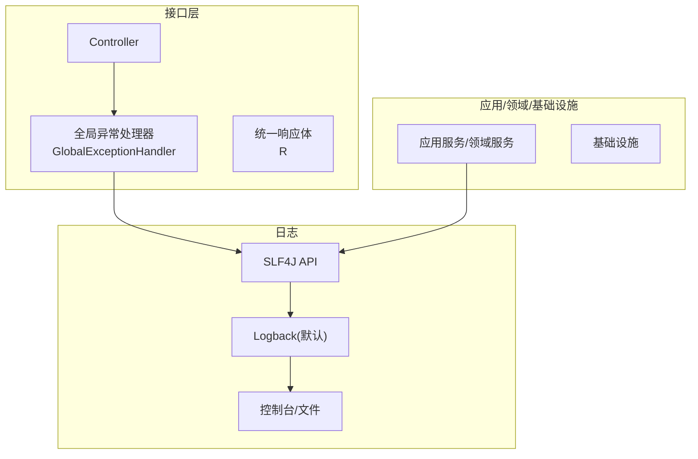
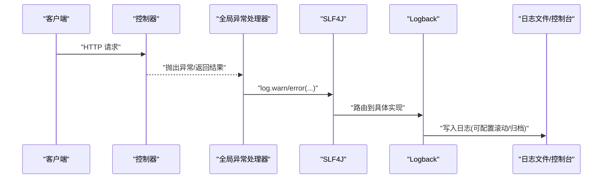
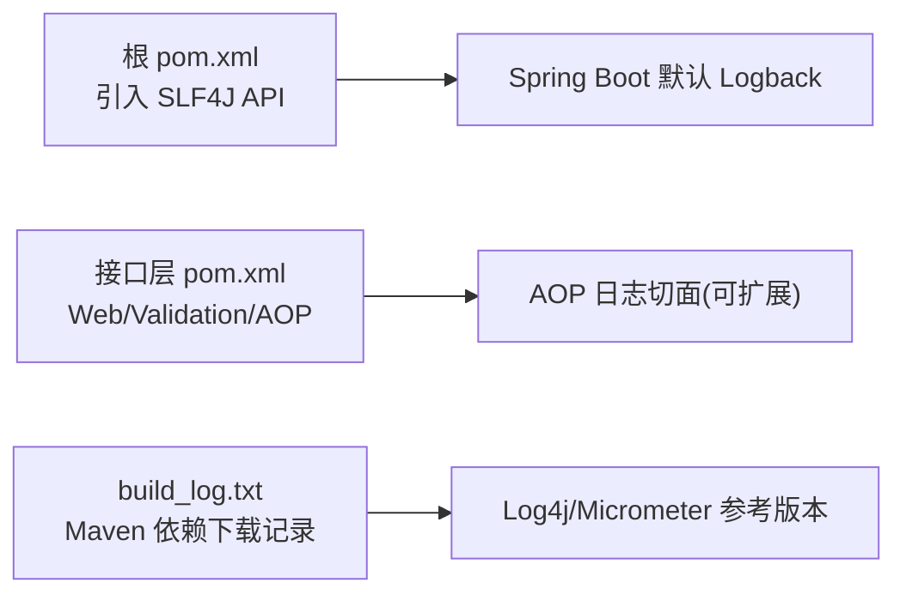

# 日志管理

<cite>
**本文引用的文件**
- [application.yml](file://wzoto-backend/wzoto-interfaces/src/main/resources/application.yml)
- [pom.xml（根）](file://wzoto-backend/pom.xml)
- [pom.xml（接口层）](file://wzoto-backend/wzoto-interfaces/pom.xml)
- [GlobalExceptionHandler.java](file://wzoto-backend/wzoto-interfaces/src/main/java/com/wzoto/interfaces/common/GlobalExceptionHandler.java)
- [R.java](file://wzoto-backend/wzoto-interfaces/src/main/java/com/wzoto/interfaces/common/R.java)
- [build_log.txt](file://build_log.txt)
</cite>

## 目录
1. [简介](#简介)
2. [项目结构](#项目结构)
3. [核心组件](#核心组件)
4. [架构总览](#架构总览)
5. [详细组件分析](#详细组件分析)
6. [依赖分析](#依赖分析)
7. [性能考虑](#性能考虑)
8. [故障排查指南](#故障排查指南)
9. [结论](#结论)
10. [附录](#附录)

## 简介
本文件为“日志管理系统”的详细配置与实施文档，面向当前后端工程（Spring Boot + MyBatis-Plus + SLF4J），覆盖以下主题：
- 日志框架配置：SLF4J、Logback/Log4j2 选型与接入、日志格式标准化、日志级别控制
- 分布式日志收集：ELK 栈搭建思路、Fluentd/Logstash 采集配置要点、Elasticsearch 索引设计建议
- 日志分析工具：Kibana 仪表板规划、查询语法要点、异常模式识别策略
- 日志轮转策略：按时间/大小轮转、历史归档方案
- 安全与合规：敏感信息脱敏、访问权限控制、合规性要求
- 性能优化与故障排查：常见瓶颈定位与排障方法

## 项目结构
本项目采用分层架构，日志相关能力主要分布在接口层与全局异常处理中；应用与服务层通过 SLF4J 输出日志。关键位置如下：
- 应用配置：application.yml 中定义了服务端口、数据源、Redis、MyBatis-Plus 以及 logging.level 等基础日志级别
- 依赖管理：根 pom.xml 引入 SLF4J API；接口层 pom.xml 引入 Spring Boot Web/AOP 等，便于后续扩展 AOP 日志切面
- 统一返回与异常：GlobalExceptionHandler 使用 @Slf4j 记录参数校验、绑定失败、运行时异常等；R 提供统一响应体

图表来源
- [GlobalExceptionHandler.java:1-67](file://wzoto-backend/wzoto-interfaces/src/main/java/com/wzoto/interfaces/common/GlobalExceptionHandler.java#L1-L67)
- [R.java:1-43](file://wzoto-backend/wzoto-interfaces/src/main/java/com/wzoto/interfaces/common/R.java#L1-L43)
- [pom.xml（根）:94-104](file://wzoto-backend/pom.xml#L94-L104)

章节来源
- [application.yml:1-51](file://wzoto-backend/wzoto-interfaces/src/main/resources/application.yml#L1-L51)
- [pom.xml（根）:1-126](file://wzoto-backend/pom.xml#L1-L126)
- [pom.xml（接口层）:1-60](file://wzoto-backend/wzoto-interfaces/pom.xml#L1-L60)
- [GlobalExceptionHandler.java:1-67](file://wzoto-backend/wzoto-interfaces/src/main/java/com/wzoto/interfaces/common/GlobalExceptionHandler.java#L1-L67)
- [R.java:1-43](file://wzoto-backend/wzoto-interfaces/src/main/java/com/wzoto/interfaces/common/R.java#L1-L43)

## 核心组件
- 日志门面与实现
  - 使用 SLF4J 作为日志门面（根 pom 引入 slf4j-api）。Spring Boot 默认集成 Logback 作为实现，无需额外依赖即可输出日志到控制台或文件。
- 日志级别控制
  - 在 application.yml 的 logging.level 下设置包级日志级别（如 com.wzoto、com.baomidou.mybatisplus），便于调试与生产降噪。
- 统一异常与结构化日志
  - GlobalExceptionHandler 对参数校验、绑定失败、运行时异常等进行分类捕获并记录不同级别的日志，配合 R 统一返回错误码与消息，便于集中分析与告警。

章节来源
- [pom.xml（根）:94-104](file://wzoto-backend/pom.xml#L94-L104)
- [application.yml:48-51](file://wzoto-backend/wzoto-interfaces/src/main/resources/application.yml#L48-L51)
- [GlobalExceptionHandler.java:18-66](file://wzoto-backend/wzoto-interfaces/src/main/java/com/wzoto/interfaces/common/GlobalExceptionHandler.java#L18-L66)
- [R.java:19-41](file://wzoto-backend/wzoto-interfaces/src/main/java/com/wzoto/interfaces/common/R.java#L19-L41)

## 架构总览
下图展示从请求进入、异常处理到日志输出的整体流程，体现 SLF4J 与默认 Logback 的协作关系。

图表来源
- [GlobalExceptionHandler.java:18-66](file://wzoto-backend/wzoto-interfaces/src/main/java/com/wzoto/interfaces/common/GlobalExceptionHandler.java#L18-L66)
- [pom.xml（根）:94-104](file://wzoto-backend/pom.xml#L94-L104)

## 详细组件分析

### 日志框架配置（SLF4J + Logback/Log4j2）
- 现状
  - 已引入 SLF4J API，Spring Boot 默认启用 Logback 实现，可直接使用 @Slf4j 输出日志。
  - application.yml 中通过 logging.level 控制包级日志级别。
- 可选升级至 Log4j2
  - 若需更强大的异步 appenders、JSON 布局、动态配置等能力，可在接口层排除默认 Logback 并引入 log4j2-spring-boot 依赖，随后添加 log4j2-spring.xml 完成布局与滚动策略配置。
- 日志格式标准化建议
  - 统一 JSON 格式字段：timestamp、level、logger、thread、traceId、spanId、service、host、message、stackTrace。
  - 通过 MDC 注入 traceId/spanId，便于链路追踪与聚合分析。
- 日志级别控制
  - 开发环境：com.wzoto=DEBUG，第三方库按需开启 DEBUG。
  - 生产环境：com.wzoto=INFO，仅对关键路径或异常使用 WARN/ERROR。

章节来源
- [pom.xml（根）:94-104](file://wzoto-backend/pom.xml#L94-L104)
- [application.yml:48-51](file://wzoto-backend/wzoto-interfaces/src/main/resources/application.yml#L48-L51)

### 分布式日志收集（ELK + Fluentd/Logstash）
- 采集端
  - 推荐将应用日志输出为 JSON 行（每行一条 JSON），便于解析。
  - 使用 Fluent Bit/Fluentd 或 Logstash Filebeat/File 插件读取应用日志文件，附加 service、env、host、version 等元数据后转发至 Elasticsearch。
- 传输与缓冲
  - 在高吞吐场景建议使用带缓冲的采集器（如 Fluent Bit 内存/磁盘缓冲），避免背压导致丢日志。
- 存储与索引
  - 按天创建索引（如 logs-wzoto-YYYY.MM.DD），便于生命周期管理与冷热分离。
  - 定义 mapping：时间戳、级别、服务名、主机、线程、traceId、message、堆栈等字段类型与分词策略。
- 可视化与分析
  - Kibana 建立索引模式，构建常用仪表盘（错误率、慢请求、异常 Top N、业务指标）。
  - 基于 traceId 进行跨服务关联检索。

[本节为通用实践说明，不直接引用具体代码文件]

### 日志分析工具（Kibana、查询语法、异常模式识别）
- Kibana 仪表板建议
  - 概览：QPS、错误率、平均耗时、Top 错误类
  - 异常：按异常类、错误消息聚类统计
  - 业务：关键操作成功率、失败原因分布
- 查询语法要点
  - 精确匹配：level:"ERROR"、service:"wzoto"
  - 模糊匹配：message:*超时*
  - 范围查询：@timestamp:[now-24h TO now]
  - 组合条件：level:"ERROR" AND message:*数据库*
- 异常模式识别
  - 基于异常类与消息前缀做聚类，结合 traceId 聚合同一请求的错误链。
  - 对高频异常设置告警规则（如 5 分钟内 ERROR 数 > N）。

[本节为通用实践说明，不直接引用具体代码文件]

### 日志轮转策略（按时间/大小/归档）
- 按时间轮转
  - 每日滚动生成新文件，保留 N 天，自动清理过期文件。
- 按大小轮转
  - 单文件达到阈值时滚动，限制最大数量，避免磁盘爆满。
- 历史归档
  - 将旧日志压缩并迁移至对象存储或冷存储，降低在线存储成本。
- 注意事项
  - 确保采集器能感知文件滚动事件（如 rename 或 inode 变化），避免重复或丢失。
  - 多实例部署时，文件名需包含 host 或 instance 标识，避免冲突。

[本节为通用实践说明，不直接引用具体代码文件]

### 日志安全与合规
- 敏感信息脱敏
  - 对手机号、身份证、银行卡、密码、Token、JWT 等字段进行掩码或哈希处理。
  - 在统一异常处理器或拦截器中对响应体与日志内容进行二次过滤。
- 访问权限控制
  - 日志系统（ES/Kibana）启用认证与最小权限原则，仅授权人员访问。
  - 审计日志记录谁在何时查看了哪些敏感日志。
- 合规性要求
  - 遵循数据最小化与留存周期策略，定期清理过期日志。
  - 对跨境数据传输、日志外发进行合规评估与审批。

[本节为通用实践说明，不直接引用具体代码文件]

### 日志性能优化建议
- 减少同步 I/O
  - 使用异步 Appender 或外部采集器（Fluent Bit/Logstash）解耦写盘。
- 合理日志级别
  - 生产默认 INFO，仅在必要时开启 DEBUG；对热点路径避免频繁打印大对象。
- 结构化日志
  - 以 JSON 输出，避免复杂字符串拼接；利用 MDC 传递上下文，减少重复字段。
- 采样与限流
  - 对高频日志进行采样或限流，防止风暴打垮下游。
- 资源隔离
  - 日志写入独立线程池与磁盘分区，避免与应用争抢 CPU/IO。

[本节为通用实践说明，不直接引用具体代码文件]

## 依赖分析
- 日志门面与实现
  - 根模块引入 SLF4J API；Spring Boot 默认提供 Logback 实现，满足基础日志需求。
- 接口层依赖
  - 引入 spring-boot-starter-web、validation、aop，便于后续扩展 AOP 日志切面与统一入参出参日志。
- 构建日志
  - build_log.txt 显示 Maven 下载过程，包含日志相关 BOM（如 log4j-bom、micrometer-tracing-bom），可作为引入 Log4j2 或链路追踪的参考。

图表来源
- [pom.xml（根）:94-104](file://wzoto-backend/pom.xml#L94-L104)
- [pom.xml（接口层）:26-36](file://wzoto-backend/wzoto-interfaces/pom.xml#L26-L36)
- [build_log.txt:30-36](file://build_log.txt#L30-L36)

章节来源
- [pom.xml（根）:1-126](file://wzoto-backend/pom.xml#L1-L126)
- [pom.xml（接口层）:1-60](file://wzoto-backend/wzoto-interfaces/pom.xml#L1-L60)
- [build_log.txt:1-36](file://build_log.txt#L1-L36)

## 性能考虑
- 日志写入路径尽量异步化，避免阻塞业务线程。
- 控制日志体积：精简 message、避免循环打印、关闭不必要的 DEBUG。
- 使用结构化日志与 MDC 提升解析效率与可观测性。
- 对高并发场景采用采样与限流，保护下游存储与网络带宽。
- 监控日志系统自身健康度（队列长度、丢弃率、延迟）。

[本节为通用实践说明，不直接引用具体代码文件]

## 故障排查指南
- 常见问题定位
  - 参数校验失败：查看 GlobalExceptionHandler 中对应日志，定位字段与错误信息。
  - 参数绑定失败：检查请求体结构与类型映射。
  - 运行时异常：关注 ERROR 日志与堆栈，结合 traceId 拉取完整调用链。
- 快速定位步骤
  - 根据错误码与消息在 Kibana 中筛选最近 N 分钟日志。
  - 使用 traceId 串联上下游日志，定位瓶颈点。
  - 对比不同环境（dev/test/prod）的日志级别与配置差异。
- 恢复与验证
  - 临时降级或开关功能，观察错误是否消失。
  - 逐步放开流量，验证修复效果。

章节来源
- [GlobalExceptionHandler.java:18-66](file://wzoto-backend/wzoto-interfaces/src/main/java/com/wzoto/interfaces/common/GlobalExceptionHandler.java#L18-L66)
- [R.java:19-41](file://wzoto-backend/wzoto-interfaces/src/main/java/com/wzoto/interfaces/common/R.java#L19-L41)

## 结论
- 当前工程已具备稳定的日志基础：SLF4J + 默认 Logback + 统一的异常与返回封装。
- 建议下一步：
  - 统一 JSON 日志格式与 MDC 上下文（traceId/spanId）。
  - 引入 ELK 栈与 Fluentd/Logstash 实现集中式采集与分析。
  - 制定日志轮转与归档策略，完善安全与合规措施。
  - 建立 Kibana 仪表板与告警规则，提升问题发现与处置效率。

[本节为总结性内容，不直接引用具体代码文件]

## 附录
- 快速检查清单
  - 是否已统一日志格式（JSON）？
  - 是否已配置 traceId 并在各层透传？
  - 是否已配置日志级别与环境差异化？
  - 是否已部署采集器与 ES 索引策略？
  - 是否已建立 Kibana 仪表板与告警？
  - 是否已完成敏感信息脱敏与访问控制？
  - 是否制定了轮转与归档策略？

[本节为补充信息，不直接引用具体代码文件]