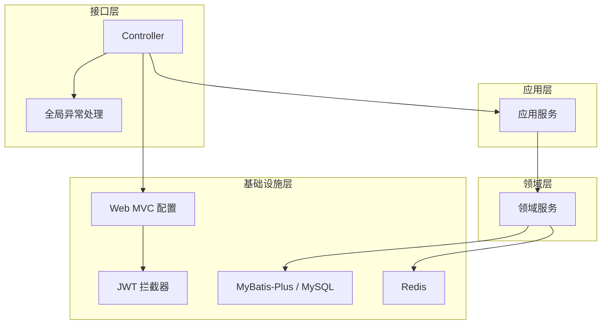
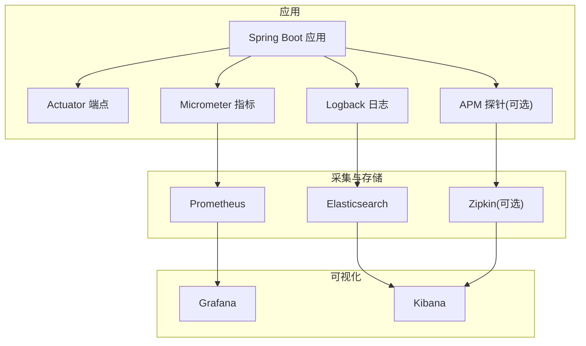
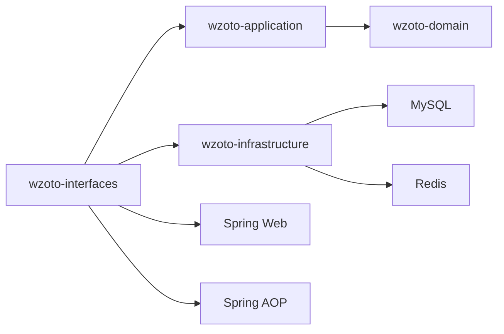
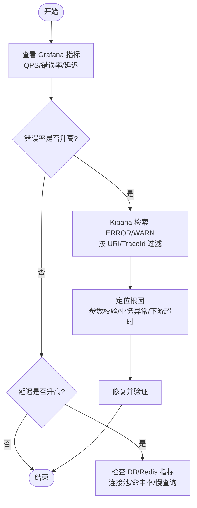

# 监控与日志

<cite>
**本文引用的文件**
- [application.yml](file://wzoto-backend/wzoto-interfaces/src/main/resources/application.yml)
- [pom.xml（根）](file://wzoto-backend/pom.xml)
- [wzoto-interfaces/pom.xml](file://wzoto-backend/wzoto-interfaces/pom.xml)
- [wzoto-infrastructure/pom.xml](file://wzoto-backend/wzoto-infrastructure/pom.xml)
- [WebMvcConfig.java](file://wzoto-backend/wzoto-infrastructure/src/main/java/com/wzoto/infrastructure/config/WebMvcConfig.java)
- [JwtAuthInterceptor.java](file://wzoto-backend/wzoto-infrastructure/src/main/java/com/wzoto/infrastructure/interceptor/JwtAuthInterceptor.java)
- [GlobalExceptionHandler.java](file://wzoto-backend/wzoto-interfaces/src/main/java/com/wzoto/interfaces/common/GlobalExceptionHandler.java)
- [build_log.txt](file://build_log.txt)
</cite>

## 目录
1. [简介](#简介)
2. [项目结构](#项目结构)
3. [核心组件](#核心组件)
4. [架构总览](#架构总览)
5. [详细组件分析](#详细组件分析)
6. [依赖分析](#依赖分析)
7. [性能考虑](#性能考虑)
8. [故障排查指南](#故障排查指南)
9. [结论](#结论)
10. [附录](#附录)

## 简介
本文件为 wzoto 项目的“监控与日志”专项文档，聚焦以下目标：
- 应用监控：Spring Boot Actuator 端点配置、自定义指标采集、性能监控集成方案。
- 日志收集：结构化日志格式、日志级别管理、日志轮转策略。
- APM 工具集成：链路追踪、慢查询分析、错误追踪。
- 告警规则：CPU/内存使用率、接口响应时间、错误率阈值设置建议。
- 日志分析方法：ELK 栈搭建要点、日志查询语法、性能瓶颈定位技巧。
- 监控面板：Grafana 仪表盘与关键指标可视化展示建议。

说明：当前仓库未包含 Actuator、Micrometer、APM 等监控相关的具体实现代码；本节提供基于现有工程结构的落地方案与接入步骤，确保在不破坏现有分层架构的前提下完成监控与可观测性建设。

## 项目结构
后端采用 DDD 分层：
- interfaces：对外接口层（Controller、统一返回、全局异常）。
- application：应用服务编排。
- domain：领域模型与服务。
- infrastructure：基础设施（数据访问、Redis、Web MVC 配置、拦截器、工具类）。

当前已具备的监控基础能力：
- 日志：SLF4J + Lombok @Slf4j，全局异常处理器中记录 warn/error 日志。
- Web：Spring MVC 配置（CORS、JWT 拦截器），可作为请求级埋点切入点。
- 构建产物：构建日志显示存在 Micrometer、Zipkin Brave、OpenTelemetry BOM 下载痕迹，表明团队已有引入或评估过相关可观测性生态。

图表来源
- [WebMvcConfig.java:1-42](file://wzoto-backend/wzoto-infrastructure/src/main/java/com/wzoto/infrastructure/config/WebMvcConfig.java#L1-L42)
- [JwtAuthInterceptor.java:1-36](file://wzoto-backend/wzoto-infrastructure/src/main/java/com/wzoto/infrastructure/interceptor/JwtAuthInterceptor.java#L1-L36)
- [GlobalExceptionHandler.java:1-67](file://wzoto-backend/wzoto-interfaces/src/main/java/com/wzoto/interfaces/common/GlobalExceptionHandler.java#L1-L67)

章节来源
- [application.yml:1-51](file://wzoto-backend/wzoto-interfaces/src/main/resources/application.yml#L1-L51)
- [pom.xml（根）:1-126](file://wzoto-backend/pom.xml#L1-L126)
- [wzoto-interfaces/pom.xml:1-60](file://wzoto-backend/wzoto-interfaces/pom.xml#L1-L60)
- [wzoto-infrastructure/pom.xml:1-73](file://wzoto-backend/wzoto-infrastructure/pom.xml#L1-L73)

## 核心组件
- 日志框架与级别
  - 使用 SLF4J 作为门面，配合 Lombok @Slf4j 在业务类中输出日志。
  - 通过 application.yml 的 logging.level 控制包级别日志输出等级（如 com.wzoto、com.baomidou.mybatisplus）。
- 全局异常与错误日志
  - GlobalExceptionHandler 对参数校验失败、绑定失败、运行时异常等进行分类捕获并记录 warn/error 日志，同时返回统一错误响应。
- Web 拦截器与上下文
  - JwtAuthInterceptor 在请求进入时解析 Token 并注入用户上下文，适合作为请求维度埋点（如请求耗时、用户维度统计）的切入点。
- 数据库与缓存
  - MyBatis-Plus 开启 SQL 输出到控制台（便于开发期调试），生产环境建议关闭或降低级别。
  - Redis 用于缓存与会话等场景，可在后续接入连接池与命令级指标。

章节来源
- [application.yml:19-51](file://wzoto-backend/wzoto-interfaces/src/main/resources/application.yml#L19-L51)
- [GlobalExceptionHandler.java:1-67](file://wzoto-backend/wzoto-interfaces/src/main/java/com/wzoto/interfaces/common/GlobalExceptionHandler.java#L1-L67)
- [JwtAuthInterceptor.java:1-36](file://wzoto-backend/wzoto-infrastructure/src/main/java/com/wzoto/infrastructure/interceptor/JwtAuthInterceptor.java#L1-L36)

## 架构总览
下图展示了建议的可观测性架构：应用侧通过 Spring Boot Actuator 暴露指标，Micrometer 采集 JVM/HTTP/DB/Redis 等指标并上报至 Prometheus；日志经 Logback 输出为 JSON 结构化格式，由 Filebeat/Fluent Bit 采集后送入 Elasticsearch；Kibana 用于检索与分析；Grafana 对接 Prometheus 进行可视化；APM（可选 Zipkin/OpenTelemetry）用于链路追踪与慢查询分析。

图表来源
- [application.yml:1-51](file://wzoto-backend/wzoto-interfaces/src/main/resources/application.yml#L1-L51)
- [wzoto-interfaces/pom.xml:1-60](file://wzoto-backend/wzoto-interfaces/pom.xml#L1-L60)
- [wzoto-infrastructure/pom.xml:1-73](file://wzoto-backend/wzoto-infrastructure/pom.xml#L1-L73)
- [build_log.txt:1-45](file://build_log.txt#L1-L45)

## 详细组件分析

### 应用监控：Actuator 端点与指标采集
- 现状
  - 未发现 actuator 依赖与配置；建议在 interfaces 模块引入 spring-boot-starter-actuator，并在 application.yml 中启用必要端点（如 /actuator/health、/actuator/metrics）。
  - 建议引入 Micrometer 与 Prometheus 客户端，暴露 /actuator/prometheus 供 Prometheus 抓取。
- 建议接入步骤
  - 在 wzoto-interfaces/pom.xml 添加 actuator 与 micrometer-prometheus 依赖。
  - 在 application.yml 中配置 actuator 暴露端点与 metrics 标签（如 service、env）。
  - 在 WebMvcConfig 或 AOP 切面中增加自定义指标（如接口 QPS、P95/P99 延迟、错误率）。
  - 在数据库与 Redis 层面启用连接池指标（HikariCP、Lettuce/Jedis）。
- 关键指标建议
  - HTTP：请求数、错误率、延迟分布（P50/P90/P95/P99）。
  - JVM：堆内存使用、GC 次数与耗时、线程数。
  - DB：连接池活跃/空闲、慢查询数量、执行时长。
  - Redis：命中率、命令耗时、连接数。

章节来源
- [wzoto-interfaces/pom.xml:1-60](file://wzoto-backend/wzoto-interfaces/pom.xml#L1-L60)
- [application.yml:1-51](file://wzoto-backend/wzoto-interfaces/src/main/resources/application.yml#L1-L51)

### 自定义指标采集与性能监控集成
- 切入点
  - 使用 AOP 在 Controller 层统一采集接口耗时、入参摘要、出参状态码，写入 Micrometer Timer/Histogram。
  - 在 JwtAuthInterceptor 中记录用户维度请求计数与失败率。
- 慢查询分析
  - 开发期可通过 MyBatis-Plus 控制台 SQL 输出定位问题；生产建议结合数据库慢查询日志与 APM 探针（如 OpenTelemetry JDBC Instrumentation）采集 SQL 耗时。
- 外部调用
  - AI 调用（OKHttp）可加入请求耗时与错误率指标，便于评估第三方服务稳定性。

章节来源
- [wzoto-infrastructure/pom.xml:1-73](file://wzoto-backend/wzoto-infrastructure/pom.xml#L1-L73)
- [JwtAuthInterceptor.java:1-36](file://wzoto-backend/wzoto-infrastructure/src/main/java/com/wzoto/infrastructure/interceptor/JwtAuthInterceptor.java#L1-L36)

### 日志收集方案：结构化日志、级别管理、轮转策略
- 结构化日志
  - 建议将日志输出为 JSON 格式，包含字段：timestamp、level、service、traceId、userId、method、uri、status、durationMs、message。
  - 在 GlobalExceptionHandler 中统一输出结构化错误日志，便于聚合分析。
- 日志级别管理
  - 通过 application.yml 的 logging.level 控制不同包的输出级别；生产建议仅保留 warn/error，必要时按模块细化。
- 日志轮转策略
  - 建议按天滚动、保留 30 天，单文件大小限制（如 100MB），压缩归档。
  - 使用 Filebeat/Fluent Bit 采集容器/主机日志，转发至 Elasticsearch。

章节来源
- [application.yml:48-51](file://wzoto-backend/wzoto-interfaces/src/main/resources/application.yml#L48-L51)
- [GlobalExceptionHandler.java:1-67](file://wzoto-backend/wzoto-interfaces/src/main/java/com/wzoto/interfaces/common/GlobalExceptionHandler.java#L1-L67)

### APM 工具集成：链路追踪、慢查询、错误追踪
- 链路追踪
  - 可选 Zipkin Brave 或 OpenTelemetry；构建日志中出现相关 BOM 下载，表明具备引入条件。
  - 在 Web 层注入 traceId，贯穿 Controller → Application → Domain → Infrastructure 各层。
- 慢查询分析
  - 结合数据库慢查询日志与 APM 的 SQL 片段采集，识别热点 SQL 与索引缺失。
- 错误追踪
  - 在全局异常处理器中记录完整堆栈，并附带 traceId，便于跨系统关联。

章节来源
- [build_log.txt:1-45](file://build_log.txt#L1-L45)
- [GlobalExceptionHandler.java:1-67](file://wzoto-backend/wzoto-interfaces/src/main/java/com/wzoto/interfaces/common/GlobalExceptionHandler.java#L1-L67)

### 告警规则配置建议
- CPU/内存使用率
  - CPU 使用率 > 80% 持续 5 分钟触发警告；内存使用率 > 85% 或 GC 频繁触发严重告警。
- 接口响应时间
  - P95 延迟超过阈值（如 500ms）持续 5 分钟；错误率（5xx）> 1% 持续 5 分钟。
- 错误率阈值
  - 全局 5xx 比例 > 0.5% 或特定接口错误率突增，立即告警。
- 实施建议
  - 在 Grafana 中基于 Prometheus 指标配置 Alertmanager 规则，并通过企业微信/邮件/钉钉通知。

[本节为通用实践建议，不直接引用具体代码文件]

### 日志分析方法：ELK 栈、查询语法、瓶颈定位
- ELK 栈搭建
  - Elasticsearch 集群 + Logstash/Filebeat + Kibana；建议按服务分索引，保留策略与冷热分层。
- 日志查询语法
  - 常用过滤：service=“wzoto-backend”、level=“ERROR”、uri="/api/**"、status>=500。
  - 聚合分析：按 uri 统计错误率、按 userId 统计失败次数、按 method 统计耗时分布。
- 性能瓶颈定位技巧
  - 结合 traceId 串联请求全链路；对比 P95/P99 延迟与错误率变化；关注 DB 慢查询与 Redis 命中率。

[本节为通用实践建议，不直接引用具体代码文件]

### 监控面板配置：Grafana 仪表盘与关键指标可视化
- 推荐面板
  - JVM 指标：堆内存、非堆内存、GC 次数与耗时、线程数。
  - HTTP 指标：QPS、错误率、延迟分布（P50/P90/P95/P99）。
  - DB/Redis：连接池、慢查询、命中率、命令耗时。
- 看板组织
  - 按服务维度分组，提供概览页与详情页；支持多实例对比与时间范围选择。

[本节为通用实践建议，不直接引用具体代码文件]

## 依赖分析
- 当前依赖
  - Spring Boot Web、Validation、AOP、MyBatis-Plus、Redis、MySQL、OKHttp、JSON 库。
  - 构建日志显示存在 Micrometer、Zipkin Brave、OpenTelemetry 等可观测性生态 BOM 下载痕迹。
- 建议新增依赖
  - spring-boot-starter-actuator、micrometer-registry-prometheus、logback-json 编码器、可选 APM 客户端。
- 依赖关系图

图表来源
- [wzoto-interfaces/pom.xml:1-60](file://wzoto-backend/wzoto-interfaces/pom.xml#L1-L60)
- [wzoto-infrastructure/pom.xml:1-73](file://wzoto-backend/wzoto-infrastructure/pom.xml#L1-L73)
- [pom.xml（根）:1-126](file://wzoto-backend/pom.xml#L1-L126)

章节来源
- [wzoto-interfaces/pom.xml:1-60](file://wzoto-backend/wzoto-interfaces/pom.xml#L1-L60)
- [wzoto-infrastructure/pom.xml:1-73](file://wzoto-backend/wzoto-infrastructure/pom.xml#L1-L73)
- [pom.xml（根）:1-126](file://wzoto-backend/pom.xml#L1-L126)
- [build_log.txt:1-45](file://build_log.txt#L1-L45)

## 性能考虑
- 指标采集开销
  - 合理采样与标签维度，避免高基数标签导致存储压力。
- 日志写入影响
  - 异步日志与批量写入，避免同步 I/O 阻塞主流程。
- 数据库与缓存
  - 连接池大小与超时配置需与负载匹配；Redis 热点键与过期策略优化。
- APM 探针
  - 在生产环境谨慎开启全量链路追踪，可按流量比例采样。

[本节为通用实践建议，不直接引用具体代码文件]

## 故障排查指南
- 快速定位
  - 通过 Kibana 按 traceId 检索全链路日志；结合 Grafana 查看错误率与延迟突增。
- 常见症状
  - 接口超时：检查下游依赖（DB/Redis/外部 API）耗时与连接池。
  - 高错误率：检查全局异常处理器中的错误类型分布与参数校验失败原因。
- 处理流程

章节来源
- [GlobalExceptionHandler.java:1-67](file://wzoto-backend/wzoto-interfaces/src/main/java/com/wzoto/interfaces/common/GlobalExceptionHandler.java#L1-L67)
- [application.yml:19-51](file://wzoto-backend/wzoto-interfaces/src/main/resources/application.yml#L19-L51)

## 结论
当前项目已具备日志与基础 Web 能力，建议优先补齐 Actuator/Micrometer/Prometheus 指标体系与结构化日志采集，逐步引入 APM 实现链路追踪与慢查询分析，最终形成“指标+日志+链路”三位一体的可观测性体系，支撑稳定运行与高效排障。

[本节为总结性内容，不直接引用具体代码文件]

## 附录
- 配置清单（建议）
  - Actuator：启用 health、info、metrics、prometheus。
  - Micrometer：注册 Prometheus 导出器，配置标签（service、env、instance）。
  - 日志：JSON 格式、按天滚动、保留 30 天、Filebeat 采集。
  - APM：Zipkin 或 OpenTelemetry，生产环境采样策略。
- 参考路径
  - 入口配置：application.yml
  - 依赖声明：wzoto-interfaces/pom.xml、wzoto-infrastructure/pom.xml
  - 拦截器与异常：WebMvcConfig.java、JwtAuthInterceptor.java、GlobalExceptionHandler.java

章节来源
- [application.yml:1-51](file://wzoto-backend/wzoto-interfaces/src/main/resources/application.yml#L1-L51)
- [wzoto-interfaces/pom.xml:1-60](file://wzoto-backend/wzoto-interfaces/pom.xml#L1-L60)
- [wzoto-infrastructure/pom.xml:1-73](file://wzoto-backend/wzoto-infrastructure/pom.xml#L1-L73)
- [WebMvcConfig.java:1-42](file://wzoto-backend/wzoto-infrastructure/src/main/java/com/wzoto/infrastructure/config/WebMvcConfig.java#L1-L42)
- [JwtAuthInterceptor.java:1-36](file://wzoto-backend/wzoto-infrastructure/src/main/java/com/wzoto/infrastructure/interceptor/JwtAuthInterceptor.java#L1-L36)
- [GlobalExceptionHandler.java:1-67](file://wzoto-backend/wzoto-interfaces/src/main/java/com/wzoto/interfaces/common/GlobalExceptionHandler.java#L1-L67)
- [build_log.txt:1-45](file://build_log.txt#L1-L45)