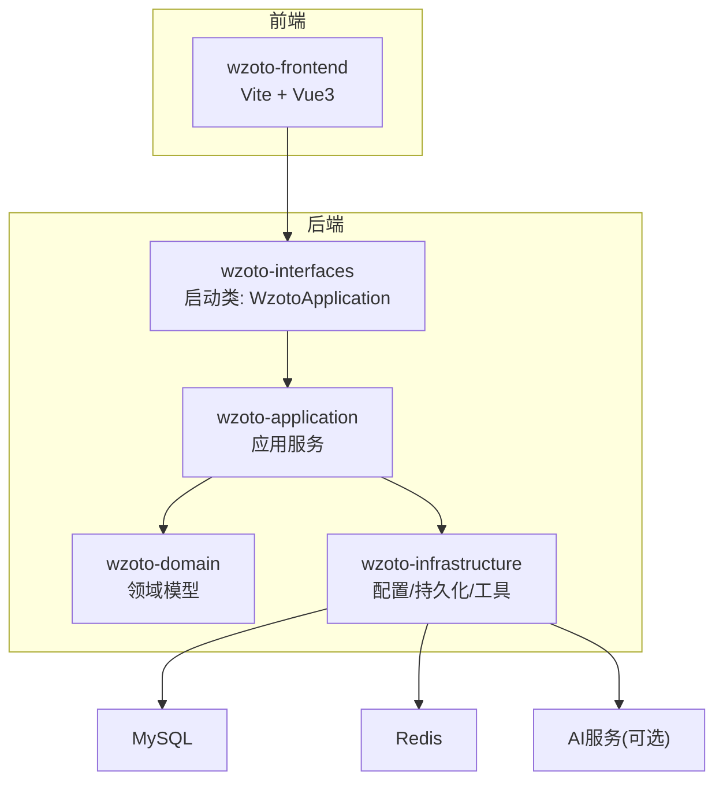
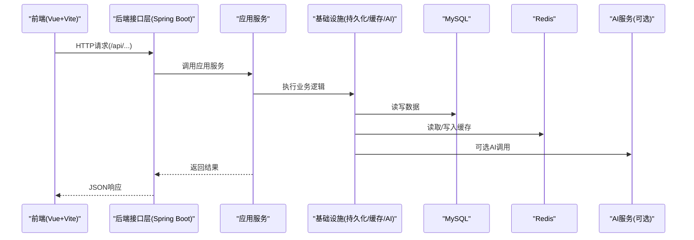
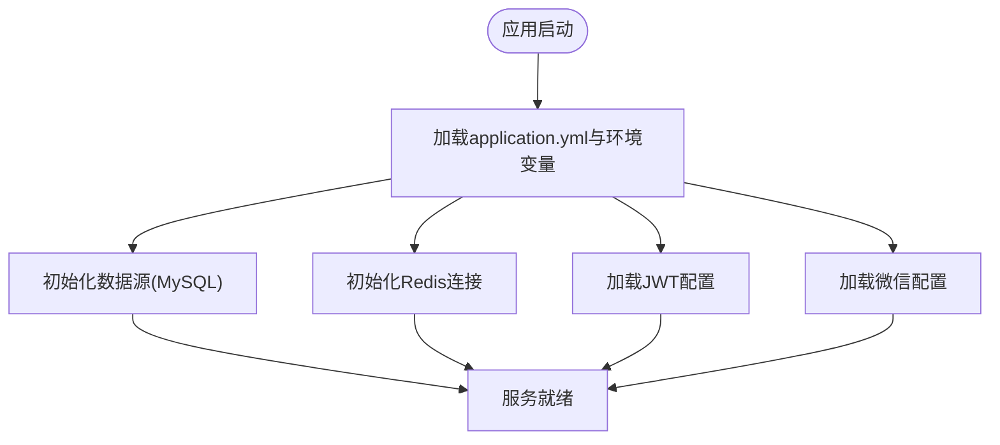
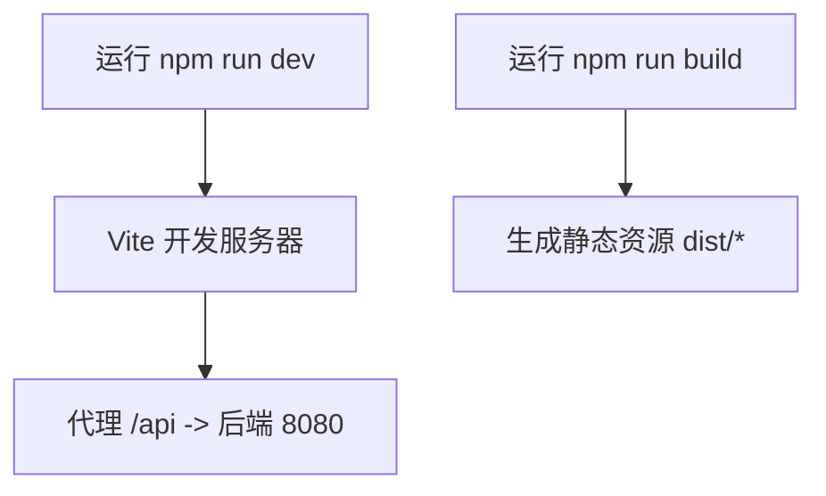
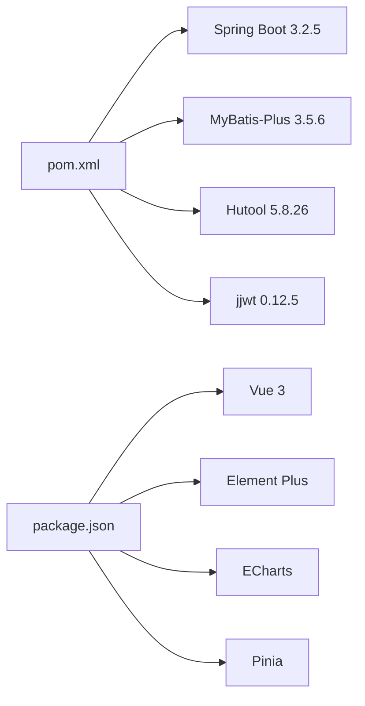

# 部署与运维

<cite>
**本文引用的文件**
- [pom.xml](file://wzoto-backend/pom.xml)
- [application.yml](file://wzoto-backend/wzoto-interfaces/src/main/resources/application.yml)
- [WzotoApplication.java](file://wzoto-backend/wzoto-interfaces/src/main/java/com/wzoto/WzotoApplication.java)
- [JwtProperties.java](file://wzoto-backend/wzoto-infrastructure/src/main/java/com/wzoto/infrastructure/config/JwtProperties.java)
- [WechatProperties.java](file://wzoto-backend/wzoto-infrastructure/src/main/java/com/wzoto/infrastructure/config/WechatProperties.java)
- [package.json](file://wzoto-frontend/package.json)
- [vite.config.js](file://wzoto-frontend/vite.config.js)
</cite>

## 目录
1. [简介](#简介)
2. [项目结构](#项目结构)
3. [核心组件](#核心组件)
4. [架构总览](#架构总览)
5. [详细组件分析](#详细组件分析)
6. [依赖分析](#依赖分析)
7. [性能考虑](#性能考虑)
8. [故障排查指南](#故障排查指南)
9. [结论](#结论)
10. [附录](#附录)

## 简介
本指南面向生产环境的部署与运维，覆盖容器化、编排、云服务部署、环境配置管理、CI/CD流水线、监控告警、数据库运维、安全加固以及应急预案。内容基于当前代码库中的后端Spring Boot应用、前端Vite工程及配置文件进行说明，确保可落地执行。

## 项目结构
- 后端采用多模块Maven工程：domain（领域模型）、application（应用服务）、infrastructure（基础设施实现）、interfaces（接口层）。
- 前端为Vue 3 + Vite工程，提供开发代理与构建脚本。
- 关键配置集中在后端application.yml与前端vite.config.js中。

**图表来源**
- [WzotoApplication.java:1-19](file://wzoto-backend/wzoto-interfaces/src/main/java/com/wzoto/WzotoApplication.java#L1-L19)
- [application.yml:1-51](file://wzoto-backend/wzoto-interfaces/src/main/resources/application.yml#L1-L51)
- [package.json:1-27](file://wzoto-frontend/package.json#L1-L27)
- [vite.config.js:1-21](file://wzoto-frontend/vite.config.js#L1-L21)

**章节来源**
- [pom.xml:1-126](file://wzoto-backend/pom.xml#L1-L126)
- [application.yml:1-51](file://wzoto-backend/wzoto-interfaces/src/main/resources/application.yml#L1-L51)
- [package.json:1-27](file://wzoto-frontend/package.json#L1-L27)
- [vite.config.js:1-21](file://wzoto-frontend/vite.config.js#L1-L21)

## 核心组件
- 应用入口：Spring Boot启动类启用重试与Mapper扫描。
- 配置中心：application.yml集中管理数据源、Redis、MyBatis-Plus、JWT、微信、AI等外部依赖。
- 配置属性：JwtProperties、WechatProperties将配置项注入到业务组件。
- 前端构建：Vite提供开发与构建能力，支持API代理。

**章节来源**
- [WzotoApplication.java:1-19](file://wzoto-backend/wzoto-interfaces/src/main/java/com/wzoto/WzotoApplication.java#L1-L19)
- [application.yml:1-51](file://wzoto-backend/wzoto-interfaces/src/main/resources/application.yml#L1-L51)
- [JwtProperties.java:1-26](file://wzoto-backend/wzoto-infrastructure/src/main/java/com/wzoto/infrastructure/config/JwtProperties.java#L1-L26)
- [WechatProperties.java:1-23](file://wzoto-backend/wzoto-infrastructure/src/main/java/com/wzoto/infrastructure/config/WechatProperties.java#L1-L23)
- [package.json:1-27](file://wzoto-frontend/package.json#L1-L27)
- [vite.config.js:1-21](file://wzoto-frontend/vite.config.js#L1-L21)

## 架构总览
后端通过Spring Boot暴露REST接口，使用MyBatis-Plus访问MySQL，使用Redis做缓存与会话相关能力；可选接入OpenAI兼容的AI服务；前端静态资源由Web服务器托管，开发时通过Vite代理转发至后端。

**图表来源**
- [WzotoApplication.java:1-19](file://wzoto-backend/wzoto-interfaces/src/main/java/com/wzoto/WzotoApplication.java#L1-L19)
- [application.yml:1-51](file://wzoto-backend/wzoto-interfaces/src/main/resources/application.yml#L1-L51)

## 详细组件分析

### 后端启动与配置加载
- 启动类启用重试与Mapper扫描，负责装配应用上下文。
- application.yml定义端口、上下文路径、数据源、Redis、MyBatis-Plus行为、日志级别及自定义配置前缀。
- JwtProperties与WechatProperties分别映射JWT与微信小程序相关配置。

**图表来源**
- [WzotoApplication.java:1-19](file://wzoto-backend/wzoto-interfaces/src/main/java/com/wzoto/WzotoApplication.java#L1-L19)
- [application.yml:1-51](file://wzoto-backend/wzoto-interfaces/src/main/resources/application.yml#L1-L51)
- [JwtProperties.java:1-26](file://wzoto-backend/wzoto-infrastructure/src/main/java/com/wzoto/infrastructure/config/JwtProperties.java#L1-L26)
- [WechatProperties.java:1-23](file://wzoto-backend/wzoto-infrastructure/src/main/java/com/wzoto/infrastructure/config/WechatProperties.java#L1-L23)

**章节来源**
- [WzotoApplication.java:1-19](file://wzoto-backend/wzoto-interfaces/src/main/java/com/wzoto/WzotoApplication.java#L1-L19)
- [application.yml:1-51](file://wzoto-backend/wzoto-interfaces/src/main/resources/application.yml#L1-L51)
- [JwtProperties.java:1-26](file://wzoto-backend/wzoto-infrastructure/src/main/java/com/wzoto/infrastructure/config/JwtProperties.java#L1-L26)
- [WechatProperties.java:1-23](file://wzoto-backend/wzoto-infrastructure/src/main/java/com/wzoto/infrastructure/config/WechatProperties.java#L1-L23)

### 前端构建与代理
- package.json定义了dev/build/preview脚本。
- vite.config.js配置了别名与开发代理，将/api请求转发至本地后端。

**图表来源**
- [package.json:1-27](file://wzoto-frontend/package.json#L1-L27)
- [vite.config.js:1-21](file://wzoto-frontend/vite.config.js#L1-L21)

**章节来源**
- [package.json:1-27](file://wzoto-frontend/package.json#L1-L27)
- [vite.config.js:1-21](file://wzoto-frontend/vite.config.js#L1-L21)

## 依赖分析
- 后端依赖Spring Boot 3.2.5、MyBatis-Plus、Hutool、JWT等。
- 前端依赖Vue 3、Element Plus、ECharts、Pinia等。
- 运行时依赖MySQL与Redis，可选AI服务。

**图表来源**
- [pom.xml:1-126](file://wzoto-backend/pom.xml#L1-L126)
- [package.json:1-27](file://wzoto-frontend/package.json#L1-L27)

**章节来源**
- [pom.xml:1-126](file://wzoto-backend/pom.xml#L1-L126)
- [package.json:1-27](file://wzoto-frontend/package.json#L1-L27)

## 性能考虑
- 数据库连接池与慢查询：建议在生产开启连接池监控并采集慢查询日志，结合索引优化。
- Redis缓存策略：热点数据加缓存，合理设置过期时间与容量上限。
- 日志级别：生产建议调整为info或warn，避免过多debug输出影响吞吐。
- 前端静态资源：启用Gzip/Brotli压缩与浏览器缓存策略，CDN加速。
- 并发与线程：根据JVM参数与容器资源限制调整堆大小与GC策略。

[本节为通用指导，不直接引用具体文件]

## 故障排查指南
- 启动失败
  - 检查环境变量是否缺失（如MYSQL_PASSWORD、REDIS_HOST、JWT_SECRET等），确认application.yml占位符已正确替换。
  - 查看应用日志定位异常栈。
- 数据库连接失败
  - 校验URL、用户名、密码、时区与SSL参数；确认网络可达与白名单。
- Redis连接失败
  - 校验host/port/password/database；确认防火墙与安全组放行。
- 登录鉴权失败
  - 核对JWT密钥与过期时间；检查Authorization头格式。
- 微信登录异常
  - 核对appId/appSecret与回调域名；关注微信服务端错误码。
- 性能瓶颈定位
  - 结合数据库慢查询、Redis命中率、CPU/内存/IO指标，逐步缩小范围。

**章节来源**
- [application.yml:1-51](file://wzoto-backend/wzoto-interfaces/src/main/resources/application.yml#L1-L51)
- [JwtProperties.java:1-26](file://wzoto-backend/wzoto-infrastructure/src/main/java/com/wzoto/infrastructure/config/JwtProperties.java#L1-L26)
- [WechatProperties.java:1-23](file://wzoto-backend/wzoto-infrastructure/src/main/java/com/wzoto/infrastructure/config/WechatProperties.java#L1-L23)

## 结论
本项目具备清晰的模块化结构与完善的配置项，适合在容器化与Kubernetes环境中稳定运行。通过环境变量与配置分离，可实现多环境切换；结合CI/CD与监控告警，能够保障交付质量与运行稳定性。

[本节为总结性内容，不直接引用具体文件]

## 附录

### 生产环境部署

#### Docker容器化
- 后端镜像
  - 基础镜像：选择包含JDK 21的轻量镜像。
  - 构建产物：使用Maven打包后端各模块，生成可执行JAR。
  - 运行参数：通过环境变量注入数据库、Redis、JWT、微信、AI等配置。
  - 健康检查：对HTTP端点或进程存活进行检查。
- 前端镜像
  - 构建阶段：执行npm run build生成静态资源。
  - 运行阶段：使用Nginx等Web服务器托管静态资源，并配置反向代理至后端。

[本节为通用指导，不直接引用具体文件]

#### Kubernetes编排
- Deployment
  - 副本数：根据负载设定初始副本，配合HPA自动扩缩容。
  - 资源限制：设置requests/limits以保障资源隔离。
  - 探针：配置liveness/readiness探针提升可用性。
- Service/Ingress
  - Service暴露内部端口；Ingress配置域名、TLS与路由规则。
- ConfigMap/Secret
  - 将非敏感配置放入ConfigMap，敏感信息（数据库密码、JWT密钥等）放入Secret。
- 存储
  - 如需持久化日志或临时文件，使用PV/PVC。

[本节为通用指导，不直接引用具体文件]

#### 云服务部署
- 容器服务：使用云厂商托管容器服务（如ACK/EKS/GKE）部署Deployment与Service。
- 托管数据库：使用云数据库MySQL，配置白名单与备份策略。
- 托管缓存：使用云Redis实例，配置只读副本与高可用。
- 对象存储：用于存放媒体资源与导出文件。
- 负载均衡与域名：配置负载均衡器与DNS解析，启用HTTPS。

[本节为通用指导，不直接引用具体文件]

### 环境配置管理
- 环境变量
  - 数据库：MYSQL_PASSWORD、数据库URL等。
  - 缓存：REDIS_HOST、REDIS_PORT、REDIS_PASSWORD。
  - 鉴权：JWT_SECRET、过期时间。
  - 第三方：WECHAT_APP_ID、WECHAT_APP_SECRET。
  - AI：AI_ENABLED、AI_BASE_URL、AI_API_KEY、AI_MODEL、AI_TEMPERATURE。
- 配置文件
  - application.yml作为默认配置，生产环境通过环境变量覆盖。
  - 多环境切换：通过不同ConfigMap/Secret或环境变量集实现。
- 最佳实践
  - 禁止在代码或仓库中提交敏感信息。
  - 使用命名规范区分环境（如prod/dev/staging）。

**章节来源**
- [application.yml:1-51](file://wzoto-backend/wzoto-interfaces/src/main/resources/application.yml#L1-L51)
- [JwtProperties.java:1-26](file://wzoto-backend/wzoto-infrastructure/src/main/java/com/wzoto/infrastructure/config/JwtProperties.java#L1-L26)
- [WechatProperties.java:1-23](file://wzoto-backend/wzoto-infrastructure/src/main/java/com/wzoto/infrastructure/config/WechatProperties.java#L1-L23)

### CI/CD流水线
- 触发条件：push/PR事件。
- 构建阶段
  - 后端：Maven编译、单元测试、打包。
  - 前端：安装依赖、构建静态资源。
- 测试阶段
  - 单元测试、集成测试（可选）、端到端测试（可选）。
- 制品归档
  - 后端JAR、前端dist目录。
- 部署阶段
  - 推送镜像到镜像仓库。
  - 更新Kubernetes配置并滚动发布。
- 回滚策略
  - 保留历史版本，一键回滚。

[本节为通用指导，不直接引用具体文件]

### 监控告警系统
- 应用监控
  - 采集JVM指标、HTTP请求量、错误率、延迟分布。
- 日志收集
  - 统一日志格式，采集stdout/stderr至日志平台，按服务与实例维度聚合。
- 性能指标
  - 数据库慢查询、连接池使用率、Redis命中率与内存使用。
- 告警规则
  - 基于阈值与趋势设置告警，通知渠道包括邮件、IM等。

[本节为通用指导，不直接引用具体文件]

### 数据库运维
- 备份恢复
  - 定期全量与增量备份，验证恢复流程。
- 性能调优
  - 索引优化、SQL审查、连接池参数调优、分库分表评估。
- 容量规划
  - 根据增长趋势预估磁盘与内存需求，预留冗余。

[本节为通用指导，不直接引用具体文件]

### 安全加固措施
- SSL证书
  - Ingress或网关配置HTTPS，证书自动续期。
- 防火墙与安全组
  - 仅开放必要端口，限制来源IP。
- 安全扫描
  - 镜像漏洞扫描、依赖漏洞扫描、代码安全扫描。
- 最小权限
  - 数据库账号最小授权，Redis禁用危险命令。

[本节为通用指导，不直接引用具体文件]

### 运维手册与应急预案
- 日常巡检
  - 检查服务健康、资源使用、错误日志、备份状态。
- 常见故障处理
  - 数据库不可用：切换只读、扩容、重建连接。
  - Redis异常：重启实例、清理大Key、迁移数据。
  - 前端无法访问：检查Nginx配置、域名解析、证书。
- 应急流程
  - 发现→评估→处置→复盘→改进，形成闭环。

[本节为通用指导，不直接引用具体文件]