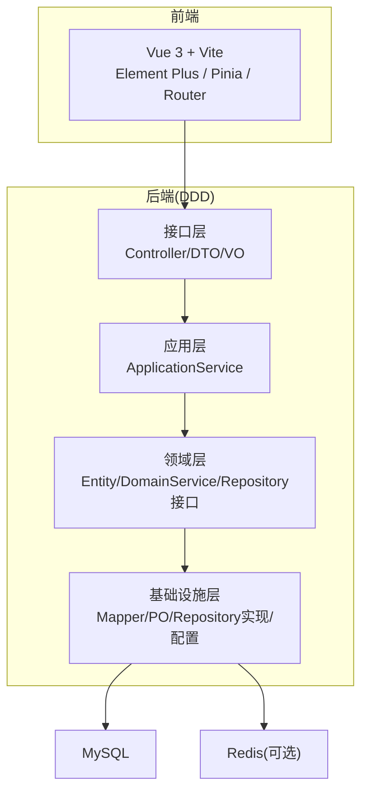
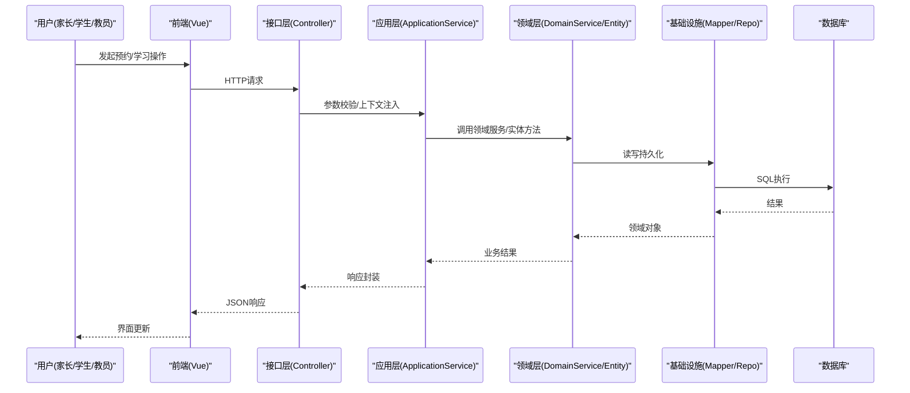
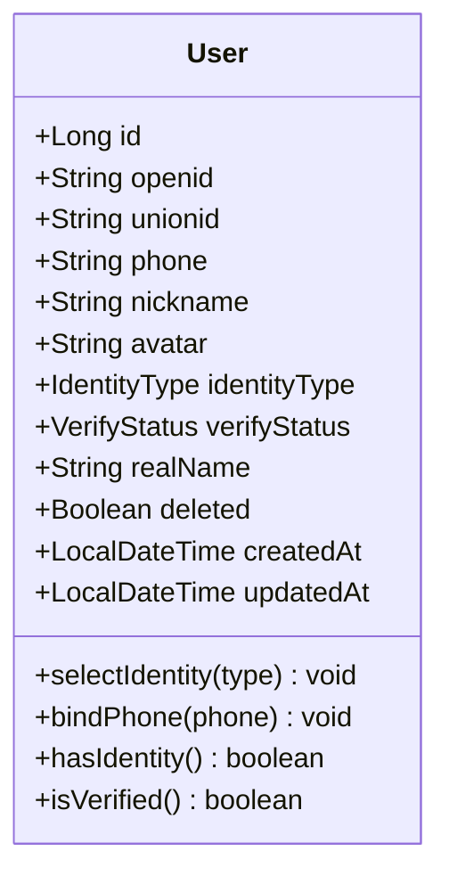
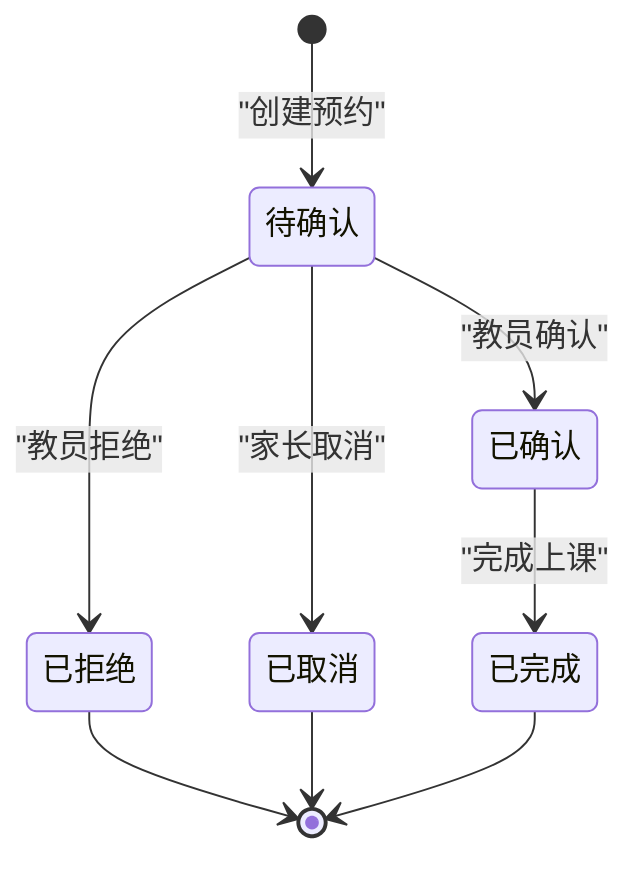
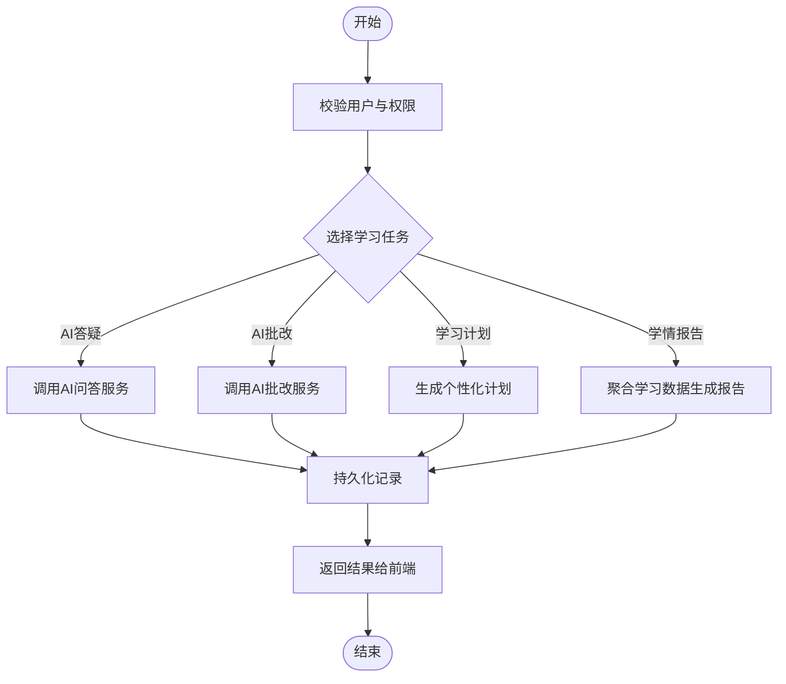
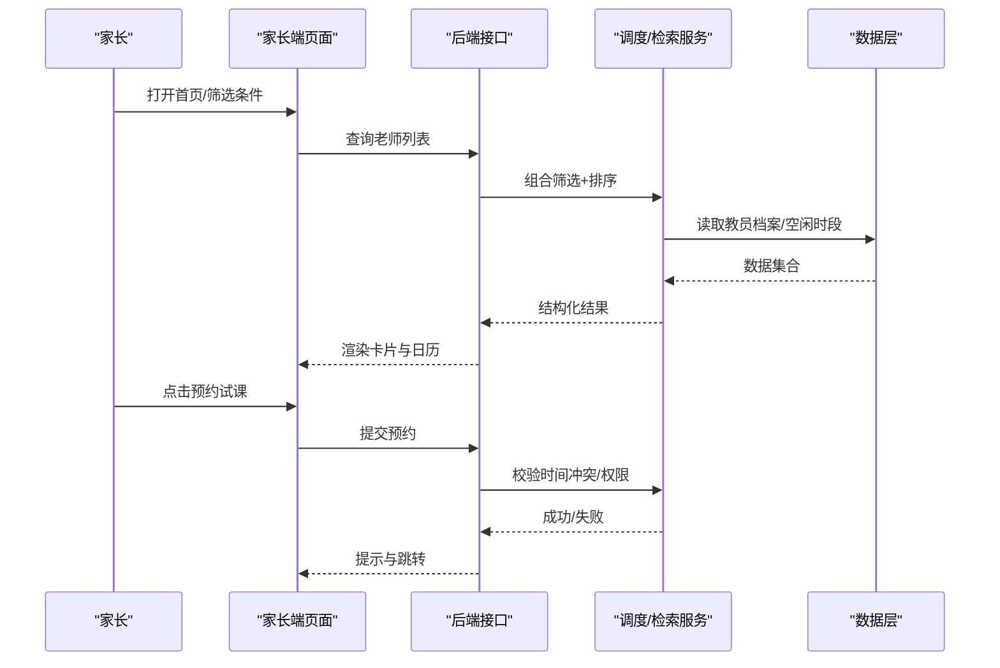
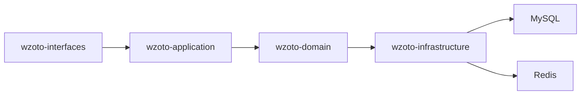

# 项目概述

<cite>
**本文引用的文件**
- [wzoto-backend/pom.xml](file://wzoto-backend/pom.xml)
- [application.yml](file://wzoto-backend/wzoto-interfaces/src/main/resources/application.yml)
- [WzotoApplication.java](file://wzoto-backend/wzoto-interfaces/src/main/java/com/wzoto/WzotoApplication.java)
- [t_user.sql](file://wzoto-backend/sql/t_user.sql)
- [t_booking.sql](file://wzoto-backend/sql/t_booking.sql)
- [User.java](file://wzoto-backend/wzoto-domain/src/main/java/com/wzoto/domain/entity/User.java)
- [Booking.java](file://wzoto-backend/wzoto-domain/src/main/java/com/wzoto/domain/entity/Booking.java)
- [小学生全科学习功能说明文档.md](file://docs/小学生全科学习功能说明文档.md)
- [单页面原型说明文档.md](file://docs/单页面原型说明文档.md)
- [package.json（前端）](file://wzoto-frontend/package.json)
</cite>

## 目录
1. [简介](#简介)
2. [项目结构](#项目结构)
3. [核心组件](#核心组件)
4. [架构总览](#架构总览)
5. [详细组件分析](#详细组件分析)
6. [依赖关系分析](#依赖关系分析)
7. [性能与扩展性](#性能与扩展性)
8. [故障排查指南](#故障排查指南)
9. [结论](#结论)
10. [附录：快速开始](#附录快速开始)

## 简介
本项目“学霸到家”是一个连接家长、学生与教员的线下1对1家教撮合平台，并集成AI智能学习系统。平台通过前后端分离的架构实现多角色协同：家长可发布需求、筛选教员、预约试课与正式课程；教员可维护档案、展示空闲时段、确认或拒绝预约；学生端提供AI答疑、错题本、学习计划与学情报告等能力。平台采用DDD分层设计，领域层聚焦业务规则，应用层编排流程，基础设施层负责持久化与外部服务对接，接口层暴露REST API。整体目标是在保障安全与合规的前提下，提升家教匹配效率与学习体验。

## 项目结构
后端采用Maven多模块工程，按DDD四层划分：
- wzoto-domain：领域模型、仓储接口、领域服务与值对象
- wzoto-infrastructure：MyBatis-Plus映射、PO实体、仓储实现、配置与工具
- wzoto-application：应用服务，编排业务流程、权限校验与事务边界
- wzoto-interfaces：Spring Boot启动类、Controller、DTO/VO、全局异常处理

前端基于Vue 3 + Vite + Element Plus + Pinia + Vue Router，按页面与API职责组织，包含家长端与学生端页面、路由与状态管理。

图表来源
- [wzoto-backend/pom.xml:21-26](file://wzoto-backend/pom.xml#L21-L26)
- [application.yml:6-17](file://wzoto-backend/wzoto-interfaces/src/main/resources/application.yml#L6-L17)

章节来源
- [wzoto-backend/pom.xml:1-126](file://wzoto-backend/pom.xml#L1-L126)
- [package.json（前端）:1-27](file://wzoto-frontend/package.json#L1-L27)

## 核心组件
- 用户认证与身份管理：支持微信登录、身份选择（家长/学生）、实名认证状态流转与手机号绑定。
- 家教撮合与预约：家长发起预约，教员确认/拒绝，支持时间冲突校验与状态机流转。
- AI智能学习：AI答疑、AI批改、学习计划生成、学情报告、资源解锁与付费体系。
- 学习管理：子女管理、学习计划、任务下发、学情报告、时长管控、错题管理、成就激励。
- 家长管控：一键锁定/解锁、学习时长与资源访问控制。
- 教员档案与排班：擅长学科、定价明细、可上门区域、每周空闲授课日历。

章节来源
- [User.java:12-93](file://wzoto-backend/wzoto-domain/src/main/java/com/wzoto/domain/entity/User.java#L12-L93)
- [Booking.java:10-114](file://wzoto-backend/wzoto-domain/src/main/java/com/wzoto/domain/entity/Booking.java#L10-L114)
- [小学生全科学习功能说明文档.md:28-102](file://docs/小学生全科学习功能说明文档.md#L28-L102)
- [单页面原型说明文档.md:54-729](file://docs/单页面原型说明文档.md#L54-L729)

## 架构总览
系统采用前后端分离与DDD分层，结合微服务化演进思路（当前为单体多模块，可按域拆分为独立服务）。关键特点：
- 领域驱动设计：以实体与领域服务为核心，明确业务不变量与状态机。
- 清晰的分层解耦：接口层仅做协议适配，应用层编排流程，领域层承载规则，基础设施层屏蔽技术细节。
- 可扩展的AI能力：通过配置开关切换Mock与真实AI调用，便于开发与灰度。
- 数据一致性：MyBatis-Plus + MySQL，逻辑删除与审计字段统一处理。
- 安全与鉴权：JWT令牌、拦截器校验、角色与权限控制。

图表来源
- [WzotoApplication.java:8-18](file://wzoto-backend/wzoto-interfaces/src/main/java/com/wzoto/WzotoApplication.java#L8-L18)
- [application.yml:6-29](file://wzoto-backend/wzoto-interfaces/src/main/resources/application.yml#L6-L29)

## 详细组件分析

### 用户与认证
- 用户实体包含身份类型、认证状态、手机号与基本信息，并提供“选择身份”“绑定手机号”“是否已认证”等核心行为。
- 认证流程：微信登录获取openid/unionid，选择身份后进入实名认证流程，通过后具备完整功能权限。
- 安全策略：JWT签发与校验、拦截器鉴权、敏感信息不落地（如sessionKey）。

图表来源
- [User.java:12-93](file://wzoto-backend/wzoto-domain/src/main/java/com/wzoto/domain/entity/User.java#L12-L93)
- [t_user.sql:7-26](file://wzoto-backend/sql/t_user.sql#L7-L26)

章节来源
- [User.java:12-93](file://wzoto-backend/wzoto-domain/src/main/java/com/wzoto/domain/entity/User.java#L12-L93)
- [t_user.sql:1-26](file://wzoto-backend/sql/t_user.sql#L1-L26)

### 预约撮合与订单状态机
- 预约实体定义家长、教员、科目、时间、地址、留言与状态，内置创建、确认、拒绝、取消、完成等行为，保证状态迁移合法。
- 撮合流程：家长提交预约→教员确认/拒绝→线下完成→标记完成。

图表来源
- [Booking.java:10-114](file://wzoto-backend/wzoto-domain/src/main/java/com/wzoto/domain/entity/Booking.java#L10-L114)
- [t_booking.sql:1-23](file://wzoto-backend/sql/t_booking.sql#L1-L23)

章节来源
- [Booking.java:10-114](file://wzoto-backend/wzoto-domain/src/main/java/com/wzoto/domain/entity/Booking.java#L10-L114)
- [t_booking.sql:1-23](file://wzoto-backend/sql/t_booking.sql#L1-L23)

### AI智能学习与学习管理
- 能力范围：AI答疑、AI批改、学习计划生成、学情报告、资源解锁、错题管理、成长激励。
- 技术要点：通过配置开关启用真实AI或Mock模式；学习模块复用会员与付费体系；前后端按DDD分层交付。
- 数据表：涵盖AI记录、学习计划、错题、音频资料、微课、知识点、测试卷等。

图表来源
- [小学生全科学习功能说明文档.md:28-102](file://docs/小学生全科学习功能说明文档.md#L28-L102)
- [application.yml:39-46](file://wzoto-backend/wzoto-interfaces/src/main/resources/application.yml#L39-L46)

章节来源
- [小学生全科学习功能说明文档.md:28-102](file://docs/小学生全科学习功能说明文档.md#L28-L102)
- [application.yml:39-46](file://wzoto-backend/wzoto-interfaces/src/main/resources/application.yml#L39-L46)

### 家长端与教员端交互（原型要点）
- 家长端首页与老师列表页支持多维度筛选（学科/年级/距离/单价区间/院校），卡片展示空闲时段与评分。
- 教员详情页展示基本信息、擅长学科、定价明细、每周空闲授课日历、可上门区域、获奖经历、个人简介与评价。
- 发布招聘表单支持年级、科目、类型、地址、预算、频次与备注，提交前进行必填校验。

图表来源
- [单页面原型说明文档.md:54-729](file://docs/单页面原型说明文档.md#L54-L729)

章节来源
- [单页面原型说明文档.md:54-729](file://docs/单页面原型说明文档.md#L54-L729)

## 依赖关系分析
- 后端技术栈：Spring Boot 3.2.5、MyBatis-Plus 3.5.6、Hutool、JWT、Lombok、SLF4J。
- 运行环境：Java 21、MySQL 5.5兼容、Redis（可选）。
- 前端技术栈：Vue 3、Vite、Element Plus、Pinia、Vue Router、ECharts、Axios。
- 配置项：数据库连接、Redis、JWT密钥与过期时间、微信AppID/Secret、AI开关与模型参数。

图表来源
- [wzoto-backend/pom.xml:21-26](file://wzoto-backend/pom.xml#L21-L26)
- [application.yml:6-17](file://wzoto-backend/wzoto-interfaces/src/main/resources/application.yml#L6-L17)

章节来源
- [wzoto-backend/pom.xml:28-90](file://wzoto-backend/pom.xml#L28-L90)
- [application.yml:6-17](file://wzoto-backend/wzoto-interfaces/src/main/resources/application.yml#L6-L17)

## 性能与扩展性
- 缓存与异步：可引入Redis缓存热点数据（如教员列表、资源目录），异步任务处理AI生成与报告聚合。
- 数据库优化：合理索引（如预约状态、日期、教员ID），分页与懒加载，避免大表全表扫描。
- 服务拆分：随业务增长可将“撮合”“学习”“AI”“支付/会员”拆分为独立微服务，通过API网关与消息队列解耦。
- 前端性能：按需加载路由与组件，图片与视频资源CDN加速，图表按需引入。

[本节为通用建议，无需代码引用]

## 故障排查指南
- 启动失败
  - 检查端口占用与上下文路径配置
  - 确认数据库与Redis连接字符串、账号密码与环境变量
- 鉴权问题
  - 核对JWT密钥与过期时间配置
  - 检查拦截器是否放行白名单接口
- 数据异常
  - 核对MyBatis-Plus全局配置（驼峰映射、逻辑删除）
  - 检查SQL脚本是否执行成功、表结构与实体映射一致
- AI功能不可用
  - 确认AI开关与API Key、BaseURL、Model等配置
  - 在开发阶段使用Mock模式验证流程

章节来源
- [application.yml:1-51](file://wzoto-backend/wzoto-interfaces/src/main/resources/application.yml#L1-L51)

## 结论
“学霸到家”以DDD分层与前后端分离为基础，构建了覆盖家教撮合与AI学习的完整闭环。平台在保证业务规则严谨性的同时，提供了良好的扩展性与可维护性。随着业务规模扩大，可通过服务拆分与缓存/异步优化进一步提升性能与稳定性。

[本节为总结性内容，无需代码引用]

## 附录：快速开始
- 环境要求
  - Java 21
  - Node.js（用于前端构建）
  - MySQL（版本兼容5.5及以上）
  - Redis（可选，用于缓存与会话）
- 依赖安装
  - 后端：进入后端根目录，使用Maven编译打包
  - 前端：进入前端目录，安装依赖并启动开发服务器
- 数据库初始化
  - 执行用户表与预约表等基础SQL脚本
  - 根据需要执行学习相关建表与种子数据脚本
- 启动步骤
  - 修改application.yml中的数据库、Redis、JWT与AI配置
  - 启动Spring Boot应用
  - 启动前端开发服务器，访问默认端口
- 常见问题
  - 端口冲突：调整server.port或前端dev server端口
  - 数据库连接失败：检查url、username、password与时区设置
  - AI调用失败：开启Mock模式或检查AI配置

章节来源
- [wzoto-backend/pom.xml:28-37](file://wzoto-backend/pom.xml#L28-L37)
- [application.yml:1-51](file://wzoto-backend/wzoto-interfaces/src/main/resources/application.yml#L1-L51)
- [t_user.sql:1-26](file://wzoto-backend/sql/t_user.sql#L1-L26)
- [t_booking.sql:1-23](file://wzoto-backend/sql/t_booking.sql#L1-L23)
- [package.json（前端）:1-27](file://wzoto-frontend/package.json#L1-L27)