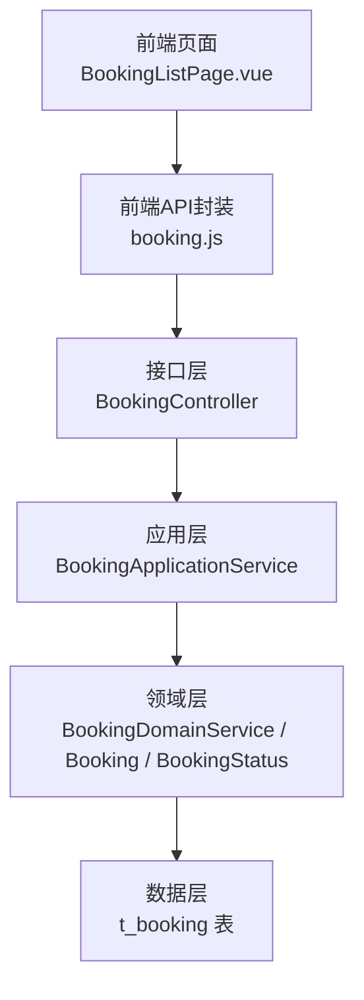
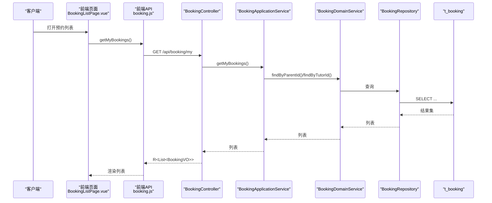
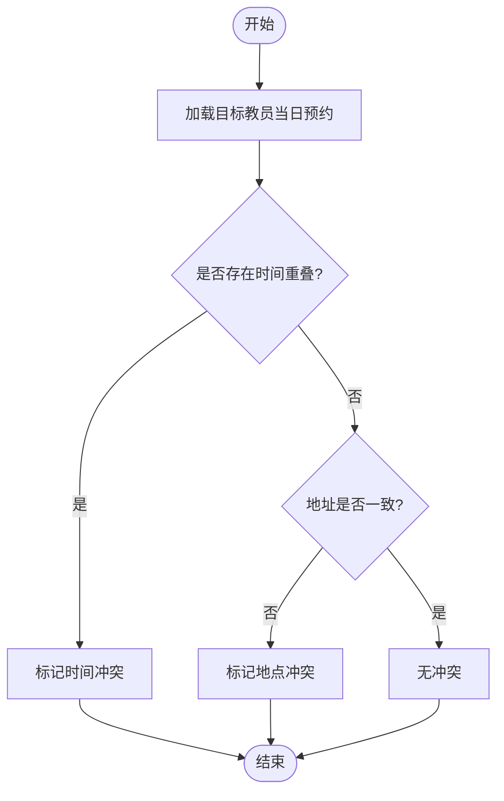
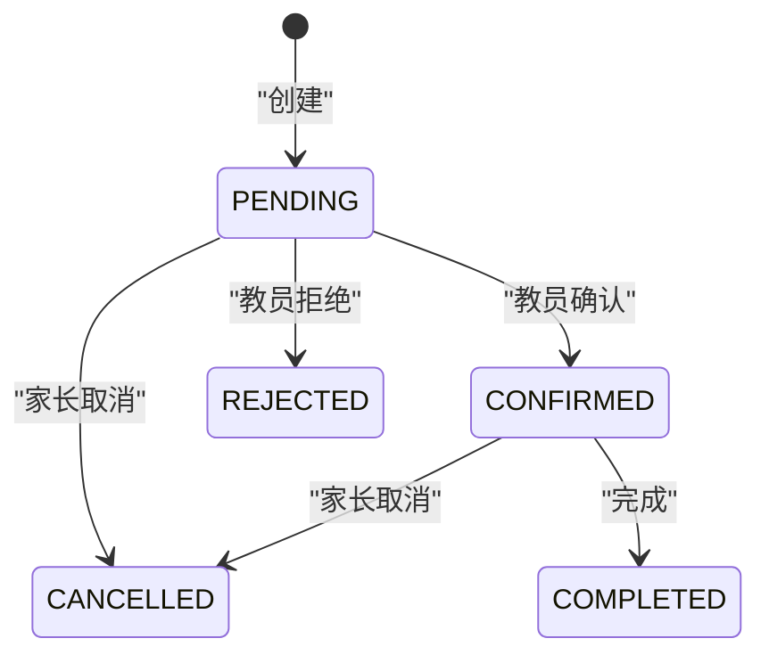
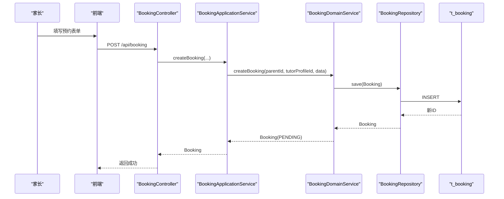
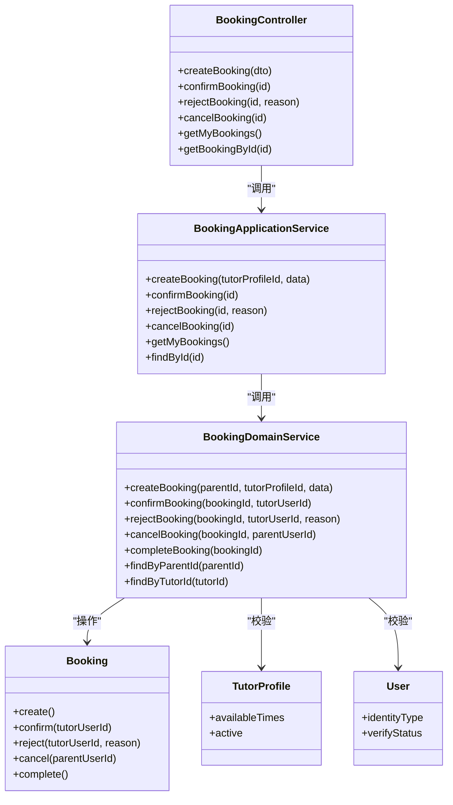

# 在线预约

<cite>
**本文引用的文件**
- [Booking.java](file://wzoto-backend/wzoto-domain/src/main/java/com/wzoto/domain/entity/Booking.java)
- [BookingStatus.java](file://wzoto-backend/wzoto-domain/src/main/java/com/wzoto/domain/valobj/BookingStatus.java)
- [BookingDomainService.java](file://wzoto-backend/wzoto-domain/src/main/java/com/wzoto/domain/service/BookingDomainService.java)
- [BookingApplicationService.java](file://wzoto-backend/wzoto-application/src/main/java/com/wzoto/application/service/BookingApplicationService.java)
- [BookingController.java](file://wzoto-backend/wzoto-interfaces/src/main/java/com/wzoto/interfaces/controller/BookingController.java)
- [CreateBookingDTO.java](file://wzoto-backend/wzoto-interfaces/src/main/java/com/wzoto/interfaces/dto/booking/CreateBookingDTO.java)
- [BookingVO.java](file://wzoto-backend/wzoto-interfaces/src/main/java/com/wzoto/interfaces/vo/booking/BookingVO.java)
- [t_booking.sql](file://wzoto-backend/sql/t_booking.sql)
- [TutorProfile.java](file://wzoto-backend/wzoto-domain/src/main/java/com/wzoto/domain/entity/TutorProfile.java)
- [User.java](file://wzoto-backend/wzoto-domain/src/main/java/com/wzoto/domain/entity/User.java)
- [WechatUtil.java](file://wzoto-backend/wzoto-infrastructure/src/main/java/com/wzoto/infrastructure/util/WechatUtil.java)
- [WechatProperties.java](file://wzoto-backend/wzoto-infrastructure/src/main/java/com/wzoto/infrastructure/config/WechatProperties.java)
- [booking.js](file://wzoto-frontend/src/api/booking.js)
- [BookingListPage.vue](file://wzoto-frontend/src/pages/booking/BookingListPage.vue)
</cite>

## 目录
1. [简介](#简介)
2. [项目结构](#项目结构)
3. [核心组件](#核心组件)
4. [架构总览](#架构总览)
5. [详细组件分析](#详细组件分析)
6. [依赖关系分析](#依赖关系分析)
7. [性能考虑](#性能考虑)
8. [故障排查指南](#故障排查指南)
9. [结论](#结论)
10. [附录：API与前端集成](#附录api与前端集成)

## 简介
本文件面向wzoto在线预约系统，聚焦“时间槽管理、冲突检测、状态机流转、业务流程、通知提醒、API与前端集成”等关键主题。文档基于领域模型、应用服务、接口层与数据库设计进行系统化说明，并提供可操作的流程图与时序图，帮助读者快速理解并落地实现。

## 项目结构
后端采用分层架构：接口层（Controller）→ 应用层（Application Service）→ 领域层（Domain Service/Entity/Value Object）→ 基础设施层（Repository/Mapper/工具）。前端为Vue工程，提供预约列表页与API封装。

图表来源
- [BookingController.java:21-96](file://wzoto-backend/wzoto-interfaces/src/main/java/com/wzoto/interfaces/controller/BookingController.java#L21-L96)
- [BookingApplicationService.java:16-53](file://wzoto-backend/wzoto-application/src/main/java/com/wzoto/application/service/BookingApplicationService.java#L16-L53)
- [BookingDomainService.java:18-122](file://wzoto-backend/wzoto-domain/src/main/java/com/wzoto/domain/service/BookingDomainService.java#L18-L122)
- [t_booking.sql:1-23](file://wzoto-backend/sql/t_booking.sql#L1-L23)

章节来源
- [BookingController.java:21-96](file://wzoto-backend/wzoto-interfaces/src/main/java/com/wzoto/interfaces/controller/BookingController.java#L21-L96)
- [BookingApplicationService.java:16-53](file://wzoto-backend/wzoto-application/src/main/java/com/wzoto/application/service/BookingApplicationService.java#L16-L53)
- [BookingDomainService.java:18-122](file://wzoto-backend/wzoto-domain/src/main/java/com/wzoto/domain/service/BookingDomainService.java#L18-L122)
- [t_booking.sql:1-23](file://wzoto-backend/sql/t_booking.sql#L1-L23)

## 核心组件
- 领域实体与值对象
  - 预约实体：包含家长ID、教员ID、科目、日期、起止时间、地址、留言、状态、回复等字段，并提供创建、确认、拒绝、取消、完成等行为方法。
  - 预约状态：待确认、已确认、已完成、已取消、已拒绝五种状态，提供编码到枚举的转换。
- 应用服务
  - 编排业务用例：创建预约、确认/拒绝、取消、查询我的预约（按身份区分视角）、按ID查询。
- 领域服务
  - 校验家长认证与教员档案有效性；执行状态机变更；持久化更新。
- 接口层
  - REST API：创建、确认、拒绝、取消、查询我的预约、按ID查询；统一返回R包装。
- 数据层
  - 预约订单表：含索引优化查询（家长、教员、状态、日期、组合索引）。

章节来源
- [Booking.java:15-114](file://wzoto-backend/wzoto-domain/src/main/java/com/wzoto/domain/entity/Booking.java#L15-L114)
- [BookingStatus.java:11-30](file://wzoto-backend/wzoto-domain/src/main/java/com/wzoto/domain/valobj/BookingStatus.java#L11-L30)
- [BookingApplicationService.java:16-53](file://wzoto-backend/wzoto-application/src/main/java/com/wzoto/application/service/BookingApplicationService.java#L16-L53)
- [BookingDomainService.java:18-122](file://wzoto-backend/wzoto-domain/src/main/java/com/wzoto/domain/service/BookingDomainService.java#L18-L122)
- [BookingController.java:21-96](file://wzoto-backend/wzoto-interfaces/src/main/java/com/wzoto/interfaces/controller/BookingController.java#L21-L96)
- [t_booking.sql:1-23](file://wzoto-backend/sql/t_booking.sql#L1-L23)

## 架构总览
预约系统遵循“请求进入→参数校验→应用编排→领域规则→持久化→响应”的分层流程。状态机由领域实体维护，确保一致性。

图表来源
- [BookingListPage.vue:54-59](file://wzoto-frontend/src/pages/booking/BookingListPage.vue#L54-L59)
- [booking.js:19-21](file://wzoto-frontend/src/api/booking.js#L19-L21)
- [BookingController.java:61-66](file://wzoto-backend/wzoto-interfaces/src/main/java/com/wzoto/interfaces/controller/BookingController.java#L61-L66)
- [BookingApplicationService.java:40-48](file://wzoto-backend/wzoto-application/src/main/java/com/wzoto/application/service/BookingApplicationService.java#L40-L48)
- [BookingDomainService.java:107-113](file://wzoto-backend/wzoto-domain/src/main/java/com/wzoto/domain/service/BookingDomainService.java#L107-L113)
- [t_booking.sql:1-23](file://wzoto-backend/sql/t_booking.sql#L1-L23)

## 详细组件分析

### 时间槽管理与可预约时间段计算
- 可预约时间段来源
  - 教员档案中的可用时段字段用于表达可授课的时间段（如按周几、起止时间）。
  - 预约记录中的日期与起止时间用于表示实际占用。
- 可预约时间段计算思路
  - 以教员档案的可用时段为基础，生成候选时间槽。
  - 过滤掉已被占用的时间段（同一天同一教员的已有预约）。
  - 结合当前时间与上课开始时间的最小提前量，剔除不可用历史或过近时段。
- 复杂度与扩展
  - 基础算法为O(N)扫描候选槽与已有预约集合，N为当天预约数。
  - 可扩展加入地点冲突、教员多档期合并、节假日配置等维度。

章节来源
- [TutorProfile.java:43-44](file://wzoto-backend/wzoto-domain/src/main/java/com/wzoto/domain/entity/TutorProfile.java#L43-L44)
- [Booking.java:31-38](file://wzoto-backend/wzoto-domain/src/main/java/com/wzoto/domain/entity/Booking.java#L31-L38)
- [t_booking.sql:7-9](file://wzoto-backend/sql/t_booking.sql#L7-L9)

### 冲突检测算法（时间、地点、教员）
- 时间冲突
  - 判定条件：同一教员在同一天的两个时间段存在重叠。
  - 实现要点：比较[startA, endA]与[startB, endB]是否相交。
- 地点冲突
  - 若同一教员在同一天同一时间段有多条预约且地址不同，需提示或阻止重复预约。
- 教员冲突
  - 通过tutor_id聚合查询该日期的所有预约，检查时间重叠与地址差异。
- 建议实现位置
  - 在创建预约前调用领域服务进行冲突校验；或在应用服务中编排校验逻辑。

图表来源
- [BookingDomainService.java:31-53](file://wzoto-backend/wzoto-domain/src/main/java/com/wzoto/domain/service/BookingDomainService.java#L31-L53)
- [t_booking.sql:7-9](file://wzoto-backend/sql/t_booking.sql#L7-L9)

章节来源
- [BookingDomainService.java:31-53](file://wzoto-backend/wzoto-domain/src/main/java/com/wzoto/domain/service/BookingDomainService.java#L31-L53)
- [t_booking.sql:7-9](file://wzoto-backend/sql/t_booking.sql#L7-L9)

### 重复课程处理
- 场景：同一家长对同一教员、同一科目、同一日期的多次预约。
- 策略：
  - 若时间段不重叠且地址一致，允许创建多条预约。
  - 若时间段重叠或地址不一致，应提示冲突并阻止创建。
- 实现建议：
  - 在创建前按(tutor_id, booking_date)查询已有预约，进行区间与地址比对。

章节来源
- [BookingDomainService.java:31-53](file://wzoto-backend/wzoto-domain/src/main/java/com/wzoto/domain/service/BookingDomainService.java#L31-L53)
- [t_booking.sql:7-9](file://wzoto-backend/sql/t_booking.sql#L7-L9)

### 预约状态机与流转规则
- 状态定义：待确认、已确认、已完成、已取消、已拒绝。
- 流转规则
  - 创建：PENDING
  - 教员确认：PENDING → CONFIRMED（仅教员本人操作）
  - 教员拒绝：PENDING → REJECTED（仅教员本人操作，可附原因）
  - 家长取消：PENDING/CONFIRMED → CANCELLED（非已完成/已取消）
  - 完成：CONFIRMED → COMPLETED
- 约束与异常
  - 非授权用户操作抛出非法参数异常。
  - 状态不允许时抛出非法状态异常。

图表来源
- [BookingStatus.java:11-30](file://wzoto-backend/wzoto-domain/src/main/java/com/wzoto/domain/valobj/BookingStatus.java#L11-L30)
- [Booking.java:61-113](file://wzoto-backend/wzoto-domain/src/main/java/com/wzoto/domain/entity/Booking.java#L61-L113)

章节来源
- [BookingStatus.java:11-30](file://wzoto-backend/wzoto-domain/src/main/java/com/wzoto/domain/valobj/BookingStatus.java#L11-L30)
- [Booking.java:61-113](file://wzoto-backend/wzoto-domain/src/main/java/com/wzoto/domain/entity/Booking.java#L61-L113)

### 预约业务流程（端到端）
- 创建预约
  - 家长提交科目、日期、起止时间、地址、留言；系统校验家长认证与教员档案有效性后创建PENDING。
- 教员确认/拒绝
  - 教员查看收到的预约，确认后变为CONFIRMED；拒绝则变为REJECTED并记录原因。
- 上课提醒
  - 可在CONFIRMED状态下，于课前触发提醒（见通知提醒系统）。
- 完成评价
  - 课后将状态置为COMPLETED；后续可扩展评价模块。

图表来源
- [BookingController.java:28-41](file://wzoto-backend/wzoto-interfaces/src/main/java/com/wzoto/interfaces/controller/BookingController.java#L28-L41)
- [BookingApplicationService.java:20-23](file://wzoto-backend/wzoto-application/src/main/java/com/wzoto/application/service/BookingApplicationService.java#L20-L23)
- [BookingDomainService.java:31-53](file://wzoto-backend/wzoto-domain/src/main/java/com/wzoto/domain/service/BookingDomainService.java#L31-L53)
- [t_booking.sql:1-23](file://wzoto-backend/sql/t_booking.sql#L1-L23)

章节来源
- [BookingController.java:28-41](file://wzoto-backend/wzoto-interfaces/src/main/java/com/wzoto/interfaces/controller/BookingController.java#L28-L41)
- [BookingApplicationService.java:20-23](file://wzoto-backend/wzoto-application/src/main/java/com/wzoto/application/service/BookingApplicationService.java#L20-L23)
- [BookingDomainService.java:31-53](file://wzoto-backend/wzoto-domain/src/main/java/com/wzoto/domain/service/BookingDomainService.java#L31-L53)

### 通知提醒系统
- 现状
  - 当前代码未实现预约确认、上课前提醒、取消通知的消息推送。
- 能力基座
  - 微信小程序登录能力：code2Session获取openid/session_key。
  - 配置项：appId、appSecret、loginUrl。
- 建议方案
  - 使用微信订阅消息模板，在以下节点触发：
    - 预约确认：向家长发送“预约已确认”通知。
    - 上课前提醒：在CONFIRMED且临近上课时，向家长与教员分别发送提醒。
    - 取消通知：家长取消或教员拒绝时，向对方发送通知。
  - 在应用服务中编排通知发送，保证事务边界外发。

章节来源
- [WechatUtil.java:21-45](file://wzoto-backend/wzoto-infrastructure/src/main/java/com/wzoto/infrastructure/util/WechatUtil.java#L21-L45)
- [WechatProperties.java:10-23](file://wzoto-backend/wzoto-infrastructure/src/main/java/com/wzoto/infrastructure/config/WechatProperties.java#L10-L23)

### 前端集成示例
- API封装
  - 提供创建、确认、拒绝、取消、查询我的预约、按ID查询等方法。
- 页面交互
  - 列表页根据身份显示不同标题与操作按钮；支持接受/拒绝、取消预约；展示状态标签与详情。
- 错误与反馈
  - 使用轻量Toast提示；Element Plus弹窗二次确认。

章节来源
- [booking.js:1-25](file://wzoto-frontend/src/api/booking.js#L1-L25)
- [BookingListPage.vue:1-128](file://wzoto-frontend/src/pages/booking/BookingListPage.vue#L1-L128)

## 依赖关系分析
- 控制器依赖应用服务；应用服务依赖领域服务；领域服务依赖仓库与实体；仓库映射至数据库表。
- 教员档案与用户信息用于创建预约时的合法性校验与VO组装。

图表来源
- [BookingController.java:21-96](file://wzoto-backend/wzoto-interfaces/src/main/java/com/wzoto/interfaces/controller/BookingController.java#L21-L96)
- [BookingApplicationService.java:16-53](file://wzoto-backend/wzoto-application/src/main/java/com/wzoto/application/service/BookingApplicationService.java#L16-L53)
- [BookingDomainService.java:18-122](file://wzoto-backend/wzoto-domain/src/main/java/com/wzoto/domain/service/BookingDomainService.java#L18-L122)
- [Booking.java:15-114](file://wzoto-backend/wzoto-domain/src/main/java/com/wzoto/domain/entity/Booking.java#L15-L114)
- [TutorProfile.java:12-106](file://wzoto-backend/wzoto-domain/src/main/java/com/wzoto/domain/entity/TutorProfile.java#L12-L106)
- [User.java:16-93](file://wzoto-backend/wzoto-domain/src/main/java/com/wzoto/domain/entity/User.java#L16-L93)

章节来源
- [BookingController.java:21-96](file://wzoto-backend/wzoto-interfaces/src/main/java/com/wzoto/interfaces/controller/BookingController.java#L21-L96)
- [BookingApplicationService.java:16-53](file://wzoto-backend/wzoto-application/src/main/java/com/wzoto/application/service/BookingApplicationService.java#L16-L53)
- [BookingDomainService.java:18-122](file://wzoto-backend/wzoto-domain/src/main/java/com/wzoto/domain/service/BookingDomainService.java#L18-L122)
- [Booking.java:15-114](file://wzoto-backend/wzoto-domain/src/main/java/com/wzoto/domain/entity/Booking.java#L15-L114)
- [TutorProfile.java:12-106](file://wzoto-backend/wzoto-domain/src/main/java/com/wzoto/domain/entity/TutorProfile.java#L12-L106)
- [User.java:16-93](file://wzoto-backend/wzoto-domain/src/main/java/com/wzoto/domain/entity/User.java#L16-L93)

## 性能考虑
- 数据库索引
  - 已为parent_id、tutor_id、status、booking_date、tutor_id+status建立索引，利于按教员与状态筛选。
- 查询优化
  - 列表查询建议分页；避免一次性拉取大量数据。
- 并发控制
  - 建议在创建预约时对“教员+日期+时间段”加分布式锁或乐观锁，防止超卖。
- 缓存
  - 教员可用时段与热门时段可短期缓存，减少频繁计算。

章节来源
- [t_booking.sql:17-23](file://wzoto-backend/sql/t_booking.sql#L17-L23)

## 故障排查指南
- 常见异常
  - 仅家长可发起预约：检查用户身份类型。
  - 请先完成实名认证：检查家长认证状态。
  - 教员档案不存在或已下架：检查tutor_profile有效性与上架状态。
  - 无权操作此预约：检查当前用户是否为教员本人或家长本人。
  - 当前状态不允许某操作：检查状态机是否允许该转换。
- 定位建议
  - 查看日志输出（创建、确认、拒绝、取消等关键路径）。
  - 核对数据库记录与状态字段。
  - 检查前端传递的参数是否与DTO要求一致。

章节来源
- [BookingDomainService.java:31-53](file://wzoto-backend/wzoto-domain/src/main/java/com/wzoto/domain/service/BookingDomainService.java#L31-L53)
- [BookingDomainService.java:58-101](file://wzoto-backend/wzoto-domain/src/main/java/com/wzoto/domain/service/BookingDomainService.java#L58-L101)
- [Booking.java:61-113](file://wzoto-backend/wzoto-domain/src/main/java/com/wzoto/domain/entity/Booking.java#L61-L113)

## 结论
本系统以清晰的领域模型与状态机为核心，实现了家长发起、教员确认/拒绝、家长取消、完成的全流程。通过合理的索引与分层架构，具备良好的扩展性。后续建议完善冲突检测、通知提醒与评价模块，进一步提升用户体验与运营效率。

## 附录：API与前端集成

### 预约API接口
- 创建预约
  - 方法：POST
  - 路径：/api/booking
  - 请求体：CreateBookingDTO（包含tutorProfileId、subject、bookingDate、startTime、endTime、address、message）
  - 响应：R<BookingVO>
- 确认预约
  - 方法：POST
  - 路径：/api/booking/{id}/confirm
  - 响应：R<BookingVO>
- 拒绝预约
  - 方法：POST
  - 路径：/api/booking/{id}/reject?reason=...
  - 响应：R<BookingVO>
- 取消预约
  - 方法：POST
  - 路径：/api/booking/{id}/cancel
  - 响应：R<BookingVO>
- 我的预约
  - 方法：GET
  - 路径：/api/booking/my
  - 响应：R<List<BookingVO>>
- 按ID查询
  - 方法：GET
  - 路径：/api/booking/{id}
  - 响应：R<BookingVO>

章节来源
- [BookingController.java:28-72](file://wzoto-backend/wzoto-interfaces/src/main/java/com/wzoto/interfaces/controller/BookingController.java#L28-L72)
- [CreateBookingDTO.java:10-30](file://wzoto-backend/wzoto-interfaces/src/main/java/com/wzoto/interfaces/dto/booking/CreateBookingDTO.java#L10-L30)
- [BookingVO.java:10-30](file://wzoto-backend/wzoto-interfaces/src/main/java/com/wzoto/interfaces/vo/booking/BookingVO.java#L10-L30)

### 前端集成示例
- 调用方式
  - 使用封装的booking.js函数进行创建、确认、拒绝、取消与查询。
- 页面行为
  - 列表页根据身份显示不同标题与操作；支持二次确认与Toast提示。
- 错误处理
  - 捕获异常并提示；必要时刷新列表。

章节来源
- [booking.js:1-25](file://wzoto-frontend/src/api/booking.js#L1-L25)
- [BookingListPage.vue:54-90](file://wzoto-frontend/src/pages/booking/BookingListPage.vue#L54-L90)