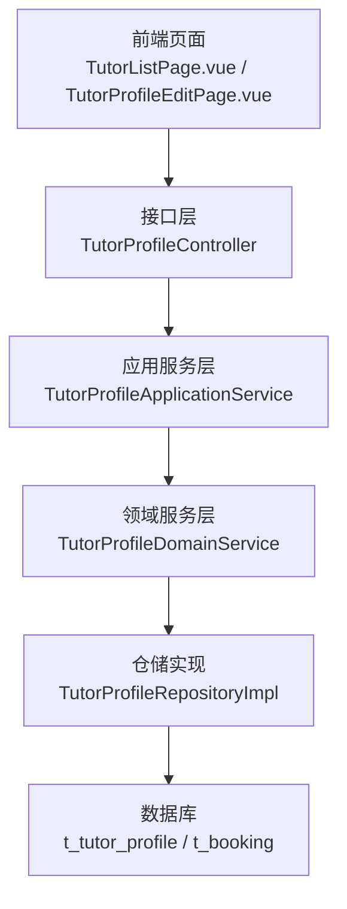
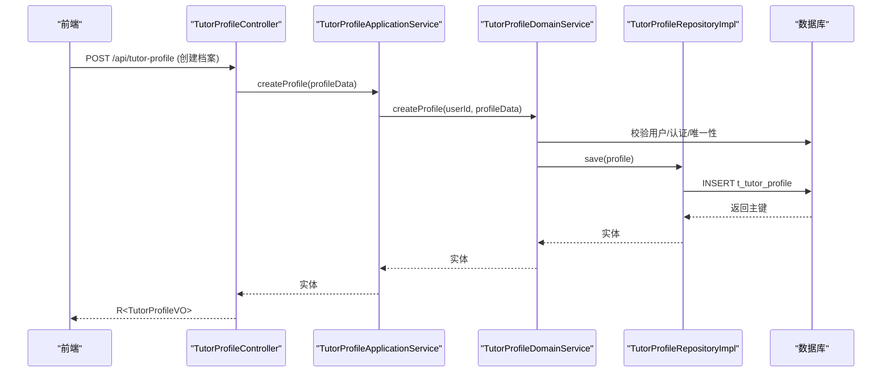
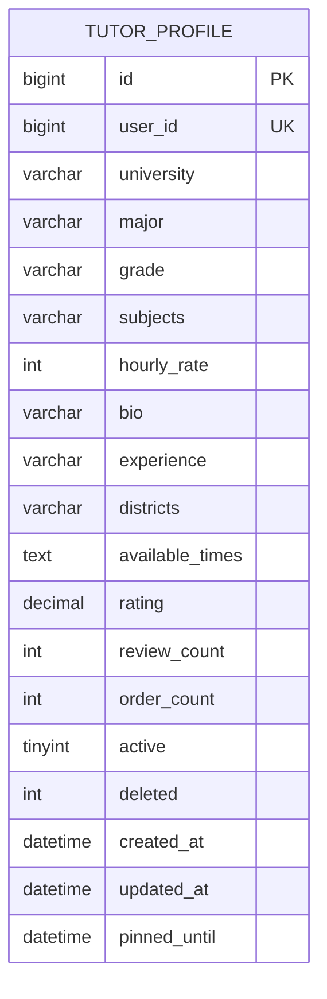
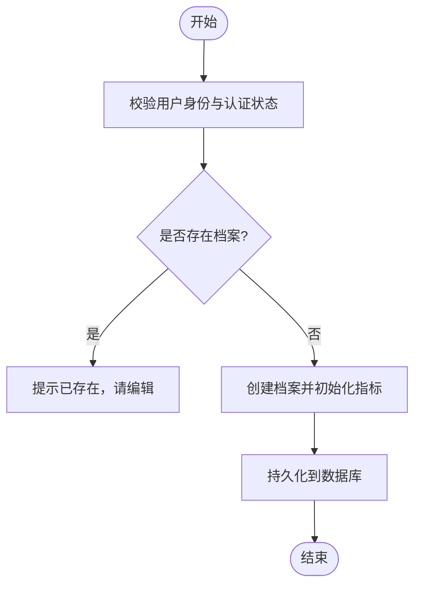
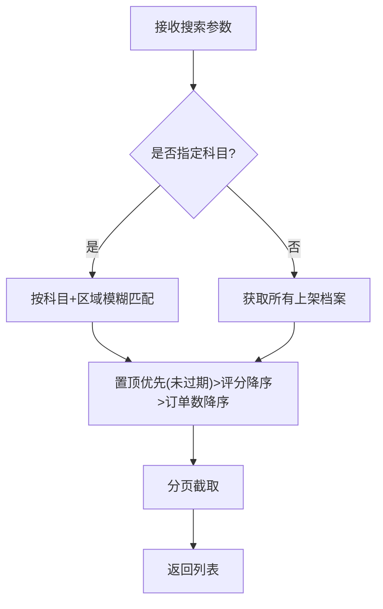
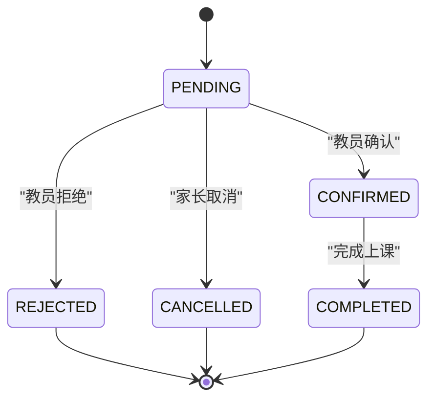
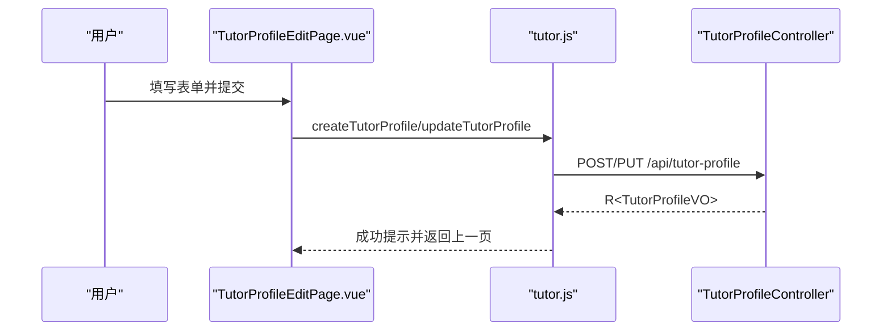
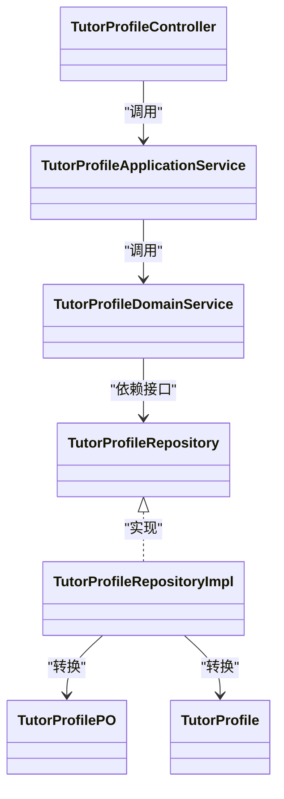

# 教员管理

<cite>
**本文引用的文件**
- [wzoto-backend/wzoto-domain/src/main/java/com/wzoto/domain/entity/TutorProfile.java](file://wzoto-backend/wzoto-domain/src/main/java/com/wzoto/domain/entity/TutorProfile.java)
- [wzoto-backend/wzoto-application/src/main/java/com/wzoto/application/service/TutorProfileApplicationService.java](file://wzoto-backend/wzoto-application/src/main/java/com/wzoto/application/service/TutorProfileApplicationService.java)
- [wzoto-backend/wzoto-domain/src/main/java/com/wzoto/domain/service/TutorProfileDomainService.java](file://wzoto-backend/wzoto-domain/src/main/java/com/wzoto/domain/service/TutorProfileDomainService.java)
- [wzoto-backend/wzoto-infrastructure/src/main/java/com/wzoto/infrastructure/repository/TutorProfileRepositoryImpl.java](file://wzoto-backend/wzoto-infrastructure/src/main/java/com/wzoto/infrastructure/repository/TutorProfileRepositoryImpl.java)
- [wzoto-backend/wzoto-interfaces/src/main/java/com/wzoto/interfaces/controller/TutorProfileController.java](file://wzoto-backend/wzoto-interfaces/src/main/java/com/wzoto/interfaces/controller/TutorProfileController.java)
- [wzoto-backend/wzoto-interfaces/src/main/java/com/wzoto/interfaces/dto/profile/TutorProfileCreateDTO.java](file://wzoto-backend/wzoto-interfaces/src/main/java/com/wzoto/interfaces/dto/profile/TutorProfileCreateDTO.java)
- [wzoto-backend/wzoto-interfaces/src/main/java/com/wzoto/interfaces/vo/profile/TutorProfileVO.java](file://wzoto-backend/wzoto-interfaces/src/main/java/com/wzoto/interfaces/vo/profile/TutorProfileVO.java)
- [wzoto-backend/sql/t_tutor_profile.sql](file://wzoto-backend/sql/t_tutor_profile.sql)
- [wzoto-backend/sql/t_booking.sql](file://wzoto-backend/sql/t_booking.sql)
- [wzoto-backend/wzoto-interfaces/src/main/java/com/wzoto/interfaces/dto/booking/CreateBookingDTO.java](file://wzoto-backend/wzoto-interfaces/src/main/java/com/wzoto/interfaces/dto/booking/CreateBookingDTO.java)
- [wzoto-backend/wzoto-interfaces/src/main/java/com/wzoto/interfaces/vo/booking/BookingVO.java](file://wzoto-backend/wzoto-interfaces/src/main/java/com/wzoto/interfaces/vo/booking/BookingVO.java)
- [wzoto-backend/wzoto-domain/src/main/java/com/wzoto/domain/service/BookingDomainService.java](file://wzoto-backend/wzoto-domain/src/main/java/com/wzoto/domain/service/BookingDomainService.java)
- [wzoto-frontend/src/api/tutor.js](file://wzoto-frontend/src/api/tutor.js)
- [wzoto-frontend/src/pages/profile/TutorListPage.vue](file://wzoto-frontend/src/pages/profile/TutorListPage.vue)
- [wzoto-frontend/src/pages/profile/TutorProfileEditPage.vue](file://wzoto-frontend/src/pages/profile/TutorProfileEditPage.vue)
</cite>

## 目录
1. [简介](#简介)
2. [项目结构](#项目结构)
3. [核心组件](#核心组件)
4. [架构总览](#架构总览)
5. [详细组件分析](#详细组件分析)
6. [依赖关系分析](#依赖关系分析)
7. [性能考量](#性能考量)
8. [故障排查指南](#故障排查指南)
9. [结论](#结论)
10. [附录：数据模型与API文档](#附录数据模型与api文档)

## 简介
本文件面向wzoto系统的“教员管理”模块，围绕以下目标展开：
- 教员档案管理：基本信息维护、教学科目设置、教学经验记录、资质证书管理（字段预留）
- 技能标签体系：学科分类、年级适配、教学方法标签、评价维度（设计建议）
- 评价系统机制：家长评分算法、评论管理、信誉等级计算（现状与扩展建议）
- 教员搜索与筛选：基于地理位置、学科专长、评价等级的智能匹配
- 教员状态管理：在线状态、可预约时间、授课历史统计（现状与扩展建议）
- 完整的数据模型与API接口文档
- 前端集成示例与页面优化建议

## 项目结构
后端采用分层架构：接口层（Controller）、应用服务层（Application Service）、领域服务层（Domain Service）、基础设施层（Repository/Mapper/PO），以及SQL脚本定义数据表。前端使用Vue + Element Plus，提供教员档案编辑与列表页。

图表来源
- [wzoto-backend/wzoto-interfaces/src/main/java/com/wzoto/interfaces/controller/TutorProfileController.java:20-89](file://wzoto-backend/wzoto-interfaces/src/main/java/com/wzoto/interfaces/controller/TutorProfileController.java#L20-L89)
- [wzoto-backend/wzoto-application/src/main/java/com/wzoto/application/service/TutorProfileApplicationService.java:15-46](file://wzoto-backend/wzoto-application/src/main/java/com/wzoto/application/service/TutorProfileApplicationService.java#L15-L46)
- [wzoto-backend/wzoto-domain/src/main/java/com/wzoto/domain/service/TutorProfileDomainService.java:18-96](file://wzoto-backend/wzoto-domain/src/main/java/com/wzoto/domain/service/TutorProfileDomainService.java#L18-L96)
- [wzoto-backend/wzoto-infrastructure/src/main/java/com/wzoto/infrastructure/repository/TutorProfileRepositoryImpl.java:15-76](file://wzoto-backend/wzoto-infrastructure/src/main/java/com/wzoto/infrastructure/repository/TutorProfileRepositoryImpl.java#L15-L76)
- [wzoto-backend/sql/t_tutor_profile.sql:1-24](file://wzoto-backend/sql/t_tutor_profile.sql#L1-L24)
- [wzoto-backend/sql/t_booking.sql:1-23](file://wzoto-backend/sql/t_booking.sql#L1-L23)

章节来源
- [wzoto-backend/wzoto-interfaces/src/main/java/com/wzoto/interfaces/controller/TutorProfileController.java:20-89](file://wzoto-backend/wzoto-interfaces/src/main/java/com/wzoto/interfaces/controller/TutorProfileController.java#L20-L89)
- [wzoto-backend/wzoto-application/src/main/java/com/wzoto/application/service/TutorProfileApplicationService.java:15-46](file://wzoto-backend/wzoto-application/src/main/java/com/wzoto/application/service/TutorProfileApplicationService.java#L15-L46)
- [wzoto-backend/wzoto-domain/src/main/java/com/wzoto/domain/service/TutorProfileDomainService.java:18-96](file://wzoto-backend/wzoto-domain/src/main/java/com/wzoto/domain/service/TutorProfileDomainService.java#L18-L96)
- [wzoto-backend/wzoto-infrastructure/src/main/java/com/wzoto/infrastructure/repository/TutorProfileRepositoryImpl.java:15-76](file://wzoto-backend/wzoto-infrastructure/src/main/java/com/wzoto/infrastructure/repository/TutorProfileRepositoryImpl.java#L15-L76)
- [wzoto-backend/sql/t_tutor_profile.sql:1-24](file://wzoto-backend/sql/t_tutor_profile.sql#L1-L24)
- [wzoto-backend/sql/t_booking.sql:1-23](file://wzoto-backend/sql/t_booking.sql#L1-L23)

## 核心组件
- 实体与值对象
  - 教员档案实体：包含学校、专业、年级、科目、时薪、简介、经验、区域、可用时段、评分、评价数、订单数、上架状态、置顶到期时间等
  - 预约实体：家长、教员、科目、日期、时间段、地址、留言、状态、回复等
- 应用服务
  - 创建/更新/切换上架/查询我的档案/搜索教员/按ID查询
- 领域服务
  - 校验身份与认证状态、唯一性检查、业务规则封装
- 仓储实现
  - 按科目+区域模糊匹配、分页排序（置顶优先、评分降序、订单数降序）
- 控制器
  - RESTful接口：创建、更新、切换上架、获取我的、搜索、按ID获取
- 前端
  - 档案编辑页：表单校验、保存/更新、上架/下架
  - 教员列表页：科目搜索、区域筛选、分页加载

章节来源
- [wzoto-backend/wzoto-domain/src/main/java/com/wzoto/domain/entity/TutorProfile.java:12-106](file://wzoto-backend/wzoto-domain/src/main/java/com/wzoto/domain/entity/TutorProfile.java#L12-L106)
- [wzoto-backend/wzoto-application/src/main/java/com/wzoto/application/service/TutorProfileApplicationService.java:15-46](file://wzoto-backend/wzoto-application/src/main/java/com/wzoto/application/service/TutorProfileApplicationService.java#L15-L46)
- [wzoto-backend/wzoto-domain/src/main/java/com/wzoto/domain/service/TutorProfileDomainService.java:18-96](file://wzoto-backend/wzoto-domain/src/main/java/com/wzoto/domain/service/TutorProfileDomainService.java#L18-L96)
- [wzoto-backend/wzoto-infrastructure/src/main/java/com/wzoto/infrastructure/repository/TutorProfileRepositoryImpl.java:50-76](file://wzoto-backend/wzoto-infrastructure/src/main/java/com/wzoto/infrastructure/repository/TutorProfileRepositoryImpl.java#L50-L76)
- [wzoto-backend/wzoto-interfaces/src/main/java/com/wzoto/interfaces/controller/TutorProfileController.java:20-89](file://wzoto-backend/wzoto-interfaces/src/main/java/com/wzoto/interfaces/controller/TutorProfileController.java#L20-L89)
- [wzoto-frontend/src/pages/profile/TutorProfileEditPage.vue:1-179](file://wzoto-frontend/src/pages/profile/TutorProfileEditPage.vue#L1-L179)
- [wzoto-frontend/src/pages/profile/TutorListPage.vue:1-136](file://wzoto-frontend/src/pages/profile/TutorListPage.vue#L1-L136)

## 架构总览
教员管理模块遵循清晰的分层职责：
- 接口层负责参数校验、请求路由、响应封装
- 应用层协调领域服务，注入当前用户上下文
- 领域层承载业务规则（身份校验、唯一性、状态切换）
- 基础设施层负责持久化与查询策略（含排序、分页）

图表来源
- [wzoto-backend/wzoto-interfaces/src/main/java/com/wzoto/interfaces/controller/TutorProfileController.java:29-44](file://wzoto-backend/wzoto-interfaces/src/main/java/com/wzoto/interfaces/controller/TutorProfileController.java#L29-L44)
- [wzoto-backend/wzoto-application/src/main/java/com/wzoto/application/service/TutorProfileApplicationService.java:19-22](file://wzoto-backend/wzoto-application/src/main/java/com/wzoto/application/service/TutorProfileApplicationService.java#L19-L22)
- [wzoto-backend/wzoto-domain/src/main/java/com/wzoto/domain/service/TutorProfileDomainService.java:30-54](file://wzoto-backend/wzoto-domain/src/main/java/com/wzoto/domain/service/TutorProfileDomainService.java#L30-L54)
- [wzoto-backend/wzoto-infrastructure/src/main/java/com/wzoto/infrastructure/repository/TutorProfileRepositoryImpl.java:21-27](file://wzoto-backend/wzoto-infrastructure/src/main/java/com/wzoto/infrastructure/repository/TutorProfileRepositoryImpl.java#L21-L27)
- [wzoto-backend/sql/t_tutor_profile.sql:1-24](file://wzoto-backend/sql/t_tutor_profile.sql#L1-L24)

## 详细组件分析

### 教员档案实体与数据模型
- 关键字段
  - 基本信息：学校、专业、年级
  - 教学信息：科目（逗号分隔）、时薪、简介、经验、区域（逗号分隔）、可用时段（JSON）
  - 信誉指标：评分、评价数量、完成订单数
  - 运营状态：是否上架、置顶到期时间
- 索引与约束
  - user_id唯一索引
  - active+rating复合索引
  - subjects前缀索引
  - 逻辑删除字段deleted

图表来源
- [wzoto-backend/sql/t_tutor_profile.sql:1-24](file://wzoto-backend/sql/t_tutor_profile.sql#L1-L24)

章节来源
- [wzoto-backend/wzoto-domain/src/main/java/com/wzoto/domain/entity/TutorProfile.java:12-106](file://wzoto-backend/wzoto-domain/src/main/java/com/wzoto/domain/entity/TutorProfile.java#L12-L106)
- [wzoto-backend/sql/t_tutor_profile.sql:1-24](file://wzoto-backend/sql/t_tutor_profile.sql#L1-L24)

### 申请与编辑流程
- 创建档案
  - 仅认证通过的大学生可创建
  - 同一用户仅允许一个档案
  - 默认active=true，rating=0，reviewCount=0，orderCount=0
- 更新档案
  - 支持部分字段更新
- 上架/下架
  - 切换active状态

图表来源
- [wzoto-backend/wzoto-domain/src/main/java/com/wzoto/domain/service/TutorProfileDomainService.java:30-54](file://wzoto-backend/wzoto-domain/src/main/java/com/wzoto/domain/service/TutorProfileDomainService.java#L30-L54)
- [wzoto-backend/wzoto-domain/src/main/java/com/wzoto/domain/entity/TutorProfile.java:67-76](file://wzoto-backend/wzoto-domain/src/main/java/com/wzoto/domain/entity/TutorProfile.java#L67-L76)

章节来源
- [wzoto-backend/wzoto-domain/src/main/java/com/wzoto/domain/service/TutorProfileDomainService.java:30-54](file://wzoto-backend/wzoto-domain/src/main/java/com/wzoto/domain/service/TutorProfileDomainService.java#L30-L54)
- [wzoto-backend/wzoto-domain/src/main/java/com/wzoto/domain/entity/TutorProfile.java:67-76](file://wzoto-backend/wzoto-domain/src/main/java/com/wzoto/domain/entity/TutorProfile.java#L67-L76)

### 搜索与筛选
- 支持按科目模糊匹配与区域模糊匹配
- 默认排序：置顶优先（未过期置顶）> 评分降序 > 订单数降序
- 分页：page、size

图表来源
- [wzoto-backend/wzoto-domain/src/main/java/com/wzoto/domain/service/TutorProfileDomainService.java:90-95](file://wzoto-backend/wzoto-domain/src/main/java/com/wzoto/domain/service/TutorProfileDomainService.java#L90-L95)
- [wzoto-backend/wzoto-infrastructure/src/main/java/com/wzoto/infrastructure/repository/TutorProfileRepositoryImpl.java:50-76](file://wzoto-backend/wzoto-infrastructure/src/main/java/com/wzoto/infrastructure/repository/TutorProfileRepositoryImpl.java#L50-L76)

章节来源
- [wzoto-backend/wzoto-domain/src/main/java/com/wzoto/domain/service/TutorProfileDomainService.java:90-95](file://wzoto-backend/wzoto-domain/src/main/java/com/wzoto/domain/service/TutorProfileDomainService.java#L90-L95)
- [wzoto-backend/wzoto-infrastructure/src/main/java/com/wzoto/infrastructure/repository/TutorProfileRepositoryImpl.java:50-76](file://wzoto-backend/wzoto-infrastructure/src/main/java/com/wzoto/infrastructure/repository/TutorProfileRepositoryImpl.java#L50-L76)

### 预约与状态管理
- 预约模型
  - 家长、教员、科目、日期、起止时间、地址、留言、状态、回复
- 状态流转
  - PENDING -> CONFIRMED/REJECTED/CANCELLED -> COMPLETED
- 授课历史统计
  - 通过订单数与完成态预约统计

图表来源
- [wzoto-backend/sql/t_booking.sql:1-23](file://wzoto-backend/sql/t_booking.sql#L1-L23)
- [wzoto-backend/wzoto-domain/src/main/java/com/wzoto/domain/service/BookingDomainService.java:71-114](file://wzoto-backend/wzoto-domain/src/main/java/com/wzoto/domain/service/BookingDomainService.java#L71-L114)

章节来源
- [wzoto-backend/sql/t_booking.sql:1-23](file://wzoto-backend/sql/t_booking.sql#L1-L23)
- [wzoto-backend/wzoto-domain/src/main/java/com/wzoto/domain/service/BookingDomainService.java:71-114](file://wzoto-backend/wzoto-domain/src/main/java/com/wzoto/domain/service/BookingDomainService.java#L71-L114)

### 前端集成示例
- 档案编辑页
  - 表单字段：学校、专业、年级、科目、时薪、简介、经验、区域
  - 操作：创建/更新、上架/下架
- 教员列表页
  - 搜索：科目、区域
  - 展示：头像、昵称、科目、评分、订单数、是否置顶
  - 交互：点击跳转详情

图表来源
- [wzoto-frontend/src/pages/profile/TutorProfileEditPage.vue:1-179](file://wzoto-frontend/src/pages/profile/TutorProfileEditPage.vue#L1-L179)
- [wzoto-frontend/src/api/tutor.js:1-25](file://wzoto-frontend/src/api/tutor.js#L1-L25)
- [wzoto-backend/wzoto-interfaces/src/main/java/com/wzoto/interfaces/controller/TutorProfileController.java:29-60](file://wzoto-backend/wzoto-interfaces/src/main/java/com/wzoto/interfaces/controller/TutorProfileController.java#L29-L60)

章节来源
- [wzoto-frontend/src/pages/profile/TutorProfileEditPage.vue:1-179](file://wzoto-frontend/src/pages/profile/TutorProfileEditPage.vue#L1-L179)
- [wzoto-frontend/src/api/tutor.js:1-25](file://wzoto-frontend/src/api/tutor.js#L1-L25)
- [wzoto-backend/wzoto-interfaces/src/main/java/com/wzoto/interfaces/controller/TutorProfileController.java:29-60](file://wzoto-backend/wzoto-interfaces/src/main/java/com/wzoto/interfaces/controller/TutorProfileController.java#L29-L60)

## 依赖关系分析
- Controller依赖ApplicationService进行业务编排
- ApplicationService依赖DomainService执行领域规则
- DomainService依赖Repository接口，由Infrastructure实现具体查询与持久化
- RepositoryImpl依赖Mapper与PO映射，最终访问数据库表

图表来源
- [wzoto-backend/wzoto-interfaces/src/main/java/com/wzoto/interfaces/controller/TutorProfileController.java:20-89](file://wzoto-backend/wzoto-interfaces/src/main/java/com/wzoto/interfaces/controller/TutorProfileController.java#L20-L89)
- [wzoto-backend/wzoto-application/src/main/java/com/wzoto/application/service/TutorProfileApplicationService.java:15-46](file://wzoto-backend/wzoto-application/src/main/java/com/wzoto/application/service/TutorProfileApplicationService.java#L15-L46)
- [wzoto-backend/wzoto-domain/src/main/java/com/wzoto/domain/service/TutorProfileDomainService.java:18-96](file://wzoto-backend/wzoto-domain/src/main/java/com/wzoto/domain/service/TutorProfileDomainService.java#L18-L96)
- [wzoto-backend/wzoto-infrastructure/src/main/java/com/wzoto/infrastructure/repository/TutorProfileRepositoryImpl.java:15-76](file://wzoto-backend/wzoto-infrastructure/src/main/java/com/wzoto/infrastructure/repository/TutorProfileRepositoryImpl.java#L15-L76)

章节来源
- [wzoto-backend/wzoto-interfaces/src/main/java/com/wzoto/interfaces/controller/TutorProfileController.java:20-89](file://wzoto-backend/wzoto-interfaces/src/main/java/com/wzoto/interfaces/controller/TutorProfileController.java#L20-L89)
- [wzoto-backend/wzoto-application/src/main/java/com/wzoto/application/service/TutorProfileApplicationService.java:15-46](file://wzoto-backend/wzoto-application/src/main/java/com/wzoto/application/service/TutorProfileApplicationService.java#L15-L46)
- [wzoto-backend/wzoto-domain/src/main/java/com/wzoto/domain/service/TutorProfileDomainService.java:18-96](file://wzoto-backend/wzoto-domain/src/main/java/com/wzoto/domain/service/TutorProfileDomainService.java#L18-L96)
- [wzoto-backend/wzoto-infrastructure/src/main/java/com/wzoto/infrastructure/repository/TutorProfileRepositoryImpl.java:15-76](file://wzoto-backend/wzoto-infrastructure/src/main/java/com/wzoto/infrastructure/repository/TutorProfileRepositoryImpl.java#L15-L76)

## 性能考量
- 查询优化
  - 使用subjects前缀索引提升模糊匹配效率
  - 使用active+rating复合索引加速热门列表排序
- 排序策略
  - 置顶优先（pinned_until未过期）> 评分降序 > 订单数降序，减少全表扫描
- 分页限制
  - 通过page与size控制返回量，避免大结果集
- 可扩展点
  - 引入缓存层（如Redis）缓存热门教员列表
  - 对availableTimes的解析与可用性判断可在服务端或前端进行，建议结合预约冲突检测

[本节为通用性能建议，不直接分析具体文件]

## 故障排查指南
- 创建失败
  - 非大学生或未完成实名认证：领域服务会抛出异常
  - 已存在档案：提示直接编辑
- 更新失败
  - 档案不存在：抛出异常
- 搜索无结果
  - 检查科目与区域参数是否正确
  - 确认档案是否上架
- 预约问题
  - 状态校验：PENDING/CONFIRMED/COMPLETED/CANCELLED/REJECTED
  - 时间冲突：需在前端或服务端校验可用时段

章节来源
- [wzoto-backend/wzoto-domain/src/main/java/com/wzoto/domain/service/TutorProfileDomainService.java:30-78](file://wzoto-backend/wzoto-domain/src/main/java/com/wzoto/domain/service/TutorProfileDomainService.java#L30-L78)
- [wzoto-backend/wzoto-domain/src/main/java/com/wzoto/domain/service/BookingDomainService.java:71-114](file://wzoto-backend/wzoto-domain/src/main/java/com/wzoto/domain/service/BookingDomainService.java#L71-L114)

## 结论
wzoto教员管理模块以清晰的层次化设计与稳健的业务规则为基础，实现了档案创建、编辑、搜索与预约等核心能力。当前版本在评分与评价方面提供了基础字段与排序策略，后续可在此基础上完善家长评分算法、评论管理与信誉等级计算，并增强在线状态与可预约时间的管理能力。

[本节为总结性内容，不直接分析具体文件]

## 附录：数据模型与API文档

### 数据模型
- 教员档案表
  - 字段：id、user_id、university、major、grade、subjects、hourly_rate、bio、experience、districts、available_times、rating、review_count、order_count、active、deleted、created_at、updated_at、pinned_until
  - 索引：user_id唯一、active+rating复合、subjects前缀
- 预约表
  - 字段：id、parent_id、tutor_id、tutor_profile_id、subject、booking_date、start_time、end_time、address、message、status、reply、deleted、created_at、updated_at
  - 索引：parent_id、tutor_id、status、booking_date、tutor_id+status

章节来源
- [wzoto-backend/sql/t_tutor_profile.sql:1-24](file://wzoto-backend/sql/t_tutor_profile.sql#L1-L24)
- [wzoto-backend/sql/t_booking.sql:1-23](file://wzoto-backend/sql/t_booking.sql#L1-L23)

### API接口
- 教员档案
  - POST /api/tutor-profile：创建档案（需要认证通过的大学生）
  - PUT /api/tutor-profile：更新档案
  - POST /api/tutor-profile/toggle-active：切换上架/下架
  - GET /api/tutor-profile/mine：获取我的档案
  - GET /api/tutor-profile/search：搜索档案（subject、district、page、size）
  - GET /api/tutor-profile/{id}：按ID获取档案
- 预约
  - 创建预约：CreateBookingDTO（tutorProfileId、subject、bookingDate、startTime、endTime、address、message）
  - 预约状态：PENDING/CONFIRMED/COMPLETED/CANCELLED/REJECTED
  - 查询：按家长或教员ID查询预约历史

章节来源
- [wzoto-backend/wzoto-interfaces/src/main/java/com/wzoto/interfaces/controller/TutorProfileController.java:29-89](file://wzoto-backend/wzoto-interfaces/src/main/java/com/wzoto/interfaces/controller/TutorProfileController.java#L29-L89)
- [wzoto-backend/wzoto-interfaces/src/main/java/com/wzoto/interfaces/dto/booking/CreateBookingDTO.java:1-30](file://wzoto-backend/wzoto-interfaces/src/main/java/com/wzoto/interfaces/dto/booking/CreateBookingDTO.java#L1-L30)
- [wzoto-backend/wzoto-interfaces/src/main/java/com/wzoto/interfaces/vo/booking/BookingVO.java:1-30](file://wzoto-backend/wzoto-interfaces/src/main/java/com/wzoto/interfaces/vo/booking/BookingVO.java#L1-L30)
- [wzoto-backend/wzoto-domain/src/main/java/com/wzoto/domain/service/BookingDomainService.java:71-114](file://wzoto-backend/wzoto-domain/src/main/java/com/wzoto/domain/service/BookingDomainService.java#L71-L114)

### 技能标签体系（设计建议）
- 学科分类：基于subjects字段，建议标准化枚举（如小学数学、初中数学、高中物理等）
- 年级适配：grade字段用于标识教员所处年级，可结合学生年级进行匹配
- 教学方法标签：建议在档案中增加方法标签（如“启发式”“题海战术”“一对一辅导”），便于精准匹配
- 评价维度：建议在评价表中细化维度（耐心、讲解清晰度、准时、负责等），支撑多维评分

[本节为概念性设计建议，不直接分析具体文件]

### 评价系统机制（现状与扩展建议）
- 现状
  - 档案包含rating、review_count、order_count字段，搜索排序依据rating与order_count
- 扩展建议
  - 家长评分算法：加权平均（近期权重更高），剔除异常值
  - 评论管理：新增评论表，支持标签、图片、匿名
  - 信誉等级计算：综合评分、订单完成率、投诉率、活跃度等维度生成等级（如S/A/B/C）

[本节为概念性扩展建议，不直接分析具体文件]

### 前端集成示例与优化建议
- 集成示例
  - 使用tutor.js中的函数调用后端接口
  - 列表页支持科目与区域筛选，分页加载
- 优化建议
  - 列表页增加“评分”“订单数”排序选项
  - 详情页展示“过往评价”与“可预约时段”
  - 增加“收藏教员”“消息通知”功能

章节来源
- [wzoto-frontend/src/api/tutor.js:1-25](file://wzoto-frontend/src/api/tutor.js#L1-L25)
- [wzoto-frontend/src/pages/profile/TutorListPage.vue:1-136](file://wzoto-frontend/src/pages/profile/TutorListPage.vue#L1-L136)
- [wzoto-frontend/src/pages/profile/TutorProfileEditPage.vue:1-179](file://wzoto-frontend/src/pages/profile/TutorProfileEditPage.vue#L1-L179)