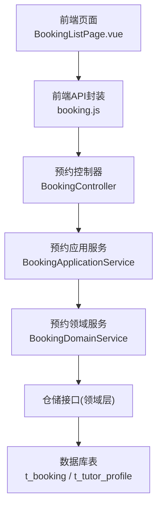
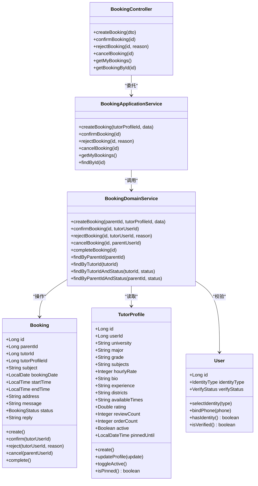
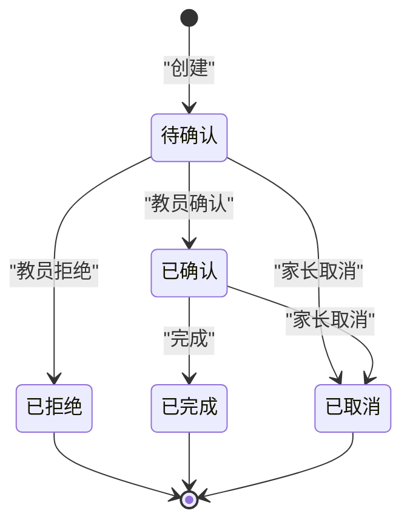
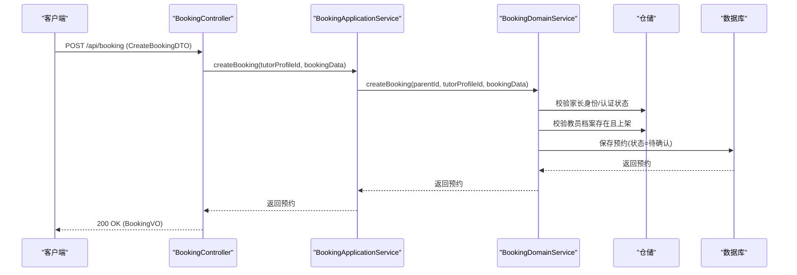
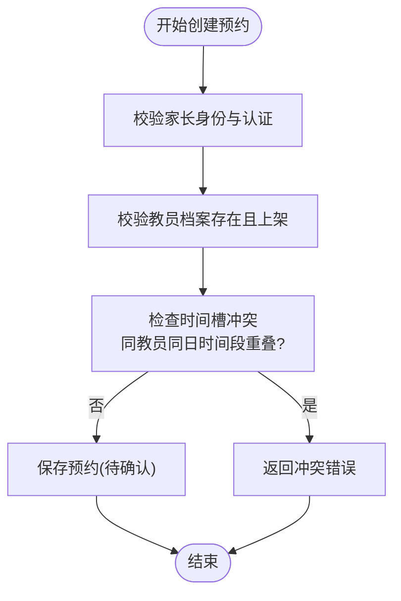
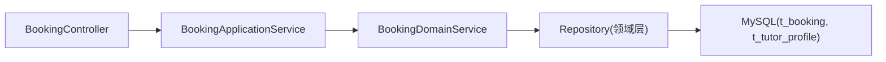
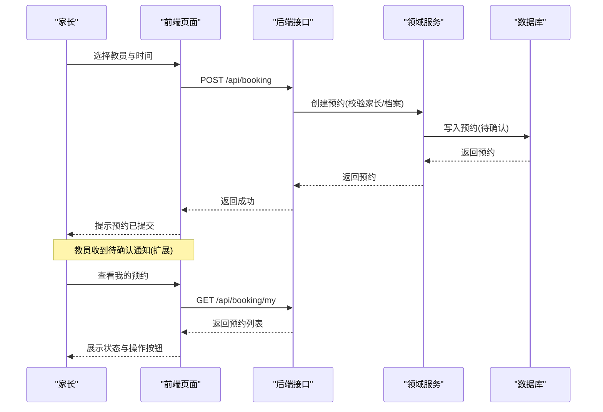

# 预约管理系统

<cite>
**本文引用的文件**
- [wzoto-backend/wzoto-domain/src/main/java/com/wzoto/domain/entity/Booking.java](file://wzoto-backend/wzoto-domain/src/main/java/com/wzoto/domain/entity/Booking.java)
- [wzoto-backend/wzoto-domain/src/main/java/com/wzoto/domain/entity/TutorProfile.java](file://wzoto-backend/wzoto-domain/src/main/java/com/wzoto/domain/entity/TutorProfile.java)
- [wzoto-backend/wzoto-domain/src/main/java/com/wzoto/domain/entity/User.java](file://wzoto-backend/wzoto-domain/src/main/java/com/wzoto/domain/entity/User.java)
- [wzoto-backend/wzoto-domain/src/main/java/com/wzoto/domain/service/BookingDomainService.java](file://wzoto-backend/wzoto-domain/src/main/java/com/wzoto/domain/service/BookingDomainService.java)
- [wzoto-backend/wzoto-application/src/main/java/com/wzoto/application/service/BookingApplicationService.java](file://wzoto-backend/wzoto-application/src/main/java/com/wzoto/application/service/BookingApplicationService.java)
- [wzoto-backend/wzoto-interfaces/src/main/java/com/wzoto/interfaces/controller/BookingController.java](file://wzoto-backend/wzoto-interfaces/src/main/java/com/wzoto/interfaces/controller/BookingController.java)
- [wzoto-backend/wzoto-interfaces/src/main/java/com/wzoto/interfaces/dto/booking/CreateBookingDTO.java](file://wzoto-backend/wzoto-interfaces/src/main/java/com/wzoto/interfaces/dto/booking/CreateBookingDTO.java)
- [wzoto-backend/wzoto-interfaces/src/main/java/com/wzoto/interfaces/vo/booking/BookingVO.java](file://wzoto-backend/wzoto-interfaces/src/main/java/com/wzoto/interfaces/vo/booking/BookingVO.java)
- [wzoto-backend/wzoto-domain/src/main/java/com/wzoto/domain/valobj/BookingStatus.java](file://wzoto-backend/wzoto-domain/src/main/java/com/wzoto/domain/valobj/BookingStatus.java)
- [wzoto-backend/sql/t_booking.sql](file://wzoto-backend/sql/t_booking.sql)
- [wzoto-backend/sql/t_tutor_profile.sql](file://wzoto-backend/sql/t_tutor_profile.sql)
- [wzoto-frontend/src/api/booking.js](file://wzoto-frontend/src/api/booking.js)
- [wzoto-frontend/src/pages/booking/BookingListPage.vue](file://wzoto-frontend/src/pages/booking/BookingListPage.vue)
</cite>

## 目录
1. [简介](#简介)
2. [项目结构](#项目结构)
3. [核心组件](#核心组件)
4. [架构总览](#架构总览)
5. [详细组件分析](#详细组件分析)
6. [依赖关系分析](#依赖关系分析)
7. [性能与扩展建议](#性能与扩展建议)
8. [故障排查指南](#故障排查指南)
9. [结论](#结论)
10. [附录：API 接口文档与前端集成示例](#附录api-接口文档与前端集成示例)

## 简介
本系统为 wzoto 预约管理子系统，聚焦“家长发起预约—教员确认/拒绝—完成/取消”的完整业务流程。系统采用分层架构（接口层、应用层、领域层、基础设施层），通过明确的实体、值对象与服务边界，保障业务规则内聚与可维护性。当前实现覆盖：
- 教员档案管理（档案字段、上下架、评分与订单统计）
- 在线预约功能（时间槽、状态流转、基础冲突校验）
- 课程安排机制（固定时段、灵活预约、重复课程可扩展）
- 通知提醒（预留扩展点）
- 教员匹配（基于科目、区域、评分等维度的检索能力）

## 项目结构
后端采用 DDD 分层：
- 接口层：REST 控制器、DTO/VO 定义
- 应用层：编排用例、上下文注入
- 领域层：实体、值对象、领域服务、仓储接口
- 基础设施层：MyBatis Mapper、配置、工具类

前端采用 Vue + Element Plus，提供预约列表、操作按钮与提示交互。

图表来源
- [wzoto-frontend/src/pages/booking/BookingListPage.vue:1-128](file://wzoto-frontend/src/pages/booking/BookingListPage.vue#L1-L128)
- [wzoto-frontend/src/api/booking.js:1-25](file://wzoto-frontend/src/api/booking.js#L1-L25)
- [wzoto-backend/wzoto-interfaces/src/main/java/com/wzoto/interfaces/controller/BookingController.java:1-96](file://wzoto-backend/wzoto-interfaces/src/main/java/com/wzoto/interfaces/controller/BookingController.java#L1-L96)
- [wzoto-backend/wzoto-application/src/main/java/com/wzoto/application/service/BookingApplicationService.java:1-53](file://wzoto-backend/wzoto-application/src/main/java/com/wzoto/application/service/BookingApplicationService.java#L1-L53)
- [wzoto-backend/wzoto-domain/src/main/java/com/wzoto/domain/service/BookingDomainService.java:1-122](file://wzoto-backend/wzoto-domain/src/main/java/com/wzoto/domain/service/BookingDomainService.java#L1-L122)
- [wzoto-backend/sql/t_booking.sql:1-23](file://wzoto-backend/sql/t_booking.sql#L1-L23)
- [wzoto-backend/sql/t_tutor_profile.sql:1-24](file://wzoto-backend/sql/t_tutor_profile.sql#L1-L24)

章节来源
- [wzoto-backend/wzoto-interfaces/src/main/java/com/wzoto/interfaces/controller/BookingController.java:1-96](file://wzoto-backend/wzoto-interfaces/src/main/java/com/wzoto/interfaces/controller/BookingController.java#L1-L96)
- [wzoto-backend/wzoto-application/src/main/java/com/wzoto/application/service/BookingApplicationService.java:1-53](file://wzoto-backend/wzoto-application/src/main/java/com/wzoto/application/service/BookingApplicationService.java#L1-L53)
- [wzoto-backend/wzoto-domain/src/main/java/com/wzoto/domain/service/BookingDomainService.java:1-122](file://wzoto-backend/wzoto-domain/src/main/java/com/wzoto/domain/service/BookingDomainService.java#L1-L122)
- [wzoto-backend/sql/t_booking.sql:1-23](file://wzoto-backend/sql/t_booking.sql#L1-L23)
- [wzoto-backend/sql/t_tutor_profile.sql:1-24](file://wzoto-backend/sql/t_tutor_profile.sql#L1-L24)

## 核心组件
- 预约实体 Booking：承载预约单信息，内置状态机方法（创建、确认、拒绝、取消、完成）。
- 教员档案 TutorProfile：大学生教学档案，包含科目、区域、可用时段、评分、上下架等。
- 用户 User：身份类型与家长认证状态，作为预约前置校验依据。
- 预约领域服务 BookingDomainService：聚合业务规则，协调仓储完成预约生命周期。
- 预约应用服务 BookingApplicationService：用例编排，注入当前用户上下文。
- 预约控制器 BookingController：对外暴露 REST 接口，负责参数校验与响应转换。

章节来源
- [wzoto-backend/wzoto-domain/src/main/java/com/wzoto/domain/entity/Booking.java:1-114](file://wzoto-backend/wzoto-domain/src/main/java/com/wzoto/domain/entity/Booking.java#L1-L114)
- [wzoto-backend/wzoto-domain/src/main/java/com/wzoto/domain/entity/TutorProfile.java:1-106](file://wzoto-backend/wzoto-domain/src/main/java/com/wzoto/domain/entity/TutorProfile.java#L1-L106)
- [wzoto-backend/wzoto-domain/src/main/java/com/wzoto/domain/entity/User.java:1-93](file://wzoto-backend/wzoto-domain/src/main/java/com/wzoto/domain/entity/User.java#L1-L93)
- [wzoto-backend/wzoto-domain/src/main/java/com/wzoto/domain/service/BookingDomainService.java:1-122](file://wzoto-backend/wzoto-domain/src/main/java/com/wzoto/domain/service/BookingDomainService.java#L1-L122)
- [wzoto-backend/wzoto-application/src/main/java/com/wzoto/application/service/BookingApplicationService.java:1-53](file://wzoto-backend/wzoto-application/src/main/java/com/wzoto/application/service/BookingApplicationService.java#L1-L53)
- [wzoto-backend/wzoto-interfaces/src/main/java/com/wzoto/interfaces/controller/BookingController.java:1-96](file://wzoto-backend/wzoto-interfaces/src/main/java/com/wzoto/interfaces/controller/BookingController.java#L1-L96)

## 架构总览
系统遵循清晰的分层与职责分离：
- 接口层仅做入参校验与出参映射，不承载业务逻辑。
- 应用层组织用例流程，注入用户上下文并调用领域服务。
- 领域层集中业务规则，保证数据一致性与状态机正确性。
- 基础设施层提供持久化与外部能力（如鉴权、微信工具等）。

图表来源
- [wzoto-backend/wzoto-domain/src/main/java/com/wzoto/domain/entity/Booking.java:1-114](file://wzoto-backend/wzoto-domain/src/main/java/com/wzoto/domain/entity/Booking.java#L1-L114)
- [wzoto-backend/wzoto-domain/src/main/java/com/wzoto/domain/entity/TutorProfile.java:1-106](file://wzoto-backend/wzoto-domain/src/main/java/com/wzoto/domain/entity/TutorProfile.java#L1-L106)
- [wzoto-backend/wzoto-domain/src/main/java/com/wzoto/domain/entity/User.java:1-93](file://wzoto-backend/wzoto-domain/src/main/java/com/wzoto/domain/entity/User.java#L1-L93)
- [wzoto-backend/wzoto-domain/src/main/java/com/wzoto/domain/service/BookingDomainService.java:1-122](file://wzoto-backend/wzoto-domain/src/main/java/com/wzoto/domain/service/BookingDomainService.java#L1-L122)
- [wzoto-backend/wzoto-application/src/main/java/com/wzoto/application/service/BookingApplicationService.java:1-53](file://wzoto-backend/wzoto-application/src/main/java/com/wzoto/application/service/BookingApplicationService.java#L1-L53)
- [wzoto-backend/wzoto-interfaces/src/main/java/com/wzoto/interfaces/controller/BookingController.java:1-96](file://wzoto-backend/wzoto-interfaces/src/main/java/com/wzoto/interfaces/controller/BookingController.java#L1-L96)

## 详细组件分析

### 预约实体与状态机
- 状态枚举：待确认、已确认、已完成、已取消、已拒绝。
- 行为约束：
  - 创建后默认待确认；
  - 仅教员可对待确认预约进行确认或拒绝；
  - 家长可在未完成/未取消时取消；
  - 仅已确认可标记完成。

图表来源
- [wzoto-backend/wzoto-domain/src/main/java/com/wzoto/domain/valobj/BookingStatus.java:1-30](file://wzoto-backend/wzoto-domain/src/main/java/com/wzoto/domain/valobj/BookingStatus.java#L1-L30)
- [wzoto-backend/wzoto-domain/src/main/java/com/wzoto/domain/entity/Booking.java:58-113](file://wzoto-backend/wzoto-domain/src/main/java/com/wzoto/domain/entity/Booking.java#L58-L113)

章节来源
- [wzoto-backend/wzoto-domain/src/main/java/com/wzoto/domain/entity/Booking.java:1-114](file://wzoto-backend/wzoto-domain/src/main/java/com/wzoto/domain/entity/Booking.java#L1-L114)
- [wzoto-backend/wzoto-domain/src/main/java/com/wzoto/domain/valobj/BookingStatus.java:1-30](file://wzoto-backend/wzoto-domain/src/main/java/com/wzoto/domain/valobj/BookingStatus.java#L1-L30)

### 预约领域服务与业务规则
- 家长预约前校验：身份必须为家长且已通过实名认证；
- 教员档案校验：存在且上架；
- 状态变更：在领域实体中执行，确保一致性；
- 查询：支持按家长/教员维度及状态筛选。

图表来源
- [wzoto-backend/wzoto-interfaces/src/main/java/com/wzoto/interfaces/controller/BookingController.java:28-41](file://wzoto-backend/wzoto-interfaces/src/main/java/com/wzoto/interfaces/controller/BookingController.java#L28-L41)
- [wzoto-backend/wzoto-application/src/main/java/com/wzoto/application/service/BookingApplicationService.java:20-23](file://wzoto-backend/wzoto-application/src/main/java/com/wzoto/application/service/BookingApplicationService.java#L20-L23)
- [wzoto-backend/wzoto-domain/src/main/java/com/wzoto/domain/service/BookingDomainService.java:31-53](file://wzoto-backend/wzoto-domain/src/main/java/com/wzoto/domain/service/BookingDomainService.java#L31-L53)
- [wzoto-backend/sql/t_booking.sql:1-23](file://wzoto-backend/sql/t_booking.sql#L1-L23)

章节来源
- [wzoto-backend/wzoto-domain/src/main/java/com/wzoto/domain/service/BookingDomainService.java:1-122](file://wzoto-backend/wzoto-domain/src/main/java/com/wzoto/domain/service/BookingDomainService.java#L1-L122)
- [wzoto-backend/wzoto-application/src/main/java/com/wzoto/application/service/BookingApplicationService.java:1-53](file://wzoto-backend/wzoto-application/src/main/java/com/wzoto/application/service/BookingApplicationService.java#L1-L53)
- [wzoto-backend/wzoto-interfaces/src/main/java/com/wzoto/interfaces/controller/BookingController.java:1-96](file://wzoto-backend/wzoto-interfaces/src/main/java/com/wzoto/interfaces/controller/BookingController.java#L1-L96)

### 教员档案与评价体系
- 字段涵盖学校、专业、年级、可辅导科目、时薪、简介、经验、上课区域、可用时段、评分、评价数、订单数、上下架、置顶到期时间等。
- 行为：创建时初始化评分与计数；支持更新档案、上下架、判断是否置顶。
- 索引设计：按 active+rating、subjects 前缀索引优化检索。

章节来源
- [wzoto-backend/wzoto-domain/src/main/java/com/wzoto/domain/entity/TutorProfile.java:1-106](file://wzoto-backend/wzoto-domain/src/main/java/com/wzoto/domain/entity/TutorProfile.java#L1-L106)
- [wzoto-backend/sql/t_tutor_profile.sql:1-24](file://wzoto-backend/sql/t_tutor_profile.sql#L1-L24)

### 时间槽管理与冲突检测
- 时间槽由 bookingDate、startTime、endTime 描述；
- 当前实现未显式在领域层做时间重叠检查，建议在创建预约前增加冲突检测：
  - 同一教员在同一日期时间段内不应有重叠的已确认/待确认预约；
  - 可结合教员可用时段（availableTimes）进行可用性校验；
- 建议在领域服务中新增 conflictCheck 方法，并在 createBooking 中调用。

图表来源
- [wzoto-backend/wzoto-domain/src/main/java/com/wzoto/domain/service/BookingDomainService.java:31-53](file://wzoto-backend/wzoto-domain/src/main/java/com/wzoto/domain/service/BookingDomainService.java#L31-L53)
- [wzoto-backend/wzoto-domain/src/main/java/com/wzoto/domain/entity/TutorProfile.java:40-44](file://wzoto-backend/wzoto-domain/src/main/java/com/wzoto/domain/entity/TutorProfile.java#L40-L44)

### 课程安排机制
- 固定课程：可通过重复预约批量生成（例如每周同一时段），建议在应用层封装批量创建逻辑；
- 灵活预约：单次创建，支持自定义地址与留言；
- 重复课程处理：可引入“模板课程”概念，基于模板生成多期预约，统一状态管理。

[本节为概念性说明，无直接代码引用]

### 通知提醒系统
- 当前代码未实现消息推送；
- 建议在以下节点扩展通知：
  - 预约创建成功（通知教员）；
  - 预约确认/拒绝（通知家长）；
  - 上课前提醒（定时任务触发）；
  - 取消通知（双方均收到）。

[本节为概念性说明，无直接代码引用]

### 教员匹配算法
- 当前搜索能力基于 TutorProfile 的科目、区域、评分等字段；
- 推荐策略：
  - 优先匹配科目与区域；
  - 次优按评分排序；
  - 结合可用时段与距离（若后续加入地理坐标）；
- 可在应用层封装 searchTutors，返回分页结果。

章节来源
- [wzoto-backend/wzoto-application/src/main/java/com/wzoto/application/service/TutorProfileApplicationService.java:39-41](file://wzoto-backend/wzoto-application/src/main/java/com/wzoto/application/service/TutorProfileApplicationService.java#L39-L41)
- [wzoto-backend/sql/t_tutor_profile.sql:20-24](file://wzoto-backend/sql/t_tutor_profile.sql#L20-L24)

## 依赖关系分析
- 控制器依赖应用服务；
- 应用服务依赖领域服务；
- 领域服务依赖仓储接口（由基础设施实现）；
- 实体之间低耦合，通过领域服务协调。

图表来源
- [wzoto-backend/wzoto-interfaces/src/main/java/com/wzoto/interfaces/controller/BookingController.java:1-96](file://wzoto-backend/wzoto-interfaces/src/main/java/com/wzoto/interfaces/controller/BookingController.java#L1-L96)
- [wzoto-backend/wzoto-application/src/main/java/com/wzoto/application/service/BookingApplicationService.java:1-53](file://wzoto-backend/wzoto-application/src/main/java/com/wzoto/application/service/BookingApplicationService.java#L1-L53)
- [wzoto-backend/wzoto-domain/src/main/java/com/wzoto/domain/service/BookingDomainService.java:1-122](file://wzoto-backend/wzoto-domain/src/main/java/com/wzoto/domain/service/BookingDomainService.java#L1-L122)
- [wzoto-backend/sql/t_booking.sql:1-23](file://wzoto-backend/sql/t_booking.sql#L1-L23)
- [wzoto-backend/sql/t_tutor_profile.sql:1-24](file://wzoto-backend/sql/t_tutor_profile.sql#L1-L24)

章节来源
- [wzoto-backend/wzoto-interfaces/src/main/java/com/wzoto/interfaces/controller/BookingController.java:1-96](file://wzoto-backend/wzoto-interfaces/src/main/java/com/wzoto/interfaces/controller/BookingController.java#L1-L96)
- [wzoto-backend/wzoto-application/src/main/java/com/wzoto/application/service/BookingApplicationService.java:1-53](file://wzoto-backend/wzoto-application/src/main/java/com/wzoto/application/service/BookingApplicationService.java#L1-L53)
- [wzoto-backend/wzoto-domain/src/main/java/com/wzoto/domain/service/BookingDomainService.java:1-122](file://wzoto-backend/wzoto-domain/src/main/java/com/wzoto/domain/service/BookingDomainService.java#L1-L122)

## 性能与扩展建议
- 索引优化：
  - t_booking 已对 parent_id、tutor_id、status、booking_date 建索引；
  - 建议增加复合索引 (tutor_id, booking_date) 用于冲突检测与日程查询。
- 并发控制：
  - 在创建预约时加分布式锁（基于 tutor_id + date + time 区间）避免超卖；
  - 使用乐观锁或版本号防止重复提交。
- 查询性能：
  - 列表页按状态分页；
  - 教员侧按待确认状态过滤，减少无效扫描。
- 可扩展点：
  - 冲突检测、通知推送、排课模板、地理位置匹配等均可作为独立领域服务或外部服务接入。

[本节为通用性能建议，无直接代码引用]

## 故障排查指南
- 常见异常：
  - 非家长无法预约：检查用户身份类型与认证状态；
  - 教员档案不存在或下架：检查档案是否存在且 active=true；
  - 状态非法操作：检查当前状态是否允许该操作（如未完成不可取消）；
  - 预约不存在：检查 ID 是否正确。
- 定位步骤：
  - 查看控制器日志与请求参数；
  - 检查应用层上下文用户信息；
  - 核对领域服务抛出的异常信息与堆栈；
  - 根据 ID 查询数据库记录，确认状态与时间范围。

章节来源
- [wzoto-backend/wzoto-domain/src/main/java/com/wzoto/domain/service/BookingDomainService.java:31-122](file://wzoto-backend/wzoto-domain/src/main/java/com/wzoto/domain/service/BookingDomainService.java#L31-L122)
- [wzoto-backend/wzoto-domain/src/main/java/com/wzoto/domain/entity/Booking.java:58-113](file://wzoto-backend/wzoto-domain/src/main/java/com/wzoto/domain/entity/Booking.java#L58-L113)

## 结论
本预约子系统以清晰的领域模型和分层架构实现了家长预约与教员确认的核心闭环，具备良好扩展性。后续建议完善时间冲突检测、通知提醒、排课模板与智能匹配等能力，以提升用户体验与运营效率。

[本节为总结性内容，无直接代码引用]

## 附录：API 接口文档与前端集成示例

### 接口总览
- 基础路径：/api/booking
- 认证：需携带有效会话令牌（由鉴权拦截器校验）

#### 创建预约
- 方法：POST
- 路径：/api/booking
- 请求体：CreateBookingDTO
  - tutorProfileId: Long（必填）
  - subject: String（必填）
  - bookingDate: LocalDate（必填）
  - startTime: LocalTime（必填）
  - endTime: LocalTime（必填）
  - address: String（可选）
  - message: String（可选）
- 响应：R<BookingVO>

章节来源
- [wzoto-backend/wzoto-interfaces/src/main/java/com/wzoto/interfaces/controller/BookingController.java:28-41](file://wzoto-backend/wzoto-interfaces/src/main/java/com/wzoto/interfaces/controller/BookingController.java#L28-L41)
- [wzoto-backend/wzoto-interfaces/src/main/java/com/wzoto/interfaces/dto/booking/CreateBookingDTO.java:1-30](file://wzoto-backend/wzoto-interfaces/src/main/java/com/wzoto/interfaces/dto/booking/CreateBookingDTO.java#L1-L30)
- [wzoto-backend/wzoto-interfaces/src/main/java/com/wzoto/interfaces/vo/booking/BookingVO.java:1-30](file://wzoto-backend/wzoto-interfaces/src/main/java/com/wzoto/interfaces/vo/booking/BookingVO.java#L1-L30)

#### 确认预约
- 方法：POST
- 路径：/api/booking/{id}/confirm
- 响应：R<BookingVO>

章节来源
- [wzoto-backend/wzoto-interfaces/src/main/java/com/wzoto/interfaces/controller/BookingController.java:43-47](file://wzoto-backend/wzoto-interfaces/src/main/java/com/wzoto/interfaces/controller/BookingController.java#L43-L47)

#### 拒绝预约
- 方法：POST
- 路径：/api/booking/{id}/reject
- 查询参数：reason（可选）
- 响应：R<BookingVO>

章节来源
- [wzoto-backend/wzoto-interfaces/src/main/java/com/wzoto/interfaces/controller/BookingController.java:49-53](file://wzoto-backend/wzoto-interfaces/src/main/java/com/wzoto/interfaces/controller/BookingController.java#L49-L53)

#### 取消预约
- 方法：POST
- 路径：/api/booking/{id}/cancel
- 响应：R<BookingVO>

章节来源
- [wzoto-backend/wzoto-interfaces/src/main/java/com/wzoto/interfaces/controller/BookingController.java:55-59](file://wzoto-backend/wzoto-interfaces/src/main/java/com/wzoto/interfaces/controller/BookingController.java#L55-L59)

#### 我的预约列表
- 方法：GET
- 路径：/api/booking/my
- 响应：R<List<BookingVO>>

章节来源
- [wzoto-backend/wzoto-interfaces/src/main/java/com/wzoto/interfaces/controller/BookingController.java:61-66](file://wzoto-backend/wzoto-interfaces/src/main/java/com/wzoto/interfaces/controller/BookingController.java#L61-L66)

#### 按ID查询预约
- 方法：GET
- 路径：/api/booking/{id}
- 响应：R<BookingVO>

章节来源
- [wzoto-backend/wzoto-interfaces/src/main/java/com/wzoto/interfaces/controller/BookingController.java:68-72](file://wzoto-backend/wzoto-interfaces/src/main/java/com/wzoto/interfaces/controller/BookingController.java#L68-L72)

### 前端集成示例
- 接口封装：
  - createBooking(data)
  - confirmBooking(id)
  - rejectBooking(id, reason)
  - cancelBooking(id)
  - getMyBookings()
  - getBookingById(id)
- 页面交互：
  - 列表展示预约卡片，显示科目、时间、地址、留言、回复；
  - 教员侧：待确认状态显示“接受/拒绝”按钮；
  - 家长侧：待确认/已确认状态显示“取消预约”按钮；
  - 操作成功后刷新列表并提示。

章节来源
- [wzoto-frontend/src/api/booking.js:1-25](file://wzoto-frontend/src/api/booking.js#L1-L25)
- [wzoto-frontend/src/pages/booking/BookingListPage.vue:1-128](file://wzoto-frontend/src/pages/booking/BookingListPage.vue#L1-L128)

### 业务流程图（端到端）

图表来源
- [wzoto-backend/wzoto-interfaces/src/main/java/com/wzoto/interfaces/controller/BookingController.java:28-66](file://wzoto-backend/wzoto-interfaces/src/main/java/com/wzoto/interfaces/controller/BookingController.java#L28-L66)
- [wzoto-backend/wzoto-domain/src/main/java/com/wzoto/domain/service/BookingDomainService.java:31-53](file://wzoto-backend/wzoto-domain/src/main/java/com/wzoto/domain/service/BookingDomainService.java#L31-L53)
- [wzoto-frontend/src/api/booking.js:1-25](file://wzoto-frontend/src/api/booking.js#L1-L25)
- [wzoto-frontend/src/pages/booking/BookingListPage.vue:1-128](file://wzoto-frontend/src/pages/booking/BookingListPage.vue#L1-L128)